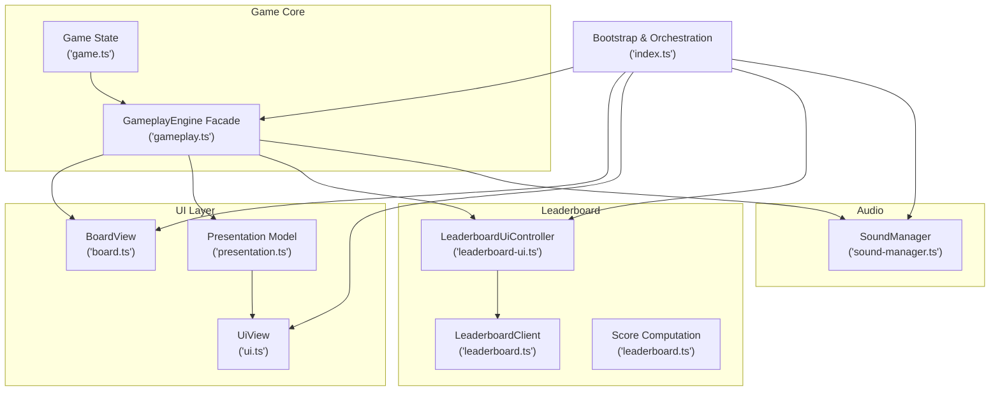
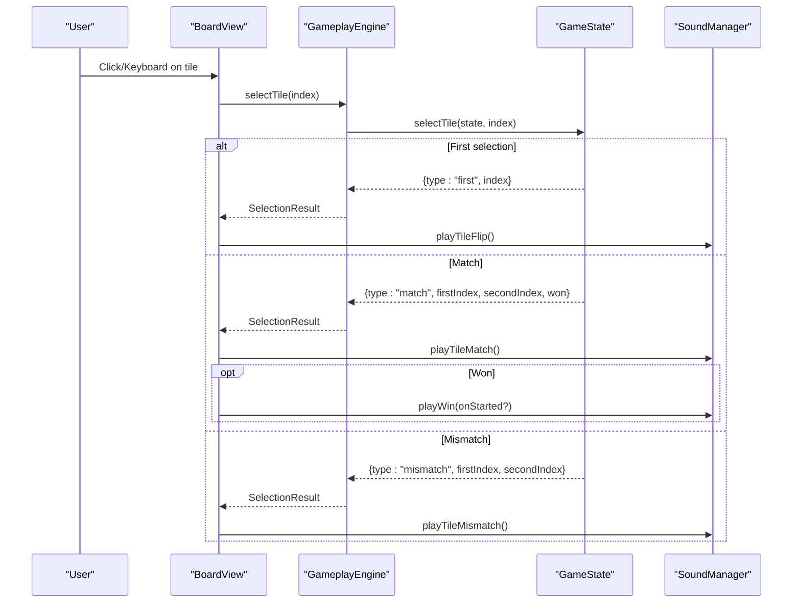
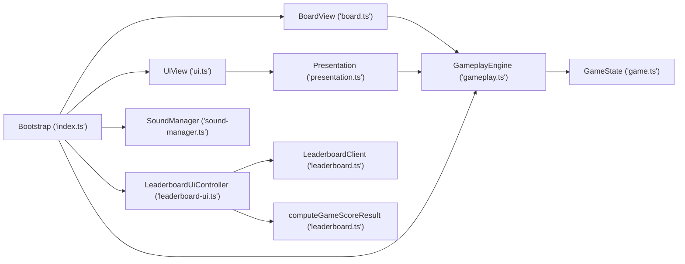

# API Reference

<cite>
**Referenced Files in This Document**
- [game.ts](file://src/game.ts)
- [gameplay.ts](file://src/gameplay.ts)
- [board.ts](file://src/board.ts)
- [leaderboard.ts](file://src/leaderboard.ts)
- [leaderboard-ui.ts](file://src/leaderboard-ui.ts)
- [sound-manager.ts](file://src/sound-manager.ts)
- [index.ts](file://src/index.ts)
- [presentation.ts](file://src/presentation.ts)
- [session-score.ts](file://src/session-score.ts)
- [ui.ts](file://src/ui.ts)
- [difficulty.ts](file://src/difficulty.ts)
- [icons.ts](file://src/icons.ts)
- [tile-layout.ts](file://src/tile-layout.ts)
- [leaderboard.cfg](file://config/leaderboard.cfg)
- [audio-formats.json](file://config/audio-formats.json)
</cite>

## Table of Contents
1. [Introduction](#introduction)
2. [Project Structure](#project-structure)
3. [Core Components](#core-components)
4. [Architecture Overview](#architecture-overview)
5. [Detailed Component Analysis](#detailed-component-analysis)
6. [Dependency Analysis](#dependency-analysis)
7. [Performance Considerations](#performance-considerations)
8. [Troubleshooting Guide](#troubleshooting-guide)
9. [Conclusion](#conclusion)
10. [Appendices](#appendices)

## Introduction
This API Reference documents the public interfaces and core classes of MemoryBlox. It focuses on:
- Game engine APIs for initialization, tile selection, win condition checks, and state queries
- GameplayEngine facade for simplified game operations
- Board rendering and interaction APIs
- Leaderboard system for score submission, retrieval, and persistence
- SoundManager for audio control, volume management, and mute functionality
It also covers TypeScript interfaces, type definitions, and event-driven communication patterns used by the application.

## Project Structure
MemoryBlox is organized around cohesive modules:
- Game logic: game.ts, gameplay.ts
- UI rendering and interaction: board.ts, ui.ts, presentation.ts
- Scoring and leaderboard: leaderboard.ts, leaderboard-ui.ts, session-score.ts
- Audio subsystem: sound-manager.ts, audio loader/engine utilities
- Bootstrap and orchestration: index.ts
- Configuration and assets: difficulty.ts, icons.ts, tile-layout.ts, leaderboard.cfg, audio-formats.json

**Diagram sources**
- [game.ts:1-419](file://src/game.ts#L1-L419)
- [gameplay.ts:1-107](file://src/gameplay.ts#L1-L107)
- [board.ts:1-523](file://src/board.ts#L1-L523)
- [presentation.ts:1-25](file://src/presentation.ts#L1-L25)
- [ui.ts:1-49](file://src/ui.ts#L1-L49)
- [leaderboard.ts:1-541](file://src/leaderboard.ts#L1-L541)
- [leaderboard-ui.ts:1-234](file://src/leaderboard-ui.ts#L1-L234)
- [sound-manager.ts:1-462](file://src/sound-manager.ts#L1-L462)
- [index.ts:1-1100](file://src/index.ts#L1-L1100)

**Section sources**
- [index.ts:1-1100](file://src/index.ts#L1-L1100)
- [game.ts:1-419](file://src/game.ts#L1-L419)
- [gameplay.ts:1-107](file://src/gameplay.ts#L1-L107)
- [board.ts:1-523](file://src/board.ts#L1-L523)
- [leaderboard.ts:1-541](file://src/leaderboard.ts#L1-L541)
- [leaderboard-ui.ts:1-234](file://src/leaderboard-ui.ts#L1-L234)
- [sound-manager.ts:1-462](file://src/sound-manager.ts#L1-L462)
- [presentation.ts:1-25](file://src/presentation.ts#L1-L25)
- [ui.ts:1-49](file://src/ui.ts#L1-L49)
- [difficulty.ts:1-40](file://src/difficulty.ts#L1-L40)
- [icons.ts:1-726](file://src/icons.ts#L1-L726)
- [tile-layout.ts:1-54](file://src/tile-layout.ts#L1-L54)
- [leaderboard.cfg:1-17](file://config/leaderboard.cfg#L1-L17)
- [audio-formats.json:1-4](file://config/audio-formats.json#L1-L4)

## Core Components
This section documents the primary public APIs and their responsibilities.

- Game (state and operations)
  - Purpose: Encapsulates game state, tile selection, win condition, and timing.
  - Key exports: TileStatus, Tile, GameState, SelectionResult, NearWinPreparationResult, createGame, selectTile, resolveMismatch, resetGame, getElapsedTimeMs, findFirstUnmatchedPairIndices, getRemainingUnmatchedPairCount, prepareNearWinState.
  - Notable behaviors: O(1) win-check via cached remainingPairCount; auto-resolve mismatch when a new selection is made while a mismatch is still open; strict validation of deck size and tile parity.

- GameplayEngine (facade)
  - Purpose: Thin facade over game state operations to simplify integration and testing.
  - Key export: GameplayEngine interface and DefaultGameplayEngine implementation.
  - Methods: selectTile, resolveMismatch, reset, getElapsedTimeMs, getTiles, getColumns, getAttempts, isWon, findFirstUnmatchedPairIndices, getRemainingUnmatchedPairCount, prepareNearWinState.
  - Factory: createGameplayEngine(rows, columns, deck) initializes a GameplayEngine backed by GameState.

- BoardView (rendering and interaction)
  - Purpose: Renders the board, handles tile click/key events, and applies animations.
  - Key exports: BoardView class, BoardTileStatus, BoardTileViewModel, BoardLayoutConfig.
  - Methods: render(tiles, columns), setLayoutConfig(config), animateMatchedPair(firstIndex, secondIndex, pauseMs), resetBackFaceCache().
  - Event handling: Click and keyboard navigation via delegated listeners; parses index from dataset and invokes onTileSelect.

- Leaderboard system
  - LeaderboardClient: Local persistence using localStorage; fetchTopScores, submitScore, isEnabled.
  - LeaderboardUiController: UI integration for leaderboard display and submission; refresh, submitWin, isEnabled, getScoringConfig.
  - Scoring: computeGameScoreResult(input, scoringConfig) and helpers for penalties, multipliers, and ranking.

- SoundManager
  - Purpose: Manages audio loading, selection, and playback; supports categories (flip, match, mismatch, new game, win).
  - Key methods: initialize(), getSoundMuted(), setSoundMuted(muted), playTileFlip(), playTileMatch(), playTileMismatch(), playWin(onStarted?), playNewGame().
  - Discovery: Discovers audio files from multiple sources (JSON index, asset-index endpoint, HTML directory listing).

- Presentation and UI
  - createGamePresentationModel(gameplay) produces a view model for rendering.
  - UiView updates HUD elements (time, attempts, status).

**Section sources**
- [game.ts:1-419](file://src/game.ts#L1-L419)
- [gameplay.ts:1-107](file://src/gameplay.ts#L1-L107)
- [board.ts:1-523](file://src/board.ts#L1-L523)
- [leaderboard.ts:1-541](file://src/leaderboard.ts#L1-L541)
- [leaderboard-ui.ts:1-234](file://src/leaderboard-ui.ts#L1-L234)
- [sound-manager.ts:1-462](file://src/sound-manager.ts#L1-L462)
- [presentation.ts:1-25](file://src/presentation.ts#L1-L25)
- [ui.ts:1-49](file://src/ui.ts#L1-L49)

## Architecture Overview
The application follows a layered architecture:
- Bootstrap layer orchestrates UI, audio, leaderboard, and gameplay.
- GameplayEngine abstracts state mutations behind a typed facade.
- BoardView renders the game board and translates user actions into gameplay operations.
- LeaderboardUiController coordinates UI and persistence for scores.
- SoundManager encapsulates audio discovery and playback.

**Diagram sources**
- [board.ts:155-225](file://src/board.ts#L155-L225)
- [gameplay.ts:43-93](file://src/gameplay.ts#L43-L93)
- [game.ts:159-243](file://src/game.ts#L159-L243)
- [sound-manager.ts:308-321](file://src/sound-manager.ts#L308-L321)

**Section sources**
- [index.ts:639-780](file://src/index.ts#L639-L780)
- [board.ts:121-523](file://src/board.ts#L121-L523)
- [gameplay.ts:28-107](file://src/gameplay.ts#L28-L107)
- [game.ts:61-138](file://src/game.ts#L61-L138)
- [sound-manager.ts:238-462](file://src/sound-manager.ts#L238-L462)

## Detailed Component Analysis

### Game API
Public types and functions for game logic.

- Types
  - TileStatus: "hidden" | "revealed" | "matched" | "blocked"
  - Tile: id, pairId, icon, status
  - GameState: rows, columns, tiles, totalMatchableGroups, remainingPairCount, firstSelection, secondSelection, attempts, matches, isBoardLocked, isWon, startedAt, endedAt
  - SelectionResult: "ignored" | "first" | "match" | "mismatch"
  - NearWinPreparationResult: remainingPair, matchedPairs

- Functions
  - createGame(options: { rows, columns, deck }): GameState
    - Validates deck size equals rows×columns and that matchable tiles are even.
    - Initializes tiles with pairIds and computes totalMatchableGroups and initial remainingPairCount.
  - selectTile(state: GameState, index: number): SelectionResult
    - Throws RangeError for out-of-bounds index.
    - Auto-resolves prior mismatch if board is locked and both selections are set.
    - Updates tile status, tracks attempts/matches, locks board on mismatch, decrements remainingPairCount on match.
    - Throws on state corruption (attempting to match when remainingPairCount is zero).
  - resolveMismatch(state, firstIndex, secondIndex): void
    - Resets revealed tiles back to hidden and clears selections.
  - resetGame(state, deck: string[]): void
    - Recreates game with new deck while preserving dimensions.
  - getElapsedTimeMs(state: GameState): number
    - Uses performance.now(); continues counting in background tabs.
  - findFirstUnmatchedPairIndices(state: GameState): [number, number] | null
    - Linear scan to find first non-blocked, non-matched pair.
  - getRemainingUnmatchedPairCount(state: GameState): number
    - O(1) access to cached value.
  - prepareNearWinState(state: GameState): NearWinPreparationResult
    - Prepares a near-win scenario by hiding exactly one pair and marking extras as matched.

- Error conditions
  - Deck size mismatch vs board area
  - Odd number of matchable tiles
  - Out-of-bounds tile index
  - State corruption (matching when no pairs remain)

- Practical usage patterns
  - Initialize with createGame(options) and wrap with GameplayEngine for typed access.
  - On user tile selection, call selectTile and branch on SelectionResult to trigger audio and animations.
  - Use getRemainingUnmatchedPairCount for efficient win detection.

**Section sources**
- [game.ts:1-419](file://src/game.ts#L1-L419)

### GameplayEngine Facade
- Interface
  - state: GameState (read-only via facade)
  - selectTile(index): SelectionResult
  - resolveMismatch(firstIndex, secondIndex): void
  - reset(deck: string[]): void
  - getElapsedTimeMs(): number
  - getTiles(): readonly Tile[]
  - getColumns(): number
  - getAttempts(): number
  - isWon(): boolean
  - findFirstUnmatchedPairIndices(): [number, number] | null
  - getRemainingUnmatchedPairCount(): number
  - prepareNearWinState(): NearWinPreparationResult

- Implementation
  - DefaultGameplayEngine delegates to free functions in game.ts.
  - Provides a seam for testing by allowing substitution of a mock engine.

- Integration
  - Create via createGameplayEngine({ rows, columns, deck }).
  - Use in bootstrap layer to drive BoardView and UI updates.

**Section sources**
- [gameplay.ts:1-107](file://src/gameplay.ts#L1-L107)

### BoardView Rendering and Interaction
- Rendering
  - render(tiles: readonly BoardTileViewModel[], columns: number): void
    - Computes board width, grid template, ensures button count, and updates each tile’s front/back faces.
    - Lazily renders back faces only when revealed or matched to minimize DOM work.
    - Applies CSS classes for blocked/revealed/matched states and disables matched/blocked buttons.
  - resetBackFaceCache(): void
    - Clears lazy-render cache to force re-render on next render() call.

- Layout
  - setLayoutConfig(layoutConfig: BoardLayoutConfig): void
    - Clamps and rounds layout values to safe integers.

- Animations
  - animateMatchedPair(firstIndex, secondIndex, pauseMs): void
    - Adds CSS class for matched disappearance after a timeout.

- Event handling
  - Delegated click listener on container finds button by dataset index and invokes onTileSelect.
  - Keyboard navigation: Arrow keys move focus to adjacent tiles respecting grid boundaries.

- Accessibility
  - Front/back faces marked aria-hidden; accessibility provided by button aria-label and aria-pressed attributes.

- Practical usage
  - Render after each gameplay state change.
  - Call animateMatchedPair on match results.
  - Ensure layout config matches computed tile size.

**Section sources**
- [board.ts:121-523](file://src/board.ts#L121-L523)

### Leaderboard System
- LeaderboardClient (local persistence)
  - isEnabled(): boolean
  - fetchTopScores(): Promise<LeaderboardScoreEntry[]>
  - submitScore(score: LeaderboardScoreSubmission): Promise<void>
  - Internally uses localStorage with size limits and warnings.

- LeaderboardUiController (UI integration)
  - isEnabled(): boolean
  - getScoringConfig(): Readonly<LeaderboardScoringConfig>
  - refresh(): Promise<void>
  - submitWin(input: SubmitWinToLeaderboardInput): Promise<void>
  - Renders top N entries and highlights the last submitted entry.

- Scoring computation
  - computeGameScoreResult(input, scoringConfig): GameScoreComputationResult
  - Factors: difficulty multiplier, portrait bonus, tile penalty, penalties for debug/auto-demo modes, flip-tiles rule.
  - Ranking prioritizes score value, then creation time, then time/attempts tiebreakers.

- Persistence and configuration
  - Storage key: memoryblox.leaderboard
  - Max payload size: 512 KB; warns when approaching 80% threshold
  - Runtime config: leaderboard.enabled, leaderboard.maxEntries, scoring factors

- Practical usage
  - After a win, compute score via computeGameScoreResult and call submitWin.
  - Refresh leaderboard display after submission.

**Section sources**
- [leaderboard.ts:1-541](file://src/leaderboard.ts#L1-L541)
- [leaderboard-ui.ts:1-234](file://src/leaderboard-ui.ts#L1-L234)
- [session-score.ts:1-24](file://src/session-score.ts#L1-L24)
- [leaderboard.cfg:1-17](file://config/leaderboard.cfg#L1-L17)

### SoundManager
- Initialization
  - initialize(): Promise<void>
    - Discovers audio files from ./sound via multiple strategies (JSON index, asset-index endpoint, HTML directory listing).
    - Preloads discovered files and seeds category-specific pickers.
    - Reads/writes mute preference from localStorage.

- Playback
  - playTileFlip(): Promise<void>
  - playTileMatch(): Promise<void>
  - playTileMismatch(): Promise<void>
  - playWin(onStarted?): Promise<number | null>
  - playNewGame(): Promise<void>
  - Non-critical new-game FX is fire-and-forget with error suppression.

- Control
  - getSoundMuted(): boolean
  - setSoundMuted(muted: boolean): void

- File discovery utilities
  - selectTileFlipFiles(files), selectMatchFiles(files), selectMismatchFiles(files), selectNewGameFiles(files), selectWinFiles(files), selectGeneralFxFiles(files)
  - parseDirectoryListingForAudioFiles(html): string[]
  - Pattern constants for supported extensions

- Practical usage
  - Initialize SoundManager early; call appropriate play* methods on game events.
  - Respect getSoundMuted/setSoundMuted for UI toggles.

**Section sources**
- [sound-manager.ts:1-462](file://src/sound-manager.ts#L1-L462)
- [audio-formats.json:1-4](file://config/audio-formats.json#L1-L4)

### Presentation and UI Integration
- createGamePresentationModel(gameplay: GameplayEngine): GamePresentationModel
  - Produces boardTiles, columns, attempts, and formatted elapsedTime for rendering.

- UiView
  - setTime(value: string): void
  - setAttempts(value: number): void
  - setStatus(message: string): void

- Bootstrap integration
  - startHudTimer periodically updates UiView with formatted elapsed time from GameplayEngine.
  - render() creates presentation model and passes tiles to BoardView.

**Section sources**
- [presentation.ts:1-25](file://src/presentation.ts#L1-L25)
- [ui.ts:1-49](file://src/ui.ts#L1-L49)
- [index.ts:781-800](file://src/index.ts#L781-L800)

## Dependency Analysis
- Internal dependencies
  - GameplayEngine depends on GameState and free functions in game.ts.
  - BoardView depends on BoardTileViewModel and icon asset utilities.
  - LeaderboardUiController depends on LeaderboardClient and scoring computation.
  - Bootstrap orchestrates GameplayEngine, BoardView, UiView, LeaderboardUiController, and SoundManager.
- External dependencies
  - Audio discovery relies on fetch and localStorage.
  - Configuration files (leaderboard.cfg, audio-formats.json) inform runtime behavior.

**Diagram sources**
- [gameplay.ts:1-107](file://src/gameplay.ts#L1-L107)
- [game.ts:1-419](file://src/game.ts#L1-L419)
- [board.ts:1-523](file://src/board.ts#L1-L523)
- [presentation.ts:1-25](file://src/presentation.ts#L1-L25)
- [ui.ts:1-49](file://src/ui.ts#L1-L49)
- [leaderboard-ui.ts:1-234](file://src/leaderboard-ui.ts#L1-L234)
- [leaderboard.ts:1-541](file://src/leaderboard.ts#L1-L541)
- [index.ts:1-1100](file://src/index.ts#L1-L1100)
- [sound-manager.ts:1-462](file://src/sound-manager.ts#L1-L462)

**Section sources**
- [index.ts:1-1100](file://src/index.ts#L1-L1100)
- [gameplay.ts:1-107](file://src/gameplay.ts#L1-L107)
- [board.ts:1-523](file://src/board.ts#L1-L523)
- [leaderboard-ui.ts:1-234](file://src/leaderboard-ui.ts#L1-L234)
- [leaderboard.ts:1-541](file://src/leaderboard.ts#L1-L541)
- [sound-manager.ts:1-462](file://src/sound-manager.ts#L1-L462)

## Performance Considerations
- Game state
  - Remaining unmatched pairs are cached for O(1) win checks.
  - Lazy back-face rendering in BoardView minimizes DOM and image fetch work.
- Audio
  - Preloading reduces latency; category pickers rotate sounds randomly.
  - New-game FX is non-blocking; failures are suppressed to keep gameplay smooth.
- UI
  - Presentation model construction is lightweight; avoid unnecessary re-renders by passing unchanged tiles.

[No sources needed since this section provides general guidance]

## Troubleshooting Guide
- Game errors
  - Deck size mismatch or odd matchable tile count: thrown during createGame.
  - Out-of-bounds index: thrown during selectTile.
  - State corruption (matching when no pairs remain): indicates external mutation or misuse.
- BoardView
  - If tiles flicker or do not render back faces, call resetBackFaceCache() before render() after switching icon packs.
  - Keyboard navigation requires proper dataset index attributes on buttons.
- Leaderboard
  - If localStorage is full or malformed, logs warnings and falls back to empty entries.
  - Ensure leaderboard.enabled is true and maxEntries is reasonable.
- SoundManager
  - If audio does not play, ensure initialize() is awaited and device policies allow autoplay.
  - Mute state persists in localStorage; verify setSoundMuted is called and persisted.

**Section sources**
- [game.ts:61-138](file://src/game.ts#L61-L138)
- [game.ts:159-243](file://src/game.ts#L159-L243)
- [board.ts:316-318](file://src/board.ts#L316-L318)
- [leaderboard.ts:374-422](file://src/leaderboard.ts#L374-L422)
- [sound-manager.ts:264-297](file://src/sound-manager.ts#L264-L297)

## Conclusion
MemoryBlox exposes clean, typed APIs for game logic, rendering, scoring, and audio. The facade pattern in GameplayEngine simplifies integration, while BoardView and UiView provide robust rendering and feedback. The leaderboard and sound systems are self-contained and configurable, enabling flexible deployment and customization.

[No sources needed since this section summarizes without analyzing specific files]

## Appendices

### API Method Signatures and Descriptions

- Game
  - createGame(options): GameState
    - Parameters: rows, columns, deck
    - Returns: Initial GameState
    - Errors: Deck size mismatch, odd matchable tiles
  - selectTile(state, index): SelectionResult
    - Parameters: state (in-place), index
    - Returns: ignored | first | match | mismatch
    - Errors: RangeError for invalid index
  - resolveMismatch(state, firstIndex, secondIndex): void
  - resetGame(state, deck): void
  - getElapsedTimeMs(state): number
  - findFirstUnmatchedPairIndices(state): [number, number] | null
  - getRemainingUnmatchedPairCount(state): number
  - prepareNearWinState(state): NearWinPreparationResult

- GameplayEngine
  - selectTile(index): SelectionResult
  - resolveMismatch(firstIndex, secondIndex): void
  - reset(deck: string[]): void
  - getElapsedTimeMs(): number
  - getTiles(): readonly Tile[]
  - getColumns(): number
  - getAttempts(): number
  - isWon(): boolean
  - findFirstUnmatchedPairIndices(): [number, number] | null
  - getRemainingUnmatchedPairCount(): number
  - prepareNearWinState(): NearWinPreparationResult

- BoardView
  - render(tiles, columns): void
  - setLayoutConfig(config): void
  - animateMatchedPair(firstIndex, secondIndex, pauseMs): void
  - resetBackFaceCache(): void

- LeaderboardClient
  - isEnabled(): boolean
  - fetchTopScores(): Promise<LeaderboardScoreEntry[]>
  - submitScore(score): Promise<void>

- LeaderboardUiController
  - isEnabled(): boolean
  - getScoringConfig(): Readonly<LeaderboardScoringConfig>
  - refresh(): Promise<void>
  - submitWin(input): Promise<void>

- SoundManager
  - initialize(): Promise<void>
  - getSoundMuted(): boolean
  - setSoundMuted(muted): void
  - playTileFlip(): Promise<void>
  - playTileMatch(): Promise<void>
  - playTileMismatch(): Promise<void>
  - playWin(onStarted?): Promise<number | null>
  - playNewGame(): Promise<void>

**Section sources**
- [game.ts:61-138](file://src/game.ts#L61-L138)
- [game.ts:159-243](file://src/game.ts#L159-L243)
- [gameplay.ts:28-107](file://src/gameplay.ts#L28-L107)
- [board.ts:227-306](file://src/board.ts#L227-L306)
- [board.ts:320-330](file://src/board.ts#L320-L330)
- [board.ts:331-354](file://src/board.ts#L331-L354)
- [board.ts:316-318](file://src/board.ts#L316-L318)
- [leaderboard.ts:424-454](file://src/leaderboard.ts#L424-L454)
- [leaderboard-ui.ts:78-172](file://src/leaderboard-ui.ts#L78-L172)
- [sound-manager.ts:264-343](file://src/sound-manager.ts#L264-L343)
- [sound-manager.ts:299-325](file://src/sound-manager.ts#L299-L325)
- [sound-manager.ts:308-321](file://src/sound-manager.ts#L308-L321)

### Practical Examples and Patterns

- Initialize a game and render the board
  - Create GameplayEngine with difficulty and emoji pack
  - Build presentation model and render BoardView
  - Start HUD timer and play new-game sound

- Handle tile selection
  - On tile click, call GameplayEngine.selectTile(index)
  - Branch on SelectionResult to play audio and animate matched pairs
  - On mismatch, schedule resolveMismatch after delay

- Submit a score
  - Compute score via computeGameScoreResult
  - Call LeaderboardUiController.submitWin with session metadata
  - Refresh leaderboard display

- Manage audio
  - Initialize SoundManager at startup
  - Toggle mute via setSoundMuted and reflect in UI

**Section sources**
- [index.ts:586-622](file://src/index.ts#L586-L622)
- [index.ts:639-780](file://src/index.ts#L639-L780)
- [leaderboard-ui.ts:119-172](file://src/leaderboard-ui.ts#L119-L172)
- [sound-manager.ts:264-297](file://src/sound-manager.ts#L264-L297)

### TypeScript Interfaces and Type Definitions

- Game
  - TileStatus, Tile, GameState, SelectionResult, NearWinPreparationResult

- GameplayEngine
  - GameplayEngine interface and DefaultGameplayEngine

- Board
  - BoardTileStatus, BoardTileViewModel, BoardLayoutConfig
  - BoardView class

- Leaderboard
  - LeaderboardScoringConfig, LeaderboardRuntimeConfig, LeaderboardScoreEntry, LeaderboardScoreSubmission
  - LeaderboardClient, LeaderboardUiController
  - GameScoreComputationResult, GameScoreComputationInput

- SoundManager
  - SoundManager class, file selection utilities

- UI
  - UiView class

- Supporting
  - DifficultyConfig, EmojiPackId, TileLayout

**Section sources**
- [game.ts:1-419](file://src/game.ts#L1-L419)
- [gameplay.ts:28-107](file://src/gameplay.ts#L28-L107)
- [board.ts:6-29](file://src/board.ts#L6-L29)
- [board.ts:121-523](file://src/board.ts#L121-L523)
- [leaderboard.ts:4-87](file://src/leaderboard.ts#L4-L87)
- [leaderboard.ts:362-455](file://src/leaderboard.ts#L362-L455)
- [leaderboard-ui.ts:51-172](file://src/leaderboard-ui.ts#L51-L172)
- [sound-manager.ts:238-462](file://src/sound-manager.ts#L238-L462)
- [ui.ts:15-49](file://src/ui.ts#L15-L49)
- [difficulty.ts:9-39](file://src/difficulty.ts#L9-L39)
- [icons.ts:7-22](file://src/icons.ts#L7-L22)
- [tile-layout.ts:12-53](file://src/tile-layout.ts#L12-L53)

### Event-Driven Communication Patterns
- Bootstrap layer wires user interactions to gameplay operations and UI updates.
- BoardView emits tile selection events to the bootstrap layer via onTileSelect.
- GameplayEngine encapsulates state transitions; UI reacts to changes via presentation model updates.
- Audio playback is triggered by game events; SoundManager manages discovery and playback lifecycle.

**Section sources**
- [index.ts:639-780](file://src/index.ts#L639-L780)
- [board.ts:155-225](file://src/board.ts#L155-L225)
- [presentation.ts:12-24](file://src/presentation.ts#L12-L24)