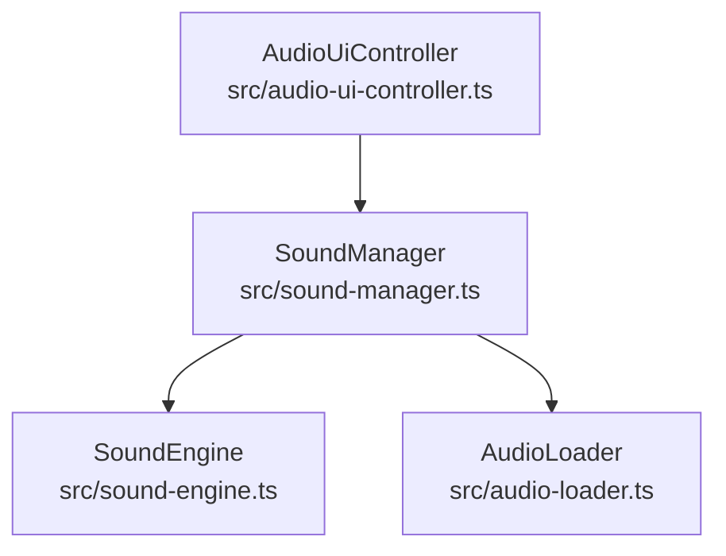
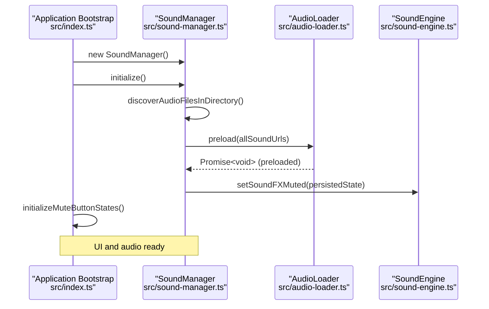
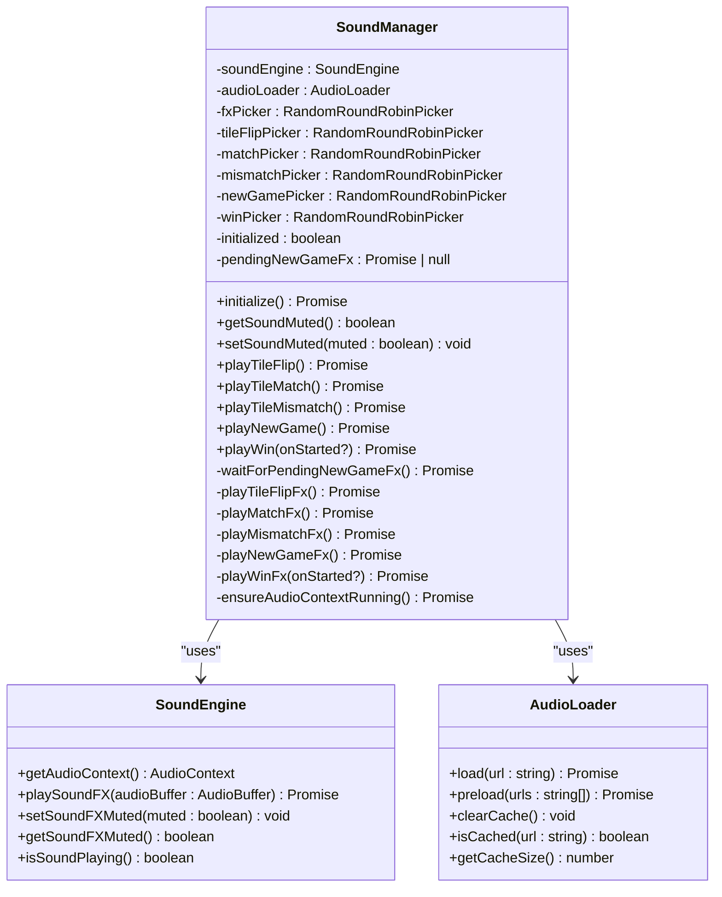
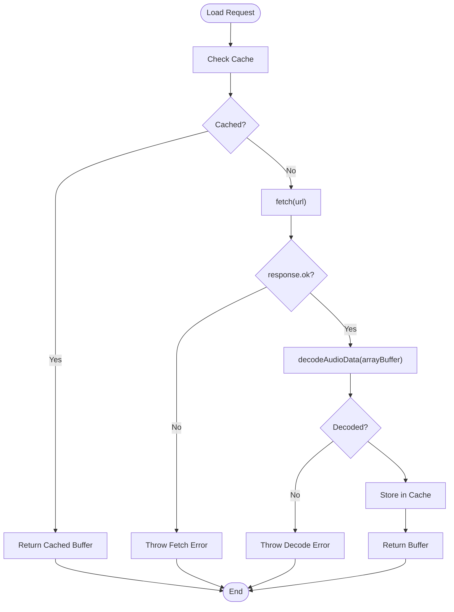
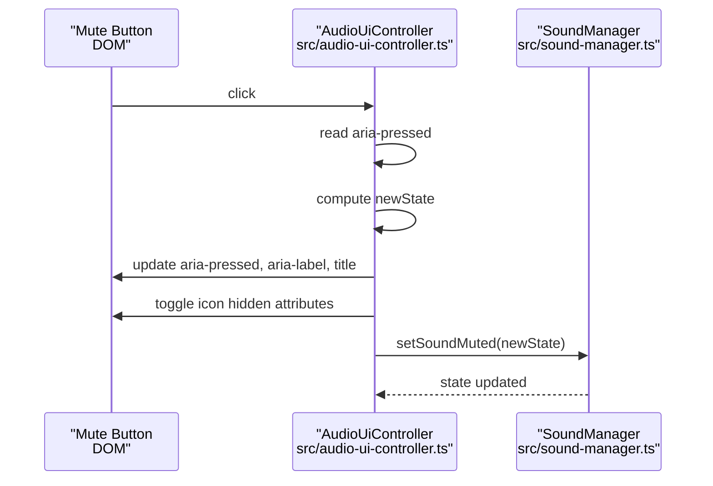
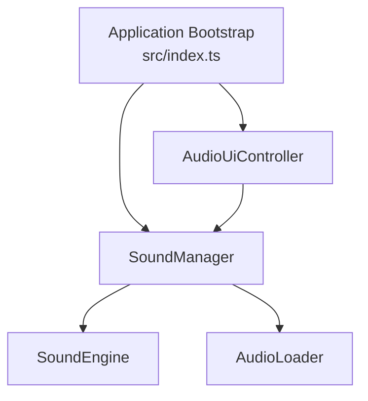

# Audio System API

<cite>
**Referenced Files in This Document**
- [sound-manager.ts](file://src/sound-manager.ts)
- [audio-loader.ts](file://src/audio-loader.ts)
- [audio-ui-controller.ts](file://src/audio-ui-controller.ts)
- [sound-engine.ts](file://src/sound-engine.ts)
- [sound-engine-plan.md](file://docs/sound-engine-plan.md)
- [index.ts](file://src/index.ts)
- [sound-manager.test.ts](file://tests/sound-manager.test.ts)
- [audio-loader.test.ts](file://tests/audio-loader.test.ts)
- [audio-ui-controller.test.ts](file://tests/audio-ui-controller.test.ts)
- [sound-engine.test.ts](file://tests/sound-engine.test.ts)
- [audio-formats.json](file://config/audio-formats.json)
</cite>

## Table of Contents
1. [Introduction](#introduction)
2. [Project Structure](#project-structure)
3. [Core Components](#core-components)
4. [Architecture Overview](#architecture-overview)
5. [Detailed Component Analysis](#detailed-component-analysis)
6. [Dependency Analysis](#dependency-analysis)
7. [Performance Considerations](#performance-considerations)
8. [Troubleshooting Guide](#troubleshooting-guide)
9. [Conclusion](#conclusion)
10. [Appendices](#appendices)

## Introduction
This document provides comprehensive API documentation for the SoundManager and audio control system. It covers the SoundManager class methods for audio playback control, volume management, and mute functionality; the audio loader interface for asset discovery, loading, and caching; and the audio UI controller methods for user interaction with audio settings. It also documents sound effect playback, background music control, volume adjustment, and audio state management, along with examples of audio integration patterns, browser audio API limitations, performance optimization techniques, and error handling for audio loading failures and user permission requirements.

## Project Structure
The audio system consists of four core modules:
- SoundManager: High-level controller that orchestrates game events and delegates to SoundEngine and AudioLoader.
- SoundEngine: Low-level Web Audio API engine responsible for sound FX playback and mute state.
- AudioLoader: Asset loader and cache for audio buffers.
- AudioUiController: UI state synchronization for mute controls.

**Diagram sources**
- [sound-manager.ts:238-462](file://src/sound-manager.ts#L238-L462)
- [sound-engine.ts:8-110](file://src/sound-engine.ts#L8-L110)
- [audio-loader.ts:7-118](file://src/audio-loader.ts#L7-L118)
- [audio-ui-controller.ts:22-56](file://src/audio-ui-controller.ts#L22-L56)

**Section sources**
- [sound-manager.ts:1-462](file://src/sound-manager.ts#L1-L462)
- [sound-engine.ts:1-110](file://src/sound-engine.ts#L1-L110)
- [audio-loader.ts:1-118](file://src/audio-loader.ts#L1-L118)
- [audio-ui-controller.ts:1-56](file://src/audio-ui-controller.ts#L1-L56)

## Core Components
This section documents the public APIs of each core component.

### SoundManager
SoundManager is the central coordinator for audio events in the game. It initializes asset discovery, preloads audio, manages mute state persistence, and provides convenience methods for game actions.

Key capabilities:
- Asset discovery and preprocessing: Discovers audio files from the ./sound directory using multiple strategies (JSON index, asset-index endpoint, HTML directory listing), filters by file patterns, and builds absolute URLs.
- Playback orchestration: Provides methods for tile flip, match, mismatch, new game, and win sounds, each selecting from categorized pools and ensuring proper sequencing.
- Mute management: Exposes getSoundMuted and setSoundMuted with persistent storage via localStorage.
- Audio context lifecycle: Ensures the Web Audio API context is running before playback.

Public methods:
- initialize(): Promise<void> - Initializes SoundManager by discovering audio files, building categorized pools, applying persisted mute state, and preloading assets.
- getSoundMuted(): boolean - Returns current mute state.
- setSoundMuted(muted: boolean): void - Sets mute state and persists it to localStorage.
- playTileFlip(): Promise<void> - Plays a random tile flip sound from the flip* pool.
- playTileMatch(): Promise<void> - Plays a random match sound from the match* pool.
- playTileMismatch(): Promise<void> - Plays a random mismatch sound from the mismatch* pool.
- playNewGame(): Promise<void> - Plays a new game sound from the newgame* pool, with debouncing to prevent overlapping.
- playWin(onStarted?: (durationMs: number) => void): Promise<number | null> - Plays a win sound from the win* pool, invoking onStarted with duration and returning the duration.

Behavioral notes:
- Non-critical new-game FX playback failures are caught and logged to avoid disrupting gameplay.
- Ensures AudioContext is resumed before playback to satisfy browser autoplay policies.
- Uses round-robin selection across categorized pools to distribute audio variety.

**Section sources**
- [sound-manager.ts:238-462](file://src/sound-manager.ts#L238-L462)
- [sound-manager.test.ts:111-768](file://tests/sound-manager.test.ts#L111-L768)

### SoundEngine
SoundEngine encapsulates Web Audio API operations for one-shot sound effects playback and mute control.

Key capabilities:
- AudioContext management: Creates and exposes an AudioContext.
- Sound FX playback: Plays one-shot AudioBuffer instances, stopping any currently playing FX.
- Mute control: Respects mute state and adjusts gain accordingly.
- State queries: Reports whether a sound is currently playing.

Public methods:
- getAudioContext(): AudioContext - Returns the underlying Web Audio API context.
- playSoundFX(audioBuffer: AudioBuffer): Promise<void> - Plays the given AudioBuffer and resolves when playback completes.
- setSoundFXMuted(muted: boolean): void - Sets mute state and updates gain immediately if FX is playing.
- getSoundFXMuted(): boolean - Returns current mute state.
- isSoundPlaying(): boolean - Returns true if a sound effect is currently playing.

Behavioral notes:
- Automatically stops any currently playing FX before starting a new one.
- Gain adjustments are applied immediately when muting during active playback.

**Section sources**
- [sound-engine.ts:8-110](file://src/sound-engine.ts#L8-L110)
- [sound-engine.test.ts:90-227](file://tests/sound-engine.test.ts#L90-L227)

### AudioLoader
AudioLoader handles fetching, decoding, and caching of audio assets.

Key capabilities:
- Load and decode: Fetches audio data and decodes it into AudioBuffer instances using the Web Audio API.
- Caching: Stores decoded buffers in an internal Map to avoid redundant fetches.
- Bulk loading: Preloads multiple URLs concurrently and reports failures individually.
- Cache inspection and management: Provides methods to check cache presence, size, and clear the cache.

Public methods:
- load(url: string): Promise<AudioBuffer> - Loads and decodes an audio file, returning a cached buffer if available.
- preload(urls: string[]): Promise<void> - Preloads multiple files concurrently, logging failures without throwing.
- clearCache(): void - Clears all cached buffers.
- isCached(url: string): boolean - Checks if a URL is cached.
- getCacheSize(): number - Returns the number of cached buffers.

Behavioral notes:
- Throws descriptive errors on fetch or decode failures, wrapping original errors for context.
- Preload continues despite individual failures to maximize asset availability.

**Section sources**
- [audio-loader.ts:7-118](file://src/audio-loader.ts#L7-L118)
- [audio-loader.test.ts:20-228](file://tests/audio-loader.test.ts#L20-L228)

### AudioUiController
AudioUiController synchronizes UI mute button state with SoundManager and handles user interactions.

Key capabilities:
- Initialize mute button states: Reads SoundManager's mute state and sets aria attributes and icon visibility.
- Bind mute button listeners: Toggles mute state on click and updates UI accordingly.

Public methods:
- initializeMuteButtonStates(): void - Sets initial UI state based on SoundManager's mute state.
- bindMuteButtonListeners(): void - Attaches click handler to toggle mute and update UI.

Behavioral notes:
- Uses setAttribute/removeAttribute for SVG icon toggling to ensure compatibility across element types.
- Updates aria-pressed, aria-label, and title attributes for accessibility.

**Section sources**
- [audio-ui-controller.ts:22-56](file://src/audio-ui-controller.ts#L22-L56)
- [audio-ui-controller.test.ts:1-171](file://tests/audio-ui-controller.test.ts#L1-L171)

## Architecture Overview
The audio system integrates tightly with the application bootstrap and game logic. SoundManager is constructed early, initialized during bootstrap, and wired to UI and game events.

**Diagram sources**
- [index.ts:1074-1096](file://src/index.ts#L1074-L1096)
- [sound-manager.ts:264-297](file://src/sound-manager.ts#L264-L297)
- [audio-loader.ts:75-88](file://src/audio-loader.ts#L75-L88)
- [sound-engine.ts:82-99](file://src/sound-engine.ts#L82-L99)

## Detailed Component Analysis

### SoundManager Class
SoundManager coordinates asset discovery, categorization, and playback. It maintains separate round-robin selectors for each category and ensures safe playback sequencing.

**Diagram sources**
- [sound-manager.ts:238-462](file://src/sound-manager.ts#L238-L462)
- [sound-engine.ts:8-110](file://src/sound-engine.ts#L8-L110)
- [audio-loader.ts:7-118](file://src/audio-loader.ts#L7-L118)

**Section sources**
- [sound-manager.ts:238-462](file://src/sound-manager.ts#L238-L462)
- [sound-engine.ts:8-110](file://src/sound-engine.ts#L8-L110)
- [audio-loader.ts:7-118](file://src/audio-loader.ts#L7-L118)

### Audio Loader Interface
AudioLoader provides robust asset loading with caching and bulk preloading.

**Diagram sources**
- [audio-loader.ts:30-64](file://src/audio-loader.ts#L30-L64)

**Section sources**
- [audio-loader.ts:30-64](file://src/audio-loader.ts#L30-L64)
- [audio-loader.test.ts:39-107](file://tests/audio-loader.test.ts#L39-L107)

### Audio UI Controller Methods
AudioUiController binds UI interactions to SoundManager and manages accessibility attributes.

**Diagram sources**
- [audio-ui-controller.ts:47-54](file://src/audio-ui-controller.ts#L47-L54)
- [audio-ui-controller.test.ts:73-101](file://tests/audio-ui-controller.test.ts#L73-L101)

**Section sources**
- [audio-ui-controller.ts:32-54](file://src/audio-ui-controller.ts#L32-L54)
- [audio-ui-controller.test.ts:43-101](file://tests/audio-ui-controller.test.ts#L43-L101)

## Dependency Analysis
The audio system exhibits clean separation of concerns with explicit dependencies:
- SoundManager depends on SoundEngine and AudioLoader.
- AudioUiController depends on SoundManager.
- Application bootstrap constructs and wires these components.

**Diagram sources**
- [index.ts:241-249](file://src/index.ts#L241-L249)
- [sound-manager.ts:238-262](file://src/sound-manager.ts#L238-L262)
- [audio-ui-controller.ts:22-30](file://src/audio-ui-controller.ts#L22-L30)

**Section sources**
- [index.ts:241-249](file://src/index.ts#L241-L249)
- [sound-manager.ts:238-262](file://src/sound-manager.ts#L238-L262)
- [audio-ui-controller.ts:22-30](file://src/audio-ui-controller.ts#L22-L30)

## Performance Considerations
- Preloading: SoundManager preloads all discovered audio URLs during initialization to minimize latency during gameplay.
- Caching: AudioLoader caches decoded buffers to avoid repeated fetch and decode operations.
- Round-robin selection: RandomRoundRobinPicker shuffles categories to distribute audio variety and prevent repetition.
- Debounced new-game FX: Prevents overlapping playback and reduces resource contention.
- Gain control: Immediate gain updates when muting during active playback ensure responsive UI feedback.
- Memory management: clearCache can be used to free memory when many assets are loaded and no longer needed.

[No sources needed since this section provides general guidance]

## Troubleshooting Guide
Common issues and resolutions:
- AudioContext not running: ensureAudioContextRunning resumes the context before playback to satisfy browser autoplay policies.
- Mute state not persisting: verify localStorage availability and correct key usage ("memoryblox-sound-muted").
- Asset discovery failures: SoundManager tries multiple strategies (JSON index, asset-index endpoint, HTML directory listing) and logs discovered counts; verify server endpoints and directory permissions.
- Playback failures for non-critical FX: new-game FX failures are caught and logged; gameplay continues unaffected.
- UI mute button not updating: ensure bindMuteButtonListeners is called and aria-attributes are properly updated.

**Section sources**
- [sound-manager.ts:441-460](file://src/sound-manager.ts#L441-L460)
- [sound-manager.test.ts:157-171](file://tests/sound-manager.test.ts#L157-L171)
- [sound-manager.test.ts:712-765](file://tests/sound-manager.test.ts#L712-L765)
- [audio-ui-controller.test.ts:73-101](file://tests/audio-ui-controller.test.ts#L73-L101)

## Conclusion
The audio system provides a robust, modular architecture for sound effects playback in the browser. SoundManager orchestrates asset discovery, caching, and playback; SoundEngine manages Web Audio API operations; AudioLoader handles efficient loading and caching; and AudioUiController synchronizes UI state with audio behavior. Together, they deliver responsive, accessible, and maintainable audio integration suitable for cross-browser deployment.

[No sources needed since this section summarizes without analyzing specific files]

## Appendices

### Audio Integration Patterns
- Initialization: Construct SoundManager and call initialize during bootstrap; then initialize UI mute button states.
- Event-driven playback: Invoke SoundManager methods in response to game events (tile flip, match, mismatch, win, new game).
- Mute synchronization: Use AudioUiController to bind mute button interactions to SoundManager.setSoundMuted.

**Section sources**
- [index.ts:1074-1096](file://src/index.ts#L1074-L1096)
- [audio-ui-controller.ts:47-54](file://src/audio-ui-controller.ts#L47-L54)
- [sound-manager.test.ts:384-454](file://tests/sound-manager.test.ts#L384-L454)

### Browser Audio API Limitations
- Autoplay policies: Some browsers require user interaction before initializing AudioContext; ensureAudioContextRunning resumes the context prior to playback.
- Platform restrictions: Mobile platforms (iOS/Android) impose strict autoplay constraints; initialize on first user gesture.
- Format support: Supported extensions include mp3, wav, ogg, m4a as defined in configuration.

**Section sources**
- [sound-manager.ts:441-460](file://src/sound-manager.ts#L441-L460)
- [sound-engine-plan.md:368-370](file://docs/sound-engine-plan.md#L368-L370)
- [audio-formats.json:1-4](file://config/audio-formats.json#L1-L4)

### Error Handling Examples
- AudioLoader.load: Wraps fetch and decode errors with contextual messages and preserves original causes.
- AudioLoader.preload: Continues loading remaining assets upon individual failures and logs errors.
- SoundManager.playNewGame: Catches and warns on playback failures, ensuring pending state is cleared.

**Section sources**
- [audio-loader.ts:50-63](file://src/audio-loader.ts#L50-L63)
- [audio-loader.test.ts:74-106](file://tests/audio-loader.test.ts#L74-L106)
- [audio-loader.test.ts:128-161](file://tests/audio-loader.test.ts#L128-L161)
- [sound-manager.test.ts:712-765](file://tests/sound-manager.test.ts#L712-L765)