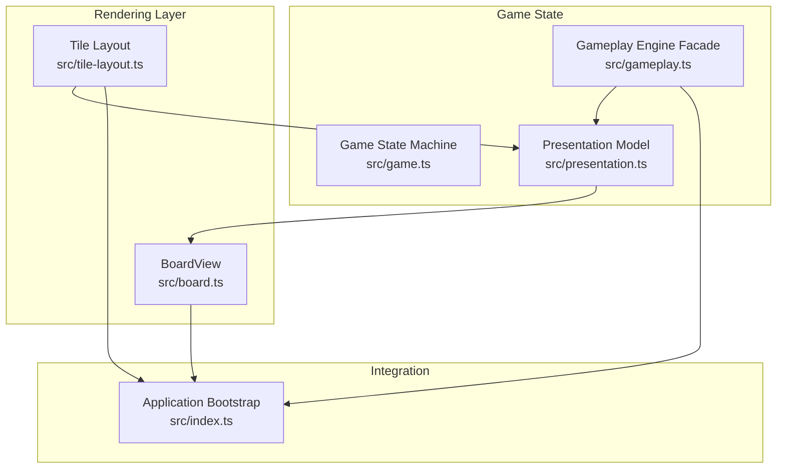
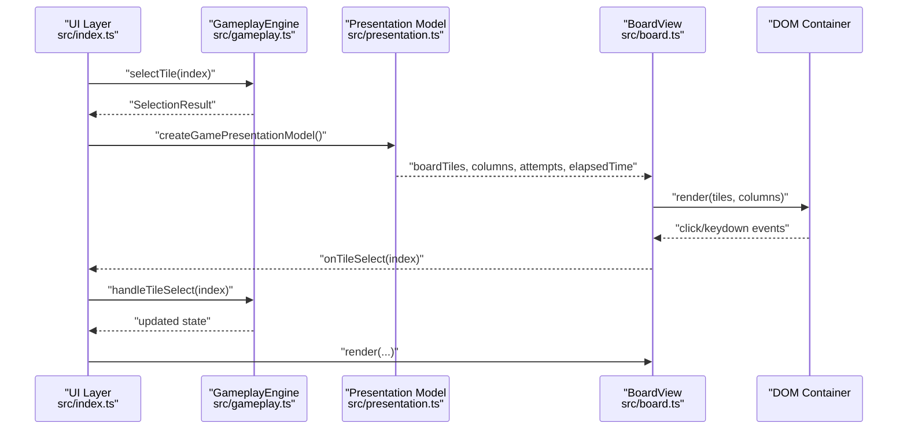
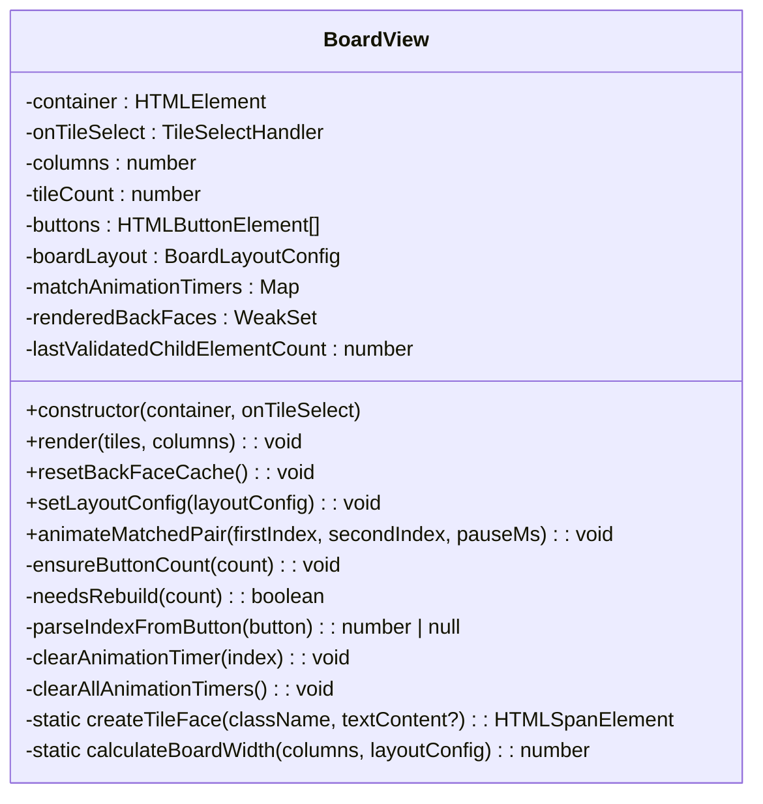
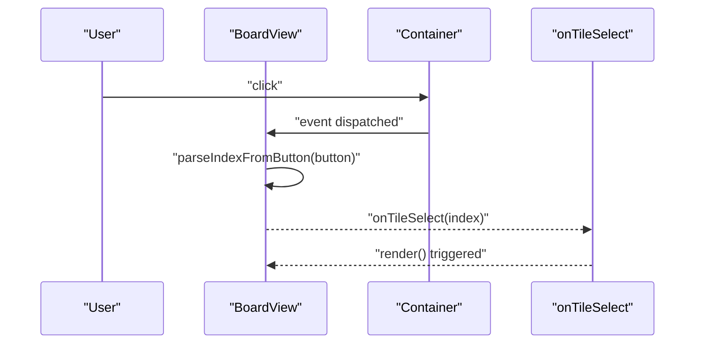
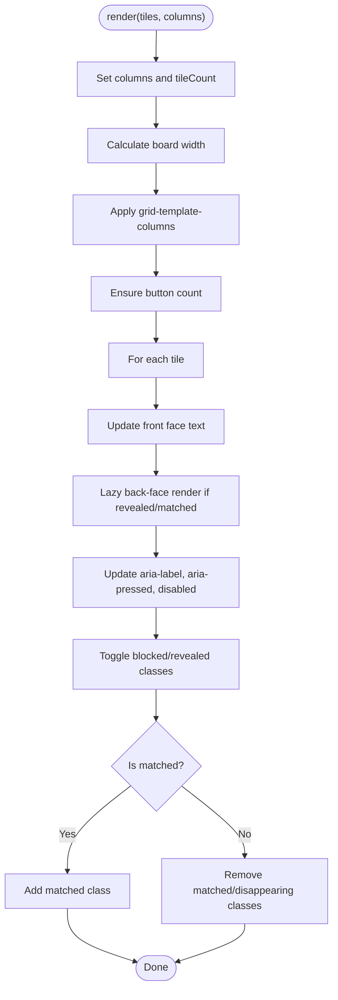
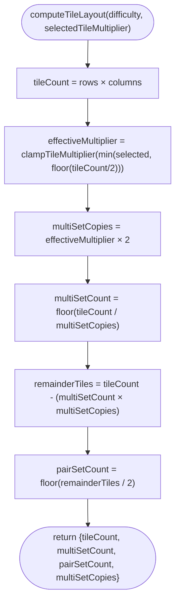
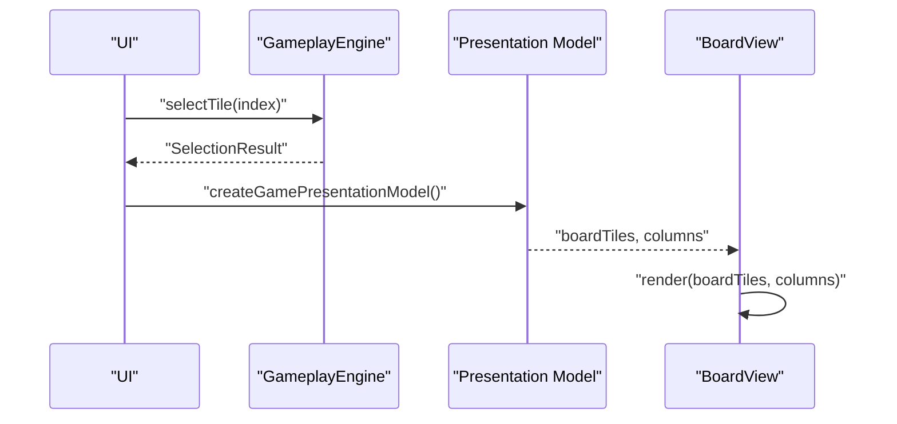
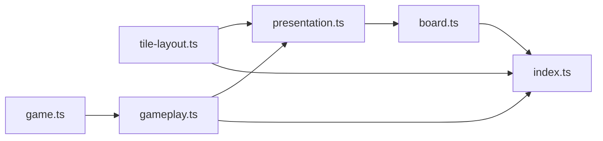

# Board Rendering API

<cite>
**Referenced Files in This Document**
- [board.ts](file://src/board.ts)
- [tile-layout.ts](file://src/tile-layout.ts)
- [game.ts](file://src/game.ts)
- [gameplay.ts](file://src/gameplay.ts)
- [index.ts](file://src/index.ts)
- [presentation.ts](file://src/presentation.ts)
- [board.test.ts](file://tests/board.test.ts)
- [tile-layout.test.ts](file://tests/tile-layout.test.ts)
</cite>

## Table of Contents
1. [Introduction](#introduction)
2. [Project Structure](#project-structure)
3. [Core Components](#core-components)
4. [Architecture Overview](#architecture-overview)
5. [Detailed Component Analysis](#detailed-component-analysis)
6. [Dependency Analysis](#dependency-analysis)
7. [Performance Considerations](#performance-considerations)
8. [Troubleshooting Guide](#troubleshooting-guide)
9. [Conclusion](#conclusion)
10. [Appendices](#appendices)

## Introduction
This document describes the Board rendering system and tile layout management for the MEMORYBLOX game. It focuses on the BoardView class for tile rendering, animation triggers, and visual state updates; the tileLayout interface and positioning algorithms for responsive board layouts; event handler registration, tile click detection, and visual feedback mechanisms; and the relationship between board rendering and game state updates. It also provides examples of board customization, responsive design integration, and performance optimization techniques.

## Project Structure
The board rendering system is implemented in a cohesive set of modules:
- Board rendering: BoardView class and tile face rendering helpers
- Tile layout computation: Pure functions for tile counts, set distributions, and multiplier clamping
- Game state: Immutable state machine with selection logic and win conditions
- Presentation model: View model mapping from game state to board rendering inputs
- Application integration: Wiring between UI, game engine, and board rendering

**Diagram sources**
- [board.ts:121-523](file://src/board.ts#L121-L523)
- [tile-layout.ts:12-53](file://src/tile-layout.ts#L12-L53)
- [game.ts:12-42](file://src/game.ts#L12-L42)
- [gameplay.ts:28-93](file://src/gameplay.ts#L28-L93)
- [presentation.ts:5-24](file://src/presentation.ts#L5-L24)
- [index.ts:815-816](file://src/index.ts#L815-L816)

**Section sources**
- [board.ts:121-523](file://src/board.ts#L121-L523)
- [tile-layout.ts:12-53](file://src/tile-layout.ts#L12-L53)
- [game.ts:12-42](file://src/game.ts#L12-L42)
- [gameplay.ts:28-93](file://src/gameplay.ts#L28-L93)
- [presentation.ts:5-24](file://src/presentation.ts#L5-L24)
- [index.ts:815-816](file://src/index.ts#L815-L816)

## Core Components
- BoardView: Renders tiles, manages DOM, handles tile selection, keyboard navigation, and match animations
- TileLayout: Computes tile counts, set distributions, and multiplier clamping for responsive layouts
- GameplayEngine: Encapsulates game state and exposes a typed facade for selection, resets, and metrics
- Presentation model: Translates game state into BoardTileViewModel arrays for rendering

Key responsibilities:
- BoardView: DOM creation, tile face ordering, lazy back-face rendering, accessibility attributes, animation timers, and event delegation
- TileLayout: Deterministic distribution of icons across multi-set and pair sets with clamped multipliers
- GameplayEngine: State mutations, win condition checks, and near-win preparation
- Presentation: View model projection for board rendering and HUD updates

**Section sources**
- [board.ts:121-523](file://src/board.ts#L121-L523)
- [tile-layout.ts:12-53](file://src/tile-layout.ts#L12-L53)
- [gameplay.ts:28-93](file://src/gameplay.ts#L28-L93)
- [presentation.ts:12-24](file://src/presentation.ts#L12-L24)

## Architecture Overview
The board rendering pipeline connects game state to visual rendering and user interaction:

**Diagram sources**
- [index.ts:639-779](file://src/index.ts#L639-L779)
- [gameplay.ts:43-93](file://src/gameplay.ts#L43-L93)
- [presentation.ts:12-24](file://src/presentation.ts#L12-L24)
- [board.ts:227-306](file://src/board.ts#L227-L306)

## Detailed Component Analysis

### BoardView: Tile Rendering and Interaction
BoardView is responsible for:
- Creating and maintaining tile DOM elements with deterministic face ordering
- Rendering tile front/back visuals, accessibility attributes, and disabled states
- Lazy back-face rendering to optimize image fetches and DOM work
- Event delegation for tile clicks and keyboard navigation
- Match animations with timer management

Key methods and behaviors:
- Constructor: Registers click and keydown handlers on the container; parses data-index attributes to route events to the provided handler
- render(tiles, columns): Updates board width, grid template, ensures button count, and applies tile status classes and attributes
- resetBackFaceCache(): Clears the WeakSet cache to force re-render of back faces on next render
- setLayoutConfig(config): Rounds and clamps layout parameters; recomputes board width and grid columns
- animateMatchedPair(firstIndex, secondIndex, pauseMs): Adds matched-disappearing class after a delay; clears existing timers for indices
- Private helpers: ensureButtonCount(), needsRebuild(), parseIndexFromButton(), clearAnimationTimer(), clearAllAnimationTimers()

Accessibility and UX:
- Back-face rendering supports flag emojis and imported icon assets
- Front face shows "?" or "•" based on status
- aria-labels include accessible flag names; aria-pressed reflects tile state
- Keyboard navigation supports arrow keys with boundary checks

Responsive layout:
- Board width computed from columns, target tile size, gaps, and padding
- CSS Grid repeat with minmax constrains tile sizes

**Section sources**
- [board.ts:121-523](file://src/board.ts#L121-L523)
- [board.test.ts:18-606](file://tests/board.test.ts#L18-L606)

#### Class Diagram: BoardView Internals

**Diagram sources**
- [board.ts:121-523](file://src/board.ts#L121-L523)

#### Sequence: Tile Click Flow

**Diagram sources**
- [board.ts:159-175](file://src/board.ts#L159-L175)
- [board.ts:639-679](file://src/board.ts#L639-L679)

#### Flowchart: Render Pipeline

**Diagram sources**
- [board.ts:227-306](file://src/board.ts#L227-L306)

### TileLayout: Responsive Board Layout Management
TileLayout computes:
- tileCount: rows × columns
- multiSetCount: number of icons with more than two copies
- pairSetCount: number of icons with exactly two copies
- multiSetCopies: copies per icon in multi-set (derived from multiplier)

Algorithms:
- clampTileMultiplier(value): Rounds to nearest integer and clamps to [1, 3]
- resolveTileMultiplierForTileCount(tileCount, selectedTileMultiplier): Caps multiplier by floor(tileCount / 2) and clamps via clampTileMultiplier
- computeTileLayout(difficulty, selectedTileMultiplier): Computes distribution and copies

Responsive integration:
- computeIdealTileSize(layout, columns, rows, frameWidth, frameHeight): Derives target tile size to fill available space
- BoardView.setLayoutConfig({ ...layout, targetTileSizePx: tileSizePx }): Applies computed size

**Section sources**
- [tile-layout.ts:12-53](file://src/tile-layout.ts#L12-L53)
- [index.ts:574-584](file://src/index.ts#L574-L584)
- [index.ts:608-616](file://src/index.ts#L608-L616)
- [tile-layout.test.ts:17-127](file://tests/tile-layout.test.ts#L17-L127)

#### Flowchart: Tile Layout Computation

**Diagram sources**
- [tile-layout.ts:36-53](file://src/tile-layout.ts#L36-L53)

### Game State and Presentation Model
GameplayEngine encapsulates GameState and exposes:
- selectTile(index): Processes selection, updates state, and returns SelectionResult
- resolveMismatch(firstIndex, secondIndex): Hides mismatched tiles after delay
- reset(deck): Recreates game with new deck
- Metrics: attempts, remaining unmatched pairs, elapsed time, and win state

Presentation model:
- createGamePresentationModel(gameplay): Projects GameState to BoardTileViewModel[], columns, attempts, and formatted elapsed time

**Section sources**
- [gameplay.ts:28-93](file://src/gameplay.ts#L28-L93)
- [game.ts:159-243](file://src/game.ts#L159-L243)
- [presentation.ts:12-24](file://src/presentation.ts#L12-L24)

#### Sequence: Selection and Render Cycle

**Diagram sources**
- [index.ts:639-669](file://src/index.ts#L639-L669)
- [presentation.ts:12-24](file://src/presentation.ts#L12-L24)
- [board.ts:227-306](file://src/board.ts#L227-L306)

## Dependency Analysis
- BoardView depends on:
  - BoardTileViewModel and BoardTileStatus types
  - Icon asset resolution for back-face rendering
  - Accessibility utilities for flag emoji labels
- TileLayout depends on:
  - DifficultyConfig and clamp utility
- GameplayEngine depends on:
  - Game state machine and selection logic
- Presentation model depends on:
  - GameplayEngine and formatting utilities

**Diagram sources**
- [tile-layout.ts:9-10](file://src/tile-layout.ts#L9-L10)
- [gameplay.ts:1-14](file://src/gameplay.ts#L1-L14)
- [presentation.ts:1-3](file://src/presentation.ts#L1-L3)
- [board.ts:1-2](file://src/board.ts#L1-L2)
- [index.ts:1-51](file://src/index.ts#L1-L51)

**Section sources**
- [tile-layout.ts:9-10](file://src/tile-layout.ts#L9-L10)
- [gameplay.ts:1-14](file://src/gameplay.ts#L1-L14)
- [presentation.ts:1-3](file://src/presentation.ts#L1-L3)
- [board.ts:1-2](file://src/board.ts#L1-L2)
- [index.ts:1-51](file://src/index.ts#L1-L51)

## Performance Considerations
- Lazy back-face rendering: Back faces are rendered only when tiles become revealed or matched, avoiding unnecessary image fetches and DOM work
- WeakSet cache: Tracks rendered back faces to prevent redundant re-renders across renders
- DOM reuse: needsRebuild() validates child counts and types; when safe, BoardView reuses existing buttons to minimize DOM churn
- Animation timers: Timers are cleared before replacing to prevent memory leaks and conflicting animations
- CSS Grid and minmax: Responsive sizing minimizes JavaScript calculations and leverages native layout
- Layout clamping: setLayoutConfig() rounds and clamps values to avoid invalid CSS and ensure robust rendering

[No sources needed since this section provides general guidance]

## Troubleshooting Guide
Common issues and resolutions:
- Click handler not firing:
  - Ensure tiles are rendered with data-index attributes and are buttons
  - Verify container click handler is attached and not prevented by event bubbling
- Keyboard navigation not working:
  - Confirm focus is on a tile button with data-index
  - Check that arrow keys are handled and boundaries are respected
- Match animations not triggering:
  - Ensure animateMatchedPair is called with valid indices
  - Verify timers are not prematurely cleared
- Back-face not updating:
  - Call resetBackFaceCache() before re-rendering with a new icon set
- Layout not responsive:
  - Confirm computeIdealTileSize is used to derive targetTileSizePx
  - Ensure setLayoutConfig is applied after layout recalculation

**Section sources**
- [board.ts:159-224](file://src/board.ts#L159-L224)
- [board.ts:331-354](file://src/board.ts#L331-L354)
- [board.ts:316-318](file://src/board.ts#L316-L318)
- [index.ts:574-584](file://src/index.ts#L574-L584)
- [index.ts:608-616](file://src/index.ts#L608-L616)

## Conclusion
The Board rendering system provides a robust, responsive, and accessible interface between game state and visual presentation. BoardView efficiently manages DOM updates, accessibility, and animations, while TileLayout ensures balanced and scalable tile distributions. The integration with GameplayEngine and Presentation model yields a clean separation of concerns and predictable rendering cycles.

[No sources needed since this section summarizes without analyzing specific files]

## Appendices

### API Reference: BoardView
- Constructor(container, onTileSelect)
  - Registers event listeners for tile selection and keyboard navigation
- render(tiles, columns)
  - Applies board width, grid columns, ensures button count, updates tile visuals and attributes
- resetBackFaceCache()
  - Clears back-face render cache for next render
- setLayoutConfig(layoutConfig)
  - Rounds and clamps layout parameters; recomputes board width and grid columns
- animateMatchedPair(firstIndex, secondIndex, pauseMs)
  - Triggers matched-disappearing animation after a delay

**Section sources**
- [board.ts:155-225](file://src/board.ts#L155-L225)
- [board.ts:227-306](file://src/board.ts#L227-L306)
- [board.ts:316-318](file://src/board.ts#L316-L318)
- [board.ts:320-329](file://src/board.ts#L320-L329)
- [board.ts:331-354](file://src/board.ts#L331-L354)

### Example: Board Customization and Responsive Design
- Customizing layout:
  - Override BoardLayoutConfig via setLayoutConfig() with minTileSizePx, targetTileSizePx, tileGapPx, horizontal padding, and margins
- Responsive sizing:
  - Use computeIdealTileSize() to derive target tile size based on frame dimensions and layout constraints
  - Apply result to BoardView.setLayoutConfig({ ...layout, targetTileSizePx: tileSizePx })
- Performance optimization:
  - Rely on lazy back-face rendering and DOM reuse
  - Clear animation timers before replacing to prevent conflicts

**Section sources**
- [index.ts:574-584](file://src/index.ts#L574-L584)
- [index.ts:608-616](file://src/index.ts#L608-L616)
- [board.ts:320-329](file://src/board.ts#L320-L329)

### Example: Game State Synchronization
- Selection flow:
  - UI calls GameplayEngine.selectTile(index)
  - Presentation model projects state to BoardTileViewModel[]
  - BoardView.render(...) updates visuals and triggers animations
- Win condition:
  - GameplayEngine tracks remaining unmatched pairs and win state
  - BoardView.animateMatchedPair(...) triggers match animations on wins

**Section sources**
- [index.ts:639-779](file://src/index.ts#L639-L779)
- [presentation.ts:12-24](file://src/presentation.ts#L12-L24)
- [game.ts:208-228](file://src/game.ts#L208-L228)