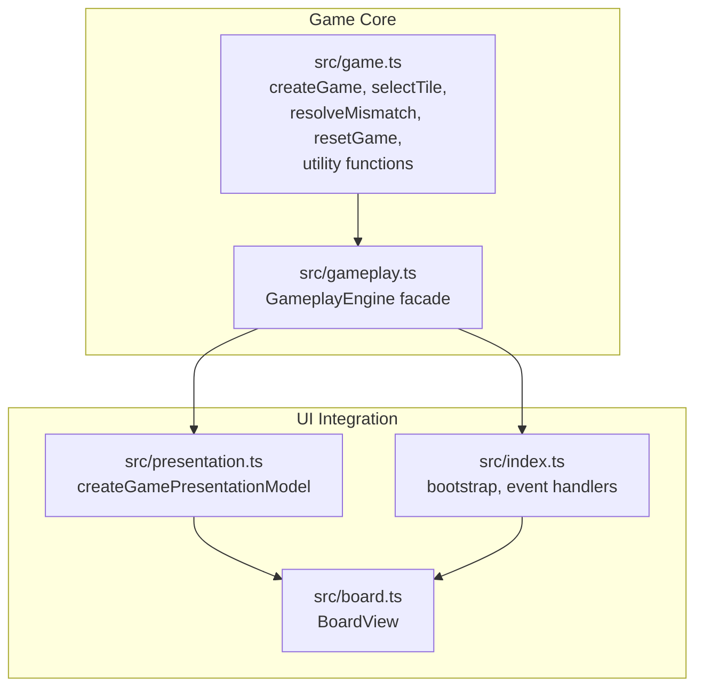
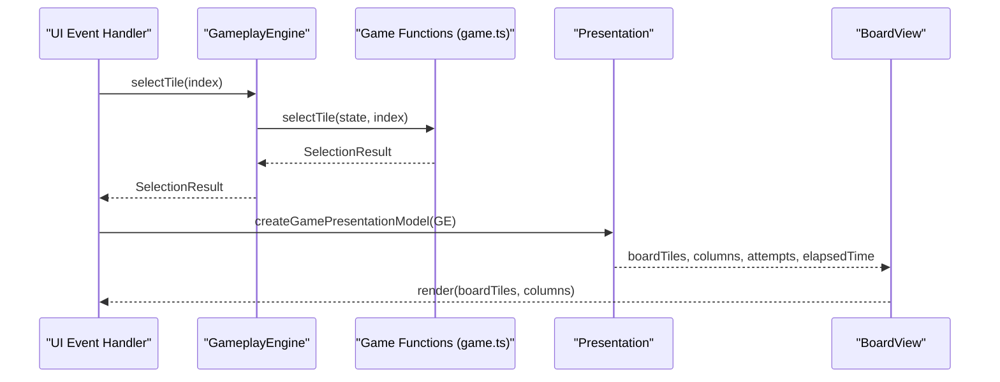
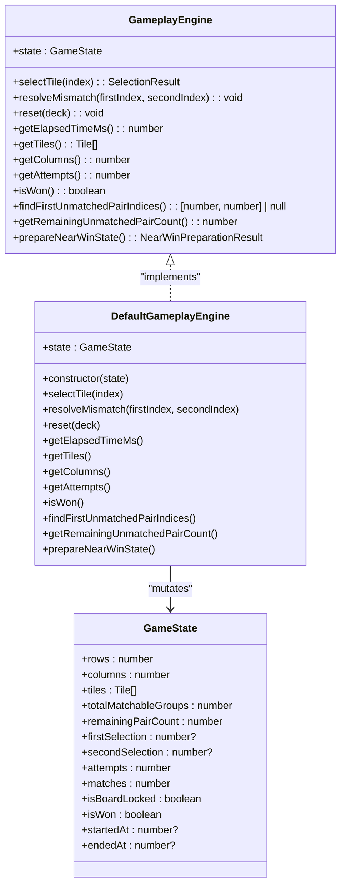

# Game API

<cite>
**Referenced Files in This Document**
- [game.ts](file://src/game.ts)
- [gameplay.ts](file://src/gameplay.ts)
- [board.ts](file://src/board.ts)
- [presentation.ts](file://src/presentation.ts)
- [index.ts](file://src/index.ts)
- [game.test.ts](file://tests/game.test.ts)
</cite>

## Table of Contents
1. [Introduction](#introduction)
2. [Project Structure](#project-structure)
3. [Core Components](#core-components)
4. [Architecture Overview](#architecture-overview)
5. [Detailed Component Analysis](#detailed-component-analysis)
6. [Dependency Analysis](#dependency-analysis)
7. [Performance Considerations](#performance-considerations)
8. [Troubleshooting Guide](#troubleshooting-guide)
9. [Conclusion](#conclusion)

## Introduction
This document provides API documentation for the core Game class and GameState management. It covers the creation of a game, the data model for tiles and game state, and all game manipulation functions. It also documents the facade GameplayEngine interface that exposes a typed API surface to consumers.

## Project Structure
The game logic resides primarily in src/game.ts, with a thin facade in src/gameplay.ts and UI integration in src/board.ts and src/presentation.ts. The main application bootstraps a GameplayEngine in src/index.ts and uses it to drive the UI.

**Diagram sources**
- [game.ts:61-138](file://src/game.ts#L61-L138)
- [gameplay.ts:28-106](file://src/gameplay.ts#L28-L106)
- [board.ts:121-523](file://src/board.ts#L121-L523)
- [presentation.ts:12-24](file://src/presentation.ts#L12-L24)
- [index.ts:586-622](file://src/index.ts#L586-L622)

**Section sources**
- [game.ts:1-419](file://src/game.ts#L1-L419)
- [gameplay.ts:1-107](file://src/gameplay.ts#L1-L107)
- [board.ts:1-523](file://src/board.ts#L1-L523)
- [presentation.ts:1-25](file://src/presentation.ts#L1-L25)
- [index.ts:1-800](file://src/index.ts#L1-L800)

## Core Components
- Tile interface: describes a single tile’s identity, pairing, icon, and status.
- GameState interface: holds board dimensions, tile array, matchable group metadata, selection tracking, counters, and flags.
- CreateGameOptions: configuration for creating a game with rows, columns, and a deck of icons.
- SelectionResult union: describes outcomes of a tile selection.
- NearWinPreparationResult: describes preparation for near-win scenarios.

**Section sources**
- [game.ts:5-42](file://src/game.ts#L5-L42)
- [game.ts:55-59](file://src/game.ts#L55-L59)
- [game.ts:44-53](file://src/game.ts#L44-L53)

## Architecture Overview
The GameplayEngine is a thin wrapper around free functions in game.ts. The main application creates a GameplayEngine via createGameplayEngine and uses it to orchestrate tile selection, mismatch resolution, and state resets. Presentation transforms GameState into BoardTileViewModel for rendering.

**Diagram sources**
- [index.ts:639-779](file://src/index.ts#L639-L779)
- [gameplay.ts:28-93](file://src/gameplay.ts#L28-L93)
- [presentation.ts:12-24](file://src/presentation.ts#L12-L24)
- [board.ts:227-306](file://src/board.ts#L227-L306)

## Detailed Component Analysis

### CreateGameOptions and createGame
- Purpose: Initialize a new game with specified board dimensions and a deck of icons.
- Parameters:
  - rows: number
  - columns: number
  - deck: string[]
- Validation:
  - Deck size must equal rows × columns.
  - After removing blocked tiles, the remaining matchable tile count must be even.
- Behavior:
  - Assigns unique pairIds to icons and builds tiles with status "hidden".
  - Computes totalMatchableGroups and initial remainingPairCount.
  - Initializes selection tracking, counters, and timestamps to neutral defaults.

Practical usage example:
- Create a GameplayEngine with createGameplayEngine(options) where options.rows/columns/deck match the desired board and icon set.

Error conditions:
- Throws if deck length does not match rows × columns.
- Throws if the number of non-blocked tiles is odd.

**Section sources**
- [game.ts:55-59](file://src/game.ts#L55-L59)
- [game.ts:61-138](file://src/game.ts#L61-L138)
- [tests/game.test.ts:337-352](file://tests/game.test.ts#L337-L352)

### Tile Interface
- Properties:
  - id: number (zero-based index in tiles array)
  - pairId: number (unique identifier for the icon group)
  - icon: string (displayed icon token)
  - status: "hidden" | "revealed" | "matched" | "blocked"

Notes:
- Blocked tiles are represented by a special token and have status "blocked".
- pairId is used to determine matches.

**Section sources**
- [game.ts:5-10](file://src/game.ts#L5-L10)

### GameState Interface
- Dimensions:
  - rows: number
  - columns: number
- Tiles:
  - tiles: Tile[]
- Matchable metadata:
  - totalMatchableGroups: number (count of distinct icons)
  - remainingPairCount: number (cached count of remaining matchable pairs)
- Selection tracking:
  - firstSelection: number | null
  - secondSelection: number | null
- Counters:
  - attempts: number
  - matches: number
- Flags:
  - isBoardLocked: boolean
  - isWon: boolean
- Timing:
  - startedAt: number | null
  - endedAt: number | null

**Section sources**
- [game.ts:12-42](file://src/game.ts#L12-L42)

### GameplayEngine Facade
- Exposes a typed API to consumers without exposing GameState directly.
- Methods:
  - selectTile(index): delegates to selectTile
  - resolveMismatch(firstIndex, secondIndex): delegates to resolveMismatch
  - reset(deck): delegates to resetGame
  - getElapsedTimeMs(): delegates to getElapsedTimeMs
  - getTiles(): returns tiles array
  - getColumns(): returns columns
  - getAttempts(): returns attempts
  - isWon(): returns isWon
  - findFirstUnmatchedPairIndices(): delegates to findFirstUnmatchedPairIndices
  - getRemainingUnmatchedPairCount(): delegates to getRemainingUnmatchedPairCount
  - prepareNearWinState(): delegates to prepareNearWinState

**Section sources**
- [gameplay.ts:28-93](file://src/gameplay.ts#L28-L93)

### selectTile
- Purpose: Apply a tile selection to the current GameState.
- Parameters:
  - state: GameState (in-place mutation)
  - index: number (zero-based tile index)
- Validation:
  - Throws RangeError if index is out of bounds or if the tile entry is missing.
- Auto-resolve side effect:
  - If the board is locked with both selections set, resolves the mismatch before processing the new selection.
- Return types (SelectionResult):
  - "ignored": selection has no effect (locked board, already revealed/matched, or game won)
  - "first": first selection recorded
  - "match": matching pair found; includes won flag
  - "mismatch": non-matching pair found
- Error conditions:
  - Throws RangeError for invalid index.
  - Throws an error if state corruption is detected (remainingPairCount already zero when attempting a match).

Practical usage example:
- Call gameplay.selectTile(index) from UI event handlers; branch on result to play sounds, trigger animations, and update UI.

**Section sources**
- [game.ts:159-243](file://src/game.ts#L159-L243)
- [tests/game.test.ts:76-176](file://tests/game.test.ts#L76-L176)

### resolveMismatch
- Purpose: Hide both previously revealed tiles and unlock the board.
- Parameters:
  - state: GameState (in-place mutation)
  - firstIndex: number
  - secondIndex: number
- Behavior:
  - Resets selection tracking and clears board lock.
  - Leaves matched tiles unchanged.

Practical usage example:
- Call after a mismatch delay or when a new selection is made while a mismatch is still open.

**Section sources**
- [game.ts:245-264](file://src/game.ts#L245-L264)
- [tests/game.test.ts:178-219](file://tests/game.test.ts#L178-L219)

### resetGame
- Purpose: Recreate the board with a new deck while preserving dimensions.
- Parameters:
  - state: GameState (in-place mutation)
  - deck: string[] (must match existing board size)
- Behavior:
  - Validates deck size and recreates state via createGame.
  - Copies all properties into the existing state object.

Practical usage example:
- Use to restart a game with a different icon pack or difficulty.

**Section sources**
- [game.ts:266-278](file://src/game.ts#L266-L278)
- [tests/game.test.ts:221-252](file://tests/game.test.ts#L221-L252)

### Utility Functions

#### getElapsedTimeMs
- Purpose: Return elapsed time in milliseconds.
- Behavior:
  - Uses performance.now() for in-progress games.
  - Returns fixed duration after game ends.
  - Returns 0 if the game has not started.

**Section sources**
- [game.ts:289-299](file://src/game.ts#L289-L299)
- [tests/game.test.ts:254-305](file://tests/game.test.ts#L254-L305)

#### getRemainingUnmatchedPairCount
- Purpose: Return the cached remaining matchable pairs.
- Behavior:
  - O(1) lookup; decremented on each successful match.

**Section sources**
- [game.ts:330-332](file://src/game.ts#L330-L332)
- [tests/game.test.ts:337-454](file://tests/game.test.ts#L337-L454)

#### findFirstUnmatchedPairIndices
- Purpose: Locate the first unmatched pair of tiles.
- Behavior:
  - Skips blocked and matched tiles.
  - Returns [i, j] for the first pair found or null if none.

**Section sources**
- [game.ts:301-322](file://src/game.ts#L301-L322)
- [tests/game.test.ts:307-335](file://tests/game.test.ts#L307-L335)

#### prepareNearWinState
- Purpose: Prepare a near-win scenario by marking all but one pair as matched.
- Behavior:
  - Builds a map from pairId to tile IDs.
  - Keeps the first two tiles of the remaining pair hidden.
  - Pre-marks orphan tiles as matched to satisfy win conditions.
  - Updates matches, remainingPairCount, and clears board lock/won state.

**Section sources**
- [game.ts:334-418](file://src/game.ts#L334-L418)
- [tests/game.test.ts:15-74](file://tests/game.test.ts#L15-L74)

### UI Integration and Presentation
- Presentation model:
  - createGamePresentationModel converts GameState into BoardTileViewModel for rendering.
  - Provides columns, attempts, and formatted elapsed time.
- Board rendering:
  - BoardView renders tiles with appropriate status and accessibility attributes.
  - Lazily renders back-face icons and caches them to avoid repeated work.

**Section sources**
- [presentation.ts:12-24](file://src/presentation.ts#L12-L24)
- [board.ts:8-11](file://src/board.ts#L8-L11)
- [board.ts:227-306](file://src/board.ts#L227-L306)

## Dependency Analysis
The GameplayEngine depends on free functions in game.ts. The main application uses GameplayEngine to coordinate UI updates and game events.

**Diagram sources**
- [gameplay.ts:28-93](file://src/gameplay.ts#L28-L93)
- [game.ts:12-42](file://src/game.ts#L12-L42)

**Section sources**
- [gameplay.ts:28-106](file://src/gameplay.ts#L28-L106)
- [game.ts:12-42](file://src/game.ts#L12-L42)

## Performance Considerations
- Remaining pair count caching:
  - getRemainingUnmatchedPairCount is O(1) by decrementing on each match.
- Board layout and rendering:
  - BoardView lazily renders back-face icons and caches them to minimize DOM work.
- Timing:
  - getElapsedTimeMs uses performance.now() for continuous timing; consider background tab behavior as documented.

[No sources needed since this section provides general guidance]

## Troubleshooting Guide
Common issues and resolutions:
- Out-of-bounds selection:
  - selectTile throws RangeError for invalid indices. Ensure index is within [0, tiles.length - 1].
- Missing tile entries:
  - selectTile throws RangeError if a tile entry is deleted or missing at a valid index.
- State corruption:
  - selectTile throws if remainingPairCount is already zero when attempting a match; indicates external mutation or duplicate match.
- Mismatch auto-resolution:
  - If a mismatch is still open, subsequent selections auto-resolve it before processing the new selection.
- Reset validation:
  - resetGame throws if the new deck size does not match the existing board size.

**Section sources**
- [tests/game.test.ts:88-133](file://tests/game.test.ts#L88-L133)
- [tests/game.test.ts:178-219](file://tests/game.test.ts#L178-L219)
- [tests/game.test.ts:221-252](file://tests/game.test.ts#L221-L252)

## Conclusion
The Game API provides a robust, validated, and efficient foundation for memory card matching. The GameState and Tile interfaces clearly define the game state, while the free functions encapsulate core logic. The GameplayEngine facade offers a clean API surface for consumers, and the UI pipeline integrates seamlessly with these primitives.