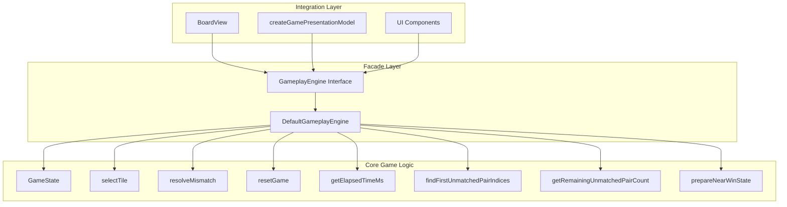
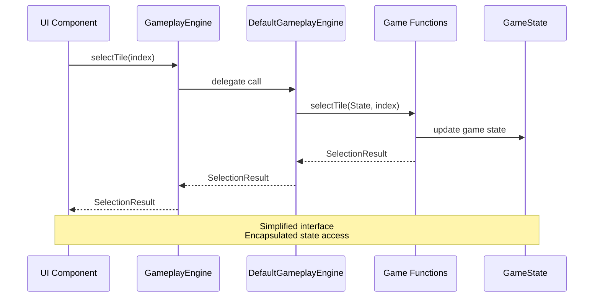
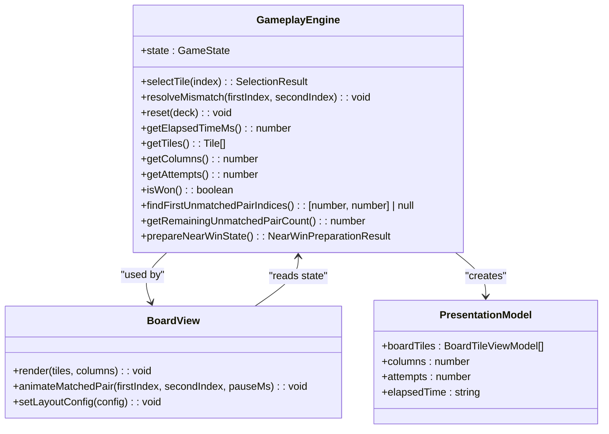
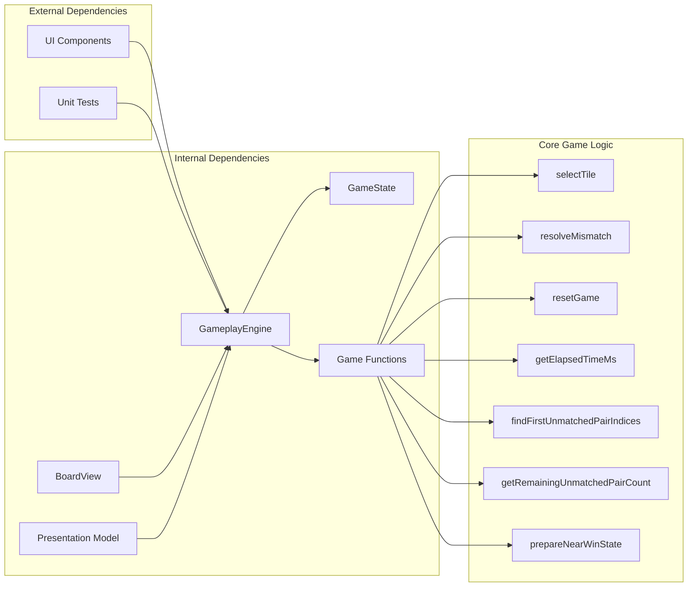

# Gameplay Engine API

<cite>
**Referenced Files in This Document**
- [gameplay.ts](file://src/gameplay.ts)
- [game.ts](file://src/game.ts)
- [board.ts](file://src/board.ts)
- [presentation.ts](file://src/presentation.ts)
- [index.ts](file://src/index.ts)
- [tile-layout.ts](file://src/tile-layout.ts)
- [gameplay.test.ts](file://tests/gameplay.test.ts)
</cite>

## Table of Contents
1. [Introduction](#introduction)
2. [Project Structure](#project-structure)
3. [Core Components](#core-components)
4. [Architecture Overview](#architecture-overview)
5. [Detailed Component Analysis](#detailed-component-analysis)
6. [Dependency Analysis](#dependency-analysis)
7. [Performance Considerations](#performance-considerations)
8. [Troubleshooting Guide](#troubleshooting-guide)
9. [Conclusion](#conclusion)

## Introduction
This document provides comprehensive API documentation for the GameplayEngine facade interface, which serves as a simplified abstraction layer over the core game logic. The facade pattern enables clean separation between UI components and the underlying game mechanics, providing a stable interface for tile interactions, state queries, and game flow control.

The GameplayEngine facade encapsulates the GameState and exposes only the essential operations needed by UI components and external consumers, while maintaining full access to the underlying game state for advanced integrations.

## Project Structure
The GameplayEngine resides in the core game module alongside the underlying GameState and game logic functions. It integrates with the presentation layer and UI components through a well-defined interface.



**Diagram sources**
- [gameplay.ts:28-106](file://src/gameplay.ts#L28-L106)
- [game.ts:12-419](file://src/game.ts#L12-L419)

**Section sources**
- [gameplay.ts:1-107](file://src/gameplay.ts#L1-L107)
- [game.ts:1-419](file://src/game.ts#L1-L419)

## Core Components

### GameplayEngine Interface
The facade interface defines the public contract for game operations, providing a clean abstraction over the core game logic.

**Public Methods:**
- `state: GameState` - Readonly access to the underlying game state
- `selectTile(index: number): SelectionResult` - Process tile selection and return result
- `resolveMismatch(firstIndex: number, secondIndex: number): void` - Hide mismatched tiles
- `reset(deck: string[]): void` - Reset game with new deck configuration
- `getElapsedTimeMs(): number` - Get elapsed time in milliseconds
- `getTiles(): readonly Tile[]` - Get current tile configuration
- `getColumns(): number` - Get board column count
- `getAttempts(): number` - Get total attempt count
- `isWon(): boolean` - Check win condition
- `findFirstUnmatchedPairIndices(): [number, number] | null` - Find first unmatched pair
- `getRemainingUnmatchedPairCount(): number` - Get remaining unmatched pairs
- `prepareNearWinState(): NearWinPreparationResult` - Prepare near-win state

**Section sources**
- [gameplay.ts:28-41](file://src/gameplay.ts#L28-L41)

### DefaultGameplayEngine Implementation
The concrete implementation delegates to the underlying game functions while maintaining encapsulation of the GameState.

**Implementation Pattern:**
- Pass-through delegation to game functions
- State encapsulation for external consumers
- Type-safe interface compliance

**Section sources**
- [gameplay.ts:43-93](file://src/gameplay.ts#L43-L93)

## Architecture Overview

The GameplayEngine follows the facade pattern to provide a simplified interface while maintaining access to the full GameState for advanced integrations.



**Diagram sources**
- [gameplay.ts:50-52](file://src/gameplay.ts#L50-L52)
- [game.ts:159-243](file://src/game.ts#L159-L243)

**Section sources**
- [gameplay.ts:16-27](file://src/gameplay.ts#L16-L27)
- [index.ts:639-779](file://src/index.ts#L639-L779)

## Detailed Component Analysis

### Method Signatures and Behavior

#### Game Initialization
The `createGameplayEngine` factory creates a new GameplayEngine instance with the specified board configuration.

**Method Signature:**
```typescript
createGameplayEngine(options: CreateGameplayEngineOptions): GameplayEngine
```

**Parameters:**
- `options.rows: number` - Number of board rows
- `options.columns: number` - Number of board columns  
- `options.deck: string[]` - Array of icon tokens for tile pairing

**Integration Pattern:**
- Used by UI bootstrap to initialize new game sessions
- Validates deck size matches board dimensions
- Supports dynamic difficulty and theme configurations

**Section sources**
- [gameplay.ts:95-106](file://src/gameplay.ts#L95-L106)
- [index.ts:600-605](file://src/index.ts#L600-L605)

#### Tile Interaction Operations

**selectTile Method:**
```typescript
selectTile(index: number): SelectionResult
```

**Behavior:**
- Processes tile selection with automatic mismatch resolution
- Handles board locking during animations
- Updates game state and returns structured results
- Throws RangeError for invalid indices

**Return Types:**
- `{ type: "ignored" }` - Selection has no effect
- `{ type: "first"; index: number }` - First tile in pair attempt
- `{ type: "match"; firstIndex: number; secondIndex: number; won: boolean }` - Matching pair found
- `{ type: "mismatch"; firstIndex: number; secondIndex: number }` - Non-matching pair

**Section sources**
- [gameplay.ts:30](file://src/gameplay.ts#L30)
- [game.ts:159-243](file://src/game.ts#L159-L243)

**resolveMismatch Method:**
```typescript
resolveMismatch(firstIndex: number, secondIndex: number): void
```

**Behavior:**
- Hides previously revealed tiles after mismatch
- Resets board lock state
- Cleans up selection tracking

**Section sources**
- [gameplay.ts:31](file://src/gameplay.ts#L31)
- [game.ts:245-264](file://src/game.ts#L245-L264)

#### State Query Operations

**State Access Properties:**
```typescript
getTiles(): readonly Tile[]
getColumns(): number
getAttempts(): number
isWon(): boolean
getRemainingUnmatchedPairCount(): number
```

**Behavior:**
- Provide read-only access to game state
- Enable UI components to render current game status
- Support real-time updates without state mutation

**Section sources**
- [gameplay.ts:34-39](file://src/gameplay.ts#L34-L39)
- [game.ts:5-42](file://src/game.ts#L5-L42)

#### Game Flow Control

**prepareNearWinState Method:**
```typescript
prepareNearWinState(): NearWinPreparationResult
```

**Behavior:**
- Prepares game state for near-win scenarios
- Marks remaining pairs as visible
- Pre-marks orphan tiles as matched
- Resets win state and timing

**Return Type:**
```typescript
NearWinPreparationResult {
  remainingPair: [number, number] | null,
  matchedPairs: [number, number][]
}
```

**Section sources**
- [gameplay.ts:40](file://src/gameplay.ts#L40)
- [game.ts:334-418](file://src/game.ts#L334-L418)

### Integration Patterns

#### UI Component Integration
The facade enables clean separation between game logic and presentation:



**Diagram sources**
- [gameplay.ts:28-41](file://src/gameplay.ts#L28-L41)
- [board.ts:121-306](file://src/board.ts#L121-L306)
- [presentation.ts:5-24](file://src/presentation.ts#L5-L24)

**Section sources**
- [presentation.ts:12-24](file://src/presentation.ts#L12-L24)
- [board.ts:227-306](file://src/board.ts#L227-L306)

#### Bootstrap Integration
The facade integrates seamlessly with the application bootstrap process:

**Section sources**
- [index.ts:586-622](file://src/index.ts#L586-L622)
- [index.ts:639-779](file://src/index.ts#L639-L779)

## Dependency Analysis

The GameplayEngine maintains loose coupling with UI components while providing tight integration with the core game logic.



**Diagram sources**
- [gameplay.ts:1-14](file://src/gameplay.ts#L1-L14)
- [game.ts:1-14](file://src/game.ts#L1-L14)

**Section sources**
- [gameplay.ts:1-14](file://src/gameplay.ts#L1-L14)
- [game.ts:1-14](file://src/game.ts#L1-L14)

## Performance Considerations

### Optimized State Access
The facade provides O(1) access to frequently queried state properties:
- Remaining unmatched pairs are cached for constant-time lookup
- Tile arrays are exposed as readonly for safe iteration
- Board dimensions are stored for immediate access

### Memory Efficiency
- Tiles are passed by reference to minimize memory allocation
- State mutations occur in-place to avoid copying large data structures
- Presentation model creation is optimized for frequent updates

### Animation Coordination
The facade integrates with UI timing systems:
- Elapsed time calculation uses performance.now() for accurate timing
- Mismatch resolution respects animation timing constraints
- Board locking prevents concurrent tile interactions

## Troubleshooting Guide

### Common Error Scenarios

**Invalid Tile Index:**
- **Error Type:** RangeError
- **Cause:** Index outside valid range [0, tiles.length-1]
- **Resolution:** Validate tile indices before calling selectTile()

**State Corruption Detection:**
- **Error Type:** Error with specific message
- **Cause:** Attempt to match tiles when no pairs remain
- **Resolution:** Check getRemainingUnmatchedPairCount() before matching

**Deck Size Mismatch:**
- **Error Type:** Error
- **Cause:** Reset deck size doesn't match board dimensions
- **Resolution:** Ensure deck length equals rows × columns

### Validation Best Practices

**Input Validation:**
```typescript
// Validate tile selection
if (index < 0 || index >= gameplay.getTiles().length) {
    throw new RangeError("Invalid tile index");
}

// Check game state before operations
if (gameplay.isWon()) {
    return; // Ignore operations on completed games
}
```

**State Monitoring:**
- Use findFirstUnmatchedPairIndices() to verify game progress
- Monitor getRemainingUnmatchedPairCount() for completion detection
- Track getAttempts() for scoring and analytics

**Section sources**
- [game.ts:160-164](file://src/game.ts#L160-L164)
- [game.ts:213-217](file://src/game.ts#L213-L217)
- [game.ts:266-269](file://src/game.ts#L266-L269)

## Conclusion

The GameplayEngine facade provides an excellent example of the facade pattern implementation, offering:

**Benefits:**
- Clean abstraction over complex game logic
- Stable interface for UI components and external consumers
- Encapsulation of GameState for controlled access
- Seamless integration with presentation and UI layers

**Best Practices:**
- Use the facade for all game interactions in UI components
- Leverage state queries for real-time rendering updates
- Implement proper error handling for invalid operations
- Utilize the presentation model for efficient UI updates

The facade pattern successfully separates concerns while maintaining performance and flexibility, making it an ideal choice for complex game applications requiring clean architectural boundaries.