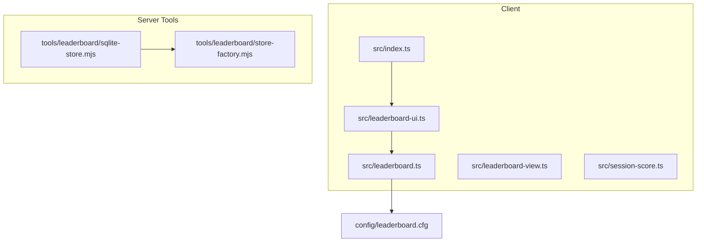
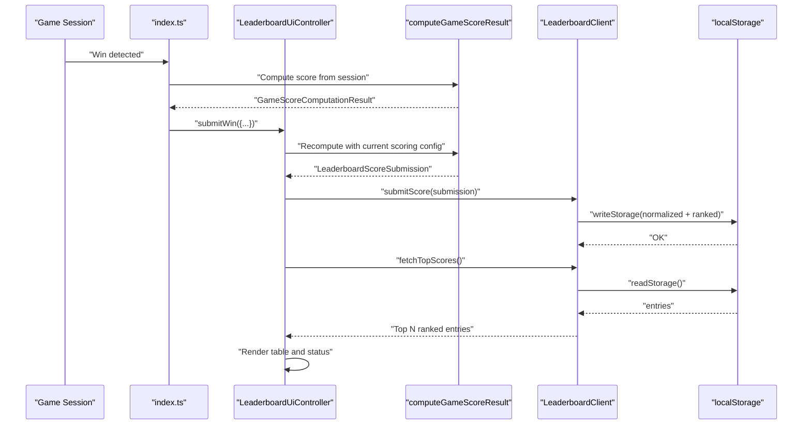
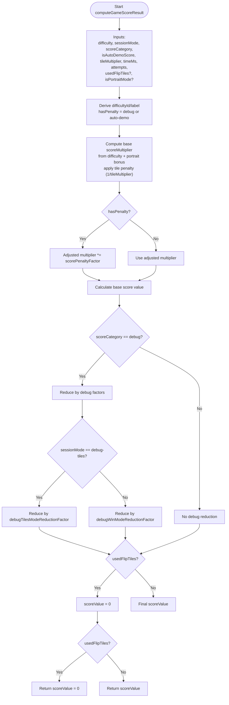
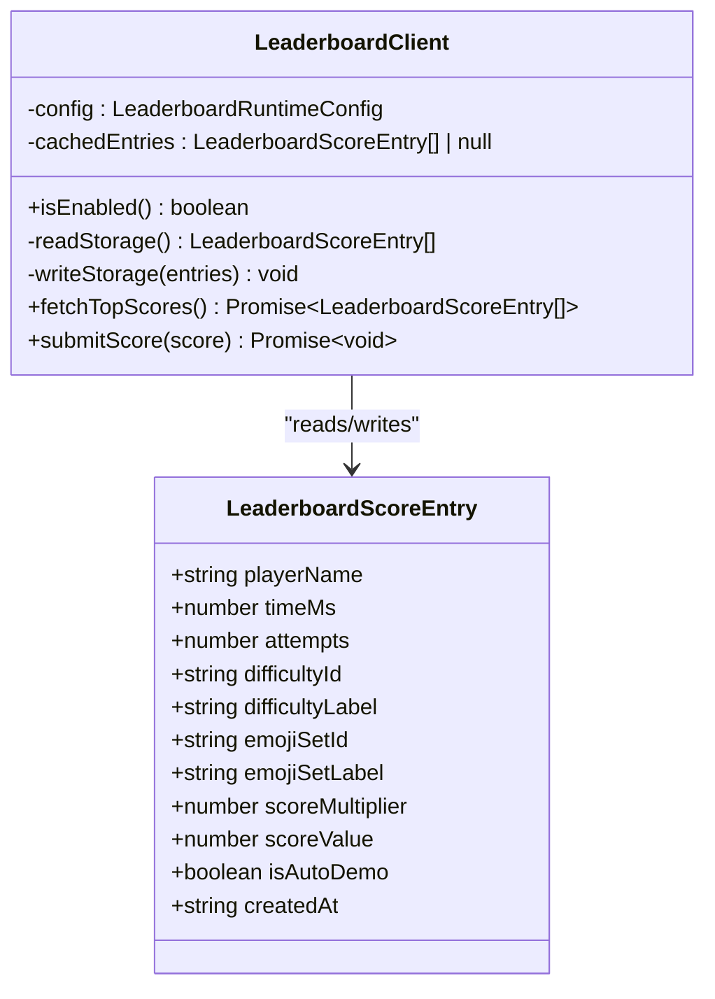
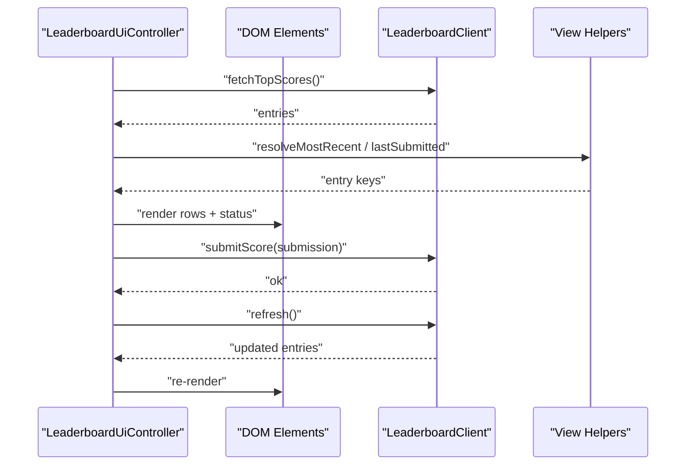
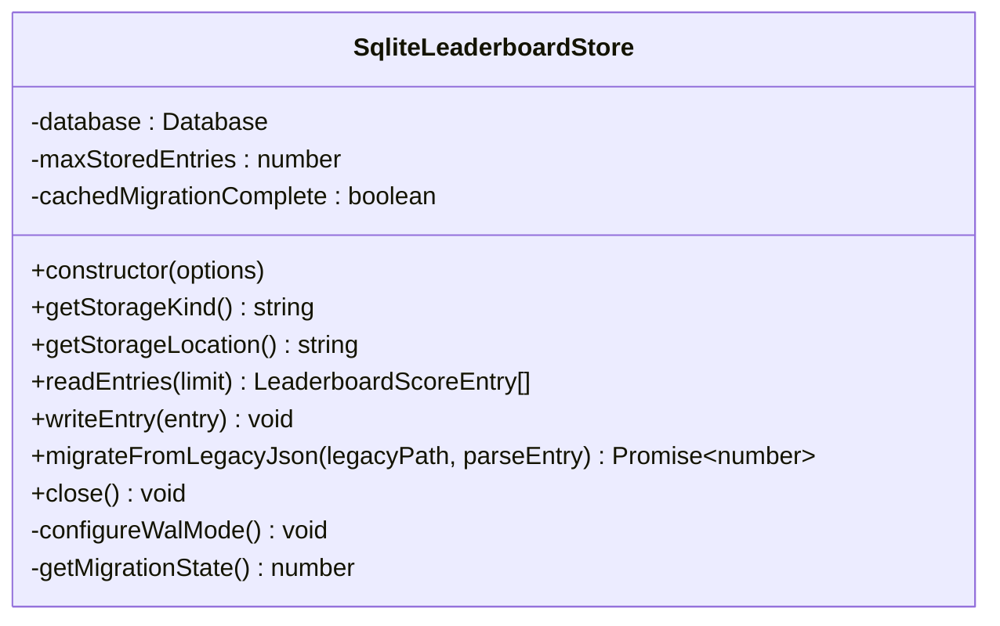
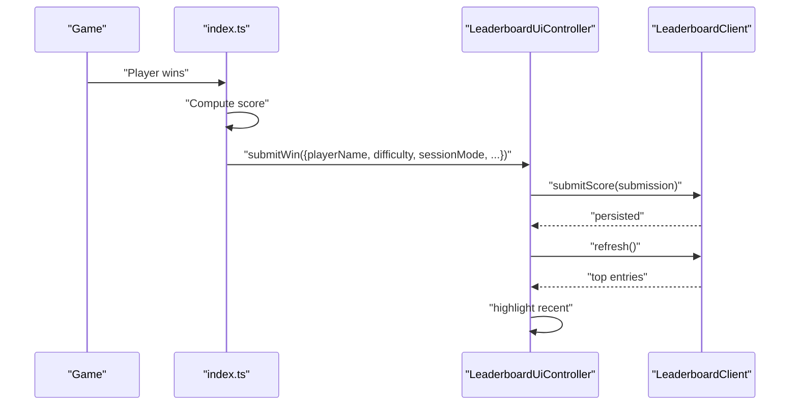
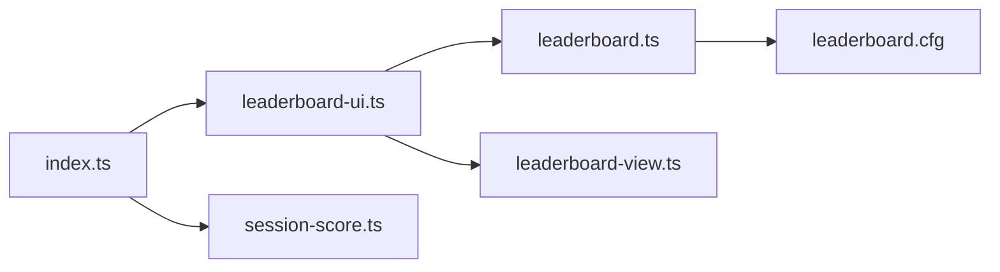

# Leaderboard API

<cite>
**Referenced Files in This Document**
- [leaderboard.ts](file://src/leaderboard.ts)
- [leaderboard-ui.ts](file://src/leaderboard-ui.ts)
- [leaderboard-view.ts](file://src/leaderboard-view.ts)
- [session-score.ts](file://src/session-score.ts)
- [index.ts](file://src/index.ts)
- [leaderboard.cfg](file://config/leaderboard.cfg)
- [sqlite-store.mjs](file://tools/leaderboard/sqlite-store.mjs)
- [store-factory.mjs](file://tools/leaderboard/store-factory.mjs)
- [leaderboard.test.ts](file://tests/leaderboard.test.ts)
- [leaderboard-ui.test.ts](file://tests/leaderboard-ui.test.ts)
- [leaderboard-view.test.ts](file://tests/leaderboard-view.test.ts)
</cite>

## Table of Contents
1. [Introduction](#introduction)
2. [Project Structure](#project-structure)
3. [Core Components](#core-components)
4. [Architecture Overview](#architecture-overview)
5. [Detailed Component Analysis](#detailed-component-analysis)
6. [Dependency Analysis](#dependency-analysis)
7. [Performance Considerations](#performance-considerations)
8. [Troubleshooting Guide](#troubleshooting-guide)
9. [Conclusion](#conclusion)
10. [Appendices](#appendices)

## Introduction
This document describes the Leaderboard API for score submission, retrieval, and management. It covers the data structures, scoring algorithm, UI integration, persistence mechanisms, and the relationship between game sessions and leaderboard updates. The system supports both client-side local storage and a server-side SQLite store for scalable deployments.

## Project Structure
The leaderboard system spans client-side TypeScript modules and optional server-side tools:
- Client-side core: scoring computation, normalization, ranking, and local storage persistence
- UI integration: controller for rendering and submitting scores
- View helpers: entry identity and resolution utilities
- Runtime configuration: leaderboard settings loaded from config
- Server-side tools: SQLite-backed store and factory for scalable persistence

**Diagram sources**
- [leaderboard.ts:1-541](file://src/leaderboard.ts#L1-L541)
- [leaderboard-ui.ts:1-234](file://src/leaderboard-ui.ts#L1-L234)
- [leaderboard-view.ts:1-110](file://src/leaderboard-view.ts#L1-L110)
- [session-score.ts:1-24](file://src/session-score.ts#L1-L24)
- [index.ts:260-459](file://src/index.ts#L260-L459)
- [leaderboard.cfg:1-17](file://config/leaderboard.cfg#L1-L17)
- [sqlite-store.mjs:1-531](file://tools/leaderboard/sqlite-store.mjs#L1-L531)
- [store-factory.mjs:1-25](file://tools/leaderboard/store-factory.mjs#L1-L25)

**Section sources**
- [leaderboard.ts:1-541](file://src/leaderboard.ts#L1-L541)
- [leaderboard-ui.ts:1-234](file://src/leaderboard-ui.ts#L1-L234)
- [leaderboard-view.ts:1-110](file://src/leaderboard-view.ts#L1-L110)
- [session-score.ts:1-24](file://src/session-score.ts#L1-L24)
- [index.ts:260-459](file://src/index.ts#L260-L459)
- [leaderboard.cfg:1-17](file://config/leaderboard.cfg#L1-L17)
- [sqlite-store.mjs:1-531](file://tools/leaderboard/sqlite-store.mjs#L1-L531)
- [store-factory.mjs:1-25](file://tools/leaderboard/store-factory.mjs#L1-L25)

## Core Components
- LeaderboardScoringConfig: defines scoring parameters such as penalties, scaling, and debug reductions
- LeaderboardRuntimeConfig: enables/disables leaderboard and sets max entries and scoring parameters
- LeaderboardScoreEntry: normalized persisted record with computed score and metadata
- LeaderboardScoreSubmission: minimal submission payload for score creation
- LeaderboardClient: client-side persistence using localStorage with normalization and ranking
- LeaderboardUiController: UI integration for fetching, rendering, and submitting scores
- computeGameScoreResult: computes score multiplier/value from game session inputs
- View helpers: entry identity and resolution for highlighting recently submitted entries

Key APIs:
- LeaderboardClient.fetchTopScores(): Promise<LeaderboardScoreEntry[]>
- LeaderboardClient.submitScore(LeaderboardScoreSubmission): Promise<void>
- LeaderboardUiController.refresh(): Promise<void>
- LeaderboardUiController.submitWin(input): Promise<void>
- computeGameScoreResult(input, scoringConfig): GameScoreComputationResult
- loadLeaderboardRuntimeConfig(): Promise<LeaderboardRuntimeConfig>

**Section sources**
- [leaderboard.ts:4-87](file://src/leaderboard.ts#L4-L87)
- [leaderboard.ts:362-455](file://src/leaderboard.ts#L362-L455)
- [leaderboard-ui.ts:51-172](file://src/leaderboard-ui.ts#L51-L172)
- [leaderboard.ts:476-526](file://src/leaderboard.ts#L476-L526)
- [leaderboard.ts:300-352](file://src/leaderboard.ts#L300-L352)

## Architecture Overview
The leaderboard pipeline integrates game session completion with score computation, normalization, persistence, and UI rendering.

**Diagram sources**
- [index.ts:713-762](file://src/index.ts#L713-L762)
- [leaderboard-ui.ts:119-172](file://src/leaderboard-ui.ts#L119-L172)
- [leaderboard.ts:476-526](file://src/leaderboard.ts#L476-L526)
- [leaderboard.ts:424-454](file://src/leaderboard.ts#L424-L454)

## Detailed Component Analysis

### Scoring Algorithm and Data Structures
- LeaderboardScoringConfig fields govern score computation and penalties
- LeaderboardScoreEntry fields capture normalized, validated records
- computeGameScoreResult transforms game inputs into a final score with optional penalties and bonuses

**Diagram sources**
- [leaderboard.ts:476-526](file://src/leaderboard.ts#L476-L526)

**Section sources**
- [leaderboard.ts:4-87](file://src/leaderboard.ts#L4-L87)
- [leaderboard.ts:476-526](file://src/leaderboard.ts#L476-L526)

### Client-Side Persistence (localStorage)
- LeaderboardClient encapsulates read/write operations with normalization and ranking
- readStorage validates payload size and recovers gracefully from corruption
- writeStorage warns near capacity thresholds and handles quota errors
- fetchTopScores returns top-N entries sorted by score and recency
- submitScore merges, ranks, trims, and persists entries

**Diagram sources**
- [leaderboard.ts:362-455](file://src/leaderboard.ts#L362-L455)
- [leaderboard.ts:21-33](file://src/leaderboard.ts#L21-L33)

**Section sources**
- [leaderboard.ts:362-455](file://src/leaderboard.ts#L362-L455)

### UI Integration and Rendering
- LeaderboardUiController manages UI elements, visibility, and status messages
- Renders leaderboard rows with rank, player, score, difficulty, and emoji set
- Highlights the most recent entry after submission
- Integrates with game session completion to submit scores

**Diagram sources**
- [leaderboard-ui.ts:51-172](file://src/leaderboard-ui.ts#L51-L172)
- [leaderboard-view.ts:1-110](file://src/leaderboard-view.ts#L1-L110)

**Section sources**
- [leaderboard-ui.ts:51-172](file://src/leaderboard-ui.ts#L51-L172)
- [leaderboard-view.ts:1-110](file://src/leaderboard-view.ts#L1-L110)

### Server-Side Persistence (SQLite)
- SqliteLeaderboardStore provides a scalable alternative to localStorage
- Supports WAL mode for improved concurrency and durability
- Includes a one-time migration from legacy JSON to SQLite
- Enforces retention limits and deduplicates entries during migration

**Diagram sources**
- [sqlite-store.mjs:150-531](file://tools/leaderboard/sqlite-store.mjs#L150-L531)

**Section sources**
- [sqlite-store.mjs:150-531](file://tools/leaderboard/sqlite-store.mjs#L150-L531)
- [store-factory.mjs:1-25](file://tools/leaderboard/store-factory.mjs#L1-L25)

### Relationship Between Game Sessions and Leaderboard Updates
- On win, the game computes a score using computeGameScoreResult
- The UI submits the score to the leaderboard controller
- The controller computes the submission payload and persists it
- The leaderboard is refreshed and rendered with highlights for the newly submitted entry

**Diagram sources**
- [index.ts:713-762](file://src/index.ts#L713-L762)
- [leaderboard-ui.ts:119-172](file://src/leaderboard-ui.ts#L119-L172)
- [leaderboard.ts:424-454](file://src/leaderboard.ts#L424-L454)

**Section sources**
- [index.ts:713-762](file://src/index.ts#L713-L762)
- [leaderboard-ui.ts:119-172](file://src/leaderboard-ui.ts#L119-L172)
- [leaderboard.ts:424-454](file://src/leaderboard.ts#L424-L454)

## Dependency Analysis
- index.ts constructs the UI controller and injects runtime configuration
- leaderboard-ui.ts depends on leaderboard.ts for scoring and persistence
- leaderboard-view.ts provides identity and resolution utilities for UI highlights
- session-score.ts defines session modes and score categories used across the system
- leaderboard.cfg supplies runtime configuration values

**Diagram sources**
- [index.ts:260-459](file://src/index.ts#L260-L459)
- [leaderboard-ui.ts:1-234](file://src/leaderboard-ui.ts#L1-L234)
- [leaderboard.ts:1-541](file://src/leaderboard.ts#L1-L541)
- [leaderboard-view.ts:1-110](file://src/leaderboard-view.ts#L1-L110)
- [session-score.ts:1-24](file://src/session-score.ts#L1-L24)
- [leaderboard.cfg:1-17](file://config/leaderboard.cfg#L1-L17)

**Section sources**
- [index.ts:260-459](file://src/index.ts#L260-L459)
- [leaderboard-ui.ts:1-234](file://src/leaderboard-ui.ts#L1-L234)
- [leaderboard.ts:1-541](file://src/leaderboard.ts#L1-L541)
- [leaderboard-view.ts:1-110](file://src/leaderboard-view.ts#L1-L110)
- [session-score.ts:1-24](file://src/session-score.ts#L1-L24)
- [leaderboard.cfg:1-17](file://config/leaderboard.cfg#L1-L17)

## Performance Considerations
- Client-side (localStorage):
  - Fetch and write operations are synchronous wrappers for API compatibility
  - Payload size guard prevents excessive localStorage usage
  - Ranking sorts by score and recency; complexity proportional to O(n log n)
- Server-side (SQLite):
  - WAL mode improves write performance and concurrency
  - Migration uses in-memory identity set; memory usage scales with existing entries
  - Retention trimming ensures bounded storage growth

[No sources needed since this section provides general guidance]

## Troubleshooting Guide
Common issues and resolutions:
- Disabled leaderboard: fetchTopScores returns empty; submitScore is a no-op
- Corrupted localStorage: readStorage logs warnings and returns empty entries
- Storage quota exceeded: writeStorage logs warnings and fails gracefully
- Excessive payload size: readStorage ignores entries exceeding the byte limit
- Refresh failures after submit: UI reports partial success and logs the error
- Migration warnings: SQLite store warns about WAL mode and memory usage during migration

**Section sources**
- [leaderboard.ts:300-352](file://src/leaderboard.ts#L300-L352)
- [leaderboard.ts:374-422](file://src/leaderboard.ts#L374-L422)
- [leaderboard.ts:424-454](file://src/leaderboard.ts#L424-L454)
- [leaderboard-ui.ts:150-171](file://src/leaderboard-ui.ts#L150-L171)
- [sqlite-store.mjs:303-337](file://tools/leaderboard/sqlite-store.mjs#L303-L337)

## Conclusion
The leaderboard system provides a robust, configurable, and extensible solution for score submission and persistence. It supports both client-side and server-side storage, integrates cleanly with game sessions, and offers resilient UI rendering with helpful feedback.

[No sources needed since this section summarizes without analyzing specific files]

## Appendices

### API Reference

- LeaderboardScoringConfig
  - Fields: scorePenaltyFactor, attemptsPenaltyMs, baseScoreDividend, scoreScaleFactor, debugScoreExtraReductionFactor, debugWinModeReductionFactor, debugTilesModeReductionFactor, portraitBonusFactor
- LeaderboardRuntimeConfig
  - Fields: enabled, maxEntries, scoring
- LeaderboardScoreEntry
  - Fields: playerName, timeMs, attempts, difficultyId, difficultyLabel, emojiSetId, emojiSetLabel, scoreMultiplier, scoreValue, isAutoDemo, createdAt
- LeaderboardScoreSubmission
  - Fields: playerName, timeMs, attempts, difficultyId, difficultyLabel, emojiSetId, emojiSetLabel, scoreMultiplier, scoreValue, isAutoDemo?
- LeaderboardClient
  - Methods: isEnabled(), fetchTopScores(), submitScore(LeaderboardScoreSubmission)
- LeaderboardUiController
  - Methods: isEnabled(), getScoringConfig(), refresh(), submitWin(SubmitWinToLeaderboardInput), render()
- computeGameScoreResult
  - Parameters: GameScoreComputationInput, scoringConfig
  - Returns: GameScoreComputationResult
- loadLeaderboardRuntimeConfig
  - Returns: Promise<LeaderboardRuntimeConfig>

**Section sources**
- [leaderboard.ts:4-87](file://src/leaderboard.ts#L4-L87)
- [leaderboard.ts:362-455](file://src/leaderboard.ts#L362-L455)
- [leaderboard-ui.ts:51-172](file://src/leaderboard-ui.ts#L51-L172)
- [leaderboard.ts:476-526](file://src/leaderboard.ts#L476-L526)
- [leaderboard.ts:300-352](file://src/leaderboard.ts#L300-L352)

### Example Integration Patterns
- Submitting a win after game completion:
  - Compute score using computeGameScoreResult
  - Call leaderboardUi.submitWin with session data
  - UI updates status and highlights the recent entry
- Handling disabled leaderboard:
  - UI shows appropriate message and disables table rendering
- Validation and normalization:
  - Entries are normalized and filtered for invalid fields
  - Penalties applied for debug/auto-demo sessions
  - Portrait mode and tile multipliers adjust score multipliers

**Section sources**
- [index.ts:713-762](file://src/index.ts#L713-L762)
- [leaderboard-ui.test.ts:337-404](file://tests/leaderboard-ui.test.ts#L337-L404)
- [leaderboard.test.ts:414-447](file://tests/leaderboard.test.ts#L414-L447)