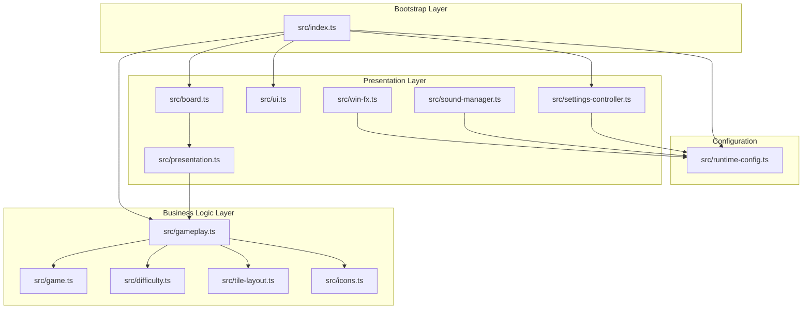
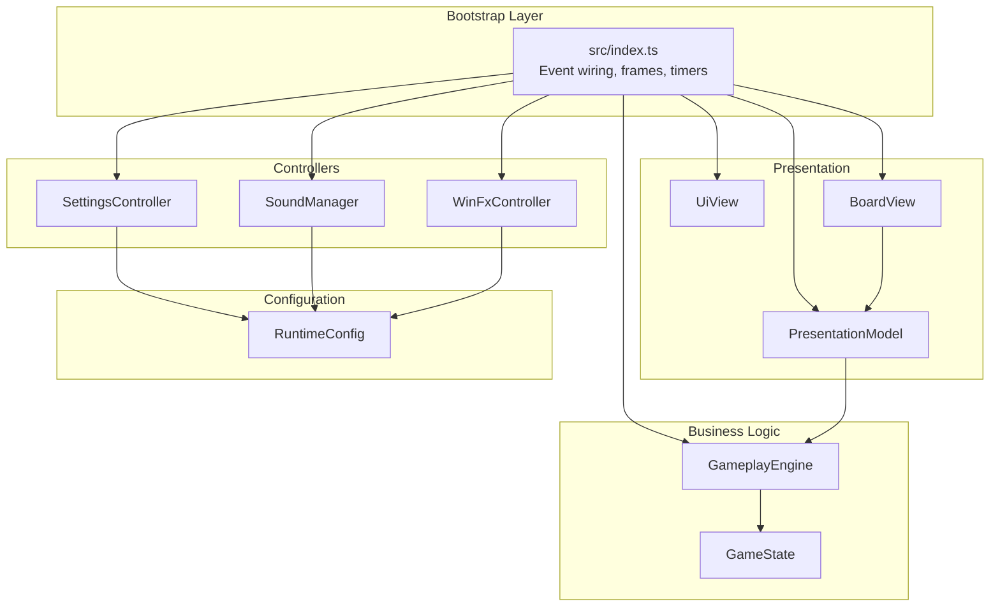
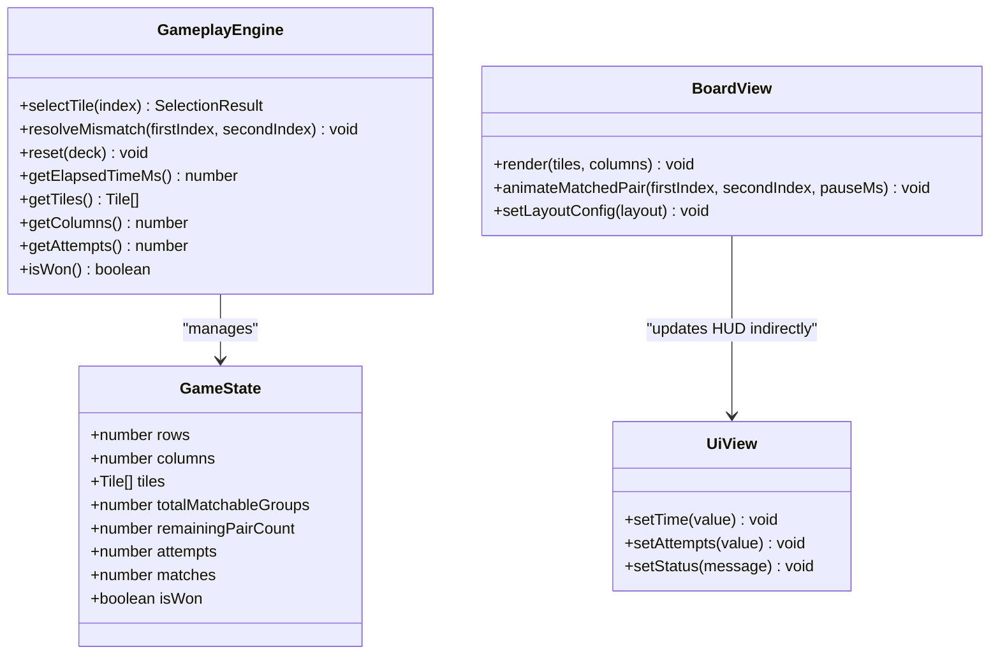
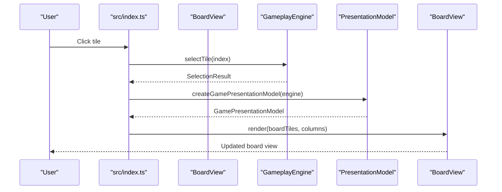
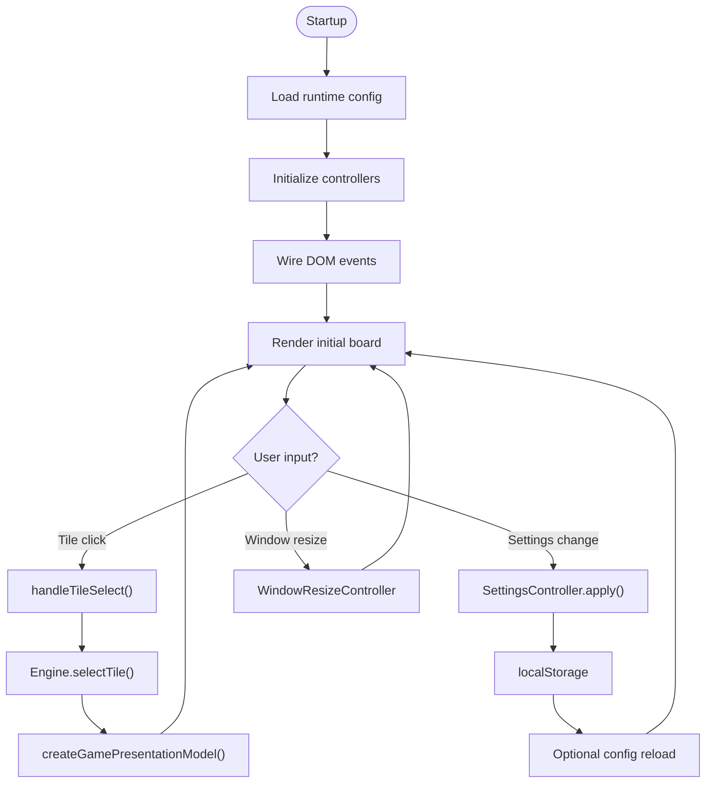
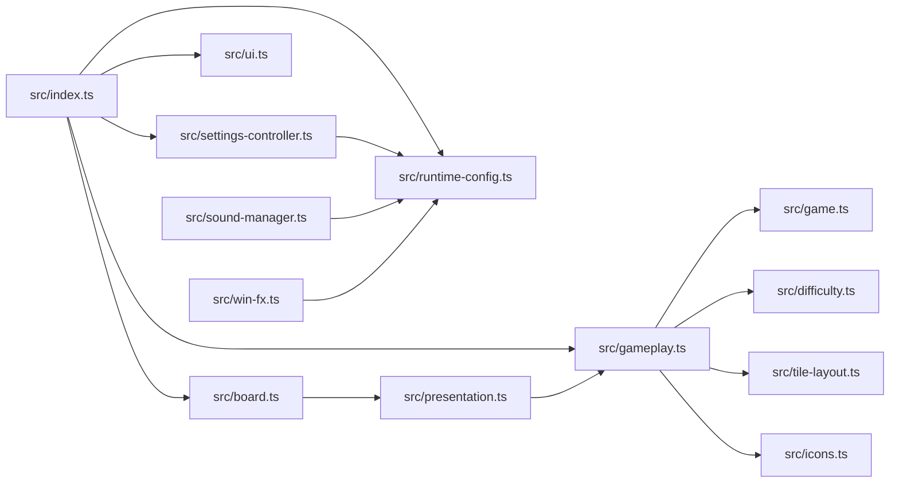

# Architecture Overview

<cite>
**Referenced Files in This Document**
- [src/index.ts](file://src/index.ts)
- [src/game.ts](file://src/game.ts)
- [src/gameplay.ts](file://src/gameplay.ts)
- [src/board.ts](file://src/board.ts)
- [src/ui.ts](file://src/ui.ts)
- [src/presentation.ts](file://src/presentation.ts)
- [src/difficulty.ts](file://src/difficulty.ts)
- [src/icons.ts](file://src/icons.ts)
- [src/tile-layout.ts](file://src/tile-layout.ts)
- [src/runtime-config.ts](file://src/runtime-config.ts)
- [src/settings-controller.ts](file://src/settings-controller.ts)
- [src/sound-manager.ts](file://src/sound-manager.ts)
- [src/win-fx.ts](file://src/win-fx.ts)
- [src/vite.config.ts](file://src/vite.config.ts)
- [package.json](file://package.json)
</cite>

## Table of Contents
1. [Introduction](#introduction)
2. [Project Structure](#project-structure)
3. [Core Components](#core-components)
4. [Architecture Overview](#architecture-overview)
5. [Detailed Component Analysis](#detailed-component-analysis)
6. [Dependency Analysis](#dependency-analysis)
7. [Performance Considerations](#performance-considerations)
8. [Troubleshooting Guide](#troubleshooting-guide)
9. [Conclusion](#conclusion)

## Introduction
MemoryBlox is a browser-based memory card matching game implemented in TypeScript with a clean layered architecture. The system follows Model-View-Controller (MVC) principles with clear separation of concerns across presentation, business logic, and data access layers. The architecture emphasizes event-driven interactions, configuration-driven behavior, and modular controllers that manage cohesive subsystems. Design patterns such as Factory (for game engines), Observer (through event wiring and UI updates), Strategy (for gameplay timing and scoring), and Singleton-like initialization (for runtime configuration) are employed to maintain modularity and testability.

## Project Structure
The project is organized into feature-focused modules under the `src` directory, each encapsulating a specific concern:
- Bootstrap and orchestration: [src/index.ts](file://src/index.ts)
- Game model and rules: [src/game.ts](file://src/game.ts), [src/gameplay.ts](file://src/gameplay.ts)
- Rendering and UI: [src/board.ts](file://src/board.ts), [src/ui.ts](file://src/ui.ts), [src/presentation.ts](file://src/presentation.ts)
- Configuration and runtime: [src/runtime-config.ts](file://src/runtime-config.ts), [src/difficulty.ts](file://src/difficulty.ts), [src/tile-layout.ts](file://src/tile-layout.ts)
- Assets and media: [src/icons.ts](file://src/icons.ts), [src/sound-manager.ts](file://src/sound-manager.ts), [src/win-fx.ts](file://src/win-fx.ts)
- Controllers: [src/settings-controller.ts](file://src/settings-controller.ts)

Build and tooling are managed via Vite and NPM scripts, with TailwindCSS integration for styling.

**Diagram sources**
- [src/index.ts:1-1100](file://src/index.ts#L1-L1100)
- [src/game.ts:1-419](file://src/game.ts#L1-L419)
- [src/gameplay.ts:1-107](file://src/gameplay.ts#L1-L107)
- [src/board.ts:1-523](file://src/board.ts#L1-L523)
- [src/ui.ts:1-49](file://src/ui.ts#L1-L49)
- [src/presentation.ts:1-25](file://src/presentation.ts#L1-L25)
- [src/difficulty.ts:1-40](file://src/difficulty.ts#L1-L40)
- [src/tile-layout.ts:1-54](file://src/tile-layout.ts#L1-L54)
- [src/icons.ts:1-726](file://src/icons.ts#L1-L726)
- [src/win-fx.ts:1-830](file://src/win-fx.ts#L1-L830)
- [src/sound-manager.ts:1-462](file://src/sound-manager.ts#L1-L462)
- [src/runtime-config.ts:1-399](file://src/runtime-config.ts#L1-L399)

**Section sources**
- [src/index.ts:1-1100](file://src/index.ts#L1-L1100)
- [src/game.ts:1-419](file://src/game.ts#L1-L419)
- [src/gameplay.ts:1-107](file://src/gameplay.ts#L1-L107)
- [src/board.ts:1-523](file://src/board.ts#L1-L523)
- [src/ui.ts:1-49](file://src/ui.ts#L1-L49)
- [src/presentation.ts:1-25](file://src/presentation.ts#L1-L25)
- [src/difficulty.ts:1-40](file://src/difficulty.ts#L1-L40)
- [src/tile-layout.ts:1-54](file://src/tile-layout.ts#L1-L54)
- [src/icons.ts:1-726](file://src/icons.ts#L1-L726)
- [src/win-fx.ts:1-830](file://src/win-fx.ts#L1-L830)
- [src/sound-manager.ts:1-462](file://src/sound-manager.ts#L1-L462)
- [src/runtime-config.ts:1-399](file://src/runtime-config.ts#L1-L399)
- [src/settings-controller.ts:1-372](file://src/settings-controller.ts#L1-L372)
- [src/vite.config.ts:1-80](file://src/vite.config.ts#L1-L80)
- [package.json:1-1](file://package.json#L1-L1)

## Core Components
- Bootstrap orchestrator: Initializes runtime configuration, constructs controllers, wires DOM events, and manages frames and timers. [src/index.ts:1-1100](file://src/index.ts#L1-L1100)
- Game engine facade: Encapsulates stateless game rules and exposes a typed interface for gameplay operations. [src/gameplay.ts:1-107](file://src/gameplay.ts#L1-L107)
- Game state model: Immutable data structures and pure functions implementing core game mechanics. [src/game.ts:1-419](file://src/game.ts#L1-L419)
- Board renderer: Manages tile DOM creation, accessibility attributes, animations, and layout. [src/board.ts:1-523](file://src/board.ts#L1-L523)
- UI view: Presentation-only view for HUD updates with no event wiring. [src/ui.ts:1-49](file://src/ui.ts#L1-L49)
- Presentation model: Transforms gameplay state into UI-friendly view models. [src/presentation.ts:1-25](file://src/presentation.ts#L1-L25)
- Configuration manager: Loads and validates runtime configuration from files. [src/runtime-config.ts:1-399](file://src/runtime-config.ts#L1-L399)
- Settings controller: Two-phase settings management with persistence and validation. [src/settings-controller.ts:1-372](file://src/settings-controller.ts#L1-L372)
- Asset systems: Icon packs, sound loading, and visual effects controllers. [src/icons.ts:1-726](file://src/icons.ts#L1-L726), [src/sound-manager.ts:1-462](file://src/sound-manager.ts#L1-L462), [src/win-fx.ts:1-830](file://src/win-fx.ts#L1-L830)

**Section sources**
- [src/index.ts:1-1100](file://src/index.ts#L1-L1100)
- [src/game.ts:1-419](file://src/game.ts#L1-L419)
- [src/gameplay.ts:1-107](file://src/gameplay.ts#L1-L107)
- [src/board.ts:1-523](file://src/board.ts#L1-L523)
- [src/ui.ts:1-49](file://src/ui.ts#L1-L49)
- [src/presentation.ts:1-25](file://src/presentation.ts#L1-L25)
- [src/runtime-config.ts:1-399](file://src/runtime-config.ts#L1-L399)
- [src/settings-controller.ts:1-372](file://src/settings-controller.ts#L1-L372)
- [src/icons.ts:1-726](file://src/icons.ts#L1-L726)
- [src/sound-manager.ts:1-462](file://src/sound-manager.ts#L1-L462)
- [src/win-fx.ts:1-830](file://src/win-fx.ts#L1-L830)

## Architecture Overview
MemoryBlox employs a layered architecture with explicit boundaries:
- Presentation Layer: UI rendering and user interaction (BoardView, UiView, WinFxController, SoundManager)
- Business Logic Layer: Game rules and state transitions (GameplayEngine, GameState, Tile operations)
- Data Access Layer: Configuration and asset management (Runtime configuration, icon packs, sound loader)
- Bootstrap Layer: Event wiring, session management, and subsystem coordination (index.ts)

The bootstrap layer owns all event wiring and delegates UI updates to presentation components. Controllers encapsulate cohesive subsystems (settings, audio, window resizing) and coordinate with the bootstrap layer through dependency injection and callbacks.

**Diagram sources**
- [src/index.ts:1-1100](file://src/index.ts#L1-L1100)
- [src/settings-controller.ts:1-372](file://src/settings-controller.ts#L1-L372)
- [src/sound-manager.ts:1-462](file://src/sound-manager.ts#L1-L462)
- [src/win-fx.ts:1-830](file://src/win-fx.ts#L1-L830)
- [src/ui.ts:1-49](file://src/ui.ts#L1-L49)
- [src/board.ts:1-523](file://src/board.ts#L1-L523)
- [src/presentation.ts:1-25](file://src/presentation.ts#L1-L25)
- [src/gameplay.ts:1-107](file://src/gameplay.ts#L1-L107)
- [src/game.ts:1-419](file://src/game.ts#L1-L419)
- [src/runtime-config.ts:1-399](file://src/runtime-config.ts#L1-L399)

## Detailed Component Analysis

### MVC Pattern Implementation
- Model: GameState and tile structures define immutable game state and pure functions for state transitions. [src/game.ts:1-419](file://src/game.ts#L1-L419)
- View: BoardView renders tiles with accessibility attributes and animations; UiView displays HUD updates. [src/board.ts:1-523](file://src/board.ts#L1-L523), [src/ui.ts:1-49](file://src/ui.ts#L1-L49)
- Controller: GameplayEngine facade coordinates state mutations; SettingsController manages UI settings; Bootstrap orchestrates events and frames. [src/gameplay.ts:1-107](file://src/gameplay.ts#L1-L107), [src/settings-controller.ts:1-372](file://src/settings-controller.ts#L1-L372), [src/index.ts:1-1100](file://src/index.ts#L1-L1100)

**Diagram sources**
- [src/game.ts:1-419](file://src/game.ts#L1-L419)
- [src/gameplay.ts:1-107](file://src/gameplay.ts#L1-L107)
- [src/board.ts:1-523](file://src/board.ts#L1-L523)
- [src/ui.ts:1-49](file://src/ui.ts#L1-L49)

**Section sources**
- [src/game.ts:1-419](file://src/game.ts#L1-L419)
- [src/gameplay.ts:1-107](file://src/gameplay.ts#L1-L107)
- [src/board.ts:1-523](file://src/board.ts#L1-L523)
- [src/ui.ts:1-49](file://src/ui.ts#L1-L49)

### Event-Driven Architecture
The bootstrap layer wires all user interactions and system events:
- DOM event handlers for tile selection, keyboard navigation, settings changes, and window resize
- Timers for HUD updates and auto-demo sequences
- Abort controllers for cancellable async operations

**Diagram sources**
- [src/index.ts:639-780](file://src/index.ts#L639-L780)
- [src/gameplay.ts:101-107](file://src/gameplay.ts#L101-L107)
- [src/presentation.ts:12-25](file://src/presentation.ts#L12-L25)
- [src/board.ts:227-306](file://src/board.ts#L227-L306)

**Section sources**
- [src/index.ts:639-780](file://src/index.ts#L639-L780)
- [src/gameplay.ts:101-107](file://src/gameplay.ts#L101-L107)
- [src/presentation.ts:12-25](file://src/presentation.ts#L12-L25)
- [src/board.ts:227-306](file://src/board.ts#L227-L306)

### Design Patterns
- Factory: GameplayEngine factory creates engines with specific configurations. [src/gameplay.ts:101-107](file://src/gameplay.ts#L101-L107)
- Observer: Bootstrap subscribes to DOM events and state changes; controllers publish status updates. [src/index.ts:1-1100](file://src/index.ts#L1-L1100), [src/settings-controller.ts:223-294](file://src/settings-controller.ts#L223-L294)
- Strategy: Runtime configuration drives gameplay timing, animation speed, and visual effects. [src/runtime-config.ts:1-399](file://src/runtime-config.ts#L1-L399)
- Singleton-like initialization: Runtime configuration loaders provide global defaults and overrides. [src/runtime-config.ts:238-353](file://src/runtime-config.ts#L238-L353)

**Section sources**
- [src/gameplay.ts:101-107](file://src/gameplay.ts#L101-L107)
- [src/index.ts:1-1100](file://src/index.ts#L1-L1100)
- [src/settings-controller.ts:223-294](file://src/settings-controller.ts#L223-L294)
- [src/runtime-config.ts:1-399](file://src/runtime-config.ts#L1-L399)

### Component Interactions
- Bootstrap initializes controllers, loads runtime configuration, and manages frames
- GameplayEngine encapsulates state and exposes typed operations
- BoardView renders tiles and applies animations
- PresentationModel transforms engine state for rendering
- Controllers manage subsystems and persist settings

**Diagram sources**
- [src/index.ts:1-1100](file://src/index.ts#L1-L1100)
- [src/settings-controller.ts:89-121](file://src/settings-controller.ts#L89-L121)
- [src/gameplay.ts:101-107](file://src/gameplay.ts#L101-L107)
- [src/presentation.ts:12-25](file://src/presentation.ts#L12-L25)
- [src/board.ts:227-306](file://src/board.ts#L227-L306)

**Section sources**
- [src/index.ts:1-1100](file://src/index.ts#L1-L1100)
- [src/settings-controller.ts:89-121](file://src/settings-controller.ts#L89-L121)
- [src/gameplay.ts:101-107](file://src/gameplay.ts#L101-L107)
- [src/presentation.ts:12-25](file://src/presentation.ts#L12-L25)
- [src/board.ts:227-306](file://src/board.ts#L227-L306)

## Dependency Analysis
The system exhibits low coupling and high cohesion:
- Bootstrap depends on controllers and configuration
- Controllers depend on configuration and presentational helpers
- Presentation components depend on business logic models
- Business logic is stateless and pure, minimizing side effects

**Diagram sources**
- [src/index.ts:1-1100](file://src/index.ts#L1-L1100)
- [src/gameplay.ts:1-107](file://src/gameplay.ts#L1-L107)
- [src/game.ts:1-419](file://src/game.ts#L1-L419)
- [src/difficulty.ts:1-40](file://src/difficulty.ts#L1-L40)
- [src/tile-layout.ts:1-54](file://src/tile-layout.ts#L1-L54)
- [src/icons.ts:1-726](file://src/icons.ts#L1-L726)
- [src/board.ts:1-523](file://src/board.ts#L1-L523)
- [src/presentation.ts:1-25](file://src/presentation.ts#L1-L25)
- [src/ui.ts:1-49](file://src/ui.ts#L1-L49)
- [src/settings-controller.ts:1-372](file://src/settings-controller.ts#L1-L372)
- [src/runtime-config.ts:1-399](file://src/runtime-config.ts#L1-L399)
- [src/sound-manager.ts:1-462](file://src/sound-manager.ts#L1-L462)
- [src/win-fx.ts:1-830](file://src/win-fx.ts#L1-L830)

**Section sources**
- [src/index.ts:1-1100](file://src/index.ts#L1-L1100)
- [src/gameplay.ts:1-107](file://src/gameplay.ts#L1-L107)
- [src/game.ts:1-419](file://src/game.ts#L1-L419)
- [src/difficulty.ts:1-40](file://src/difficulty.ts#L1-L40)
- [src/tile-layout.ts:1-54](file://src/tile-layout.ts#L1-L54)
- [src/icons.ts:1-726](file://src/icons.ts#L1-L726)
- [src/board.ts:1-523](file://src/board.ts#L1-L523)
- [src/presentation.ts:1-25](file://src/presentation.ts#L1-L25)
- [src/ui.ts:1-49](file://src/ui.ts#L1-L49)
- [src/settings-controller.ts:1-372](file://src/settings-controller.ts#L1-L372)
- [src/runtime-config.ts:1-399](file://src/runtime-config.ts#L1-L399)
- [src/sound-manager.ts:1-462](file://src/sound-manager.ts#L1-L462)
- [src/win-fx.ts:1-830](file://src/win-fx.ts#L1-L830)

## Performance Considerations
- Lazy rendering: BoardView caches rendered back faces to avoid repeated DOM work for hidden tiles. [src/board.ts:264-273](file://src/board.ts#L264-L273)
- Animation scaling: Runtime configuration controls animation speed and durations to balance performance and UX. [src/runtime-config.ts:151-156](file://src/runtime-config.ts#L151-L156)
- Cancellable operations: Abort controllers and timers prevent resource leaks during rapid user interactions. [src/index.ts:207-222](file://src/index.ts#L207-L222)
- Asset preloading: SoundManager preloads audio assets and uses round-robin selection to minimize latency. [src/sound-manager.ts:264-297](file://src/sound-manager.ts#L264-L297)

[No sources needed since this section provides general guidance]

## Troubleshooting Guide
- Configuration validation: Runtime configuration parsing includes bounds checking and fallbacks to defaults. [src/runtime-config.ts:247-256](file://src/runtime-config.ts#L247-L256), [src/runtime-config.ts:259-268](file://src/runtime-config.ts#L259-L268)
- Settings persistence: SettingsController validates inputs and persists to localStorage with clamping. [src/settings-controller.ts:148-151](file://src/settings-controller.ts#L148-L151), [src/settings-controller.ts:315-358](file://src/settings-controller.ts#L315-L358)
- Event cleanup: Bootstrap clears timers and abort controllers to prevent memory leaks. [src/index.ts:467-481](file://src/index.ts#L467-L481), [src/index.ts:299-307](file://src/index.ts#L299-L307)

**Section sources**
- [src/runtime-config.ts:247-268](file://src/runtime-config.ts#L247-L268)
- [src/settings-controller.ts:148-151](file://src/settings-controller.ts#L148-L151)
- [src/settings-controller.ts:315-358](file://src/settings-controller.ts#L315-L358)
- [src/index.ts:467-307](file://src/index.ts#L467-L307)

## Conclusion
MemoryBlox demonstrates a well-structured, event-driven architecture that cleanly separates presentation, business logic, and configuration concerns. The bootstrap layer orchestrates controllers and events while maintaining loose coupling through typed interfaces and configuration-driven behavior. Design patterns such as Factory, Observer, Strategy, and controlled initialization contribute to modularity, testability, and maintainability. The system leverages browser APIs for rendering, audio, and storage while providing robust configuration and performance optimizations.