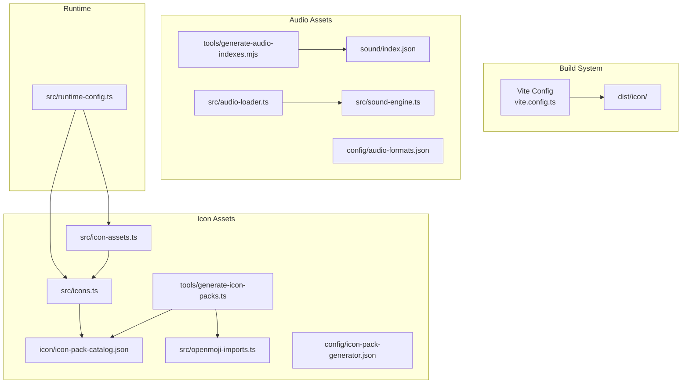
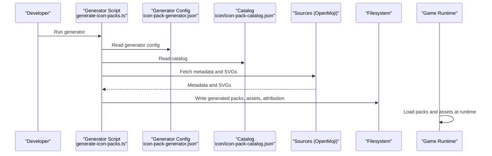
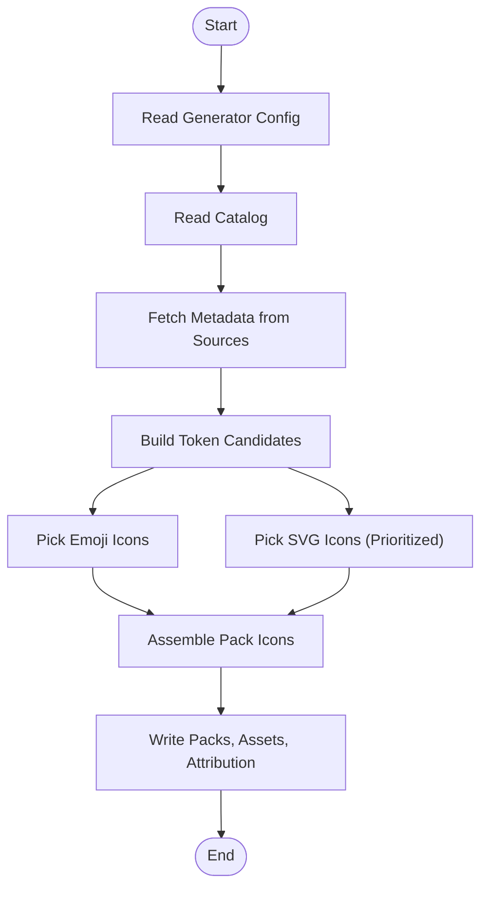
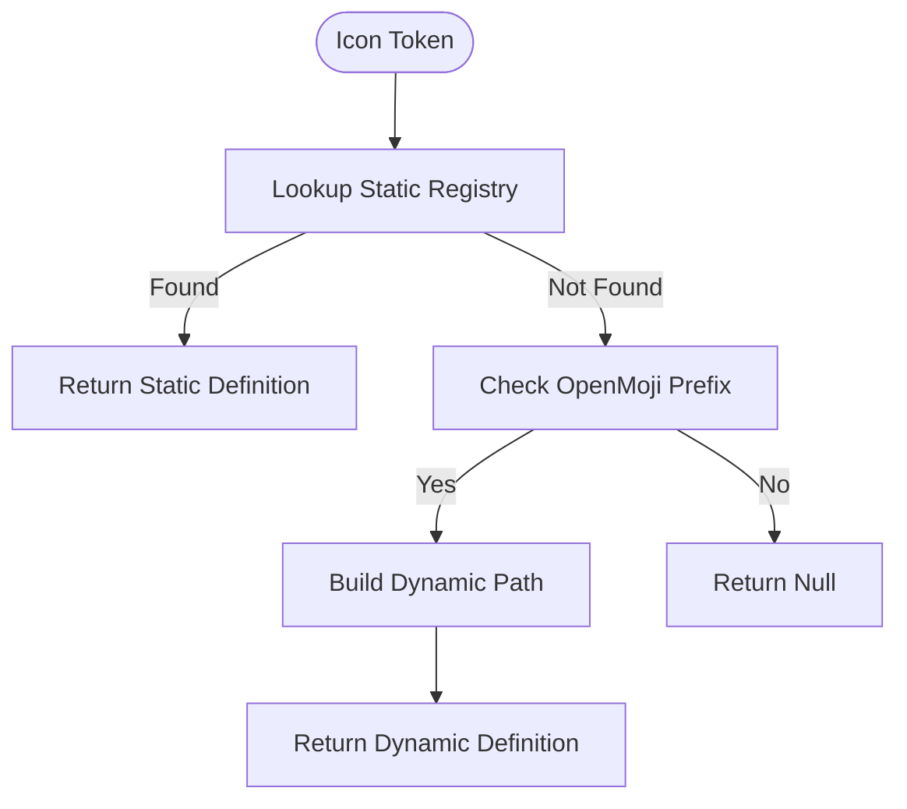
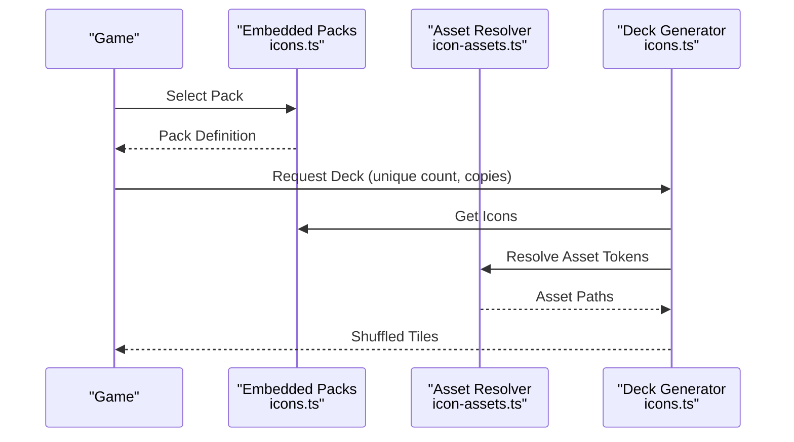
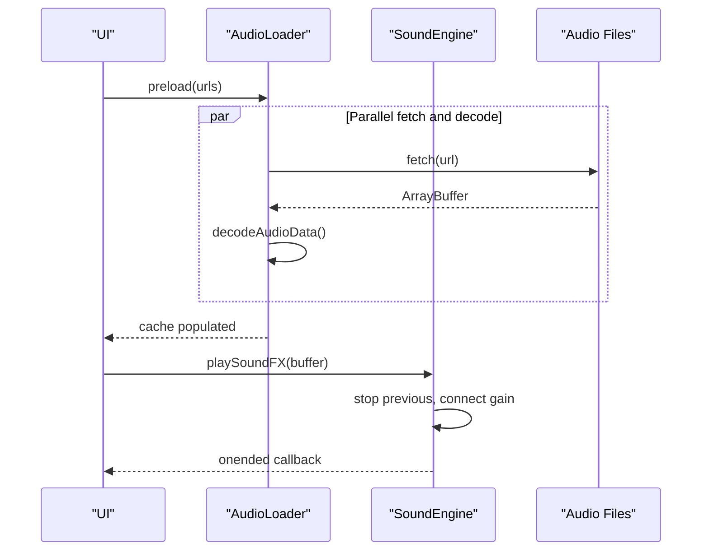
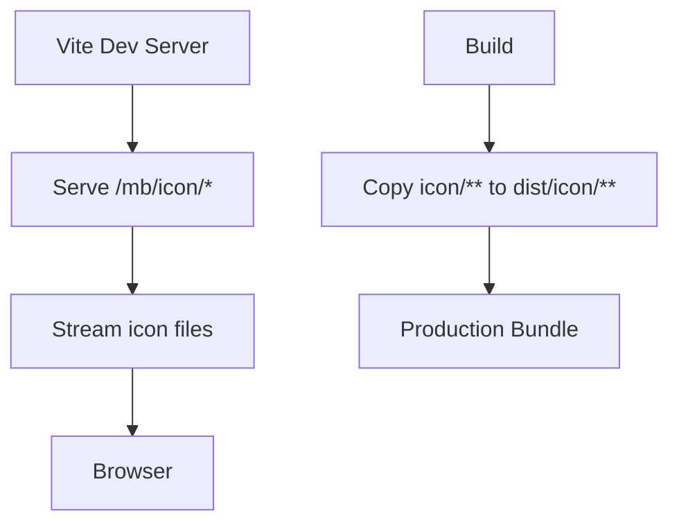
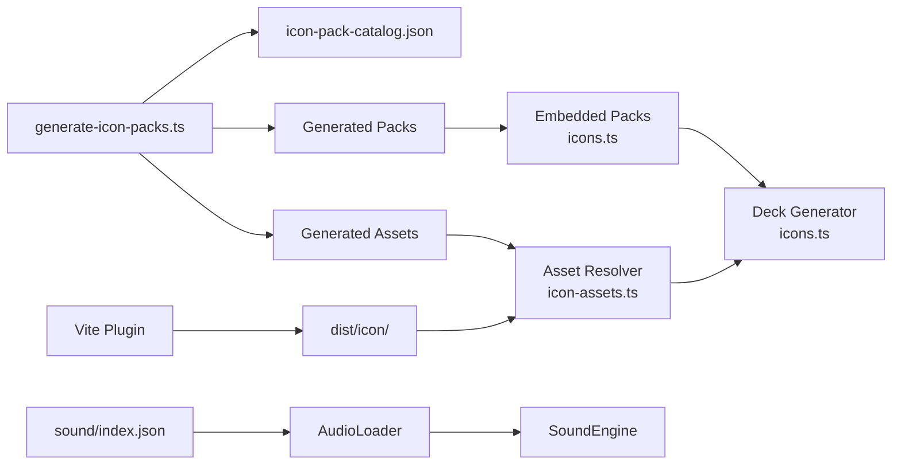

# Asset Management Architecture

<cite>
**Referenced Files in This Document**
- [icon-assets.ts](file://src/icon-assets.ts)
- [openmoji-imports.ts](file://src/openmoji-imports.ts)
- [icons.ts](file://src/icons.ts)
- [audio-loader.ts](file://src/audio-loader.ts)
- [sound-engine.ts](file://src/sound-engine.ts)
- [icon-pack-catalog.json](file://icon/icon-pack-catalog.json)
- [icon-pack-generator.json](file://config/icon-pack-generator.json)
- [generate-icon-packs.ts](file://tools/generate-icon-packs.ts)
- [generate-audio-indexes.mjs](file://tools/generate-audio-indexes.mjs)
- [audio-formats.json](file://config/audio-formats.json)
- [vite.config.ts](file://vite.config.ts)
- [runtime-config.ts](file://src/runtime-config.ts)
- [index.json](file://sound/index.json)
- [icon-pack-generator.md](file://docs/icon-pack-generator.md)
- [emoji-inventory.md](file://docs/emoji-inventory.md)
- [ICON_SOURCES.md](file://icon/ICON_SOURCES.md)
- [icon/README.md](file://icon/README.md)
</cite>

## Table of Contents
1. [Introduction](#introduction)
2. [Project Structure](#project-structure)
3. [Core Components](#core-components)
4. [Architecture Overview](#architecture-overview)
5. [Detailed Component Analysis](#detailed-component-analysis)
6. [Dependency Analysis](#dependency-analysis)
7. [Performance Considerations](#performance-considerations)
8. [Troubleshooting Guide](#troubleshooting-guide)
9. [Conclusion](#conclusion)
10. [Appendices](#appendices)

## Introduction
This document describes the asset management architecture for the Memory Blox project, focusing on icon and audio asset discovery, loading, cataloging, and runtime switching. The system uses a catalog-based approach with JSON manifests for metadata, supports lazy loading and caching, and integrates with the build system for bundling. It documents the icon asset pipeline from OpenMoji imports through catalog generation to runtime selection, along with validation, fallback strategies, and performance optimizations.

## Project Structure
The asset system spans several areas:
- Icon assets: built-in Unicode glyphs and imported SVGs (OpenMoji), managed via catalogs and generators
- Audio assets: organized by index manifest and decoded at runtime
- Build integration: Vite plugin for development and production bundling of icon assets
- Runtime configuration: controls UI behavior and asset-related parameters

**Diagram sources**
- [vite.config.ts:1-80](file://vite.config.ts#L1-L80)
- [icons.ts:1-726](file://src/icons.ts#L1-L726)
- [openmoji-imports.ts:1-199](file://src/openmoji-imports.ts#L1-L199)
- [icon-assets.ts:1-189](file://src/icon-assets.ts#L1-L189)
- [icon-pack-catalog.json:1-474](file://icon/icon-pack-catalog.json#L1-L474)
- [icon-pack-generator.json:1-67](file://config/icon-pack-generator.json#L1-L67)
- [generate-icon-packs.ts:1-474](file://tools/generate-icon-packs.ts#L1-L474)
- [audio-loader.ts:1-118](file://src/audio-loader.ts#L1-L118)
- [sound-engine.ts:1-110](file://src/sound-engine.ts#L1-L110)
- [audio-formats.json:1-4](file://config/audio-formats.json#L1-L4)
- [generate-audio-indexes.mjs:1-58](file://tools/generate-audio-indexes.mjs#L1-L58)
- [runtime-config.ts:1-399](file://src/runtime-config.ts#L1-L399)

**Section sources**
- [vite.config.ts:1-80](file://vite.config.ts#L1-L80)
- [icons.ts:1-726](file://src/icons.ts#L1-L726)
- [icon-pack-catalog.json:1-474](file://icon/icon-pack-catalog.json#L1-L474)
- [icon-pack-generator.json:1-67](file://config/icon-pack-generator.json#L1-L67)
- [generate-icon-packs.ts:1-474](file://tools/generate-icon-packs.ts#L1-L474)
- [audio-loader.ts:1-118](file://src/audio-loader.ts#L1-L118)
- [sound-engine.ts:1-110](file://src/sound-engine.ts#L1-L110)
- [audio-formats.json:1-4](file://config/audio-formats.json#L1-L4)
- [generate-audio-indexes.mjs:1-58](file://tools/generate-audio-indexes.mjs#L1-L58)
- [runtime-config.ts:1-399](file://src/runtime-config.ts#L1-L399)

## Core Components
- Icon asset definitions and runtime lookup: centralized mapping and dynamic resolution for OpenMoji tokens
- Icon pack catalog and generation: JSON catalog drives pack composition; generator selects emoji and SVG assets with ratios and priorities
- Audio loader and sound engine: fetch, decode, cache, and play audio with gain control and muting
- Build-time bundling: Vite plugin serves and copies icon assets during dev and build
- Runtime configuration: exposes UI and gameplay parameters that influence asset usage and behavior

Key responsibilities:
- Catalog-based icon discovery and validation
- Lazy loading and caching for both icons and audio
- Fallback strategies for missing assets and invalid configurations
- Integration with build system for bundling and development serving

**Section sources**
- [icon-assets.ts:1-189](file://src/icon-assets.ts#L1-L189)
- [icons.ts:1-726](file://src/icons.ts#L1-L726)
- [icon-pack-catalog.json:1-474](file://icon/icon-pack-catalog.json#L1-L474)
- [generate-icon-packs.ts:1-474](file://tools/generate-icon-packs.ts#L1-L474)
- [audio-loader.ts:1-118](file://src/audio-loader.ts#L1-L118)
- [sound-engine.ts:1-110](file://src/sound-engine.ts#L1-L110)
- [vite.config.ts:1-80](file://vite.config.ts#L1-L80)
- [runtime-config.ts:1-399](file://src/runtime-config.ts#L1-L399)

## Architecture Overview
The asset architecture combines static catalogs, dynamic generators, runtime loaders, and build-time bundling:

**Diagram sources**
- [generate-icon-packs.ts:351-474](file://tools/generate-icon-packs.ts#L351-L474)
- [icon-pack-generator.json:1-67](file://config/icon-pack-generator.json#L1-L67)
- [icon-pack-catalog.json:1-474](file://icon/icon-pack-catalog.json#L1-L474)

## Detailed Component Analysis

### Icon Asset Pipeline (OpenMoji Imports to Runtime Selection)
The icon pipeline transforms OpenMoji assets into runtime-ready packs:
- Discovery: imported OpenMoji tokens are enumerated and validated
- Catalog generation: generator selects emoji and SVG assets based on keywords, ratios, and source priorities
- Packaging: packs are written to artifacts with asset registries and attributions
- Runtime selection: packs are embedded and validated; decks are generated with fallbacks for asset ratios

**Diagram sources**
- [generate-icon-packs.ts:351-474](file://tools/generate-icon-packs.ts#L351-L474)
- [icon-pack-generator.json:1-67](file://config/icon-pack-generator.json#L1-L67)
- [icon-pack-catalog.json:1-474](file://icon/icon-pack-catalog.json#L1-L474)

Implementation highlights:
- Token scoring and prioritization ensure high-quality matches while falling back to lower-priority sources when needed
- Asset registry maps tokens to on-disk paths and labels for runtime resolution
- Attribution CSV generation tracks licenses and authors for compliance

**Section sources**
- [generate-icon-packs.ts:1-474](file://tools/generate-icon-packs.ts#L1-L474)
- [icon-pack-generator.json:1-67](file://config/icon-pack-generator.json#L1-L67)
- [icon-pack-catalog.json:1-474](file://icon/icon-pack-catalog.json#L1-L474)
- [icon/ICON_SOURCES.md:1-28](file://icon/ICON_SOURCES.md#L1-L28)
- [icon/README.md:1-23](file://icon/README.md#L1-L23)

### Icon Asset Definitions and Runtime Lookup
The runtime system resolves icon tokens to asset definitions:
- Static registry for known tokens
- Dynamic resolution for OpenMoji tokens using a standardized prefix
- Validation helpers to check token existence

**Diagram sources**
- [icon-assets.ts:167-188](file://src/icon-assets.ts#L167-L188)

**Section sources**
- [icon-assets.ts:1-189](file://src/icon-assets.ts#L1-L189)

### Icon Pack Catalog and Deck Generation
Icon packs are defined in a catalog and embedded in the application:
- Catalog JSON lists packs with preview icons and icon arrays
- Embedded pack definitions enforce uniqueness and minimum sizes
- Deck generation selects icons from packs, applies copy counts, and ensures asset-to-standard icon balance

**Diagram sources**
- [icons.ts:56-528](file://src/icons.ts#L56-L528)
- [icons.ts:652-725](file://src/icons.ts#L652-L725)
- [icon-assets.ts:167-188](file://src/icon-assets.ts#L167-L188)

Validation and fallbacks:
- Unique icon validation prevents duplicates within and across packs
- Minimum icon count enforcement ensures sufficient variety for all difficulties
- Asset ratio constraints ensure a balanced mix of imported and standard icons

**Section sources**
- [icons.ts:541-580](file://src/icons.ts#L541-L580)
- [icons.ts:652-725](file://src/icons.ts#L652-L725)
- [emoji-inventory.md:1-166](file://docs/emoji-inventory.md#L1-L166)

### Audio Asset Loading and Playback
Audio assets are discovered via an index manifest and loaded lazily with caching:
- Index manifest enumerates supported audio files
- Loader fetches and decodes audio buffers, caching decoded results
- Sound engine plays buffers with gain control and muting

**Diagram sources**
- [audio-loader.ts:30-88](file://src/audio-loader.ts#L30-L88)
- [sound-engine.ts:47-75](file://src/sound-engine.ts#L47-L75)
- [index.json:1-17](file://sound/index.json#L1-L17)
- [generate-audio-indexes.mjs:34-57](file://tools/generate-audio-indexes.mjs#L34-L57)

**Section sources**
- [audio-loader.ts:1-118](file://src/audio-loader.ts#L1-L118)
- [sound-engine.ts:1-110](file://src/sound-engine.ts#L1-L110)
- [index.json:1-17](file://sound/index.json#L1-L17)
- [generate-audio-indexes.mjs:1-58](file://tools/generate-audio-indexes.mjs#L1-L58)
- [audio-formats.json:1-4](file://config/audio-formats.json#L1-L4)

### Build System Integration and Asset Bundling
The build system integrates asset handling for development and production:
- Development middleware serves icon assets with proper MIME types and path traversal protection
- Build phase recursively copies icon assets into the distribution directory

**Diagram sources**
- [vite.config.ts:11-62](file://vite.config.ts#L11-L62)

**Section sources**
- [vite.config.ts:1-80](file://vite.config.ts#L1-L80)

### Runtime Configuration and Theme/Difficulty Switching
Runtime configuration influences asset-related behavior:
- UI and gameplay timing parameters affect asset usage and perceived performance
- Asset-related toggles (e.g., opacity) impact visual fidelity
- Theme and difficulty levels can be mapped to packs and asset ratios via configuration

**Section sources**
- [runtime-config.ts:99-353](file://src/runtime-config.ts#L99-L353)

## Dependency Analysis
The asset system exhibits low coupling and high cohesion:
- Icon pipeline: generator depends on catalog and sources; outputs are consumed by runtime packs
- Audio pipeline: loader and engine are loosely coupled; index manifest decouples discovery from runtime
- Build integration: Vite plugin isolates asset serving and bundling concerns

**Diagram sources**
- [generate-icon-packs.ts:351-474](file://tools/generate-icon-packs.ts#L351-L474)
- [icon-pack-catalog.json:1-474](file://icon/icon-pack-catalog.json#L1-L474)
- [icons.ts:56-528](file://src/icons.ts#L56-L528)
- [icon-assets.ts:1-189](file://src/icon-assets.ts#L1-L189)
- [audio-loader.ts:1-118](file://src/audio-loader.ts#L1-L118)
- [sound-engine.ts:1-110](file://src/sound-engine.ts#L1-L110)
- [index.json:1-17](file://sound/index.json#L1-L17)
- [vite.config.ts:11-62](file://vite.config.ts#L11-L62)

**Section sources**
- [generate-icon-packs.ts:1-474](file://tools/generate-icon-packs.ts#L1-L474)
- [icons.ts:1-726](file://src/icons.ts#L1-L726)
- [icon-assets.ts:1-189](file://src/icon-assets.ts#L1-L189)
- [audio-loader.ts:1-118](file://src/audio-loader.ts#L1-L118)
- [sound-engine.ts:1-110](file://src/sound-engine.ts#L1-L110)
- [index.json:1-17](file://sound/index.json#L1-L17)
- [vite.config.ts:1-80](file://vite.config.ts#L1-L80)

## Performance Considerations
- Lazy loading and caching: both icon and audio systems defer work until needed and reuse decoded/cached buffers
- Parallel preloading: audio loader supports concurrent loading with partial failure logging
- Balanced asset ratios: generator maintains emoji/SVG ratios to reduce bundle size while preserving visual diversity
- Minimizing DOM work: embedded pack definitions enable immediate deck generation without network requests
- Build-time bundling: Vite plugin avoids runtime asset discovery overhead in production

[No sources needed since this section provides general guidance]

## Troubleshooting Guide
Common issues and resolutions:
- Missing or invalid asset tokens: use resolver checks and fallbacks; validate tokens against imported sets
- Insufficient icons per pack: ensure minimum counts and re-run generator with adjusted ratios
- Audio load failures: inspect network errors and decoder exceptions; confirm file extensions and index manifest
- Build bundling problems: verify Vite plugin configuration and copied asset paths
- License compliance: maintain accurate attribution CSV entries for imported assets

**Section sources**
- [icon-assets.ts:167-188](file://src/icon-assets.ts#L167-L188)
- [icons.ts:541-580](file://src/icons.ts#L541-L580)
- [audio-loader.ts:30-88](file://src/audio-loader.ts#L30-L88)
- [vite.config.ts:11-62](file://vite.config.ts#L11-L62)
- [ICON_SOURCES.md:1-28](file://icon/ICON_SOURCES.md#L1-L28)

## Conclusion
The asset management system employs a robust, catalog-driven approach for icons and audio, combining static catalogs, deterministic generation, lazy loading, and caching. It integrates seamlessly with the build system and exposes runtime configuration hooks for theme and difficulty adaptation. Validation and fallback strategies ensure reliability, while performance optimizations minimize latency and resource usage.

[No sources needed since this section summarizes without analyzing specific files]

## Appendices

### Appendix A: Icon Pack Generator Workflow
- Run the generator with optional seed for reproducibility
- Review generated outputs before promotion
- Merge attributions into the project’s attribution records

**Section sources**
- [icon-pack-generator.md:1-43](file://docs/icon-pack-generator.md#L1-L43)
- [generate-icon-packs.ts:80-107](file://tools/generate-icon-packs.ts#L80-L107)
- [icon-pack-generator.json:1-67](file://config/icon-pack-generator.json#L1-L67)

### Appendix B: Audio Index Generation
- Automatically scan configured audio directories and write index manifests
- Enforce supported extensions from configuration

**Section sources**
- [generate-audio-indexes.mjs:1-58](file://tools/generate-audio-indexes.mjs#L1-L58)
- [audio-formats.json:1-4](file://config/audio-formats.json#L1-L4)