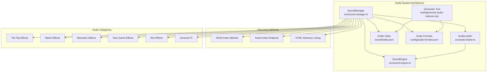
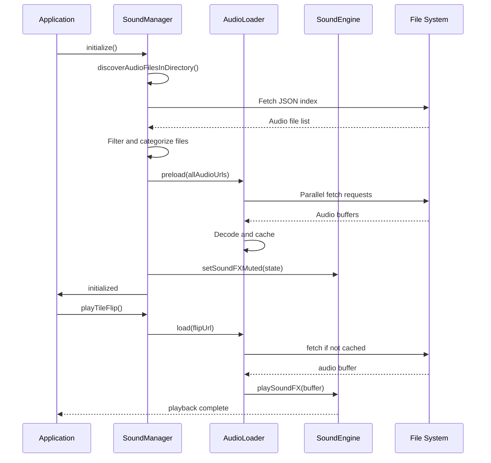
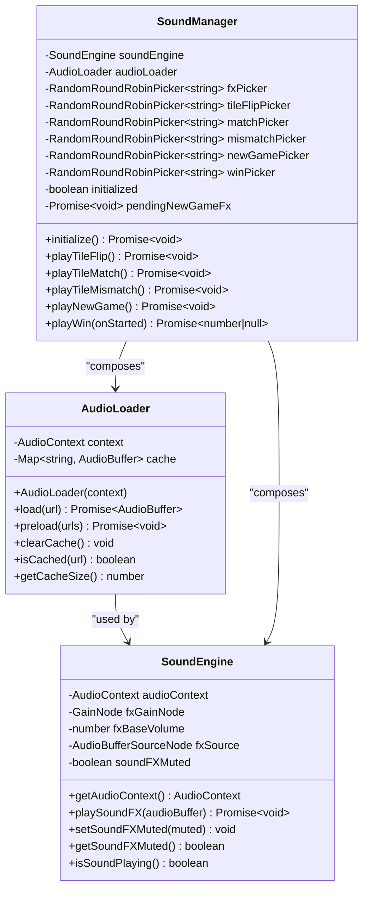
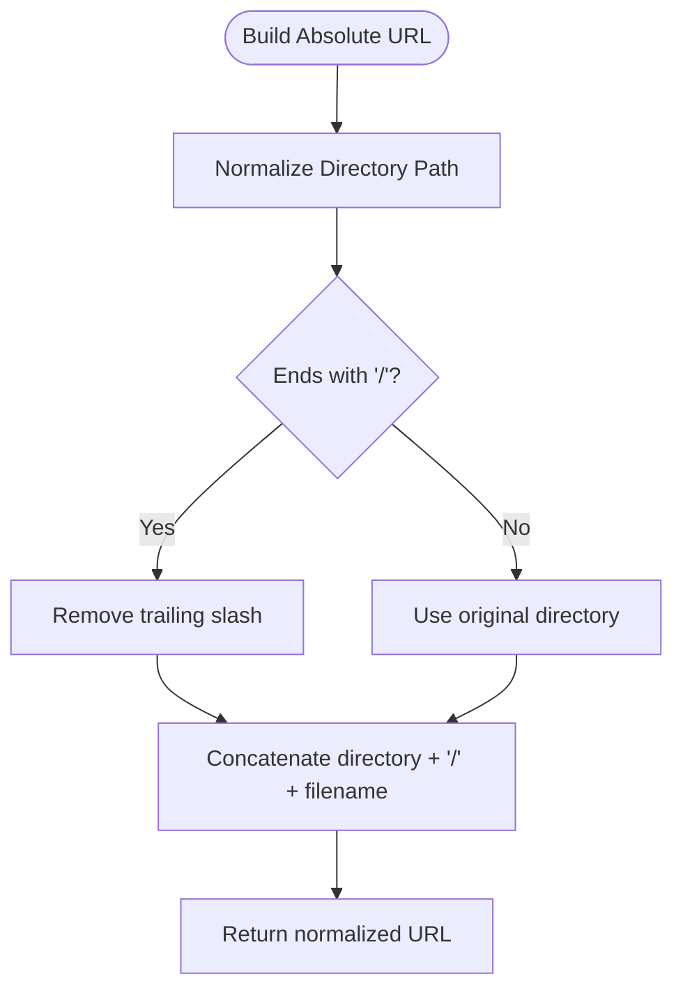
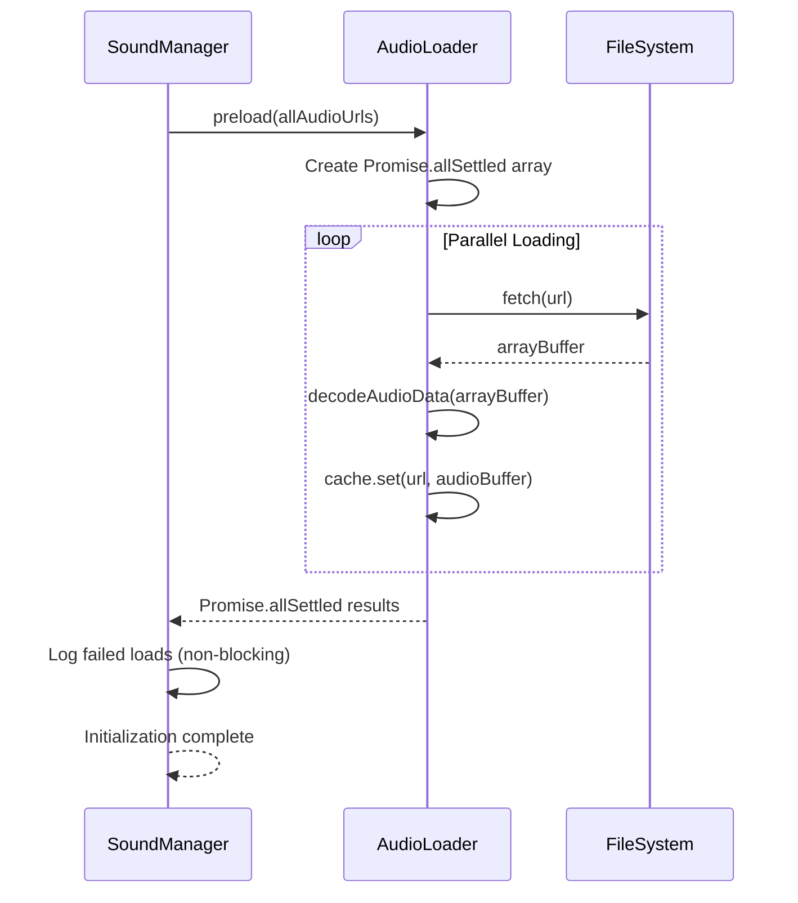
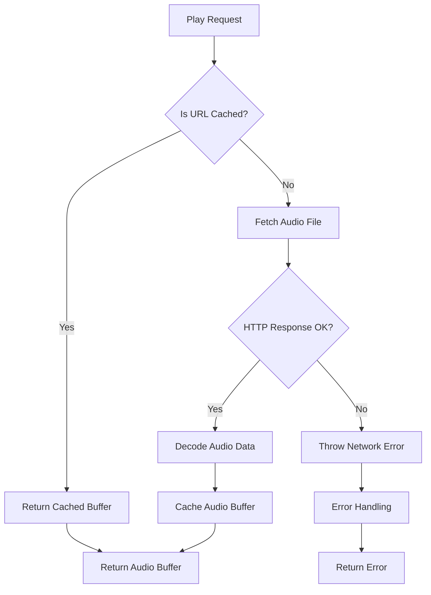
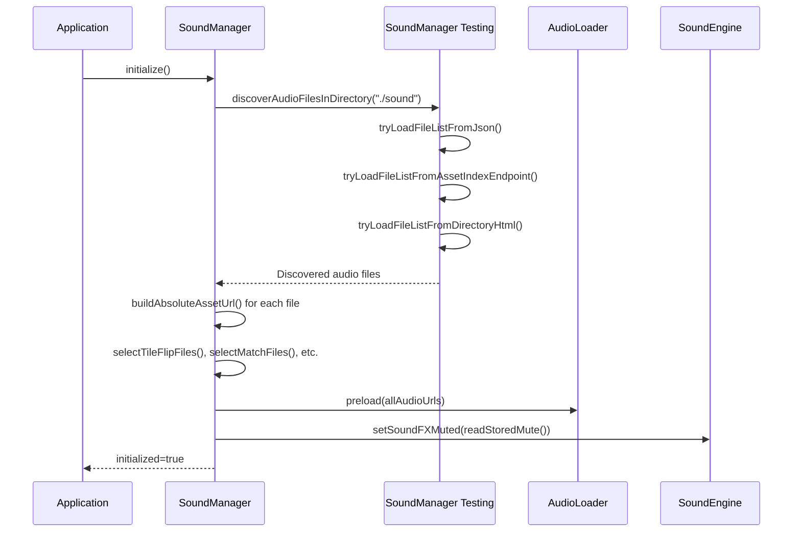
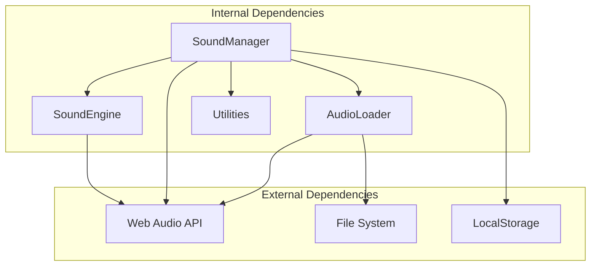

# Audio Loader Component

<cite>
**Referenced Files in This Document**
- [audio-loader.ts](file://src/audio-loader.ts)
- [sound-manager.ts](file://src/sound-manager.ts)
- [sound-engine.ts](file://src/sound-engine.ts)
- [index.json](file://sound/index.json)
- [audio-formats.json](file://config/audio-formats.json)
- [generate-audio-indexes.mjs](file://tools/generate-audio-indexes.mjs)
- [audio-loader.test.ts](file://tests/audio-loader.test.ts)
- [README.md](file://README.md)
</cite>

## Table of Contents
1. [Introduction](#introduction)
2. [Project Structure](#project-structure)
3. [Core Components](#core-components)
4. [Architecture Overview](#architecture-overview)
5. [Detailed Component Analysis](#detailed-component-analysis)
6. [Dependency Analysis](#dependency-analysis)
7. [Performance Considerations](#performance-considerations)
8. [Troubleshooting Guide](#troubleshooting-guide)
9. [Conclusion](#conclusion)

## Introduction
This document provides comprehensive technical documentation for the AudioLoader class, which is responsible for audio asset discovery and loading in the MemoryBlox browser game. The AudioLoader implements a robust multi-method file discovery strategy that supports JSON index files, asset-index endpoints, and HTML directory listings. It provides sophisticated filename pattern matching for categorizing different types of audio effects (tile flips, matches, mismatches, wins, new games) and manages absolute URL construction with asset path normalization. The component integrates seamlessly with the SoundManager's initialization process, implementing both preloading strategies for optimal game performance and individual loading mechanisms for on-demand audio playback. The documentation covers error handling for failed loads, timeout management, fallback mechanisms, and the complete audio file discovery pipeline integration.

## Project Structure
The audio system is organized around three primary components that work together to deliver seamless audio experiences:

**Diagram sources**
- [audio-loader.ts:1-118](file://src/audio-loader.ts#L1-L118)
- [sound-manager.ts:238-462](file://src/sound-manager.ts#L238-L462)
- [sound-engine.ts:8-110](file://src/sound-engine.ts#L8-L110)

**Section sources**
- [README.md:162-206](file://README.md#L162-L206)

## Core Components
The audio system consists of three interconnected components that handle different aspects of audio asset management:

### AudioLoader
The AudioLoader class serves as the central audio asset management utility, providing:
- **Caching Mechanism**: Efficiently caches decoded AudioBuffer instances to avoid redundant fetches
- **Parallel Preloading**: Supports bulk loading of multiple audio files with individual failure isolation
- **Error Wrapping**: Provides detailed error context while preserving original error information
- **Memory Management**: Offers cache clearing capabilities for resource optimization

### SoundManager
The SoundManager orchestrates the complete audio workflow, including:
- **Multi-Method Discovery**: Implements three distinct strategies for audio file discovery
- **Pattern-Based Categorization**: Uses regex patterns to classify audio effects by function
- **URL Construction**: Handles absolute URL building with proper path normalization
- **Round-Robin Selection**: Manages randomized selection from categorized audio pools

### SoundEngine
The SoundEngine provides the foundational Web Audio API integration:
- **AudioContext Management**: Creates and manages the Web Audio API context
- **Playback Control**: Handles one-shot sound effect playback with gain control
- **Mute State Management**: Supports muting/unmuting of sound effects
- **Context Resumption**: Manages AudioContext state transitions for autoplay compliance

**Section sources**
- [audio-loader.ts:7-118](file://src/audio-loader.ts#L7-L118)
- [sound-manager.ts:238-462](file://src/sound-manager.ts#L238-L462)
- [sound-engine.ts:8-110](file://src/sound-engine.ts#L8-L110)

## Architecture Overview
The audio system follows a layered architecture pattern that separates concerns between discovery, management, and playback:

**Diagram sources**
- [sound-manager.ts:264-297](file://src/sound-manager.ts#L264-L297)
- [audio-loader.ts:30-64](file://src/audio-loader.ts#L30-L64)
- [sound-engine.ts:47-75](file://src/sound-engine.ts#L47-L75)

## Detailed Component Analysis

### AudioLoader Implementation
The AudioLoader class implements a sophisticated caching and loading mechanism:

**Diagram sources**
- [audio-loader.ts:7-118](file://src/audio-loader.ts#L7-L118)
- [sound-manager.ts:238-462](file://src/sound-manager.ts#L238-L462)
- [sound-engine.ts:8-110](file://src/sound-engine.ts#L8-L110)

#### Multi-Method File Discovery Strategy
The SoundManager implements a robust three-tier discovery system:

1. **JSON Index Method**: Checks for `index.json` containing audio file lists
2. **Asset-Index Endpoint**: Queries `/__asset-index` endpoint for dynamic discovery  
3. **HTML Directory Listing**: Parses directory HTML for audio file links

Each method includes comprehensive error handling and fallback mechanisms to ensure reliable audio asset discovery across different hosting environments.

#### Filename Pattern Matching System
The system uses sophisticated regex patterns for audio effect categorization:

| Pattern Category | Regex Pattern | File Examples |
|------------------|---------------|---------------|
| Tile Flip Effects | `/^flip.*\.(mp3|wav|ogg|m4a)$/iu` | flip01.wav, flip02.wav, flip03.wav |
| Match Effects | `/^match.*\.(mp3|wav|ogg|m4a)$/iu` | match.wav |
| Mismatch Effects | `/^mismatch.*\.(mp3|wav|ogg|m4a)$/iu` | mismatch.wav |
| New Game Effects | `/^newgame.*\.(mp3|wav|ogg|m4a)$/iu` | newgame1.wav, newgame2.wav |
| Win Effects | `/^win.*\.(mp3|wav|ogg|m4a)$/iu` | win.wav |
| General Effects | `/^\.(mp3|wav|ogg|m4a)$/iu` | All other audio files |

#### Absolute URL Construction and Asset Path Normalization
The system implements intelligent URL construction with path normalization:

**Diagram sources**
- [sound-manager.ts:102-107](file://src/sound-manager.ts#L102-L107)

#### Preloading Strategy for Optimal Performance
The AudioLoader implements a sophisticated preloading mechanism:

**Diagram sources**
- [audio-loader.ts:75-88](file://src/audio-loader.ts#L75-L88)

#### Individual Loading Mechanism for On-Demand Playback
The individual loading mechanism provides efficient on-demand audio playback:

**Diagram sources**
- [audio-loader.ts:30-64](file://src/audio-loader.ts#L30-L64)

**Section sources**
- [audio-loader.ts:7-118](file://src/audio-loader.ts#L7-L118)
- [sound-manager.ts:131-226](file://src/sound-manager.ts#L131-L226)
- [sound-engine.ts:47-75](file://src/sound-engine.ts#L47-L75)

### SoundManager Integration and Initialization
The SoundManager coordinates the complete audio initialization process:

**Diagram sources**
- [sound-manager.ts:264-297](file://src/sound-manager.ts#L264-L297)
- [sound-manager.ts:196-226](file://src/sound-manager.ts#L196-L226)

**Section sources**
- [sound-manager.ts:238-462](file://src/sound-manager.ts#L238-L462)

## Dependency Analysis
The audio system exhibits clean separation of concerns with well-defined dependencies:

**Diagram sources**
- [audio-loader.ts:8-17](file://src/audio-loader.ts#L8-L17)
- [sound-manager.ts:1-3](file://src/sound-manager.ts#L1-L3)
- [sound-engine.ts:22-29](file://src/sound-engine.ts#L22-L29)

### Error Handling and Fallback Mechanisms
The system implements comprehensive error handling strategies:

1. **Discovery Method Failures**: Each discovery method includes try-catch blocks with graceful fallback to subsequent methods
2. **Individual Load Failures**: AudioLoader wraps errors with contextual information while preserving original error details
3. **Preload Failure Isolation**: Promise.allSettled ensures individual failures don't block overall initialization
4. **Non-Critical Audio Failures**: New-game audio playback failures don't interrupt gameplay flow

### Performance Characteristics
The audio system is optimized for performance through several mechanisms:

- **Caching**: Eliminates redundant network requests and decoding operations
- **Parallel Loading**: Utilizes Promise.allSettled for concurrent audio loading
- **Lazy Loading**: On-demand loading minimizes initial memory footprint
- **Resource Management**: Provides cache clearing capabilities for memory optimization

**Section sources**
- [audio-loader.ts:75-88](file://src/audio-loader.ts#L75-L88)
- [sound-manager.ts:337-343](file://src/sound-manager.ts#L337-L343)

## Performance Considerations
The audio system implements several performance optimization strategies:

### Memory Management
- **Cache Size Monitoring**: Track cache size through `getCacheSize()` for debugging and optimization
- **Manual Cache Clearing**: `clearCache()` enables explicit memory cleanup when needed
- **Efficient Caching**: AudioBuffer instances are cached to avoid repeated decoding operations

### Network Optimization
- **Concurrent Loading**: Parallel audio loading reduces initialization time
- **Error Isolation**: Individual load failures don't affect overall system performance
- **Content-Type Validation**: HTML directory listing parsing validates content types before processing

### Playback Optimization
- **AudioContext State Management**: Automatic context resumption handles autoplay restrictions
- **Gain Control**: Centralized volume control prevents audio conflicts
- **Source Cleanup**: Proper audio source cleanup prevents memory leaks

## Troubleshooting Guide

### Common Issues and Solutions

#### Audio Files Not Loading
**Symptoms**: AudioLoader throws "Failed to load audio from [url]" errors
**Causes**: 
- Network connectivity issues
- Incorrect file paths
- Unsupported audio formats
- CORS restrictions

**Solutions**:
1. Verify file paths in `sound/index.json`
2. Check audio format support in `config/audio-formats.json`
3. Ensure proper MIME type configuration for audio files
4. Validate CORS headers for cross-origin requests

#### Discovery Method Failures
**Symptoms**: SoundManager cannot find audio files
**Causes**:
- Missing `index.json` file
- Asset-index endpoint not configured
- Directory listing disabled
- Incorrect directory permissions

**Solutions**:
1. Run the audio index generator tool to create/update `sound/index.json`
2. Configure asset-index endpoint if using custom server setup
3. Enable directory listing for development servers
4. Verify file permissions and existence

#### Playback Issues
**Symptoms**: Audio plays but with reduced quality or no sound
**Causes**:
- AudioContext not running
- Muted state enabled
- Insufficient audio format support
- Browser autoplay restrictions

**Solutions**:
1. Call `ensureAudioContextRunning()` before playback
2. Check and disable mute state if enabled
3. Verify audio format compatibility across browsers
4. Implement user gesture requirement for autoplay

**Section sources**
- [audio-loader.test.ts:74-106](file://tests/audio-loader.test.ts#L74-L106)
- [sound-manager.ts:441-460](file://src/sound-manager.ts#L441-L460)

## Conclusion
The AudioLoader component provides a robust foundation for audio asset management in the MemoryBlox game, implementing sophisticated discovery mechanisms, efficient caching strategies, and comprehensive error handling. Its integration with the SoundManager creates a seamless audio experience that adapts to various hosting environments while maintaining optimal performance characteristics. The multi-method discovery approach ensures reliability across different deployment scenarios, while the pattern-based categorization system enables precise control over audio effect delivery. The component's design prioritizes both developer experience and end-user performance, making it a cornerstone of the game's audio system architecture.