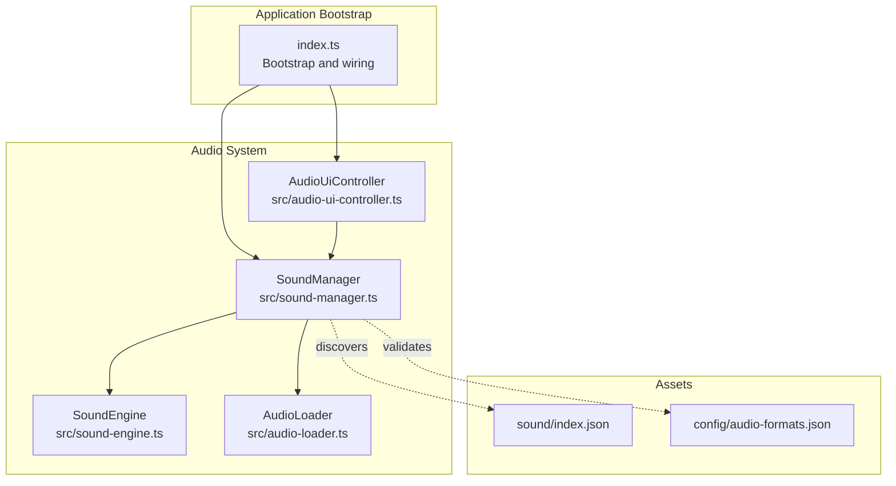
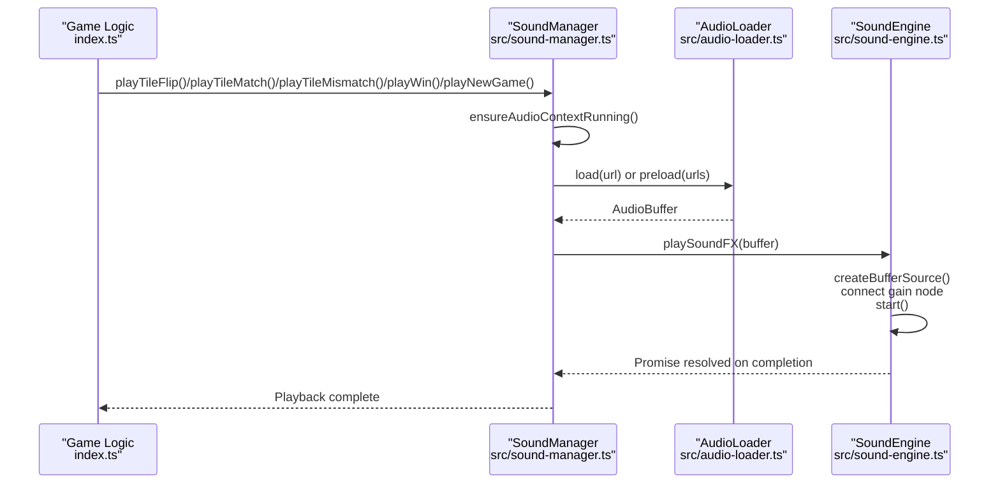
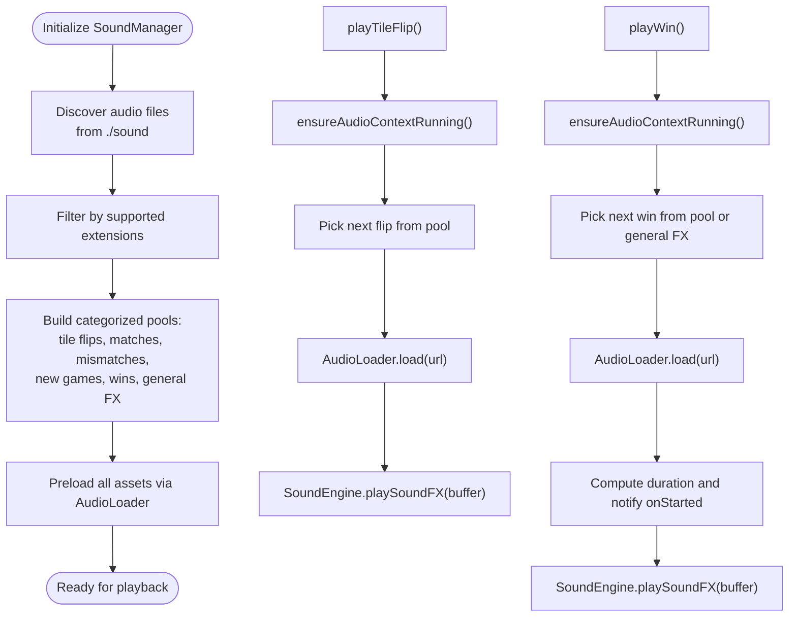
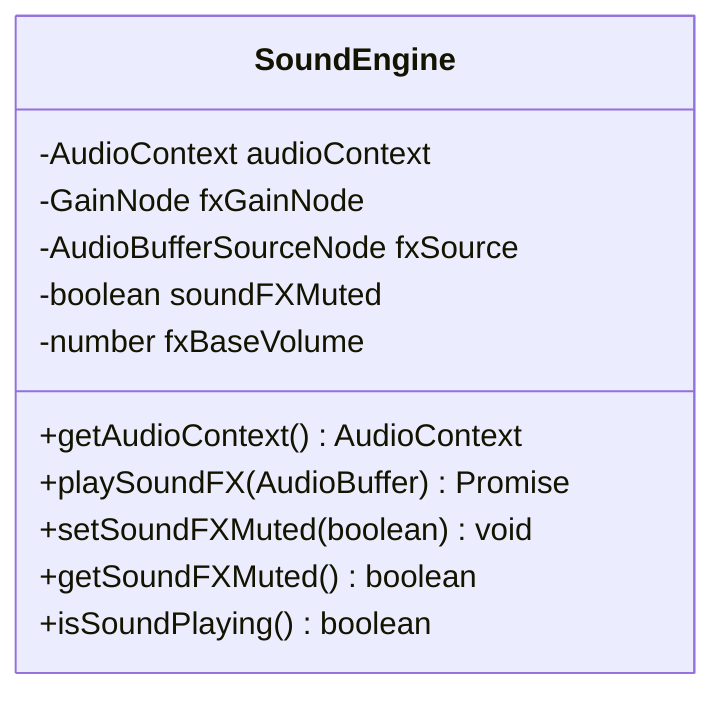
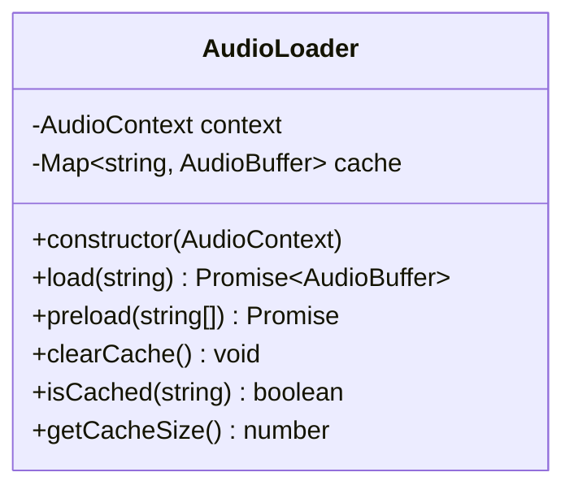
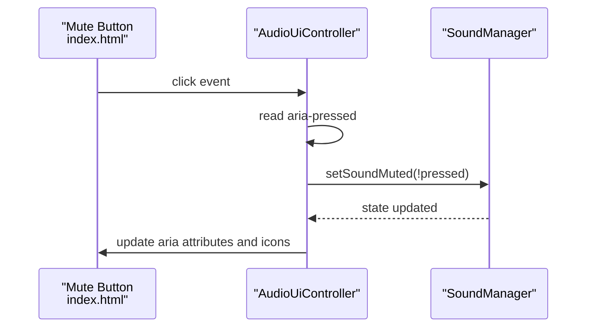
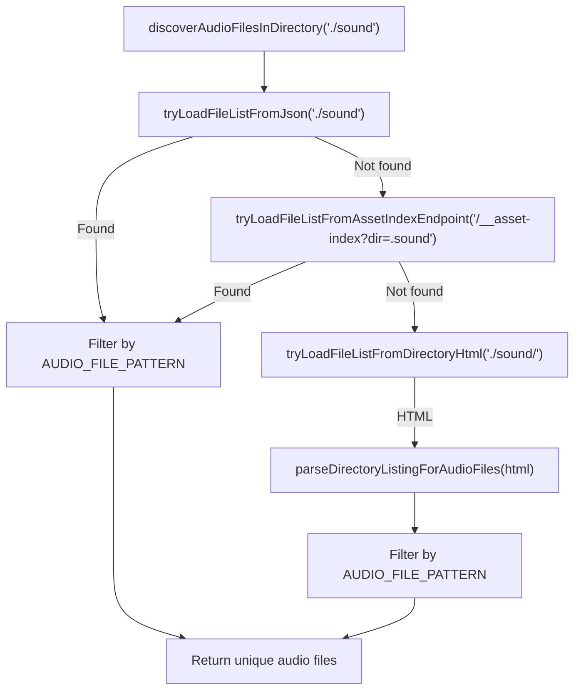
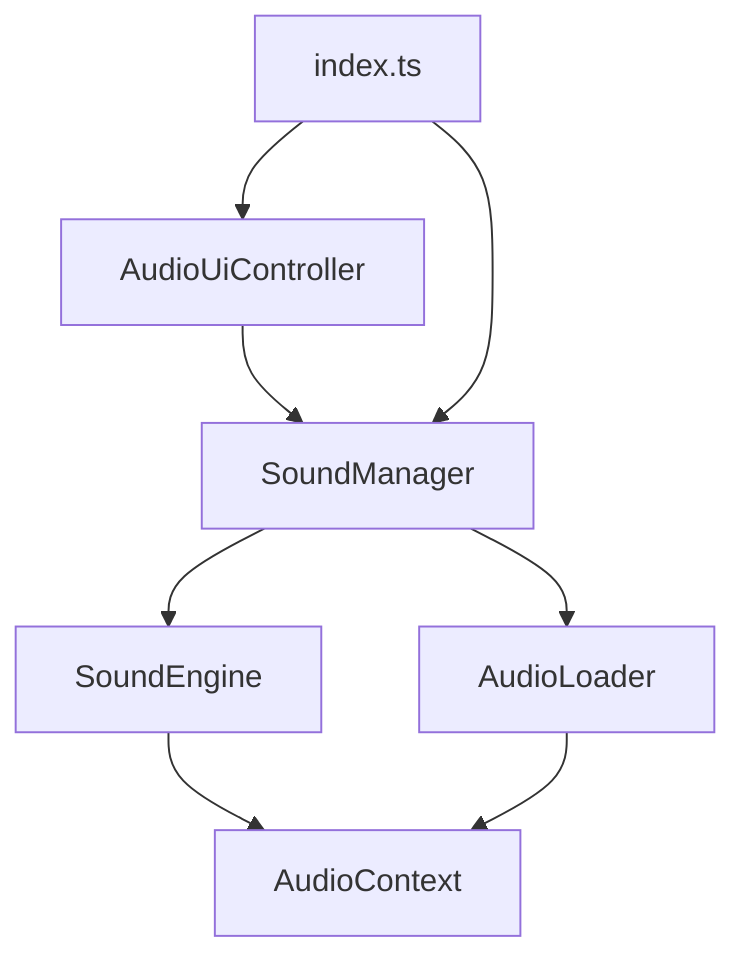

# Audio System Architecture

<cite>
**Referenced Files in This Document**
- [sound-manager.ts](file://src/sound-manager.ts)
- [sound-engine.ts](file://src/sound-engine.ts)
- [audio-loader.ts](file://src/audio-loader.ts)
- [audio-ui-controller.ts](file://src/audio-ui-controller.ts)
- [index.ts](file://src/index.ts)
- [sound/index.json](file://sound/index.json)
- [audio-formats.json](file://config/audio-formats.json)
- [sound-engine-plan.md](file://docs/sound-engine-plan.md)
- [audio-loader.test.ts](file://tests/audio-loader.test.ts)
- [sound-manager.test.ts](file://tests/sound-manager.test.ts)
- [audio-ui-controller.test.ts](file://tests/audio-ui-controller.test.ts)
</cite>

## Table of Contents
1. [Introduction](#introduction)
2. [Project Structure](#project-structure)
3. [Core Components](#core-components)
4. [Architecture Overview](#architecture-overview)
5. [Detailed Component Analysis](#detailed-component-analysis)
6. [Dependency Analysis](#dependency-analysis)
7. [Performance Considerations](#performance-considerations)
8. [Troubleshooting Guide](#troubleshooting-guide)
9. [Conclusion](#conclusion)

## Introduction
This document describes the audio system architecture for the browser-based MEMORYBLOX application. The system separates concerns between sound management and audio engine responsibilities, with dedicated loader components for asset discovery and UI controllers for user interactions. It integrates the Web Audio API for sound effects playback, manages audio context lifecycle to comply with browser autoplay policies, and implements an event-driven audio pipeline triggered by game actions. The architecture emphasizes robustness through preloading, caching, graceful error handling, and persistent mute state.

## Project Structure
The audio system spans four core modules:
- SoundManager: High-level orchestration of game events and sound playback
- SoundEngine: Web Audio API-based playback engine for sound effects
- AudioLoader: Asset discovery, loading, decoding, and caching
- AudioUiController: UI binding for mute/unmute interactions

These components integrate with the main application bootstrap and game logic in index.ts, and rely on asset metadata in sound/index.json and supported formats in config/audio-formats.json.

**Diagram sources**
- [index.ts:241-249](file://src/index.ts#L241-L249)
- [sound-manager.ts:238-262](file://src/sound-manager.ts#L238-L262)
- [sound-engine.ts:8-29](file://src/sound-engine.ts#L8-L29)
- [audio-loader.ts:7-18](file://src/audio-loader.ts#L7-L18)
- [audio-ui-controller.ts:22-30](file://src/audio-ui-controller.ts#L22-L30)
- [sound/index.json:1-17](file://sound/index.json#L1-L17)
- [audio-formats.json:1-4](file://config/audio-formats.json#L1-L4)

**Section sources**
- [index.ts:241-249](file://src/index.ts#L241-L249)
- [sound-manager.ts:238-262](file://src/sound-manager.ts#L238-L262)
- [sound-engine.ts:8-29](file://src/sound-engine.ts#L8-L29)
- [audio-loader.ts:7-18](file://src/audio-loader.ts#L7-L18)
- [audio-ui-controller.ts:22-30](file://src/audio-ui-controller.ts#L22-L30)
- [sound/index.json:1-17](file://sound/index.json#L1-L17)
- [audio-formats.json:1-4](file://config/audio-formats.json#L1-L4)

## Core Components
- SoundManager: Initializes audio assets, maintains categorized pools for tile flips, matches, mismatches, new games, and wins, and exposes game-event-driven playback methods. It ensures the audio context is running before playback and coordinates non-critical new-game sound playback with pending-state handling.
- SoundEngine: Manages the Web Audio API context, gain node for volume control, and one-shot sound effect playback. It respects mute state and prevents overlapping playback by stopping the current source before starting a new one.
- AudioLoader: Fetches audio files, decodes them into AudioBuffer instances, and caches them to avoid redundant network requests. It supports bulk preloading with per-item error logging and cache inspection utilities.
- AudioUiController: Binds mute/unmute interactions to SoundManager, synchronizes UI state (ARIA attributes, icon visibility), and handles SVG element compatibility for hidden state.

**Section sources**
- [sound-manager.ts:238-462](file://src/sound-manager.ts#L238-L462)
- [sound-engine.ts:8-110](file://src/sound-engine.ts#L8-L110)
- [audio-loader.ts:7-118](file://src/audio-loader.ts#L7-L118)
- [audio-ui-controller.ts:22-56](file://src/audio-ui-controller.ts#L22-L56)

## Architecture Overview
The audio system follows an event-driven model:
- Game logic triggers SoundManager methods on tile flips, matches, mismatches, wins, and new games.
- SoundManager selects an appropriate sound from categorized pools and ensures the audio context is running.
- AudioLoader loads and decodes audio buffers (with caching), then delegates playback to SoundEngine.
- SoundEngine creates a new AudioBufferSourceNode, connects it to the gain node, and plays the sound until completion.
- AudioUiController reflects mute state in the UI and updates SoundManager accordingly.

**Diagram sources**
- [index.ts:672-708](file://src/index.ts#L672-L708)
- [sound-manager.ts:308-439](file://src/sound-manager.ts#L308-L439)
- [audio-loader.ts:30-64](file://src/audio-loader.ts#L30-L64)
- [sound-engine.ts:47-75](file://src/sound-engine.ts#L47-L75)

## Detailed Component Analysis

### SoundManager: Asset Discovery, Pool Management, and Playback Orchestration
- Asset discovery: Discovers audio files from the ./sound directory using multiple strategies (JSON index, asset-index endpoint, HTML directory listing), filters by supported extensions, and normalizes URLs.
- Pool categorization: Maintains separate round-robin selectors for tile flips, matches, mismatches, new games, wins, and general FX, enabling randomized selection per category.
- Initialization: Preloads all discovered assets, sets initial mute state from localStorage, and prepares pools for immediate playback.
- Playback methods: Exposes convenience methods for tile flip, match, mismatch, win, and new game. Ensures audio context is running before playback and handles pending new-game playback to avoid overlaps.
- Autoplay compliance: Explicitly resumes the AudioContext when needed, catching and ignoring resume failures to allow retry on next user gesture.

**Diagram sources**
- [sound-manager.ts:196-226](file://src/sound-manager.ts#L196-L226)
- [sound-manager.ts:264-297](file://src/sound-manager.ts#L264-L297)
- [sound-manager.ts:308-439](file://src/sound-manager.ts#L308-L439)
- [audio-loader.ts:30-64](file://src/audio-loader.ts#L30-L64)
- [sound-engine.ts:47-75](file://src/sound-engine.ts#L47-L75)

**Section sources**
- [sound-manager.ts:196-226](file://src/sound-manager.ts#L196-L226)
- [sound-manager.ts:264-297](file://src/sound-manager.ts#L264-L297)
- [sound-manager.ts:308-439](file://src/sound-manager.ts#L308-L439)
- [sound-manager.ts:441-460](file://src/sound-manager.ts#L441-L460)

### SoundEngine: Web Audio API Integration and Volume Control
- AudioContext lifecycle: Creates and owns a single AudioContext instance, connecting a dedicated gain node for sound effects to the destination.
- Playback: Stops any currently playing sound effect, creates a new AudioBufferSourceNode, connects it to the gain node, and starts playback. Resolves a promise when the sound ends.
- Mute handling: Updates the gain node’s volume to zero when muted and restores the base volume when unmuting, ensuring immediate effect on the current source.
- State inspection: Provides a method to check if a sound effect is currently playing.

**Diagram sources**
- [sound-engine.ts:8-110](file://src/sound-engine.ts#L8-L110)

**Section sources**
- [sound-engine.ts:8-110](file://src/sound-engine.ts#L8-L110)

### AudioLoader: Asset Loading, Caching, and Error Handling
- Loading: Fetches audio files, decodes them into AudioBuffer instances using the Web Audio API context, and caches them in a Map keyed by URL.
- Preloading: Supports parallel preloading of multiple URLs, logging individual failures without failing the entire batch.
- Cache management: Provides cache inspection, clearing, and size reporting for memory-conscious operation.
- Error handling: Wraps fetch and decode errors with contextual messages, preserving original error causes for diagnostics.

**Diagram sources**
- [audio-loader.ts:7-118](file://src/audio-loader.ts#L7-L118)

**Section sources**
- [audio-loader.ts:30-88](file://src/audio-loader.ts#L30-L88)
- [audio-loader.ts:95-117](file://src/audio-loader.ts#L95-L117)

### AudioUiController: UI Binding and Accessibility
- State synchronization: Reads SoundManager’s mute state and initializes the mute button’s aria attributes and icon visibility.
- Interaction handling: Listens for mute button clicks, toggles SoundManager’s mute state, and updates UI state accordingly.
- Compatibility: Uses attribute manipulation for SVG elements to ensure proper hidden state across browsers.

**Diagram sources**
- [audio-ui-controller.ts:47-54](file://src/audio-ui-controller.ts#L47-L54)
- [audio-ui-controller.ts:32-45](file://src/audio-ui-controller.ts#L32-L45)
- [index.ts:1024-1024](file://src/index.ts#L1024-L1024)

**Section sources**
- [audio-ui-controller.ts:22-56](file://src/audio-ui-controller.ts#L22-L56)
- [index.ts:1024-1024](file://src/index.ts#L1024-L1024)

### Asset Discovery and Formats
- Asset discovery: SoundManager discovers audio files from the ./sound directory using three strategies, with JSON index being preferred, followed by an asset-index endpoint, and finally parsing HTML directory listings.
- Supported formats: Validation against configured extensions ensures only recognized audio formats are considered.
- Asset catalog: The sound/index.json file provides a curated list of available audio files for the sound directory.

**Diagram sources**
- [sound-manager.ts:196-226](file://src/sound-manager.ts#L196-L226)
- [sound-manager.ts:131-194](file://src/sound-manager.ts#L131-L194)
- [audio-formats.json:1-4](file://config/audio-formats.json#L1-L4)
- [sound/index.json:1-17](file://sound/index.json#L1-L17)

**Section sources**
- [sound-manager.ts:131-194](file://src/sound-manager.ts#L131-L194)
- [audio-formats.json:1-4](file://config/audio-formats.json#L1-L4)
- [sound/index.json:1-17](file://sound/index.json#L1-L17)

## Dependency Analysis
The audio system exhibits clean separation of responsibilities:
- SoundManager depends on SoundEngine for playback and AudioLoader for asset loading.
- SoundEngine depends on the Web Audio API context and gain node for volume control.
- AudioLoader depends on the AudioContext for decoding and on the network for fetching.
- AudioUiController depends on SoundManager for state and UI updates.
- Application bootstrap wires SoundManager, AudioUiController, and integrates SoundManager with game events.

**Diagram sources**
- [sound-manager.ts:238-262](file://src/sound-manager.ts#L238-L262)
- [sound-engine.ts:8-29](file://src/sound-engine.ts#L8-L29)
- [audio-loader.ts:7-18](file://src/audio-loader.ts#L7-L18)
- [audio-ui-controller.ts:22-30](file://src/audio-ui-controller.ts#L22-L30)
- [index.ts:241-249](file://src/index.ts#L241-L249)

**Section sources**
- [sound-manager.ts:238-262](file://src/sound-manager.ts#L238-L262)
- [sound-engine.ts:8-29](file://src/sound-engine.ts#L8-L29)
- [audio-loader.ts:7-18](file://src/audio-loader.ts#L7-L18)
- [audio-ui-controller.ts:22-30](file://src/audio-ui-controller.ts#L22-L30)
- [index.ts:241-249](file://src/index.ts#L241-L249)

## Performance Considerations
- Preloading and caching: AudioLoader preloads discovered assets in parallel and caches decoded buffers, minimizing latency for repeated playback and reducing network overhead.
- Round-robin selection: Randomized selection from categorized pools prevents predictable repetition and spreads load across available assets.
- Minimal context switching: SoundEngine stops the current source before starting a new one, avoiding overlapping playback and resource contention.
- Memory management: Cache inspection and clearing utilities enable memory-conscious operation, especially important for long sessions or limited devices.

[No sources needed since this section provides general guidance]

## Troubleshooting Guide
Common issues and resolutions:
- AudioContext not running: SoundManager’s ensureAudioContextRunning method resumes the context when needed. If resume fails, playback is retried on subsequent gestures.
- Asset loading failures: AudioLoader wraps fetch and decode errors with contextual messages and logs individual failures during preloading without blocking the rest of the batch.
- Mute state not persisting: SoundManager reads and writes mute state to localStorage using dedicated helpers, ensuring persistence across sessions.
- UI mute button not updating: AudioUiController synchronizes UI state on initialization and on user interactions, using attribute manipulation for SVG elements to maintain compatibility.

**Section sources**
- [sound-manager.ts:441-460](file://src/sound-manager.ts#L441-L460)
- [audio-loader.ts:50-63](file://src/audio-loader.ts#L50-L63)
- [sound-manager.ts:109-129](file://src/sound-manager.ts#L109-L129)
- [audio-ui-controller.ts:32-54](file://src/audio-ui-controller.ts#L32-L54)

## Conclusion
The audio system cleanly separates sound management (SoundManager) from audio engine (SoundEngine) responsibilities, with loader components (AudioLoader) handling asset discovery and caching, and UI controllers (AudioUiController) managing user interactions. The Web Audio API integration is centered in SoundEngine, with SoundManager orchestrating event-driven playback and ensuring autoplay policy compliance through explicit context resumption. Robust asset discovery, caching, and error handling provide a reliable foundation for sound effects across game events, while mute state persistence and UI synchronization deliver a polished user experience.