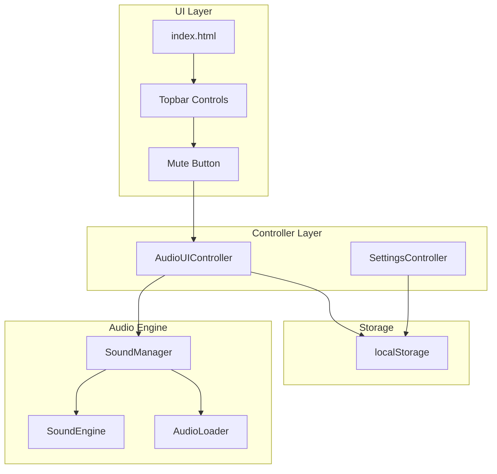
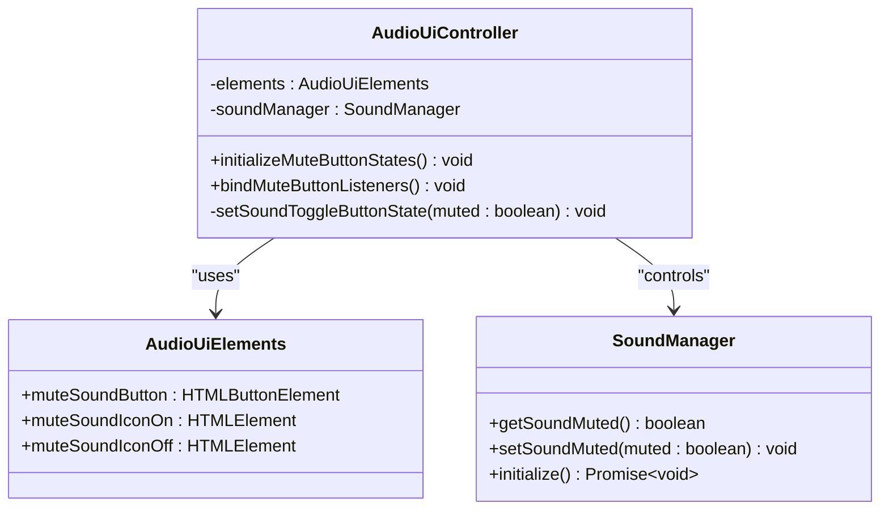
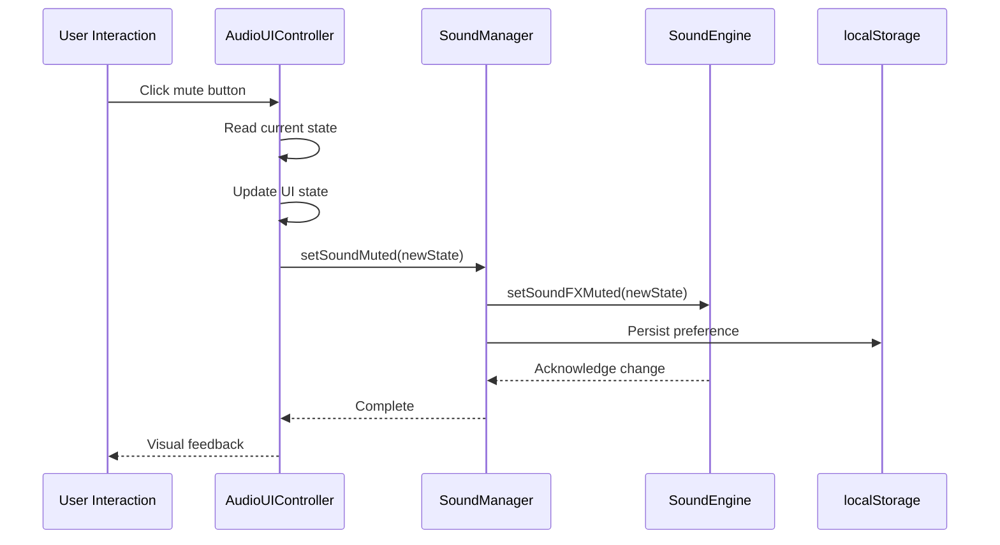
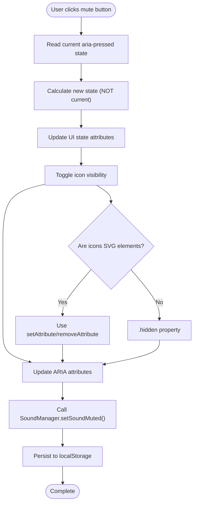
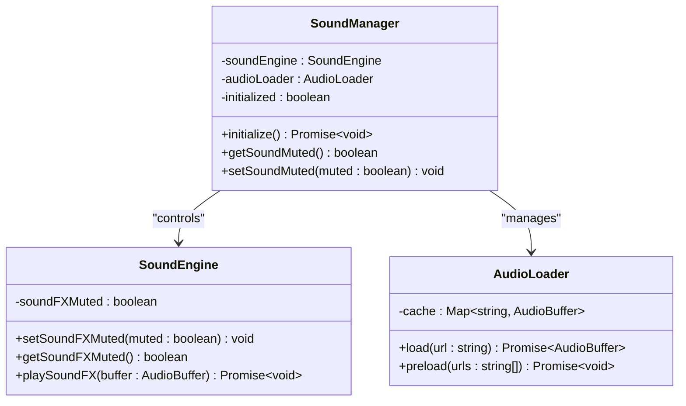
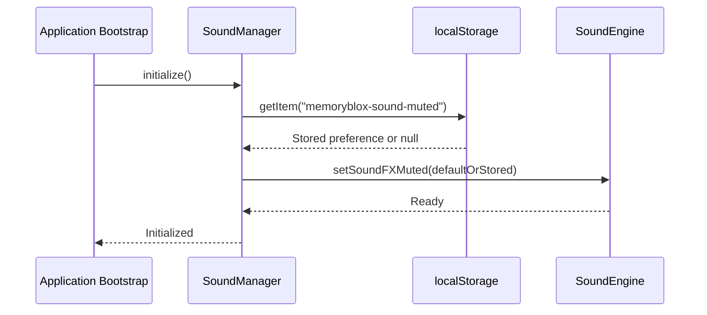
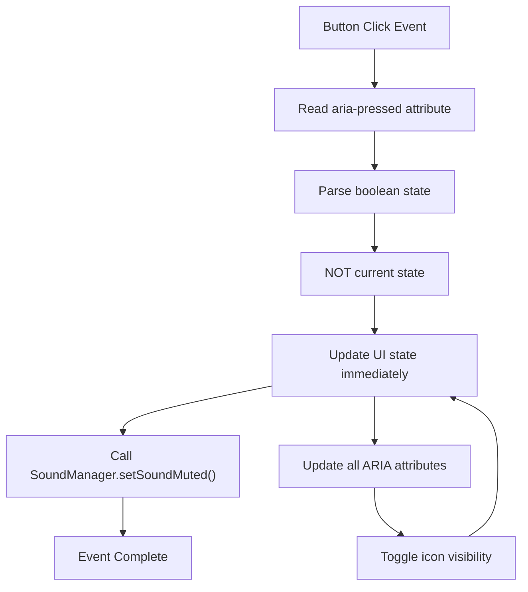
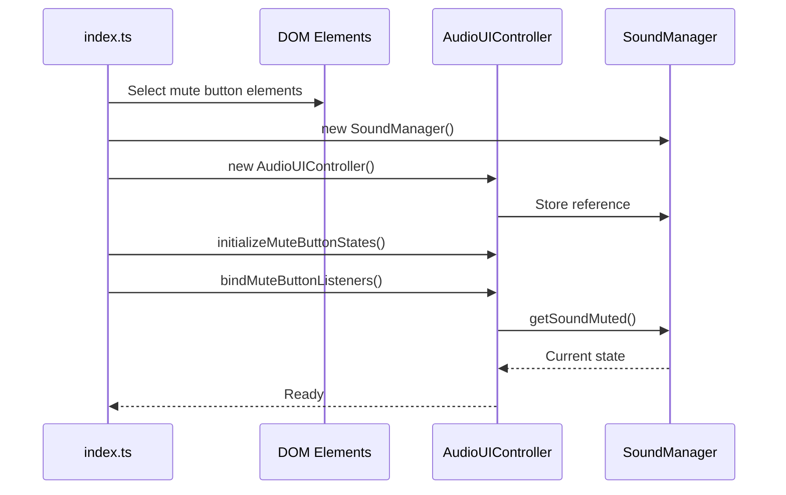
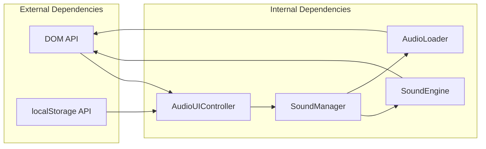
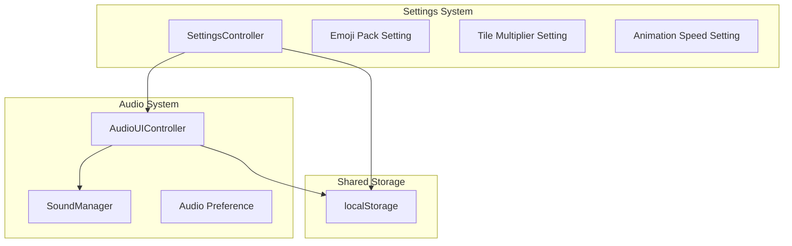

# Audio UI Controller

<cite>
**Referenced Files in This Document**
- [audio-ui-controller.ts](file://src/audio-ui-controller.ts)
- [sound-manager.ts](file://src/sound-manager.ts)
- [sound-engine.ts](file://src/sound-engine.ts)
- [audio-loader.ts](file://src/audio-loader.ts)
- [index.ts](file://src/index.ts)
- [index.html](file://index.html)
- [audio-ui-controller.test.ts](file://tests/audio-ui-controller.test.ts)
- [settings-controller.ts](file://src/settings-controller.ts)
</cite>

## Table of Contents
1. [Introduction](#introduction)
2. [Project Structure](#project-structure)
3. [Core Components](#core-components)
4. [Architecture Overview](#architecture-overview)
5. [Detailed Component Analysis](#detailed-component-analysis)
6. [Dependency Analysis](#dependency-analysis)
7. [Performance Considerations](#performance-considerations)
8. [Accessibility and Keyboard Navigation](#accessibility-and-keyboard-navigation)
9. [Integration with Settings System](#integration-with-settings-system)
10. [Troubleshooting Guide](#troubleshooting-guide)
11. [Conclusion](#conclusion)

## Introduction
This document provides comprehensive technical documentation for the AudioUIController class, which manages user interface interactions for audio controls in the MemoryBlox game. The controller handles mute/unmute toggle functionality, synchronizes UI state with the SoundManager's mute state, persists user preferences using localStorage, and integrates seamlessly with the main UI system. It also covers accessibility considerations, keyboard navigation support, and integration with the broader settings system.

## Project Structure
The audio UI controller is part of a modular TypeScript application with clear separation of concerns:

**Diagram sources**
- [index.ts:148-150](file://src/index.ts#L148-L150)
- [audio-ui-controller.ts:22-30](file://src/audio-ui-controller.ts#L22-L30)
- [sound-manager.ts:238-262](file://src/sound-manager.ts#L238-L262)

**Section sources**
- [index.ts:148-150](file://src/index.ts#L148-L150)
- [index.html:22-22](file://index.html#L22-L22)

## Core Components
The AudioUIController serves as the primary interface between user interactions and the audio system. It maintains a clean separation between UI presentation and audio functionality while ensuring seamless state synchronization.

### AudioUIController Class Structure
The controller implements a focused interface with clear responsibilities:

**Diagram sources**
- [audio-ui-controller.ts:11-30](file://src/audio-ui-controller.ts#L11-L30)
- [sound-manager.ts:299-306](file://src/sound-manager.ts#L299-L306)

**Section sources**
- [audio-ui-controller.ts:22-55](file://src/audio-ui-controller.ts#L22-L55)

## Architecture Overview
The audio UI system follows a layered architecture pattern with clear boundaries between presentation, control, and audio engine components.

**Diagram sources**
- [audio-ui-controller.ts:47-54](file://src/audio-ui-controller.ts#L47-L54)
- [sound-manager.ts:303-306](file://src/sound-manager.ts#L303-L306)
- [sound-engine.ts:82-90](file://src/sound-engine.ts#L82-L90)

## Detailed Component Analysis

### Mute/Unmute Toggle Functionality
The mute toggle implements a sophisticated state management system that ensures consistency across UI presentation and audio engine state.

#### State Management Implementation
The controller maintains visual consistency through a centralized state update mechanism:

**Diagram sources**
- [audio-ui-controller.ts:38-45](file://src/audio-ui-controller.ts#L38-L45)
- [audio-ui-controller.ts:3-9](file://src/audio-ui-controller.ts#L3-L9)

#### Visual Feedback Mechanisms
The controller implements comprehensive visual feedback through multiple UI indicators:

| Attribute | Purpose | State Values |
|-----------|---------|--------------|
| `aria-pressed` | Screen reader state indication | `"true"` / `"false"` |
| `aria-label` | Dynamic screen reader description | `"Mute sound effects"` / `"Unmute sound effects"` |
| `title` | Tooltip text | `"Mute sound effects"` / `"Unmute sound effects"` |
| Icon Visibility | Visual state representation | Toggle between on/off icons |

**Section sources**
- [audio-ui-controller.ts:38-45](file://src/audio-ui-controller.ts#L38-L45)
- [audio-ui-controller.test.ts:46-69](file://tests/audio-ui-controller.test.ts#L46-L69)

### SoundManager Integration
The AudioUIController delegates audio state management to the SoundManager, which coordinates with the underlying SoundEngine and AudioLoader components.

#### Audio State Synchronization
The SoundManager maintains persistent audio state using localStorage with a dedicated storage key:

**Diagram sources**
- [sound-manager.ts:238-262](file://src/sound-manager.ts#L238-L262)
- [sound-engine.ts:8-29](file://src/sound-engine.ts#L8-L29)
- [audio-loader.ts:7-18](file://src/audio-loader.ts#L7-L18)

**Section sources**
- [sound-manager.ts:299-306](file://src/sound-manager.ts#L299-L306)
- [sound-engine.ts:82-99](file://src/sound-engine.ts#L82-L99)

### UI State Synchronization with localStorage
The audio system implements robust persistence using localStorage to maintain user preferences across browser sessions.

#### Storage Key Management
The system uses a dedicated storage key for audio mute state:

| Storage Key | Purpose | Data Type | Default Value |
|-------------|---------|-----------|---------------|
| `"memoryblox-sound-muted"` | Global audio mute preference | Boolean string | `"false"` |
| Persistence Method | `localStorage.setItem/getItem` | String serialization | `String(muted)` |

#### Initialization and Loading
During application bootstrap, the SoundManager automatically loads persisted audio preferences:

**Diagram sources**
- [sound-manager.ts:264-297](file://src/sound-manager.ts#L264-L297)
- [sound-manager.ts:109-121](file://src/sound-manager.ts#L109-L121)

**Section sources**
- [sound-manager.ts:5-5](file://src/sound-manager.ts#L5-L5)
- [sound-manager.ts:109-129](file://src/sound-manager.ts#L109-L129)

### Event Handling and User Interactions
The controller implements comprehensive event handling for audio control interactions with proper state management and error handling.

#### Event Listener Implementation
The mute button click handler implements a robust state toggle mechanism:

**Diagram sources**
- [audio-ui-controller.ts:47-54](file://src/audio-ui-controller.ts#L47-L54)

**Section sources**
- [audio-ui-controller.ts:47-54](file://src/audio-ui-controller.ts#L47-L54)
- [audio-ui-controller.test.ts:74-101](file://tests/audio-ui-controller.test.ts#L74-L101)

### Integration with Main UI System
The AudioUIController integrates seamlessly with the application's main UI system through the central bootstrap process.

#### Bootstrap Integration
The controller is instantiated and initialized during application startup:

**Diagram sources**
- [index.ts:241-249](file://src/index.ts#L241-L249)
- [index.ts:1024-1024](file://src/index.ts#L1024-L1024)

**Section sources**
- [index.ts:241-249](file://src/index.ts#L241-L249)
- [index.ts:1024-1085](file://src/index.ts#L1024-L1085)

## Dependency Analysis
The AudioUIController has a focused dependency graph with clear relationships to other system components.

**Diagram sources**
- [audio-ui-controller.ts:1-1](file://src/audio-ui-controller.ts#L1-L1)
- [sound-manager.ts:1-3](file://src/sound-manager.ts#L1-L3)

### Component Coupling Analysis
The controller demonstrates excellent separation of concerns with minimal coupling to external systems:

| Aspect | Coupling Level | Rationale |
|--------|----------------|-----------|
| DOM Manipulation | Low | Uses dependency injection pattern |
| Sound Engine | Low | Through SoundManager abstraction |
| Storage Access | Low | Through SoundManager persistence |
| Event Handling | Medium | Direct DOM event listeners |
| State Management | Low | Centralized in SoundManager |

**Section sources**
- [audio-ui-controller.ts:22-30](file://src/audio-ui-controller.ts#L22-L30)
- [sound-manager.ts:238-262](file://src/sound-manager.ts#L238-L262)

## Performance Considerations
The audio UI system implements several performance optimizations to ensure smooth user experience.

### Memory Management
- **Event Listener Cleanup**: Controllers properly manage event listeners to prevent memory leaks
- **DOM Reference Management**: Elements are accessed through dependency injection rather than global selectors
- **State Caching**: UI state is cached locally to minimize DOM queries

### Audio Performance
- **Lazy Initialization**: Sound system initializes only when needed
- **Preloading Strategy**: Audio assets are preloaded asynchronously during bootstrapping
- **Resource Pooling**: AudioLoader implements efficient caching to avoid redundant network requests

### UI Responsiveness
- **Immediate Feedback**: UI state updates occur synchronously before asynchronous operations
- **Debounced Operations**: Audio state changes are batched to prevent excessive re-renders
- **Efficient DOM Updates**: Minimal DOM manipulation through attribute-based state changes

## Accessibility and Keyboard Navigation

### ARIA Compliance
The audio controls implement comprehensive accessibility features:

| Feature | Implementation | Benefits |
|---------|----------------|----------|
| `aria-pressed` | Dynamic state attribute | Screen reader announcements |
| `aria-label` | Descriptive labels | Contextual information |
| `role="button"` | Semantic markup | Proper element identification |
| `tabindex` | Keyboard navigation | Focus management |
| `title` attribute | Tooltip support | Additional context |

### Keyboard Navigation Support
The mute button supports full keyboard interaction:
- **Space/Enter**: Activate mute/unmute action
- **Tab Navigation**: Natural tab order integration
- **Focus Indicators**: Visible focus rings for keyboard users
- **Screen Reader Compatibility**: Automatic announcements of state changes

### Visual Accessibility
- **High Contrast Icons**: Clear visual distinction between mute/unmute states
- **Color Independence**: State conveyed through multiple visual cues
- **Responsive Design**: Touch-friendly target areas for mobile users
- **Reduced Motion Support**: Respects system motion preferences

**Section sources**
- [audio-ui-controller.ts:38-45](file://src/audio-ui-controller.ts#L38-L45)
- [index.html:22-22](file://index.html#L22-L22)

## Integration with Settings System
The audio controls integrate with the broader settings system while maintaining independence for audio-specific preferences.

### Settings Coordination
The audio system coordinates with the SettingsController through shared localStorage keys and UI patterns:

**Diagram sources**
- [settings-controller.ts:10-12](file://src/settings-controller.ts#L10-L12)
- [sound-manager.ts:5-5](file://src/sound-manager.ts#L5-L5)

### Preference Isolation
Audio preferences are isolated from other game settings through dedicated storage keys:

| Setting Category | Storage Key | Scope | Persistence |
|------------------|-------------|-------|-------------|
| Audio Mute State | `memoryblox-sound-muted` | Global | Across Sessions |
| Emoji Pack | `memoryblox-emoji-pack` | Global | Across Sessions |
| Tile Multiplier | `memoryblox-tile-multiplier` | Global | Across Sessions |
| Animation Speed | `memoryblox-animation-speed` | Global | Across Sessions |

**Section sources**
- [settings-controller.ts:10-12](file://src/settings-controller.ts#L10-L12)
- [sound-manager.ts:5-5](file://src/sound-manager.ts#L5-L5)

## Troubleshooting Guide

### Common Issues and Solutions

#### Mute State Not Persisting
**Symptoms**: Audio preference resets after page refresh
**Causes**: 
- localStorage disabled or blocked
- Storage key conflicts
- Initialization timing issues

**Solutions**:
- Verify localStorage availability in browser
- Check for storage quota limitations
- Ensure proper initialization sequence

#### Icons Not Updating State
**Symptoms**: Visual state doesn't match audio state
**Causes**:
- DOM manipulation errors
- Event listener conflicts
- SVG element handling issues

**Solutions**:
- Verify element references are correct
- Check for JavaScript errors in console
- Test with different browser configurations

#### Audio Controls Unresponsive
**Symptoms**: Click events not triggering
**Causes**:
- Event listener binding failures
- DOM element not found
- CSS styling conflicts

**Solutions**:
- Confirm DOM elements exist in page
- Check for CSS pointer-events issues
- Verify event listener registration

### Debugging Tools
The system includes comprehensive testing infrastructure for debugging audio UI issues:

- **Unit Tests**: Comprehensive coverage of UI state transitions
- **Integration Tests**: End-to-end testing of audio control workflows
- **Visual Regression Testing**: Ensures consistent UI appearance
- **Accessibility Testing**: Automated ARIA compliance checks

**Section sources**
- [audio-ui-controller.test.ts:1-171](file://tests/audio-ui-controller.test.ts#L1-L171)

## Conclusion
The AudioUIController provides a robust, accessible, and performant solution for managing audio controls in the MemoryBlox application. Its clean architecture, comprehensive accessibility features, and seamless integration with the broader UI system demonstrate best practices in frontend development. The controller successfully balances user experience with technical excellence, providing reliable audio control functionality that enhances the overall gaming experience while maintaining strict adherence to web standards and accessibility guidelines.

The implementation showcases effective patterns for:
- State management and synchronization
- Event handling and user interaction
- Accessibility and cross-platform compatibility
- Performance optimization and resource management
- Integration with larger application systems

These qualities make the AudioUIController a model example of modern frontend architecture and user interface design.