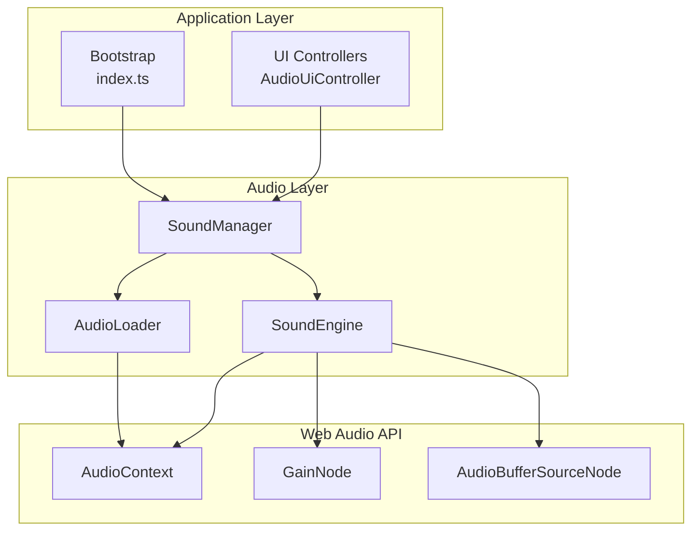
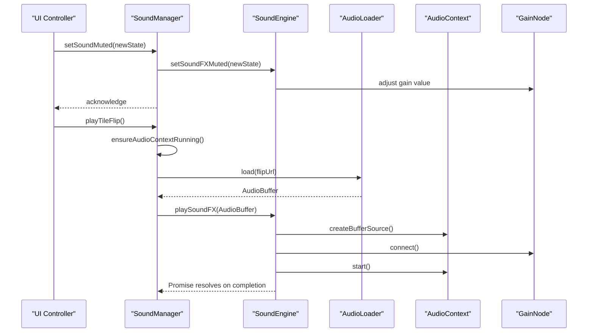
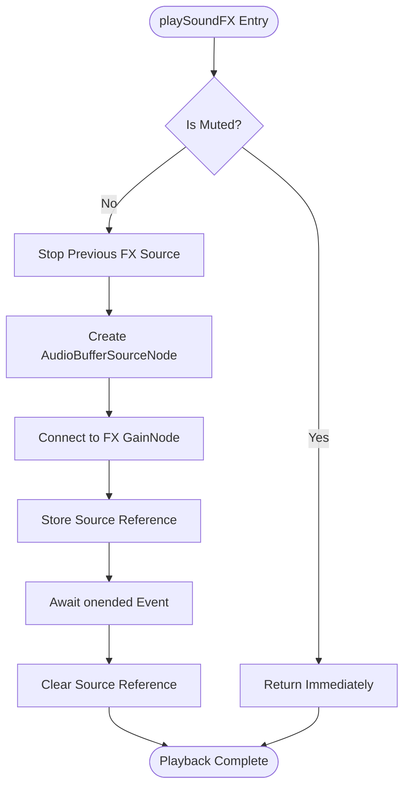
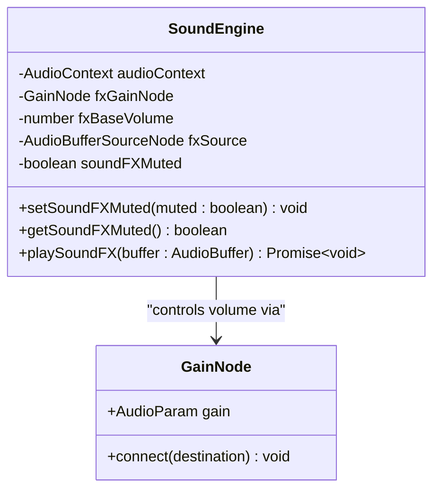
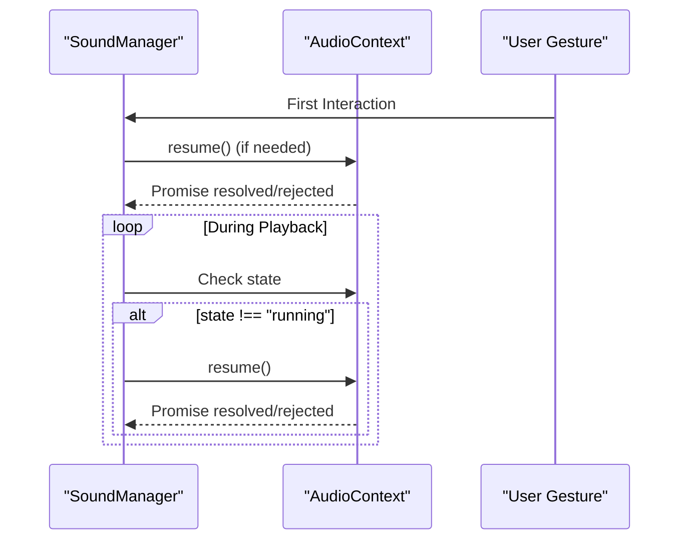
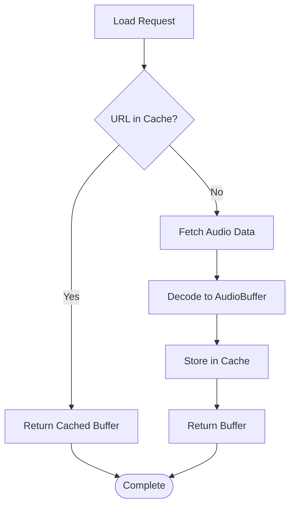
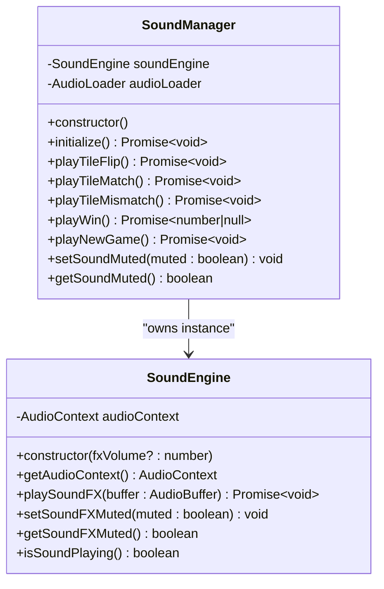
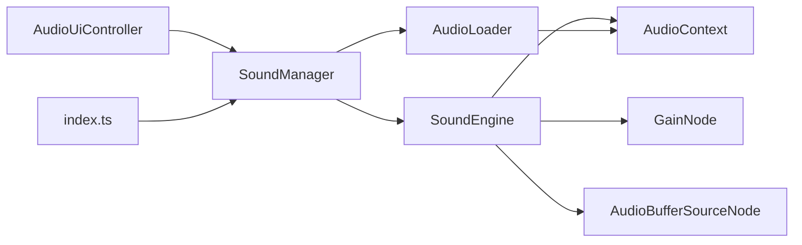

# Sound Engine Component

<cite>
**Referenced Files in This Document**
- [sound-engine.ts](file://src/sound-engine.ts)
- [audio-loader.ts](file://src/audio-loader.ts)
- [sound-manager.ts](file://src/sound-manager.ts)
- [audio-ui-controller.ts](file://src/audio-ui-controller.ts)
- [index.ts](file://src/index.ts)
- [sound-engine.test.ts](file://tests/sound-engine.test.ts)
- [sound-manager.test.ts](file://tests/sound-manager.test.ts)
- [audio-formats.json](file://config/audio-formats.json)
- [sound-engine-plan.md](file://docs/sound-engine-plan.md)
</cite>

## Table of Contents
1. [Introduction](#introduction)
2. [Project Structure](#project-structure)
3. [Core Components](#core-components)
4. [Architecture Overview](#architecture-overview)
5. [Detailed Component Analysis](#detailed-component-analysis)
6. [Dependency Analysis](#dependency-analysis)
7. [Performance Considerations](#performance-considerations)
8. [Troubleshooting Guide](#troubleshooting-guide)
9. [Conclusion](#conclusion)

## Introduction
This document provides comprehensive technical documentation for the SoundEngine class and the surrounding audio subsystem that integrates Web Audio API for sound effects in the application. It covers the audio context lifecycle, playback architecture, volume control, mute functionality, buffer management, autoplay policy compliance, and performance considerations. The SoundEngine serves as the core Web Audio API integration layer, while SoundManager orchestrates higher-level game events and AudioLoader handles asset loading and caching.

## Project Structure
The audio subsystem consists of four primary modules:
- SoundEngine: Core Web Audio API integration and sound FX playback
- AudioLoader: Asset loading, decoding, and caching
- SoundManager: Game event orchestration and autoplay policy handling
- AudioUiController: UI binding for mute controls

**Diagram sources**
- [index.ts:241-249](file://src/index.ts#L241-L249)
- [sound-manager.ts:238-262](file://src/sound-manager.ts#L238-L262)
- [sound-engine.ts:8-29](file://src/sound-engine.ts#L8-L29)
- [audio-loader.ts:7-18](file://src/audio-loader.ts#L7-L18)

**Section sources**
- [sound-engine-plan.md:26-35](file://docs/sound-engine-plan.md#L26-L35)
- [index.ts:241-249](file://src/index.ts#L241-L249)

## Core Components
This section documents the primary audio components and their responsibilities.

### SoundEngine
The SoundEngine class encapsulates Web Audio API integration for sound effects playback. It manages:
- AudioContext lifecycle and connection to system output
- Gain-based volume control for FX layer
- One-shot sound effect playback with automatic cleanup
- Mute state management with immediate gain adjustment
- Playback state monitoring

Key implementation characteristics:
- Creates and maintains a single AudioContext instance
- Establishes a GainNode chain connected to AudioContext destination
- Provides asynchronous playSoundFX method for one-shot effects
- Implements setSoundFXMuted with immediate gain updates during active playback
- Tracks current playback state via AudioBufferSourceNode reference

**Section sources**
- [sound-engine.ts:8-29](file://src/sound-engine.ts#L8-L29)
- [sound-engine.ts:47-75](file://src/sound-engine.ts#L47-L75)
- [sound-engine.ts:82-89](file://src/sound-engine.ts#L82-L89)
- [sound-engine.ts:106-108](file://src/sound-engine.ts#L106-L108)

### AudioLoader
The AudioLoader class provides asset management capabilities:
- Fetches audio files from URLs and decodes them to AudioBuffer
- Maintains an internal cache keyed by URL to prevent redundant downloads
- Supports parallel preloading of multiple assets
- Handles network and decoding errors with contextual error messages
- Offers cache inspection and clearing utilities

Implementation highlights:
- Uses Map-based cache for O(1) lookup performance
- Parallel loading via Promise.allSettled for resilience
- Error wrapping preserves original error context
- Provides cache metrics for memory management insights

**Section sources**
- [audio-loader.ts:7-18](file://src/audio-loader.ts#L7-L18)
- [audio-loader.ts:30-64](file://src/audio-loader.ts#L30-L64)
- [audio-loader.ts:75-88](file://src/audio-loader.ts#L75-L88)
- [audio-loader.ts:95-116](file://src/audio-loader.ts#L95-L116)

### SoundManager
The SoundManager class orchestrates game-level audio behavior:
- Initializes SoundEngine and AudioLoader instances
- Discovers and categorizes audio assets from the sound directory
- Manages random round-robin selection for multiple variants
- Ensures AudioContext is running before playback attempts
- Coordinates mute state persistence and UI synchronization
- Provides game-specific convenience methods for tile flips, matches, mismatches, wins, and new games

Autoplay policy compliance:
- Implements ensureAudioContextRunning to handle browser restrictions
- Attempts context resume when state is not "running"
- Gracefully handles resume failures without blocking gameplay

**Section sources**
- [sound-manager.ts:238-262](file://src/sound-manager.ts#L238-L262)
- [sound-manager.ts:264-297](file://src/sound-manager.ts#L264-L297)
- [sound-manager.ts:441-460](file://src/sound-manager.ts#L441-L460)

### AudioUiController
The AudioUiController binds UI elements to audio functionality:
- Manages mute button state and accessibility attributes
- Updates icon visibility based on mute state
- Synchronizes UI state with SoundManager mute settings
- Handles user interactions for toggling mute state

**Section sources**
- [audio-ui-controller.ts:22-55](file://src/audio-ui-controller.ts#L22-L55)

## Architecture Overview
The audio architecture follows a layered approach with clear separation of concerns:

**Diagram sources**
- [audio-ui-controller.ts:48-53](file://src/audio-ui-controller.ts#L48-L53)
- [sound-manager.ts:308-311](file://src/sound-manager.ts#L308-L311)
- [sound-manager.ts:441-460](file://src/sound-manager.ts#L441-L460)
- [sound-engine.ts:47-75](file://src/sound-engine.ts#L47-L75)

## Detailed Component Analysis

### SoundEngine Playback Flow
The SoundEngine implements a robust one-shot playback mechanism:

**Diagram sources**
- [sound-engine.ts:47-75](file://src/sound-engine.ts#L47-L75)

Key behavioral aspects:
- Immediate mute enforcement prevents playback initiation
- Automatic cleanup of previous sources avoids resource leaks
- Promise-based completion tracking enables proper sequencing
- Source reference management ensures accurate state reporting

**Section sources**
- [sound-engine.ts:47-75](file://src/sound-engine.ts#L47-L75)
- [sound-engine.test.ts:129-170](file://tests/sound-engine.test.ts#L129-L170)

### Volume Control and Mute Implementation
The volume control system employs a two-tier approach:

**Diagram sources**
- [sound-engine.ts:8-29](file://src/sound-engine.ts#L8-L29)
- [sound-engine.ts:82-89](file://src/sound-engine.ts#L82-L89)

Volume control characteristics:
- Base volume configured during construction (default 0.8)
- Immediate gain adjustment when muting during active playback
- Separate mute state from actual gain value for flexibility
- FX source tracking enables precise volume manipulation

**Section sources**
- [sound-engine.ts:82-89](file://src/sound-engine.ts#L82-L89)
- [sound-engine.test.ts:195-209](file://tests/sound-engine.test.ts#L195-L209)

### Autoplay Policy Compliance
The SoundManager implements comprehensive autoplay policy handling:

**Diagram sources**
- [sound-manager.ts:441-460](file://src/sound-manager.ts#L441-L460)

Autoplay compliance features:
- Deferred AudioContext initialization until user interaction
- Continuous state monitoring and automatic resume attempts
- Graceful failure handling without interrupting gameplay
- Context state validation before audio operations

**Section sources**
- [sound-manager.ts:441-460](file://src/sound-manager.ts#L441-L460)
- [sound-engine-plan.md:368-375](file://docs/sound-engine-plan.md#L368-L375)

### Buffer Management System
The AudioLoader implements efficient buffer management:

**Diagram sources**
- [audio-loader.ts:30-64](file://src/audio-loader.ts#L30-L64)

Buffer management benefits:
- Eliminates redundant network requests for repeated assets
- Reduces CPU overhead through cached decoding
- Supports parallel preloading for improved startup performance
- Provides cache inspection and clearing for memory optimization

**Section sources**
- [audio-loader.ts:30-64](file://src/audio-loader.ts#L30-L64)
- [audio-loader.ts:75-88](file://src/audio-loader.ts#L75-L88)
- [audio-loader.ts:95-116](file://src/audio-loader.ts#L95-L116)

### Singleton Pattern and Thread Safety
The current implementation follows a controlled singleton pattern:

**Diagram sources**
- [sound-engine.ts:8-29](file://src/sound-engine.ts#L8-L29)
- [sound-manager.ts:259-262](file://src/sound-manager.ts#L259-L262)

Thread safety considerations:
- Single AudioContext instance prevents concurrent context conflicts
- Sequential playback ensures no overlapping audio sources
- Promise-based operations provide predictable completion ordering
- No explicit threading primitives required for Web Audio API

**Section sources**
- [sound-engine.ts:8-29](file://src/sound-engine.ts#L8-L29)
- [sound-manager.ts:259-262](file://src/sound-manager.ts#L259-L262)

## Dependency Analysis
The audio subsystem exhibits clean dependency relationships:

**Diagram sources**
- [sound-manager.ts:238-262](file://src/sound-manager.ts#L238-L262)
- [sound-engine.ts:8-29](file://src/sound-engine.ts#L8-L29)
- [audio-loader.ts:7-18](file://src/audio-loader.ts#L7-L18)
- [index.ts:241-249](file://src/index.ts#L241-L249)

Dependency characteristics:
- Low coupling between modules through well-defined interfaces
- Clear ownership hierarchy with SoundManager as coordinator
- Minimal external dependencies beyond Web Audio API
- Configurable asset discovery through JSON index files

**Section sources**
- [sound-manager.ts:238-262](file://src/sound-manager.ts#L238-L262)
- [audio-formats.json:1-4](file://config/audio-formats.json#L1-L4)

## Performance Considerations
The audio subsystem incorporates several performance optimization strategies:

### Memory Management
- AudioBuffer caching reduces memory footprint for repeated assets
- Cache clearing interface enables manual memory management
- Parallel preloading minimizes startup latency
- Efficient Map-based cache provides O(1) lookup performance

### Playback Optimization
- One-shot playback prevents unnecessary resource retention
- Automatic source cleanup eliminates memory leaks
- Promise-based completion tracking enables efficient sequencing
- Immediate mute enforcement prevents wasted computation

### Browser Compatibility
- Autoplay policy compliance ensures reliable playback across browsers
- Graceful error handling maintains application stability
- Context state monitoring adapts to browser restrictions
- Fallback mechanisms for unsupported features

**Section sources**
- [audio-loader.ts:95-116](file://src/audio-loader.ts#L95-L116)
- [sound-manager.ts:441-460](file://src/sound-manager.ts#L441-L460)
- [sound-engine.test.ts:129-170](file://tests/sound-engine.test.ts#L129-L170)

## Troubleshooting Guide
Common issues and resolution strategies:

### Audio Not Playing
- Verify AudioContext state is "running" before playback attempts
- Check mute state via getSoundFXMuted() method
- Ensure AudioLoader successfully decoded audio buffers
- Confirm browser autoplay policies allow audio playback

### Memory Leaks
- Monitor cache size using getCacheSize() method
- Clear cache periodically for long-running sessions
- Verify AudioBufferSourceNode cleanup after playback completion
- Check for lingering references to AudioBuffers

### Performance Issues
- Implement parallel preloading for initial asset loading
- Consider cache eviction strategies for large audio libraries
- Monitor playback queue length to prevent overlapping effects
- Optimize asset sizes for target platforms

**Section sources**
- [sound-engine.ts:106-108](file://src/sound-engine.ts#L106-L108)
- [audio-loader.ts:95-116](file://src/audio-loader.ts#L95-L116)
- [sound-manager.ts:441-460](file://src/sound-manager.ts#L441-L460)

## Conclusion
The SoundEngine component provides a robust foundation for Web Audio API integration with comprehensive autoplay policy compliance, efficient buffer management, and flexible volume control. The layered architecture ensures maintainable code while providing the necessary hooks for game-specific audio orchestration. The implementation demonstrates careful consideration of browser constraints, performance optimization, and user experience requirements.