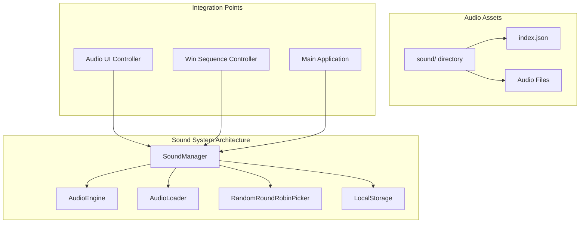
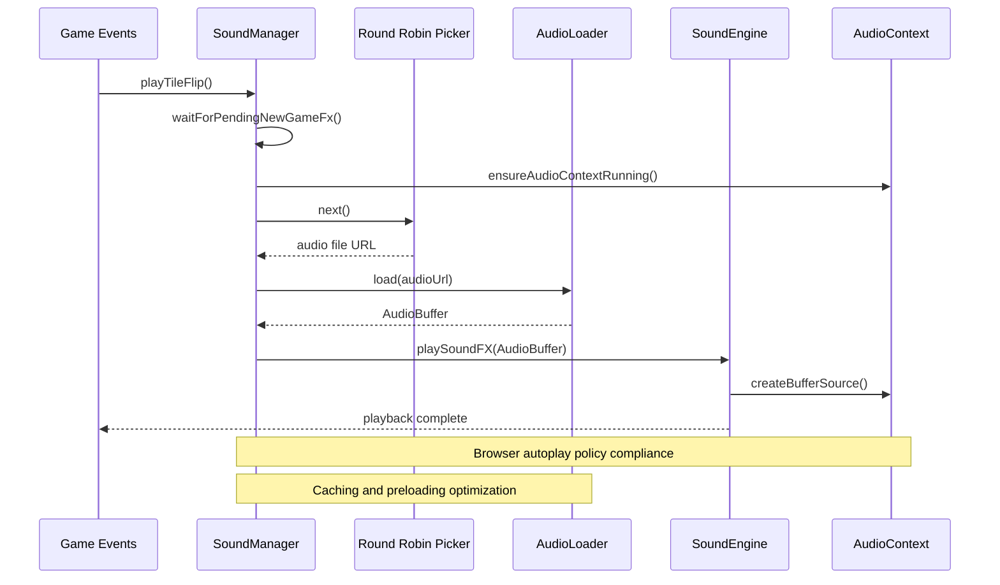
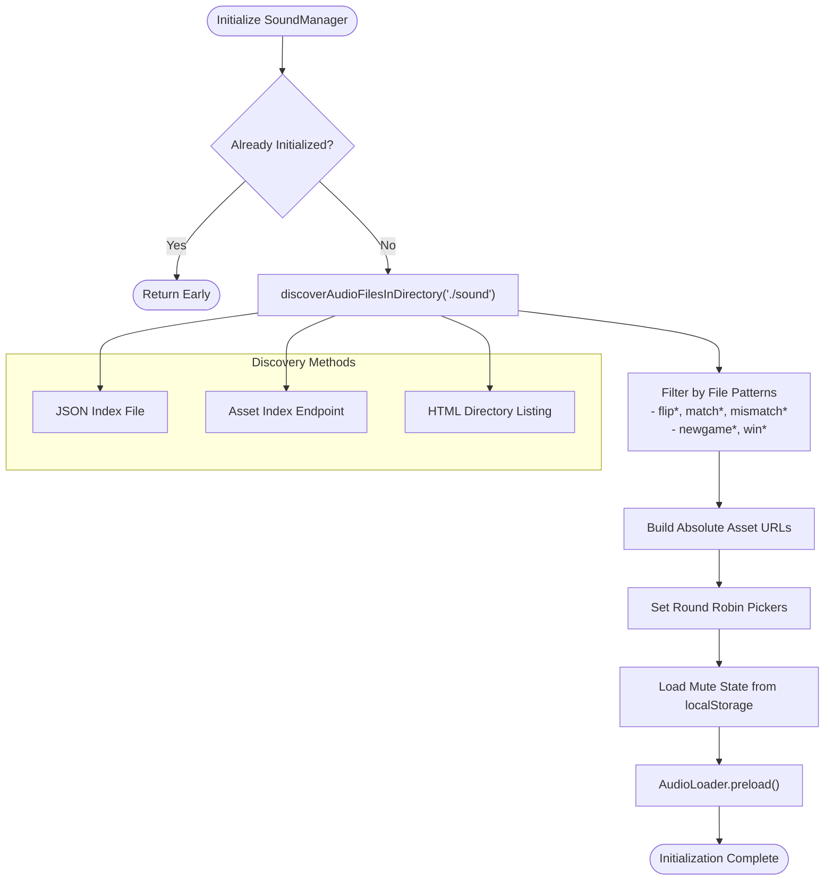
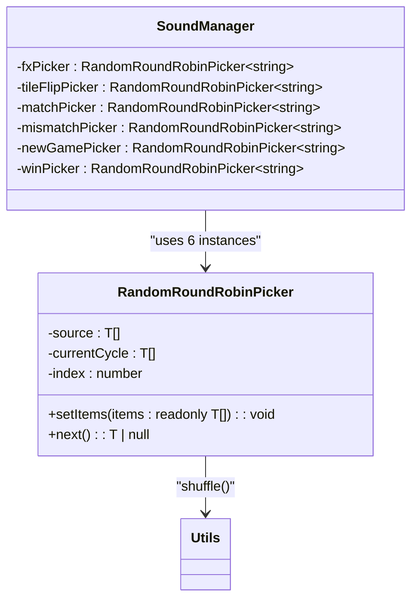
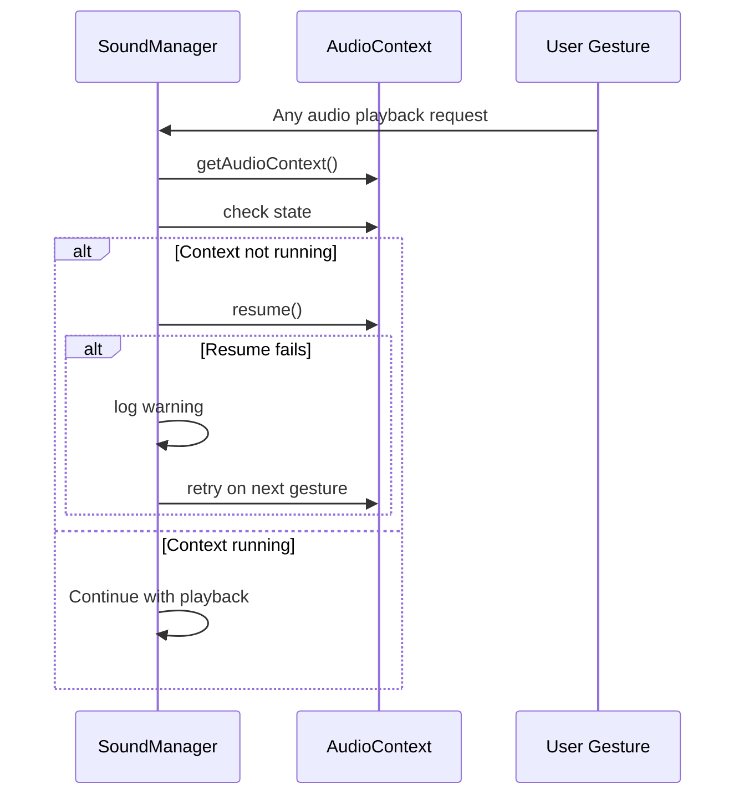
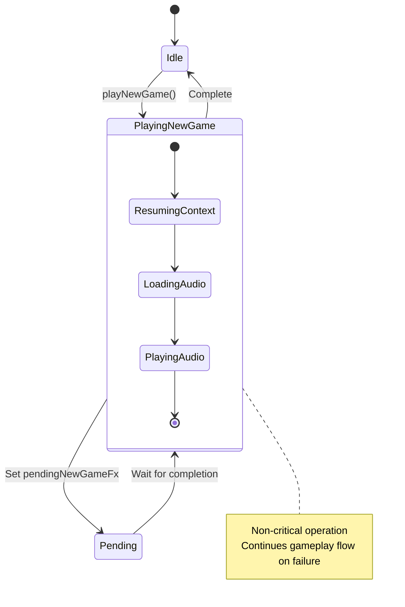
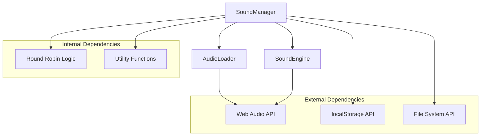

# Sound Manager Component

<cite>
**Referenced Files in This Document**
- [sound-manager.ts](file://src/sound-manager.ts)
- [audio-loader.ts](file://src/audio-loader.ts)
- [sound-engine.ts](file://src/sound-engine.ts)
- [utils.ts](file://src/utils.ts)
- [audio-ui-controller.ts](file://src/audio-ui-controller.ts)
- [index.ts](file://src/index.ts)
- [win-sequence-controller.ts](file://src/win-sequence-controller.ts)
- [sound/index.json](file://sound/index.json)
- [config/audio-formats.json](file://config/audio-formats.json)
- [sound-manager.test.ts](file://tests/sound-manager.test.ts)
</cite>

## Table of Contents
1. [Introduction](#introduction)
2. [Project Structure](#project-structure)
3. [Core Components](#core-components)
4. [Architecture Overview](#architecture-overview)
5. [Detailed Component Analysis](#detailed-component-analysis)
6. [Dependency Analysis](#dependency-analysis)
7. [Performance Considerations](#performance-considerations)
8. [Troubleshooting Guide](#troubleshooting-guide)
9. [Conclusion](#conclusion)

## Introduction
The SoundManager class serves as the central coordinator for all audio operations in the application. It manages audio file discovery, categorization, preloading, and playback orchestration. The component implements sophisticated patterns for randomizing sound effects while avoiding repetition, handles browser autoplay policy compliance, and provides robust error handling and fallback mechanisms.

## Project Structure
The sound system is organized around three primary components that work together to deliver seamless audio experiences:



**Diagram sources**
- [sound-manager.ts:238-461](file://src/sound-manager.ts#L238-L461)
- [audio-loader.ts:7-117](file://src/audio-loader.ts#L7-L117)
- [sound-engine.ts:8-109](file://src/sound-engine.ts#L8-L109)

**Section sources**
- [sound-manager.ts:1-462](file://src/sound-manager.ts#L1-L462)
- [audio-loader.ts:1-118](file://src/audio-loader.ts#L1-L118)
- [sound-engine.ts:1-110](file://src/sound-engine.ts#L1-L110)

## Core Components
The SoundManager system consists of several interconnected components that handle different aspects of audio management:

### SoundManager Class
The central orchestrator that coordinates all audio operations, manages asset discovery and categorization, and provides the public API for game events.

### AudioLoader
Handles audio file loading, decoding, and caching using the Web Audio API. Provides efficient resource management through intelligent caching strategies.

### SoundEngine
Manages the Web Audio API context, audio playback, and volume control. Implements mute functionality and handles browser autoplay policy compliance.

### RandomRoundRobinPicker
Implements the round-robin pattern for randomizing audio playback while preventing immediate repetitions.

**Section sources**
- [sound-manager.ts:238-461](file://src/sound-manager.ts#L238-L461)
- [audio-loader.ts:7-117](file://src/audio-loader.ts#L7-L117)
- [sound-engine.ts:8-109](file://src/sound-engine.ts#L8-L109)

## Architecture Overview
The SoundManager follows a layered architecture pattern that separates concerns between asset discovery, categorization, loading, and playback:



**Diagram sources**
- [sound-manager.ts:308-439](file://src/sound-manager.ts#L308-L439)
- [audio-loader.ts:30-64](file://src/audio-loader.ts#L30-L64)
- [sound-engine.ts:47-75](file://src/sound-engine.ts#L47-L75)

## Detailed Component Analysis

### Initialization Process
The SoundManager performs a comprehensive initialization sequence that discovers, categorizes, and prepares audio assets:



**Diagram sources**
- [sound-manager.ts:264-297](file://src/sound-manager.ts#L264-L297)
- [sound-manager.ts:196-226](file://src/sound-manager.ts#L196-L226)

The initialization process employs multiple discovery strategies with fallback mechanisms:
1. **JSON Index Method**: Reads structured audio file listings from `./sound/index.json`
2. **Asset Index Endpoint**: Uses server-side asset indexing for dynamic discovery
3. **HTML Directory Listing**: Parses directory listings when other methods fail

**Section sources**
- [sound-manager.ts:264-297](file://src/sound-manager.ts#L264-L297)
- [sound-manager.ts:196-226](file://src/sound-manager.ts#L196-L226)
- [sound/index.json:1-17](file://sound/index.json#L1-L17)

### Round-Robin Picker Pattern
The RandomRoundRobinPicker implements a sophisticated pattern that ensures randomization while preventing immediate repetitions:



**Diagram sources**
- [sound-manager.ts:71-100](file://src/sound-manager.ts#L71-L100)
- [sound-manager.ts:238-253](file://src/sound-manager.ts#L238-L253)
- [utils.ts:13-24](file://src/utils.ts#L13-L24)

The picker operates on a cycle basis:
1. **Shuffle Phase**: Creates a randomized cycle from the source pool
2. **Sequential Playback**: Plays items in shuffled order until cycle completion
3. **Refresh Phase**: Regenerates new shuffle when cycle exhausted

**Section sources**
- [sound-manager.ts:71-100](file://src/sound-manager.ts#L71-L100)
- [utils.ts:13-24](file://src/utils.ts#L13-L24)

### Event-Driven Audio Playback System
The SoundManager provides a comprehensive event-driven API that responds to game actions:

| Method | Purpose | Category | Behavior |
|--------|---------|----------|----------|
| `playTileFlip()` | Tile reveal sound | Flip Effects | Waits for pending new-game FX, then plays random flip sound |
| `playTileMatch()` | Successful match sound | Match Effects | Waits for pending new-game FX, then plays random match sound |
| `playTileMismatch()` | Failed match sound | Mismatch Effects | Waits for pending new-game FX, then plays random mismatch sound |
| `playWin(onStarted?)` | Victory celebration | Win Effects | Returns duration, triggers optional callback with duration |
| `playNewGame()` | New game start | New Game Effects | Handles pending operations, non-critical failure |

**Section sources**
- [sound-manager.ts:308-439](file://src/sound-manager.ts#L308-L439)

### Audio Context Management and Autoplay Policy Compliance
The SoundManager implements robust browser autoplay policy compliance through the `ensureAudioContextRunning()` method:



**Diagram sources**
- [sound-manager.ts:441-460](file://src/sound-manager.ts#L441-L460)

The autoplay compliance strategy:
1. **Detection**: Checks AudioContext state before playback
2. **Resume Attempt**: Attempts to resume paused contexts
3. **Graceful Degradation**: Continues playback on subsequent user gestures if resume fails

**Section sources**
- [sound-manager.ts:441-460](file://src/sound-manager.ts#L441-L460)

### Mute Functionality with localStorage Persistence
The SoundManager provides comprehensive mute state management with persistent storage:

```mermaid
flowchart TD
SetMute[setSoundMuted(muted)] --> UpdateEngine["Update SoundEngine"]
UpdateEngine --> Store["localStorage.setItem()"]
Store --> Persisted([State Persisted])
GetMute[getSoundMuted()] --> CheckEngine["Check SoundEngine State"]
CheckEngine --> ReturnState([Return Current State])
Init[initialize()] --> LoadStorage["localStorage.getItem()"]
LoadStorage --> SetEngine["Set SoundEngine State"]
SetEngine --> Ready([Ready])
subgraph "Storage Keys"
Key["memoryblox-sound-muted"]
end
Store --> Key
LoadStorage --> Key
```

**Diagram sources**
- [sound-manager.ts:299-306](file://src/sound-manager.ts#L299-L306)
- [sound-manager.ts:292](file://src/sound-manager.ts#L292)
- [sound-manager.ts:109-121](file://src/sound-manager.ts#L109-L121)

**Section sources**
- [sound-manager.ts:299-306](file://src/sound-manager.ts#L299-L306)
- [sound-manager.ts:109-121](file://src/sound-manager.ts#L109-L121)

### Pending Operation Handling for New Game Sounds
The SoundManager implements sophisticated pending operation management for new game sounds:



**Diagram sources**
- [sound-manager.ts:327-343](file://src/sound-manager.ts#L327-L343)
- [sound-manager.ts:345-351](file://src/sound-manager.ts#L345-L351)

**Section sources**
- [sound-manager.ts:327-343](file://src/sound-manager.ts#L327-L343)
- [sound-manager.ts:345-351](file://src/sound-manager.ts#L345-L351)

### Error Handling Strategies and Fallback Mechanisms
The SoundManager implements comprehensive error handling across multiple layers:

#### Audio Discovery Failures
- **Multiple Strategy Support**: Falls back from JSON index to asset endpoint to HTML listing
- **Graceful Degradation**: Returns empty arrays when discovery fails
- **Logging**: Provides informative console messages for debugging

#### Playback Failures
- **Non-Critical Operations**: New game sounds don't interrupt gameplay flow
- **Silent Recovery**: Failed audio loads are logged but don't crash the application
- **State Cleanup**: Pending operations are properly cleared even on failure

#### Browser Compatibility
- **Feature Detection**: Checks for AudioContext resume capability
- **Graceful Degradation**: Continues operation on unsupported browsers
- **Type Safety**: Comprehensive type checking for Web Audio API features

**Section sources**
- [sound-manager.ts:196-226](file://src/sound-manager.ts#L196-L226)
- [sound-manager.ts:337-342](file://src/sound-manager.ts#L337-L342)
- [audio-loader.ts:50-63](file://src/audio-loader.ts#L50-L63)

## Dependency Analysis
The SoundManager maintains clean separation of concerns through well-defined dependencies:



**Diagram sources**
- [sound-manager.ts:1-3](file://src/sound-manager.ts#L1-L3)
- [sound-engine.ts:8-29](file://src/sound-engine.ts#L8-L29)
- [audio-loader.ts:7-18](file://src/audio-loader.ts#L7-L18)

**Section sources**
- [sound-manager.ts:1-3](file://src/sound-manager.ts#L1-L3)
- [sound-engine.ts:8-29](file://src/sound-engine.ts#L8-L29)
- [audio-loader.ts:7-18](file://src/audio-loader.ts#L7-L18)

## Performance Considerations
The SoundManager implements several performance optimizations:

### Caching Strategy
- **Audio Buffer Caching**: Prevents redundant network requests and decoding overhead
- **Lazy Loading**: Audio files are loaded only when needed
- **Memory Management**: Provides cache clearing capabilities for memory-constrained environments

### Parallel Loading
- **Preloading**: Multiple audio files are loaded concurrently during initialization
- **Promise.allSettled**: Ensures partial failures don't block overall loading progress

### Resource Pooling
- **Round Robin Distribution**: Even distribution of audio files across categories
- **Cycle Management**: Efficient reuse of audio resources without regeneration

**Section sources**
- [audio-loader.ts:75-88](file://src/audio-loader.ts#L75-L88)
- [sound-manager.ts:294](file://src/sound-manager.ts#L294)

## Troubleshooting Guide

### Common Issues and Solutions

#### Audio Not Playing
**Symptoms**: No sound output during gameplay
**Causes**: 
- Browser autoplay restrictions
- Muted state
- Audio context not resumed

**Solutions**:
1. Trigger user gesture (click/tap) to resume audio context
2. Check mute state via `getSoundMuted()`
3. Verify audio files are properly loaded in developer tools

#### Missing Audio Files
**Symptoms**: Some sound categories not working
**Causes**:
- Incorrect file naming patterns
- Missing audio files in directory
- Discovery method failures

**Solutions**:
1. Verify file names match patterns (flip*, match*, mismatch*, newgame*, win*)
2. Check `./sound/index.json` contains all expected files
3. Confirm directory listing accessibility

#### Performance Issues
**Symptoms**: Slow audio loading or playback lag
**Causes**:
- Large audio files
- Network latency
- Excessive concurrent audio requests

**Solutions**:
1. Optimize audio file sizes and formats
2. Use appropriate audio compression
3. Monitor cache hit rates

**Section sources**
- [sound-manager.ts:441-460](file://src/sound-manager.ts#L441-L460)
- [audio-loader.ts:95-116](file://src/audio-loader.ts#L95-L116)

## Conclusion
The SoundManager component provides a robust, scalable solution for managing audio in the application. Its architecture balances flexibility with reliability through comprehensive error handling, browser compatibility, and performance optimizations. The round-robin picker pattern ensures engaging audio experiences while maintaining variety, and the event-driven design seamlessly integrates with the game's workflow. The implementation demonstrates best practices in modern web audio development, including proper resource management, autoplay policy compliance, and graceful degradation strategies.