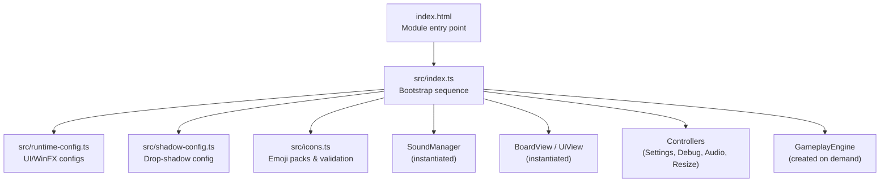
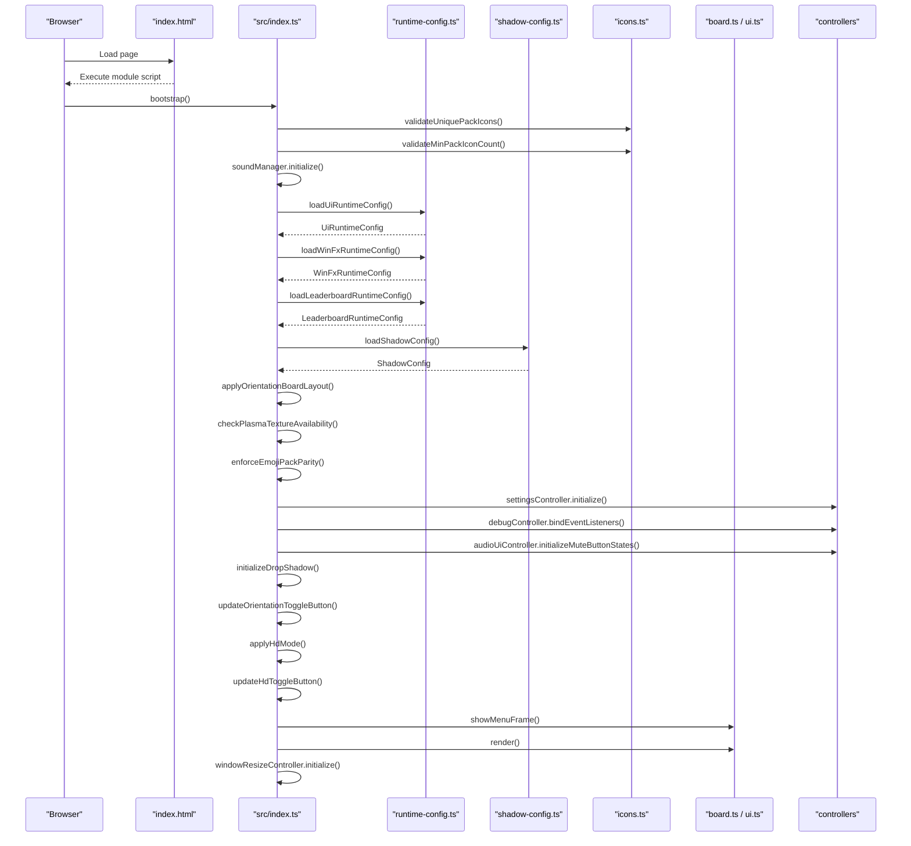
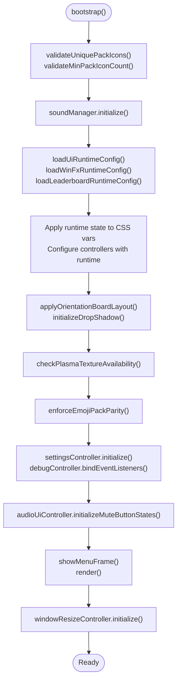
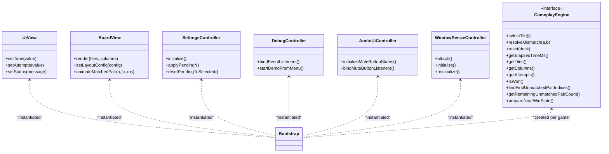
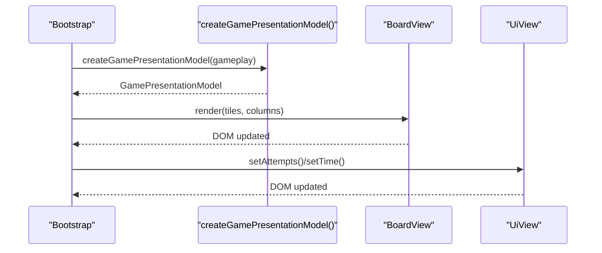
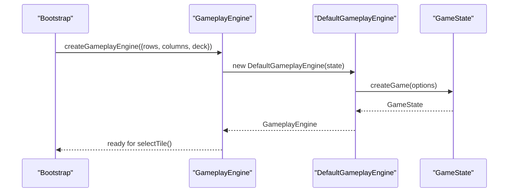
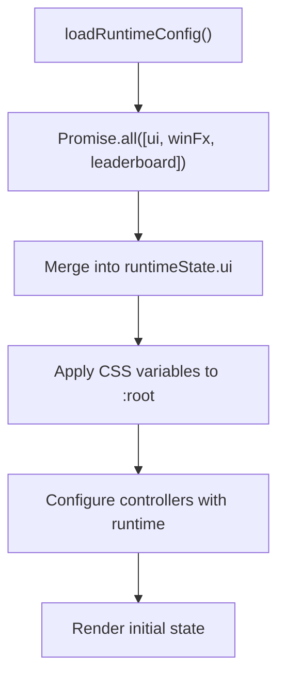
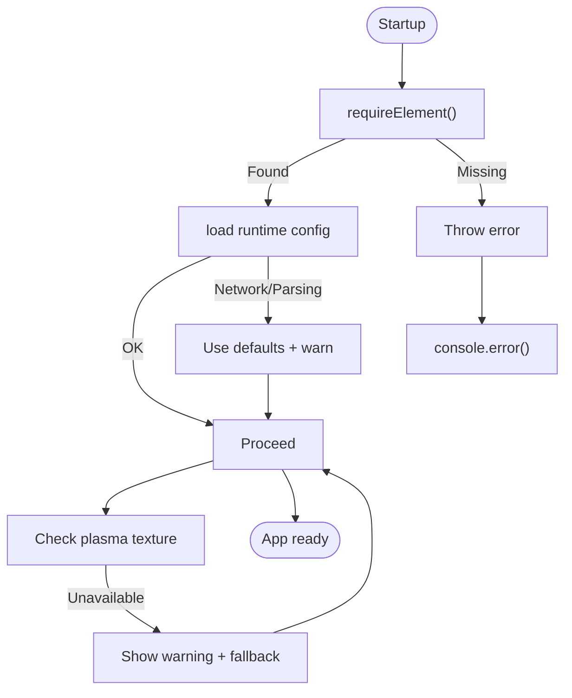
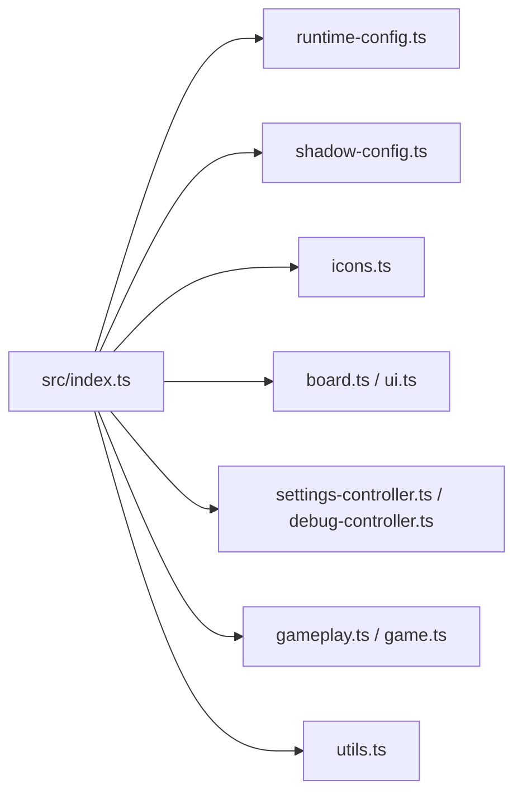

# Bootstrap Layer

<cite>
**Referenced Files in This Document**
- [index.html](file://index.html)
- [src/index.ts](file://src/index.ts)
- [src/presentation.ts](file://src/presentation.ts)
- [src/game.ts](file://src/game.ts)
- [src/gameplay.ts](file://src/gameplay.ts)
- [src/board.ts](file://src/board.ts)
- [src/ui.ts](file://src/ui.ts)
- [src/settings-controller.ts](file://src/settings-controller.ts)
- [src/runtime-config.ts](file://src/runtime-config.ts)
- [src/cfg.ts](file://src/cfg.ts)
- [src/icons.ts](file://src/icons.ts)
- [src/difficulty.ts](file://src/difficulty.ts)
- [src/utils.ts](file://src/utils.ts)
- [src/shadow-config.ts](file://src/shadow-config.ts)
</cite>

## Table of Contents
1. [Introduction](#introduction)
2. [Project Structure](#project-structure)
3. [Core Components](#core-components)
4. [Architecture Overview](#architecture-overview)
5. [Detailed Component Analysis](#detailed-component-analysis)
6. [Dependency Analysis](#dependency-analysis)
7. [Performance Considerations](#performance-considerations)
8. [Troubleshooting Guide](#troubleshooting-guide)
9. [Conclusion](#conclusion)

## Introduction
This document explains the bootstrap layer architecture that orchestrates the application’s initialization, dependency injection, and runtime orchestration. It traces the sequence from DOMContentLoaded through configuration loading to game engine initialization, and documents how the presentation layer coordinates rendering, event wiring, and controller lifecycles. It also covers the modular initialization pattern, error handling during startup, graceful degradation strategies, and how to integrate new subsystems into the bootstrap layer.

## Project Structure
The bootstrap layer centers on a single module entry that wires together UI, game logic, configuration, and auxiliary systems. The HTML page loads the module script, which immediately begins the bootstrap sequence.

**Diagram sources**
- [index.html:193](file://index.html#L193)
- [src/index.ts:1074](file://src/index.ts#L1074-L1096)
- [src/runtime-config.ts:238](file://src/runtime-config.ts#L238-L353)
- [src/shadow-config.ts:139](file://src/shadow-config.ts#L139-L183)
- [src/icons.ts:541](file://src/icons.ts#L541-L580)

**Section sources**
- [index.html:193](file://index.html#L193)
- [src/index.ts:1074](file://src/index.ts#L1074-L1096)

## Core Components
- Bootstrap entry and orchestration: Initializes subsystems, applies runtime configuration, binds UI, and renders the initial state.
- Presentation model: Transforms game state into a view-friendly structure for rendering.
- Game engine facade: Encapsulates game logic behind a typed interface for testability and controlled access.
- View layer: UI abstractions for rendering and status display.
- Controllers: Event-driven subsystems for settings, debug, audio, window resizing, and orientation/HDR modes.
- Configuration loaders: Load and normalize runtime configuration from disk-backed files.
- Utilities: DOM queries, formatting, clamping, and accessibility helpers.

**Section sources**
- [src/index.ts:809](file://src/index.ts#L809-L816)
- [src/presentation.ts:12](file://src/presentation.ts#L12-L24)
- [src/gameplay.ts:28](file://src/gameplay.ts#L28-L41)
- [src/ui.ts:15](file://src/ui.ts#L15-L48)
- [src/settings-controller.ts:33](file://src/settings-controller.ts#L33-L49)
- [src/runtime-config.ts:238](file://src/runtime-config.ts#L238-L353)
- [src/utils.ts:3](file://src/utils.ts#L3-L11)

## Architecture Overview
The bootstrap layer follows a modular initialization pattern:
- Pre-flight validation ensures icon packs meet minimum criteria.
- Asynchronous configuration loading merges UI, win-effects, and leaderboard settings.
- Subsystems instantiate and wire event handlers.
- Initial render displays the menu and HUD.

**Diagram sources**
- [src/index.ts:1074](file://src/index.ts#L1074-L1096)
- [src/runtime-config.ts:238](file://src/runtime-config.ts#L238-L353)
- [src/shadow-config.ts:139](file://src/shadow-config.ts#L139-L183)
- [src/icons.ts:541](file://src/icons.ts#L541-L580)
- [src/board.ts:121](file://src/board.ts#L121-L175)
- [src/ui.ts:15](file://src/ui.ts#L15-L48)

## Detailed Component Analysis

### Bootstrap Orchestration
The bootstrap function performs a deterministic sequence of actions:
- Validates icon pack integrity and minimum sizes.
- Initializes audio subsystem.
- Loads and applies UI, win-effects, and leaderboard configurations.
- Applies orientation/HDR board layout and toggles.
- Checks optional plasma texture availability and warns gracefully.
- Enforces icon pack parity for UI stability.
- Initializes settings and debug controllers and wires UI event listeners.
- Applies drop-shadow CSS variables and initializes HUD.
- Starts window resize controller after first animation frame.

**Diagram sources**
- [src/index.ts:1074](file://src/index.ts#L1074-L1096)
- [src/runtime-config.ts:846](file://src/runtime-config.ts#L846-L900)
- [src/shadow-config.ts:321](file://src/shadow-config.ts#L321-L332)

**Section sources**
- [src/index.ts:1074](file://src/index.ts#L1074-L1096)

### Dependency Injection and Instantiation Pattern
The bootstrap layer constructs and wires subsystems with explicit dependencies:
- Controllers receive DOM elements and callbacks via constructor options.
- Views are instantiated with DOM nodes and expose pure setters for state updates.
- Engine instances are created on-demand for each game session.
- Configuration is injected into controllers and views via runtime state.

**Diagram sources**
- [src/index.ts:809](file://src/index.ts#L809-L816)
- [src/index.ts:919](file://src/index.ts#L919-L928)
- [src/index.ts:930](file://src/index.ts#L930-L971)
- [src/index.ts:1047](file://src/index.ts#L1047-L1053)
- [src/gameplay.ts:28](file://src/gameplay.ts#L28-L41)
- [src/ui.ts:15](file://src/ui.ts#L15-L48)
- [src/board.ts:121](file://src/board.ts#L121-L175)

**Section sources**
- [src/index.ts:809](file://src/index.ts#L809-L816)
- [src/index.ts:919](file://src/index.ts#L919-L928)
- [src/index.ts:930](file://src/index.ts#L930-L971)
- [src/index.ts:1047](file://src/index.ts#L1047-L1053)
- [src/gameplay.ts:28](file://src/gameplay.ts#L28-L41)

### Presentation Model and Rendering Pipeline
The presentation layer transforms game state into a view model and delegates rendering to specialized views:
- Presentation model extracts board tiles, columns, attempts, and formatted elapsed time.
- BoardView renders tiles, animates matched pairs, and maintains lazy back-face caching.
- UiView updates HUD elements without handling events.

**Diagram sources**
- [src/index.ts:781](file://src/index.ts#L781-L807)
- [src/presentation.ts:12](file://src/presentation.ts#L12-L24)
- [src/board.ts:227](file://src/board.ts#L227-L306)
- [src/ui.ts:37](file://src/ui.ts#L37-L47)

**Section sources**
- [src/index.ts:781](file://src/index.ts#L781-L807)
- [src/presentation.ts:12](file://src/presentation.ts#L12-L24)
- [src/board.ts:227](file://src/board.ts#L227-L306)
- [src/ui.ts:37](file://src/ui.ts#L37-L47)

### Game Engine Initialization and Lifecycle
The engine is created per session with rows, columns, and a generated deck. The gameplay facade encapsulates state and exposes a typed interface for selection, resolution, reset, and metrics.

**Diagram sources**
- [src/index.ts:600](file://src/index.ts#L600-L605)
- [src/gameplay.ts:101](file://src/gameplay.ts#L101-L106)
- [src/game.ts:61](file://src/game.ts#L61-L138)

**Section sources**
- [src/index.ts:600](file://src/index.ts#L600-L605)
- [src/gameplay.ts:101](file://src/gameplay.ts#L101-L106)
- [src/game.ts:61](file://src/game.ts#L61-L138)

### Configuration Loading and Runtime Application
Configuration is loaded concurrently and merged into a runtime state object. CSS variables are applied globally, and controllers are updated with limits and options.

**Diagram sources**
- [src/index.ts:846](file://src/index.ts#L846-L900)
- [src/runtime-config.ts:238](file://src/runtime-config.ts#L238-L353)

**Section sources**
- [src/index.ts:846](file://src/index.ts#L846-L900)
- [src/runtime-config.ts:238](file://src/runtime-config.ts#L238-L353)

### Error Handling and Graceful Degradation
- Required DOM elements are validated at startup; missing elements cause immediate errors.
- Configuration loading is resilient: missing or malformed files fall back to defaults; warnings are logged.
- Texture availability is checked asynchronously; absence triggers a UI warning and fallback behavior.
- Startup failures are caught and logged to the console.

**Diagram sources**
- [src/utils.ts:3](file://src/utils.ts#L3-L11)
- [src/cfg.ts:54](file://src/cfg.ts#L54-L78)
- [src/index.ts:338](file://src/index.ts#L338-L355)
- [src/index.ts:1098](file://src/index.ts#L1098-L1100)

**Section sources**
- [src/utils.ts:3](file://src/utils.ts#L3-L11)
- [src/cfg.ts:54](file://src/cfg.ts#L54-L78)
- [src/index.ts:338](file://src/index.ts#L338-L355)
- [src/index.ts:1098](file://src/index.ts#L1098-L1100)

### Integrating New Subsystems
To add a new subsystem to the bootstrap layer:
- Define dependencies and constructor options similar to existing controllers.
- Instantiate the subsystem early in bootstrap, after prerequisite validations and before UI binding.
- Wire event listeners and DOM hooks in bootstrap after instantiation.
- If configuration is needed, add a loader and merge defaults into runtimeState.
- Ensure graceful fallbacks and logging for asynchronous or optional resources.
- Keep event wiring centralized in bootstrap; views should remain presentation-only.

Example integration points:
- Add a new controller near SettingsController and DebugController initialization.
- Register event listeners on DOM elements after bootstrap completes.
- If the subsystem requires configuration, add a loader and merge into runtimeState before applying CSS variables.

**Section sources**
- [src/index.ts:919](file://src/index.ts#L919-L928)
- [src/index.ts:930](file://src/index.ts#L930-L971)
- [src/index.ts:846](file://src/index.ts#L846-L900)

## Dependency Analysis
The bootstrap layer exhibits low coupling and high cohesion:
- Controllers depend on DOM elements and callbacks; they do not manage DOM themselves.
- Views depend only on DOM nodes and expose pure setters.
- Configuration is injected into controllers and applied globally via CSS variables.
- Game engine is a facade over immutable state, enabling testability and controlled mutation.

**Diagram sources**
- [src/index.ts:1074](file://src/index.ts#L1074-L1096)
- [src/runtime-config.ts:238](file://src/runtime-config.ts#L238-L353)
- [src/shadow-config.ts:139](file://src/shadow-config.ts#L139-L183)
- [src/icons.ts:541](file://src/icons.ts#L541-L580)
- [src/board.ts:121](file://src/board.ts#L121-L175)
- [src/ui.ts:15](file://src/ui.ts#L15-L48)
- [src/settings-controller.ts:33](file://src/settings-controller.ts#L33-L49)
- [src/gameplay.ts:28](file://src/gameplay.ts#L28-L41)
- [src/game.ts:1](file://src/game.ts#L1-L42)
- [src/utils.ts:3](file://src/utils.ts#L3-L11)

**Section sources**
- [src/index.ts:1074](file://src/index.ts#L1074-L1096)

## Performance Considerations
- Concurrent configuration loading reduces startup latency.
- Lazy rendering of tile back-faces minimizes DOM and image work until tiles are revealed.
- CSS variables for animations and effects avoid recalculating styles in hot loops.
- Abort controllers and timeouts are used to cancel in-flight operations during state transitions.

## Troubleshooting Guide
Common startup issues and remedies:
- Missing DOM elements: The app throws on missing selectors; verify IDs and structure in the HTML.
- Configuration fetch failures: Network or parsing errors log warnings and fall back to defaults.
- Icon pack validation errors: Ensure each pack has sufficient unique icons and no duplicates.
- Texture availability: If plasma texture is unavailable, a warning is shown and fallback behavior is applied.

**Section sources**
- [src/utils.ts:3](file://src/utils.ts#L3-L11)
- [src/cfg.ts:54](file://src/cfg.ts#L54-L78)
- [src/icons.ts:541](file://src/icons.ts#L541-L580)
- [src/index.ts:338](file://src/index.ts#L338-L355)

## Conclusion
The bootstrap layer establishes a robust, modular initialization sequence that validates prerequisites, loads and applies runtime configuration, instantiates controllers and views, and wires event handlers. Its design emphasizes separation of concerns, testability, and resilience through graceful degradation and centralized error handling. New subsystems can be integrated by following the established patterns for dependency injection, event wiring, and configuration application.