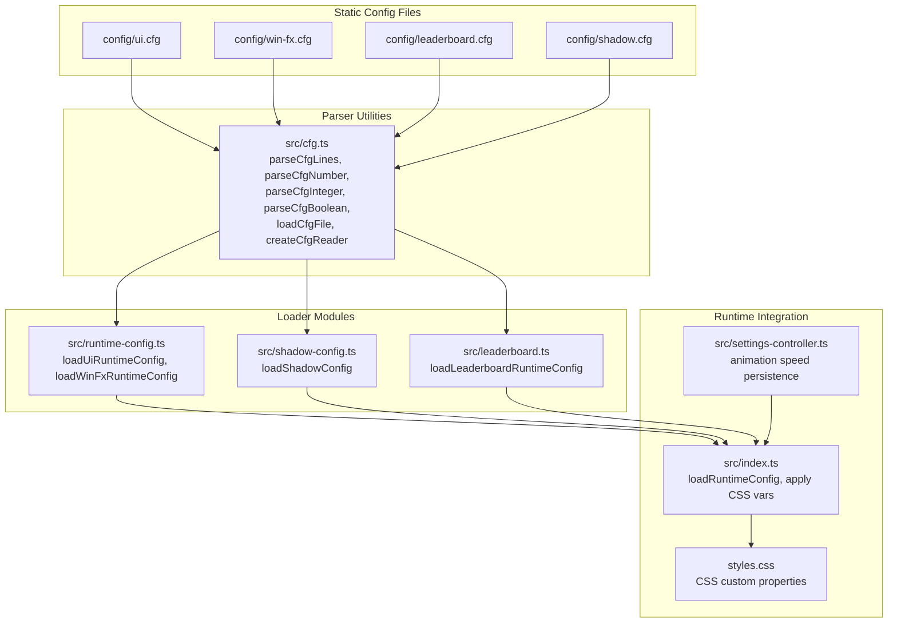
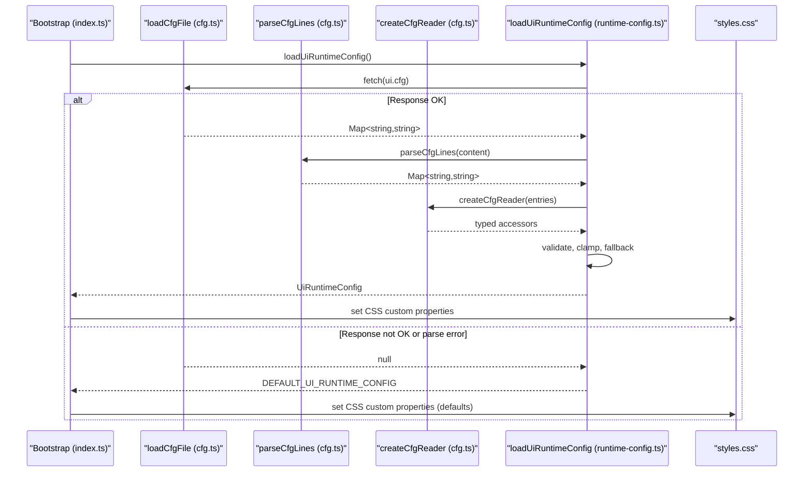
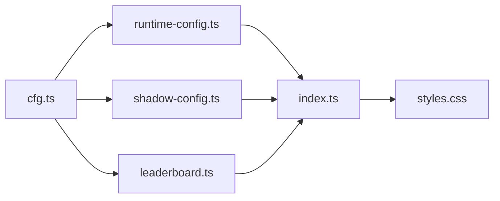

# Configuration Architecture

<cite>
**Referenced Files in This Document**
- [runtime-config.ts](file://src/runtime-config.ts)
- [cfg.ts](file://src/cfg.ts)
- [index.ts](file://src/index.ts)
- [ui.cfg](file://config/ui.cfg)
- [shadow.cfg](file://config/shadow.cfg)
- [win-fx.cfg](file://config/win-fx.cfg)
- [leaderboard.cfg](file://config/leaderboard.cfg)
- [shadow-config.ts](file://src/shadow-config.ts)
- [leaderboard.ts](file://src/leaderboard.ts)
- [styles.css](file://styles.css)
- [settings-controller.ts](file://src/settings-controller.ts)
- [runtime-config.test.ts](file://tests/runtime-config.test.ts)
</cite>

## Table of Contents
1. [Introduction](#introduction)
2. [Project Structure](#project-structure)
3. [Core Components](#core-components)
4. [Architecture Overview](#architecture-overview)
5. [Detailed Component Analysis](#detailed-component-analysis)
6. [Dependency Analysis](#dependency-analysis)
7. [Performance Considerations](#performance-considerations)
8. [Troubleshooting Guide](#troubleshooting-guide)
9. [Conclusion](#conclusion)

## Introduction
This document describes the configuration management system that bridges static configuration files with dynamic runtime settings. It explains how JSON-like configuration files are parsed and transformed into strongly-typed JavaScript runtime objects, and how these objects integrate with CSS custom properties for dynamic theming. The system separates UI configuration (themes, animations, window settings) from game configuration (scoring, difficulty parameters), and provides robust validation, default value management, and graceful fallbacks for missing or invalid configurations.

## Project Structure
The configuration system spans static files, parsing utilities, loader modules, and runtime integration points:
- Static configuration files define runtime behavior in a simple key=value format with comments.
- Parser utilities convert raw text into structured key-value maps and validate primitive types.
- Loader modules fetch and parse configuration files, validate values, and construct typed runtime objects.
- Runtime integration applies validated configuration to CSS custom properties and JavaScript state.

**Diagram sources**
- [ui.cfg](file://config/ui.cfg)
- [shadow.cfg](file://config/shadow.cfg)
- [win-fx.cfg](file://config/win-fx.cfg)
- [leaderboard.cfg](file://config/leaderboard.cfg)
- [cfg.ts](file://src/cfg.ts)
- [runtime-config.ts](file://src/runtime-config.ts)
- [shadow-config.ts](file://src/shadow-config.ts)
- [leaderboard.ts](file://src/leaderboard.ts)
- [index.ts](file://src/index.ts)
- [styles.css](file://styles.css)
- [settings-controller.ts](file://src/settings-controller.ts)

**Section sources**
- [runtime-config.ts](file://src/runtime-config.ts)
- [cfg.ts](file://src/cfg.ts)
- [index.ts](file://src/index.ts)
- [ui.cfg](file://config/ui.cfg)
- [shadow.cfg](file://config/shadow.cfg)
- [win-fx.cfg](file://config/win-fx.cfg)
- [leaderboard.cfg](file://config/leaderboard.cfg)
- [shadow-config.ts](file://src/shadow-config.ts)
- [leaderboard.ts](file://src/leaderboard.ts)
- [styles.css](file://styles.css)
- [settings-controller.ts](file://src/settings-controller.ts)

## Core Components
- Parser utilities: Provide robust parsing of key=value configuration files, typed value extraction, and safe file loading with error handling.
- Loader modules: Transform parsed key-values into strongly-typed runtime configuration objects with validation, clamping, and fallbacks.
- Runtime integration: Apply configuration to CSS custom properties and JavaScript state, enabling dynamic theming and responsive behavior.
- Static configuration files: Define UI, shadow, win effects, and leaderboard parameters in a human-readable format.

Key responsibilities:
- Validation and normalization: Clamp numeric values, enforce ranges, and reject invalid formats.
- Fallback mechanisms: Defaults ensure graceful degradation when files are missing or values are invalid.
- Dynamic theming: CSS custom properties propagate runtime values to stylesheets for immediate visual updates.

**Section sources**
- [cfg.ts](file://src/cfg.ts)
- [runtime-config.ts](file://src/runtime-config.ts)
- [shadow-config.ts](file://src/shadow-config.ts)
- [leaderboard.ts](file://src/leaderboard.ts)
- [index.ts](file://src/index.ts)
- [styles.css](file://styles.css)

## Architecture Overview
The configuration pipeline follows a consistent flow:
1. Static files are fetched via HTTP with no-cache semantics.
2. Raw content is parsed into key-value maps, skipping comments and malformed lines.
3. Typed readers extract values with fallback defaults.
4. Loaders validate and normalize values, applying clamps and derived computations.
5. Runtime state is updated and CSS custom properties are applied for dynamic theming.

**Diagram sources**
- [index.ts](file://src/index.ts)
- [cfg.ts](file://src/cfg.ts)
- [runtime-config.ts](file://src/runtime-config.ts)
- [ui.cfg](file://config/ui.cfg)
- [styles.css](file://styles.css)

## Detailed Component Analysis

### Parser Utilities (cfg.ts)
- parseCfgLines: Splits content by line endings, trims whitespace, ignores empty lines and comments, captures first '=' as delimiter, and builds a Map of key to value.
- parseCfgNumber/parseCfgInteger/parseCfgBoolean: Safe parsers that return null for invalid inputs.
- loadCfgFile: Fetches configuration files with no-cache, distinguishes network vs parsing errors, and logs warnings.
- createCfgReader: Wraps a parsed Map with typed accessor methods and default fallbacks.

Validation characteristics:
- Robust against malformed lines and comments.
- Graceful handling of invalid numeric/boolean values via null returns.
- Clear separation of fetch errors and parse-time errors.

**Section sources**
- [cfg.ts](file://src/cfg.ts)

### UI Runtime Configuration Loader (runtime-config.ts)
Responsibilities:
- Loads ui.cfg via loadCfgFile.
- Uses createCfgReader for typed access with defaults.
- Validates and normalizes numeric ranges, clamps values, and handles min/max swaps.
- Constructs UiRuntimeConfig with nested objects for board layout, gameplay timing, visual effects, window sizing, and animation speed limits.
- Provides DEFAULT_UI_RUNTIME_CONFIG for fallback.

Key validation and normalization:
- Window scale limits: minScale and maxScale are validated and swapped if needed; defaultScale is clamped to the computed range.
- Opacity values: ui.tileGlobalOpacity and per-face opacities are clamped to [0,1]; per-face values fall back to global when unspecified.
- Positive constraints: sizes and durations are clamped to positive values.
- Animation speed: minSpeed ≤ maxSpeed; defaultSpeed is clamped to [minSpeed, maxSpeed].

Integration points:
- Exposes RUNTIME_CONFIG_PATHS for centralized file locations.
- Used by index.ts to update runtimeState and CSS custom properties.

**Section sources**
- [runtime-config.ts](file://src/runtime-config.ts)
- [ui.cfg](file://config/ui.cfg)

### Win Effects Runtime Configuration Loader (runtime-config.ts)
Responsibilities:
- Loads win-fx.cfg via loadCfgFile.
- Parses comma-separated lists into arrays and validates hex color formats.
- Applies fallbacks for colors, text options, and rain colors when inputs are empty or invalid.
- Constructs WinFxRuntimeConfig with options and lists.

Validation and fallbacks:
- Numeric fields are clamped to positive ranges.
- Color lists are filtered to valid hex formats; empty or missing lists fall back to defaults.

**Section sources**
- [runtime-config.ts](file://src/runtime-config.ts)
- [win-fx.cfg](file://config/win-fx.cfg)

### Shadow Configuration Loader (shadow-config.ts)
Responsibilities:
- Loads shadow.cfg via loadCfgFile.
- Parses activePreset and preset.* keys into a map of presets.
- Normalizes partial shadow configs by filling missing fields from defaults and clamping values to safe ranges.
- Applies fallback logic when requested preset is missing or incomplete.

Validation and fallbacks:
- Rejects unrecognized keys with warnings.
- Clamps offsets to [0, MAX_OFFSET_PX], blur to [0, MAX_BLUR_PX], and opacity to [0, 1].
- Warns and falls back to balanced preset or built-in defaults when needed.

**Section sources**
- [shadow-config.ts](file://src/shadow-config.ts)
- [shadow.cfg](file://config/shadow.cfg)

### Leaderboard Runtime Configuration Loader (leaderboard.ts)
Responsibilities:
- Loads leaderboard.cfg via loadCfgFile.
- Extracts boolean and numeric settings with strict clamping and bounds.
- Constructs LeaderboardRuntimeConfig with scoring parameters.

Validation and fallbacks:
- Enforces non-negative and bounded ranges for all numeric values.
- Uses DEFAULT_LEADERBOARD_RUNTIME_CONFIG when file is missing or values are invalid.

**Section sources**
- [leaderboard.ts](file://src/leaderboard.ts)
- [leaderboard.cfg](file://config/leaderboard.cfg)

### Runtime Application and CSS Integration (index.ts, styles.css)
- Bootstrap loads UI, win effects, and leaderboard configurations concurrently.
- Updates runtimeState.ui with validated values and applies CSS custom properties for dynamic theming.
- CSS custom properties in styles.css consume runtime values for animations, opacities, and layout constraints.
- Settings controller persists user preferences (emoji pack, tile multiplier, animation speed) and applies them to runtime state.

Dynamic theming flow:
- index.ts sets CSS variables derived from runtime configuration (e.g., --animation-speed, --tile-global-opacity).
- styles.css consumes these variables for animations and visual effects.
- Settings controller updates --animation-speed dynamically based on user selection.

**Section sources**
- [index.ts](file://src/index.ts)
- [styles.css](file://styles.css)
- [settings-controller.ts](file://src/settings-controller.ts)

### Configuration Separation: UI vs Game
- UI configuration (ui.cfg): Controls visual themes, window sizing, animation speeds, tile opacities, and gameplay timing intervals. Loaded by loadUiRuntimeConfig and integrated into runtimeState.ui and CSS variables.
- Game configuration (leaderboard.cfg): Governs scoring mechanics, penalties, and leaderboards. Loaded by loadLeaderboardRuntimeConfig and used by leaderboard computation logic.

This separation ensures that UI tweaks do not interfere with game balance and vice versa.

**Section sources**
- [runtime-config.ts](file://src/runtime-config.ts)
- [leaderboard.ts](file://src/leaderboard.ts)
- [ui.cfg](file://config/ui.cfg)
- [leaderboard.cfg](file://config/leaderboard.cfg)

### Hot Reload Capabilities
- The system supports hot reload by re-invoking the loader functions and updating runtimeState and CSS variables.
- Concurrent loading of multiple configurations ensures efficient initialization and updates.
- CSS custom properties are immediately applied, reflecting changes without page reload.

Note: While the tests demonstrate reloading behavior, explicit hot-reload hooks are not present in the analyzed code. The capability exists through the modular loader design.

**Section sources**
- [index.ts](file://src/index.ts)
- [runtime-config.ts](file://src/runtime-config.ts)
- [leaderboard.ts](file://src/leaderboard.ts)
- [runtime-config.test.ts](file://tests/runtime-config.test.ts)

## Dependency Analysis
The configuration system exhibits low coupling and high cohesion:
- Parser utilities are reused across loaders, minimizing duplication.
- Loaders depend on parser utilities and produce domain-specific runtime objects.
- Runtime integration depends on loaders and CSS for dynamic theming.
- Static configuration files are decoupled from code and can be modified independently.

**Diagram sources**
- [cfg.ts](file://src/cfg.ts)
- [runtime-config.ts](file://src/runtime-config.ts)
- [shadow-config.ts](file://src/shadow-config.ts)
- [leaderboard.ts](file://src/leaderboard.ts)
- [index.ts](file://src/index.ts)
- [styles.css](file://styles.css)

**Section sources**
- [cfg.ts](file://src/cfg.ts)
- [runtime-config.ts](file://src/runtime-config.ts)
- [shadow-config.ts](file://src/shadow-config.ts)
- [leaderboard.ts](file://src/leaderboard.ts)
- [index.ts](file://src/index.ts)
- [styles.css](file://styles.css)

## Performance Considerations
- Fetch caching: loadCfgFile uses no-cache to ensure fresh configuration on each load, which is appropriate for development and hot-reload scenarios but may increase latency in production environments.
- Parsing efficiency: parseCfgLines performs a single pass over the content and uses Map for O(1) lookups.
- Validation cost: Clamp operations and range checks are constant-time per field and executed once per loader invocation.
- CSS variable updates: Applying CSS variables is efficient and reactive, enabling immediate visual updates without expensive reflows.

Recommendations:
- Consider adding cache headers or a build-time bundling strategy for production deployments to reduce network overhead.
- Batch CSS variable updates when applying multiple configuration changes to minimize style recalculations.

[No sources needed since this section provides general guidance]

## Troubleshooting Guide
Common issues and resolutions:
- Missing configuration files: Loaders return default values and log warnings. Verify file paths and availability.
- Invalid numeric values: Parsers return null; loaders fall back to defaults. Correct typos and ensure numeric ranges.
- Out-of-range values: Loaders clamp values to safe ranges. Adjust configuration to stay within accepted bounds.
- Malformed lines: parseCfgLines ignores comments and malformed lines. Ensure proper key=value format.
- Shadow preset issues: Missing or incomplete presets trigger warnings and fallback to defaults. Confirm preset names and completeness.

Diagnostic steps:
- Inspect console warnings for fetch failures or parse errors.
- Compare effective runtime values against expected defaults.
- Validate static configuration files for typos and incorrect formats.

**Section sources**
- [cfg.ts](file://src/cfg.ts)
- [runtime-config.ts](file://src/runtime-config.ts)
- [shadow-config.ts](file://src/shadow-config.ts)
- [leaderboard.ts](file://src/leaderboard.ts)

## Conclusion
The configuration management system provides a robust, modular pipeline that transforms static configuration files into validated, typed runtime objects. It cleanly separates UI and game concerns, integrates seamlessly with CSS custom properties for dynamic theming, and offers strong fallbacks and validation to ensure reliable operation. The design supports hot reload and can be extended to accommodate new configuration domains with minimal coupling.