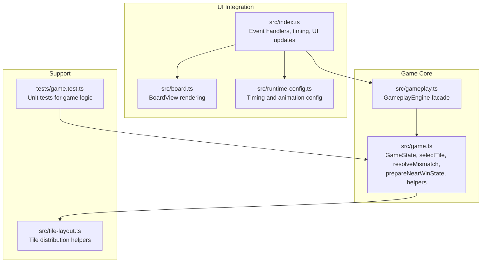
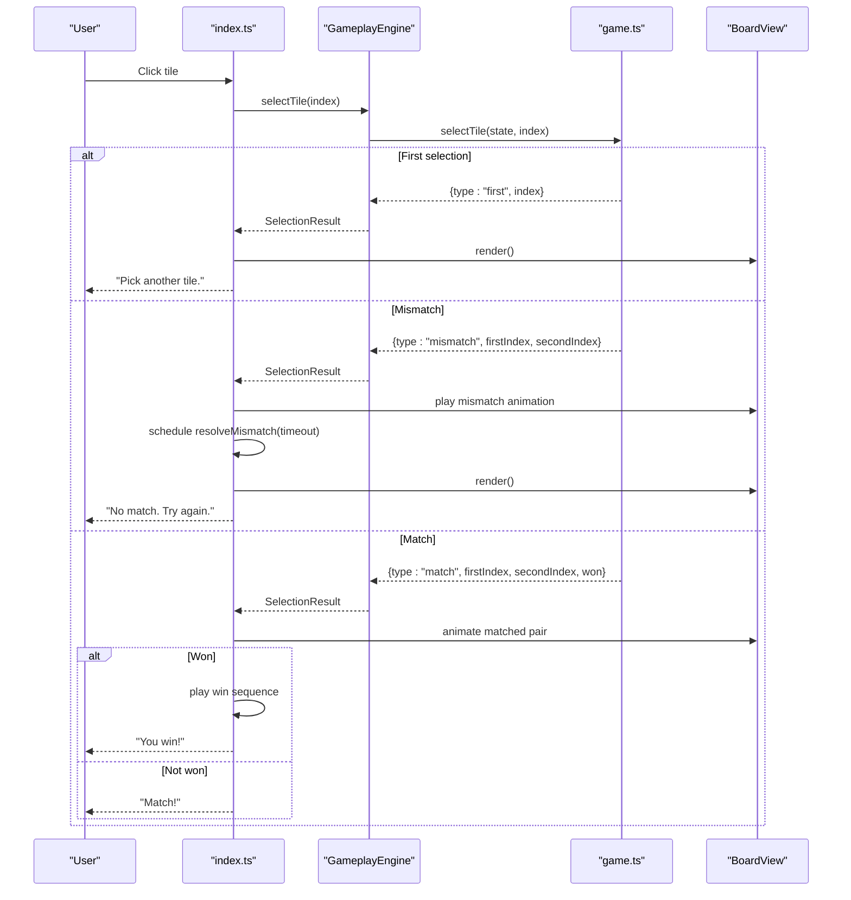
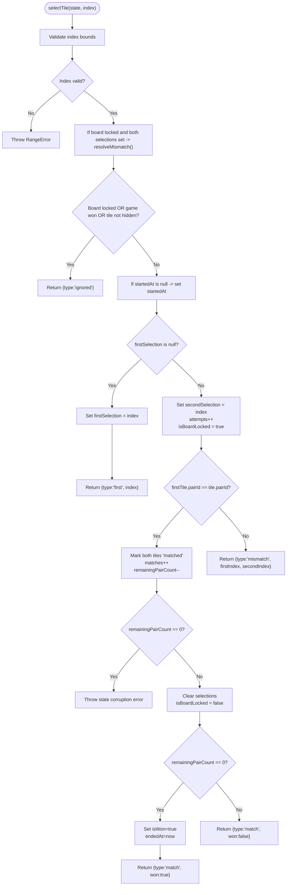
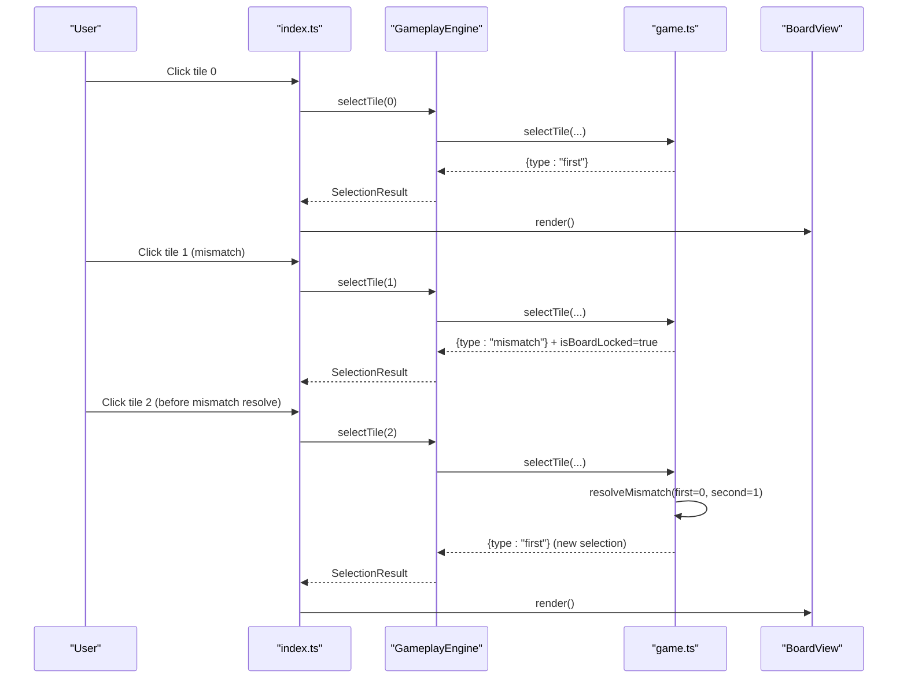
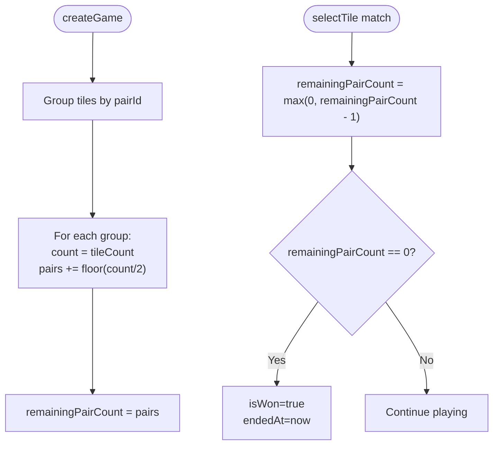
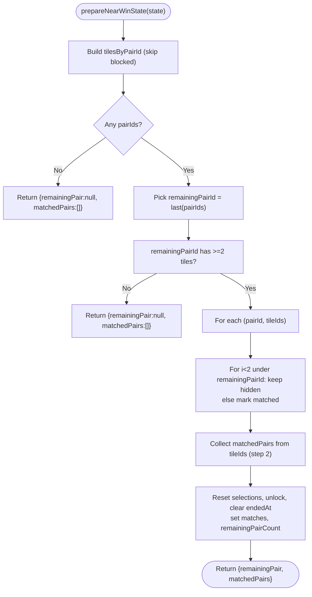
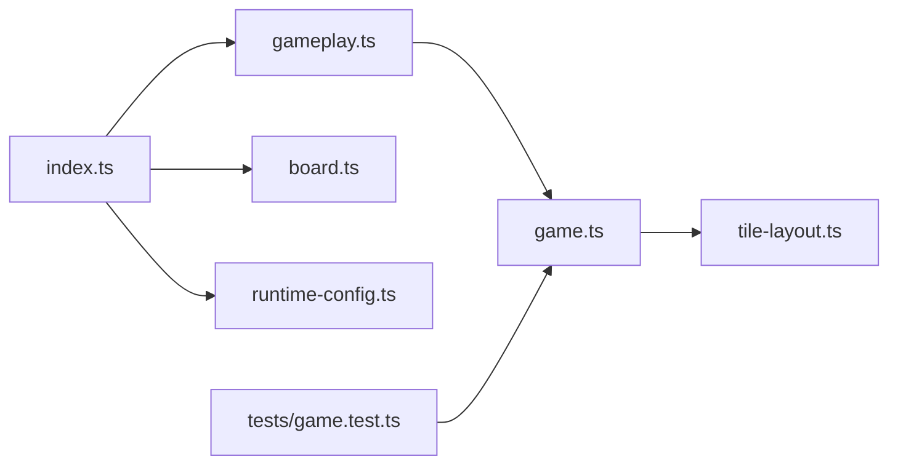

# Core Game Logic

<cite>
**Referenced Files in This Document**
- [game.ts](file://src/game.ts)
- [gameplay.ts](file://src/gameplay.ts)
- [index.ts](file://src/index.ts)
- [board.ts](file://src/board.ts)
- [runtime-config.ts](file://src/runtime-config.ts)
- [tile-layout.ts](file://src/tile-layout.ts)
- [game.test.ts](file://tests/game.test.ts)
</cite>

## Table of Contents
1. [Introduction](#introduction)
2. [Project Structure](#project-structure)
3. [Core Components](#core-components)
4. [Architecture Overview](#architecture-overview)
5. [Detailed Component Analysis](#detailed-component-analysis)
6. [Dependency Analysis](#dependency-analysis)
7. [Performance Considerations](#performance-considerations)
8. [Troubleshooting Guide](#troubleshooting-guide)
9. [Conclusion](#conclusion)

## Introduction
This document explains the core game logic implementation for tile matching, covering the selection algorithm, auto-resolve mechanism, win condition detection, near-win preparation, selection result types, orphaned tile handling, and performance optimizations. It is intended for developers and testers who need to understand how the game state is updated and validated during gameplay.

## Project Structure
The core game logic resides primarily in the game module, with orchestration in the gameplay facade and UI integration in the bootstrap layer. The board view renders the state, and runtime configuration controls timing parameters.

**Diagram sources**
- [game.ts:1-419](file://src/game.ts#L1-L419)
- [gameplay.ts:1-107](file://src/gameplay.ts#L1-L107)
- [index.ts:650-849](file://src/index.ts#L650-L849)
- [board.ts:1-523](file://src/board.ts#L1-L523)
- [runtime-config.ts:1-399](file://src/runtime-config.ts#L1-L399)
- [tile-layout.ts:1-53](file://src/tile-layout.ts#L1-L53)
- [game.test.ts:1-455](file://tests/game.test.ts#L1-L455)

**Section sources**
- [game.ts:1-419](file://src/game.ts#L1-L419)
- [gameplay.ts:1-107](file://src/gameplay.ts#L1-L107)
- [index.ts:650-849](file://src/index.ts#L650-L849)
- [board.ts:1-523](file://src/board.ts#L1-L523)
- [runtime-config.ts:1-399](file://src/runtime-config.ts#L1-L399)
- [tile-layout.ts:1-53](file://src/tile-layout.ts#L1-L53)
- [game.test.ts:1-455](file://tests/game.test.ts#L1-L455)

## Core Components
- GameState: Encapsulates board dimensions, tiles, matchable groups, remaining pair count, selection tracking, counters, and flags.
- Tile: Represents a single tile with id, pairId, icon, and status.
- SelectionResult: Union type describing outcomes of selectTile: ignored, first, match, mismatch.
- GameplayEngine: Thin facade around game functions for controlled access and testing.
- BoardView: Renders tiles and manages DOM state.
- Runtime configuration: Provides timing parameters for mismatch delays and animations.

Key responsibilities:
- Tile matching and state transitions in selectTile.
- Auto-resolve of mismatches to handle rapid successive clicks.
- Win condition via cached remaining pair count.
- Near-win preparation to expose only one pair for completion.
- Orphaned tile handling for decks with multiple copies of the same icon.
- Performance optimizations through cached calculations.

**Section sources**
- [game.ts:5-42](file://src/game.ts#L5-L42)
- [game.ts:44-48](file://src/game.ts#L44-L48)
- [gameplay.ts:28-41](file://src/gameplay.ts#L28-L41)
- [board.ts:8-11](file://src/board.ts#L8-L11)
- [runtime-config.ts:23-34](file://src/runtime-config.ts#L23-L34)

## Architecture Overview
The selection flow integrates UI events, game logic, and rendering. Mismatches trigger a delayed auto-resolve, and matches trigger animations and potential win conditions.

**Diagram sources**
- [index.ts:662-779](file://src/index.ts#L662-L779)
- [gameplay.ts:50-52](file://src/gameplay.ts#L50-L52)
- [game.ts:159-243](file://src/game.ts#L159-L243)
- [board.ts:331-354](file://src/board.ts#L331-L354)

## Detailed Component Analysis

### Tile Matching Algorithm in selectTile()
The selectTile function implements the core selection logic with explicit state transitions and validation.

Behavior overview:
- Bounds checking and tile presence validation.
- Auto-resolve: If a mismatch is still open (board locked with both selections set), resolve it immediately before processing the new selection.
- Locked board, won state, or non-hidden tiles are ignored.
- First selection: Sets firstSelection and returns first result.
- Second selection: Increments attempts, locks board, compares pairIds.
  - Match: Marks both tiles matched, decrements remainingPairCount, clears selections, unlocks board, checks win.
  - Mismatch: Returns mismatch result with indices.

**Diagram sources**
- [game.ts:159-243](file://src/game.ts#L159-L243)

**Section sources**
- [game.ts:159-243](file://src/game.ts#L159-L243)
- [game.test.ts:135-175](file://tests/game.test.ts#L135-L175)

### Auto-Resolve Mechanism for Rapid Successive Clicks
When a mismatch occurs, the board becomes locked with both selections set. If the user clicks again before the mismatch animation completes, selectTile auto-resolves the previous mismatch by hiding both revealed tiles and clearing selection state. This ensures subsequent selections behave predictably.

Implementation highlights:
- Auto-resolve triggers when isBoardLocked is true and both firstSelection and secondSelection are non-null.
- resolveMismatch resets statuses to hidden (if currently revealed), clears selections, and unlocks the board.

**Diagram sources**
- [game.ts:171-177](file://src/game.ts#L171-L177)
- [game.ts:245-264](file://src/game.ts#L245-L264)
- [index.ts:677-704](file://src/index.ts#L677-L704)

**Section sources**
- [game.ts:171-177](file://src/game.ts#L171-L177)
- [game.ts:245-264](file://src/game.ts#L245-L264)
- [index.ts:677-704](file://src/index.ts#L677-L704)
- [game.test.ts:135-175](file://tests/game.test.ts#L135-L175)

### Win Condition Detection and Remaining Pair Count
Win is determined by the cached remainingPairCount reaching zero. During creation, the initial value is computed from tile counts grouped by pairId, using integer division to account for orphaned tiles. On each successful match, the count is decremented atomically.

Key points:
- remainingPairCount is initialized in createGame by counting tiles per pairId and summing Math.floor(count / 2).
- On match, state invariant enforces remainingPairCount > 0; otherwise a corruption error is thrown.
- When remainingPairCount reaches zero, isWon is set and endedAt is recorded.

**Diagram sources**
- [game.ts:103-121](file://src/game.ts#L103-L121)
- [game.ts:208-228](file://src/game.ts#L208-L228)
- [game.ts:324-332](file://src/game.ts#L324-L332)

**Section sources**
- [game.ts:103-121](file://src/game.ts#L103-L121)
- [game.ts:208-228](file://src/game.ts#L208-L228)
- [game.ts:324-332](file://src/game.ts#L324-L332)
- [game.test.ts:354-453](file://tests/game.test.ts#L354-L453)

### Near-Win Preparation System in prepareNearWinState()
prepareNearWinState transforms the board into a near-win state by:
- Building a map from pairId to ordered tile IDs (excluding blocked tiles).
- Selecting the last pairId as the one remaining pair for the player to match.
- Pre-marking orphan tiles (extra copies beyond the first two) as matched to avoid blocking the win condition.
- Returning the remaining pair indices and matched pairs for UI presentation.

Behavioral guarantees:
- If no matchable tiles remain, returns null remaining pair.
- Handles boards where the last pairId has only one tile (no remaining pair).
- Skips missing tile entries referenced by tile ID gracefully.

**Diagram sources**
- [game.ts:334-418](file://src/game.ts#L334-L418)

**Section sources**
- [game.ts:334-418](file://src/game.ts#L334-L418)
- [game.test.ts:15-74](file://tests/game.test.ts#L15-L74)

### Selection Result Types and Behaviors
The SelectionResult union defines four outcomes:
- ignored: No-op when board is locked, game is won, or tile is not hidden.
- first: First tile in a pair attempt; sets firstSelection and returns index.
- match: Successful pair; marks tiles matched, increments matches, decrements remainingPairCount, clears selections, unlocks board, and indicates win if remainingPairCount reached zero.
- mismatch: Unsuccessful pair; returns indices and leaves board locked until auto-resolve.

UI and sound effects are driven by these results in the bootstrap layer.

**Section sources**
- [game.ts:44-48](file://src/game.ts#L44-L48)
- [index.ts:665-779](file://src/index.ts#L665-L779)
- [game.test.ts:77-175](file://tests/game.test.ts#L77-L175)

### Orphaned Tile Handling for Multi-Copy Decks
Decks may contain multiple copies of the same icon (tile multiplier > 1). During creation, pairId is derived from the first occurrence of each icon; later occurrences reuse the same pairId. The remaining pair count considers only complete pairs (Math.floor(count / 2)), leaving orphaned tiles unmatched. In near-win preparation, orphan tiles beyond the first two copies are pre-marked as matched to ensure the game remains solvable.

Validation and tests confirm:
- Odd-count groups produce orphaned tiles that are not counted toward remaining pairs.
- Near-win preparation handles last pairId with only one tile gracefully.
- Missing tile entries referenced by tile ID are skipped safely.

**Section sources**
- [game.ts:68-95](file://src/game.ts#L68-L95)
- [game.ts:103-121](file://src/game.ts#L103-L121)
- [game.ts:334-418](file://src/game.ts#L334-L418)
- [game.test.ts:369-412](file://tests/game.test.ts#L369-L412)
- [game.test.ts:48-59](file://tests/game.test.ts#L48-L59)

### Performance Optimizations Through Cached Calculations
Several optimizations improve runtime performance:
- O(1) win-condition checks via remainingPairCount cache initialized in createGame and decremented on each match.
- Lazy back-face rendering in BoardView to avoid repeated DOM work and image fetches for hidden tiles.
- Element-type validation short-circuit in BoardView to skip per-child overhead when DOM is unchanged.
- Timing scaling via runtime configuration to adjust delays based on animation speed and reduced motion preferences.

These measures collectively minimize CPU and DOM churn during gameplay.

**Section sources**
- [game.ts:26-32](file://src/game.ts#L26-L32)
- [game.ts:324-332](file://src/game.ts#L324-L332)
- [board.ts:259-273](file://src/board.ts#L259-L273)
- [board.ts:458-482](file://src/board.ts#L458-L482)
- [runtime-config.ts:295-321](file://src/runtime-config.ts#L295-L321)
- [index.ts:291-316](file://src/index.ts#L291-L316)

## Dependency Analysis
The core logic depends on:
- game.ts: Central state machine and algorithms.
- gameplay.ts: Controlled access to game functions via a facade.
- index.ts: Orchestrates UI, timing, and animations around game events.
- board.ts: Renders tiles and manages DOM state.
- runtime-config.ts: Supplies timing parameters affecting mismatch delays and animations.
- tile-layout.ts: Computes tile distribution and multipliers used to construct decks.

**Diagram sources**
- [index.ts:662-779](file://src/index.ts#L662-L779)
- [gameplay.ts:101-106](file://src/gameplay.ts#L101-L106)
- [game.ts:61-138](file://src/game.ts#L61-L138)
- [board.ts:121-306](file://src/board.ts#L121-L306)
- [runtime-config.ts:238-353](file://src/runtime-config.ts#L238-L353)
- [tile-layout.ts:36-53](file://src/tile-layout.ts#L36-L53)
- [game.test.ts:1-455](file://tests/game.test.ts#L1-L455)

**Section sources**
- [index.ts:662-779](file://src/index.ts#L662-L779)
- [gameplay.ts:101-106](file://src/gameplay.ts#L101-L106)
- [game.ts:61-138](file://src/game.ts#L61-L138)
- [board.ts:121-306](file://src/board.ts#L121-L306)
- [runtime-config.ts:238-353](file://src/runtime-config.ts#L238-L353)
- [tile-layout.ts:36-53](file://src/tile-layout.ts#L36-L53)
- [game.test.ts:1-455](file://tests/game.test.ts#L1-L455)

## Performance Considerations
- Use remainingPairCount cache for O(1) win checks instead of scanning the board.
- Minimize DOM work by lazily rendering back faces and caching element counts.
- Scale timing parameters by animation speed to avoid unnecessary delays for reduced-motion users.
- Avoid redundant state mutations; only update statuses and selections when necessary.

[No sources needed since this section provides general guidance]

## Troubleshooting Guide
Common issues and diagnostics:
- Out-of-bounds or missing tile errors: selectTile validates index bounds and tile presence, throwing RangeError for invalid inputs.
- State corruption: If remainingPairCount is zero when attempting a match, selectTile throws an error to catch bugs early.
- Mismatch auto-resolve: Rapid successive clicks are handled by resolving the previous mismatch before processing the new selection.
- Near-win preparation: Gracefully handles boards with no matchable tiles or last pairId with only one tile.

**Section sources**
- [game.ts:160-170](file://src/game.ts#L160-L170)
- [game.ts:213-217](file://src/game.ts#L213-L217)
- [game.ts:171-177](file://src/game.ts#L171-L177)
- [game.test.ts:88-120](file://tests/game.test.ts#L88-L120)
- [game.test.ts:122-133](file://tests/game.test.ts#L122-L133)
- [game.test.ts:48-59](file://tests/game.test.ts#L48-L59)

## Conclusion
The core game logic centers on a robust selection algorithm with auto-resolve for rapid clicks, efficient win detection via cached pair counts, and careful handling of orphaned tiles in multi-copy decks. The design balances correctness, performance, and user experience through clear state transitions, deterministic timing, and resilient preparation for near-win scenarios.