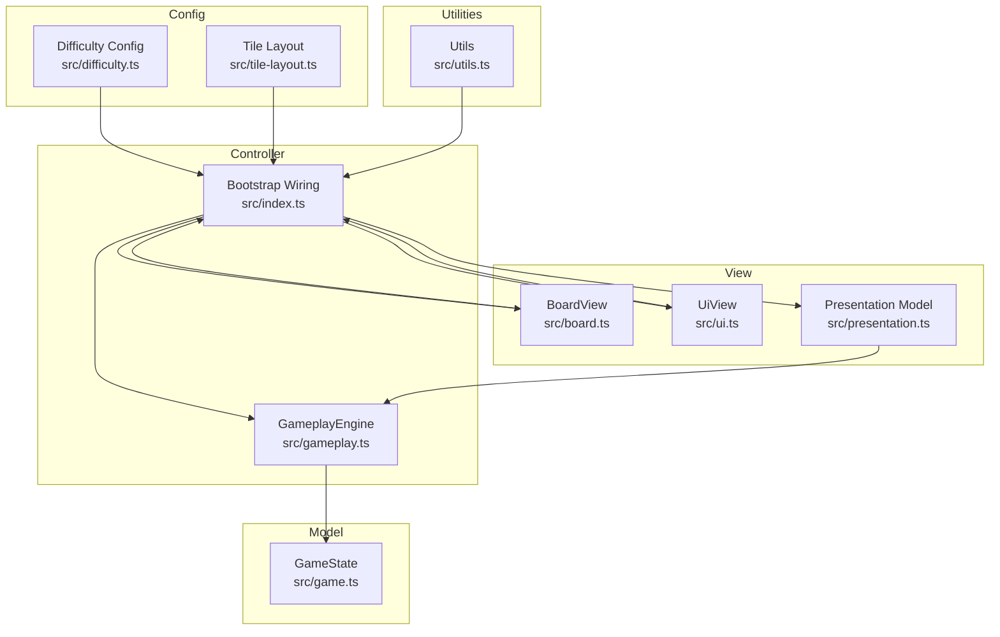
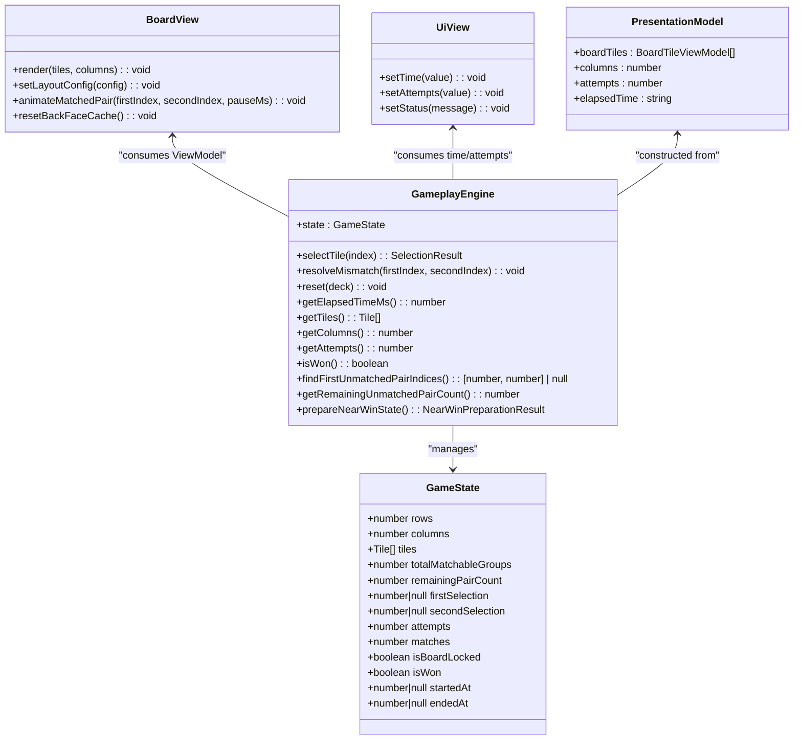
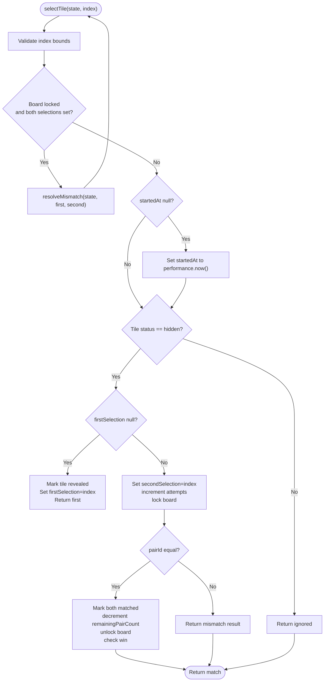
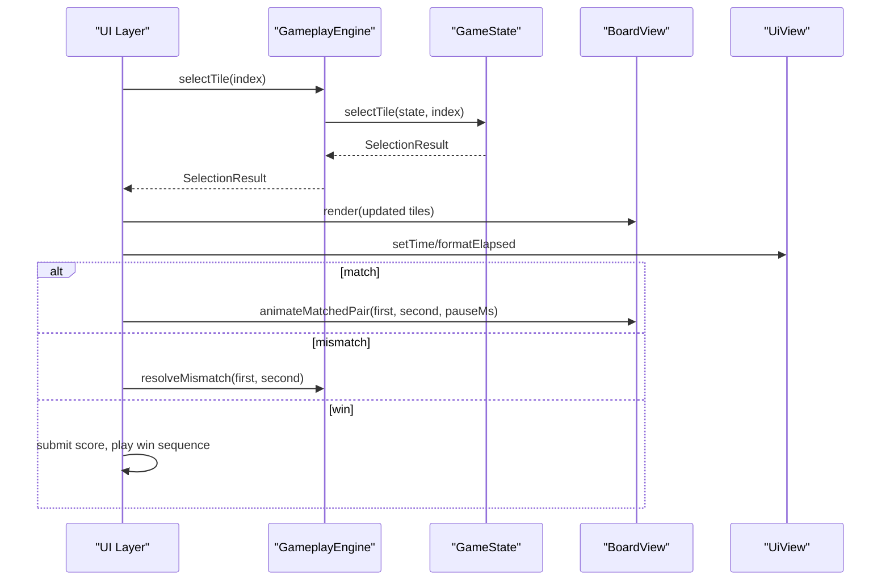
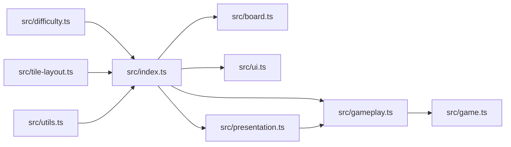

# Game Engine

<cite>
**Referenced Files in This Document**
- [README.md](file://README.md)
- [src/game.ts](file://src/game.ts)
- [src/gameplay.ts](file://src/gameplay.ts)
- [src/presentation.ts](file://src/presentation.ts)
- [src/board.ts](file://src/board.ts)
- [src/ui.ts](file://src/ui.ts)
- [src/index.ts](file://src/index.ts)
- [src/difficulty.ts](file://src/difficulty.ts)
- [src/tile-layout.ts](file://src/tile-layout.ts)
- [src/utils.ts](file://src/utils.ts)
- [tests/game.test.ts](file://tests/game.test.ts)
</cite>

## Table of Contents
1. [Introduction](#introduction)
2. [Project Structure](#project-structure)
3. [Core Components](#core-components)
4. [Architecture Overview](#architecture-overview)
5. [Detailed Component Analysis](#detailed-component-analysis)
6. [Dependency Analysis](#dependency-analysis)
7. [Performance Considerations](#performance-considerations)
8. [Troubleshooting Guide](#troubleshooting-guide)
9. [Conclusion](#conclusion)

## Introduction
This document describes the core game engine architecture for MEMORYBLOX, focusing on the Model-View-Controller (MVC) pattern and related design patterns used in the system. The Model is implemented by GameState and game state management functions, the Controller is implemented by GameplayEngine and the bootstrap wiring in the application entry point, and the View is implemented by BoardView and UiView. The document also covers difficulty configuration, event-driven communication, and the factory and strategy patterns used for game instance creation and difficulty handling.

## Project Structure
The game engine resides primarily in the src/ directory with clear separation of concerns:
- Model: GameState and state mutation functions in src/game.ts
- Controller: GameplayEngine facade and bootstrap wiring in src/gameplay.ts and src/index.ts
- View: Board rendering and UI display in src/board.ts and src/ui.ts
- Configuration: Difficulty presets and tile layout computation in src/difficulty.ts and src/tile-layout.ts
- Presentation: ViewModel composition in src/presentation.ts
- Utilities: Shared helpers in src/utils.ts

**Diagram sources**
- [src/game.ts:12-42](file://src/game.ts#L12-L42)
- [src/gameplay.ts:28-107](file://src/gameplay.ts#L28-L107)
- [src/index.ts:815-816](file://src/index.ts#L815-L816)
- [src/board.ts:121-523](file://src/board.ts#L121-L523)
- [src/ui.ts:15-49](file://src/ui.ts#L15-L49)
- [src/presentation.ts:12-25](file://src/presentation.ts#L12-L25)
- [src/difficulty.ts:9-40](file://src/difficulty.ts#L9-L40)
- [src/tile-layout.ts:12-54](file://src/tile-layout.ts#L12-L54)
- [src/utils.ts:1-145](file://src/utils.ts#L1-L145)

**Section sources**
- [README.md:162-206](file://README.md#L162-L206)

## Core Components
- GameState: Immutable-like state record containing board dimensions, tiles, matchable groups, pair counts, selection state, counters, and timestamps. It is the authoritative model for game state.
- GameplayEngine: A facade interface and default implementation that encapsulates GameState and exposes a typed API for external consumers. It delegates to free functions in game.ts.
- BoardView: A view component responsible for rendering tiles and handling tile selection events. It translates ViewModel data into DOM updates.
- UiView: A simple view component for HUD updates (time, attempts, status).
- Presentation Model: A lightweight ViewModel composed from GameplayEngine state for rendering.

Key responsibilities:
- Model: Enforce game rules, track win conditions, manage move counters, and maintain board state.
- Controller: Coordinate user interactions, orchestrate animations, and manage game lifecycle.
- View: Render tiles and HUD, and propagate user actions to the controller.

**Section sources**
- [src/game.ts:12-42](file://src/game.ts#L12-L42)
- [src/gameplay.ts:28-107](file://src/gameplay.ts#L28-L107)
- [src/board.ts:121-523](file://src/board.ts#L121-L523)
- [src/ui.ts:15-49](file://src/ui.ts#L15-L49)
- [src/presentation.ts:12-25](file://src/presentation.ts#L12-L25)

## Architecture Overview
The system follows an MVC pattern with clear boundaries:
- Model: GameState and game state functions define the domain model and rules.
- Controller: GameplayEngine and bootstrap wiring coordinate interactions and orchestrate UI updates.
- View: BoardView renders tiles and UiView updates HUD elements.

**Diagram sources**
- [src/game.ts:12-42](file://src/game.ts#L12-L42)
- [src/gameplay.ts:28-107](file://src/gameplay.ts#L28-L107)
- [src/board.ts:121-523](file://src/board.ts#L121-L523)
- [src/ui.ts:15-49](file://src/ui.ts#L15-L49)
- [src/presentation.ts:5-25](file://src/presentation.ts#L5-L25)

## Detailed Component Analysis

### Model: GameState and Game Rules
The Model defines the complete game state and the core logic for tile selection, matching, and win condition detection. It includes:
- Tile representation with id, pairId, icon, and status
- Board metadata (rows, columns)
- Matchable group and pair counts for efficient win detection
- Selection tracking and board lock state
- Timing and counters for attempts and matches
- Methods for selection, mismatch resolution, near-win preparation, and reset

Key behaviors:
- Pair matching: Two tiles with equal pairId constitute a match; matched tiles are removed from future matching consideration
- Win condition: Achieved when remainingPairCount reaches zero
- Auto-resolve: When a mismatch is still open, subsequent selections auto-resolve the mismatch before processing the new selection
- Near-win preparation: Pre-mark tiles to create a scenario where only one pair remains to be matched

**Diagram sources**
- [src/game.ts:159-243](file://src/game.ts#L159-L243)
- [src/game.ts:245-264](file://src/game.ts#L245-L264)

**Section sources**
- [src/game.ts:12-42](file://src/game.ts#L12-L42)
- [src/game.ts:159-243](file://src/game.ts#L159-L243)
- [src/game.ts:245-264](file://src/game.ts#L245-L264)
- [src/game.ts:334-418](file://src/game.ts#L334-L418)

### Controller: GameplayEngine and Bootstrap Wiring
The Controller layer provides a facade over the Model and coordinates UI updates and game lifecycle:
- GameplayEngine facade: Encapsulates GameState and exposes a typed API for external consumers
- Bootstrap wiring: Orchestrates tile selection, mismatch resolution, win handling, and UI updates

Design patterns:
- Facade pattern: GameplayEngine provides a simplified interface to the underlying game state functions
- Factory pattern: createGameplayEngine constructs a GameplayEngine instance with a newly created GameState
- Strategy pattern: DifficultyConfig centralizes difficulty presets; tile layout computation adapts to difficulty and tile multiplier

**Diagram sources**
- [src/gameplay.ts:28-107](file://src/gameplay.ts#L28-L107)
- [src/index.ts:639-780](file://src/index.ts#L639-L780)
- [src/board.ts:331-354](file://src/board.ts#L331-L354)

**Section sources**
- [src/gameplay.ts:28-107](file://src/gameplay.ts#L28-L107)
- [src/index.ts:639-780](file://src/index.ts#L639-L780)
- [src/difficulty.ts:9-40](file://src/difficulty.ts#L9-L40)
- [src/tile-layout.ts:36-53](file://src/tile-layout.ts#L36-L53)

### View: BoardView and UiView
The View layer handles rendering and user interaction:
- BoardView: Renders tiles, manages layout, handles tile selection events, and animates matched pairs
- UiView: Updates HUD elements for time, attempts, and status messages

Event-driven communication:
- BoardView listens for click and keyboard events and invokes a TileSelectHandler callback
- The bootstrap layer wires BoardView to the controller’s tile selection handler
- UiView is updated by the bootstrap layer on each render cycle

Accessibility and performance:
- Lazy rendering of tile back faces to avoid unnecessary DOM work
- Efficient DOM rebuilding with validation to minimize churn
- Keyboard navigation support for tile selection

**Section sources**
- [src/board.ts:121-523](file://src/board.ts#L121-L523)
- [src/ui.ts:15-49](file://src/ui.ts#L15-L49)
- [src/index.ts:815-816](file://src/index.ts#L815-L816)

### Presentation Layer
The Presentation layer composes a lightweight ViewModel for rendering:
- createGamePresentationModel builds a GamePresentationModel from GameplayEngine state
- Provides boardTiles mapped from Tile to BoardTileViewModel, columns, attempts, and formatted elapsed time

**Section sources**
- [src/presentation.ts:12-25](file://src/presentation.ts#L12-L25)
- [src/utils.ts:44-58](file://src/utils.ts#L44-L58)

### Difficulty Configuration and Strategy Pattern
Difficulty presets are centralized in DifficultyConfig:
- Easy, Normal, Hard presets with rows, columns, and score multipliers
- Default difficulty ID and debug difficulty for development
- Lookup by ID returns null when not found

Strategy pattern:
- The bootstrap layer selects difficulty and computes tile layout based on difficulty and tile multiplier
- Tile layout computation distributes tiles into multi-set and pair-set categories

**Section sources**
- [src/difficulty.ts:9-40](file://src/difficulty.ts#L9-L40)
- [src/tile-layout.ts:12-54](file://src/tile-layout.ts#L12-L54)
- [src/index.ts:444-457](file://src/index.ts#L444-L457)

### Undo/Redo Functionality
The codebase does not implement explicit undo/redo functionality. The closest mechanism is mismatch auto-resolution and near-win preparation, which alter state but are not reversible by design. If undo/redo is desired, it would require:
- Maintaining a history of state snapshots
- Implementing state diffing or serialization
- Adding UI controls and command handlers

[No sources needed since this section provides general guidance]

## Dependency Analysis
The following diagram shows key dependencies among core components:

**Diagram sources**
- [src/index.ts:1-1100](file://src/index.ts#L1-L1100)
- [src/gameplay.ts:1-107](file://src/gameplay.ts#L1-L107)
- [src/game.ts:1-419](file://src/game.ts#L1-L419)
- [src/board.ts:1-523](file://src/board.ts#L1-L523)
- [src/ui.ts:1-49](file://src/ui.ts#L1-L49)
- [src/presentation.ts:1-25](file://src/presentation.ts#L1-L25)
- [src/difficulty.ts:1-40](file://src/difficulty.ts#L1-L40)
- [src/tile-layout.ts:1-54](file://src/tile-layout.ts#L1-L54)
- [src/utils.ts:1-145](file://src/utils.ts#L1-L145)

**Section sources**
- [src/index.ts:1-1100](file://src/index.ts#L1-L1100)

## Performance Considerations
- O(1) win condition checks: remainingPairCount is decremented on each successful match, enabling constant-time win detection
- Lazy rendering: Back-face icons are rendered only when tiles become revealed or matched, reducing DOM work and image fetches
- Efficient DOM management: Validation and caching minimize rebuilds and element-type checks
- Animation timers: Matched pair animations use timers that are cleared appropriately to avoid leaks
- Time formatting: Elapsed time is computed using performance.now() with clamping to prevent negative displays

[No sources needed since this section provides general guidance]

## Troubleshooting Guide
Common issues and remedies:
- Out-of-bounds tile selection: selectTile throws RangeError for invalid indices; ensure index is within [0, tiles.length)
- State corruption: selectTile throws when attempting to match a pair when remainingPairCount is zero; indicates duplicate match or corrupted state
- Deck size mismatch: createGame throws when deck length does not match rows × columns
- Odd matchable tile count: createGame throws when matchable tiles are odd; ensure even number of non-blocked tiles
- Mismatch auto-resolution: Rapid successive selections after a mismatch are auto-resolved; verify UI expectations for board lock state

Validation and tests:
- Comprehensive unit tests cover edge cases for selectTile, resolveMismatch, resetGame, and near-win preparation
- Tests simulate performance.now() and verify elapsed time formatting and HUD updates

**Section sources**
- [src/game.ts:159-243](file://src/game.ts#L159-L243)
- [src/game.ts:245-264](file://src/game.ts#L245-L264)
- [tests/game.test.ts:1-455](file://tests/game.test.ts#L1-L455)

## Conclusion
The MEMORYBLOX game engine implements a clean MVC architecture with a robust Model (GameState), a facade-based Controller (GameplayEngine), and dedicated View components (BoardView and UiView). The system leverages design patterns including facade, factory, and strategy to provide a maintainable and extensible foundation. Game state management ensures efficient win detection, event-driven UI updates, and accessibility-friendly rendering. While undo/redo is not currently implemented, the architecture supports adding such features through state history mechanisms.