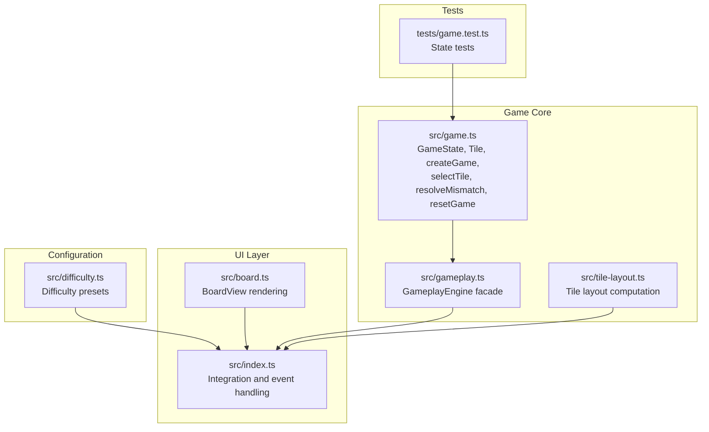
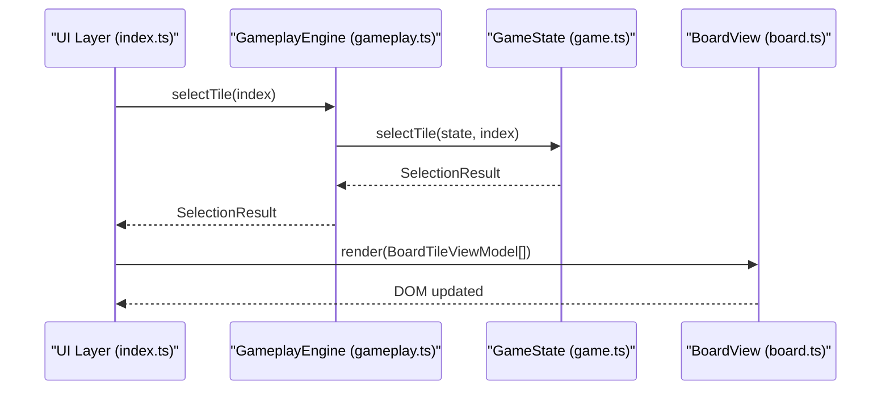
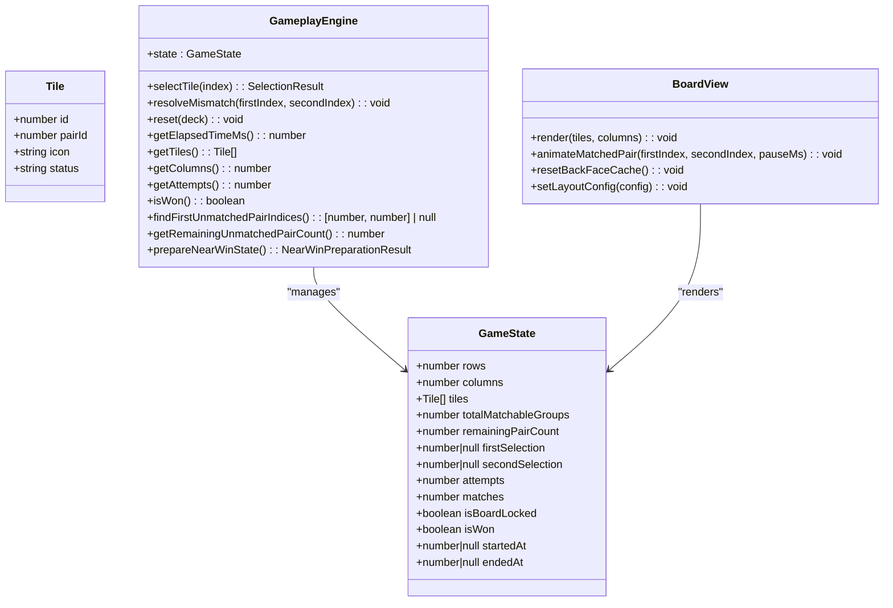
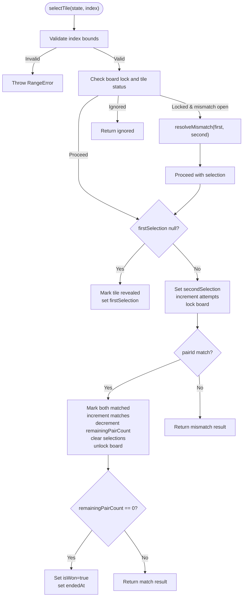
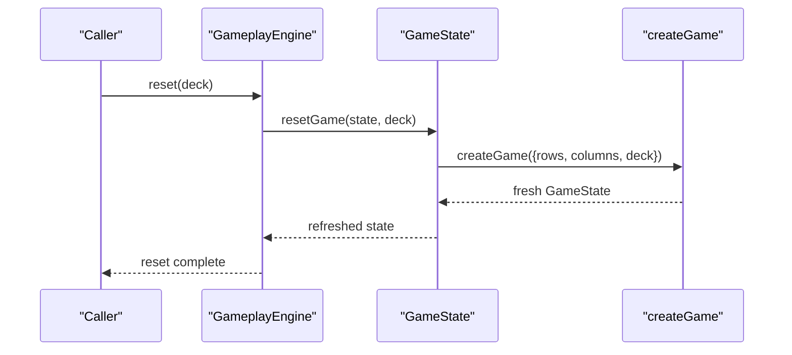
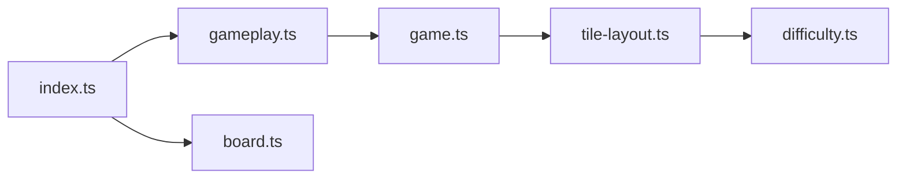

# Game State Management

<cite>
**Referenced Files in This Document**
- [game.ts](file://src/game.ts)
- [gameplay.ts](file://src/gameplay.ts)
- [board.ts](file://src/board.ts)
- [tile-layout.ts](file://src/tile-layout.ts)
- [difficulty.ts](file://src/difficulty.ts)
- [index.ts](file://src/index.ts)
- [game.test.ts](file://tests/game.test.ts)
</cite>

## Table of Contents
1. [Introduction](#introduction)
2. [Project Structure](#project-structure)
3. [Core Components](#core-components)
4. [Architecture Overview](#architecture-overview)
5. [Detailed Component Analysis](#detailed-component-analysis)
6. [Dependency Analysis](#dependency-analysis)
7. [Performance Considerations](#performance-considerations)
8. [Troubleshooting Guide](#troubleshooting-guide)
9. [Conclusion](#conclusion)

## Introduction
This document explains the game state management system for the memory card matching game. It covers the GameState interface, Tile model, initialization via createGame(), state mutation functions (selectTile(), resolveMismatch(), resetGame()), validation rules, boundary checking, error handling, and the cached remaining pair count optimization used for efficient win condition detection.

## Project Structure
The game state management is implemented in a dedicated module and integrated with the UI rendering and gameplay orchestration layers.

**Diagram sources**
- [game.ts:1-419](file://src/game.ts#L1-L419)
- [gameplay.ts:1-107](file://src/gameplay.ts#L1-L107)
- [board.ts:1-523](file://src/board.ts#L1-L523)
- [tile-layout.ts:1-54](file://src/tile-layout.ts#L1-L54)
- [difficulty.ts:1-40](file://src/difficulty.ts#L1-L40)
- [index.ts:1-200](file://src/index.ts#L1-L200)
- [game.test.ts:1-455](file://tests/game.test.ts#L1-L455)

**Section sources**
- [game.ts:1-419](file://src/game.ts#L1-L419)
- [gameplay.ts:1-107](file://src/gameplay.ts#L1-L107)
- [board.ts:1-523](file://src/board.ts#L1-L523)
- [tile-layout.ts:1-54](file://src/tile-layout.ts#L1-L54)
- [difficulty.ts:1-40](file://src/difficulty.ts#L1-L40)
- [index.ts:1-200](file://src/index.ts#L1-L200)
- [game.test.ts:1-455](file://tests/game.test.ts#L1-L455)

## Core Components
- GameState: Immutable-like record containing board dimensions, tile array, matchable group metadata, pair counts, selection pointers, counters, locks, win state, and timestamps.
- Tile: Immutable-like record representing a single tile with id, pairId, icon, and status.
- createGame(): Factory that builds a GameState from difficulty and deck, validates constraints, assigns pairIds, and initializes the cached remaining pair count.
- selectTile(): Mutates state for tile selection, handles mismatches, auto-resolves prior mismatches, updates counters, and detects wins.
- resolveMismatch(): Reverts previously revealed tiles to hidden and clears board lock.
- resetGame(): Recreates the game with a new deck while preserving board dimensions.
- GameplayEngine: Thin facade around state functions for controlled access and testability.

**Section sources**
- [game.ts:5-42](file://src/game.ts#L5-L42)
- [game.ts:61-138](file://src/game.ts#L61-L138)
- [game.ts:159-243](file://src/game.ts#L159-L243)
- [game.ts:245-264](file://src/game.ts#L245-L264)
- [game.ts:266-278](file://src/game.ts#L266-L278)
- [gameplay.ts:28-41](file://src/gameplay.ts#L28-L41)

## Architecture Overview
The state management layer is decoupled from UI concerns. The GameplayEngine exposes a typed interface to the rest of the application, while BoardView renders the current state independently.

**Diagram sources**
- [index.ts:639-714](file://src/index.ts#L639-L714)
- [gameplay.ts:50-52](file://src/gameplay.ts#L50-L52)
- [game.ts:159-243](file://src/game.ts#L159-L243)
- [board.ts:227-306](file://src/board.ts#L227-L306)

## Detailed Component Analysis

### GameState and Tile Interfaces
- Tile fields:
  - id: numeric index within the tiles array
  - pairId: integer grouping multiple copies of the same icon
  - icon: string token for the tile’s visual representation
  - status: one of hidden, revealed, matched, blocked
- GameState fields:
  - rows, columns: board dimensions
  - tiles: array of Tile
  - totalMatchableGroups: distinct icon groups (not total pairs)
  - remainingPairCount: cached count of remaining matchable pairs (O(1) win check)
  - firstSelection, secondSelection: indices of currently selected tiles
  - attempts: number of mismatch attempts
  - matches: number of matched pairs
  - isBoardLocked: prevents further selections during mismatch reveal
  - isWon: indicates completion
  - startedAt, endedAt: timestamps for elapsed time calculation

Validation and initialization:
- Deck size must match rows × columns.
- Matchable tile count must be even (after excluding blocked tiles).
- pairIds are assigned per unique icon; blocked tiles use a special sentinel.

Cached remaining pair count:
- Computed by counting tiles per pairId and summing floor(count/2).
- Decremented on each successful match; used for O(1) win detection.

**Section sources**
- [game.ts:1-42](file://src/game.ts#L1-L42)
- [game.ts:61-138](file://src/game.ts#L61-L138)
- [game.ts:324-332](file://src/game.ts#L324-L332)

### Tile Status Enumeration and Blocked Tiles
- Status values: hidden, revealed, matched, blocked
- Blocked tiles are inert and do not participate in matches; they are excluded from pair counts and win conditions.
- Blocked tile token is recognized during creation to mark tiles as blocked.

**Section sources**
- [game.ts:1](file://src/game.ts#L1)
- [game.ts:3](file://src/game.ts#L3)
- [game.ts:71-79](file://src/game.ts#L71-L79)
- [game.ts:97-101](file://src/game.ts#L97-L101)

### Factory Function: createGame()
Responsibilities:
- Validate deck length equals tileCount.
- Assign pairIds to icons and compute totalMatchableGroups.
- Mark blocked tiles and exclude them from matchable counts.
- Compute initial remainingPairCount by pairing tiles per pairId.
- Initialize selection pointers, counters, and timestamps.

Error handling:
- Throws when deck size mismatch or odd matchable tile count.

**Section sources**
- [game.ts:61-138](file://src/game.ts#L61-L138)

### State Mutation: selectTile()
Behavior:
- Boundary checks: throws RangeError for invalid index or missing tile entry.
- Auto-resolve: if board is locked with both selections set, resolves mismatch before proceeding.
- Ignore conditions: locked board, already revealed/matched, or completed game.
- First selection: marks tile revealed, sets firstSelection.
- Second selection: increments attempts, locks board, compares pairIds.
- Match: marks both tiles matched, increments matches, decrements remainingPairCount, clears selections, unlocks board; if remainingPairCount reaches zero, sets isWon and endedAt.
- Mismatch: returns mismatch result; board remains locked until auto-resolution.

Invariant checks:
- Throws if remainingPairCount is zero when attempting a match (detects corruption).

Timing:
- startedAt is set on first selection.

**Section sources**
- [game.ts:159-243](file://src/game.ts#L159-L243)

### State Mutation: resolveMismatch()
Behavior:
- Reverts both selected tiles to hidden if they are revealed.
- Clears selections and unlocks board.

**Section sources**
- [game.ts:245-264](file://src/game.ts#L245-L264)

### State Mutation: resetGame()
Behavior:
- Validates new deck size equals current board size.
- Recreates state using createGame() with new deck.
- Overwrites current state with refreshed state.

**Section sources**
- [game.ts:266-278](file://src/game.ts#L266-L278)

### Cached Remaining Pair Count Optimization
Purpose:
- Track the number of remaining matchable pairs to detect win condition in O(1) time.
- Decrement on each successful match; reset during near-win preparation.

Usage:
- Exposed via getRemainingUnmatchedPairCount().
- Used by UI and scoring logic to reflect progress.

**Section sources**
- [game.ts:26-32](file://src/game.ts#L26-L32)
- [game.ts:324-332](file://src/game.ts#L324-L332)
- [game.ts:334-418](file://src/game.ts#L334-L418)

### Win Condition Detection
- Win occurs when remainingPairCount reaches zero after a successful match.
- The system ensures remainingPairCount never goes below zero during normal play.

**Section sources**
- [game.ts:213-229](file://src/game.ts#L213-L229)

### Near-Win Preparation (prepareNearWinState)
Purpose:
- Prepares a state where only one pair remains unmatched for demonstration or testing.
- Marks orphan tiles (extra copies beyond the first two) as matched to avoid blocking the win condition.
- Returns the remaining pair indices and matched pairs for UI feedback.

**Section sources**
- [game.ts:334-418](file://src/game.ts#L334-L418)

### UI Integration and Rendering
- BoardView consumes BoardTileViewModel derived from GameState tiles and renders tile faces, animations, and accessibility attributes.
- The integration layer (index.ts) calls GameplayEngine methods and triggers BoardView.render().

**Section sources**
- [board.ts:8-11](file://src/board.ts#L8-L11)
- [board.ts:227-306](file://src/board.ts#L227-L306)
- [index.ts:639-714](file://src/index.ts#L639-L714)

## Architecture Overview

**Diagram sources**
- [game.ts:5-42](file://src/game.ts#L5-L42)
- [gameplay.ts:28-41](file://src/gameplay.ts#L28-L41)
- [board.ts:121-523](file://src/board.ts#L121-L523)

## Detailed Component Analysis

### Tile Selection Flow

**Diagram sources**
- [game.ts:159-243](file://src/game.ts#L159-L243)
- [game.ts:245-264](file://src/game.ts#L245-L264)

### Reset Game Flow

**Diagram sources**
- [game.ts:266-278](file://src/game.ts#L266-L278)
- [game.ts:61-138](file://src/game.ts#L61-L138)

## Dependency Analysis
- GameplayEngine depends on free functions in game.ts for state mutations.
- BoardView reads from BoardTileViewModel derived from GameState.
- index.ts orchestrates UI events and delegates to GameplayEngine.
- tile-layout.ts computes tile distribution based on difficulty and multiplier.
- difficulty.ts defines board sizes and score multipliers.

**Diagram sources**
- [index.ts:1-200](file://src/index.ts#L1-L200)
- [gameplay.ts:1-107](file://src/gameplay.ts#L1-L107)
- [game.ts:1-419](file://src/game.ts#L1-L419)
- [tile-layout.ts:1-54](file://src/tile-layout.ts#L1-L54)
- [difficulty.ts:1-40](file://src/difficulty.ts#L1-L40)
- [board.ts:1-523](file://src/board.ts#L1-L523)

**Section sources**
- [index.ts:1-200](file://src/index.ts#L1-L200)
- [gameplay.ts:1-107](file://src/gameplay.ts#L1-L107)
- [game.ts:1-419](file://src/game.ts#L1-L419)
- [tile-layout.ts:1-54](file://src/tile-layout.ts#L1-L54)
- [difficulty.ts:1-40](file://src/difficulty.ts#L1-L40)
- [board.ts:1-523](file://src/board.ts#L1-L523)

## Performance Considerations
- Cached remaining pair count: O(1) win detection by decrementing on matches.
- Lazy back-face rendering in BoardView reduces DOM work and image fetches for hidden tiles.
- Efficient tile layout computation minimizes setup overhead.

[No sources needed since this section provides general guidance]

## Troubleshooting Guide
Common issues and resolutions:
- Out-of-bounds selection: selectTile() throws RangeError for invalid indices or missing entries.
- State corruption: selectTile() throws when attempting to match when remainingPairCount is zero.
- Odd matchable tile count: createGame() throws if matchable tiles are odd after excluding blocked tiles.
- Deck size mismatch: createGame() and resetGame() throw if deck length does not match board size.
- Mismatch auto-resolve: Rapid successive selections trigger automatic resolution of prior mismatch before processing the new selection.

**Section sources**
- [game.ts:159-170](file://src/game.ts#L159-L170)
- [game.ts:213-217](file://src/game.ts#L213-L217)
- [game.ts:97-101](file://src/game.ts#L97-L101)
- [game.ts:267-269](file://src/game.ts#L267-L269)
- [game.test.ts:88-120](file://tests/game.test.ts#L88-L120)
- [game.test.ts:122-133](file://tests/game.test.ts#L122-L133)
- [game.test.ts:243-251](file://tests/game.test.ts#L243-L251)

## Conclusion
The game state management system provides a robust, validated, and optimized foundation for the memory card game. It enforces invariants, offers O(1) win detection via a cached pair count, and cleanly separates state logic from UI rendering. The factory and facade patterns enable testability and maintainable integration with the broader application.