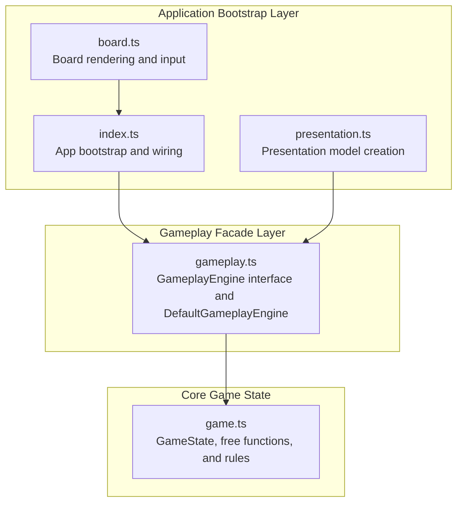
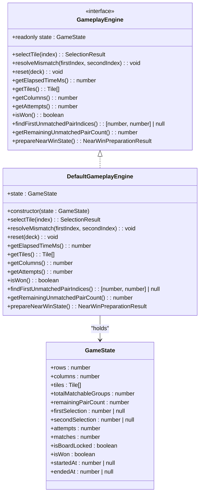
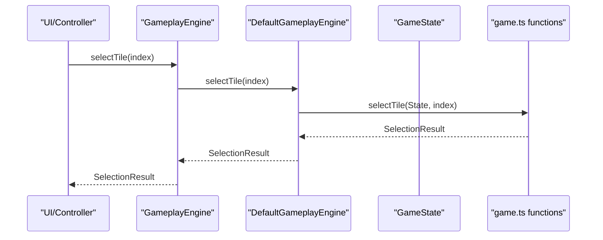
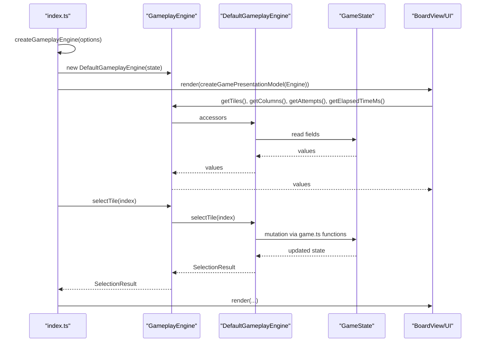
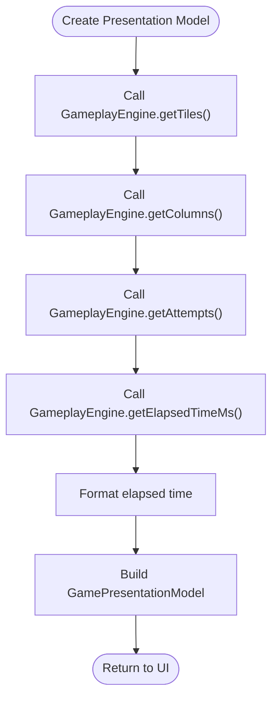
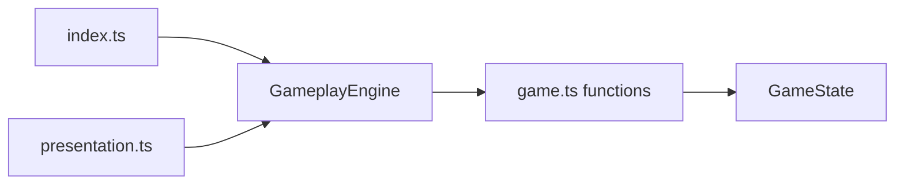

# Gameplay Facade

<cite>
**Referenced Files in This Document**
- [gameplay.ts](file://src/gameplay.ts)
- [game.ts](file://src/game.ts)
- [index.ts](file://src/index.ts)
- [presentation.ts](file://src/presentation.ts)
- [board.ts](file://src/board.ts)
- [gameplay.test.ts](file://tests/gameplay.test.ts)
</cite>

## Table of Contents
1. [Introduction](#introduction)
2. [Project Structure](#project-structure)
3. [Core Components](#core-components)
4. [Architecture Overview](#architecture-overview)
5. [Detailed Component Analysis](#detailed-component-analysis)
6. [Dependency Analysis](#dependency-analysis)
7. [Performance Considerations](#performance-considerations)
8. [Troubleshooting Guide](#troubleshooting-guide)
9. [Conclusion](#conclusion)

## Introduction
This document explains the gameplay facade pattern implementation that provides a simplified interface for external components to interact with the game engine. The facade encapsulates complex game operations while hiding internal state management details. It enables reduced coupling, easier testing, and a cleaner external API design by exposing a typed interface that consumers can rely on without depending on the internal state representation.

## Project Structure
The gameplay facade sits at the boundary between the application bootstrap layer and the core game state module. It exposes a clean interface to higher-level components such as the UI and controllers, while delegating all operations to the underlying game state functions.

**Diagram sources**
- [index.ts:1-1100](file://src/index.ts#L1-L1100)
- [presentation.ts:1-25](file://src/presentation.ts#L1-L25)
- [board.ts:1-523](file://src/board.ts#L1-L523)
- [gameplay.ts:1-107](file://src/gameplay.ts#L1-L107)
- [game.ts:1-419](file://src/game.ts#L1-L419)

**Section sources**
- [gameplay.ts:1-107](file://src/gameplay.ts#L1-L107)
- [game.ts:1-419](file://src/game.ts#L1-L419)
- [index.ts:1-1100](file://src/index.ts#L1-L1100)
- [presentation.ts:1-25](file://src/presentation.ts#L1-L25)
- [board.ts:1-523](file://src/board.ts#L1-L523)

## Core Components
- GameplayEngine interface: Defines the external API surface for game operations. It exposes read-only state and methods for tile selection, mismatch resolution, resetting the game, and querying game metadata such as elapsed time, tiles, columns, attempts, win state, unmatched pair indices, remaining pair count, and near-win preparation.
- DefaultGameplayEngine: Implements the GameplayEngine interface by holding a GameState instance and delegating all operations to the free functions in game.ts. It ensures consumers interact with a typed API rather than mutating the state record directly.
- createGameplayEngine: Factory function that constructs a DefaultGameplayEngine with a newly created GameState based on provided options (rows, columns, deck). This factory acts as a seam for unit testing by allowing substitution of mocks or stubs.

Benefits of the facade:
- Reduced coupling: Consumers depend on the GameplayEngine interface rather than the internal GameState structure.
- Easier testing: The bootstrap layer (index.ts) can be unit-tested by substituting a mock GameplayEngine implementation.
- Cleaner external API: Encapsulates GameState so consumers interact through a stable, typed façade.

**Section sources**
- [gameplay.ts:28-107](file://src/gameplay.ts#L28-L107)
- [game.ts:12-42](file://src/game.ts#L12-L42)

## Architecture Overview
The facade pattern creates a controlled boundary around the core game state. External components call into the GameplayEngine, which delegates to the game state functions. This separation ensures that UI and controller logic remain decoupled from the internal state representation.

**Diagram sources**
- [gameplay.ts:28-93](file://src/gameplay.ts#L28-L93)
- [game.ts:12-42](file://src/game.ts#L12-L42)

## Detailed Component Analysis

### GameplayEngine Interface and DefaultGameplayEngine Implementation
The GameplayEngine interface defines a minimal, stable API surface that external components can rely on. DefaultGameplayEngine implements this interface by holding a GameState instance and delegating each method to the corresponding free function in game.ts. This design ensures that:
- Consumers interact with a typed API rather than mutating the state record directly.
- The JIT can inline the delegation, resulting in negligible runtime overhead.
- The bootstrap layer (index.ts) can be unit-tested by substituting a mock GameplayEngine implementation.

Facade methods and their relationships to underlying game state functions:
- selectTile(index): Delegates to selectTile(state, index) to process tile selection and return a SelectionResult.
- resolveMismatch(firstIndex, secondIndex): Delegates to resolveMismatch(state, firstIndex, secondIndex) to revert mismatched tiles to hidden.
- reset(deck): Delegates to resetGame(state, deck) to recreate the game with a new deck while preserving dimensions.
- getElapsedTimeMs(): Delegates to getElapsedTimeMs(state) to compute elapsed time in milliseconds.
- getTiles(): Returns the tiles array from state.
- getColumns(): Returns the columns count from state.
- getAttempts(): Returns the attempts count from state.
- isWon(): Returns the win state from state.
- findFirstUnmatchedPairIndices(): Delegates to findFirstUnmatchedPairIndices(state) to locate the first unmatched pair.
- getRemainingUnmatchedPairCount(): Delegates to getRemainingUnmatchedPairCount(state) to return the cached remaining pair count.
- prepareNearWinState(): Delegates to prepareNearWinState(state) to set up a near-win scenario.

**Diagram sources**
- [gameplay.ts:50-52](file://src/gameplay.ts#L50-L52)
- [game.ts:159-243](file://src/game.ts#L159-L243)

**Section sources**
- [gameplay.ts:28-93](file://src/gameplay.ts#L28-L93)
- [game.ts:159-243](file://src/game.ts#L159-L243)

### Relationship Between Gameplay Facade and Application Bootstrap
The bootstrap layer (index.ts) creates a GameplayEngine via createGameplayEngine and stores it in the active session. This allows the bootstrap layer to:
- Drive UI updates by calling methods on the GameplayEngine (e.g., getElapsedTimeMs, getAttempts).
- Handle tile selection events by calling selectTile and responding to SelectionResult.
- Manage mismatch resolution and win conditions through the facade.

**Diagram sources**
- [index.ts:639-779](file://src/index.ts#L639-L779)
- [presentation.ts:12-24](file://src/presentation.ts#L12-L24)
- [gameplay.ts:101-107](file://src/gameplay.ts#L101-L107)

**Section sources**
- [index.ts:639-779](file://src/index.ts#L639-L779)
- [presentation.ts:12-24](file://src/presentation.ts#L12-L24)
- [gameplay.ts:101-107](file://src/gameplay.ts#L101-L107)

### Presentation Model Integration
The presentation layer (presentation.ts) consumes the GameplayEngine to construct a GamePresentationModel that drives UI rendering. This demonstrates how the facade cleanly separates concerns:
- GameplayEngine provides immutable snapshots of state and typed operations.
- presentation.ts transforms the facade’s data into a view model for rendering.

**Diagram sources**
- [presentation.ts:12-24](file://src/presentation.ts#L12-L24)
- [gameplay.ts:66-80](file://src/gameplay.ts#L66-L80)

**Section sources**
- [presentation.ts:12-24](file://src/presentation.ts#L12-L24)
- [gameplay.ts:66-80](file://src/gameplay.ts#L66-L80)

### Testing Benefits and Examples
The facade enables robust unit testing by allowing the bootstrap layer to be tested with a mock GameplayEngine. Tests validate:
- Exposing tile data and columns.
- Delegation of selectTile to game state.
- Tracking attempts and remaining pairs.
- Resolving mismatches.
- Resetting the game with a new deck.
- Elapsed time behavior before and after game start.
- Finding unmatched pairs and preparing near-win states.

These tests demonstrate how the facade simplifies verification of behavior without relying on internal state details.

**Section sources**
- [gameplay.test.ts:1-150](file://tests/gameplay.test.ts#L1-L150)

## Dependency Analysis
The facade maintains low coupling by depending only on the free functions in game.ts and the GameState type. The bootstrap layer depends on the facade, while the presentation layer depends on the facade’s getters. This layered dependency reduces cross-cutting concerns and improves testability.

**Diagram sources**
- [index.ts:1-1100](file://src/index.ts#L1-L1100)
- [presentation.ts:1-25](file://src/presentation.ts#L1-L25)
- [gameplay.ts:1-107](file://src/gameplay.ts#L1-L107)
- [game.ts:1-419](file://src/game.ts#L1-L419)

**Section sources**
- [index.ts:1-1100](file://src/index.ts#L1-L1100)
- [presentation.ts:1-25](file://src/presentation.ts#L1-L25)
- [gameplay.ts:1-107](file://src/gameplay.ts#L1-L107)
- [game.ts:1-419](file://src/game.ts#L1-L419)

## Performance Considerations
- The facade delegates to free functions in game.ts, which are designed for O(1) operations where possible (e.g., accessing cached remaining pair count).
- The JIT can inline the delegation, minimizing overhead.
- Rendering and UI updates rely on the facade’s getters, which read from state without performing heavy computations.

[No sources needed since this section provides general guidance]

## Troubleshooting Guide
Common issues and resolutions:
- Unexpected state mutations: Ensure consumers use the facade methods rather than accessing state fields directly. The facade encapsulates state to prevent accidental corruption.
- Mismatch resolution timing: The facade’s selectTile method may auto-resolve an open mismatch before processing a new selection. Verify that mismatch resolution is triggered appropriately after user actions.
- Deck size validation: When resetting the game, ensure the new deck size matches the board dimensions. The facade delegates to resetGame, which validates deck size.

**Section sources**
- [gameplay.ts:50-52](file://src/gameplay.ts#L50-L52)
- [game.ts:245-278](file://src/game.ts#L245-L278)

## Conclusion
The gameplay facade provides a clean, typed interface that external components can use to interact with the game engine. By encapsulating complex game operations and hiding internal state details, it reduces coupling, improves testability, and offers a stable API surface. The bootstrap layer integrates the facade seamlessly, enabling reliable UI updates and event handling while maintaining separation of concerns.