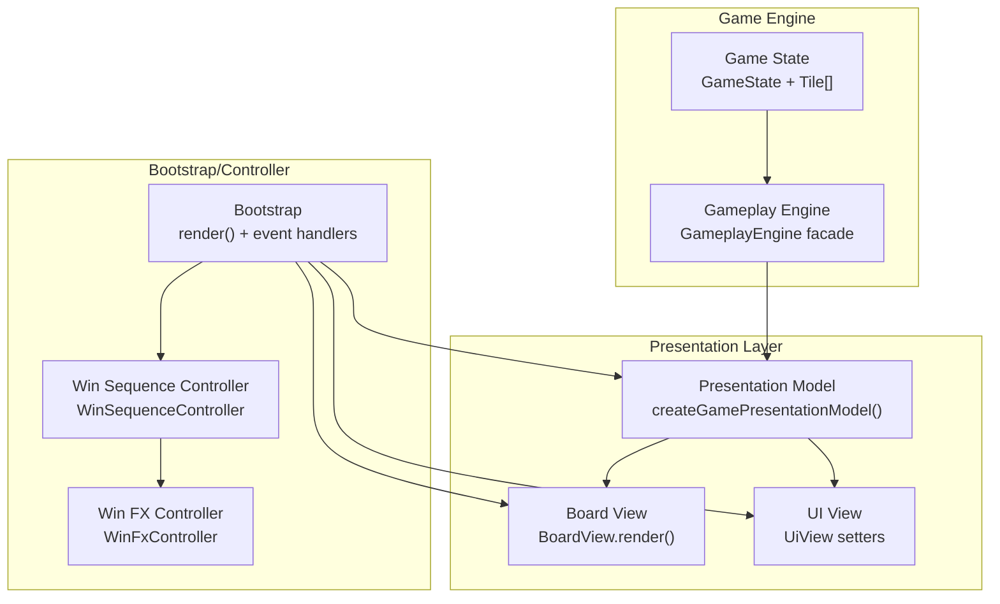
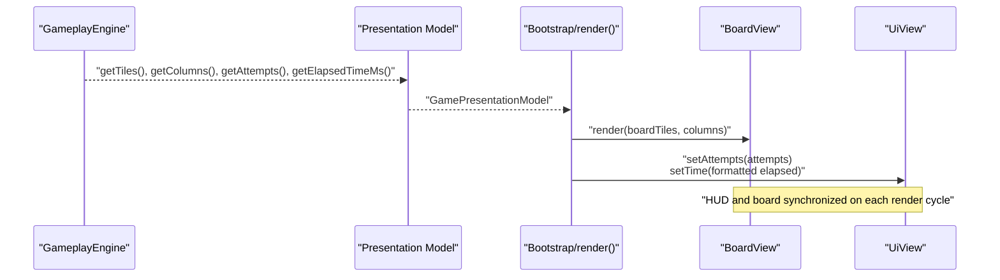
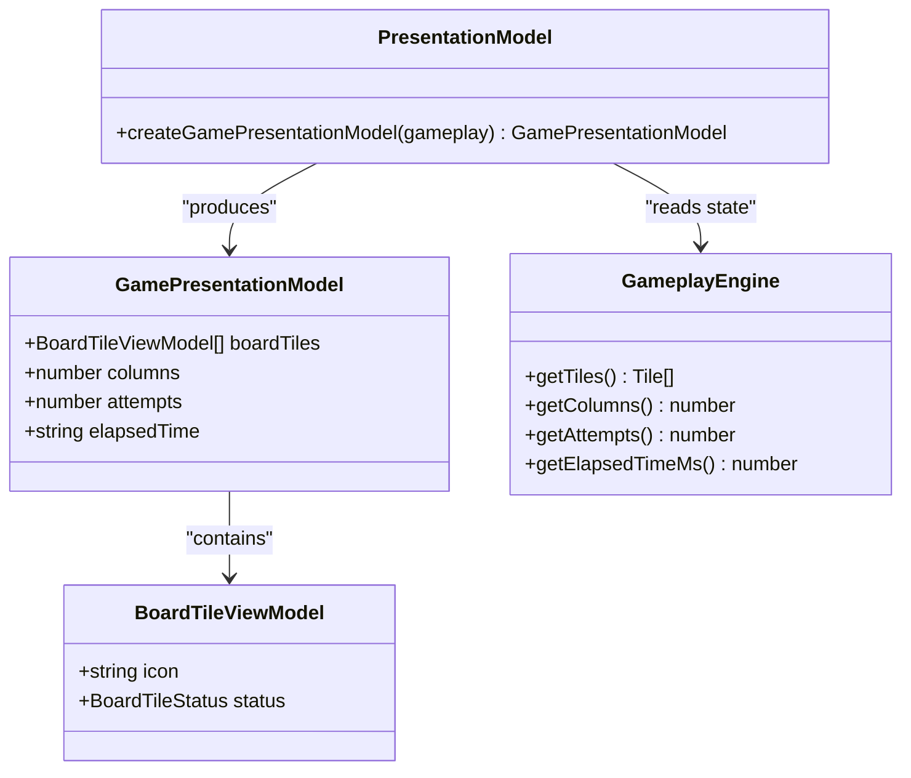
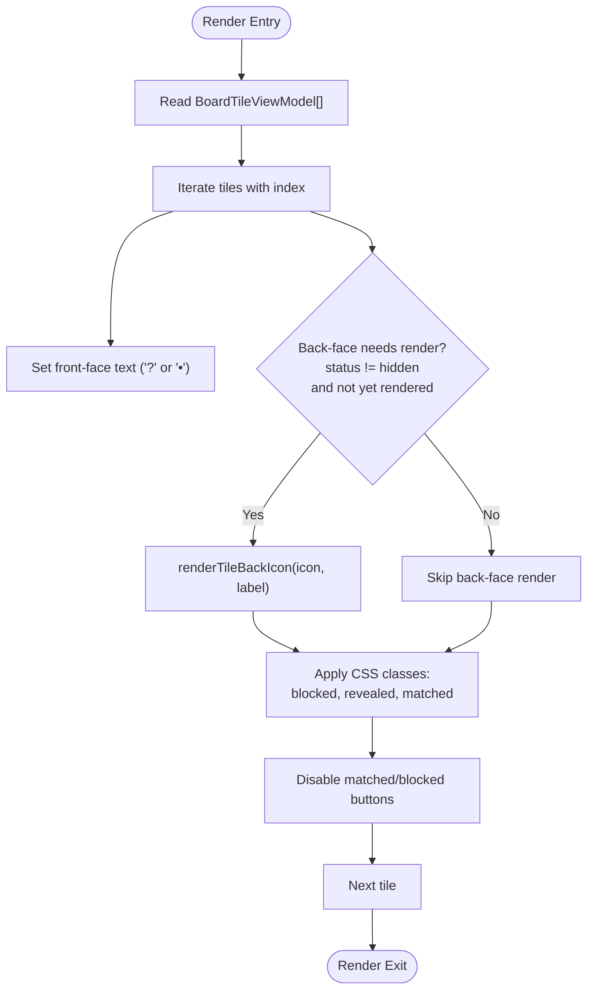
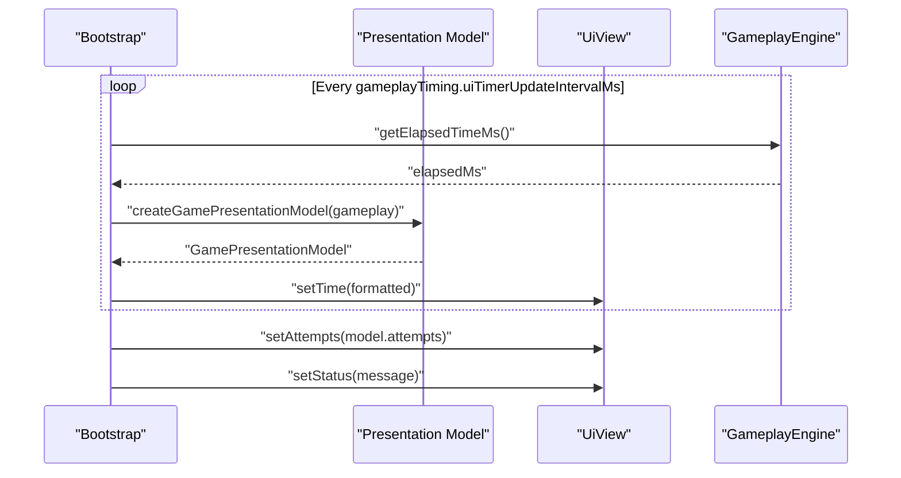
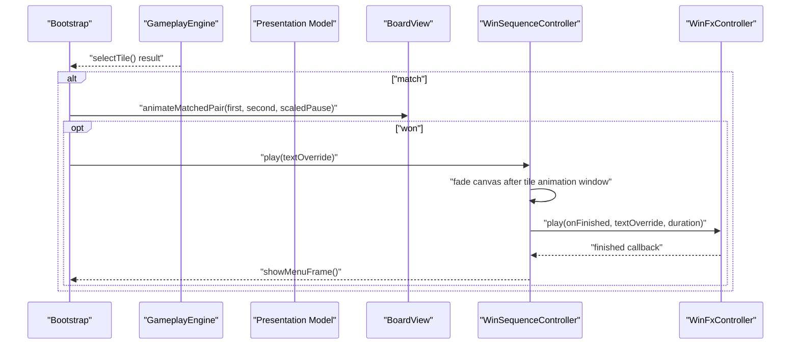
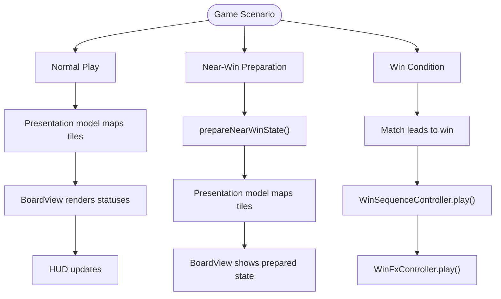
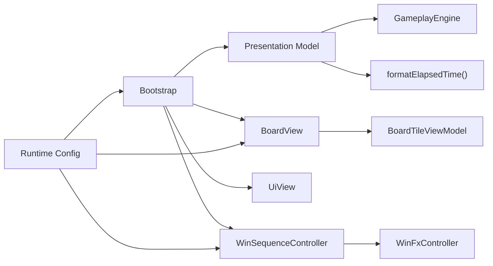

# Presentation Model

<cite>
**Referenced Files in This Document**
- [presentation.ts](file://src/presentation.ts)
- [board.ts](file://src/board.ts)
- [ui.ts](file://src/ui.ts)
- [index.ts](file://src/index.ts)
- [game.ts](file://src/game.ts)
- [gameplay.ts](file://src/gameplay.ts)
- [utils.ts](file://src/utils.ts)
- [win-sequence-controller.ts](file://src/win-sequence-controller.ts)
- [win-fx.ts](file://src/win-fx.ts)
- [runtime-config.ts](file://src/runtime-config.ts)
- [presentation.test.ts](file://tests/presentation.test.ts)
</cite>

## Table of Contents
1. [Introduction](#introduction)
2. [Project Structure](#project-structure)
3. [Core Components](#core-components)
4. [Architecture Overview](#architecture-overview)
5. [Detailed Component Analysis](#detailed-component-analysis)
6. [Dependency Analysis](#dependency-analysis)
7. [Performance Considerations](#performance-considerations)
8. [Troubleshooting Guide](#troubleshooting-guide)
9. [Conclusion](#conclusion)

## Introduction
This document explains the presentation layer that bridges the game engine to the UI renderer. It focuses on how the presentation model transforms raw game state into display-ready data structures, how internal tile representations are mapped to UI-friendly formats, and how the presentation model coordinates view-specific data transformations, animation triggers, and UI synchronization. It also covers how the presentation model handles different game scenarios (normal play, win celebration, near-win states) and integrates with the board rendering system.

## Project Structure
The presentation layer spans several modules:
- Presentation model: transforms gameplay state into a compact, UI-ready structure.
- Board view: renders tiles and applies animations based on the presentation model.
- UI view: updates HUD elements (time, attempts, status).
- Bootstrap/controller: orchestrates rendering, animations, and UI state synchronization.
- Runtime configuration: supplies timing and visual effect parameters that influence presentation behavior.

**Diagram sources**
- [presentation.ts:12-24](file://src/presentation.ts#L12-L24)
- [board.ts:227-306](file://src/board.ts#L227-L306)
- [ui.ts:15-48](file://src/ui.ts#L15-L48)
- [index.ts:781-807](file://src/index.ts#L781-L807)
- [gameplay.ts:28-41](file://src/gameplay.ts#L28-L41)
- [win-sequence-controller.ts:66-118](file://src/win-sequence-controller.ts#L66-L118)
- [win-fx.ts:236-562](file://src/win-fx.ts#L236-L562)

**Section sources**
- [presentation.ts:1-25](file://src/presentation.ts#L1-L25)
- [board.ts:121-523](file://src/board.ts#L121-L523)
- [ui.ts:15-48](file://src/ui.ts#L15-L48)
- [index.ts:781-807](file://src/index.ts#L781-L807)
- [gameplay.ts:28-107](file://src/gameplay.ts#L28-L107)
- [win-sequence-controller.ts:21-141](file://src/win-sequence-controller.ts#L21-L141)
- [win-fx.ts:41-830](file://src/win-fx.ts#L41-L830)

## Core Components
- Presentation model: Produces a minimal, UI-focused structure from gameplay state, including board tiles, column count, attempts, and formatted elapsed time.
- Board view: Renders tiles, applies status classes, animates matched pairs, and lazily renders tile back faces.
- UI view: Updates HUD elements for time, attempts, and status messages.
- Bootstrap/controller: Drives rendering, manages timers, triggers animations, and coordinates win celebrations.

Key responsibilities:
- State mapping: The presentation model maps internal Tile structures to BoardTileViewModel, exposing only icon and status.
- View-specific transformations: Board view converts status enums to CSS classes and toggles disabled/revealed states.
- Animation triggers: Matched pairs trigger board animations; win conditions trigger the win sequence.
- UI synchronization: HUD updates are synchronized with gameplay timing and animation scaling.

**Section sources**
- [presentation.ts:5-24](file://src/presentation.ts#L5-L24)
- [board.ts:8-11](file://src/board.ts#L8-L11)
- [board.ts:227-306](file://src/board.ts#L227-L306)
- [ui.ts:15-48](file://src/ui.ts#L15-L48)
- [index.ts:781-807](file://src/index.ts#L781-L807)

## Architecture Overview
The presentation model sits between the gameplay engine and the UI rendering systems. It is invoked by the bootstrap/render pipeline to produce a snapshot of the game state suitable for rendering.

**Diagram sources**
- [presentation.ts:12-24](file://src/presentation.ts#L12-L24)
- [index.ts:781-807](file://src/index.ts#L781-L807)
- [board.ts:227-306](file://src/board.ts#L227-L306)
- [ui.ts:37-47](file://src/ui.ts#L37-L47)

## Detailed Component Analysis

### Presentation Model
The presentation model encapsulates the transformation from gameplay state to UI-ready data. It produces:
- boardTiles: A projection of Tile[] into BoardTileViewModel, carrying icon and status.
- columns: The current board width in tiles.
- attempts: The number of attempts made so far.
- elapsedTime: A formatted time string derived from elapsed milliseconds.

**Diagram sources**
- [presentation.ts:5-24](file://src/presentation.ts#L5-L24)
- [board.ts:8-11](file://src/board.ts#L8-L11)
- [gameplay.ts:28-41](file://src/gameplay.ts#L28-L41)

Implementation highlights:
- Minimal projection: Only icon and status are copied from Tile to BoardTileViewModel.
- Formatted time: Elapsed milliseconds are transformed to a "MM:SS" string via a utility function.
- Deterministic output: The model does not mutate state; it returns a new object each time.

**Section sources**
- [presentation.ts:12-24](file://src/presentation.ts#L12-L24)
- [utils.ts:44-58](file://src/utils.ts#L44-L58)
- [presentation.test.ts:6-36](file://tests/presentation.test.ts#L6-L36)

### Board Rendering and State Mapping
The BoardView consumes BoardTileViewModel and applies:
- Status-to-class mapping: "hidden", "revealed", "matched", "blocked" become CSS classes.
- Back-face rendering: Icons are lazily rendered on demand for revealed/matched tiles.
- Accessibility attributes: ARIA labels and pressed states reflect tile status and blocked state.
- Matched pair animation: Triggers a timed animation to visually mark matched tiles.

**Diagram sources**
- [board.ts:227-306](file://src/board.ts#L227-L306)
- [board.ts:74-119](file://src/board.ts#L74-L119)

State mapping specifics:
- Internal Tile.status values are mapped to BoardTileStatus and then to CSS classes.
- Blocked tiles are visually distinct and functionally disabled.
- Matched tiles receive special classes and animation triggers.

**Section sources**
- [board.ts:6-11](file://src/board.ts#L6-L11)
- [board.ts:227-306](file://src/board.ts#L227-L306)

### UI Synchronization and HUD Updates
The UiView updates three HUD elements:
- timeValue: Updated with formatted elapsed time.
- attemptsValue: Updated with the current number of attempts.
- statusMessage: Updated with contextual messages (e.g., "Pick another tile", "No match", "You win!", "Match!").

The bootstrap layer drives these updates via a periodic HUD timer and immediate status updates on tile selection and mismatches.

**Diagram sources**
- [index.ts:482-496](file://src/index.ts#L482-L496)
- [index.ts:781-807](file://src/index.ts#L781-L807)
- [ui.ts:37-47](file://src/ui.ts#L37-L47)

**Section sources**
- [ui.ts:15-48](file://src/ui.ts#L15-L48)
- [index.ts:482-496](file://src/index.ts#L482-L496)
- [index.ts:781-807](file://src/index.ts#L781-L807)

### Animation Triggers and Win Celebration
Matched pairs trigger board animations, and winning the game triggers the win sequence:
- Matched pair animation: BoardView.animateMatchedPair adds a temporary class to fade matched tiles.
- Win sequence: WinSequenceController orchestrates a canvas fade and delegates to WinFxController for particle/text celebration.
- Timing scaling: Animation durations are scaled by the current animation speed setting.

**Diagram sources**
- [index.ts:706-779](file://src/index.ts#L706-L779)
- [board.ts:331-354](file://src/board.ts#L331-L354)
- [win-sequence-controller.ts:66-118](file://src/win-sequence-controller.ts#L66-L118)
- [win-fx.ts:236-562](file://src/win-fx.ts#L236-L562)

**Section sources**
- [index.ts:706-779](file://src/index.ts#L706-L779)
- [board.ts:331-354](file://src/board.ts#L331-L354)
- [win-sequence-controller.ts:66-118](file://src/win-sequence-controller.ts#L66-L118)
- [win-fx.ts:236-562](file://src/win-fx.ts#L236-L562)

### Handling Different Game Scenarios
- Normal play: Presentation model reflects current tile statuses; BoardView renders front/back faces accordingly; HUD updates continuously.
- Win celebration: On match that completes the game, the win sequence is triggered, including canvas fade and particle/text effects.
- Near-win states: The game supports preparing a near-win scenario where only one pair remains visible; the presentation model still maps tiles normally, but the board view and gameplay engine coordinate to present the intended challenge.

**Diagram sources**
- [game.ts:334-418](file://src/game.ts#L334-L418)
- [presentation.ts:12-24](file://src/presentation.ts#L12-L24)
- [board.ts:227-306](file://src/board.ts#L227-L306)
- [win-sequence-controller.ts:66-118](file://src/win-sequence-controller.ts#L66-L118)
- [win-fx.ts:236-562](file://src/win-fx.ts#L236-L562)

**Section sources**
- [game.ts:334-418](file://src/game.ts#L334-L418)
- [index.ts:706-779](file://src/index.ts#L706-L779)

## Dependency Analysis
The presentation layer exhibits clear separation of concerns:
- Presentation model depends on GameplayEngine and a formatting utility.
- BoardView depends on BoardTileViewModel and icon asset resolution utilities.
- Bootstrap/controller depends on presentation model, board view, UI view, and animation controllers.
- Runtime configuration influences timing and visual parameters used by the presentation layer.

**Diagram sources**
- [presentation.ts:12-24](file://src/presentation.ts#L12-L24)
- [board.ts:227-306](file://src/board.ts#L227-L306)
- [index.ts:781-807](file://src/index.ts#L781-L807)
- [runtime-config.ts:238-353](file://src/runtime-config.ts#L238-L353)

**Section sources**
- [presentation.ts:12-24](file://src/presentation.ts#L12-L24)
- [board.ts:227-306](file://src/board.ts#L227-L306)
- [index.ts:781-807](file://src/index.ts#L781-L807)
- [runtime-config.ts:238-353](file://src/runtime-config.ts#L238-L353)

## Performance Considerations
- Lazy back-face rendering: Back faces are rendered only when tiles are revealed or matched, reducing DOM work and image fetches.
- Efficient DOM updates: BoardView minimizes DOM operations by toggling classes and reusing elements.
- Animation scaling: Durations are scaled by animation speed limits, ensuring smooth performance across devices.
- Timed HUD updates: The HUD timer interval is configurable and throttled to reduce unnecessary updates.

[No sources needed since this section provides general guidance]

## Troubleshooting Guide
Common issues and diagnostics:
- HUD not updating: Verify the HUD timer is running and that createGamePresentationModel is called during render.
- Tiles not appearing: Confirm BoardView.render is receiving boardTiles and columns from the presentation model.
- Animations not playing: Check that matched disappear durations and animation speed scaling are within expected ranges.
- Win sequence not triggering: Ensure the win condition sets isWon and that WinSequenceController.play is invoked with correct timing.

**Section sources**
- [index.ts:482-496](file://src/index.ts#L482-L496)
- [board.ts:331-354](file://src/board.ts#L331-L354)
- [win-sequence-controller.ts:66-118](file://src/win-sequence-controller.ts#L66-L118)

## Conclusion
The presentation model serves as the central adapter between the game engine and the UI, transforming internal state into a concise, display-ready structure. Combined with the BoardView’s efficient rendering and the UiView’s HUD updates, it enables responsive, animated gameplay experiences. The integration with the win sequence and runtime configuration ensures consistent, scalable behavior across devices and user preferences.