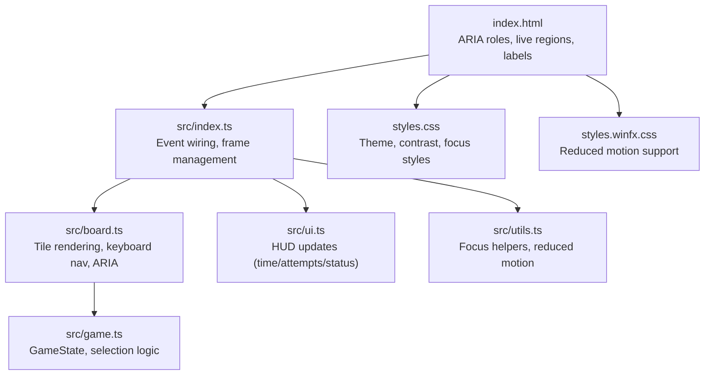
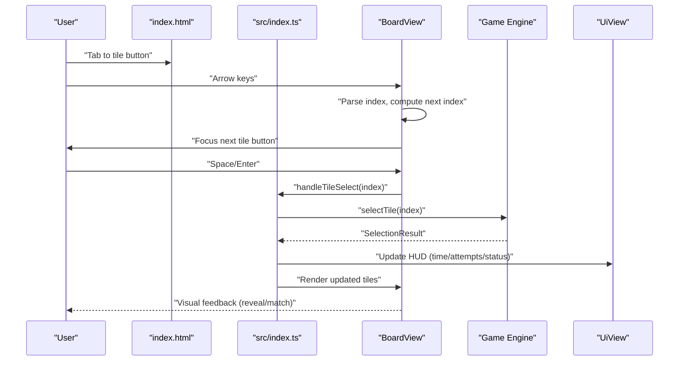
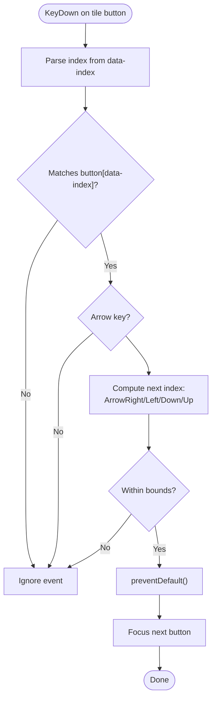
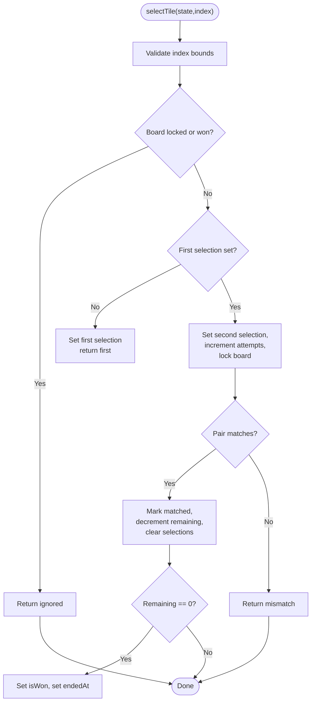
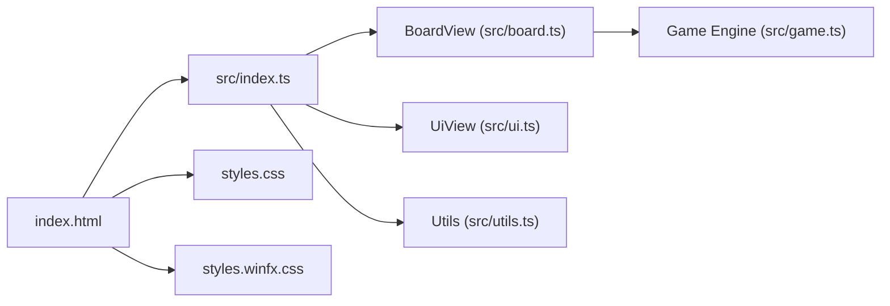

# Accessibility and Keyboard Navigation

<cite>
**Referenced Files in This Document**
- [index.html](file://index.html)
- [src/index.ts](file://src/index.ts)
- [src/board.ts](file://src/board.ts)
- [src/game.ts](file://src/game.ts)
- [src/ui.ts](file://src/ui.ts)
- [src/utils.ts](file://src/utils.ts)
- [src/icon-assets.ts](file://src/icon-assets.ts)
- [src/flag-emoji.ts](file://src/flag-emoji.ts)
- [styles.css](file://styles.css)
- [styles.winfx.css](file://styles.winfx.css)
- [tests/board.test.ts](file://tests/board.test.ts)
- [tests/audio-ui-controller.test.ts](file://tests/audio-ui-controller.test.ts)
</cite>

## Table of Contents
1. [Introduction](#introduction)
2. [Project Structure](#project-structure)
3. [Core Components](#core-components)
4. [Architecture Overview](#architecture-overview)
5. [Detailed Component Analysis](#detailed-component-analysis)
6. [Dependency Analysis](#dependency-analysis)
7. [Performance Considerations](#performance-considerations)
8. [Troubleshooting Guide](#troubleshooting-guide)
9. [Conclusion](#conclusion)
10. [Appendices](#appendices)

## Introduction
This document explains the accessibility features and keyboard navigation support implemented in the application. It covers ARIA attributes, keyboard event handling for tile selection and game controls, screen reader compatibility, focus management, keyboard shortcuts, alternative interaction methods, color contrast and visual accessibility guidelines, inclusive design patterns, parity between mouse and keyboard interactions, and testing strategies for accessibility compliance.

## Project Structure
The accessibility implementation spans several layers:
- Markup and semantic roles in the HTML shell
- View components that render accessible UI and manage keyboard navigation
- Game state engine that updates in response to both mouse and keyboard actions
- Utility helpers for focus management and reduced motion support
- Styles that support high contrast and reduced motion preferences

**Diagram sources**
- [index.html:1-196](file://index.html#L1-L196)
- [src/index.ts:1-1100](file://src/index.ts#L1-L1100)
- [src/board.ts:1-523](file://src/board.ts#L1-L523)
- [src/game.ts:1-419](file://src/game.ts#L1-L419)
- [src/ui.ts:1-49](file://src/ui.ts#L1-L49)
- [src/utils.ts:1-145](file://src/utils.ts#L1-L145)
- [styles.css:1-800](file://styles.css#L1-L800)
- [styles.winfx.css:544-598](file://styles.winfx.css#L544-L598)

**Section sources**
- [index.html:1-196](file://index.html#L1-L196)
- [src/index.ts:1-1100](file://src/index.ts#L1-L1100)

## Core Components
- BoardView: Renders tiles as buttons with ARIA attributes, handles click and keyboard navigation, and manages focus movement across the grid.
- Game state engine: Provides selection logic and state updates that are invoked by both mouse clicks and keyboard navigation.
- UI view: Updates HUD elements (time, attempts, status) without handling user input.
- HTML shell: Defines ARIA roles, live regions, labels, and status announcements for screen readers.
- Utilities: Provide reduced motion awareness and focus management helpers.

**Section sources**
- [src/board.ts:121-306](file://src/board.ts#L121-L306)
- [src/game.ts:159-243](file://src/game.ts#L159-L243)
- [src/ui.ts:15-48](file://src/ui.ts#L15-L48)
- [index.html:15-189](file://index.html#L15-L189)
- [src/utils.ts:81-130](file://src/utils.ts#L81-L130)

## Architecture Overview
The application wires user interactions at the bootstrap layer and delegates rendering and state updates to specialized components. Keyboard navigation is integrated directly into the board view, ensuring parity with mouse interactions.

**Diagram sources**
- [src/index.ts:639-780](file://src/index.ts#L639-L780)
- [src/board.ts:177-225](file://src/board.ts#L177-L225)
- [src/game.ts:159-243](file://src/game.ts#L159-L243)
- [src/ui.ts:37-47](file://src/ui.ts#L37-L47)

## Detailed Component Analysis

### BoardView: Keyboard Navigation and ARIA
BoardView renders each tile as a button with:
- aria-label describing the tile’s identity and content
- aria-pressed reflecting revealed/matched state
- aria-hidden on decorative tile faces to keep the accessibility tree concise
- Keyboard event handling for arrow keys to move focus between adjacent tiles

Keyboard navigation logic:
- Parses the current tile index from dataset
- Computes the next index based on Arrow keys and board geometry
- Prevents default to avoid page scrolling
- Focuses the next tile button

Screen reader compatibility:
- Back-face content (emojis/flags) is rendered into the tile back face
- Decorative faces are marked aria-hidden
- Accessibility for flag emojis is provided via the button’s aria-label, not the image itself

**Diagram sources**
- [src/board.ts:177-225](file://src/board.ts#L177-L225)
- [src/board.ts:484-504](file://src/board.ts#L484-L504)

**Section sources**
- [src/board.ts:121-306](file://src/board.ts#L121-L306)
- [src/board.ts:74-119](file://src/board.ts#L74-L119)
- [tests/board.test.ts:274-381](file://tests/board.test.ts#L274-L381)

### Game State Engine: Selection and Parity
The game engine’s selectTile function:
- Validates selection bounds and state
- Handles auto-resolve of mismatches when board is locked
- Updates attempts, matches, and remaining pair counts
- Returns a typed SelectionResult for the caller to handle UI updates

This ensures that keyboard and mouse interactions produce identical state changes and UI outcomes.

**Diagram sources**
- [src/game.ts:159-243](file://src/game.ts#L159-L243)
- [src/game.ts:245-264](file://src/game.ts#L245-L264)

**Section sources**
- [src/game.ts:159-243](file://src/game.ts#L159-L243)

### HTML Shell: ARIA Roles, Live Regions, and Labels
The HTML defines:
- Application landmarks and labels
- Status regions with aria-live="polite" and atomic updates
- Buttons with aria-pressed and aria-label for state and meaning
- Dialog overlays with aria-modal and aria-labelledby
- Reduced motion-friendly status messages

These constructs ensure screen readers announce state changes and provide clear semantics for interactive elements.

**Section sources**
- [index.html:15-189](file://index.html#L15-L189)

### UI View: Screen Reader Updates
The UI view updates time, attempts, and status messages. These updates occur through aria-live regions and atomic updates, ensuring screen readers announce changes without interrupting ongoing tasks.

**Section sources**
- [src/ui.ts:15-48](file://src/ui.ts#L15-L48)
- [index.html:152-168](file://index.html#L152-L168)

### Focus Management and Reduced Motion
Utilities support:
- Horizontal wheel scrolling for sliders and overflow areas
- Reduced motion awareness via prefers-reduced-motion media queries
- Consistent focus styles and outlines for keyboard navigation

**Section sources**
- [src/utils.ts:81-130](file://src/utils.ts#L81-L130)
- [styles.winfx.css:556-587](file://styles.winfx.css#L556-L587)

### Icon and Flag Accessibility
- Flag emojis are rendered via SVG URLs with alt text derived from country names
- Non-flag assets are rendered as images with accessible labels
- Decorative tile faces are hidden from the accessibility tree via aria-hidden

**Section sources**
- [src/icon-assets.ts:6-189](file://src/icon-assets.ts#L6-L189)
- [src/flag-emoji.ts:23-54](file://src/flag-emoji.ts#L23-L54)
- [src/board.ts:74-119](file://src/board.ts#L74-L119)

## Dependency Analysis
The following diagram shows how accessibility-related components depend on each other and on the HTML shell.

**Diagram sources**
- [index.html:1-196](file://index.html#L1-L196)
- [src/index.ts:1-1100](file://src/index.ts#L1-L1100)
- [src/board.ts:1-523](file://src/board.ts#L1-L523)
- [src/game.ts:1-419](file://src/game.ts#L1-L419)
- [src/ui.ts:1-49](file://src/ui.ts#L1-L49)
- [src/utils.ts:1-145](file://src/utils.ts#L1-L145)
- [styles.css:1-800](file://styles.css#L1-L800)
- [styles.winfx.css:544-598](file://styles.winfx.css#L544-L598)

**Section sources**
- [src/index.ts:639-780](file://src/index.ts#L639-L780)
- [src/board.ts:177-225](file://src/board.ts#L177-L225)

## Performance Considerations
- Keyboard navigation computes next index without DOM traversal beyond the target button, minimizing overhead.
- Lazy rendering of tile back faces reduces unnecessary image fetches until tiles are revealed.
- Reduced motion media queries disable intensive animations, improving performance and accessibility for sensitive users.

[No sources needed since this section provides general guidance]

## Troubleshooting Guide
Common accessibility issues and resolutions:
- Keyboard navigation not moving focus: Ensure the target is a button with data-index and that the key is an arrow key. Verify preventDefault is not suppressed by other handlers.
- Screen reader not announcing status: Confirm aria-live region exists and status updates use atomic=true. Ensure the status element is not hidden.
- Mute button state not reflected: Verify aria-pressed and aria-label are updated on click and initialization.
- Reduced motion animations still playing: Check prefers-reduced-motion media query and ensure CSS disables intensive animations.

**Section sources**
- [tests/board.test.ts:274-381](file://tests/board.test.ts#L274-L381)
- [tests/audio-ui-controller.test.ts:72-170](file://tests/audio-ui-controller.test.ts#L72-L170)
- [styles.winfx.css:556-587](file://styles.winfx.css#L556-L587)

## Conclusion
The application integrates robust accessibility features:
- Comprehensive ARIA attributes and roles
- Keyboard-first navigation with arrow keys and Space/Enter
- Screen reader-friendly status updates and labels
- Reduced motion support and high-contrast themes
- Parity between mouse and keyboard interactions through shared game state logic

These features collectively provide an inclusive, accessible experience for users with diverse abilities.

[No sources needed since this section summarizes without analyzing specific files]

## Appendices

### Keyboard Shortcuts Reference
- Arrow keys: Move focus between adjacent tiles in grid
- Space/Enter: Select the focused tile
- Tab/Shift+Tab: Navigate between interactive elements outside the board

**Section sources**
- [src/board.ts:177-225](file://src/board.ts#L177-L225)
- [src/index.ts:639-780](file://src/index.ts#L639-L780)

### Color Contrast and Visual Accessibility Guidelines
- Theme tokens define foreground/background colors for readability
- Focus styles and outlines are visible for keyboard navigation
- Reduced motion media queries disable animations for sensitivity
- High contrast mode compatibility is supported via theme tokens

**Section sources**
- [styles.css:13-101](file://styles.css#L13-L101)
- [styles.winfx.css:556-587](file://styles.winfx.css#L556-L587)