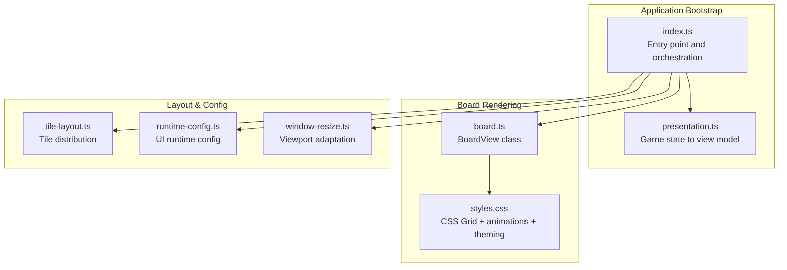
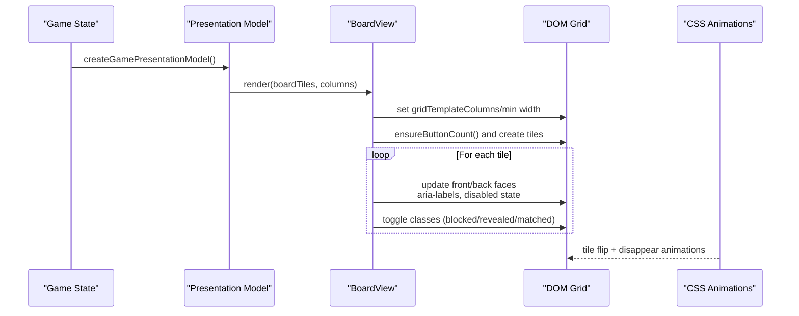
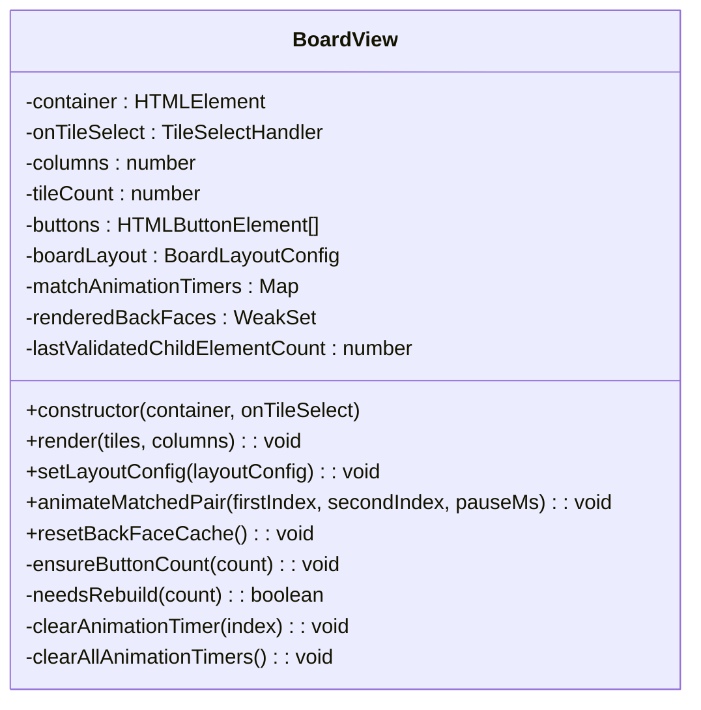
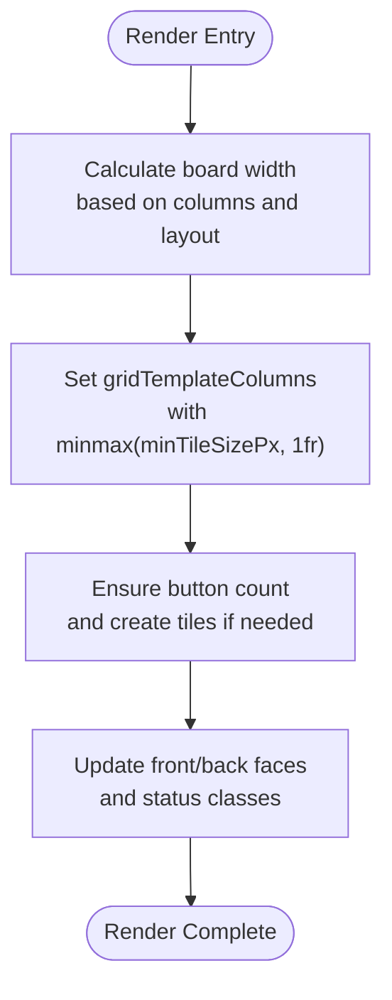
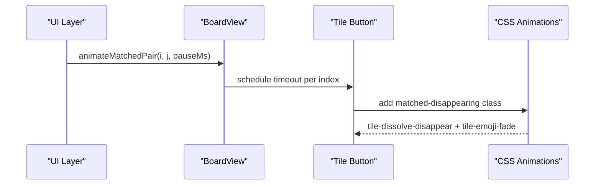
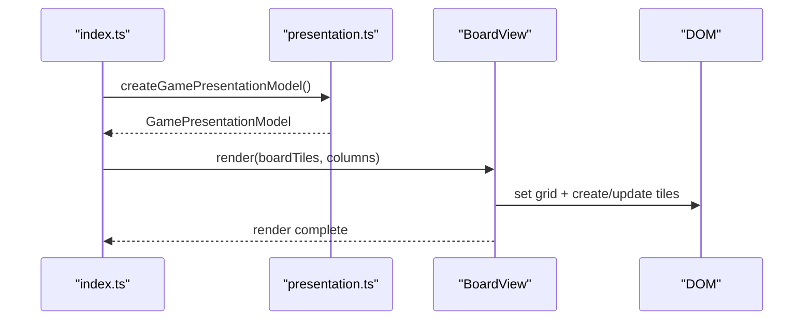
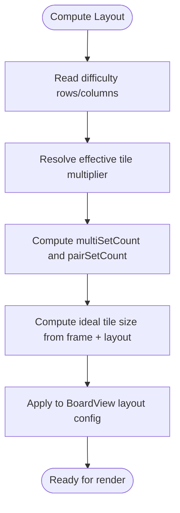
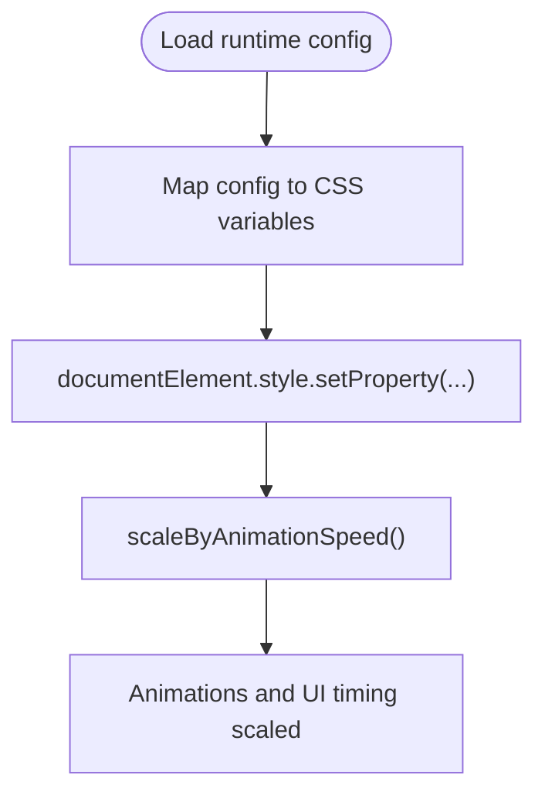
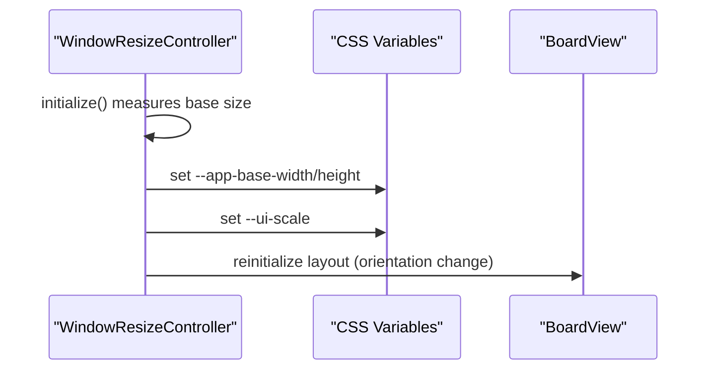
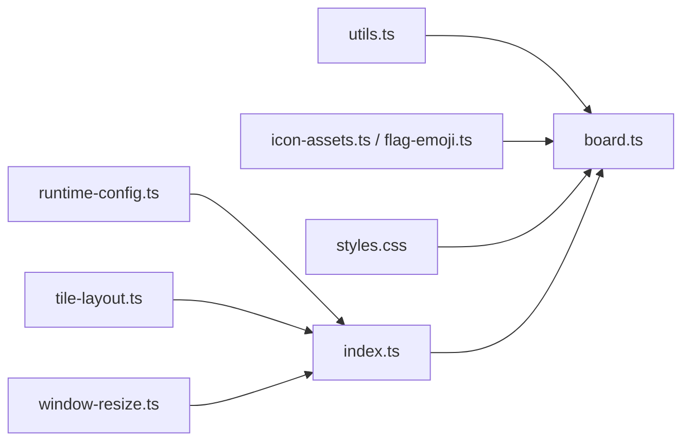

# Board Rendering System

<cite>
**Referenced Files in This Document**
- [board.ts](file://src/board.ts)
- [styles.css](file://styles.css)
- [index.ts](file://src/index.ts)
- [presentation.ts](file://src/presentation.ts)
- [tile-layout.ts](file://src/tile-layout.ts)
- [utils.ts](file://src/utils.ts)
- [window-resize.ts](file://src/window-resize.ts)
- [runtime-config.ts](file://src/runtime-config.ts)
- [board.test.ts](file://tests/board.test.ts)
</cite>

## Table of Contents
1. [Introduction](#introduction)
2. [Project Structure](#project-structure)
3. [Core Components](#core-components)
4. [Architecture Overview](#architecture-overview)
5. [Detailed Component Analysis](#detailed-component-analysis)
6. [Dependency Analysis](#dependency-analysis)
7. [Performance Considerations](#performance-considerations)
8. [Troubleshooting Guide](#troubleshooting-guide)
9. [Conclusion](#conclusion)

## Introduction
This document explains the board rendering system that powers the tile visualization, CSS Grid integration, and animation coordination in the application. It covers the tile layout system, responsive sizing, visual feedback mechanisms, and the complete rendering pipeline from game state updates to DOM manipulation. It also documents CSS custom property integration for dynamic theming, viewport constraint relationships, and performance optimization techniques for smooth animations and memory management on large boards.

## Project Structure
The board rendering system spans several modules:
- Board view and tile rendering logic
- CSS Grid and tile styling with dynamic theming
- Presentation model transformation from game state
- Layout computation and responsive sizing
- Runtime configuration and CSS custom properties
- Window resize and viewport adaptation

**Diagram sources**
- [index.ts:781-807](file://src/index.ts#L781-L807)
- [board.ts:121-306](file://src/board.ts#L121-L306)
- [styles.css:1191-1467](file://styles.css#L1191-L1467)
- [tile-layout.ts:36-53](file://src/tile-layout.ts#L36-L53)
- [runtime-config.ts:238-353](file://src/runtime-config.ts#L238-L353)
- [window-resize.ts:108-151](file://src/window-resize.ts#L108-L151)

**Section sources**
- [index.ts:781-807](file://src/index.ts#L781-L807)
- [board.ts:121-306](file://src/board.ts#L121-L306)
- [styles.css:1191-1467](file://styles.css#L1191-L1467)
- [tile-layout.ts:36-53](file://src/tile-layout.ts#L36-L53)
- [runtime-config.ts:238-353](file://src/runtime-config.ts#L238-L353)
- [window-resize.ts:108-151](file://src/window-resize.ts#L108-L151)

## Core Components
- BoardView: Manages tile creation, updates, and animations; coordinates click and keyboard navigation; integrates with CSS Grid and tile styling.
- CSS Grid and tile styles: Define responsive grid layout, tile dimensions, hover and selection states, and flip/disappear animations.
- Presentation model: Transforms game state into a view model suitable for rendering.
- Layout configuration: Computes board dimensions and responsive tile sizing.
- Runtime configuration: Exposes CSS custom properties for dynamic theming and animation scaling.
- Window resize controller: Adapts the board to viewport constraints and device orientation.

**Section sources**
- [board.ts:121-306](file://src/board.ts#L121-L306)
- [styles.css:1191-1467](file://styles.css#L1191-L1467)
- [presentation.ts:12-24](file://src/presentation.ts#L12-L24)
- [runtime-config.ts:238-353](file://src/runtime-config.ts#L238-L353)
- [window-resize.ts:108-151](file://src/window-resize.ts#L108-L151)

## Architecture Overview
The rendering pipeline transforms game state into DOM updates and animations:

**Diagram sources**
- [presentation.ts:12-24](file://src/presentation.ts#L12-L24)
- [board.ts:227-306](file://src/board.ts#L227-L306)
- [styles.css:1389-1433](file://styles.css#L1389-L1433)

**Section sources**
- [presentation.ts:12-24](file://src/presentation.ts#L12-L24)
- [board.ts:227-306](file://src/board.ts#L227-L306)
- [styles.css:1389-1433](file://styles.css#L1389-L1433)

## Detailed Component Analysis

### BoardView: Tile Visualization and Interaction
BoardView orchestrates tile creation, updates, and animations:
- Grid width and column sizing: Calculates board width and sets CSS grid template columns based on layout configuration.
- Lazy back-face rendering: Renders tile back faces only when revealed or matched to minimize DOM work and image fetches.
- Accessibility: Provides aria-labels and aria-pressed states; uses dataset attributes for index lookup.
- Interaction: Handles click and keyboard navigation; translates arrow keys to focus movement across tiles.
- Match animations: Schedules matched tile disappearance with configurable pause/duration.

**Diagram sources**
- [board.ts:121-522](file://src/board.ts#L121-L522)

**Section sources**
- [board.ts:121-522](file://src/board.ts#L121-L522)

### CSS Grid Integration and Responsive Sizing
The board uses CSS Grid with dynamic sizing:
- Board container: Defines grid gap, padding, and responsive columns via minmax and fr units.
- Tile sizing: Enforced via minTileSizePx and targetTileSizePx; computed board width ensures fit within viewport constraints.
- Responsive adjustments: Reduced gaps and padding on smaller screens; hover and focus states optimized for touch devices.

**Diagram sources**
- [board.ts:227-236](file://src/board.ts#L227-L236)
- [styles.css:1191-1206](file://styles.css#L1191-L1206)

**Section sources**
- [board.ts:227-236](file://src/board.ts#L227-L236)
- [styles.css:1191-1206](file://styles.css#L1191-L1206)

### Animation Coordination and Visual Feedback
Animations coordinate tile flips and matched pair disappearances:
- Flip animation: CSS transform rotateY with duration controlled by CSS custom properties.
- Matched pair animation: Adds matched-disappearing class after a pause; triggers dissolve and fade-out animations.
- Hover and selection: Non-disabled tiles lift slightly on hover; blocked and matched tiles disable interaction.

**Diagram sources**
- [board.ts:331-354](file://src/board.ts#L331-L354)
- [styles.css:1399-1433](file://styles.css#L1399-L1433)

**Section sources**
- [board.ts:331-354](file://src/board.ts#L331-L354)
- [styles.css:1399-1433](file://styles.css#L1399-L1433)

### Rendering Pipeline: From Game State to DOM
The pipeline converts game state to view model and renders tiles:
- Presentation model: Extracts boardTiles, columns, attempts, and formatted elapsed time.
- Render call: Updates board width/columns, ensures tile DOM, and applies tile statuses and classes.
- Debug mode: Optionally reveals all non-matched tiles for inspection.

**Diagram sources**
- [presentation.ts:12-24](file://src/presentation.ts#L12-L24)
- [index.ts:781-807](file://src/index.ts#L781-L807)
- [board.ts:227-306](file://src/board.ts#L227-L306)

**Section sources**
- [presentation.ts:12-24](file://src/presentation.ts#L12-L24)
- [index.ts:781-807](file://src/index.ts#L781-L807)
- [board.ts:227-306](file://src/board.ts#L227-L306)

### Tile Layout System and Responsive Sizing
Tile layout computation determines tile counts and distributions:
- Multi-set and pair-set counts: Derived from difficulty and tile multiplier constraints.
- Responsive tile sizing: Ideal tile size computed from frame dimensions and layout config; clamped to min/max values.

**Diagram sources**
- [tile-layout.ts:36-53](file://src/tile-layout.ts#L36-L53)
- [index.ts:574-584](file://src/index.ts#L574-L584)
- [board.ts:320-329](file://src/board.ts#L320-L329)

**Section sources**
- [tile-layout.ts:36-53](file://src/tile-layout.ts#L36-L53)
- [index.ts:574-584](file://src/index.ts#L574-L584)
- [board.ts:320-329](file://src/board.ts#L320-L329)

### CSS Custom Property Integration for Dynamic Theming
Dynamic theming and animation scaling are driven by CSS custom properties:
- Runtime configuration maps UI settings to CSS variables (animation speed, tile opacity, flip duration, etc.).
- Global variables applied at bootstrap; animation speed scales durations and delays.
- Reduced motion support adjusts animation durations and disables hover transforms.

**Diagram sources**
- [runtime-config.ts:238-353](file://src/runtime-config.ts#L238-L353)
- [index.ts:863-890](file://src/index.ts#L863-L890)
- [index.ts:282-293](file://src/index.ts#L282-L293)
- [styles.css:1481-1502](file://styles.css#L1481-L1502)

**Section sources**
- [runtime-config.ts:238-353](file://src/runtime-config.ts#L238-L353)
- [index.ts:863-890](file://src/index.ts#L863-L890)
- [index.ts:282-293](file://src/index.ts#L282-L293)
- [styles.css:1481-1502](file://styles.css#L1481-L1502)

### Relationship Between Board Dimensions and Viewport Constraints
The board adapts to viewport constraints through:
- Window resize controller: Computes base dimensions, applies scale, and clamps to viewport bounds.
- Orientation-aware layout: Adjusts board layout and reinitializes resize controller on orientation change.
- CSS viewport units and min()/max() ensure the board fits within available space.

**Diagram sources**
- [window-resize.ts:108-151](file://src/window-resize.ts#L108-L151)
- [index.ts:837-844](file://src/index.ts#L837-L844)
- [styles.css:142-180](file://styles.css#L142-L180)

**Section sources**
- [window-resize.ts:108-151](file://src/window-resize.ts#L108-L151)
- [index.ts:837-844](file://src/index.ts#L837-L844)
- [styles.css:142-180](file://styles.css#L142-L180)

## Dependency Analysis
BoardView depends on:
- Utility functions for DOM queries and formatting.
- Icon assets and flag emoji resolution for tile back faces.
- CSS Grid and animation rules for visual behavior.
- Runtime configuration for layout and animation parameters.

**Diagram sources**
- [board.ts:1-4](file://src/board.ts#L1-L4)
- [utils.ts:3-11](file://src/utils.ts#L3-L11)
- [runtime-config.ts:238-353](file://src/runtime-config.ts#L238-L353)
- [index.ts:1-50](file://src/index.ts#L1-L50)
- [tile-layout.ts:9-11](file://src/tile-layout.ts#L9-L11)
- [window-resize.ts:1-28](file://src/window-resize.ts#L1-L28)

**Section sources**
- [board.ts:1-4](file://src/board.ts#L1-L4)
- [utils.ts:3-11](file://src/utils.ts#L3-L11)
- [runtime-config.ts:238-353](file://src/runtime-config.ts#L238-L353)
- [index.ts:1-50](file://src/index.ts#L1-L50)
- [tile-layout.ts:9-11](file://src/tile-layout.ts#L9-L11)
- [window-resize.ts:1-28](file://src/window-resize.ts#L1-L28)

## Performance Considerations
- Lazy back-face rendering: Back faces are rendered only when revealed or matched, minimizing DOM work and image fetches.
- DOM reuse: Button elements are reused across renders when counts and types match; rebuilds occur only when necessary.
- Animation scaling: CSS custom properties and animation speed limits ensure smooth performance across devices.
- Reduced motion: Animations adapt to user preferences, reducing CPU/GPU load on constrained devices.
- Memory management: WeakSet caches for rendered back faces are reset on rebuilds to prevent stale references.

[No sources needed since this section provides general guidance]

## Troubleshooting Guide
Common issues and resolutions:
- Tiles not appearing or flickering: Verify gridTemplateColumns and board width calculations; ensure layout config values are positive and rounded.
- Incorrect tile indices on click: Confirm data-index attributes are present and correctly parsed; verify event delegation to button elements.
- Match animations not triggering: Check matched-disappearing class application and timer clearing; ensure CSS animations are enabled.
- Accessibility problems: Confirm aria-labels and aria-pressed states reflect tile status; verify dataset index parsing.

**Section sources**
- [board.test.ts:159-197](file://tests/board.test.ts#L159-L197)
- [board.test.ts:204-250](file://tests/board.test.ts#L204-L250)
- [board.test.ts:417-439](file://tests/board.test.ts#L417-L439)

## Conclusion
The board rendering system combines a robust BoardView class, CSS Grid-based layout, and dynamic CSS custom properties to deliver responsive, accessible, and performant tile visualization. The pipeline efficiently transforms game state into DOM updates, coordinates tile flip and match animations, and adapts to viewport constraints through window resizing and orientation changes. By leveraging lazy rendering, DOM reuse, and animation scaling, the system maintains smooth performance across diverse devices and configurations.