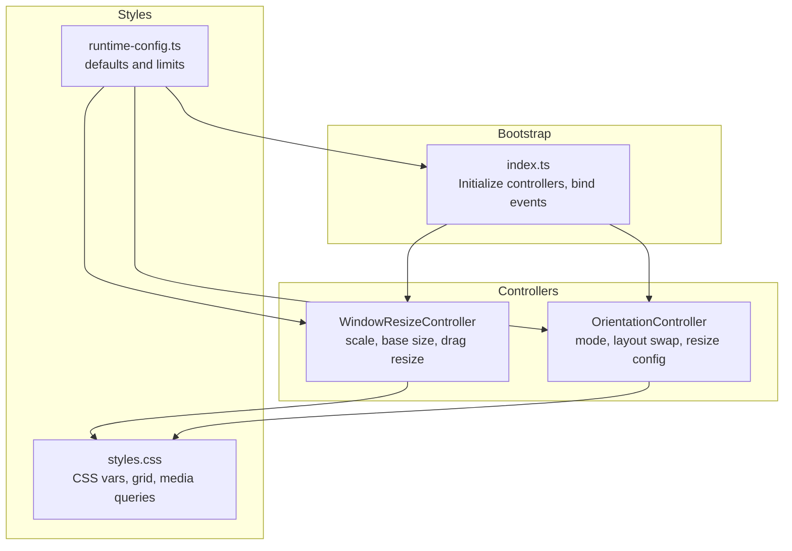
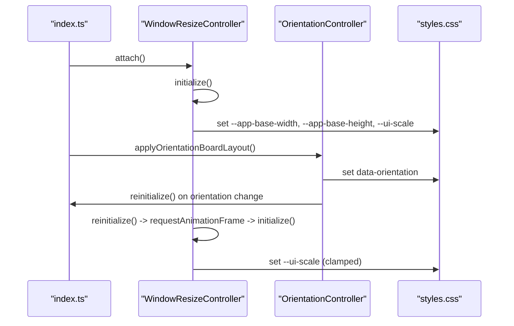
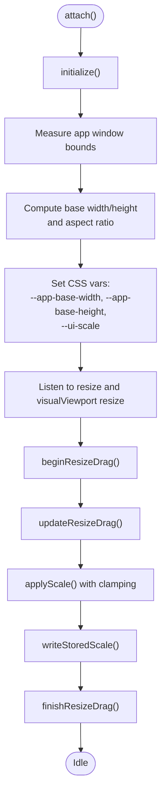
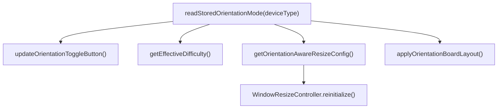
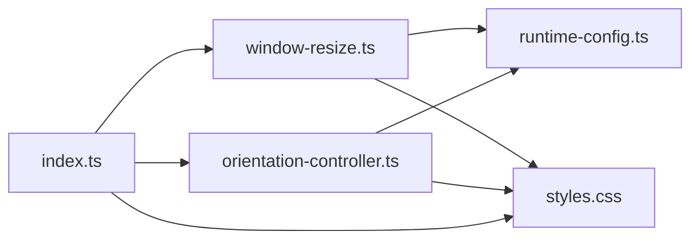

# Responsive Design and Layout

<cite>
**Referenced Files in This Document**
- [window-resize.ts](file://src/window-resize.ts)
- [orientation-controller.ts](file://src/orientation-controller.ts)
- [styles.css](file://styles.css)
- [runtime-config.ts](file://src/runtime-config.ts)
- [index.ts](file://src/index.ts)
- [board.test.ts](file://tests/board.test.ts)
- [window-resize.test.ts](file://tests/window-resize.test.ts)
- [orientation-controller.test.ts](file://tests/orientation-controller.test.ts)
- [debug-layout.spec.ts](file://e2e/debug-layout.spec.ts)
- [index.html](file://index.html)
</cite>

## Table of Contents
1. [Introduction](#introduction)
2. [Project Structure](#project-structure)
3. [Core Components](#core-components)
4. [Architecture Overview](#architecture-overview)
5. [Detailed Component Analysis](#detailed-component-analysis)
6. [Dependency Analysis](#dependency-analysis)
7. [Performance Considerations](#performance-considerations)
8. [Troubleshooting Guide](#troubleshooting-guide)
9. [Conclusion](#conclusion)
10. [Appendices](#appendices)

## Introduction
This document explains the responsive design system that powers dynamic layout adaptation, breakpoint detection, and viewport-aware calculations. It covers the window-resize controller for scaling and resizing, the orientation controller for mobile rotation handling, CSS Grid responsiveness and flexible units, layout recalculation triggers, performance considerations for resize events, and cross-device compatibility strategies. Practical examples include responsive tile sizing, board centering mechanisms, and mobile-specific optimizations for touch interactions.

## Project Structure
The responsive system spans three primary areas:
- JavaScript controllers: window-resize.ts and orientation-controller.ts
- Stylesheet: styles.css with CSS custom properties and media queries
- Runtime configuration: runtime-config.ts defining base sizes, limits, and board layout
- Application bootstrap: index.ts orchestrating initialization, event wiring, and layout updates

**Diagram sources**
- [index.ts:1047-1061](file://src/index.ts#L1047-L1061)
- [window-resize.ts:38-101](file://src/window-resize.ts#L38-L101)
- [orientation-controller.ts:66-76](file://src/orientation-controller.ts#L66-L76)
- [styles.css:142-179](file://styles.css#L142-L179)
- [runtime-config.ts:99-156](file://src/runtime-config.ts#L99-L156)

**Section sources**
- [index.ts:1047-1061](file://src/index.ts#L1047-L1061)
- [window-resize.ts:38-101](file://src/window-resize.ts#L38-L101)
- [orientation-controller.ts:66-76](file://src/orientation-controller.ts#L66-L76)
- [styles.css:142-179](file://styles.css#L142-L179)
- [runtime-config.ts:99-156](file://src/runtime-config.ts#L99-L156)

## Core Components
- WindowResizeController: measures viewport, computes base dimensions, applies scale, persists scale, and supports pointer-based resizing. Integrates with visualViewport for accurate mobile measurements.
- OrientationController: manages portrait/landscape modes, swaps aspect ratio and base dimensions, updates UI state, and exposes orientation-aware resize configuration.
- CSS Grid and Flexible Units: CSS variables define base sizes and scale; grid templates adapt to difficulty and orientation; media queries adjust spacing and layout on small screens.
- Runtime Configuration: provides defaults for base sizes, scale limits, and board layout parameters.

Key implementation references:
- [WindowResizeController class:38-298](file://src/window-resize.ts#L38-L298)
- [OrientationController functions:1-105](file://src/orientation-controller.ts#L1-L105)
- [CSS variables and grid:142-179](file://styles.css#L142-L179)
- [Runtime defaults:99-156](file://src/runtime-config.ts#L99-L156)

**Section sources**
- [window-resize.ts:38-298](file://src/window-resize.ts#L38-L298)
- [orientation-controller.ts:1-105](file://src/orientation-controller.ts#L1-L105)
- [styles.css:142-179](file://styles.css#L142-L179)
- [runtime-config.ts:99-156](file://src/runtime-config.ts#L99-L156)

## Architecture Overview
The responsive pipeline begins at bootstrap, wires up event listeners, and continuously adapts layout based on viewport and orientation.

**Diagram sources**
- [index.ts:1047-1061](file://src/index.ts#L1047-L1061)
- [window-resize.ts:74-151](file://src/window-resize.ts#L74-L151)
- [orientation-controller.ts:66-76](file://src/orientation-controller.ts#L66-L76)
- [styles.css:142-179](file://styles.css#L142-L179)

## Detailed Component Analysis

### Window Resize Controller
Responsibilities:
- Measure app window bounds and compute base width/height respecting fixed aspect ratio and minimum sizes
- Initialize CSS variables for base dimensions and scale
- Apply and persist scale, with viewport-bound clamping using visualViewport when available
- Support pointer-based drag resizing with midpoint capture and smooth persistence
- Reinitialize safely when orientation changes

Key behaviors:
- Base dimension calculation ensures content-safe minimums and maintains aspect ratio
- Scale clamping considers viewport padding and configured min/max bounds
- Persistence uses localStorage for user-selected scale
- Deferred re-clamp after first animation frame to stabilize mobile viewport

**Diagram sources**
- [window-resize.ts:74-151](file://src/window-resize.ts#L74-L151)
- [window-resize.ts:196-232](file://src/window-resize.ts#L196-L232)
- [window-resize.ts:236-296](file://src/window-resize.ts#L236-L296)

**Section sources**
- [window-resize.ts:74-151](file://src/window-resize.ts#L74-L151)
- [window-resize.ts:196-232](file://src/window-resize.ts#L196-L232)
- [window-resize.ts:236-296](file://src/window-resize.ts#L236-L296)

### Orientation Controller
Responsibilities:
- Store and retrieve preferred orientation mode per device type
- Swap difficulty rows/columns for portrait mode
- Update orientation toggle UI and dataset
- Provide orientation-aware resize configuration (invert aspect ratio and swap base dimensions)
- Apply orientation to board layout across views

**Diagram sources**
- [orientation-controller.ts:9-33](file://src/orientation-controller.ts#L9-L33)
- [orientation-controller.ts:50-76](file://src/orientation-controller.ts#L50-L76)
- [orientation-controller.ts:84-99](file://src/orientation-controller.ts#L84-L99)

**Section sources**
- [orientation-controller.ts:9-33](file://src/orientation-controller.ts#L9-L33)
- [orientation-controller.ts:50-76](file://src/orientation-controller.ts#L50-L76)
- [orientation-controller.ts:84-99](file://src/orientation-controller.ts#L84-L99)

### CSS Grid Responsiveness and Flexible Units
Mechanisms:
- CSS variables define base width/height and scale; app shell scales via transform
- Board uses CSS Grid with repeat and minmax to distribute tiles responsively
- Media queries adjust spacing, alignment, and component wrapping on smaller screens
- Container queries and clamp() keep typography and spacing fluid

Examples:
- App shell scales with CSS variables and transform for crisp rendering
- Board grid template columns adapt to difficulty and min tile size
- Media query adjusts topbar/bottombar layout and removes resize handle on narrow widths

**Section sources**
- [styles.css:142-179](file://styles.css#L142-L179)
- [styles.css:1191-1206](file://styles.css#L1191-L1206)
- [styles.css:1219-1245](file://styles.css#L1219-L1245)
- [styles.css:1504-1592](file://styles.css#L1504-L1592)

### Layout Recalculation Triggers and Cross-Device Compatibility
Triggers:
- Window resize and visualViewport resize events
- Orientation toggle click (landscape/portrait swap)
- Initial bootstrap via requestAnimationFrame to ensure DOM layout

Cross-device strategies:
- visualViewport measurement for accurate mobile viewport sizing
- localStorage persistence of scale for continuity across sessions
- Orientation-aware resize configuration to maintain usability across form factors
- Reduced motion media query adjustments for accessibility

**Section sources**
- [window-resize.ts:86-101](file://src/window-resize.ts#L86-L101)
- [window-resize.ts:196-209](file://src/window-resize.ts#L196-L209)
- [orientation-controller.ts:84-99](file://src/orientation-controller.ts#L84-L99)
- [styles.css:1481-1502](file://styles.css#L1481-L1502)

### Examples and Patterns

#### Responsive Tile Sizing
- Ideal tile size computed from frame dimensions and layout config
- Ensures board fills available space regardless of difficulty or orientation
- Board view sets grid template columns using minmax and repeat

References:
- [computeIdealTileSize():574-584](file://src/index.ts#L574-L584)
- [BoardView render expectations:18-50](file://tests/board.test.ts#L18-L50)

**Section sources**
- [index.ts:574-584](file://src/index.ts#L574-L584)
- [board.test.ts:18-50](file://tests/board.test.ts#L18-L50)

#### Board Centering Mechanism
- App shell uses margin auto and CSS variables for width/height
- On resize-ready, transforms scale the inner app to fit viewport while maintaining aspect ratio
- Centering relies on max-width and transform scaling

References:
- [App shell and transform scaling:142-179](file://styles.css#L142-L179)

**Section sources**
- [styles.css:142-179](file://styles.css#L142-L179)

#### Mobile-Specific Optimizations
- Orientation toggle button with icons for portrait/landscape
- Media query reduces padding and reflows UI for narrow widths
- visualViewport used for accurate mobile measurements
- Pointer capture and user-select blocking during drag gestures

References:
- [Orientation toggle markup](file://index.html#L21)
- [Media query adjustments:1504-1592](file://styles.css#L1504-L1592)
- [visualViewport handling:94-100](file://src/window-resize.ts#L94-L100)
- [Pointer drag behavior:236-296](file://src/window-resize.ts#L236-296)

**Section sources**
- [index.html:21](file://index.html#L21)
- [styles.css:1504-1592](file://styles.css#L1504-L1592)
- [window-resize.ts:94-100](file://src/window-resize.ts#L94-L100)
- [window-resize.ts:236-296](file://src/window-resize.ts#L236-L296)

## Dependency Analysis
The responsive system exhibits low coupling and clear separation of concerns:
- index.ts orchestrates initialization and event wiring
- WindowResizeController depends on runtime-config and DOM measurements
- OrientationController depends on runtime-config and communicates with views
- styles.css defines the presentation layer with CSS variables and media queries

**Diagram sources**
- [index.ts:1047-1061](file://src/index.ts#L1047-L1061)
- [window-resize.ts:38-101](file://src/window-resize.ts#L38-L101)
- [orientation-controller.ts:66-76](file://src/orientation-controller.ts#L66-L76)
- [runtime-config.ts:99-156](file://src/runtime-config.ts#L99-L156)
- [styles.css:142-179](file://styles.css#L142-L179)

**Section sources**
- [index.ts:1047-1061](file://src/index.ts#L1047-L1061)
- [window-resize.ts:38-101](file://src/window-resize.ts#L38-L101)
- [orientation-controller.ts:66-76](file://src/orientation-controller.ts#L66-L76)
- [runtime-config.ts:99-156](file://src/runtime-config.ts#L99-L156)
- [styles.css:142-179](file://styles.css#L142-L179)

## Performance Considerations
- Debounce expensive recalculations: use requestAnimationFrame for initialization and reinitialize to avoid layout thrashing
- Prefer visualViewport for mobile to prevent layout shifts caused by browser UI
- Persist scale to localStorage to minimize repeated recomputation on reload
- Clamp scale aggressively to prevent excessive zoom and maintain readability
- Use CSS transforms for scaling to leverage GPU acceleration
- Avoid forced synchronous layouts; batch DOM reads/writes

[No sources needed since this section provides general guidance]

## Troubleshooting Guide
Common issues and resolutions:
- Scale not sticking after resize: verify localStorage persistence and ensure applyScale is called with persist flag
- Incorrect base dimensions after orientation change: confirm reinitialize clears CSS variables and re-runs initialization
- Visual viewport discrepancies on mobile: ensure visualViewport is used when available; fall back to innerWidth/innerHeight
- Board misalignment on small screens: check media query breakpoints and grid template columns
- Orientation toggle not updating UI: verify dataset orientation and icon visibility toggles

Validation references:
- [Scale persistence and clamping:178-232](file://src/window-resize.ts#L178-L232)
- [Reinitialize clearing and setting:157-174](file://src/window-resize.ts#L157-L174)
- [Orientation toggle update:50-60](file://src/orientation-controller.ts#L50-L60)
- [Media query behavior:1504-1592](file://styles.css#L1504-L1592)

**Section sources**
- [window-resize.ts:178-232](file://src/window-resize.ts#L178-L232)
- [window-resize.ts:157-174](file://src/window-resize.ts#L157-L174)
- [orientation-controller.ts:50-60](file://src/orientation-controller.ts#L50-L60)
- [styles.css:1504-1592](file://styles.css#L1504-L1592)

## Conclusion
The responsive design system combines precise viewport measurement, orientation-aware configuration, and CSS-driven layout to deliver a consistent experience across devices. The WindowResizeController and OrientationController coordinate seamlessly with CSS variables and media queries to adapt the interface dynamically. Robust performance strategies and cross-device compatibility ensure reliable behavior on desktop and mobile.

[No sources needed since this section summarizes without analyzing specific files]

## Appendices

### Test and E2E References
- [Window resize controller tests:1-503](file://tests/window-resize.test.ts#L1-L503)
- [Orientation controller tests:205-234](file://tests/orientation-controller.test.ts#L205-L234)
- [Board layout tests:1-75](file://tests/board.test.ts#L1-L75)
- [Debug layout spec:32-59](file://e2e/debug-layout.spec.ts#L32-L59)

**Section sources**
- [window-resize.test.ts:1-503](file://tests/window-resize.test.ts#L1-L503)
- [orientation-controller.test.ts:205-234](file://tests/orientation-controller.test.ts#L205-L234)
- [board.test.ts:1-75](file://tests/board.test.ts#L1-L75)
- [debug-layout.spec.ts:32-59](file://e2e/debug-layout.spec.ts#L32-L59)