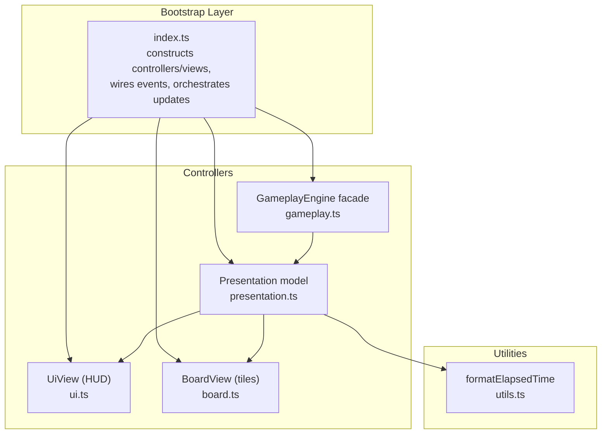
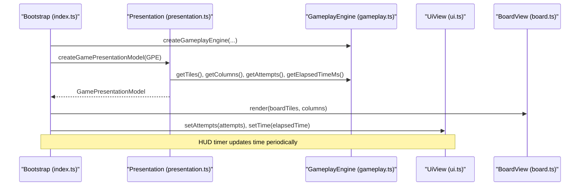
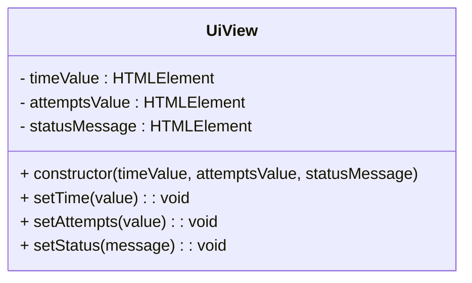
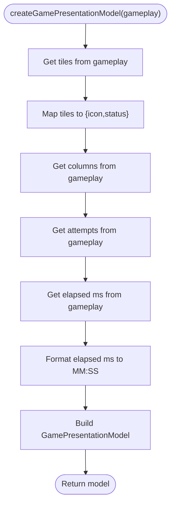
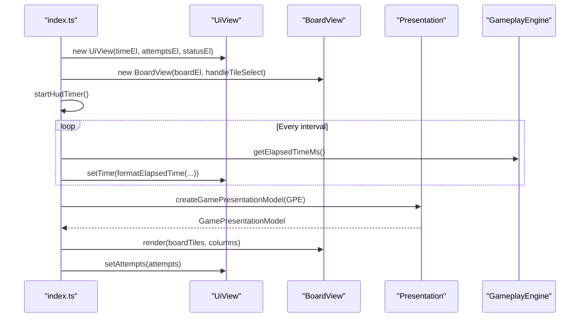
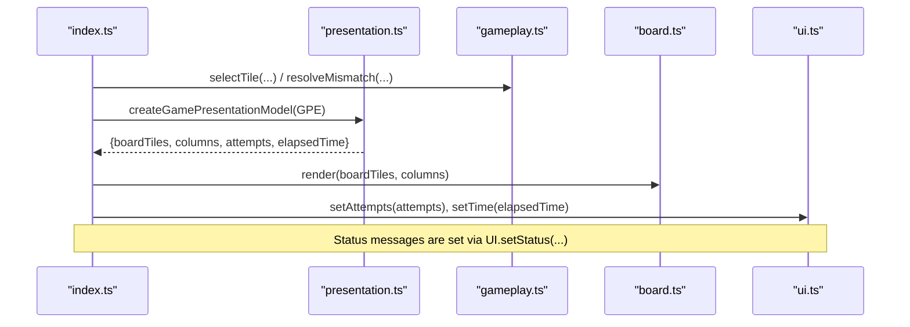
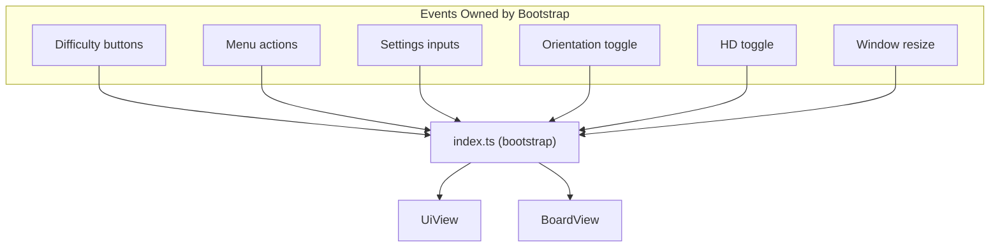
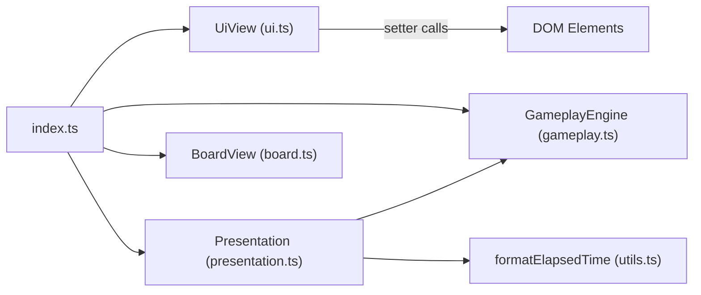

# UI Controllers and Views

<cite>
**Referenced Files in This Document**
- [ui.ts](file://src/ui.ts)
- [index.ts](file://src/index.ts)
- [presentation.ts](file://src/presentation.ts)
- [board.ts](file://src/board.ts)
- [gameplay.ts](file://src/gameplay.ts)
- [utils.ts](file://src/utils.ts)
- [README.md](file://README.md)
- [ui.test.ts](file://tests/ui.test.ts)
- [presentation.test.ts](file://tests/presentation.test.ts)
</cite>

## Table of Contents
1. [Introduction](#introduction)
2. [Project Structure](#project-structure)
3. [Core Components](#core-components)
4. [Architecture Overview](#architecture-overview)
5. [Detailed Component Analysis](#detailed-component-analysis)
6. [Dependency Analysis](#dependency-analysis)
7. [Performance Considerations](#performance-considerations)
8. [Troubleshooting Guide](#troubleshooting-guide)
9. [Conclusion](#conclusion)

## Introduction
This document explains the UI controller architecture with a focus on the UiView class for HUD display management, the separation of presentation logic from view rendering, and the bootstrap layer coordination that wires events and synchronizes state. It covers:
- UiView responsibilities for time tracking, attempt counting, and status messaging
- Presentation.ts transforming game state into UI-ready models
- Event delegation patterns and controller-view communication
- State synchronization mechanisms and error handling strategies
- Examples of controller initialization, update propagation, and scoped responsibility enforcement

## Project Structure
The UI architecture centers on a bootstrap layer that constructs controllers and views, wires events, and orchestrates state updates. Views are display-only and receive updates via setter methods from controllers. Presentation logic transforms game state into a compact model for UI consumption.

**Diagram sources**
- [index.ts:809-816](file://src/index.ts#L809-L816)
- [presentation.ts:12-24](file://src/presentation.ts#L12-L24)
- [ui.ts:15-48](file://src/ui.ts#L15-L48)
- [board.ts:121-306](file://src/board.ts#L121-L306)
- [utils.ts:44-58](file://src/utils.ts#L44-L58)

**Section sources**
- [index.ts:809-816](file://src/index.ts#L809-L816)
- [README.md:208-217](file://README.md#L208-L217)

## Core Components
- UiView: A display-only view responsible for updating the HUD’s time, attempts, and status text. It accepts DOM elements in the constructor and exposes setters for the bootstrap layer to push updates.
- Presentation model: Transforms gameplay state into a compact model for UI consumption, including board tiles, column count, attempts, and formatted elapsed time.
- Bootstrap layer: Wires events, manages timers, and coordinates controller-view updates. It creates UiView and delegates rendering to BoardView and UiView based on the presentation model.

Key responsibilities:
- UiView: Updates DOM text content for time, attempts, and status.
- Presentation model: Maps gameplay state to UI-friendly fields and formats time.
- Bootstrap layer: Initializes controllers, binds events, starts/stops HUD timer, and triggers render.

**Section sources**
- [ui.ts:15-48](file://src/ui.ts#L15-L48)
- [presentation.ts:5-24](file://src/presentation.ts#L5-L24)
- [index.ts:809-816](file://src/index.ts#L809-L816)

## Architecture Overview
The architecture enforces a strict separation of concerns:
- Views (UiView, BoardView) are output-only and do not accept event callbacks in their constructors.
- Controllers orchestrate state and trigger view updates.
- Presentation logic isolates UI concerns from game mechanics.

**Diagram sources**
- [index.ts:781-807](file://src/index.ts#L781-L807)
- [presentation.ts:12-24](file://src/presentation.ts#L12-L24)
- [gameplay.ts:28-41](file://src/gameplay.ts#L28-L41)
- [ui.ts:37-47](file://src/ui.ts#L37-L47)
- [board.ts:227-306](file://src/board.ts#L227-L306)

## Detailed Component Analysis

### UiView: HUD Display Management
UiView is a display-only view that updates three DOM elements:
- timeValue: formatted elapsed time string
- attemptsValue: integer attempts count
- statusMessage: status or win message text

It is constructed with three DOM elements and exposes setters for the bootstrap layer to push updates. The bootstrap layer is solely responsible for event wiring and invoking UiView setters.

**Diagram sources**
- [ui.ts:15-48](file://src/ui.ts#L15-L48)

**Section sources**
- [ui.ts:15-48](file://src/ui.ts#L15-L48)
- [README.md:208-217](file://README.md#L208-L217)
- [ui.test.ts:6-27](file://tests/ui.test.ts#L6-L27)

### Presentation Model: Game State Transformations for UI
Presentation.ts defines a GamePresentationModel and a factory that transforms gameplay state into UI-ready fields:
- boardTiles: simplified tile view models (icon and status)
- columns: board column count
- attempts: number of attempts
- elapsedTime: formatted elapsed time string

The factory reads from GameplayEngine and delegates time formatting to utils.formatElapsedTime.

**Diagram sources**
- [presentation.ts:12-24](file://src/presentation.ts#L12-L24)
- [utils.ts:44-58](file://src/utils.ts#L44-L58)

**Section sources**
- [presentation.ts:5-24](file://src/presentation.ts#L5-L24)
- [presentation.test.ts:6-35](file://tests/presentation.test.ts#L6-L35)

### Bootstrap Layer Coordination and Event Wiring
The bootstrap layer (index.ts) coordinates:
- Construction of UiView with HUD DOM elements
- Creation of BoardView with a tile-select handler
- Timer loop to update HUD time
- Rendering pipeline that pushes data to BoardView and UiView
- Event wiring for menus, settings, orientation, HD mode, and window resizing

**Diagram sources**
- [index.ts:809-816](file://src/index.ts#L809-L816)
- [index.ts:482-496](file://src/index.ts#L482-L496)
- [index.ts:781-807](file://src/index.ts#L781-L807)

**Section sources**
- [index.ts:809-816](file://src/index.ts#L809-L816)
- [index.ts:482-496](file://src/index.ts#L482-L496)
- [index.ts:781-807](file://src/index.ts#L781-L807)

### Controller-View Communication and State Synchronization
- Presentation model drives both BoardView and UiView updates.
- BoardView is stateless with respect to gameplay; it renders based on the tiles and columns provided by the presentation model.
- UiView is stateless and only updates DOM text content based on setters invoked by the bootstrap layer.

**Diagram sources**
- [index.ts:781-807](file://src/index.ts#L781-L807)
- [presentation.ts:12-24](file://src/presentation.ts#L12-L24)
- [board.ts:227-306](file://src/board.ts#L227-L306)
- [ui.ts:37-47](file://src/ui.ts#L37-L47)

**Section sources**
- [index.ts:781-807](file://src/index.ts#L781-L807)
- [board.ts:227-306](file://src/board.ts#L227-L306)
- [ui.ts:37-47](file://src/ui.ts#L37-L47)

### Event Delegation Patterns and Scoped Responsibility
- UiView and BoardView are display-only and do not accept event callbacks in their constructors.
- All event wiring is centralized in the bootstrap layer (index.ts), including:
  - Difficulty selection
  - Menu navigation
  - Settings interactions
  - Orientation and HD mode toggles
  - Window resize handling
- Controllers (e.g., SettingsController) manage state and expose methods to bootstrap for applying changes.

**Diagram sources**
- [README.md:208-217](file://README.md#L208-L217)
- [index.ts:975-1068](file://src/index.ts#L975-L1068)

**Section sources**
- [README.md:208-217](file://README.md#L208-L217)
- [index.ts:975-1068](file://src/index.ts#L975-L1068)

### Examples: Controller Initialization, Update Propagation, and Error Handling
- Controller initialization: The bootstrap layer constructs controllers and initializes them (e.g., settings controller, audio UI controller, window resize controller).
- Update propagation: The render function builds a presentation model from gameplay and pushes updates to BoardView and UiView.
- Error handling: The bootstrap layer catches initialization failures and logs them; HUD timer uses AbortController to cancel intervals safely; mismatch resolution uses timeouts with abort signals.

Example references:
- Bootstrap initialization and error handling: [index.ts:1074-1100](file://src/index.ts#L1074-L1100)
- HUD timer lifecycle: [index.ts:482-496](file://src/index.ts#L482-L496)
- Render and presentation model usage: [index.ts:781-807](file://src/index.ts#L781-L807), [presentation.ts:12-24](file://src/presentation.ts#L12-L24)

**Section sources**
- [index.ts:1074-1100](file://src/index.ts#L1074-L1100)
- [index.ts:482-496](file://src/index.ts#L482-L496)
- [index.ts:781-807](file://src/index.ts#L781-L807)
- [presentation.ts:12-24](file://src/presentation.ts#L12-L24)

## Dependency Analysis
UiView depends on DOM elements and has no external dependencies aside from the bootstrap layer wiring. Presentation model depends on GameplayEngine and formatting utilities. The bootstrap layer composes all pieces and manages the update cycle.

**Diagram sources**
- [ui.ts:15-48](file://src/ui.ts#L15-L48)
- [presentation.ts:12-24](file://src/presentation.ts#L12-L24)
- [utils.ts:44-58](file://src/utils.ts#L44-L58)
- [index.ts:809-816](file://src/index.ts#L809-L816)
- [board.ts:121-306](file://src/board.ts#L121-L306)
- [gameplay.ts:28-41](file://src/gameplay.ts#L28-L41)

**Section sources**
- [ui.ts:15-48](file://src/ui.ts#L15-L48)
- [presentation.ts:12-24](file://src/presentation.ts#L12-L24)
- [utils.ts:44-58](file://src/utils.ts#L44-L58)
- [index.ts:809-816](file://src/index.ts#L809-L816)
- [board.ts:121-306](file://src/board.ts#L121-L306)
- [gameplay.ts:28-41](file://src/gameplay.ts#L28-L41)

## Performance Considerations
- Lazy back-face rendering in BoardView avoids unnecessary DOM work and image fetches for hidden tiles.
- Back-face cache is reset at the start of new games to prevent stale icons from previous sessions.
- HUD timer uses AbortController to cancel intervals promptly, preventing wasted work when the game ends or switches frames.
- Presentation model construction is lightweight, mapping only essential fields for UI consumption.

[No sources needed since this section provides general guidance]

## Troubleshooting Guide
Common issues and strategies:
- HUD not updating: Verify the HUD timer is running and UiView setters are called from the render pipeline.
- Incorrect time display: Ensure elapsed time is passed through formatElapsedTime and that negative values are clamped.
- Tiles not reflecting state: Confirm render is invoked after gameplay state changes and BoardView receives the correct presentation model.
- Event wiring confusion: Remember that UiView and BoardView do not accept event callbacks; all wiring is in the bootstrap layer.

**Section sources**
- [index.ts:482-496](file://src/index.ts#L482-L496)
- [utils.ts:44-58](file://src/utils.ts#L44-L58)
- [board.ts:227-306](file://src/board.ts#L227-L306)
- [README.md:208-217](file://README.md#L208-L217)

## Conclusion
The UI controller architecture cleanly separates presentation logic from view rendering and enforces a strict bootstrap-layer ownership of events and state synchronization. UiView focuses on HUD updates, presentation logic transforms gameplay state for UI consumption, and the bootstrap layer orchestrates rendering and user interactions. This design yields maintainable, testable, and predictable UI behavior.