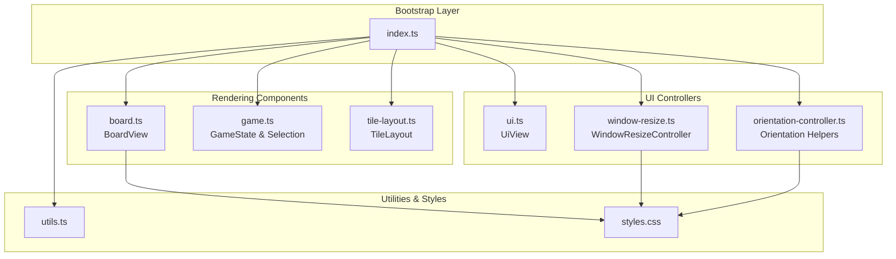
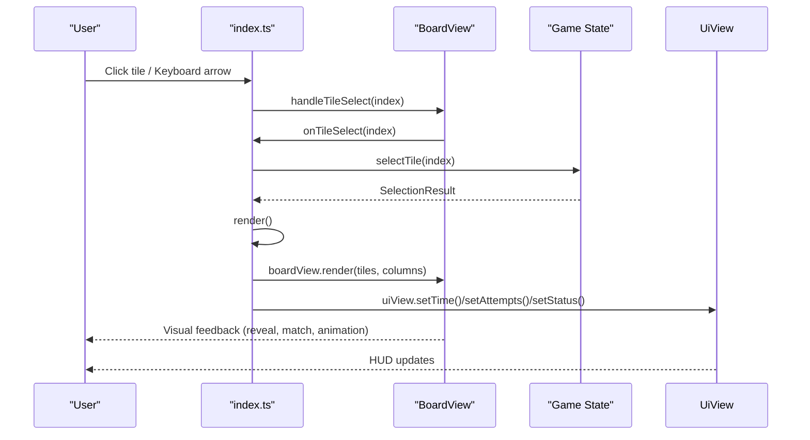
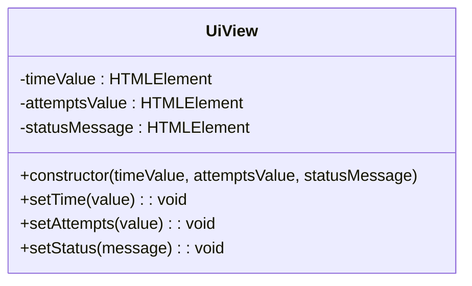
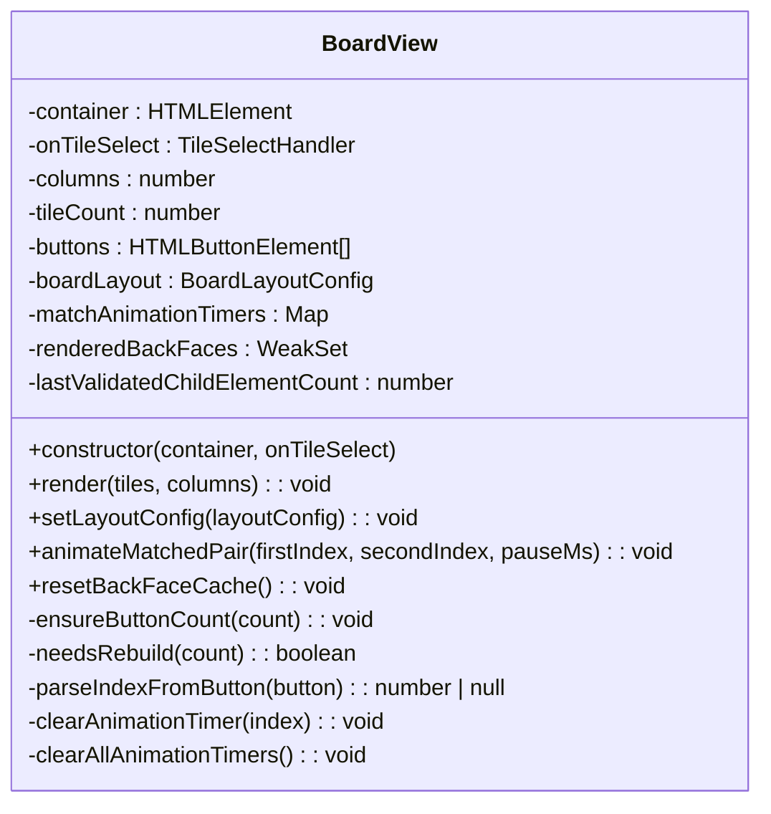
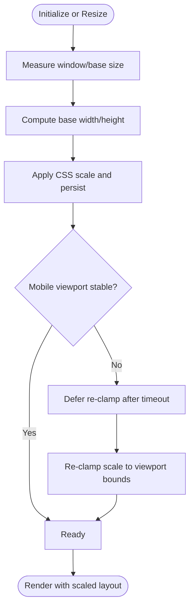
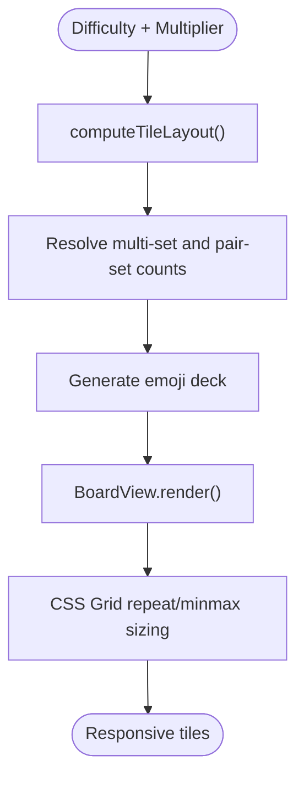
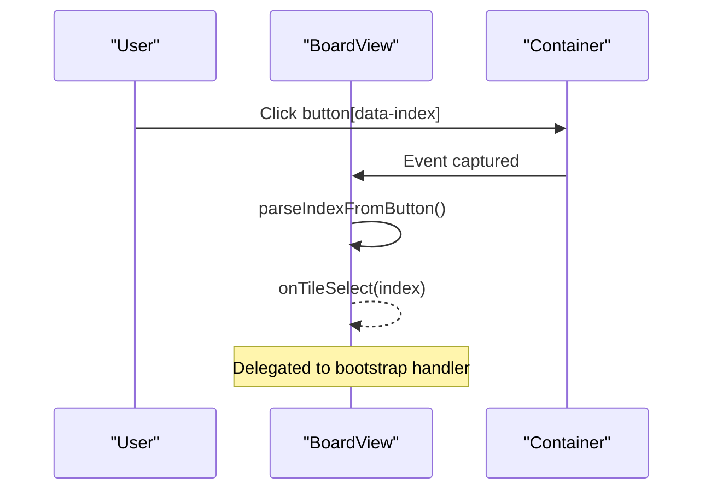
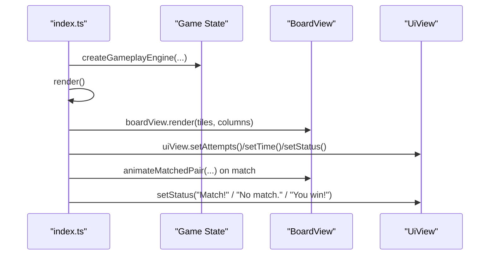
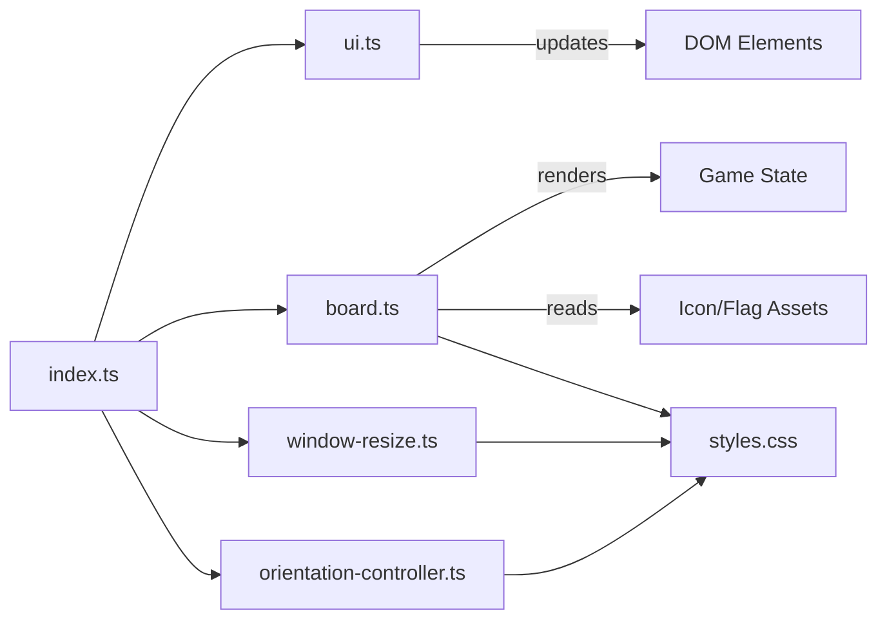

# User Interface System

<cite>
**Referenced Files in This Document**
- [ui.ts](file://src/ui.ts)
- [board.ts](file://src/board.ts)
- [index.ts](file://src/index.ts)
- [tile-layout.ts](file://src/tile-layout.ts)
- [window-resize.ts](file://src/window-resize.ts)
- [orientation-controller.ts](file://src/orientation-controller.ts)
- [game.ts](file://src/game.ts)
- [utils.ts](file://src/utils.ts)
- [styles.css](file://styles.css)
</cite>

## Table of Contents
1. [Introduction](#introduction)
2. [Project Structure](#project-structure)
3. [Core Components](#core-components)
4. [Architecture Overview](#architecture-overview)
5. [Detailed Component Analysis](#detailed-component-analysis)
6. [Dependency Analysis](#dependency-analysis)
7. [Performance Considerations](#performance-considerations)
8. [Troubleshooting Guide](#troubleshooting-guide)
9. [Conclusion](#conclusion)

## Introduction
This document describes the user interface architecture for the application, focusing on the separation between UI controllers and rendering components. The UI system is organized around two primary concerns:
- Controllers and orchestration: centralized in the bootstrap layer, which wires events, manages sessions, and synchronizes state between the UI and the game engine.
- Rendering and presentation: delegated to dedicated view classes that translate game state into DOM updates and animations.

Two key rendering components are central to the UI:
- UI.ts: Provides a simple, display-only view for HUD elements (time, attempts, status).
- Board.ts: Manages the interactive tile board, including tile layout, CSS Grid integration, animations, and accessibility attributes.

Responsive design is handled by a dedicated resize controller and orientation-aware logic, ensuring the board adapts to window size, orientation changes, and mobile constraints. The system coordinates event delegation, animation timing, and visual feedback while maintaining cross-browser compatibility.

## Project Structure
The UI system spans several modules:
- Bootstrap and orchestration: index.ts orchestrates UI wiring, session management, and state synchronization.
- UI rendering:
  - ui.ts: HUD display view.
  - board.ts: Interactive tile board renderer.
- Responsive design:
  - window-resize.ts: Window scaling and resize handle interaction.
  - orientation-controller.ts: Orientation mode switching and layout adjustments.
- Game state and layout:
  - game.ts: Core game state machine and selection logic.
  - tile-layout.ts: Tile count and distribution calculations.
- Utilities and styles:
  - utils.ts: Shared helpers (formatting, clamping, wheel scrolling).
  - styles.css: Global styles, responsive units, and CSS variables for animations and layout.

**Diagram sources**
- [index.ts:1074-1100](file://src/index.ts#L1074-L1100)
- [ui.ts:15-48](file://src/ui.ts#L15-L48)
- [board.ts:121-522](file://src/board.ts#L121-L522)
- [window-resize.ts:38-297](file://src/window-resize.ts#L38-L297)
- [orientation-controller.ts:1-105](file://src/orientation-controller.ts#L1-L105)
- [game.ts:61-243](file://src/game.ts#L61-L243)
- [tile-layout.ts:36-53](file://src/tile-layout.ts#L36-L53)
- [utils.ts:1-145](file://src/utils.ts#L1-L145)
- [styles.css:1-200](file://styles.css#L1-L200)

**Section sources**
- [index.ts:1074-1100](file://src/index.ts#L1074-L1100)
- [styles.css:1-200](file://styles.css#L1-L200)

## Core Components
- UiView (HUD display):
  - Purpose: Pushes formatted time, attempt count, and status messages to DOM elements.
  - Interaction: Receives updates from the bootstrap layer; does not accept event callbacks.
  - Responsibilities: Text content updates only; no interactivity.
- BoardView (tile board):
  - Purpose: Renders tiles with 3D block visuals, handles click and keyboard navigation, applies animations, and maintains accessibility attributes.
  - Interaction: Listens for clicks and keydown on the container; delegates tile selection to a handler.
  - Layout: Uses CSS Grid with dynamic repeat and minmax sizing; supports responsive tile sizes and gaps.
  - Animation: Coordinates matched-pair disappearance with timers and CSS classes.
  - Accessibility: Uses aria-labels, aria-pressed, and aria-hidden semantics; flag emojis include alt text fallbacks.

**Section sources**
- [ui.ts:15-48](file://src/ui.ts#L15-L48)
- [board.ts:121-522](file://src/board.ts#L121-L522)

## Architecture Overview
The UI follows a strict separation of concerns:
- Bootstrap layer (index.ts) manages:
  - DOM wiring and event delegation.
  - Session lifecycle (menu, game, debug-tiles).
  - State synchronization between the game engine and UI views.
  - Responsive behavior via window resize controller and orientation helpers.
- Rendering components (ui.ts, board.ts) focus solely on DOM updates and presentation.

**Diagram sources**
- [index.ts:639-779](file://src/index.ts#L639-L779)
- [board.ts:155-225](file://src/board.ts#L155-L225)
- [game.ts:159-243](file://src/game.ts#L159-L243)
- [ui.ts:37-47](file://src/ui.ts#L37-L47)

## Detailed Component Analysis

### UiView (HUD Display)
UiView encapsulates display-only responsibilities:
- Accepts three DOM elements in the constructor and exposes setters for time, attempts, and status.
- No event wiring or interactive behavior; all event binding is performed in the bootstrap layer.
- Ensures clean separation between presentation and interaction.

**Diagram sources**
- [ui.ts:15-48](file://src/ui.ts#L15-L48)

**Section sources**
- [ui.ts:15-48](file://src/ui.ts#L15-L48)

### BoardView (Interactive Tile Board)
BoardView renders and animates the tile board:
- Container-level event delegation:
  - Clicks on tiles bubble to the container and are routed to the tile selection handler via dataset parsing.
  - Keyboard navigation supports arrow keys for moving focus across tiles in grid order.
- Lazy back-face rendering:
  - Back faces are rendered only when tiles become revealed or matched to avoid unnecessary DOM work and image fetches.
  - A WeakSet tracks rendered back faces to prevent stale reuse across games.
- CSS Grid layout:
  - Calculates board width and sets grid-template-columns with repeat and minmax to achieve responsive sizing.
  - Supports configurable layout parameters (tile size, gaps, padding).
- Animation coordination:
  - Matched pairs trigger a delayed disappearance animation using timeouts and CSS classes.
  - Timers are tracked and cleared to prevent conflicts during rapid interactions.
- Accessibility:
  - Buttons include aria-labels derived from tile index and icon metadata.
  - aria-pressed reflects tile state; faces are marked aria-hidden to avoid redundant announcements.
  - Flag emoji tiles include alt text fallbacks for screen readers.

**Diagram sources**
- [board.ts:121-522](file://src/board.ts#L121-L522)

**Section sources**
- [board.ts:121-522](file://src/board.ts#L121-L522)

### Responsive Design and Mobile Adaptation
Responsive behavior is managed by two complementary systems:
- WindowResizeController:
  - Initializes base dimensions and applies a CSS variable scale factor to the app shell.
  - Supports pointer-based resizing with persistent scale storage.
  - Clamps scale to viewport bounds and deferred re-clamping for mobile stability.
  - Reacts to window and visual viewport resize events.
- OrientationController:
  - Persists orientation mode and updates the app shell dataset.
  - Swaps difficulty rows/columns for portrait mode and adjusts resize configuration accordingly.
  - Updates UI elements (toggle button icons and labels) for orientation changes.

**Diagram sources**
- [window-resize.ts:108-151](file://src/window-resize.ts#L108-L151)
- [window-resize.ts:196-232](file://src/window-resize.ts#L196-L232)
- [orientation-controller.ts:66-76](file://src/orientation-controller.ts#L66-L76)

**Section sources**
- [window-resize.ts:38-297](file://src/window-resize.ts#L38-L297)
- [orientation-controller.ts:1-105](file://src/orientation-controller.ts#L1-L105)

### Tile Layout System and CSS Grid Integration
Tile layout is computed independently and fed into the board renderer:
- TileLayout computes:
  - Total tile count, multi-set and pair-set counts, and copies per icon.
  - Multiplier clamping ensures valid distributions for the chosen difficulty and tile count.
- BoardView integrates layout into CSS Grid:
  - Calculates board width from columns and layout config.
  - Sets grid-template-columns with repeat and minmax to maintain responsive tile sizing.
  - Adjusts layout dynamically via setLayoutConfig.

**Diagram sources**
- [tile-layout.ts:36-53](file://src/tile-layout.ts#L36-L53)
- [board.ts:227-306](file://src/board.ts#L227-L306)

**Section sources**
- [tile-layout.ts:12-53](file://src/tile-layout.ts#L12-L53)
- [board.ts:122-126](file://src/board.ts#L122-L126)
- [board.ts:227-306](file://src/board.ts#L227-L306)

### Event Delegation Patterns and Accessibility
- Event delegation:
  - BoardView listens at the container level for click and keydown events, parsing the tile index from dataset attributes.
  - Keyboard navigation moves focus across tiles using arrow keys and respects grid boundaries.
- Accessibility:
  - Buttons expose aria-labels describing tile identity and state.
  - aria-pressed communicates pressed/revealed state.
  - Tile faces are marked aria-hidden; flag emoji tiles include alt text fallbacks.
  - Orientation toggle button updates aria-label and icon visibility based on mode.

**Diagram sources**
- [board.ts:159-175](file://src/board.ts#L159-L175)
- [board.ts:177-224](file://src/board.ts#L177-L224)

**Section sources**
- [board.ts:155-225](file://src/board.ts#L155-L225)
- [orientation-controller.ts:50-60](file://src/orientation-controller.ts#L50-L60)

### Cross-Browser Compatibility Strategies
- Pointer events for resize handle:
  - Uses pointerdown/up/cancel and pointermove with capture/release to support touch and mouse.
- Wheel scrolling:
  - Horizontal wheel scrolling enabled for overflow containers.
  - Slider wheel scrolling enabled for range inputs with synthetic input dispatch.
- Visual viewport awareness:
  - Defers scale clamping until viewport dimensions settle on mobile devices.
- CSS variables and modern units:
  - Uses clamp(), cqw, and dvh to improve responsiveness across devices.

**Section sources**
- [window-resize.ts:236-296](file://src/window-resize.ts#L236-L296)
- [utils.ts:113-130](file://src/utils.ts#L113-L130)
- [utils.ts:81-103](file://src/utils.ts#L81-L103)
- [styles.css:134-140](file://styles.css#L134-L140)

### Component Lifecycle Management and State Synchronization
- Lifecycle:
  - Bootstrap initializes controllers, loads runtime configuration, applies orientation and HD modes, and renders the initial state.
  - WindowResizeController is attached early and initialized after layout.
- State synchronization:
  - The bootstrap layer creates a presentation model from the game engine and pushes updates to UiView and BoardView.
  - On tile selection, the engine returns a selection result; the bootstrap layer updates UI and triggers animations.
  - Mismatch resolution is scheduled with timeouts and canceled appropriately to avoid conflicts.

**Diagram sources**
- [index.ts:781-807](file://src/index.ts#L781-L807)
- [index.ts:706-779](file://src/index.ts#L706-L779)
- [game.ts:159-243](file://src/game.ts#L159-L243)
- [board.ts:331-354](file://src/board.ts#L331-L354)

**Section sources**
- [index.ts:781-807](file://src/index.ts#L781-L807)
- [index.ts:639-779](file://src/index.ts#L639-L779)
- [game.ts:159-243](file://src/game.ts#L159-L243)

## Dependency Analysis
The UI system exhibits low coupling and high cohesion:
- ui.ts depends only on DOM elements passed at construction.
- board.ts depends on:
  - Game state models (from the bootstrap layer) for rendering.
  - Utility assets for flag emoji and icon packs.
  - CSS for styling and animations.
- index.ts orchestrates all dependencies, wiring events, managing sessions, and coordinating rendering.
- window-resize.ts and orientation-controller.ts are self-contained and injectable, minimizing coupling to the bootstrap layer.

**Diagram sources**
- [ui.ts:15-48](file://src/ui.ts#L15-L48)
- [board.ts:121-522](file://src/board.ts#L121-L522)
- [index.ts:1074-1100](file://src/index.ts#L1074-L1100)
- [window-resize.ts:38-297](file://src/window-resize.ts#L38-L297)
- [orientation-controller.ts:66-76](file://src/orientation-controller.ts#L66-L76)
- [styles.css:1-200](file://styles.css#L1-L200)

**Section sources**
- [index.ts:1074-1100](file://src/index.ts#L1074-L1100)
- [board.ts:121-522](file://src/board.ts#L121-L522)

## Performance Considerations
- Lazy rendering:
  - Back-face rendering is deferred until tiles are revealed or matched, reducing DOM work and network requests.
- Efficient DOM updates:
  - BoardView caches button elements and validates child counts to avoid full scans on every render.
- Animation timers:
  - Matched-pair animations use targeted timers and are cleared promptly to prevent accumulation.
- CSS Grid and variables:
  - CSS Grid repeat and minmax provide efficient layout recalculation; CSS variables centralize animation timing and opacity for consistent performance.
- Mobile stability:
  - Deferred re-clamping and visual viewport awareness prevent jank during orientation changes.

[No sources needed since this section provides general guidance]

## Troubleshooting Guide
- Tiles not responding to clicks:
  - Verify the container’s click handler is attached and that buttons have the correct data-index attribute.
  - Ensure the tile selection handler is wired to BoardView.
- Keyboard navigation not working:
  - Confirm the container listens for keydown and that the target is a button with data-index.
- Animations not triggering:
  - Check that animateMatchedPair is invoked with correct indices and that CSS classes are present.
- Orientation toggle not updating:
  - Ensure orientation mode is persisted and applied to the app shell dataset; verify layout config is updated for the board.
- Resizing issues:
  - Confirm the resize handle events are bound and that initialize() is called after layout; check deferred clamping on mobile.

**Section sources**
- [board.ts:159-225](file://src/board.ts#L159-L225)
- [board.ts:331-354](file://src/board.ts#L331-L354)
- [orientation-controller.ts:66-76](file://src/orientation-controller.ts#L66-L76)
- [window-resize.ts:75-101](file://src/window-resize.ts#L75-L101)

## Conclusion
The UI system cleanly separates controllers from rendering components, enabling maintainable and testable code. UiView focuses on HUD updates, while BoardView manages interactive tiles, animations, and accessibility. Responsive behavior is handled by dedicated controllers that integrate with CSS Grid and CSS variables for robust cross-device compatibility. The bootstrap layer orchestrates state synchronization between the UI and the game engine, ensuring a cohesive user experience across desktop and mobile environments.