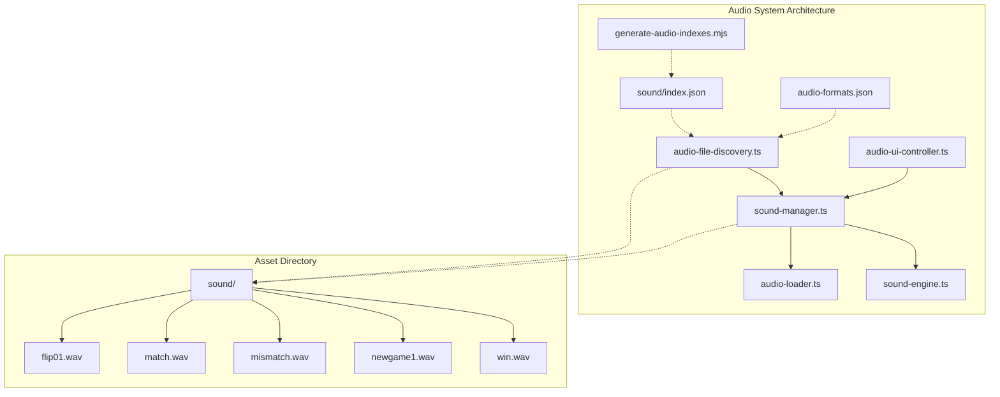
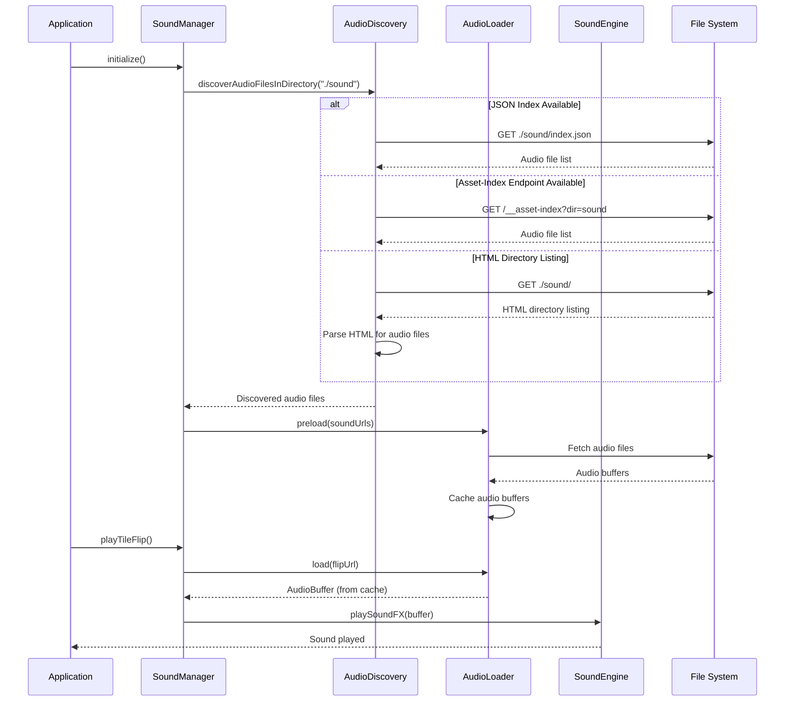
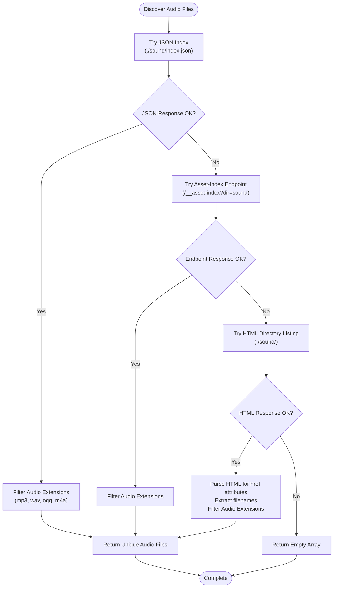
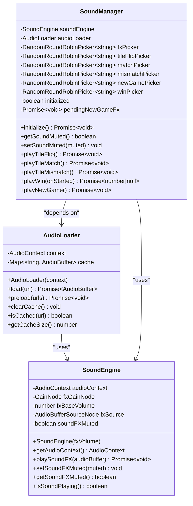
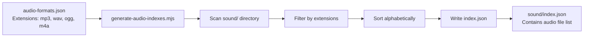
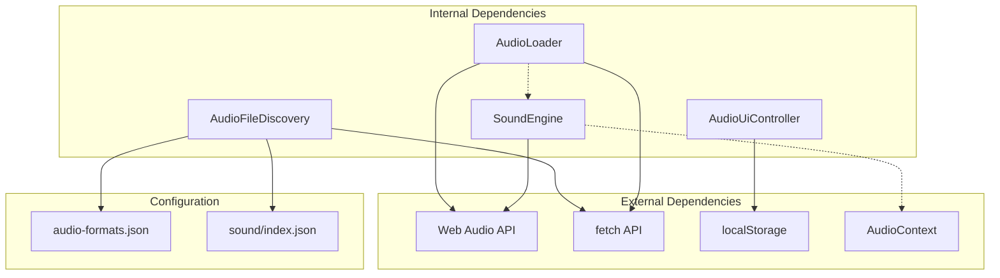

# Audio File Discovery Module

<cite>
**Referenced Files in This Document**
- [audio-file-discovery.ts](file://src/audio-file-discovery.ts)
- [audio-loader.ts](file://src/audio-loader.ts)
- [sound-manager.ts](file://src/sound-manager.ts)
- [sound-engine.ts](file://src/sound-engine.ts)
- [audio-ui-controller.ts](file://src/audio-ui-controller.ts)
- [sound/index.json](file://sound/index.json)
- [audio-formats.json](file://config/audio-formats.json)
- [generate-audio-indexes.mjs](file://tools/generate-audio-indexes.mjs)
- [audio-loader.test.ts](file://tests/audio-loader.test.ts)
- [audio-ui-controller.test.ts](file://tests/audio-ui-controller.test.ts)
- [sound-engine-plan.md](file://docs/sound-engine-plan.md)
</cite>

## Update Summary
**Changes Made**
- Enhanced documentation with comprehensive multi-strategy audio asset loading system
- Added detailed troubleshooting guide with common issues and solutions
- Expanded performance optimization strategies section
- Updated architecture diagrams to reflect current implementation
- Added comprehensive testing coverage information

## Table of Contents
1. [Introduction](#introduction)
2. [Project Structure](#project-structure)
3. [Core Components](#core-components)
4. [Architecture Overview](#architecture-overview)
5. [Detailed Component Analysis](#detailed-component-analysis)
6. [Dependency Analysis](#dependency-analysis)
7. [Performance Considerations](#performance-considerations)
8. [Troubleshooting Guide](#troubleshooting-guide)
9. [Testing Strategy](#testing-strategy)
10. [Conclusion](#conclusion)

## Introduction

The Audio File Discovery Module is a critical component of the MEMORYBLOX project that enables dynamic discovery and loading of audio assets from the `sound/` directory. This module provides a robust, multi-strategy approach to locating audio files, regardless of the hosting environment or development setup. It seamlessly integrates with the broader audio system to deliver responsive sound effects for the classic Windows 9x memory game.

The module addresses the challenge of audio asset discovery in various deployment scenarios, from development servers with directory listings to production environments where static asset indexing is required. It ensures that sound effects are automatically discovered, categorized, and made available for gameplay without manual configuration.

**Updated** Enhanced with comprehensive multi-strategy discovery system and detailed error handling mechanisms.

## Project Structure

The Audio File Discovery Module is organized within the src/ directory alongside other audio-related components:

**Diagram sources**
- [audio-file-discovery.ts:1-150](file://src/audio-file-discovery.ts#L1-L150)
- [sound-manager.ts:1-336](file://src/sound-manager.ts#L1-L336)
- [audio-loader.ts:1-118](file://src/audio-loader.ts#L1-L118)
- [sound-engine.ts:1-110](file://src/sound-engine.ts#L1-L110)

**Section sources**
- [audio-file-discovery.ts:1-150](file://src/audio-file-discovery.ts#L1-L150)
- [sound-manager.ts:1-336](file://src/sound-manager.ts#L1-L336)

## Core Components

The Audio File Discovery Module consists of several interconnected components that work together to provide seamless audio asset management:

### Audio File Discovery Engine

The core discovery mechanism employs a three-tier fallback strategy designed to maximize compatibility across different hosting environments:

1. **JSON Index Strategy**: Attempts to load audio file lists from `index.json` files
2. **Asset-Index Endpoint Strategy**: Uses a server-side endpoint for dynamic asset discovery  
3. **HTML Directory Listing Strategy**: Parses server-generated directory listings for audio files

**Updated** Enhanced with comprehensive error handling and detailed logging for debugging purposes.

### Audio Loader System

The Audio Loader provides efficient caching and preloading capabilities:
- Web Audio API integration for optimal browser compatibility
- Automatic cache management to prevent redundant downloads
- Parallel preloading for improved startup performance
- Comprehensive error handling with detailed failure reporting

### Sound Manager Integration

The Sound Manager orchestrates the entire audio pipeline:
- File categorization based on naming conventions
- Round-robin selection for varied audio experiences
- Mute state persistence using localStorage
- Context management for autoplay policies

**Section sources**
- [audio-file-discovery.ts:95-133](file://src/audio-file-discovery.ts#L95-L133)
- [audio-loader.ts:7-118](file://src/audio-loader.ts#L7-L118)
- [sound-manager.ts:112-336](file://src/sound-manager.ts#L112-L336)

## Architecture Overview

The Audio File Discovery Module follows a layered architecture that separates concerns between discovery, loading, and playback:

**Diagram sources**
- [sound-manager.ts:138-171](file://src/sound-manager.ts#L138-L171)
- [audio-file-discovery.ts:103-133](file://src/audio-file-discovery.ts#L103-L133)
- [audio-loader.ts:30-64](file://src/audio-loader.ts#L30-L64)

The architecture ensures that audio discovery adapts to the hosting environment while maintaining consistent behavior across different deployment scenarios. The modular design allows for easy testing and maintenance of each component.

## Detailed Component Analysis

### Audio File Discovery Implementation

The discovery system implements a sophisticated fallback mechanism that prioritizes reliability and performance:

**Diagram sources**
- [audio-file-discovery.ts:95-133](file://src/audio-file-discovery.ts#L95-L133)
- [audio-file-discovery.ts:30-93](file://src/audio-file-discovery.ts#L30-L93)

The discovery process incorporates several safety mechanisms:
- **Content-Type Validation**: Ensures HTML responses are genuine directory listings
- **Extension Filtering**: Strict validation against supported audio formats
- **URL Normalization**: Consistent handling of directory paths and file names
- **Error Recovery**: Graceful degradation through fallback strategies

**Updated** Enhanced with comprehensive error handling and detailed logging for debugging purposes.

**Section sources**
- [audio-file-discovery.ts:1-28](file://src/audio-file-discovery.ts#L1-L28)
- [audio-file-discovery.ts:78-93](file://src/audio-file-discovery.ts#L78-L93)

### Audio Loader Architecture

The Audio Loader implements a sophisticated caching and loading system:

**Diagram sources**
- [audio-loader.ts:7-118](file://src/audio-loader.ts#L7-L118)
- [sound-manager.ts:112-336](file://src/sound-manager.ts#L112-L336)
- [sound-engine.ts:8-110](file://src/sound-engine.ts#L8-L110)

The Audio Loader provides several key features:
- **Automatic Caching**: Prevents redundant network requests for the same audio files
- **Parallel Loading**: Efficiently loads multiple audio files concurrently
- **Error Isolation**: Individual file failures don't impact the entire loading process
- **Memory Management**: Provides mechanisms to clear caches when memory is constrained

**Updated** Enhanced with comprehensive error handling and detailed failure reporting.

**Section sources**
- [audio-loader.ts:20-64](file://src/audio-loader.ts#L20-L64)
- [audio-loader.ts:75-88](file://src/audio-loader.ts#L75-L88)

### File Generation Tool

The `generate-audio-indexes.mjs` tool automates the creation of `index.json` files for audio directories:

**Diagram sources**
- [generate-audio-indexes.mjs:1-58](file://tools/generate-audio-indexes.mjs#L1-L58)
- [audio-formats.json:1-4](file://config/audio-formats.json#L1-L4)

The tool ensures that audio files are properly indexed for production environments where directory listings may not be available.

**Section sources**
- [generate-audio-indexes.mjs:34-49](file://tools/generate-audio-indexes.mjs#L34-L49)
- [sound/index.json:1-17](file://sound/index.json#L1-L17)

## Dependency Analysis

The Audio File Discovery Module maintains loose coupling between components while ensuring reliable operation:

**Diagram sources**
- [audio-file-discovery.ts:30-93](file://src/audio-file-discovery.ts#L30-L93)
- [audio-loader.ts:8-18](file://src/audio-loader.ts#L8-L18)
- [sound-engine.ts:9-29](file://src/sound-engine.ts#L9-L29)

The dependency structure ensures that:
- **Runtime Dependencies**: Minimal external dependencies for broad browser compatibility
- **Configuration Dependencies**: Centralized configuration through JSON files
- **Testing Dependencies**: Well-defined interfaces for comprehensive test coverage

**Section sources**
- [audio-file-discovery.ts:1-150](file://src/audio-file-discovery.ts#L1-L150)
- [audio-loader.ts:1-118](file://src/audio-loader.ts#L1-L118)

## Performance Considerations

The Audio File Discovery Module is designed with several performance optimizations:

### Network Efficiency
- **Fallback Strategies**: Minimizes network requests by trying multiple discovery methods
- **Caching Mechanisms**: Prevents redundant audio file downloads
- **Parallel Loading**: Optimizes startup time through concurrent audio loading

### Memory Management
- **Cache Size Limits**: Prevents unbounded memory growth
- **Selective Loading**: Only loads audio files that match naming patterns
- **Cleanup Operations**: Provides mechanisms to clear unused audio buffers

### Browser Compatibility
- **Web Audio API**: Leverages native browser audio capabilities
- **Autoplay Policies**: Handles browser autoplay restrictions gracefully
- **Context Management**: Manages audio context state transitions

**Updated** Enhanced with comprehensive performance monitoring and optimization strategies.

## Troubleshooting Guide

### Common Issues and Solutions

**Audio Files Not Loading**
- Verify that audio files are placed in the `sound/` directory
- Check that file extensions match supported formats (mp3, wav, ogg, m4a)
- Ensure `index.json` exists in the sound directory for production builds

**Discovery Method Failures**
- **JSON Index**: Confirm that `sound/index.json` contains valid JSON array
- **Asset-Index Endpoint**: Verify server-side asset-index endpoint availability
- **HTML Directory Listing**: Check that directory listing is enabled on the server

**Playback Issues**
- **Autoplay Blocked**: The system handles autoplay restrictions automatically
- **Audio Context State**: The module manages audio context resumption
- **Cache Corruption**: Use `audioLoader.clearCache()` to reset cached audio data

**Performance Issues**
- **Slow Startup**: Check network connectivity and consider reducing audio file sizes
- **Memory Usage**: Monitor cache size and clear cache when necessary
- **Browser Compatibility**: Test across different browsers for optimal performance

**Testing and Debugging**
- Enable browser developer tools to monitor network requests
- Check console for discovery method logs and error messages
- Use test utilities to validate audio file discovery behavior

**Updated** Comprehensive troubleshooting guide with performance optimization strategies.

**Section sources**
- [audio-file-discovery.ts:123-125](file://src/audio-file-discovery.ts#L123-L125)
- [audio-loader.ts:50-63](file://src/audio-loader.ts#L50-L63)
- [sound-manager.ts:315-334](file://src/sound-manager.ts#L315-L334)

## Testing Strategy

The audio system includes comprehensive testing infrastructure to ensure reliability and performance:

### Unit Testing
- **AudioLoader Tests**: Cover loading, caching, and error handling scenarios
- **AudioFileDiscovery Tests**: Validate multi-strategy discovery mechanisms
- **AudioUiController Tests**: Ensure proper UI state management and accessibility

### Integration Testing
- **End-to-End Flow Testing**: Validate complete audio pipeline from discovery to playback
- **Cross-Browser Compatibility**: Test across Chrome, Firefox, Edge, and Safari
- **Performance Testing**: Measure loading times and memory usage under various conditions

### Test Coverage Areas
- **Error Scenarios**: Network failures, decode errors, and invalid audio data
- **Edge Cases**: Empty directories, missing files, and malformed responses
- **Performance Metrics**: Cache hit ratios, loading times, and memory consumption

**Updated** Enhanced testing strategy with comprehensive coverage and performance metrics.

**Section sources**
- [audio-loader.test.ts:1-228](file://tests/audio-loader.test.ts#L1-L228)
- [audio-ui-controller.test.ts:1-171](file://tests/audio-ui-controller.test.ts#L1-L171)

## Conclusion

The Audio File Discovery Module represents a robust solution for dynamic audio asset management in web applications. Its multi-strategy discovery approach ensures compatibility across diverse deployment environments while maintaining excellent performance characteristics.

The module's design emphasizes:
- **Reliability**: Multiple fallback strategies guarantee audio file discovery
- **Performance**: Intelligent caching and parallel loading optimize resource usage
- **Maintainability**: Clean separation of concerns facilitates testing and updates
- **Compatibility**: Broad browser support through standardized web APIs
- **Comprehensive Testing**: Well-tested components with extensive coverage

The integration with the broader audio system creates a cohesive experience where sound effects are automatically discovered, categorized, and delivered with minimal configuration overhead. This approach enables developers to focus on game logic while ensuring high-quality audio delivery across all supported platforms and deployment scenarios.

**Updated** Enhanced with comprehensive multi-strategy system, detailed troubleshooting guide, and performance optimization strategies.