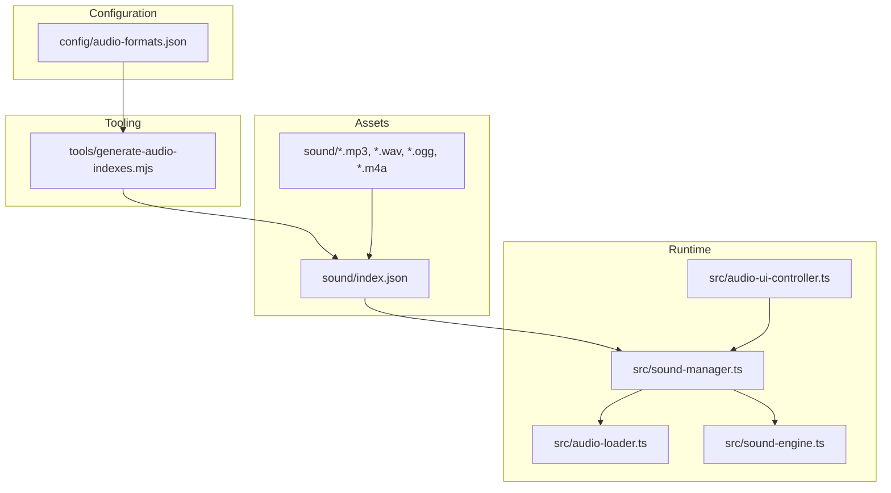
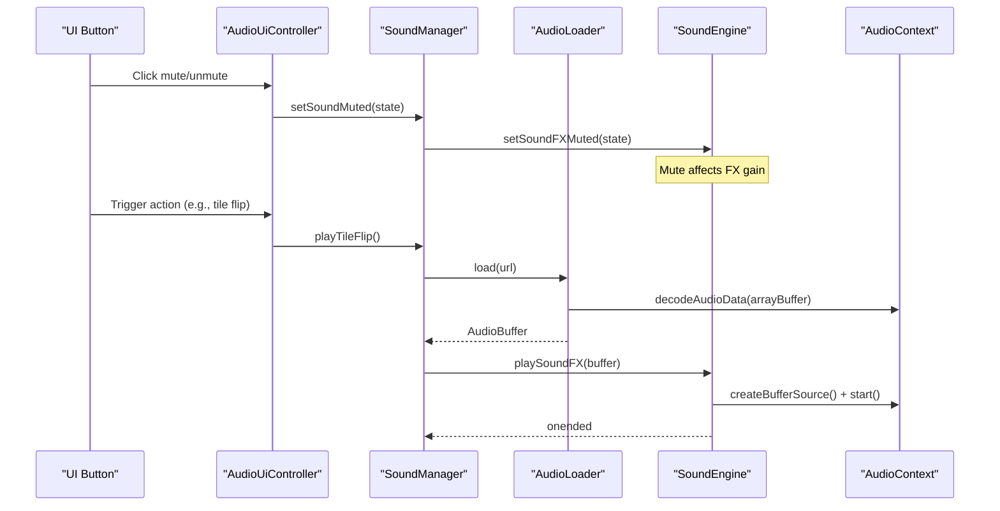
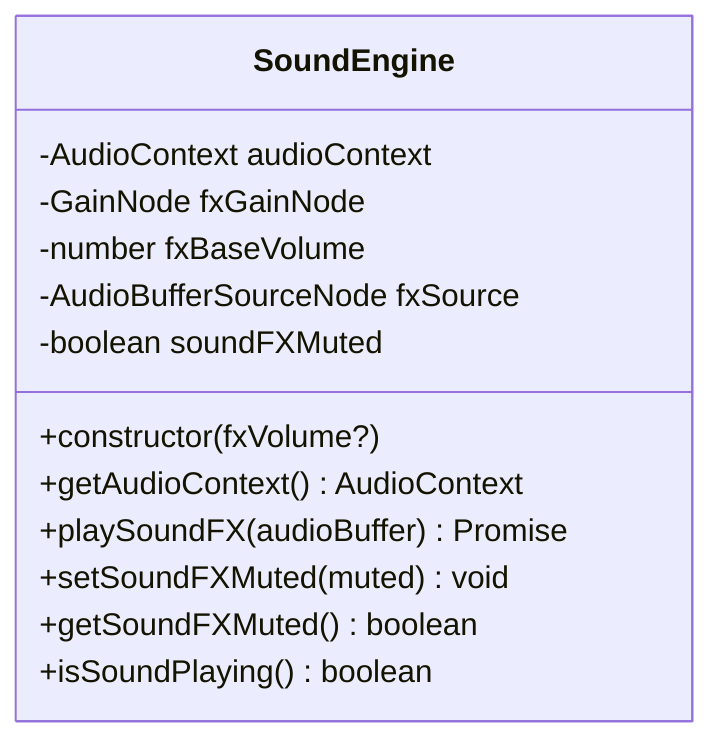
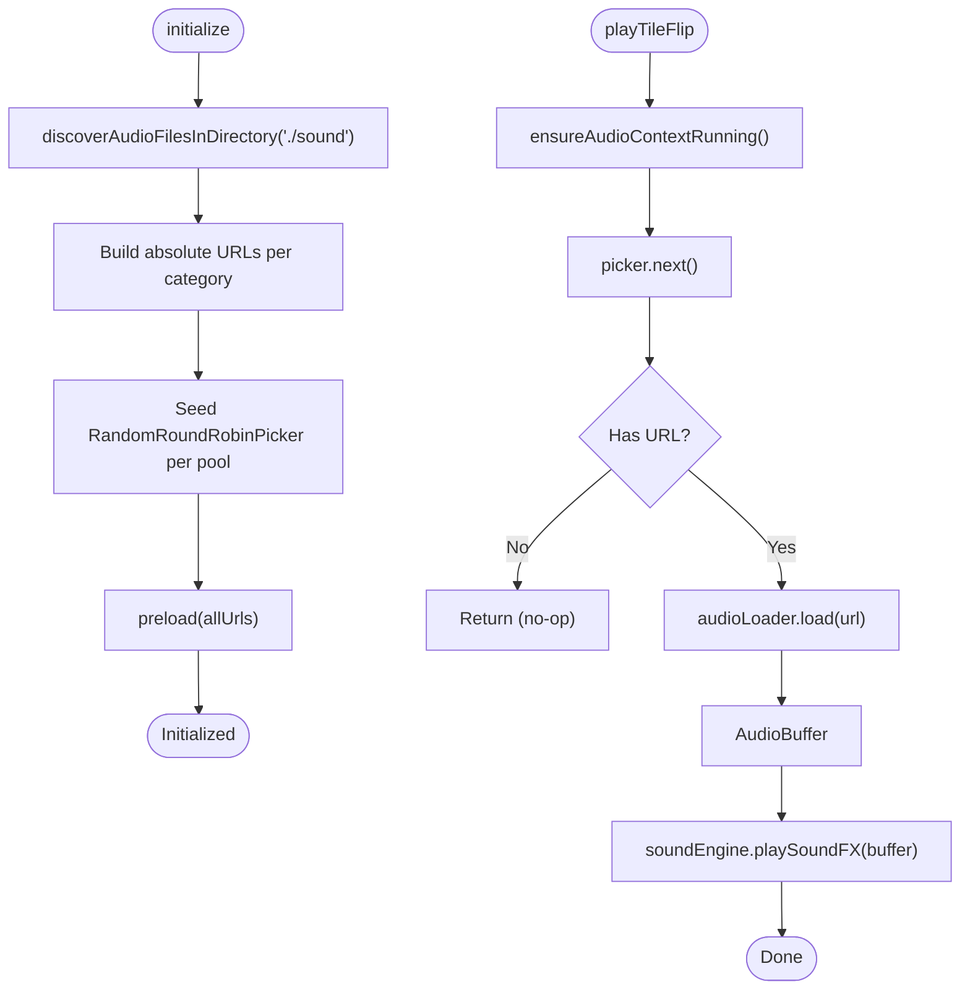
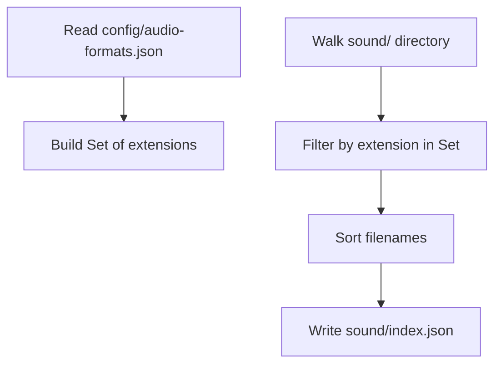
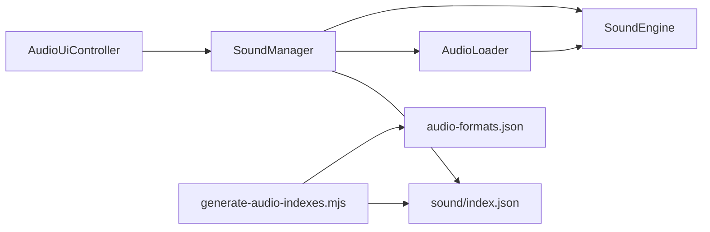

# Audio Formats and Configuration

<cite>
**Referenced Files in This Document**
- [audio-formats.json](file://config/audio-formats.json)
- [generate-audio-indexes.mjs](file://tools/generate-audio-indexes.mjs)
- [sound/index.json](file://sound/index.json)
- [audio-loader.ts](file://src/audio-loader.ts)
- [sound-engine.ts](file://src/sound-engine.ts)
- [sound-manager.ts](file://src/sound-manager.ts)
- [audio-ui-controller.ts](file://src/audio-ui-controller.ts)
- [sound-engine-plan.md](file://docs/sound-engine-plan.md)
- [audio-loader.test.ts](file://tests/audio-loader.test.ts)
- [sound-manager.test.ts](file://tests/sound-manager.test.ts)
</cite>

## Table of Contents
1. [Introduction](#introduction)
2. [Project Structure](#project-structure)
3. [Core Components](#core-components)
4. [Architecture Overview](#architecture-overview)
5. [Detailed Component Analysis](#detailed-component-analysis)
6. [Dependency Analysis](#dependency-analysis)
7. [Performance Considerations](#performance-considerations)
8. [Troubleshooting Guide](#troubleshooting-guide)
9. [Conclusion](#conclusion)
10. [Appendices](#appendices)

## Introduction
This document explains how the project supports audio formats, discovers and loads audio assets, and manages configuration for audio delivery. It covers:
- Supported audio formats and their considerations
- The audio-formats.json configuration and how it drives discovery and indexing
- How the audio loading pipeline selects and plays audio assets
- Format detection, codec availability checks, and performance characteristics
- Practical guidance for adding new formats, configuring priorities, and optimizing for different environments
- Browser compatibility considerations and streaming behavior

## Project Structure
The audio system is organized around three primary modules and supporting configuration and tooling:
- Configuration: config/audio-formats.json defines supported extensions
- Discovery and indexing: tools/generate-audio-indexes.mjs reads the configuration and writes sound/index.json
- Runtime audio pipeline: src/audio-loader.ts, src/sound-engine.ts, and src/sound-manager.ts implement asset loading, decoding, and playback orchestration
- UI integration: src/audio-ui-controller.ts binds mute controls to SoundManager



**Diagram sources**
- [audio-formats.json:1-3](file://config/audio-formats.json#L1-L3)
- [generate-audio-indexes.mjs:1-58](file://tools/generate-audio-indexes.mjs#L1-L58)
- [sound/index.json:1-17](file://sound/index.json#L1-L17)
- [sound-manager.ts:238-462](file://src/sound-manager.ts#L238-L462)
- [audio-loader.ts:7-118](file://src/audio-loader.ts#L7-L118)
- [sound-engine.ts:8-110](file://src/sound-engine.ts#L8-L110)
- [audio-ui-controller.ts:22-56](file://src/audio-ui-controller.ts#L22-L56)

**Section sources**
- [audio-formats.json:1-3](file://config/audio-formats.json#L1-L3)
- [generate-audio-indexes.mjs:1-58](file://tools/generate-audio-indexes.mjs#L1-L58)
- [sound/index.json:1-17](file://sound/index.json#L1-L17)
- [sound-manager.ts:238-462](file://src/sound-manager.ts#L238-L462)
- [audio-loader.ts:7-118](file://src/audio-loader.ts#L7-L118)
- [sound-engine.ts:8-110](file://src/sound-engine.ts#L8-L110)
- [audio-ui-controller.ts:22-56](file://src/audio-ui-controller.ts#L22-L56)

## Core Components
- AudioLoader: Fetches audio, decodes via Web Audio API, and caches buffers
- SoundEngine: Manages AudioContext, gain, and one-shot playback
- SoundManager: Discovers audio assets, groups them by category, preloads, and orchestrates playback
- Audio UI Controller: Binds mute toggles to SoundManager state
- Configuration and Indexing: audio-formats.json and generate-audio-indexes.mjs define supported formats and produce sound/index.json

Key behaviors:
- Format detection uses a strict extension whitelist from audio-formats.json
- Asset discovery prefers a generated JSON index (sound/index.json) and falls back to an asset-index endpoint and directory HTML listing
- Playback uses a random round-robin picker per category with a single-shot AudioBufferSourceNode
- Mute state is persisted in localStorage and synchronized with UI

**Section sources**
- [audio-loader.ts:7-118](file://src/audio-loader.ts#L7-L118)
- [sound-engine.ts:8-110](file://src/sound-engine.ts#L8-L110)
- [sound-manager.ts:238-462](file://src/sound-manager.ts#L238-L462)
- [audio-ui-controller.ts:22-56](file://src/audio-ui-controller.ts#L22-L56)
- [audio-formats.json:1-3](file://config/audio-formats.json#L1-L3)
- [generate-audio-indexes.mjs:1-58](file://tools/generate-audio-indexes.mjs#L1-L58)
- [sound/index.json:1-17](file://sound/index.json#L1-L17)

## Architecture Overview
The audio pipeline integrates configuration, discovery, loading, decoding, and playback:



**Diagram sources**
- [audio-ui-controller.ts:47-54](file://src/audio-ui-controller.ts#L47-L54)
- [sound-manager.ts:308-420](file://src/sound-manager.ts#L308-L420)
- [audio-loader.ts:30-64](file://src/audio-loader.ts#L30-L64)
- [sound-engine.ts:47-75](file://src/sound-engine.ts#L47-L75)

## Detailed Component Analysis

### AudioLoader
Responsibilities:
- Fetch audio by URL
- Decode to AudioBuffer using Web Audio API
- Cache decoded buffers by URL
- Preload multiple URLs concurrently
- Report cache state and clear cache

Behavior highlights:
- Caching prevents redundant fetches and decoding
- Preload uses Promise.allSettled to continue despite individual failures
- Errors wrap underlying causes while preserving context

```mermaid
flowchart TD
Start([Call load(url)]) --> CheckCache{"Cached?"}
CheckCache --> |Yes| ReturnCache["Return cached AudioBuffer"]
CheckCache --> |No| Fetch["fetch(url)"]
Fetch --> Ok{"response.ok?"}
Ok --> |No| ThrowFetchErr["Throw fetch error"]
Ok --> |Yes| Decode["decodeAudioData(arrayBuffer)"]
Decode --> DecodeOk{"Decoded?"}
DecodeOk --> |No| ThrowDecodeErr["Throw decode error"]
DecodeOk --> |Yes| Store["Store in cache"]
Store --> ReturnNew["Return AudioBuffer"]
ReturnCache --> End([Done])
ReturnNew --> End
```

**Diagram sources**
- [audio-loader.ts:30-64](file://src/audio-loader.ts#L30-L64)

**Section sources**
- [audio-loader.ts:7-118](file://src/audio-loader.ts#L7-L118)
- [audio-loader.test.ts:20-228](file://tests/audio-loader.test.ts#L20-L228)

### SoundEngine
Responsibilities:
- Owns AudioContext lifecycle
- Creates and connects a GainNode for FX volume
- Plays one-shot AudioBufferSourceNodes
- Respects mute state and reports whether FX is playing

Behavior highlights:
- Ensures AudioContext is running before playback
- Stops any currently playing FX before starting a new one
- Gain control reflects mute state



**Diagram sources**
- [sound-engine.ts:8-110](file://src/sound-engine.ts#L8-L110)

**Section sources**
- [sound-engine.ts:8-110](file://src/sound-engine.ts#L8-L110)

### SoundManager
Responsibilities:
- Discover audio files from sound/ using multiple strategies
- Filter and group files by category (tile flip, match, mismatch, new game, win)
- Preload all discovered assets
- Orchestrate playback with random round-robin selection per category
- Persist and restore mute state

Discovery and selection logic:
- Uses a whitelist of extensions from audio-formats.json
- Filters filenames by patterns for categories
- Builds absolute URLs and seeds RandomRoundRobinPicker instances
- Preloads all URLs in parallel

Playback flow:
- Ensures AudioContext is running
- Picks next URL from category pool (with fallback to general FX)
- Loads and decodes audio via AudioLoader
- Plays via SoundEngine



**Diagram sources**
- [sound-manager.ts:264-462](file://src/sound-manager.ts#L264-L462)
- [audio-loader.ts:30-64](file://src/audio-loader.ts#L30-L64)
- [sound-engine.ts:47-75](file://src/sound-engine.ts#L47-L75)

**Section sources**
- [sound-manager.ts:238-462](file://src/sound-manager.ts#L238-L462)
- [sound-manager.test.ts:111-768](file://tests/sound-manager.test.ts#L111-L768)

### Audio UI Controller
Responsibilities:
- Bind mute button to SoundManager
- Reflect mute state in ARIA attributes and icon visibility

**Section sources**
- [audio-ui-controller.ts:22-56](file://src/audio-ui-controller.ts#L22-L56)

### Configuration and Indexing
- audio-formats.json defines supported extensions (e.g., mp3, wav, ogg, m4a)
- generate-audio-indexes.mjs reads the configuration and enumerates matching files in sound/, writing sound/index.json
- sound/index.json is consumed by SoundManager to seed asset discovery



**Diagram sources**
- [audio-formats.json:1-3](file://config/audio-formats.json#L1-L3)
- [generate-audio-indexes.mjs:22-49](file://tools/generate-audio-indexes.mjs#L22-L49)
- [sound/index.json:1-17](file://sound/index.json#L1-L17)

**Section sources**
- [audio-formats.json:1-3](file://config/audio-formats.json#L1-L3)
- [generate-audio-indexes.mjs:1-58](file://tools/generate-audio-indexes.mjs#L1-L58)
- [sound/index.json:1-17](file://sound/index.json#L1-L17)

## Dependency Analysis
- SoundManager depends on SoundEngine and AudioLoader
- AudioLoader depends on an AudioContext instance from SoundEngine
- SoundManager also depends on file discovery and filtering utilities
- UI controller depends on SoundManager for mute state and actions
- Tooling depends on configuration to generate indices



**Diagram sources**
- [audio-ui-controller.ts:1-56](file://src/audio-ui-controller.ts#L1-L56)
- [sound-manager.ts:238-462](file://src/sound-manager.ts#L238-L462)
- [audio-loader.ts:7-18](file://src/audio-loader.ts#L7-L18)
- [sound-engine.ts:8-29](file://src/sound-engine.ts#L8-L29)
- [generate-audio-indexes.mjs:1-58](file://tools/generate-audio-indexes.mjs#L1-L58)
- [audio-formats.json:1-3](file://config/audio-formats.json#L1-L3)
- [sound/index.json:1-17](file://sound/index.json#L1-L17)

**Section sources**
- [sound-manager.ts:238-462](file://src/sound-manager.ts#L238-L462)
- [audio-loader.ts:7-118](file://src/audio-loader.ts#L7-L118)
- [sound-engine.ts:8-110](file://src/sound-engine.ts#L8-L110)
- [audio-ui-controller.ts:22-56](file://src/audio-ui-controller.ts#L22-L56)
- [generate-audio-indexes.mjs:1-58](file://tools/generate-audio-indexes.mjs#L1-L58)
- [audio-formats.json:1-3](file://config/audio-formats.json#L1-L3)
- [sound/index.json:1-17](file://sound/index.json#L1-L17)

## Performance Considerations
- Decoding cost: AudioLoader uses Web Audio API decodeAudioData; decoding cost scales with file size and codec complexity
- Memory footprint: AudioBuffer retains decoded PCM data; caching avoids repeated decoding but holds memory
- Preloading: SoundManager preloads all assets in parallel; this reduces latency but increases initial memory usage
- Streaming: The loader fetches the entire resource before decoding; this simplifies decoding but may delay first-playback
- Category pools: Round-robin selection ensures variety; shuffling per cycle avoids repetition patterns
- Context lifecycle: SoundEngine resumes AudioContext on demand to satisfy browser autoplay policies

[No sources needed since this section provides general guidance]

## Troubleshooting Guide
Common issues and remedies:
- Codec support failures
  - Symptom: load() throws decode error
  - Cause: browser cannot decode the chosen format
  - Action: Ensure the asset is encoded in a widely supported format; verify sound/index.json includes the intended file; confirm audio-formats.json includes the extension
- Fetch failures
  - Symptom: load() throws fetch error
  - Cause: network error or 404
  - Action: Verify asset URL construction and server availability
- Empty pools
  - Symptom: No audio plays for a category
  - Cause: No files matched the category pattern or discovery returned none
  - Action: Confirm filenames match patterns (e.g., flip*, match*, mismatch*, newgame*, win*) and sound/index.json contains entries
- Mute state not persisting
  - Symptom: Mute preference resets across reloads
  - Cause: localStorage unavailable or blocked
  - Action: Check browser privacy settings; the code safely no-ops when localStorage is absent
- Autoplay restrictions
  - Symptom: No audio on first interaction
  - Cause: Browser requires user gesture to start AudioContext
  - Action: Ensure ensureAudioContextRunning() is called after a user gesture; the engine attempts resume on demand

**Section sources**
- [audio-loader.ts:30-64](file://src/audio-loader.ts#L30-L64)
- [sound-manager.ts:196-226](file://src/sound-manager.ts#L196-L226)
- [sound-manager.test.ts:157-177](file://tests/sound-manager.test.ts#L157-L177)
- [sound-engine.ts:441-460](file://src/sound-engine.ts#L441-L460)

## Conclusion
The audio system centers on a clear configuration-to-discovery-to-loading-to-playback pipeline:
- audio-formats.json defines supported extensions
- generate-audio-indexes.mjs produces a deterministic index
- SoundManager discovers, categorizes, preloads, and plays audio with robust fallbacks
- AudioLoader and SoundEngine provide efficient decoding and playback
- The UI controller synchronizes mute state seamlessly

This design enables straightforward addition of new formats, controlled prioritization via file naming and indexing, and reliable operation across browsers with minimal runtime configuration.

[No sources needed since this section summarizes without analyzing specific files]

## Appendices

### Supported Audio Formats and Considerations
- MP3: Widely compatible; variable quality; often smaller files for same perceived quality
- WAV: Uncompressed; highest fidelity; larger files; fast decoding
- OGG: Good balance of quality and size; strong Firefox support; less universal on some platforms
- M4A: High quality; good compression; strong Apple ecosystem support; varies by browser

Format-specific notes:
- Choose container/codec combinations aligned with target browsers and distribution constraints
- For streaming and latency-sensitive contexts, consider shorter clips and preloading
- For mobile/web delivery, MP3 and OGG commonly offer broad compatibility; M4A may require additional consideration on non-Apple browsers

[No sources needed since this section provides general guidance]

### Adding a New Audio Format
Steps:
1. Extend audio-formats.json with the new extension (e.g., add .flac)
2. Place assets in sound/ with appropriate naming conventions
3. Regenerate sound/index.json using the generator tool
4. Verify SoundManager discovers and categorizes the files
5. Test playback and confirm no decode errors

Verification checklist:
- sound/index.json includes new files
- SoundManager.initialize() succeeds without errors
- Category-specific playback selects the new files
- Mute and persistence work as expected

**Section sources**
- [audio-formats.json:1-3](file://config/audio-formats.json#L1-L3)
- [generate-audio-indexes.mjs:1-58](file://tools/generate-audio-indexes.mjs#L1-L58)
- [sound/index.json:1-17](file://sound/index.json#L1-L17)
- [sound-manager.ts:264-297](file://src/sound-manager.ts#L264-L297)

### Configuring Format Priority Ordering
Priority is implicit in the discovery and indexing pipeline:
- The generator sorts files lexicographically; filename order determines sort order
- Category selection relies on filename patterns; place preferred variants with names that sort earlier if ordering matters
- For fallback behavior, rely on SoundManager’s category fallback: win and new-game pools fall back to general FX when empty

Operational tips:
- Use consistent naming within categories (e.g., flip01, flip02) to maintain predictable selection
- Keep category-specific pools non-empty for desired priority; leave general FX pool for fallback

**Section sources**
- [generate-audio-indexes.mjs:34-39](file://tools/generate-audio-indexes.mjs#L34-L39)
- [sound-manager.ts:421-439](file://src/sound-manager.ts#L421-L439)

### Browser Compatibility Matrix (Conceptual)
- Chrome: Strong support for MP3, WAV, OGG, M4A
- Firefox: Strong support for MP3, WAV, OGG; generally robust
- Edge: Broad compatibility; aligns with Chromium
- Safari (Desktop/iOS): Strong MP3/WAV; M4A well supported; autoplay policies apply
- Notes: Always test on target browsers; ensure assets are served with correct MIME types

[No sources needed since this diagram shows conceptual workflow, not actual code structure]

### Compression Strategies and Quality vs. Size Trade-offs
- Choose lossy formats (MP3, OGG) for smaller bundles and faster load times
- Use WAV for uncompressed fidelity when size is not a constraint
- Optimize bitrates and sample rates to balance quality and size
- Consider chunking long audio into shorter segments for streaming and reduced latency

[No sources needed since this section provides general guidance]

### Streaming and Delivery Considerations
- The loader fetches entire resources before decoding; this simplifies decoding but may delay first playback
- For large assets, consider:
  - Shorter audio clips
  - Preloading during initialization
  - Serving compressed formats optimized for web
  - Ensuring proper Content-Type headers for audio files

**Section sources**
- [audio-loader.ts:37-50](file://src/audio-loader.ts#L37-L50)
- [sound-engine-plan.md:216-279](file://docs/sound-engine-plan.md#L216-L279)