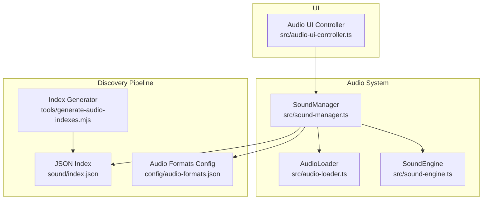
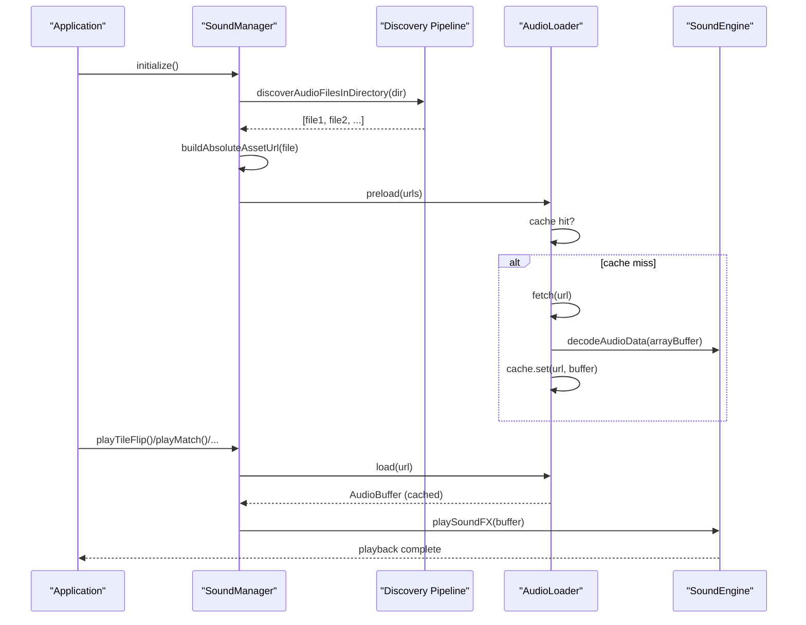
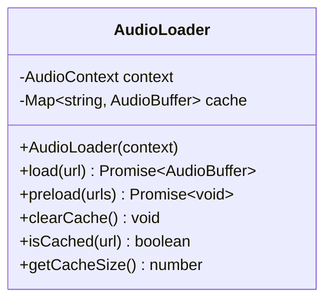
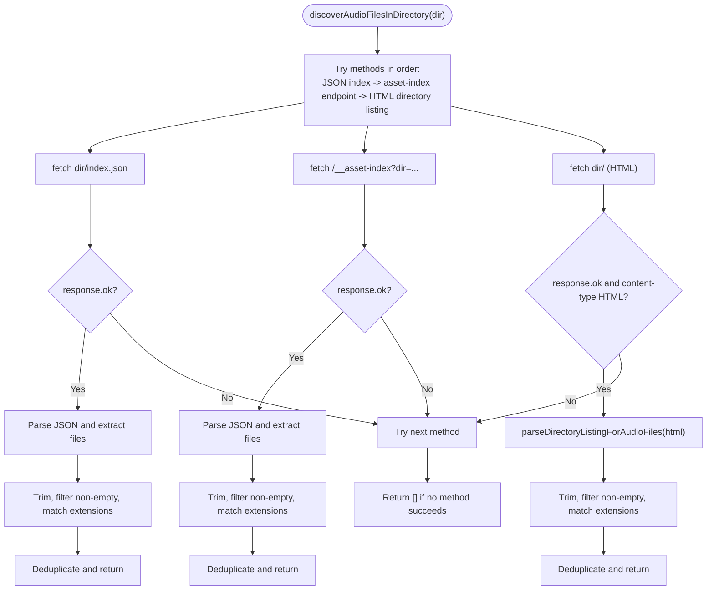
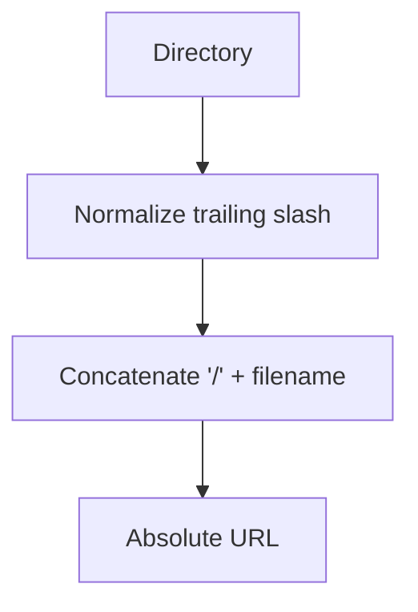
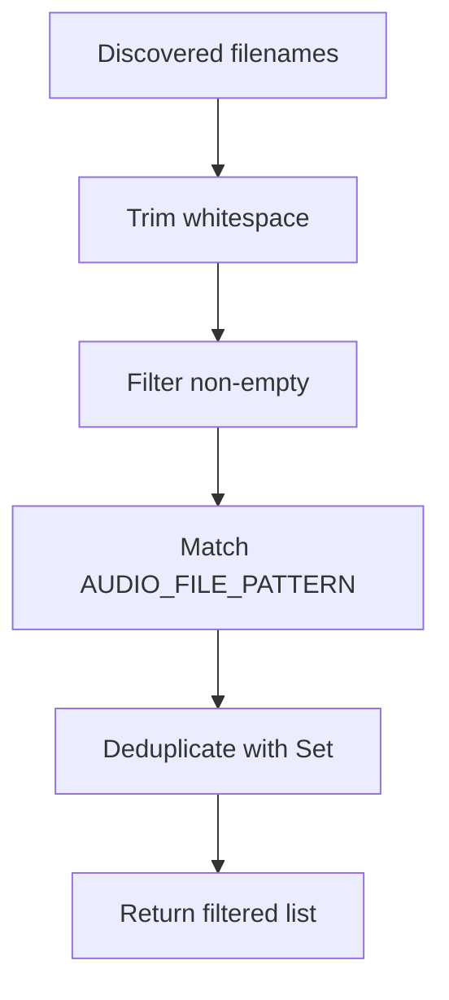
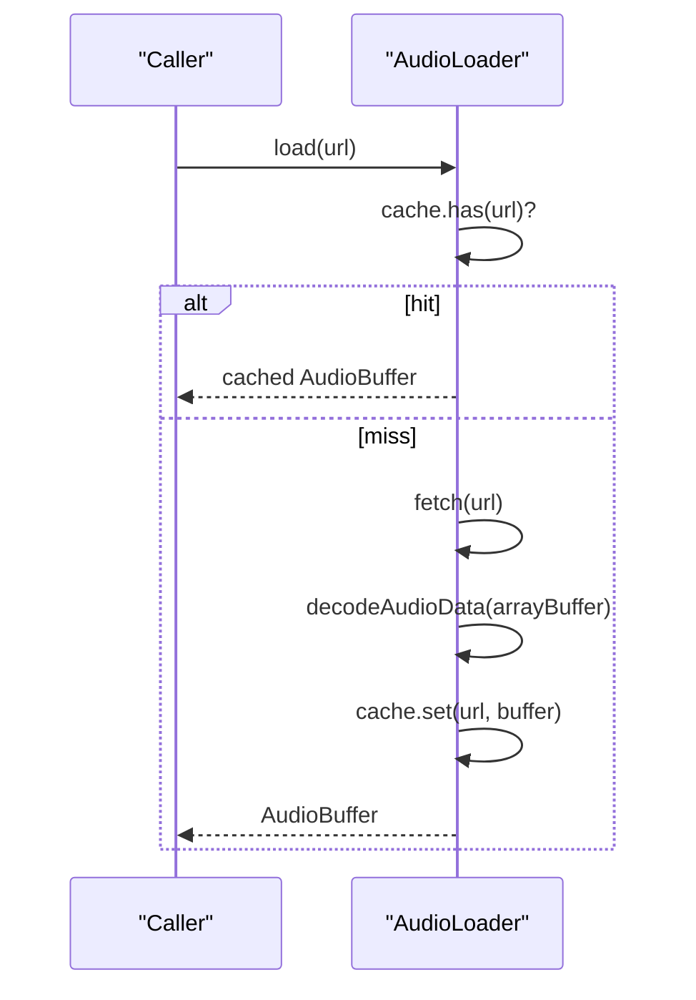
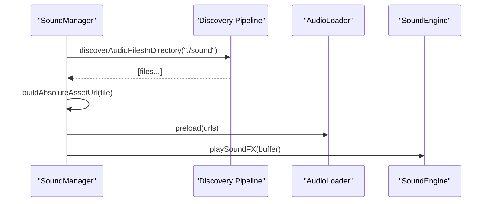
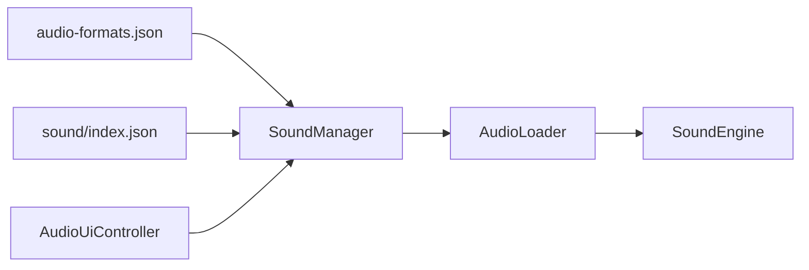

# Audio Loader

<cite>
**Referenced Files in This Document**
- [audio-loader.ts](file://src/audio-loader.ts)
- [sound-manager.ts](file://src/sound-manager.ts)
- [sound-engine.ts](file://src/sound-engine.ts)
- [audio-formats.json](file://config/audio-formats.json)
- [index.json](file://sound/index.json)
- [generate-audio-indexes.mjs](file://tools/generate-audio-indexes.mjs)
- [audio-loader.test.ts](file://tests/audio-loader.test.ts)
- [audio-ui-controller.ts](file://src/audio-ui-controller.ts)
- [README.md](file://README.md)
</cite>

## Table of Contents
1. [Introduction](#introduction)
2. [Project Structure](#project-structure)
3. [Core Components](#core-components)
4. [Architecture Overview](#architecture-overview)
5. [Detailed Component Analysis](#detailed-component-analysis)
6. [Dependency Analysis](#dependency-analysis)
7. [Performance Considerations](#performance-considerations)
8. [Troubleshooting Guide](#troubleshooting-guide)
9. [Conclusion](#conclusion)

## Introduction
This document provides comprehensive technical documentation for the AudioLoader class and the broader audio asset discovery, loading, and caching system. It explains how audio files are discovered from multiple sources, how URLs are built and resolved, how audio formats are detected, and how caching and memory management are handled. It also covers the integration with the asset discovery pipeline, browser security considerations, and performance optimization strategies for bulk audio loading.

## Project Structure
The audio system spans several modules:
- AudioLoader: central caching and loading utility
- SoundManager: orchestrates asset discovery, URL construction, categorization, and playback coordination
- SoundEngine: Web Audio API playback engine
- Asset discovery pipeline: JSON index parsing, asset-index endpoint querying, and HTML directory listing extraction
- Configuration: supported audio extensions
- Tooling: automated index generation for audio assets
- Tests: verification of caching, error handling, and preload behavior

**Diagram sources**
- [audio-loader.ts:1-118](file://src/audio-loader.ts#L1-L118)
- [sound-manager.ts:1-462](file://src/sound-manager.ts#L1-L462)
- [sound-engine.ts:1-110](file://src/sound-engine.ts#L1-L110)
- [index.json:1-17](file://sound/index.json#L1-L17)
- [audio-formats.json:1-4](file://config/audio-formats.json#L1-L4)
- [generate-audio-indexes.mjs:1-58](file://tools/generate-audio-indexes.mjs#L1-L58)
- [audio-ui-controller.ts:1-56](file://src/audio-ui-controller.ts#L1-L56)

**Section sources**
- [README.md:190-192](file://README.md#L190-L192)

## Core Components
- AudioLoader: Provides caching, decoding, and parallel preloading of audio buffers using the Web Audio API. It wraps fetch and decode errors with contextual messages and preserves original causes.
- SoundManager: Discovers audio files from multiple sources, builds absolute URLs, filters and categorizes files, initializes pickers for round-robin selection, and coordinates playback via SoundEngine.
- SoundEngine: Manages the Web Audio API context, gain nodes, and playback lifecycle, including muting and context resumption.
- Asset Discovery Pipeline: Implements a robust multi-method discovery strategy (JSON index, asset-index endpoint, HTML directory listing) with strict file extension filtering and deduplication.
- Configuration: Defines supported audio extensions used for filtering discovered files.
- Tooling: Generates JSON indices for audio directories to optimize discovery and reduce reliance on HTML directory listings.

**Section sources**
- [audio-loader.ts:7-118](file://src/audio-loader.ts#L7-L118)
- [sound-manager.ts:131-226](file://src/sound-manager.ts#L131-L226)
- [sound-engine.ts:8-110](file://src/sound-engine.ts#L8-L110)
- [audio-formats.json:1-4](file://config/audio-formats.json#L1-L4)
- [generate-audio-indexes.mjs:22-49](file://tools/generate-audio-indexes.mjs#L22-L49)

## Architecture Overview
The audio system follows a layered architecture:
- Discovery Layer: Builds a unified list of audio filenames from multiple sources and applies strict filtering.
- URL Construction Layer: Converts filenames to absolute URLs for fetching.
- Loading and Caching Layer: Fetches, decodes, and caches audio buffers.
- Playback Coordination Layer: Selects appropriate sounds based on game events and plays them via the Web Audio API.

**Diagram sources**
- [sound-manager.ts:264-297](file://src/sound-manager.ts#L264-L297)
- [sound-manager.ts:196-226](file://src/sound-manager.ts#L196-L226)
- [audio-loader.ts:30-64](file://src/audio-loader.ts#L30-L64)
- [sound-engine.ts:47-75](file://src/sound-engine.ts#L47-L75)

## Detailed Component Analysis

### AudioLoader
AudioLoader encapsulates caching, decoding, and error handling for audio assets:
- Caching: Uses a Map keyed by URL to avoid redundant fetches and decodes.
- Loading: Fetches audio data, validates response, decodes with Web Audio API, and stores in cache.
- Parallel Preloading: Uses Promise.allSettled to load multiple URLs concurrently while logging failures.
- Memory Management: Exposes clearCache, isCached, and getCacheSize for monitoring and cleanup.

**Diagram sources**
- [audio-loader.ts:7-118](file://src/audio-loader.ts#L7-L118)

**Section sources**
- [audio-loader.ts:30-64](file://src/audio-loader.ts#L30-L64)
- [audio-loader.ts:75-88](file://src/audio-loader.ts#L75-L88)
- [audio-loader.ts:95-116](file://src/audio-loader.ts#L95-L116)

### Asset Discovery Pipeline
The discovery pipeline implements a multi-method approach to locate audio files:
- JSON Index Parsing: Attempts to fetch directory/index.json and expects either a flat array of strings or an object with a files array.
- Asset-Index Endpoint Querying: Requests a server-side asset-index endpoint with directory parameter and expects a files array.
- HTML Directory Listing Extraction: Fetches the directory’s HTML listing, extracts href attributes, decodes percent-encoded segments, and filters by audio extensions.

**Diagram sources**
- [sound-manager.ts:196-226](file://src/sound-manager.ts#L196-L226)
- [sound-manager.ts:131-154](file://src/sound-manager.ts#L131-L154)
- [sound-manager.ts:156-177](file://src/sound-manager.ts#L156-L177)
- [sound-manager.ts:179-194](file://src/sound-manager.ts#L179-L194)
- [sound-manager.ts:44-69](file://src/sound-manager.ts#L44-L69)

**Section sources**
- [sound-manager.ts:131-154](file://src/sound-manager.ts#L131-L154)
- [sound-manager.ts:156-177](file://src/sound-manager.ts#L156-L177)
- [sound-manager.ts:179-194](file://src/sound-manager.ts#L179-L194)
- [sound-manager.ts:44-69](file://src/sound-manager.ts#L44-L69)

### URL Building and Absolute Path Resolution
- buildAbsoluteAssetUrl: Normalizes directory path and concatenates filename to form absolute URLs.
- Discovery uses discovered filenames to construct URLs under the configured directory (e.g., "./sound").

**Diagram sources**
- [sound-manager.ts:102-107](file://src/sound-manager.ts#L102-L107)

**Section sources**
- [sound-manager.ts:102-107](file://src/sound-manager.ts#L102-L107)

### Audio Format Detection and Filtering
- Supported Extensions: Defined in config/audio-formats.json and used to filter discovered filenames.
- Filename Patterns: Used in SoundManager to categorize files (tile flip, match, mismatch, new game, win, general FX).
- Discovery Filtering: Discovered filenames are trimmed, filtered for non-empty strings, and matched against the extension set.

**Diagram sources**
- [audio-formats.json:1-4](file://config/audio-formats.json#L1-L4)
- [sound-manager.ts:7-12](file://src/sound-manager.ts#L7-L12)
- [sound-manager.ts:211-218](file://src/sound-manager.ts#L211-L218)

**Section sources**
- [audio-formats.json:1-4](file://config/audio-formats.json#L1-L4)
- [sound-manager.ts:7-12](file://src/sound-manager.ts#L7-L12)
- [sound-manager.ts:211-218](file://src/sound-manager.ts#L211-L218)

### Caching Strategies
- Cache Key: URL string; cache hit avoids network and decode costs.
- Cache Operations: isCached, getCacheSize, clearCache enable monitoring and memory management.
- Preload Behavior: preload uses Promise.allSettled to maximize throughput while logging failures.

**Diagram sources**
- [audio-loader.ts:30-64](file://src/audio-loader.ts#L30-L64)

**Section sources**
- [audio-loader.ts:30-64](file://src/audio-loader.ts#L30-L64)
- [audio-loader.ts:75-88](file://src/audio-loader.ts#L75-L88)
- [audio-loader.ts:95-116](file://src/audio-loader.ts#L95-L116)

### Relationship with Asset Discovery Pipeline
- SoundManager.initialize triggers discovery for "./sound".
- Discovered filenames are transformed into absolute URLs and categorized.
- Preload is invoked to warm the cache before gameplay.
- Playback methods select a random sound from category-specific pickers and play via SoundEngine.

**Diagram sources**
- [sound-manager.ts:269-294](file://src/sound-manager.ts#L269-L294)

**Section sources**
- [sound-manager.ts:269-294](file://src/sound-manager.ts#L269-L294)

### Practical Examples

#### Loading Different Audio Formats
- Supported formats: MP3, WAV, OGG, M4A (as defined in config/audio-formats.json).
- Discovery ensures only matching files are included; duplicates are removed; URLs are absolute.

**Section sources**
- [audio-formats.json:1-4](file://config/audio-formats.json#L1-L4)
- [sound-manager.ts:211-218](file://src/sound-manager.ts#L211-L218)

#### Handling Network Errors
- AudioLoader.load wraps fetch and decode errors with contextual messages and preserves the original error cause.
- preload logs individual failures but does not throw, allowing graceful degradation.

**Section sources**
- [audio-loader.ts:50-63](file://src/audio-loader.ts#L50-L63)
- [audio-loader.ts:80-87](file://src/audio-loader.ts#L80-L87)

#### Managing Memory for Loaded Audio Buffers
- Use clearCache to free memory when audio assets are no longer needed.
- Monitor cache size with getCacheSize and check presence with isCached.

**Section sources**
- [audio-loader.ts:95-116](file://src/audio-loader.ts#L95-L116)

### Browser Security Considerations
- Cross-Origin Resource Sharing (CORS): Ensure audio assets are served with appropriate CORS headers when hosted on different origins.
- Localhost vs Production: Development servers may expose files differently; verify asset availability and CORS policies in production environments.
- Content-Type Validation: The HTML directory listing method requires content-type to be text/html; misconfigured servers may break discovery.

**Section sources**
- [sound-manager.ts:179-194](file://src/sound-manager.ts#L179-L194)

### Performance Optimization for Bulk Audio Loading
- Parallel Preloading: preload uses Promise.allSettled to maximize throughput.
- Caching: Avoids repeated network requests and decoding for repeated playback.
- Category Pickers: Random round-robin selection reduces perceived repetition and improves UX.

**Section sources**
- [audio-loader.ts:75-88](file://src/audio-loader.ts#L75-L88)
- [sound-manager.ts:71-100](file://src/sound-manager.ts#L71-L100)

## Dependency Analysis
- AudioLoader depends on Web Audio API context for decoding.
- SoundManager depends on AudioLoader for buffering and SoundEngine for playback.
- Discovery pipeline depends on configuration for supported extensions and generates index files for efficient discovery.
- UI controller toggles mute state and delegates to SoundManager.

**Diagram sources**
- [audio-formats.json:1-4](file://config/audio-formats.json#L1-L4)
- [index.json:1-17](file://sound/index.json#L1-L17)
- [sound-manager.ts:1-2](file://src/sound-manager.ts#L1-L2)
- [audio-loader.ts:8-17](file://src/audio-loader.ts#L8-L17)
- [sound-engine.ts:9-29](file://src/sound-engine.ts#L9-L29)
- [audio-ui-controller.ts:1-1](file://src/audio-ui-controller.ts#L1-L1)

**Section sources**
- [audio-loader.ts:8-17](file://src/audio-loader.ts#L8-L17)
- [sound-manager.ts:1-2](file://src/sound-manager.ts#L1-L2)
- [sound-engine.ts:9-29](file://src/sound-engine.ts#L9-L29)
- [audio-ui-controller.ts:1-1](file://src/audio-ui-controller.ts#L1-L1)

## Performance Considerations
- Prefer JSON index discovery for predictable, fast asset enumeration.
- Use preload to warm the cache before gameplay begins.
- Limit concurrent loads to avoid overwhelming the browser’s network stack.
- Periodically clearCache when switching contexts or levels to manage memory usage.

## Troubleshooting Guide
Common issues and resolutions:
- CORS Restrictions: Verify that audio assets are served with appropriate CORS headers. Check server configuration and origin policies.
- Unsupported Formats: Ensure files match supported extensions (MP3, WAV, OGG, M4A) as defined in config/audio-formats.json.
- Loading Timeouts: Increase server timeout thresholds or reduce initial preload batch size.
- Decode Failures: Validate audio files with a media validator; ensure they are not corrupted or improperly encoded.
- Duplicate Removal: The discovery pipeline deduplicates filenames; confirm that filenames are unique and correctly normalized.

**Section sources**
- [audio-formats.json:1-4](file://config/audio-formats.json#L1-L4)
- [sound-manager.ts:211-218](file://src/sound-manager.ts#L211-L218)

## Conclusion
The AudioLoader and surrounding audio system provide a robust, cache-aware mechanism for discovering, loading, and playing audio assets. By combining multiple discovery methods, strict filtering, and efficient caching, it delivers responsive gameplay while maintaining good memory hygiene. Proper configuration of supported formats, server CORS policies, and preload strategies ensures reliable operation across development and production environments.