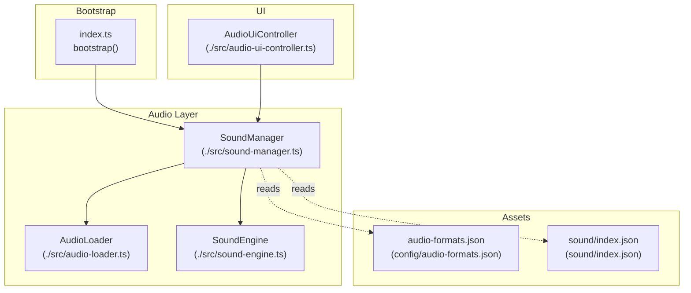
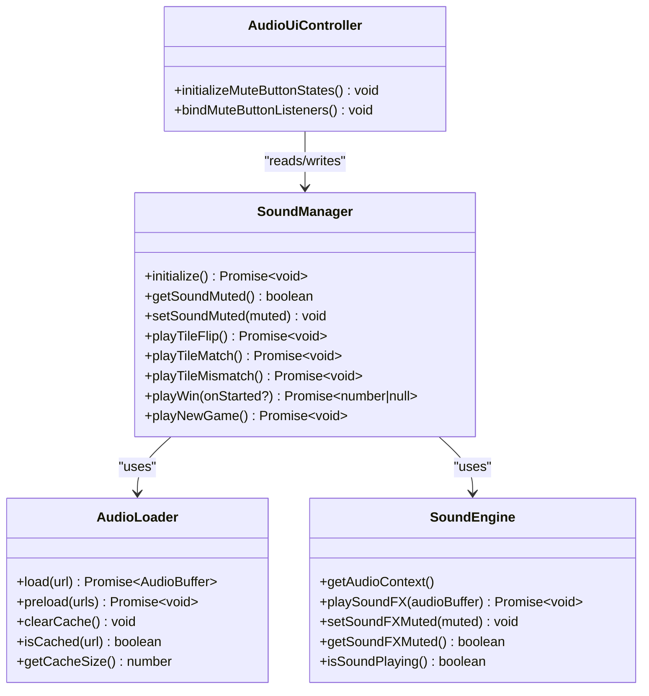
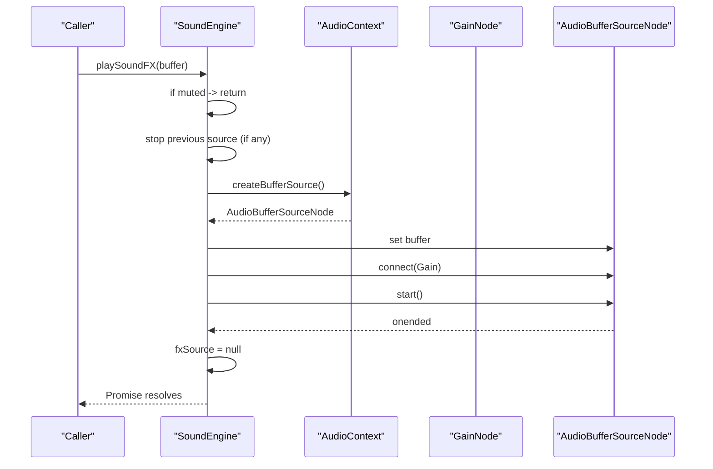
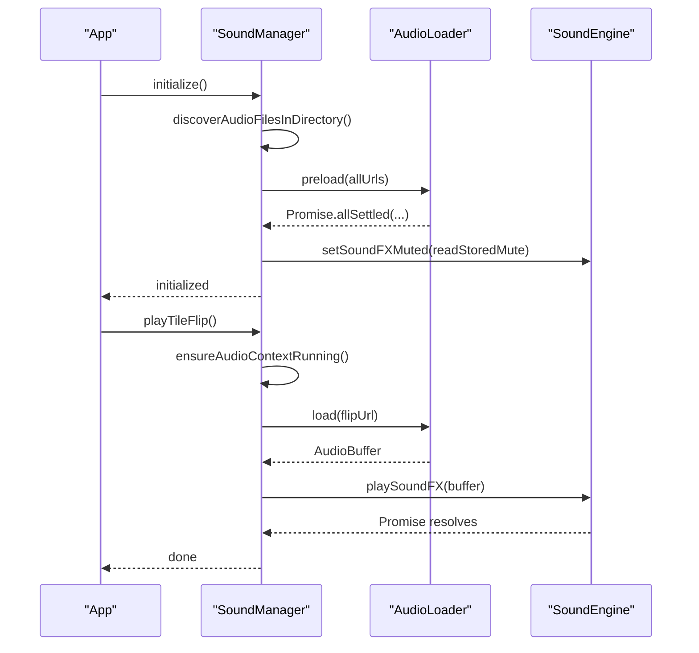
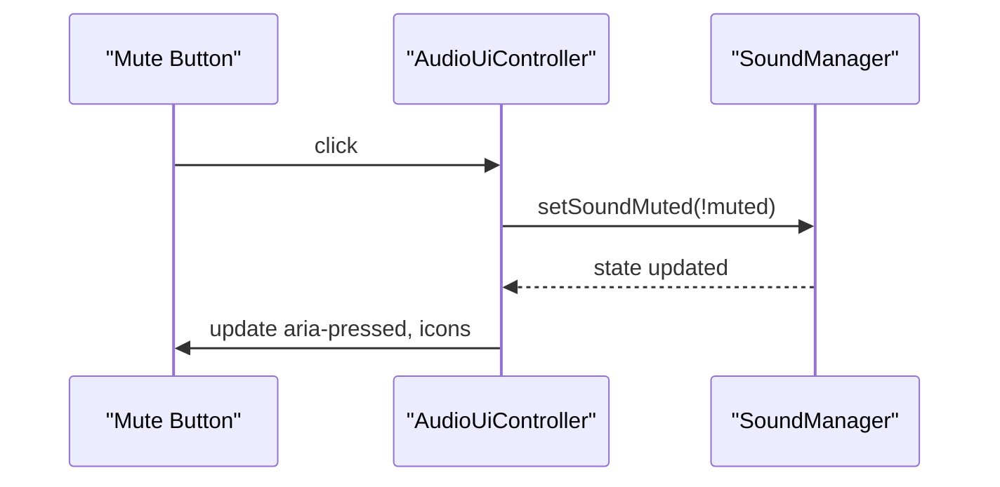
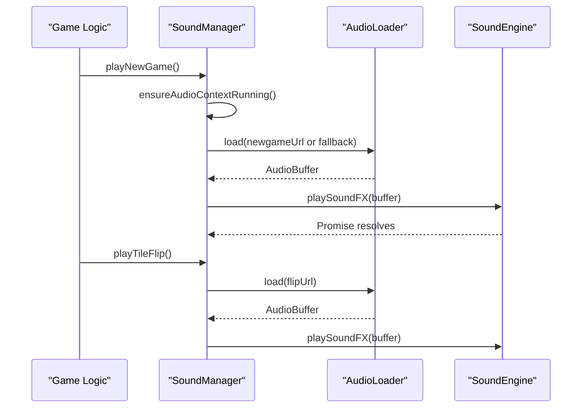
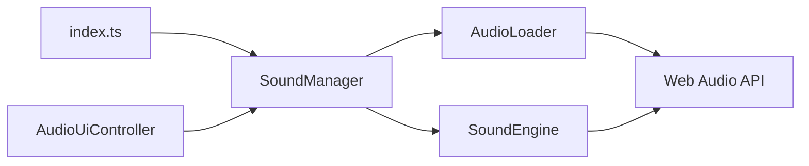

# Audio System

<cite>
**Referenced Files in This Document**
- [sound-engine.ts](file://src/sound-engine.ts)
- [audio-loader.ts](file://src/audio-loader.ts)
- [sound-manager.ts](file://src/sound-manager.ts)
- [audio-ui-controller.ts](file://src/audio-ui-controller.ts)
- [index.ts](file://src/index.ts)
- [audio-formats.json](file://config/audio-formats.json)
- [sound/index.json](file://sound/index.json)
- [sound-engine.test.ts](file://tests/sound-engine.test.ts)
- [audio-loader.test.ts](file://tests/audio-loader.test.ts)
- [sound-manager.test.ts](file://tests/sound-manager.test.ts)
- [audio-ui-controller.test.ts](file://tests/audio-ui-controller.test.ts)
</cite>

## Table of Contents
1. [Introduction](#introduction)
2. [Project Structure](#project-structure)
3. [Core Components](#core-components)
4. [Architecture Overview](#architecture-overview)
5. [Detailed Component Analysis](#detailed-component-analysis)
6. [Dependency Analysis](#dependency-analysis)
7. [Performance Considerations](#performance-considerations)
8. [Troubleshooting Guide](#troubleshooting-guide)
9. [Conclusion](#conclusion)
10. [Appendices](#appendices)

## Introduction
This document explains the audio system built around the Web Audio API. It covers the dual-layer sound engine architecture, asset loading and caching, volume control, and the SoundManager’s orchestration of game events with audio playback. It also documents mute functionality, autoplay recovery, supported audio formats, memory management, browser compatibility, and practical integration examples for sound effects and background music coordination.

## Project Structure
The audio system spans several modules:
- SoundEngine: low-level Web Audio API playback with gain control and mute.
- AudioLoader: asset loader and cache for decoded AudioBuffers.
- SoundManager: orchestrates asset discovery, categorization, playback scheduling, and autoplay recovery.
- AudioUiController: binds UI mute controls to SoundManager state.
- Index bootstrap: initializes SoundManager and wires game events to audio playback.
- Configuration and indices: define supported formats and asset catalogs.



**Diagram sources**
- [index.ts:1074-1096](file://src/index.ts#L1074-L1096)
- [sound-manager.ts:238-297](file://src/sound-manager.ts#L238-L297)
- [audio-loader.ts:7-118](file://src/audio-loader.ts#L7-L118)
- [sound-engine.ts:8-110](file://src/sound-engine.ts#L8-L110)
- [audio-formats.json:1-4](file://config/audio-formats.json#L1-L4)
- [sound/index.json:1-17](file://sound/index.json#L1-L17)

**Section sources**
- [index.ts:1074-1096](file://src/index.ts#L1074-L1096)
- [sound-manager.ts:238-297](file://src/sound-manager.ts#L238-L297)
- [audio-loader.ts:7-118](file://src/audio-loader.ts#L7-L118)
- [sound-engine.ts:8-110](file://src/sound-engine.ts#L8-L110)
- [audio-formats.json:1-4](file://config/audio-formats.json#L1-L4)
- [sound/index.json:1-17](file://sound/index.json#L1-L17)

## Core Components
- SoundEngine
  - Creates an AudioContext and a GainNode for FX.
  - Plays one-shot sound effects via AudioBufferSourceNode.
  - Supports mute state and live gain updates during playback.
  - Exposes isSoundPlaying() to detect active playback.
- AudioLoader
  - Fetches audio, decodes via Web Audio API, and caches AudioBuffers.
  - Provides preload() to prefetch multiple assets concurrently.
  - Offers cache inspection and clearing for memory management.
- SoundManager
  - Discovers audio assets from JSON index, asset-index endpoint, or directory listing.
  - Categorizes files by naming convention (flip*, match*, mismatch*, newgame*, win*).
  - Uses RandomRoundRobinPicker to rotate among multiple variants.
  - Ensures AudioContext is running on user gestures and recovers from suspend.
  - Coordinates game events with audio playback and maintains mute state in localStorage.
- AudioUiController
  - Binds mute button UI to SoundManager.
  - Updates aria attributes and icon visibility for accessibility and UX.
- Bootstrap wiring
  - Initializes SoundManager and AudioUiController.
  - Hooks tile flip/match/mismatch/win/new-game events to SoundManager methods.

**Section sources**
- [sound-engine.ts:8-110](file://src/sound-engine.ts#L8-L110)
- [audio-loader.ts:7-118](file://src/audio-loader.ts#L7-L118)
- [sound-manager.ts:238-462](file://src/sound-manager.ts#L238-L462)
- [audio-ui-controller.ts:22-56](file://src/audio-ui-controller.ts#L22-L56)
- [index.ts:241-249](file://src/index.ts#L241-L249)
- [index.ts:672-779](file://src/index.ts#L672-L779)
- [index.ts:1074-1096](file://src/index.ts#L1074-L1096)

## Architecture Overview
The system uses a dual-layer design:
- Lower layer (SoundEngine): Web Audio API primitives for playback and volume control.
- Upper layer (SoundManager): Asset discovery, categorization, scheduling, and autoplay recovery.



**Diagram sources**
- [sound-engine.ts:8-110](file://src/sound-engine.ts#L8-L110)
- [audio-loader.ts:7-118](file://src/audio-loader.ts#L7-L118)
- [sound-manager.ts:238-462](file://src/sound-manager.ts#L238-L462)
- [audio-ui-controller.ts:22-56](file://src/audio-ui-controller.ts#L22-L56)

## Detailed Component Analysis

### SoundEngine
- Purpose: One-shot FX playback with gain control and mute.
- Key behaviors:
  - Prevents concurrent FX playback by stopping the previous source before starting a new one.
  - Respects mute state by setting gain to zero when muted.
  - Returns a Promise resolved when playback completes.
- Volume control:
  - Base volume set at construction; gain is adjusted dynamically when muting/unmuting during playback.



**Diagram sources**
- [sound-engine.ts:47-75](file://src/sound-engine.ts#L47-L75)

**Section sources**
- [sound-engine.ts:8-110](file://src/sound-engine.ts#L8-L110)
- [sound-engine.test.ts:129-170](file://tests/sound-engine.test.ts#L129-L170)
- [sound-engine.test.ts:172-209](file://tests/sound-engine.test.ts#L172-L209)

### AudioLoader
- Purpose: Centralized asset loading and caching.
- Key behaviors:
  - Fetches and decodes audio; caches decoded buffers keyed by URL.
  - Preloads multiple assets concurrently and logs failures without failing the whole batch.
  - Provides cache inspection and clearing utilities.

```mermaid
flowchart TD
Start([Load(url)]) --> CheckCache{"URL cached?"}
CheckCache --> |Yes| ReturnCache["Return cached AudioBuffer"]
CheckCache --> |No| Fetch["fetch(url)"]
Fetch --> Ok{"response.ok?"}
Ok --> |No| ThrowFetchErr["throw fetch error"]
Ok --> |Yes| Decode["decodeAudioData(arrayBuffer)"]
Decode --> Store["cache.set(url, buffer)"]
Store --> ReturnBuf["return buffer"]
ThrowFetchErr --> End([End])
ReturnCache --> End
ReturnBuf --> End
```

**Diagram sources**
- [audio-loader.ts:30-64](file://src/audio-loader.ts#L30-L64)

**Section sources**
- [audio-loader.ts:7-118](file://src/audio-loader.ts#L7-L118)
- [audio-loader.test.ts:39-99](file://tests/audio-loader.test.ts#L39-L99)
- [audio-loader.test.ts:109-168](file://tests/audio-loader.test.ts#L109-L168)
- [audio-loader.test.ts:170-226](file://tests/audio-loader.test.ts#L170-L226)

### SoundManager
- Asset discovery and categorization:
  - Discovers files via index.json, asset-index endpoint, or directory HTML listing.
  - Filters and groups files by naming conventions (flip*, match*, mismatch*, newgame*, win*).
- Playback orchestration:
  - Ensures AudioContext is running on user gestures.
  - Uses RandomRoundRobinPicker to cycle through variants.
  - Serializes new-game FX to avoid overlapping intros.
  - Reports win sound duration via onStarted callback.
- Mute and persistence:
  - Reads/writes mute state to localStorage under a stable key.
- Initialization:
  - Preloads all discovered assets to minimize latency.



**Diagram sources**
- [sound-manager.ts:264-297](file://src/sound-manager.ts#L264-L297)
- [sound-manager.ts:353-368](file://src/sound-manager.ts#L353-L368)
- [audio-loader.ts:75-88](file://src/audio-loader.ts#L75-L88)
- [sound-engine.ts:47-75](file://src/sound-engine.ts#L47-L75)

**Section sources**
- [sound-manager.ts:238-462](file://src/sound-manager.ts#L238-L462)
- [sound-manager.test.ts:139-251](file://tests/sound-manager.test.ts#L139-L251)
- [sound-manager.test.ts:384-454](file://tests/sound-manager.test.ts#L384-L454)
- [sound-manager.test.ts:566-640](file://tests/sound-manager.test.ts#L566-L640)
- [sound-manager.test.ts:642-660](file://tests/sound-manager.test.ts#L642-L660)

### AudioUiController
- Binds mute button UI to SoundManager.
- Updates aria attributes and icon visibility for accessibility.
- Handles SVG icon toggling robustly.



**Diagram sources**
- [audio-ui-controller.ts:47-54](file://src/audio-ui-controller.ts#L47-L54)
- [audio-ui-controller.ts:32-45](file://src/audio-ui-controller.ts#L32-L45)

**Section sources**
- [audio-ui-controller.ts:22-56](file://src/audio-ui-controller.ts#L22-L56)
- [audio-ui-controller.test.ts:73-101](file://tests/audio-ui-controller.test.ts#L73-L101)
- [audio-ui-controller.test.ts:132-170](file://tests/audio-ui-controller.test.ts#L132-L170)

### Bootstrap Integration
- SoundManager and AudioUiController are instantiated early.
- Game events trigger SoundManager methods:
  - Tile flip: playTileFlip()
  - Match: playTileMatch()
  - Mismatch: playTileMismatch()
  - Win: playWin(onStarted)
  - New game: playNewGame()



**Diagram sources**
- [index.ts:621](file://src/index.ts#L621)
- [index.ts:672](file://src/index.ts#L672)
- [index.ts:708](file://src/index.ts#L708)
- [index.ts:716-766](file://src/index.ts#L716-L766)
- [sound-manager.ts:404-419](file://src/sound-manager.ts#L404-L419)
- [sound-manager.ts:353-368](file://src/sound-manager.ts#L353-L368)

**Section sources**
- [index.ts:241-249](file://src/index.ts#L241-L249)
- [index.ts:621](file://src/index.ts#L621)
- [index.ts:672](file://src/index.ts#L672)
- [index.ts:708](file://src/index.ts#L708)
- [index.ts:716-766](file://src/index.ts#L716-L766)
- [index.ts:1074-1096](file://src/index.ts#L1074-L1096)

## Dependency Analysis
- SoundManager depends on SoundEngine and AudioLoader.
- AudioLoader depends on Web Audio API AudioContext and fetch.
- SoundEngine depends on Web Audio API primitives.
- AudioUiController depends on SoundManager and DOM elements.
- Bootstrap wires SoundManager, AudioUiController, and game event handlers.



**Diagram sources**
- [index.ts:241-249](file://src/index.ts#L241-L249)
- [sound-manager.ts:259-262](file://src/sound-manager.ts#L259-L262)
- [audio-loader.ts:15-18](file://src/audio-loader.ts#L15-L18)
- [sound-engine.ts:23-29](file://src/sound-engine.ts#L23-L29)

**Section sources**
- [index.ts:241-249](file://src/index.ts#L241-L249)
- [sound-manager.ts:259-262](file://src/sound-manager.ts#L259-L262)
- [audio-loader.ts:15-18](file://src/audio-loader.ts#L15-L18)
- [sound-engine.ts:23-29](file://src/sound-engine.ts#L23-L29)

## Performance Considerations
- Preloading: SoundManager preloads all discovered assets to eliminate first-play latency.
- Concurrency: AudioLoader uses Promise.allSettled to parallelize loads while continuing on failures.
- Memory management: AudioLoader cache can be cleared when assets are no longer needed.
- Autoplay recovery: SoundManager ensures the AudioContext is running on user gestures and resumes if suspended.
- Round-robin rotation: RandomRoundRobinPicker avoids repetition in short sequences while distributing load across variants.

Practical tips:
- Keep sound files small and encoded at appropriate bitrates for fast fetch and decode.
- Use multiple variants of FX (e.g., flip01.wav, flip02.wav) to spread perceived repetition.
- Avoid long silence before win/new-game cues; rely on SoundManager’s preload and duration reporting.

**Section sources**
- [sound-manager.ts:269-294](file://src/sound-manager.ts#L269-L294)
- [audio-loader.ts:75-88](file://src/audio-loader.ts#L75-L88)
- [sound-manager.ts:441-460](file://src/sound-manager.ts#L441-L460)

## Troubleshooting Guide
Common issues and resolutions:
- Audio does not play after page load
  - Cause: Autoplay policies restrict AudioContext until a user gesture.
  - Resolution: Call ensureAudioContextRunning() on first user interaction; SoundManager handles this automatically.
- Mute state not persisting
  - Cause: localStorage unavailable or disabled.
  - Resolution: SoundManager gracefully falls back to defaults; verify browser settings.
- Some sounds fail to load
  - Cause: Network errors or unsupported formats.
  - Resolution: AudioLoader logs failures but continues; verify file paths and formats.
- Duplicate or overlapping sounds
  - Cause: Multiple rapid calls to play methods.
  - Resolution: SoundEngine stops previous FX before starting new ones; SoundManager serializes new-game FX.
- Win sound duration not reported
  - Cause: No win assets discovered or buffer not decoded.
  - Resolution: Ensure win* files exist and are indexed; SoundManager reports duration via onStarted.

Browser compatibility:
- Web Audio API is broadly supported; ensure the site runs over HTTPS in modern browsers.
- On iOS/Android, AudioContext requires a user gesture to start; SoundManager resumes on demand.

**Section sources**
- [sound-manager.ts:441-460](file://src/sound-manager.ts#L441-L460)
- [sound-manager.ts:337-342](file://src/sound-manager.ts#L337-L342)
- [audio-loader.ts:80-87](file://src/audio-loader.ts#L80-L87)
- [sound-engine.ts:54-58](file://src/sound-engine.ts#L54-L58)
- [sound-manager.test.ts:712-765](file://tests/sound-manager.test.ts#L712-L765)

## Conclusion
The audio system combines a robust Web Audio API foundation with a pragmatic asset management layer. SoundEngine provides reliable one-shot playback and mute control; AudioLoader offers efficient caching and preloading; SoundManager coordinates discovery, categorization, and playback while handling autoplay recovery and persistence. Together, they deliver responsive, accessible audio feedback aligned with game state and user preferences.

## Appendices

### Supported Audio Formats
- Supported extensions: mp3, wav, ogg, m4a.
- Verified by both configuration and file discovery logic.

**Section sources**
- [audio-formats.json:1-4](file://config/audio-formats.json#L1-L4)
- [sound-manager.ts:7-12](file://src/sound-manager.ts#L7-L12)

### Asset Catalogs
- sound/index.json enumerates available sound files for discovery and preload.

**Section sources**
- [sound/index.json:1-17](file://sound/index.json#L1-L17)

### Practical Examples
- Sound effects integration
  - Tile flip: call SoundManager.playTileFlip() on first selection.
  - Match: call SoundManager.playTileMatch() after a successful pair.
  - Mismatch: call SoundManager.playTileMismatch() after a failed pair.
- Background music coordination
  - Acquire a looping track and integrate it into SoundManager’s music layer (design phase).
  - Respect mute state and autoplay recovery when starting music.
- Performance optimization
  - Preload all assets during bootstrap.
  - Use multiple variants for FX to reduce repetition.
  - Clear caches when switching contexts or levels.

**Section sources**
- [index.ts:672](file://src/index.ts#L672)
- [index.ts:708](file://src/index.ts#L708)
- [index.ts:716-766](file://src/index.ts#L716-L766)
- [sound-manager.ts:269-294](file://src/sound-manager.ts#L269-L294)