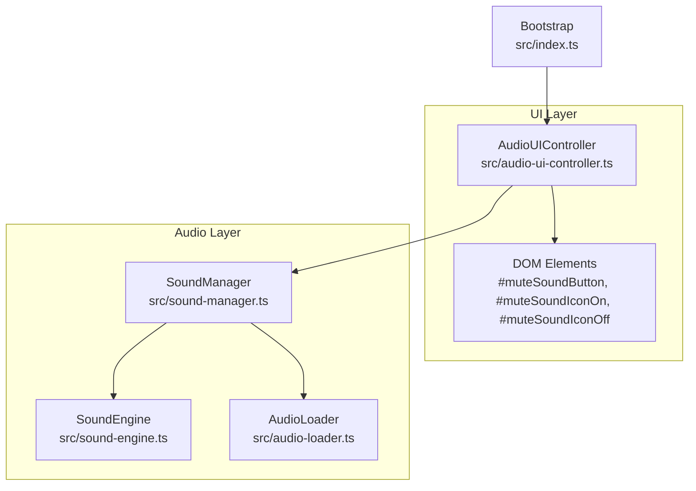
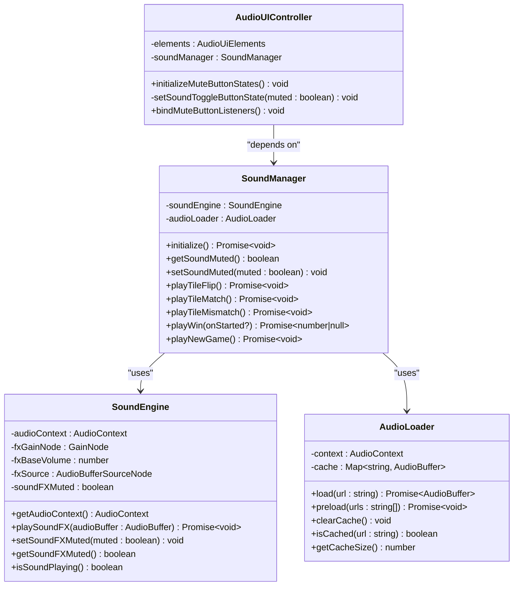
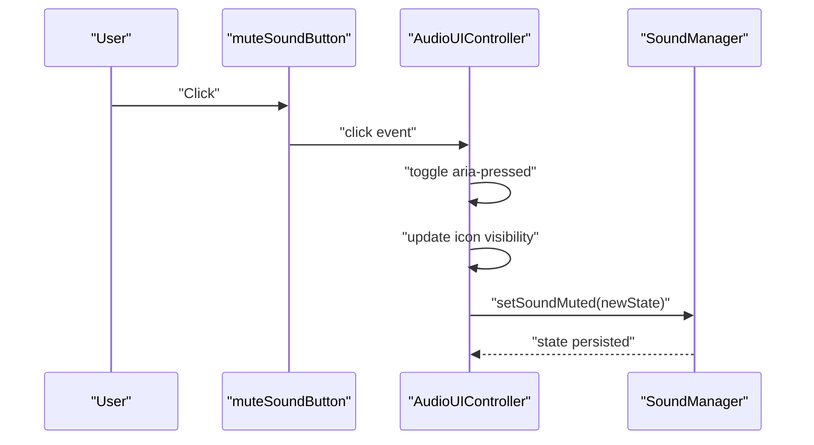
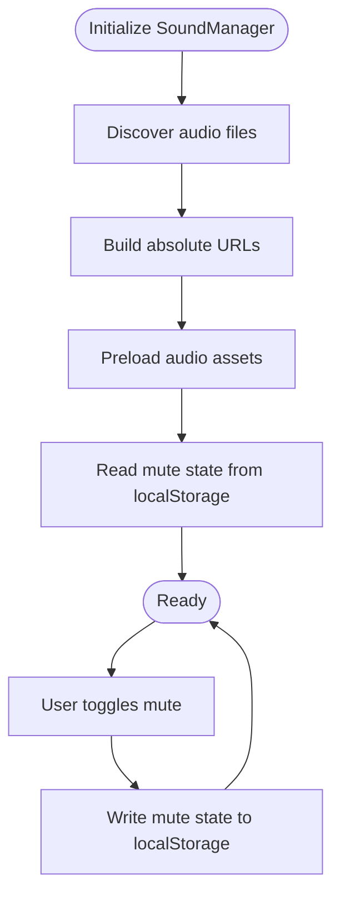
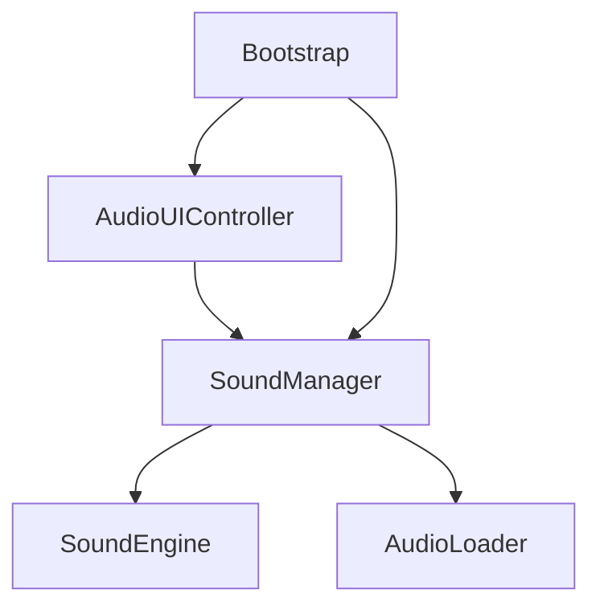

# Audio UI Controller

<cite>
**Referenced Files in This Document**
- [audio-ui-controller.ts](file://src/audio-ui-controller.ts)
- [sound-manager.ts](file://src/sound-manager.ts)
- [sound-engine.ts](file://src/sound-engine.ts)
- [audio-loader.ts](file://src/audio-loader.ts)
- [index.ts](file://src/index.ts)
- [audio-ui-controller.test.ts](file://tests/audio-ui-controller.test.ts)
</cite>

## Table of Contents
1. [Introduction](#introduction)
2. [Project Structure](#project-structure)
3. [Core Components](#core-components)
4. [Architecture Overview](#architecture-overview)
5. [Detailed Component Analysis](#detailed-component-analysis)
6. [Dependency Analysis](#dependency-analysis)
7. [Performance Considerations](#performance-considerations)
8. [Troubleshooting Guide](#troubleshooting-guide)
9. [Conclusion](#conclusion)

## Introduction
This document provides comprehensive technical documentation for the AudioUIController class, focusing on user interface integration and audio settings management. It explains the mute toggle functionality, volume control integration, and audio preference persistence. The document covers the implementation of the audio settings panel, user interaction handling, and state synchronization with the SoundManager. It also details localStorage integration for audio preferences, UI state management, and accessibility considerations. Practical examples demonstrate audio setting changes, UI feedback mechanisms, and responsive audio controls. Finally, it addresses the relationship with the main UI system, keyboard shortcuts for audio controls, screen reader compatibility, and common UI issues such as state synchronization, visual feedback, and cross-platform input handling.

## Project Structure
The AudioUIController resides in the client-side application and coordinates user interactions with the SoundManager. The SoundManager manages audio lifecycle, including initialization, muting, and playback orchestration. The SoundEngine encapsulates Web Audio API operations, while the AudioLoader handles asset loading and caching. The main application bootstrap wires the AudioUIController into the UI and initializes the SoundManager.

**Diagram sources**
- [audio-ui-controller.ts:22-55](file://src/audio-ui-controller.ts#L22-L55)
- [sound-manager.ts:238-462](file://src/sound-manager.ts#L238-L462)
- [sound-engine.ts:8-110](file://src/sound-engine.ts#L8-L110)
- [audio-loader.ts:7-118](file://src/audio-loader.ts#L7-L118)
- [index.ts:241-249](file://src/index.ts#L241-L249)

**Section sources**
- [audio-ui-controller.ts:1-56](file://src/audio-ui-controller.ts#L1-L56)
- [sound-manager.ts:1-462](file://src/sound-manager.ts#L1-L462)
- [sound-engine.ts:1-110](file://src/sound-engine.ts#L1-L110)
- [audio-loader.ts:1-118](file://src/audio-loader.ts#L1-L118)
- [index.ts:241-249](file://src/index.ts#L241-L249)

## Core Components
- AudioUIController: Manages the mute/unmute toggle UI, synchronizes state with SoundManager, and applies accessibility attributes and visual feedback.
- SoundManager: Initializes audio assets, maintains mute state, persists mute preference to localStorage, and orchestrates playback.
- SoundEngine: Implements Web Audio API playback, gain control, and mute state propagation.
- AudioLoader: Fetches, decodes, and caches audio assets to minimize latency and redundant network requests.
- Bootstrap: Wires AudioUIController to DOM elements, initializes SoundManager, and binds UI listeners.

Key responsibilities:
- UI state synchronization: AudioUIController reflects SoundManager’s mute state and updates DOM attributes and icon visibility.
- Persistence: SoundManager writes mute state to localStorage and reads it during initialization.
- Accessibility: Uses aria-pressed, aria-label, and title attributes for screen reader and tooltip support.
- Cross-platform input handling: Listens for click events on the mute button; tested with both HTML and SVG icons.

**Section sources**
- [audio-ui-controller.ts:22-55](file://src/audio-ui-controller.ts#L22-L55)
- [sound-manager.ts:238-306](file://src/sound-manager.ts#L238-L306)
- [sound-engine.ts:8-110](file://src/sound-engine.ts#L8-L110)
- [audio-loader.ts:7-118](file://src/audio-loader.ts#L7-L118)
- [index.ts:1074-1096](file://src/index.ts#L1074-L1096)

## Architecture Overview
The AudioUIController acts as a thin UI adapter around SoundManager. It translates user interactions into state changes and ensures the UI reflects the current audio state. SoundManager centralizes audio lifecycle management, including initialization, muting, and persistence. SoundEngine and AudioLoader provide the underlying Web Audio API and asset management capabilities.

**Diagram sources**
- [audio-ui-controller.ts:22-55](file://src/audio-ui-controller.ts#L22-L55)
- [sound-manager.ts:238-462](file://src/sound-manager.ts#L238-L462)
- [sound-engine.ts:8-110](file://src/sound-engine.ts#L8-L110)
- [audio-loader.ts:7-118](file://src/audio-loader.ts#L7-L118)

## Detailed Component Analysis

### AudioUIController
The AudioUIController manages the mute toggle button and synchronizes UI state with SoundManager. It supports both HTML and SVG icon elements and ensures proper accessibility attributes.

Implementation highlights:
- Dependencies: Accepts DOM elements and SoundManager via constructor injection.
- State initialization: Reads SoundManager’s mute state and sets button attributes and icon visibility accordingly.
- Event binding: Listens for click events on the mute button, toggles state, updates UI, and delegates to SoundManager.
- Accessibility: Sets aria-pressed, aria-label, and title attributes to reflect current state and provide tooltips.
- Visual feedback: Uses a helper to toggle the hidden attribute on icon elements, accommodating both HTML and SVG nodes.

**Diagram sources**
- [audio-ui-controller.ts:47-54](file://src/audio-ui-controller.ts#L47-L54)
- [sound-manager.ts:303-306](file://src/sound-manager.ts#L303-L306)

**Section sources**
- [audio-ui-controller.ts:22-55](file://src/audio-ui-controller.ts#L22-L55)
- [audio-ui-controller.test.ts:45-101](file://tests/audio-ui-controller.test.ts#L45-L101)

### SoundManager
The SoundManager initializes audio assets, categorizes them, and maintains mute state. It reads initial mute state from localStorage and writes changes back to it.

Key behaviors:
- Initialization: Discovers audio files from multiple sources, builds absolute URLs, and preloads assets.
- Mute state: Exposes getSoundMuted and setSoundMuted, persisting changes to localStorage.
- Playback orchestration: Provides methods to trigger tile flip, match, mismatch, win, and new game sounds.
- Audio context management: Ensures the Web Audio context is running before playback.

**Diagram sources**
- [sound-manager.ts:264-297](file://src/sound-manager.ts#L264-L297)
- [sound-manager.ts:109-129](file://src/sound-manager.ts#L109-L129)

**Section sources**
- [sound-manager.ts:238-306](file://src/sound-manager.ts#L238-L306)
- [sound-manager.ts:109-129](file://src/sound-manager.ts#L109-L129)

### SoundEngine
The SoundEngine encapsulates Web Audio API operations, including gain control and mute state propagation. It stops currently playing sounds when muting and restores volume when unmuting.

Key behaviors:
- Gain control: Uses a GainNode to adjust volume for sound effects.
- Mute handling: Updates gain value when muting/unmuting and stops current playback.
- Playback: Creates AudioBufferSourceNodes, connects them to the gain node, and plays audio.

**Section sources**
- [sound-engine.ts:8-110](file://src/sound-engine.ts#L8-L110)

### AudioLoader
The AudioLoader manages asset loading and caching, reducing latency and avoiding redundant network requests. It wraps errors with contextual information and logs preload failures.

Key behaviors:
- Loading: Fetches audio data, decodes it, and caches the AudioBuffer.
- Preloading: Loads multiple assets concurrently and logs failures.
- Cache management: Provides methods to clear cache, check presence, and inspect cache size.

**Section sources**
- [audio-loader.ts:30-88](file://src/audio-loader.ts#L30-L88)

### Bootstrap Integration
The main application bootstrap wires the AudioUIController to DOM elements, initializes SoundManager, and binds UI listeners. It ensures the UI reflects the persisted mute state after initialization.

Integration steps:
- Create SoundManager and AudioUIController instances.
- Bind mute button listeners.
- Initialize AudioUIController state.
- Render UI and start the application loop.

**Section sources**
- [index.ts:241-249](file://src/index.ts#L241-L249)
- [index.ts:1074-1096](file://src/index.ts#L1074-L1096)

## Dependency Analysis
AudioUIController depends on SoundManager for state queries and mutations. SoundManager depends on SoundEngine for playback and AudioLoader for asset management. The bootstrap layer composes these dependencies and wires UI events.

**Diagram sources**
- [audio-ui-controller.ts:22-30](file://src/audio-ui-controller.ts#L22-L30)
- [sound-manager.ts:238-262](file://src/sound-manager.ts#L238-L262)
- [index.ts:241-249](file://src/index.ts#L241-L249)

**Section sources**
- [audio-ui-controller.ts:22-30](file://src/audio-ui-controller.ts#L22-L30)
- [sound-manager.ts:238-262](file://src/sound-manager.ts#L238-L262)
- [index.ts:241-249](file://src/index.ts#L241-L249)

## Performance Considerations
- Asset caching: AudioLoader caches decoded buffers to minimize repeated fetches and decoding overhead.
- Concurrency: Preloading uses Promise.allSettled to load multiple assets concurrently while continuing on individual failures.
- Gain control: SoundEngine updates gain value immediately upon mute/unmute, avoiding unnecessary audio stops/start cycles.
- Lazy initialization: SoundManager defers asset discovery and preloading until initialize is called, reducing startup cost.

[No sources needed since this section provides general guidance]

## Troubleshooting Guide
Common UI issues and resolutions:
- State desynchronization: Ensure initializeMuteButtonStates is called after SoundManager initialization and that bindMuteButtonListeners is attached after DOM readiness.
- Visual feedback not updating: Verify that setElementHidden is used for both HTML and SVG icon elements, as the .hidden property behaves differently on SVG elements.
- Accessibility regressions: Confirm aria-pressed, aria-label, and title attributes are updated consistently with mute state.
- Cross-platform input handling: Test click events on various devices and browsers; ensure event listeners are attached after DOM elements are present.

Validation via tests:
- Mute button state initialization and toggling behavior.
- Hidden attribute handling for both HTML and SVG icons.
- Accessibility attribute updates on state changes.

**Section sources**
- [audio-ui-controller.test.ts:45-101](file://tests/audio-ui-controller.test.ts#L45-L101)
- [audio-ui-controller.test.ts:132-170](file://tests/audio-ui-controller.test.ts#L132-L170)

## Conclusion
The AudioUIController provides a clean separation between UI concerns and audio state management. By delegating audio lifecycle to SoundManager and leveraging SoundEngine and AudioLoader, it achieves robust, accessible, and performant audio controls. Proper initialization, event binding, and state synchronization ensure reliable user experiences across platforms and assistive technologies.