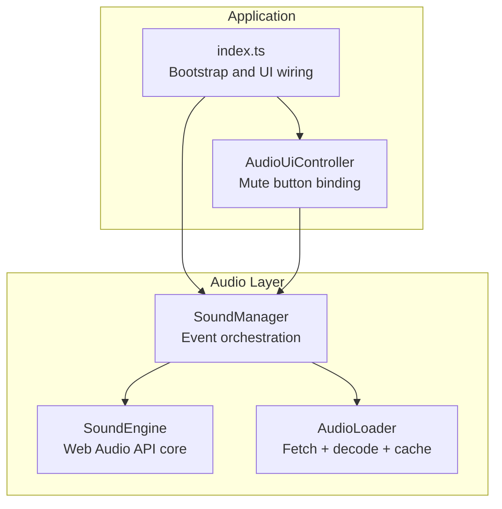
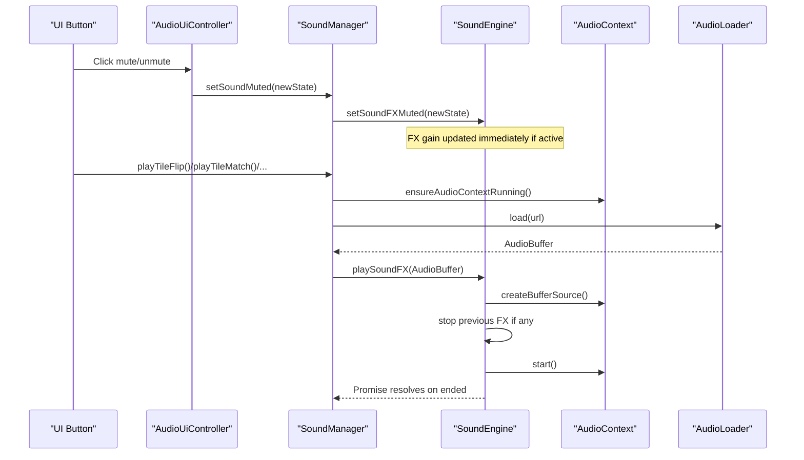
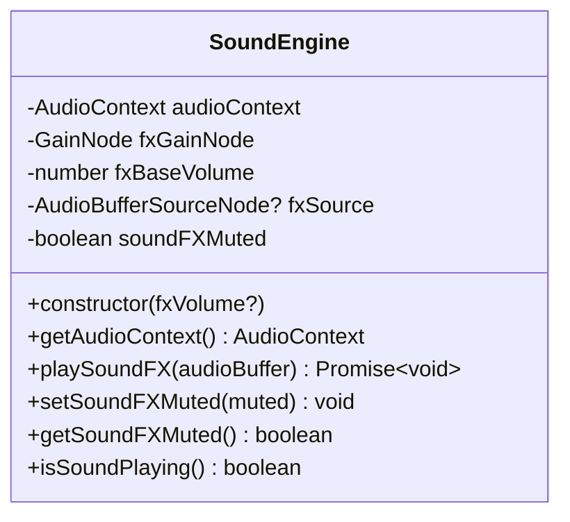
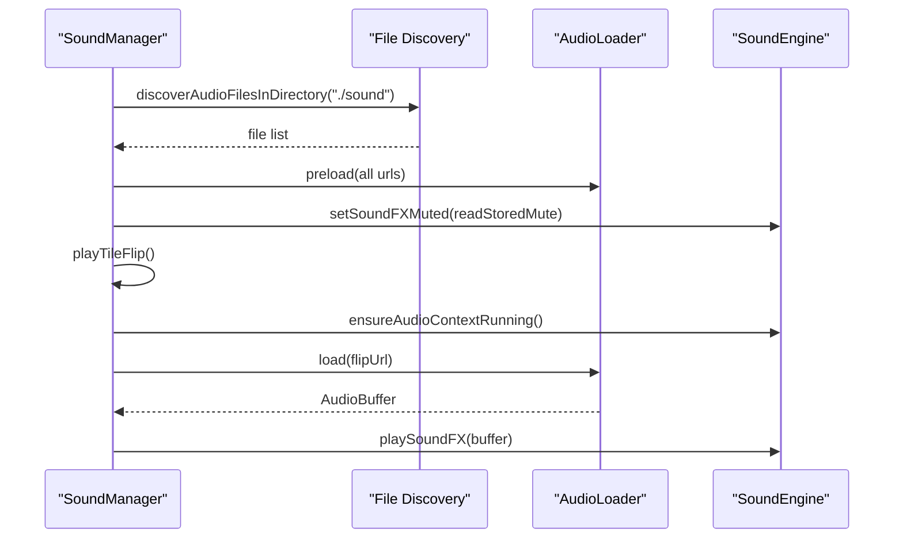
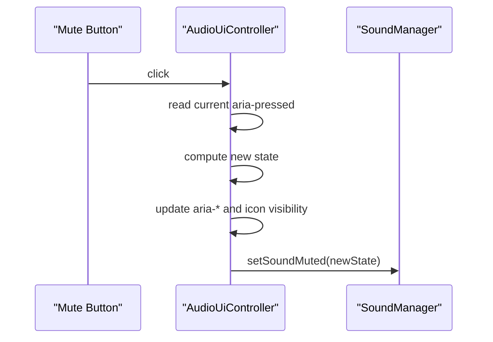
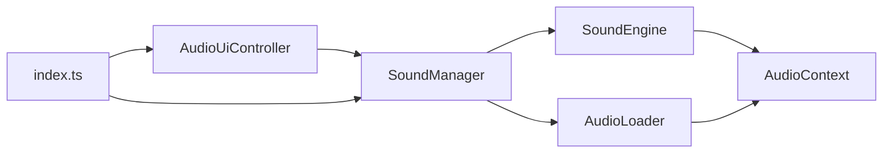

# Sound Engine

<cite>
**Referenced Files in This Document**
- [sound-engine.ts](file://src/sound-engine.ts)
- [audio-loader.ts](file://src/audio-loader.ts)
- [sound-manager.ts](file://src/sound-manager.ts)
- [audio-ui-controller.ts](file://src/audio-ui-controller.ts)
- [index.ts](file://src/index.ts)
- [sound-engine.test.ts](file://tests/sound-engine.test.ts)
- [sound-manager.test.ts](file://tests/sound-manager.test.ts)
- [audio-formats.json](file://config/audio-formats.json)
- [sound-engine-plan.md](file://docs/sound-engine-plan.md)
</cite>

## Table of Contents
1. [Introduction](#introduction)
2. [Project Structure](#project-structure)
3. [Core Components](#core-components)
4. [Architecture Overview](#architecture-overview)
5. [Detailed Component Analysis](#detailed-component-analysis)
6. [Dependency Analysis](#dependency-analysis)
7. [Performance Considerations](#performance-considerations)
8. [Troubleshooting Guide](#troubleshooting-guide)
9. [Conclusion](#conclusion)
10. [Appendices](#appendices)

## Introduction
This document explains the SoundEngine class and its surrounding audio system, focusing on Web Audio API integration and low-level audio processing. It covers AudioContext lifecycle, sound buffer handling, volume control, and the playback pipeline. It also documents autoplay restrictions handling, resume functionality, and practical examples for sound effect playback, volume adjustments, and memory management. Finally, it outlines cross-browser compatibility considerations and performance optimization techniques.

## Project Structure
The audio subsystem consists of four main modules:
- SoundEngine: Core Web Audio API integration and one-shot sound playback
- AudioLoader: Asset loading, decoding, and caching
- SoundManager: High-level orchestration, event mapping, and initialization
- AudioUiController: UI binding for mute/unmute and accessibility attributes



**Diagram sources**
- [index.ts:1074-1096](file://src/index.ts#L1074-L1096)
- [audio-ui-controller.ts:22-55](file://src/audio-ui-controller.ts#L22-L55)
- [sound-manager.ts:238-297](file://src/sound-manager.ts#L238-L297)
- [sound-engine.ts:8-109](file://src/sound-engine.ts#L8-L109)
- [audio-loader.ts:7-118](file://src/audio-loader.ts#L7-L118)

**Section sources**
- [index.ts:1074-1096](file://src/index.ts#L1074-L1096)
- [audio-ui-controller.ts:22-55](file://src/audio-ui-controller.ts#L22-L55)
- [sound-manager.ts:238-297](file://src/sound-manager.ts#L238-L297)
- [sound-engine.ts:8-109](file://src/sound-engine.ts#L8-L109)
- [audio-loader.ts:7-118](file://src/audio-loader.ts#L7-L118)

## Core Components
- SoundEngine
  - Manages a single AudioContext and a dedicated FX GainNode
  - Plays one-shot AudioBuffer instances via AudioBufferSourceNode
  - Provides mute control and playback state queries
  - Implements immediate stop-and-start semantics when playing overlapping FX
- AudioLoader
  - Fetches audio resources, decodes to AudioBuffer, and caches results
  - Supports preloading multiple files concurrently
  - Provides cache inspection and clearing for memory management
- SoundManager
  - Initializes the audio system, discovers and groups audio assets
  - Maps game events to specific sound files and randomizes selection
  - Ensures AudioContext is running before playback
  - Persists mute state to localStorage
- AudioUiController
  - Binds mute button UI to SoundManager
  - Updates ARIA attributes and icon visibility for accessibility

**Section sources**
- [sound-engine.ts:8-109](file://src/sound-engine.ts#L8-L109)
- [audio-loader.ts:7-118](file://src/audio-loader.ts#L7-L118)
- [sound-manager.ts:238-461](file://src/sound-manager.ts#L238-L461)
- [audio-ui-controller.ts:22-55](file://src/audio-ui-controller.ts#L22-L55)

## Architecture Overview
The audio pipeline integrates tightly with the application bootstrap and UI:
- Bootstrap initializes SoundManager and AudioUiController
- SoundManager discovers and preloads audio assets
- UI mute button toggles SoundManager’s mute state
- Game events trigger SoundManager methods that ensure AudioContext is running and then play appropriate FX



**Diagram sources**
- [index.ts:1074-1096](file://src/index.ts#L1074-L1096)
- [audio-ui-controller.ts:47-54](file://src/audio-ui-controller.ts#L47-L54)
- [sound-manager.ts:308-439](file://src/sound-manager.ts#L308-L439)
- [sound-engine.ts:47-75](file://src/sound-engine.ts#L47-L75)
- [audio-loader.ts:30-64](file://src/audio-loader.ts#L30-L64)

## Detailed Component Analysis

### SoundEngine
SoundEngine encapsulates the Web Audio API core for one-shot sound effects:
- AudioContext creation and destination connection
- FX GainNode for volume control
- One-shot playback via AudioBufferSourceNode
- Mute handling with immediate gain updates
- Playback state tracking



**Diagram sources**
- [sound-engine.ts:8-109](file://src/sound-engine.ts#L8-L109)

Key behaviors:
- playSoundFX stops any currently playing FX, creates a fresh source, connects it to the FX GainNode, and waits for the ended event
- setSoundFXMuted updates internal mute state and immediately sets the FX GainNode gain to 0 or the base volume if a source is active
- isSoundPlaying reports whether a source is currently connected

Practical examples (paths):
- One-shot playback: [sound-engine.ts:47-75](file://src/sound-engine.ts#L47-L75)
- Immediate mute/unmute: [sound-engine.ts:82-89](file://src/sound-engine.ts#L82-L89)
- Playback state: [sound-engine.ts:106-108](file://src/sound-engine.ts#L106-L108)

**Section sources**
- [sound-engine.ts:8-109](file://src/sound-engine.ts#L8-L109)
- [sound-engine.test.ts:129-226](file://tests/sound-engine.test.ts#L129-L226)

### AudioLoader
AudioLoader handles fetching, decoding, and caching of audio assets:
- Uses the provided AudioContext to decode binary responses
- Caches decoded buffers keyed by URL
- Supports preloading multiple files concurrently with partial failure logging
- Exposes cache inspection and clearing for memory management

```mermaid
flowchart TD
Start([Load(url)]) --> CheckCache["Check cache for url"]
CheckCache --> Cached{"Cached?"}
Cached --> |Yes| ReturnCache["Return cached AudioBuffer"]
Cached --> |No| Fetch["fetch(url)"]
Fetch --> Ok{"response.ok?"}
Ok --> |No| ThrowFetchErr["Throw fetch error"]
Ok --> |Yes| Decode["decodeAudioData(arrayBuffer)"]
Decode --> Store["cache.set(url, buffer)"]
Store --> ReturnBuf["Return AudioBuffer"]
```

**Diagram sources**
- [audio-loader.ts:30-64](file://src/audio-loader.ts#L30-L64)

Practical examples (paths):
- Single load: [audio-loader.ts:30-64](file://src/audio-loader.ts#L30-L64)
- Preload multiple: [audio-loader.ts:75-88](file://src/audio-loader.ts#L75-L88)
- Cache inspection/clear: [audio-loader.ts:105-97](file://src/audio-loader.ts#L105-L97)

**Section sources**
- [audio-loader.ts:7-118](file://src/audio-loader.ts#L7-L118)

### SoundManager
SoundManager orchestrates audio assets and game events:
- Discovers audio files from multiple sources (JSON index, asset-index endpoint, directory listing)
- Groups files by category (general FX, tile flip, match, mismatch, new game, win)
- Preloads all assets and initializes mute state from localStorage
- Provides convenience methods for game events and ensures AudioContext is running before playback
- Implements a pending-new-game guard to prevent overlapping new-game FX



**Diagram sources**
- [sound-manager.ts:264-297](file://src/sound-manager.ts#L264-L297)
- [sound-manager.ts:308-368](file://src/sound-manager.ts#L308-L368)
- [sound-manager.ts:441-460](file://src/sound-manager.ts#L441-L460)

Practical examples (paths):
- Initialization and preload: [sound-manager.ts:264-297](file://src/sound-manager.ts#L264-L297)
- Ensure AudioContext running: [sound-manager.ts:441-460](file://src/sound-manager.ts#L441-L460)
- Event methods: [sound-manager.ts:308-439](file://src/sound-manager.ts#L308-L439)

**Section sources**
- [sound-manager.ts:238-461](file://src/sound-manager.ts#L238-L461)
- [sound-manager.test.ts:114-653](file://tests/sound-manager.test.ts#L114-L653)

### AudioUiController
AudioUiController binds the mute button to SoundManager and manages UI state:
- Reads current mute state from SoundManager
- Updates aria-pressed, aria-label, and title attributes
- Toggles icon visibility for on/off states
- Listens for click events and toggles mute via SoundManager



**Diagram sources**
- [audio-ui-controller.ts:32-54](file://src/audio-ui-controller.ts#L32-L54)
- [index.ts:1024](file://src/index.ts#L1024)

**Section sources**
- [audio-ui-controller.ts:22-55](file://src/audio-ui-controller.ts#L22-L55)
- [index.ts:1024](file://src/index.ts#L1024)

## Dependency Analysis
The modules are loosely coupled with clear responsibilities:
- SoundEngine depends on Web Audio API types and is self-contained
- AudioLoader depends on SoundEngine’s AudioContext for decoding
- SoundManager composes SoundEngine and AudioLoader and coordinates initialization and playback
- AudioUiController depends on SoundManager for mute state and actions
- index.ts wires everything together during bootstrap



**Diagram sources**
- [sound-engine.ts:22-29](file://src/sound-engine.ts#L22-L29)
- [audio-loader.ts:15-17](file://src/audio-loader.ts#L15-L17)
- [sound-manager.ts:259-262](file://src/sound-manager.ts#L259-L262)
- [audio-ui-controller.ts:27-30](file://src/audio-ui-controller.ts#L27-L30)
- [index.ts:1074-1096](file://src/index.ts#L1074-L1096)

**Section sources**
- [sound-engine.ts:22-29](file://src/sound-engine.ts#L22-L29)
- [audio-loader.ts:15-17](file://src/audio-loader.ts#L15-L17)
- [sound-manager.ts:259-262](file://src/sound-manager.ts#L259-L262)
- [audio-ui-controller.ts:27-30](file://src/audio-ui-controller.ts#L27-L30)
- [index.ts:1074-1096](file://src/index.ts#L1074-L1096)

## Performance Considerations
- Memory management
  - Use AudioLoader.clearCache() when audio assets are no longer needed
  - Prefer preloading to avoid repeated fetch/decode overhead
- Playback efficiency
  - One-shot FX are short-lived; avoid long-lived nodes
  - Stop previous FX before starting new ones to prevent resource contention
- Volume control
  - Adjust fxBaseVolume in SoundEngine constructor to tune FX levels
  - Immediate gain updates minimize latency when muting/unmuting during playback
- Autoplay and resume
  - Ensure AudioContext is running before playback to avoid silent failures
  - Resume AudioContext on user gestures to satisfy browser autoplay policies

[No sources needed since this section provides general guidance]

## Troubleshooting Guide
Common issues and remedies:
- Context suspended or inactive
  - Symptom: No sound despite successful load
  - Remedy: Call ensureAudioContextRunning before play methods
  - Reference: [sound-manager.ts:441-460](file://src/sound-manager.ts#L441-L460)
- Overlapping FX not stopping
  - Symptom: Old FX still audible
  - Remedy: playSoundFX automatically stops previous FX; ensure it is invoked for each new FX
  - Reference: [sound-engine.ts:54-58](file://src/sound-engine.ts#L54-L58)
- Mute not taking effect
  - Symptom: FX still audible after mute
  - Remedy: setSoundFXMuted updates gain immediately; verify it is called before or during playback
  - Reference: [sound-engine.ts:82-89](file://src/sound-engine.ts#L82-L89)
- Buffer loading failures
  - Symptom: Errors thrown during load
  - Remedy: Inspect wrapped error messages; ensure URLs are correct and reachable
  - Reference: [audio-loader.ts:50-63](file://src/audio-loader.ts#L50-L63)
- Asset discovery inconsistencies
  - Symptom: No audio files discovered
  - Remedy: Verify JSON index, asset-index endpoint, or directory listing availability
  - Reference: [sound-manager.ts:196-226](file://src/sound-manager.ts#L196-L226)

**Section sources**
- [sound-manager.ts:441-460](file://src/sound-manager.ts#L441-L460)
- [sound-engine.ts:54-58](file://src/sound-engine.ts#L54-L58)
- [sound-engine.ts:82-89](file://src/sound-engine.ts#L82-L89)
- [audio-loader.ts:50-63](file://src/audio-loader.ts#L50-L63)
- [sound-manager.ts:196-226](file://src/sound-manager.ts#L196-L226)

## Conclusion
The SoundEngine module provides a focused, efficient foundation for one-shot sound effects using the Web Audio API. Combined with AudioLoader for robust asset handling, SoundManager for orchestration and autoplay-respecting playback, and AudioUiController for accessible UI integration, the system delivers responsive, reliable audio across browsers. Proper initialization, context management, and memory hygiene ensure smooth performance and a high-quality user experience.

[No sources needed since this section summarizes without analyzing specific files]

## Appendices

### Web Audio API Pipeline and Specifications
- AudioContext lifecycle and autoplay policies
  - Reference: [sound-manager.ts:441-460](file://src/sound-manager.ts#L441-L460)
- GainNode for volume control
  - Reference: [sound-engine.ts:26-28](file://src/sound-engine.ts#L26-L28)
- AudioBufferSourceNode for one-shot playback
  - Reference: [sound-engine.ts:61-64](file://src/sound-engine.ts#L61-L64)

### Cross-Browser Compatibility Notes
- Autoplay restrictions vary by browser; always resume AudioContext on user gesture
  - Reference: [sound-manager.ts:441-460](file://src/sound-manager.ts#L441-L460)
- Supported audio formats are defined centrally
  - Reference: [audio-formats.json:1-4](file://config/audio-formats.json#L1-L4)

### Practical Examples (Paths)
- One-shot FX playback: [sound-engine.ts:47-75](file://src/sound-engine.ts#L47-L75)
- Mute/unmute during playback: [sound-engine.ts:82-89](file://src/sound-engine.ts#L82-L89)
- Ensure AudioContext running: [sound-manager.ts:441-460](file://src/sound-manager.ts#L441-L460)
- Preload assets: [audio-loader.ts:75-88](file://src/audio-loader.ts#L75-L88)
- UI mute toggle: [audio-ui-controller.ts:47-54](file://src/audio-ui-controller.ts#L47-L54)