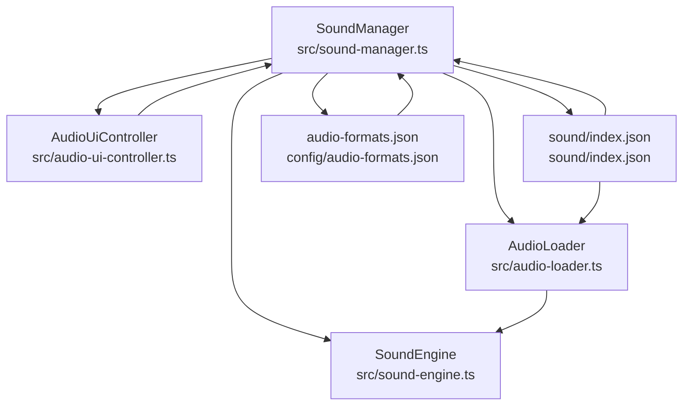
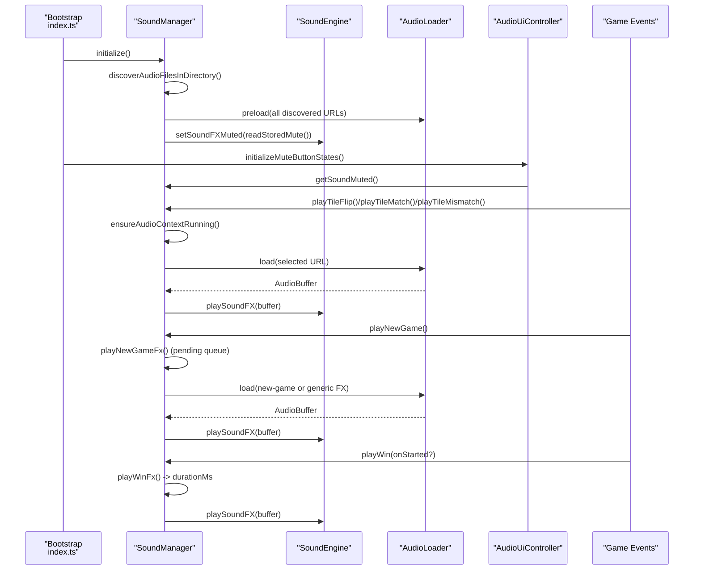
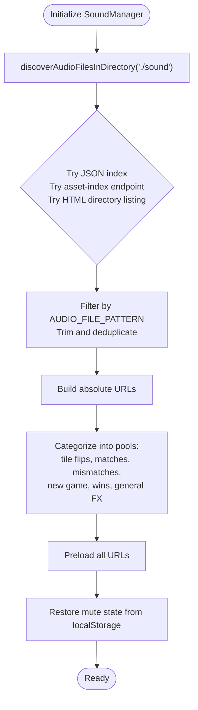
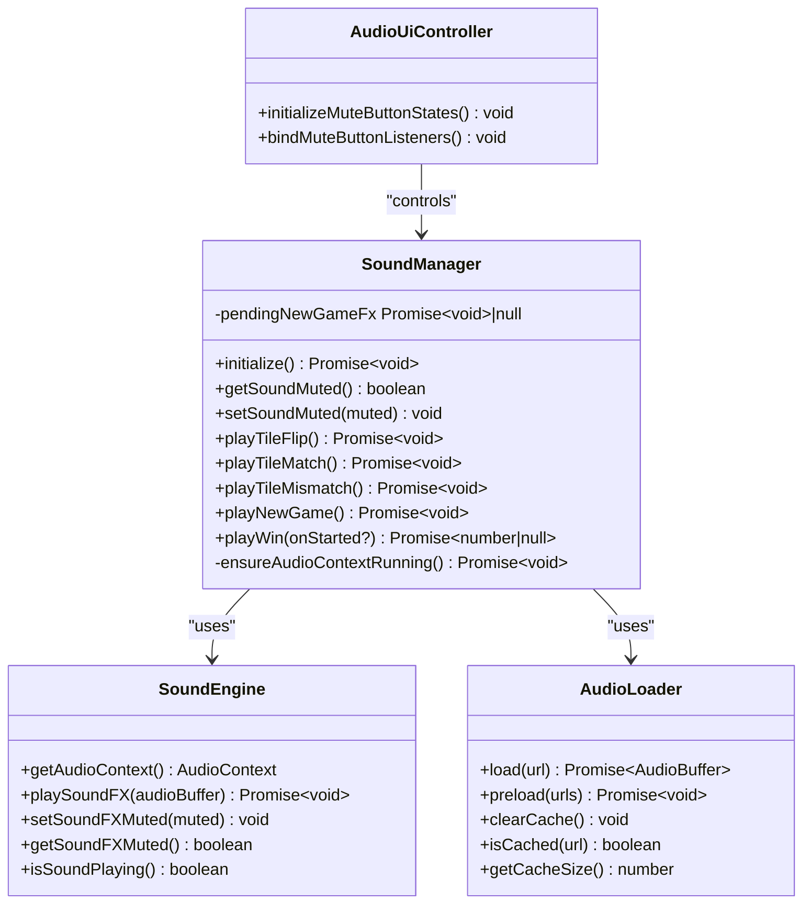
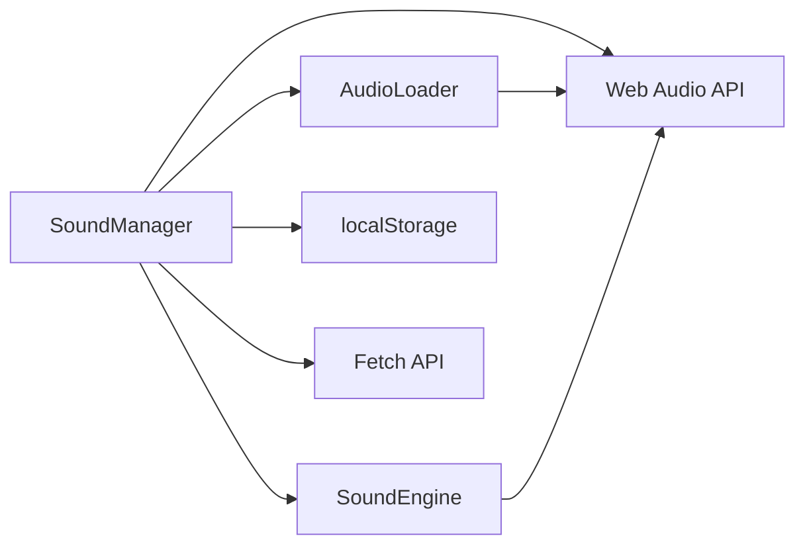

# Sound Manager

<cite>
**Referenced Files in This Document**
- [sound-manager.ts](file://src/sound-manager.ts)
- [audio-loader.ts](file://src/audio-loader.ts)
- [sound-engine.ts](file://src/sound-engine.ts)
- [audio-ui-controller.ts](file://src/audio-ui-controller.ts)
- [index.ts](file://src/index.ts)
- [sound/index.json](file://sound/index.json)
- [config/audio-formats.json](file://config/audio-formats.json)
- [tests/sound-manager.test.ts](file://tests/sound-manager.test.ts)
</cite>

## Table of Contents
1. [Introduction](#introduction)
2. [Project Structure](#project-structure)
3. [Core Components](#core-components)
4. [Architecture Overview](#architecture-overview)
5. [Detailed Component Analysis](#detailed-component-analysis)
6. [Dependency Analysis](#dependency-analysis)
7. [Performance Considerations](#performance-considerations)
8. [Troubleshooting Guide](#troubleshooting-guide)
9. [Conclusion](#conclusion)

## Introduction
This document provides comprehensive technical documentation for the SoundManager class, which orchestrates audio coordination and playback in the application. It covers initialization strategies, audio discovery mechanisms, category-based sound selection, round-robin randomization, pending new-game FX queue management, audio context state handling, browser autoplay policy compliance, and integration with UI controls and game events.

## Project Structure
The sound subsystem consists of:
- SoundManager: Central coordinator for audio discovery, categorization, playback orchestration, and state persistence
- SoundEngine: Web Audio API-based playback engine with gain control and mute state
- AudioLoader: Asset loader and cache for decoded audio buffers
- AudioUiController: UI binding for mute/unmute actions
- Index integration: Bootstrap initializes SoundManager and wires it to game events
- Test coverage: Extensive unit tests validating discovery strategies, category selection, and playback behavior

**Diagram sources**
- [sound-manager.ts:238-461](file://src/sound-manager.ts#L238-L461)
- [sound-engine.ts:8-110](file://src/sound-engine.ts#L8-L110)
- [audio-loader.ts:7-118](file://src/audio-loader.ts#L7-L118)
- [audio-ui-controller.ts:22-56](file://src/audio-ui-controller.ts#L22-L56)
- [sound/index.json:1-17](file://sound/index.json#L1-L17)
- [config/audio-formats.json:1-4](file://config/audio-formats.json#L1-L4)

**Section sources**
- [sound-manager.ts:1-462](file://src/sound-manager.ts#L1-L462)
- [sound-engine.ts:1-110](file://src/sound-engine.ts#L1-L110)
- [audio-loader.ts:1-118](file://src/audio-loader.ts#L1-L118)
- [audio-ui-controller.ts:1-56](file://src/audio-ui-controller.ts#L1-L56)
- [index.ts:241-1096](file://src/index.ts#L241-L1096)
- [sound/index.json:1-17](file://sound/index.json#L1-L17)
- [config/audio-formats.json:1-4](file://config/audio-formats.json#L1-L4)

## Core Components
- SoundManager: Initializes audio discovery, builds category pools, manages playback queues, and persists mute state
- SoundEngine: Provides Web Audio API context, gain control, and one-shot playback with mute awareness
- AudioLoader: Fetches, decodes, and caches audio buffers with preloading and error handling
- AudioUiController: Binds mute button UI to SoundManager state and updates accessibility attributes
- Discovery and categories: Pattern-based selectors for tile flips, matches, mismatches, new games, and wins

Key responsibilities:
- Initialization: Discovers audio files via multiple strategies, builds category pools, preloads assets, and restores mute state
- Playback orchestration: Ensures audio context is running, selects from category-specific round-robin pools, and coordinates new-game FX queuing
- State persistence: Reads/writes mute state to localStorage with graceful fallbacks
- Browser autoplay policy: Resumes AudioContext on user gestures and ensures playback safety

**Section sources**
- [sound-manager.ts:238-461](file://src/sound-manager.ts#L238-L461)
- [sound-engine.ts:8-110](file://src/sound-engine.ts#L8-L110)
- [audio-loader.ts:7-118](file://src/audio-loader.ts#L7-L118)
- [audio-ui-controller.ts:22-56](file://src/audio-ui-controller.ts#L22-L56)

## Architecture Overview
SoundManager integrates with the application bootstrap and game flow:

**Diagram sources**
- [index.ts:1074-1096](file://src/index.ts#L1074-L1096)
- [sound-manager.ts:264-461](file://src/sound-manager.ts#L264-L461)
- [sound-engine.ts:47-99](file://src/sound-engine.ts#L47-L99)
- [audio-loader.ts:30-88](file://src/audio-loader.ts#L30-L88)
- [audio-ui-controller.ts:32-54](file://src/audio-ui-controller.ts#L32-L54)

## Detailed Component Analysis

### SoundManager: Initialization and Dual-Discovery Strategy
SoundManager performs a robust, multi-strategy audio discovery to locate available sound assets:

- JSON index discovery: Attempts to fetch ./sound/index.json and accepts either a flat array of filenames or an object containing a files array
- Asset-index endpoint discovery: Queries /__asset-index?dir=./sound for server-side asset indexing
- HTML directory listing discovery: Fetches the directory as text/html and parses anchor href attributes for audio files

After discovery, SoundManager:
- Builds absolute asset URLs
- Filters files into category pools using regex patterns
- Preloads all discovered assets
- Restores mute state from localStorage

**Diagram sources**
- [sound-manager.ts:196-226](file://src/sound-manager.ts#L196-L226)
- [sound-manager.ts:264-297](file://src/sound-manager.ts#L264-L297)

**Section sources**
- [sound-manager.ts:131-226](file://src/sound-manager.ts#L131-L226)
- [sound-manager.ts:264-297](file://src/sound-manager.ts#L264-L297)
- [sound/index.json:1-17](file://sound/index.json#L1-L17)
- [config/audio-formats.json:1-4](file://config/audio-formats.json#L1-L4)

### Category-Based Sound Selection
SoundManager organizes discovered files into category-specific pools using filename patterns:
- Tile flips: filenames starting with flip*
- Matches: filenames starting with match*
- Mismatches: filenames starting with mismatch*
- New game: filenames starting with newgame*
- Wins: filenames starting with win*
- General FX: all other audio files

Category selection helpers:
- selectTileFlipFiles
- selectMatchFiles
- selectMismatchFiles
- selectNewGameFiles
- selectWinFiles
- selectGeneralFxFiles

These functions ensure only audio files matching the intended category are included, excluding cross-category overlaps.

**Section sources**
- [sound-manager.ts:14-42](file://src/sound-manager.ts#L14-L42)

### Round-Robin Picker System
SoundManager employs a RandomRoundRobinPicker<T> to randomize selection within each category while avoiding immediate repeats. The picker maintains:
- A source array of items
- A shuffled current cycle
- An index pointer advancing through the cycle
- Automatic reshuffle when the cycle is exhausted

Behavior:
- setItems replaces the source and resets the cycle
- next returns the next item in the current cycle, reshuffling if needed
- Returns null when no items are available

This ensures variety in repeated playthroughs while preventing consecutive duplicates.

**Section sources**
- [sound-manager.ts:71-100](file://src/sound-manager.ts#L71-L100)

### Pending New-Game FX Queue Management
SoundManager enforces a single concurrent new-game FX playback using a pending promise:
- playNewGame checks for an existing pending playback
- If present, waits for completion before proceeding
- Starts a new playback, stores the promise, and clears it in a finally block
- Non-critical failures are caught and logged, allowing gameplay continuity

This prevents overlapping new-game sounds and ensures the UI remains responsive.

**Section sources**
- [sound-manager.ts:327-343](file://src/sound-manager.ts#L327-L343)
- [sound-manager.ts:404-419](file://src/sound-manager.ts#L404-L419)

### Audio Context State Handling and Autoplay Policy Compliance
SoundManager ensures the Web Audio API context is running before playback:
- Retrieves the AudioContext from SoundEngine
- Checks for resume capability and current state
- Attempts to resume if suspended
- Ignores resume failures gracefully to allow retry on next gesture

This approach complies with browser autoplay policies that require user interaction to start audio contexts.

**Section sources**
- [sound-manager.ts:441-460](file://src/sound-manager.ts#L441-L460)
- [sound-engine.ts:36-38](file://src/sound-engine.ts#L36-L38)

### Mute Functionality with localStorage Persistence
SoundManager integrates mute state persistence:
- readStoredMute reads from localStorage with a default fallback
- writeStoredMute writes the current mute state to localStorage
- AudioUiController binds mute button clicks to setSoundMuted, which persists state
- SoundEngine applies mute immediately to the gain node

Graceful handling:
- No-op when localStorage is unavailable
- Falls back to default mute state when key is missing

**Section sources**
- [sound-manager.ts:109-129](file://src/sound-manager.ts#L109-L129)
- [audio-ui-controller.ts:47-54](file://src/audio-ui-controller.ts#L47-L54)
- [sound-engine.ts:82-99](file://src/sound-engine.ts#L82-L99)

### Practical Examples of Sound Playback Coordination
Integration points in the application:
- New game: On game start, SoundManager.playNewGame() is invoked to trigger new-game FX
- Tile flip: On first selection, SoundManager.playTileFlip() triggers a randomized flip sound
- Match: On successful pair, SoundManager.playTileMatch() triggers a match sound
- Mismatch: On mismatch, SoundManager.playTileMismatch() triggers a mismatch sound
- Win: On win condition, SoundManager.playWin(onStarted?) is invoked; the onStarted callback receives the sound duration

These calls occur within the game event handlers and WinSequenceController, ensuring seamless audio feedback aligned with visual effects.

**Section sources**
- [index.ts:621](file://src/index.ts#L621)
- [index.ts:672](file://src/index.ts#L672)
- [index.ts:708](file://src/index.ts#L708)
- [index.ts:678](file://src/index.ts#L678)
- [index.ts:716-766](file://src/index.ts#L716-L766)

### Implementation Details: Audio Loader and Sound Engine
AudioLoader:
- Caches decoded AudioBuffer instances keyed by URL
- Preloads multiple URLs concurrently, logging failures without throwing
- Provides isCached and getCacheSize for diagnostics

SoundEngine:
- Creates and manages an AudioContext and a gain node for FX volume
- Plays one-shot buffers, stopping any currently playing FX
- Applies mute by adjusting gain to zero or restoring base volume

**Section sources**
- [audio-loader.ts:30-118](file://src/audio-loader.ts#L30-L118)
- [sound-engine.ts:47-109](file://src/sound-engine.ts#L47-L109)

### Relationship Between SoundManager and Other Audio Components
- SoundManager depends on SoundEngine for Web Audio API context and playback
- SoundManager depends on AudioLoader for fetching and decoding audio assets
- AudioUiController binds UI controls to SoundManager’s mute state
- Index.ts integrates SoundManager into the bootstrap lifecycle and game event flow

**Diagram sources**
- [sound-manager.ts:238-461](file://src/sound-manager.ts#L238-L461)
- [sound-engine.ts:8-110](file://src/sound-engine.ts#L8-L110)
- [audio-loader.ts:7-118](file://src/audio-loader.ts#L7-L118)
- [audio-ui-controller.ts:22-56](file://src/audio-ui-controller.ts#L22-L56)

## Dependency Analysis
SoundManager’s dependencies and relationships:
- Internal dependencies: SoundEngine (AudioContext and playback), AudioLoader (fetch/decode/cache)
- External dependencies: Web Audio API, localStorage, fetch API
- Test coverage validates discovery strategies, category selection, and playback behavior

**Diagram sources**
- [sound-manager.ts:238-461](file://src/sound-manager.ts#L238-L461)
- [sound-engine.ts:8-110](file://src/sound-engine.ts#L8-L110)
- [audio-loader.ts:7-118](file://src/audio-loader.ts#L7-L118)

**Section sources**
- [sound-manager.ts:238-461](file://src/sound-manager.ts#L238-L461)
- [tests/sound-manager.test.ts:1-768](file://tests/sound-manager.test.ts#L1-L768)

## Performance Considerations
- Preloading: SoundManager preloads all discovered audio URLs to minimize latency during gameplay
- Caching: AudioLoader caches decoded buffers to avoid redundant fetch/decode cycles
- Concurrency: Preloading uses Promise.allSettled to continue despite individual failures
- Round-robin: RandomRoundRobinPicker reshuffles pools to prevent immediate repeats while maintaining variety
- Autoplay policy: AudioContext resume is attempted on demand to comply with browser policies without blocking startup

## Troubleshooting Guide
Common scenarios and resolutions:
- No audio discovered: Verify sound/index.json exists and contains valid entries, or ensure asset-index endpoint or directory listing is accessible
- Mute state not persisting: Confirm localStorage availability; fallback to default mute state is expected when unavailable
- Autoplay blocked: Ensure user gesture occurs before attempting playback; SoundManager resumes AudioContext on demand
- New-game FX overlapping: Pending queue prevents concurrent new-game sounds; failures are logged and playback state is cleared
- Category pool empty: If no files match a category pattern, playback methods no-op gracefully

Validation and tests:
- Tests cover discovery strategies, category selection, round-robin behavior, mute persistence, and error handling for non-critical failures

**Section sources**
- [tests/sound-manager.test.ts:139-251](file://tests/sound-manager.test.ts#L139-L251)
- [tests/sound-manager.test.ts:514-767](file://tests/sound-manager.test.ts#L514-L767)

## Conclusion
SoundManager provides a robust, resilient audio orchestration layer that discovers assets via multiple strategies, organizes them into category-specific pools, randomizes selection, and coordinates playback with strict adherence to browser autoplay policies. Its integration with SoundEngine and AudioLoader ensures efficient loading and playback, while UI binding and localStorage persistence deliver a consistent user experience across sessions.