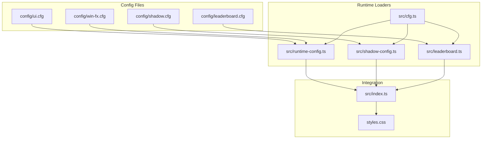
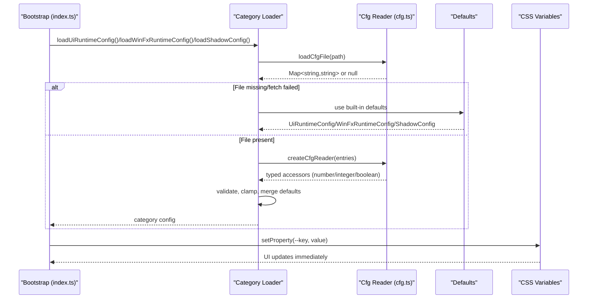
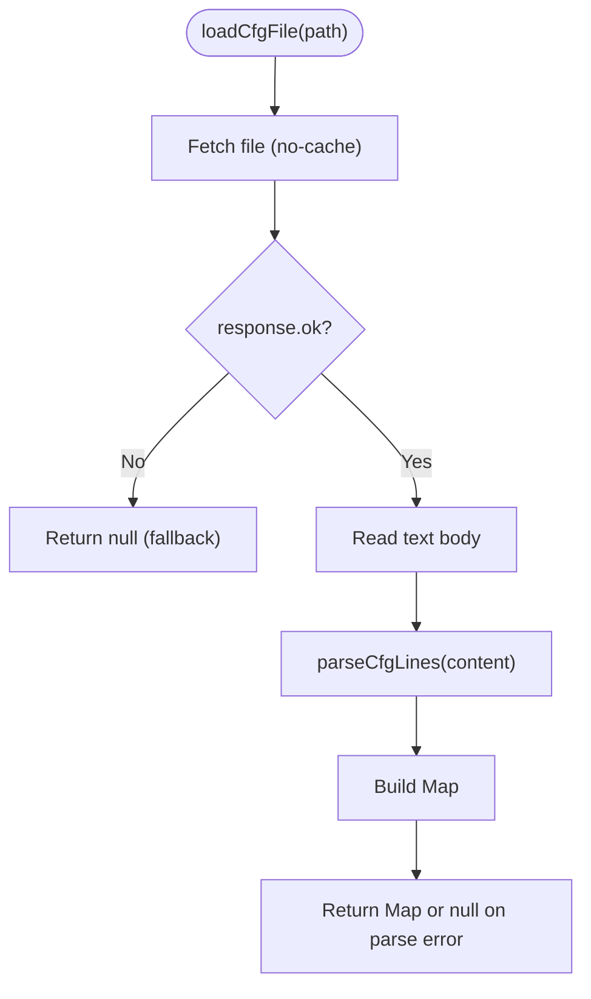
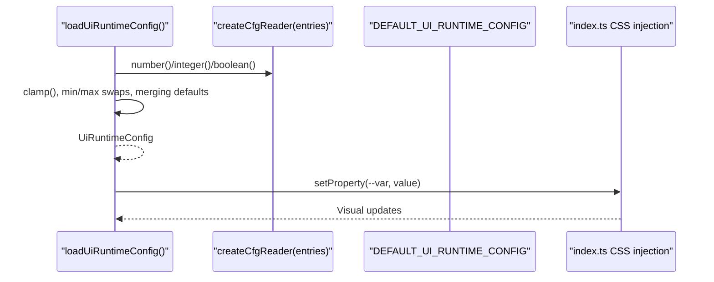
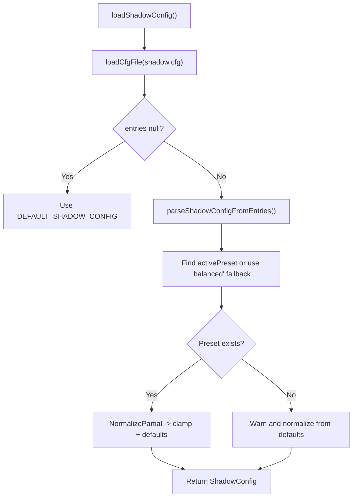
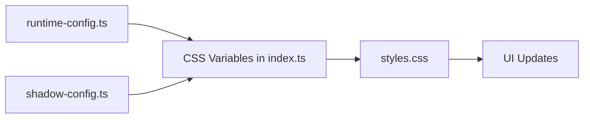
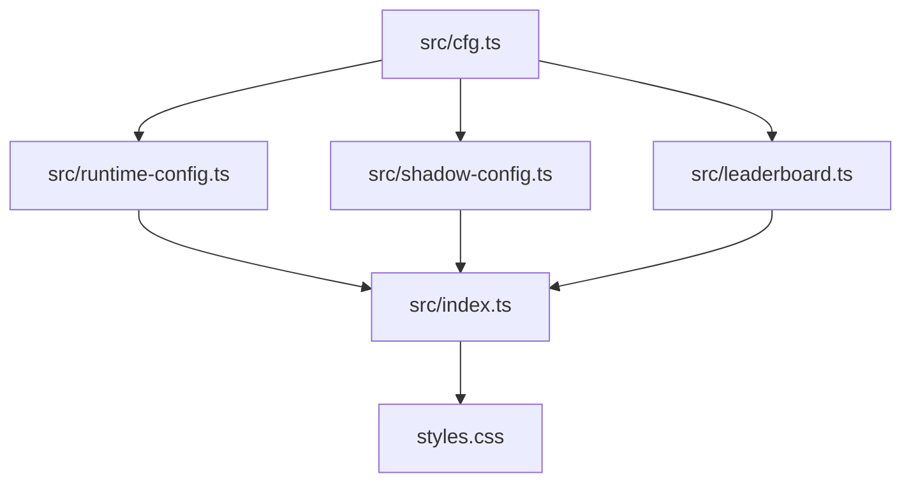

# Configuration Management

<cite>
**Referenced Files in This Document**
- [cfg.ts](file://src/cfg.ts)
- [runtime-config.ts](file://src/runtime-config.ts)
- [shadow-config.ts](file://src/shadow-config.ts)
- [index.ts](file://src/index.ts)
- [ui.cfg](file://config/ui.cfg)
- [shadow.cfg](file://config/shadow.cfg)
- [win-fx.cfg](file://config/win-fx.cfg)
- [leaderboard.cfg](file://config/leaderboard.cfg)
- [runtime-config.md](file://docs/runtime-config.md)
- [styles.css](file://styles.css)
- [runtime-config.test.ts](file://tests/runtime-config.test.ts)
- [shadow-config.test.ts](file://tests/shadow-config.test.ts)
- [leaderboard.ts](file://src/leaderboard.ts)
- [settings-controller.ts](file://src/settings-controller.ts)
</cite>

## Table of Contents
1. [Introduction](#introduction)
2. [Project Structure](#project-structure)
3. [Core Components](#core-components)
4. [Architecture Overview](#architecture-overview)
5. [Detailed Component Analysis](#detailed-component-analysis)
6. [Dependency Analysis](#dependency-analysis)
7. [Performance Considerations](#performance-considerations)
8. [Troubleshooting Guide](#troubleshooting-guide)
9. [Conclusion](#conclusion)
10. [Appendices](#appendices)

## Introduction
This document explains the configuration management system that powers runtime settings and global parameters across the application. It covers how configuration files are parsed, validated, and integrated into runtime behavior, including CSS variable injection, shadow presets, leaderboard parameters, and visual effects. It also documents validation, default value handling, and hot-reload considerations, along with practical examples for extending and debugging configuration.

## Project Structure
The configuration system is organized around:
- Configuration file parsers and readers in a shared module
- Category-specific loaders for UI, shadow, win effects, and leaderboard
- CSS integration via CSS custom properties
- Tests validating parsing, validation, and fallback behavior

**Diagram sources**
- [cfg.ts:1-97](file://src/cfg.ts#L1-L97)
- [runtime-config.ts:1-399](file://src/runtime-config.ts#L1-L399)
- [shadow-config.ts:1-184](file://src/shadow-config.ts#L1-L184)
- [leaderboard.ts:1-200](file://src/leaderboard.ts#L1-L200)
- [index.ts:321-332](file://src/index.ts#L321-L332)
- [styles.css:13-101](file://styles.css#L13-L101)

**Section sources**
- [cfg.ts:1-97](file://src/cfg.ts#L1-L97)
- [runtime-config.ts:92-97](file://src/runtime-config.ts#L92-L97)
- [shadow-config.ts:1-184](file://src/shadow-config.ts#L1-L184)
- [leaderboard.ts:1-200](file://src/leaderboard.ts#L1-L200)
- [index.ts:321-332](file://src/index.ts#L321-L332)
- [styles.css:13-101](file://styles.css#L13-L101)

## Core Components
- Config parsing primitives: line-by-line parsing, typed readers, and robust error handling
- Category loaders: UI runtime config, shadow presets, win effects, and leaderboard runtime config
- CSS integration: CSS custom properties bound to runtime configuration
- Hot reload behavior: page refresh required after changing config files

Key responsibilities:
- Parse and validate configuration entries
- Provide safe defaults when files are missing or values are invalid
- Inject values into CSS variables for immediate visual feedback
- Expose typed getters for downstream consumers

**Section sources**
- [cfg.ts:1-97](file://src/cfg.ts#L1-L97)
- [runtime-config.ts:238-353](file://src/runtime-config.ts#L238-L353)
- [shadow-config.ts:139-183](file://src/shadow-config.ts#L139-L183)
- [leaderboard.ts:300-360](file://src/leaderboard.ts#L300-L360)
- [index.ts:866-882](file://src/index.ts#L866-L882)

## Architecture Overview
The configuration pipeline follows a consistent pattern:
- Fetch config file via HTTP
- Parse into key/value pairs
- Convert to typed values with validation and clamping
- Merge with defaults and expose via strongly-typed interfaces
- Inject into CSS variables for immediate UI updates

**Diagram sources**
- [index.ts:321-332](file://src/index.ts#L321-L332)
- [runtime-config.ts:238-353](file://src/runtime-config.ts#L238-L353)
- [shadow-config.ts:139-183](file://src/shadow-config.ts#L139-L183)
- [cfg.ts:54-96](file://src/cfg.ts#L54-L96)
- [styles.css:87-101](file://styles.css#L87-L101)

## Detailed Component Analysis

### Config Parsing and Readers
- Line parser handles comments, blank lines, and malformed entries
- Typed readers convert strings to numbers, integers, booleans with strict validation
- Robust error handling distinguishes network errors from parse errors

**Diagram sources**
- [cfg.ts:54-78](file://src/cfg.ts#L54-L78)
- [cfg.ts:1-28](file://src/cfg.ts#L1-L28)

**Section sources**
- [cfg.ts:1-97](file://src/cfg.ts#L1-L97)

### UI Runtime Configuration
- Loads and validates UI, window, animation, visual effects, and gameplay timing parameters
- Enforces bounds and clamps invalid values
- Provides defaults for missing keys and merges with built-in defaults
- Injects values into CSS variables for immediate UI updates

**Diagram sources**
- [runtime-config.ts:238-353](file://src/runtime-config.ts#L238-L353)
- [index.ts:866-882](file://src/index.ts#L866-L882)

**Section sources**
- [runtime-config.ts:92-156](file://src/runtime-config.ts#L92-L156)
- [runtime-config.ts:238-353](file://src/runtime-config.ts#L238-L353)
- [index.ts:866-882](file://src/index.ts#L866-L882)
- [ui.cfg:1-76](file://config/ui.cfg#L1-L76)

### Shadow Presets
- Supports active preset selection and per-preset values
- Validates numeric values and clamps to safe ranges
- Falls back gracefully when preset is missing or invalid

**Diagram sources**
- [shadow-config.ts:139-183](file://src/shadow-config.ts#L139-L183)
- [shadow.cfg:1-23](file://config/shadow.cfg#L1-L23)

**Section sources**
- [shadow-config.ts:1-184](file://src/shadow-config.ts#L1-L184)
- [shadow.cfg:1-23](file://config/shadow.cfg#L1-L23)

### Win Effects Configuration
- Parses numeric and list-type keys for win animations
- Validates color lists and falls back to defaults when invalid
- Uses separate HD-on and HD-off particle caps

**Section sources**
- [runtime-config.ts:365-398](file://src/runtime-config.ts#L365-L398)
- [win-fx.cfg:1-30](file://config/win-fx.cfg#L1-L30)

### Leaderboard Runtime Configuration
- Controls enabling/disabling, entry limits, and scoring parameters
- Clamps penalties and factors to safe ranges
- Integrates with leaderboard UI controller

**Section sources**
- [leaderboard.ts:1-200](file://src/leaderboard.ts#L1-L200)
- [leaderboard.ts:300-360](file://src/leaderboard.ts#L300-L360)
- [leaderboard.cfg:1-17](file://config/leaderboard.cfg#L1-L17)

### CSS Variable Integration
- Runtime config values are injected into CSS custom properties
- Stylesheets consume these variables for immediate visual updates
- Shadow configuration is translated into text-shadow and filter declarations

**Diagram sources**
- [index.ts:866-882](file://src/index.ts#L866-L882)
- [index.ts:321-332](file://src/index.ts#L321-L332)
- [styles.css:87-101](file://styles.css#L87-L101)

**Section sources**
- [index.ts:321-332](file://src/index.ts#L321-L332)
- [index.ts:866-882](file://src/index.ts#L866-L882)
- [styles.css:87-101](file://styles.css#L87-L101)

## Dependency Analysis
- Shared parsing utilities in cfg.ts are used by all loaders
- Category loaders depend on defaults exported from their respective modules
- Bootstrap code depends on loaders to populate runtime state and inject CSS variables
- Tests validate loader behavior and error handling paths

**Diagram sources**
- [cfg.ts:1-97](file://src/cfg.ts#L1-L97)
- [runtime-config.ts:1-399](file://src/runtime-config.ts#L1-L399)
- [shadow-config.ts:1-184](file://src/shadow-config.ts#L1-L184)
- [leaderboard.ts:1-200](file://src/leaderboard.ts#L1-L200)
- [index.ts:321-332](file://src/index.ts#L321-L332)
- [styles.css:87-101](file://styles.css#L87-L101)

**Section sources**
- [cfg.ts:1-97](file://src/cfg.ts#L1-L97)
- [runtime-config.ts:1-399](file://src/runtime-config.ts#L1-L399)
- [shadow-config.ts:1-184](file://src/shadow-config.ts#L1-L184)
- [leaderboard.ts:1-200](file://src/leaderboard.ts#L1-L200)
- [index.ts:321-332](file://src/index.ts#L321-L332)
- [styles.css:87-101](file://styles.css#L87-L101)

## Performance Considerations
- Config files are fetched once at startup with no-cache semantics to prevent stale values
- Numeric parsing and clamping occur synchronously during load; consider caching if frequently accessed
- CSS variable updates are immediate; avoid excessive reflows by batching updates
- Shadow normalization clamps values to safe ranges to prevent layout anomalies

[No sources needed since this section provides general guidance]

## Troubleshooting Guide
Common issues and resolutions:
- Config file not found or fetch fails: loaders fall back to built-in defaults; verify file paths and network accessibility
- Invalid numeric values: loaders clamp or ignore invalid entries; check ranges and formats
- Malformed entries: parser skips comments and malformed lines; ensure proper key=value format
- Shadow preset missing: logs warnings and falls back to defaults; ensure activePreset matches a defined preset
- Win effects color lists invalid: falls back to defaults; ensure comma-separated hex colors
- CSS not updating: reload the page to re-fetch configs; CSS variables are injected at bootstrap

Validation and fallback behavior is covered by tests for each loader.

**Section sources**
- [runtime-config.test.ts:108-435](file://tests/runtime-config.test.ts#L108-L435)
- [shadow-config.test.ts:1-200](file://tests/shadow-config.test.ts#L1-L200)

## Conclusion
The configuration management system provides a robust, typed, and validated mechanism for controlling runtime behavior. It separates concerns across categories, ensures safe defaults, integrates seamlessly with CSS variables, and offers predictable fallbacks for resilience. Extending the system involves adding keys to the appropriate config file, implementing parsing/validation in the loader, and wiring CSS variables where applicable.

[No sources needed since this section summarizes without analyzing specific files]

## Appendices

### Practical Examples

- Adding a new UI setting
  - Define the key in the relevant section of the UI config file
  - Add a typed accessor in the UI loader and merge with defaults
  - Inject the value into a CSS variable in the bootstrap code
  - Reference the variable in stylesheets

- Modifying existing settings
  - Adjust values in the corresponding config file
  - Reload the page to apply changes
  - Use tests to verify clamping and fallback behavior

- Debugging configuration issues
  - Check console warnings for parse or fetch failures
  - Validate numeric ranges and formats
  - Confirm active preset availability for shadow config
  - Review tests for expected behavior and edge cases

**Section sources**
- [runtime-config.ts:238-353](file://src/runtime-config.ts#L238-L353)
- [shadow-config.ts:139-183](file://src/shadow-config.ts#L139-L183)
- [index.ts:866-882](file://src/index.ts#L866-L882)
- [runtime-config.md:218-227](file://docs/runtime-config.md#L218-L227)

### Environment-Specific Overrides and Deployment Notes
- Runtime configuration is loaded via HTTP at startup; ensure static hosting serves config files with appropriate MIME types
- For environments without a backend, leaderboard persistence uses local storage; for server-backed leaderboards, configure endpoint URLs accordingly
- Shadow presets and win effects are self-contained in config files; adjust values to match deployment device capabilities

**Section sources**
- [runtime-config.md:218-227](file://docs/runtime-config.md#L218-L227)
- [leaderboard.ts:65-73](file://src/leaderboard.ts#L65-L73)
- [leaderboard.cfg:1-17](file://config/leaderboard.cfg#L1-L17)