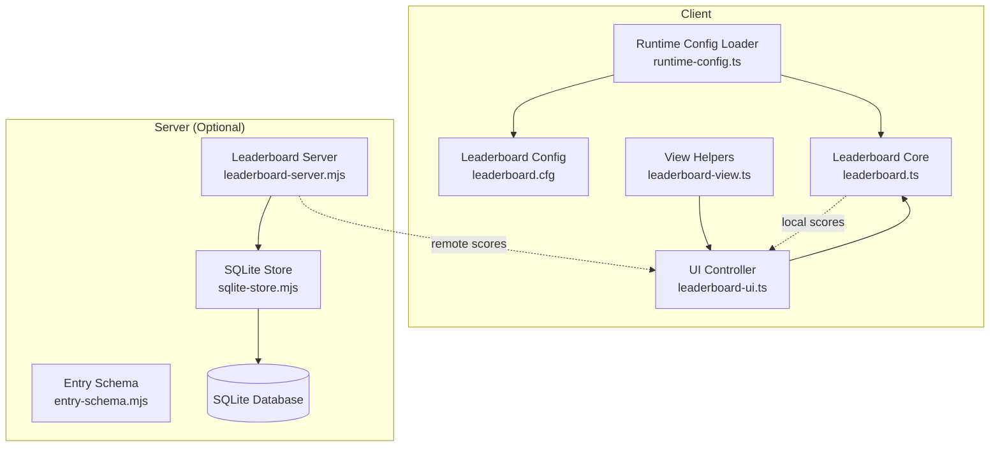
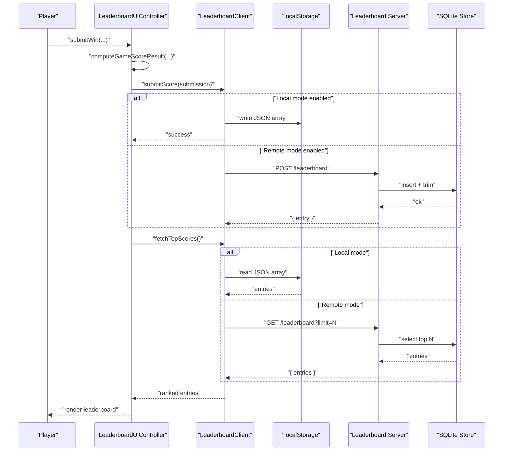
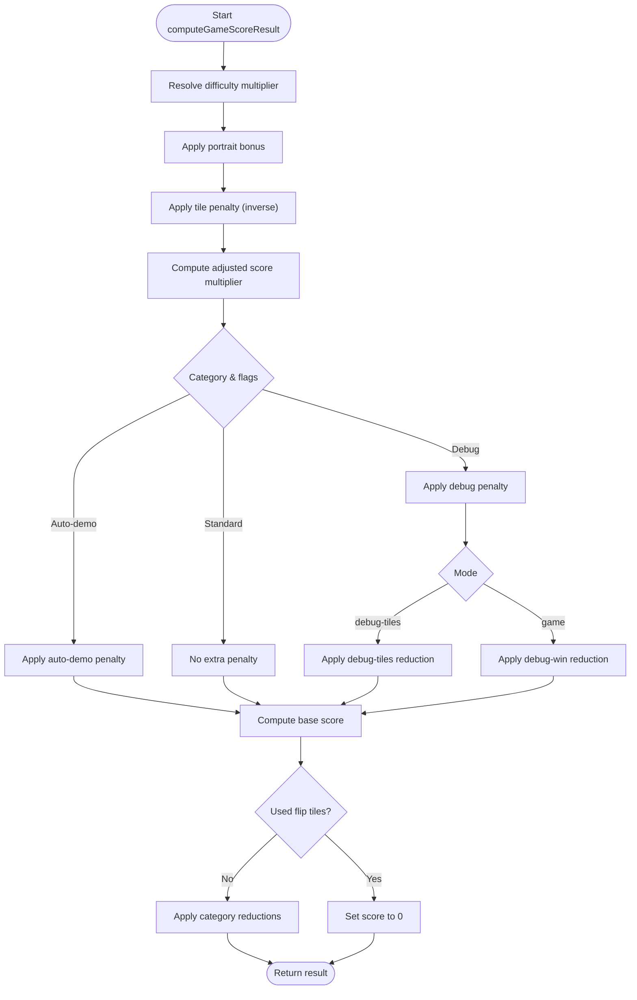
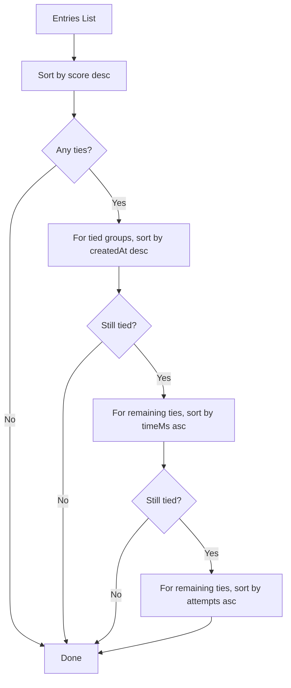
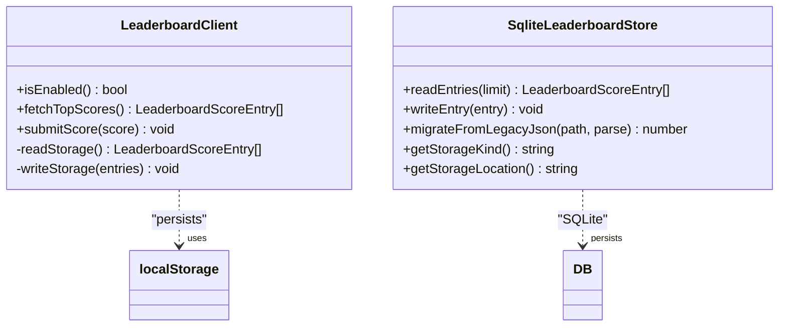
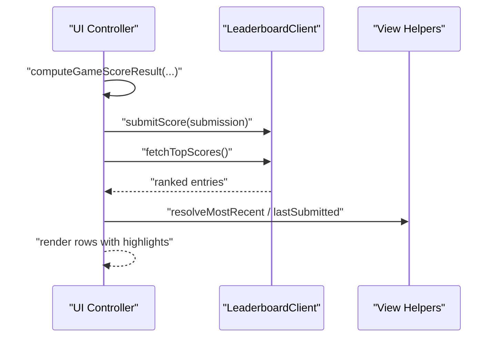
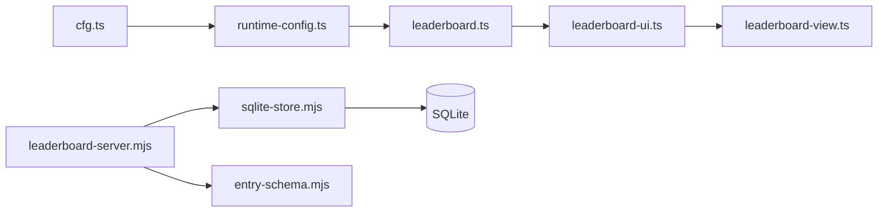

# Leaderboard Configuration

<cite>
**Referenced Files in This Document**
- [leaderboard.cfg](file://config/leaderboard.cfg)
- [leaderboard.data.json](file://config/leaderboard.data.json)
- [leaderboard.ts](file://src/leaderboard.ts)
- [leaderboard-ui.ts](file://src/leaderboard-ui.ts)
- [leaderboard-view.ts](file://src/leaderboard-view.ts)
- [session-score.ts](file://src/session-score.ts)
- [runtime-config.ts](file://src/runtime-config.ts)
- [cfg.ts](file://src/cfg.ts)
- [leaderboard-server.mjs](file://tools/leaderboard-server.mjs)
- [sqlite-store.mjs](file://tools/leaderboard/sqlite-store.mjs)
- [entry-schema.mjs](file://tools/leaderboard/entry-schema.mjs)
- [leaderboard.test.ts](file://tests/leaderboard.test.ts)
- [leaderboard-ui.test.ts](file://tests/leaderboard-ui.test.ts)
- [leaderboard-view.test.ts](file://tests/leaderboard-view.test.ts)
- [session-score.test.ts](file://tests/session-score.test.ts)
</cite>

## Table of Contents
1. [Introduction](#introduction)
2. [Project Structure](#project-structure)
3. [Core Components](#core-components)
4. [Architecture Overview](#architecture-overview)
5. [Detailed Component Analysis](#detailed-component-analysis)
6. [Dependency Analysis](#dependency-analysis)
7. [Performance Considerations](#performance-considerations)
8. [Troubleshooting Guide](#troubleshooting-guide)
9. [Conclusion](#conclusion)

## Introduction
This document explains the leaderboard configuration system, focusing on scoring parameters, persistence settings, and ranking behavior. It covers both the client-side local storage implementation and the optional server-side SQLite-based implementation. You will learn how to customize scoring algorithms, adjust record limits, implement different ranking systems, and understand the relationship between configuration and leaderboard functionality, including data persistence strategies and performance considerations for large datasets.

## Project Structure
The leaderboard system spans client-side TypeScript modules and optional server-side Node.js tools:
- Client-side runtime configuration and scoring logic
- UI controller for rendering and submitting scores
- View helpers for identity and highlighting
- Server-side leaderboard API and SQLite store
- Tests validating configuration parsing, scoring, and persistence

**Diagram sources**
- [runtime-config.ts:92-97](file://src/runtime-config.ts#L92-L97)
- [leaderboard.cfg](file://config/leaderboard.cfg)
- [leaderboard.ts](file://src/leaderboard.ts)
- [leaderboard-ui.ts](file://src/leaderboard-ui.ts)
- [leaderboard-view.ts](file://src/leaderboard-view.ts)
- [leaderboard-server.mjs](file://tools/leaderboard-server.mjs)
- [sqlite-store.mjs](file://tools/leaderboard/sqlite-store.mjs)
- [entry-schema.mjs](file://tools/leaderboard/entry-schema.mjs)

**Section sources**
- [runtime-config.ts:92-97](file://src/runtime-config.ts#L92-L97)
- [leaderboard.cfg](file://config/leaderboard.cfg)
- [leaderboard.ts](file://src/leaderboard.ts)
- [leaderboard-ui.ts](file://src/leaderboard-ui.ts)
- [leaderboard-view.ts](file://src/leaderboard-view.ts)
- [leaderboard-server.mjs](file://tools/leaderboard-server.mjs)
- [sqlite-store.mjs](file://tools/leaderboard/sqlite-store.mjs)
- [entry-schema.mjs](file://tools/leaderboard/entry-schema.mjs)

## Core Components
- Leaderboard runtime configuration loader and defaults
- Scoring computation and penalty application
- Ranking and display logic
- Persistence (client: localStorage; server: SQLite)
- UI integration for submission and rendering

Key configuration options and their roles:
- Enable/disable leaderboard
- Maximum number of records to retain
- Scoring parameters: base dividend, scale factor, penalty factor, and debug reductions
- Portrait bonus factor
- Attempts penalty in milliseconds

These options are defined in the configuration file and loaded at runtime to construct the scoring model and persistence behavior.

**Section sources**
- [leaderboard.cfg](file://config/leaderboard.cfg)
- [leaderboard.ts:74-87](file://src/leaderboard.ts#L74-L87)
- [leaderboard.ts:300-352](file://src/leaderboard.ts#L300-L352)

## Architecture Overview
The system supports two operational modes:
- Local mode: Scores are stored in the browser’s localStorage and ranked client-side.
- Remote mode: A Node.js server exposes a simple API to persist and retrieve scores in an SQLite database.

**Diagram sources**
- [leaderboard-ui.ts:119-172](file://src/leaderboard-ui.ts#L119-L172)
- [leaderboard.ts:432-454](file://src/leaderboard.ts#L432-L454)
- [leaderboard-server.mjs:117-153](file://tools/leaderboard-server.mjs#L117-L153)
- [sqlite-store.mjs:391-399](file://tools/leaderboard/sqlite-store.mjs#L391-L399)

## Detailed Component Analysis

### Configuration Loading and Defaults
- Runtime configuration paths include a dedicated leaderboard config path.
- The leaderboard config file defines:
  - Global enable flag
  - Maximum entries to display/retain
  - Scoring parameters: penalty factor, attempts penalty ms, base score dividend, score scale factor, debug reduction factors, portrait bonus factor
- The loader validates and clamps numeric values and merges defaults when the remote config is unavailable.

Practical customization examples:
- Increase leaderboard visibility: adjust the maximum entries retained.
- Tune scoring sensitivity: adjust base dividend and scale factor.
- Penalize attempts more or less: adjust attempts penalty ms and/or penalty factor.
- Reduce debug scores further: adjust debug reduction factors.
- Encourage portrait mode: increase portrait bonus factor.

**Section sources**
- [runtime-config.ts:92-97](file://src/runtime-config.ts#L92-L97)
- [leaderboard.cfg](file://config/leaderboard.cfg)
- [leaderboard.ts:300-352](file://src/leaderboard.ts#L300-L352)
- [cfg.ts:54-96](file://src/cfg.ts#L54-L96)
- [leaderboard.test.ts:26-121](file://tests/leaderboard.test.ts#L26-L121)

### Scoring Model and Computation
The scoring pipeline:
- Base score calculation considers time and attempts, scaled by a multiplier.
- Difficulty-based multiplier is applied (easy, normal, hard).
- Optional portrait mode bonus increases the multiplier.
- Tile multiplier reduces the multiplier (inverse relationship).
- Auto-demo and debug categories apply penalties.
- Additional debug-specific reductions apply depending on mode.
- Flip-tiles condition forces zero score.

**Diagram sources**
- [leaderboard.ts:476-526](file://src/leaderboard.ts#L476-L526)

**Section sources**
- [leaderboard.ts:89-109](file://src/leaderboard.ts#L89-L109)
- [leaderboard.ts:476-526](file://src/leaderboard.ts#L476-L526)
- [session-score.ts:1-24](file://src/session-score.ts#L1-L24)
- [leaderboard.test.ts:649-798](file://tests/leaderboard.test.ts#L649-L798)

### Ranking Behavior
Ranking criteria (in order):
- Primary: score value (higher is better)
- Secondary: recency by creation timestamp (newer is better)
- Tertiary: time in milliseconds (lower is better)
- Quaternary: number of attempts (lower is better)

**Diagram sources**
- [leaderboard.ts:269-298](file://src/leaderboard.ts#L269-L298)

**Section sources**
- [leaderboard.ts:269-298](file://src/leaderboard.ts#L269-L298)
- [leaderboard.test.ts:449-494](file://tests/leaderboard.test.ts#L449-L494)

### Persistence Strategies
Client-side (localStorage):
- Stores a JSON array under a fixed key.
- Enforces a maximum payload size and logs warnings when approaching the limit.
- Reads and writes are synchronous wrappers around localStorage.

Server-side (SQLite):
- Provides a simple GET/POST API endpoint for leaderboard entries.
- Inserts entries and trims to a configurable maximum.
- Uses WAL mode when available for improved concurrency and durability.
- Supports a one-time migration from the legacy JSON file.

**Diagram sources**
- [leaderboard.ts:362-455](file://src/leaderboard.ts#L362-L455)
- [sqlite-store.mjs:150-531](file://tools/leaderboard/sqlite-store.mjs#L150-L531)

**Section sources**
- [leaderboard.ts:362-455](file://src/leaderboard.ts#L362-L455)
- [leaderboard-server.mjs:117-153](file://tools/leaderboard-server.mjs#L117-L153)
- [sqlite-store.mjs:150-531](file://tools/leaderboard/sqlite-store.mjs#L150-L531)

### UI Integration and Display
- The UI controller computes the score, submits it, refreshes the leaderboard, and highlights the most recent or submitted entry.
- Rendering respects the visible row count and displays player name, score, difficulty, and emoji set.
- Special suffixes indicate auto-demo and debug entries.

**Diagram sources**
- [leaderboard-ui.ts:51-172](file://src/leaderboard-ui.ts#L51-L172)
- [leaderboard-view.ts:3-110](file://src/leaderboard-view.ts#L3-L110)

**Section sources**
- [leaderboard-ui.ts:51-172](file://src/leaderboard-ui.ts#L51-L172)
- [leaderboard-view.ts:3-110](file://src/leaderboard-view.ts#L3-L110)
- [leaderboard-ui.test.ts:71-406](file://tests/leaderboard-ui.test.ts#L71-L406)

### Legacy Data Migration
- The server can migrate legacy JSON data into SQLite.
- Migration deduplicates entries using an identity built from core fields.
- Migration state is persisted to prevent repeated runs.

**Section sources**
- [leaderboard-server.mjs:99-115](file://tools/leaderboard-server.mjs#L99-L115)
- [sqlite-store.mjs:442-529](file://tools/leaderboard/sqlite-store.mjs#L442-L529)
- [entry-schema.mjs:18-90](file://tools/leaderboard/entry-schema.mjs#L18-L90)

## Dependency Analysis
- Configuration loading depends on a generic config parser and a runtime config path registry.
- The leaderboard core depends on configuration for scoring parameters and on localStorage for persistence.
- The UI controller depends on the leaderboard core and view helpers for identity resolution.
- The server depends on the SQLite store and entry schema for normalization and persistence.

**Diagram sources**
- [cfg.ts:54-96](file://src/cfg.ts#L54-L96)
- [runtime-config.ts:92-97](file://src/runtime-config.ts#L92-L97)
- [leaderboard.ts](file://src/leaderboard.ts)
- [leaderboard-ui.ts](file://src/leaderboard-ui.ts)
- [leaderboard-view.ts](file://src/leaderboard-view.ts)
- [leaderboard-server.mjs](file://tools/leaderboard-server.mjs)
- [sqlite-store.mjs](file://tools/leaderboard/sqlite-store.mjs)
- [entry-schema.mjs](file://tools/leaderboard/entry-schema.mjs)

**Section sources**
- [cfg.ts:54-96](file://src/cfg.ts#L54-L96)
- [runtime-config.ts:92-97](file://src/runtime-config.ts#L92-L97)
- [leaderboard.ts](file://src/leaderboard.ts)
- [leaderboard-ui.ts](file://src/leaderboard-ui.ts)
- [leaderboard-view.ts](file://src/leaderboard-view.ts)
- [leaderboard-server.mjs](file://tools/leaderboard-server.mjs)
- [sqlite-store.mjs](file://tools/leaderboard/sqlite-store.mjs)
- [entry-schema.mjs](file://tools/leaderboard/entry-schema.mjs)

## Performance Considerations
- Client-side:
  - localStorage payload size is guarded to prevent excessive growth; warnings are logged when approaching thresholds.
  - Ranking is performed on arrays up to the configured maximum entries.
- Server-side:
  - WAL mode is configured when supported to improve write performance and concurrency.
  - Index on creation timestamp ensures efficient retrieval of recent entries.
  - Request body size is bounded to prevent abuse.
  - Migration builds an identity set to deduplicate entries; memory usage scales with retention limit.

Recommendations:
- Keep max entries reasonable to balance visibility and performance.
- Monitor localStorage usage in browsers to avoid quota exceeded errors.
- On the server, tune retention limits and monitor memory usage during migration.

**Section sources**
- [leaderboard.ts:374-422](file://src/leaderboard.ts#L374-L422)
- [sqlite-store.mjs:303-337](file://tools/leaderboard/sqlite-store.mjs#L303-L337)
- [sqlite-store.mjs:391-399](file://tools/leaderboard/sqlite-store.mjs#L391-L399)
- [leaderboard-server.mjs:32-35](file://tools/leaderboard-server.mjs#L32-L35)
- [leaderboard.test.ts:604-636](file://tests/leaderboard.test.ts#L604-L636)

## Troubleshooting Guide
Common issues and resolutions:
- Configuration fetch failures:
  - The loader falls back to defaults and warns on network or parse errors.
- Corrupted or oversized localStorage:
  - The client ignores malformed data and logs warnings; very large payloads are rejected.
- Submission failures:
  - UI controller reports appropriate status messages and logs warnings.
- Server-side errors:
  - The server responds with structured error messages for invalid payloads or method misuse.

Validation and tests:
- Configuration parsing and clamping are validated in tests.
- Scoring computation correctness and penalties are covered by tests.
- UI rendering and identity resolution are verified by tests.

**Section sources**
- [leaderboard.ts:300-352](file://src/leaderboard.ts#L300-L352)
- [leaderboard.ts:374-422](file://src/leaderboard.ts#L374-L422)
- [leaderboard-ui.ts:119-172](file://src/leaderboard-ui.ts#L119-L172)
- [leaderboard-server.mjs:117-153](file://tools/leaderboard-server.mjs#L117-L153)
- [leaderboard.test.ts:87-95](file://tests/leaderboard.test.ts#L87-L95)
- [leaderboard.test.ts:256-262](file://tests/leaderboard.test.ts#L256-L262)
- [leaderboard-ui.test.ts:321-334](file://tests/leaderboard-ui.test.ts#L321-L334)

## Conclusion
The leaderboard configuration system offers flexible scoring, robust persistence, and clear ranking rules. Administrators can tailor scoring parameters and record limits via configuration, while developers can rely on well-tested client and server implementations. For large datasets, pay attention to localStorage quotas on the client and SQLite retention policies on the server to maintain performance and reliability.