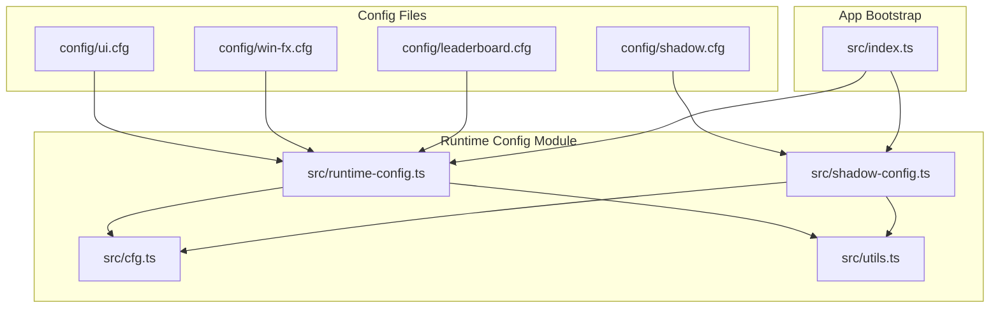
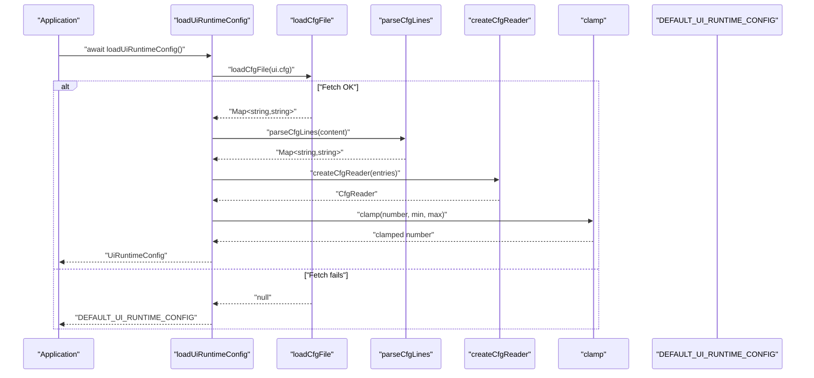
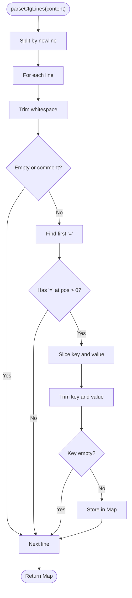
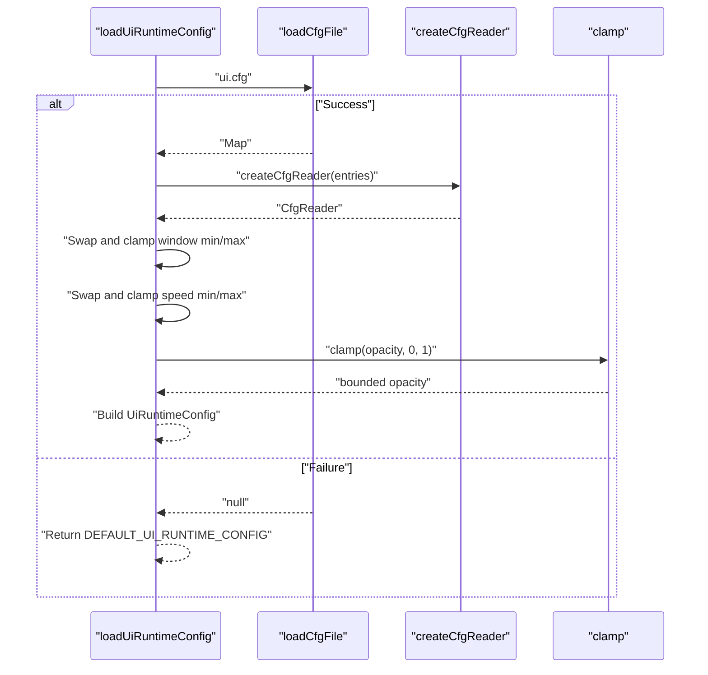
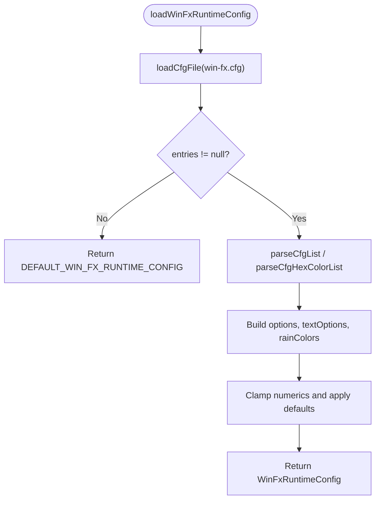
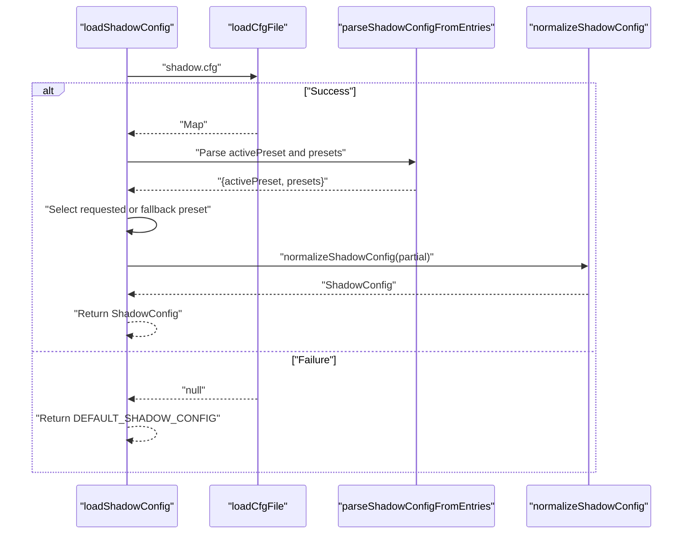
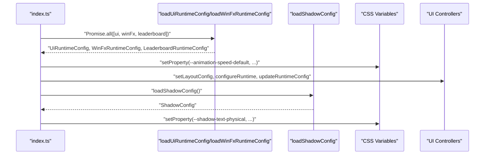
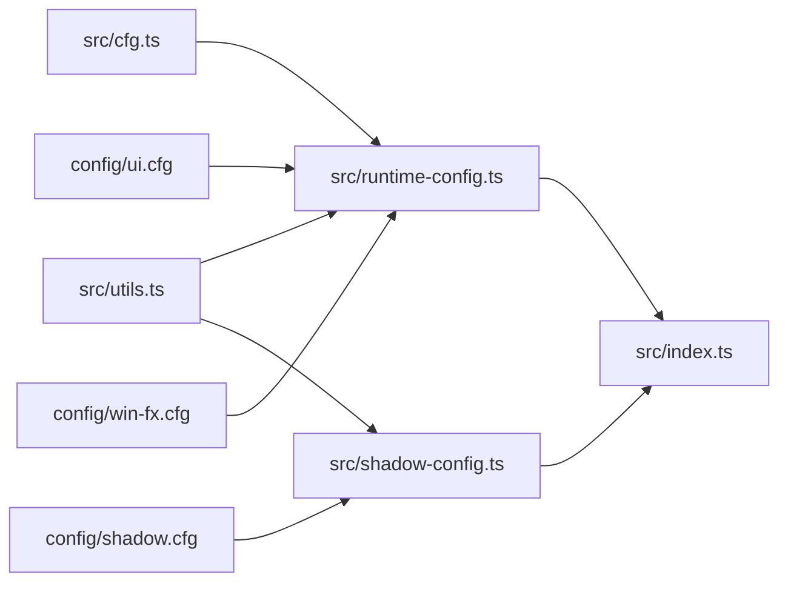

# Runtime Configuration System

<cite>
**Referenced Files in This Document**
- [runtime-config.ts](file://src/runtime-config.ts)
- [cfg.ts](file://src/cfg.ts)
- [utils.ts](file://src/utils.ts)
- [shadow-config.ts](file://src/shadow-config.ts)
- [index.ts](file://src/index.ts)
- [runtime-config.md](file://docs/runtime-config.md)
- [ui.cfg](file://config/ui.cfg)
- [shadow.cfg](file://config/shadow.cfg)
- [win-fx.cfg](file://config/win-fx.cfg)
- [leaderboard.cfg](file://config/leaderboard.cfg)
- [runtime-config.test.ts](file://tests/runtime-config.test.ts)
</cite>

## Table of Contents
1. [Introduction](#introduction)
2. [Project Structure](#project-structure)
3. [Core Components](#core-components)
4. [Architecture Overview](#architecture-overview)
5. [Detailed Component Analysis](#detailed-component-analysis)
6. [Dependency Analysis](#dependency-analysis)
7. [Performance Considerations](#performance-considerations)
8. [Troubleshooting Guide](#troubleshooting-guide)
9. [Conclusion](#conclusion)
10. [Appendices](#appendices)

## Introduction
This document explains the runtime configuration system that powers dynamic, file-based configuration loading and validation. It covers how configuration files are parsed, validated, and transformed into strongly typed runtime objects, along with robust fallback behavior and error handling. It also documents how configuration influences runtime behavior, environment-specific overrides, and deployment considerations for various hosting scenarios.

## Project Structure
The runtime configuration system is organized around:
- Centralized loader and validator functions in a shared module
- Typed configuration interfaces and default values
- Per-feature configuration files under the config/ directory
- Integration points in the application bootstrap pipeline

**Diagram sources**
- [runtime-config.ts:1-399](file://src/runtime-config.ts#L1-L399)
- [cfg.ts:1-97](file://src/cfg.ts#L1-L97)
- [utils.ts:1-145](file://src/utils.ts#L1-L145)
- [shadow-config.ts:1-184](file://src/shadow-config.ts#L1-L184)
- [index.ts:846-900](file://src/index.ts#L846-L900)

**Section sources**
- [runtime-config.ts:92-97](file://src/runtime-config.ts#L92-L97)
- [cfg.ts:54-78](file://src/cfg.ts#L54-L78)
- [index.ts:846-900](file://src/index.ts#L846-L900)

## Core Components
- Configuration file parser: extracts key=value pairs from text, ignoring comments and malformed lines
- Type-safe readers: convert values to numbers, integers, booleans with fallback defaults
- Validation and normalization: clamping, swapping min/max when misordered, and enforcing non-negative bounds
- Loader functions: fetch configs, parse, validate, and assemble typed runtime objects
- Defaults: comprehensive default values for all configuration domains
- Environment integration: fetch-based loading with graceful fallbacks

Key responsibilities:
- Parsing: [parseCfgLines:1-28](file://src/cfg.ts#L1-L28)
- Type conversion: [parseCfgNumber:30-33](file://src/cfg.ts#L30-L33), [parseCfgInteger:35-38](file://src/cfg.ts#L35-L38), [parseCfgBoolean:40-52](file://src/cfg.ts#L40-L52)
- Fetch and parse: [loadCfgFile:54-78](file://src/cfg.ts#L54-L78)
- Typed access: [createCfgReader:92-96](file://src/cfg.ts#L92-L96)
- Clamping: [clamp:68-70](file://src/utils.ts#L68-L70)
- UI runtime loader: [loadUiRuntimeConfig:238-353](file://src/runtime-config.ts#L238-L353)
- Win FX runtime loader: [loadWinFxRuntimeConfig:365-398](file://src/runtime-config.ts#L365-L398)
- Shadow runtime loader: [loadShadowConfig:139-183](file://src/shadow-config.ts#L139-L183)
- Defaults and constants: [DEFAULT_UI_RUNTIME_CONFIG:99-156](file://src/runtime-config.ts#L99-L156), [DEFAULT_WIN_FX_RUNTIME_CONFIG:158-201](file://src/runtime-config.ts#L158-L201), [DEFAULT_SHADOW_CONFIG:11-15](file://src/shadow-config.ts#L11-L15)

**Section sources**
- [cfg.ts:1-97](file://src/cfg.ts#L1-L97)
- [utils.ts:68-70](file://src/utils.ts#L68-L70)
- [runtime-config.ts:99-398](file://src/runtime-config.ts#L99-L398)
- [shadow-config.ts:11-183](file://src/shadow-config.ts#L11-L183)

## Architecture Overview
The configuration system follows a layered design:
- File layer: fetches config files via HTTP
- Parse layer: converts file content into a Map of key/value pairs
- Reader layer: provides typed getters with fallback defaults
- Validation layer: clamps values, swaps min/max when misordered, validates enums and formats
- Assembly layer: constructs strongly typed runtime objects
- Integration layer: applies runtime values to UI, controllers, and CSS variables

**Diagram sources**
- [runtime-config.ts:238-353](file://src/runtime-config.ts#L238-L353)
- [cfg.ts:54-78](file://src/cfg.ts#L54-L78)
- [utils.ts:68-70](file://src/utils.ts#L68-L70)

**Section sources**
- [runtime-config.ts:238-353](file://src/runtime-config.ts#L238-L353)
- [cfg.ts:54-78](file://src/cfg.ts#L54-L78)

## Detailed Component Analysis

### Configuration File Parsing and Type Conversion
- Line parsing: ignores blank lines and comments, splits on the first equals sign, trims keys and values
- Numeric parsing: supports floats and ints, returning null for invalid values
- Boolean parsing: recognizes "true"/"false" case-insensitively
- Reader wrapper: provides number(), integer(), and boolean() with fallback defaults
- Fetch behavior: distinguishes network errors from parse errors, logs warnings, and returns null

**Diagram sources**
- [cfg.ts:1-28](file://src/cfg.ts#L1-L28)

**Section sources**
- [cfg.ts:1-97](file://src/cfg.ts#L1-L97)

### UI Runtime Configuration Loading and Validation
- Loads ui.cfg via fetch; on failure, returns defaults
- Validates window scale min/max by swapping when misordered and clamping defaultScale to the resulting range
- Validates animation speed min/max similarly and clamps defaultSpeed
- Enforces non-negative and bounded numeric ranges for sizes and durations
- Falls back per-face opacities to the global opacity when unspecified
- Uses a typed reader for concise, safe access with defaults

**Diagram sources**
- [runtime-config.ts:238-353](file://src/runtime-config.ts#L238-L353)
- [cfg.ts:92-96](file://src/cfg.ts#L92-L96)
- [utils.ts:68-70](file://src/utils.ts#L68-L70)

**Section sources**
- [runtime-config.ts:238-353](file://src/runtime-config.ts#L238-L353)

### Win FX Runtime Configuration Loading and Validation
- Loads win-fx.cfg via fetch; on failure, returns defaults
- Parses comma-separated lists into arrays, trims items, filters empty strings
- Validates color lists using hex color patterns and filters invalid entries
- Applies numeric clamping and uses defaults when keys are absent or invalid
- Falls back to default lists when parsed lists are empty

**Diagram sources**
- [runtime-config.ts:365-398](file://src/runtime-config.ts#L365-L398)
- [runtime-config.ts:210-226](file://src/runtime-config.ts#L210-L226)

**Section sources**
- [runtime-config.ts:365-398](file://src/runtime-config.ts#L365-L398)

### Shadow Configuration Loading and Validation
- Loads shadow.cfg via fetch; on failure, returns defaults
- Parses activePreset and preset.* entries into a structured map
- Applies fallback presets when requested preset is missing
- Normalizes partial configs by filling missing fields and clamping values to safe ranges
- Logs warnings for missing presets and falls back to built-in defaults when necessary

**Diagram sources**
- [shadow-config.ts:139-183](file://src/shadow-config.ts#L139-L183)

**Section sources**
- [shadow-config.ts:139-183](file://src/shadow-config.ts#L139-L183)

### Integration with Application Bootstrap
- On startup, the app concurrently loads UI, Win FX, and leaderboard configurations
- Applies UI config to CSS variables and controller state
- Initializes shadow configuration and applies computed shadow values to CSS
- Propagates runtime values to UI components and gameplay timing

**Diagram sources**
- [index.ts:846-900](file://src/index.ts#L846-L900)
- [runtime-config.ts:238-353](file://src/runtime-config.ts#L238-L353)
- [runtime-config.ts:365-398](file://src/runtime-config.ts#L365-L398)
- [shadow-config.ts:139-183](file://src/shadow-config.ts#L139-L183)

**Section sources**
- [index.ts:846-900](file://src/index.ts#L846-L900)

## Dependency Analysis
- Centralized parsing and conversion utilities in cfg.ts are reused by all loaders
- Validation relies on utils.ts clamp function
- Loaders depend on default values defined in runtime-config.ts and shadow-config.ts
- Application bootstrap coordinates multiple loaders and applies results to UI and controllers

**Diagram sources**
- [cfg.ts:1-97](file://src/cfg.ts#L1-L97)
- [utils.ts:68-70](file://src/utils.ts#L68-L70)
- [runtime-config.ts:1-399](file://src/runtime-config.ts#L1-L399)
- [shadow-config.ts:1-184](file://src/shadow-config.ts#L1-L184)
- [index.ts:846-900](file://src/index.ts#L846-L900)

**Section sources**
- [runtime-config.ts:1-399](file://src/runtime-config.ts#L1-L399)
- [shadow-config.ts:1-184](file://src/shadow-config.ts#L1-L184)
- [cfg.ts:1-97](file://src/cfg.ts#L1-L97)
- [utils.ts:68-70](file://src/utils.ts#L68-L70)
- [index.ts:846-900](file://src/index.ts#L846-L900)

## Performance Considerations
- Fetch caching: requests use no-cache to ensure fresh configuration on reload
- Minimal allocations: parsers return Maps and primitives; loaders construct shallow copies of nested objects
- Concurrency: UI, Win FX, and leaderboard configs are loaded in parallel during bootstrap
- Clamping is O(1); list parsing is linear in the number of tokens
- Recommendations:
  - Keep config files small and focused
  - Prefer numeric keys for frequent updates to minimize parsing overhead
  - Use environment-specific overrides judiciously to avoid excessive fallback logic

[No sources needed since this section provides general guidance]

## Troubleshooting Guide
Common issues and resolutions:
- Fetch failures: When config files are unreachable, loaders return defaults and log warnings. Verify file paths and network accessibility.
- Parse errors: Malformed lines are ignored; ensure key=value format and avoid empty keys.
- Invalid numeric values: Non-finite numbers fall back to defaults; confirm numeric ranges and units.
- Misordered min/max: Window and animation speed min/max are swapped automatically; ensure intended bounds.
- Empty or invalid lists: Color and text option lists fall back to defaults when empty or invalid.
- Shadow preset issues: Missing presets trigger warnings and fallback to defaults; ensure activePreset and required keys exist.

Practical checks:
- Confirm file paths align with [RUNTIME_CONFIG_PATHS:92-97](file://src/runtime-config.ts#L92-L97)
- Validate keys against documented schema in [runtime-config.md](file://docs/runtime-config.md)
- Use tests as behavioral references:
  - [runtime-config.test.ts:108-212](file://tests/runtime-config.test.ts#L108-L212) for UI loader behavior
  - [runtime-config.test.ts:330-435](file://tests/runtime-config.test.ts#L330-L435) for Win FX loader behavior
  - [shadow-config.ts:139-183](file://src/shadow-config.ts#L139-L183) for shadow loader behavior

**Section sources**
- [runtime-config.ts:238-353](file://src/runtime-config.ts#L238-L353)
- [runtime-config.ts:365-398](file://src/runtime-config.ts#L365-L398)
- [shadow-config.ts:139-183](file://src/shadow-config.ts#L139-L183)
- [runtime-config.md:1-275](file://docs/runtime-config.md#L1-L275)
- [runtime-config.test.ts:108-435](file://tests/runtime-config.test.ts#L108-L435)

## Conclusion
The runtime configuration system provides a robust, extensible foundation for dynamic configuration. It emphasizes safety through strict parsing, validation, and fallbacks, while enabling flexible deployment across diverse environments. By centralizing parsing and validation logic and exposing typed loaders, the system simplifies extension and maintenance.

[No sources needed since this section summarizes without analyzing specific files]

## Appendices

### Adding New Configuration Options
Steps:
1. Define a new key in the appropriate config file (e.g., ui.cfg, win-fx.cfg, shadow.cfg)
2. Add a default value in the corresponding defaults object
3. Extend the loader to read the key using the typed reader and apply validation/clamping
4. Integrate the new value in the application (e.g., CSS variable, controller state)
5. Write tests to verify parsing, validation, and fallback behavior

References:
- UI defaults: [DEFAULT_UI_RUNTIME_CONFIG:99-156](file://src/runtime-config.ts#L99-L156)
- Win FX defaults: [DEFAULT_WIN_FX_RUNTIME_CONFIG:158-201](file://src/runtime-config.ts#L158-L201)
- Shadow defaults: [DEFAULT_SHADOW_CONFIG:11-15](file://src/shadow-config.ts#L11-L15)
- Loader examples:
  - [loadUiRuntimeConfig:238-353](file://src/runtime-config.ts#L238-L353)
  - [loadWinFxRuntimeConfig:365-398](file://src/runtime-config.ts#L365-L398)
  - [loadShadowConfig:139-183](file://src/shadow-config.ts#L139-L183)

**Section sources**
- [runtime-config.ts:99-201](file://src/runtime-config.ts#L99-L201)
- [shadow-config.ts:11-183](file://src/shadow-config.ts#L11-L183)
- [runtime-config.ts:238-398](file://src/runtime-config.ts#L238-L398)

### Extending Existing Configurations
- To add a new numeric key, use the typed reader and clamp appropriately
- To add a new list key (e.g., colors), parse and filter using helper functions
- To add a new enum-like key, normalize and validate against allowed values
- Ensure backward compatibility by providing sensible defaults

References:
- Helpers: [parseCfgList:210-215](file://src/runtime-config.ts#L210-L215), [parseCfgHexColorList:224-226](file://src/runtime-config.ts#L224-L226), [parseEmojiPackParityMode:228-236](file://src/runtime-config.ts#L228-L236)
- Tests: [runtime-config.test.ts:18-106](file://tests/runtime-config.test.ts#L18-L106)

**Section sources**
- [runtime-config.ts:210-236](file://src/runtime-config.ts#L210-L236)
- [runtime-config.test.ts:18-106](file://tests/runtime-config.test.ts#L18-L106)

### Debugging Configuration Loading Issues
- Enable console warnings for fetch and parse failures
- Inspect parsed Map contents during tests to verify key extraction
- Validate numeric ranges and list formats
- Confirm environment-specific overrides and fallbacks

References:
- Fetch and parse warnings: [loadCfgFile:54-78](file://src/cfg.ts#L54-L78)
- Tests for behavior: [runtime-config.test.ts:108-435](file://tests/runtime-config.test.ts#L108-L435)

**Section sources**
- [cfg.ts:54-78](file://src/cfg.ts#L54-L78)
- [runtime-config.test.ts:108-435](file://tests/runtime-config.test.ts#L108-L435)

### Relationship Between Configuration Files and Runtime Behavior
- ui.cfg: Controls UI sizing, animation speeds, gameplay timing, and visual effects
- win-fx.cfg: Controls win celebration effects, particle counts, and color palettes
- shadow.cfg: Controls drop shadow appearance via presets
- leaderboard.cfg: Controls leaderboard endpoint, timeouts, and scoring parameters

References:
- UI schema: [ui.cfg:1-76](file://config/ui.cfg#L1-L76)
- Win FX schema: [win-fx.cfg:1-30](file://config/win-fx.cfg#L1-L30)
- Shadow schema: [shadow.cfg:1-23](file://config/shadow.cfg#L1-L23)
- Leaderboard schema: [leaderboard.cfg:1-17](file://config/leaderboard.cfg#L1-L17)
- Documentation: [runtime-config.md:1-275](file://docs/runtime-config.md#L1-L275)

**Section sources**
- [ui.cfg:1-76](file://config/ui.cfg#L1-L76)
- [win-fx.cfg:1-30](file://config/win-fx.cfg#L1-L30)
- [shadow.cfg:1-23](file://config/shadow.cfg#L1-L23)
- [leaderboard.cfg:1-17](file://config/leaderboard.cfg#L1-L17)
- [runtime-config.md:1-275](file://docs/runtime-config.md#L1-L275)

### Environment-Specific Overrides and Deployment Considerations
- Hosting: Config files are fetched at runtime; ensure CORS and caching policies support your deployment
- Static hosting: Works on GitHub Pages and similar static hosts; verify file availability
- Local development: Use local servers; ensure config files are served from the expected paths
- Fallbacks: When files are missing or unreadable, defaults are used; verify defaults meet your needs

References:
- Fetch-based loading: [loadCfgFile:54-78](file://src/cfg.ts#L54-L78)
- Bootstrap integration: [index.ts:846-900](file://src/index.ts#L846-L900)
- Documentation: [runtime-config.md:218-227](file://docs/runtime-config.md#L218-L227)

**Section sources**
- [cfg.ts:54-78](file://src/cfg.ts#L54-L78)
- [index.ts:846-900](file://src/index.ts#L846-L900)
- [runtime-config.md:218-227](file://docs/runtime-config.md#L218-L227)