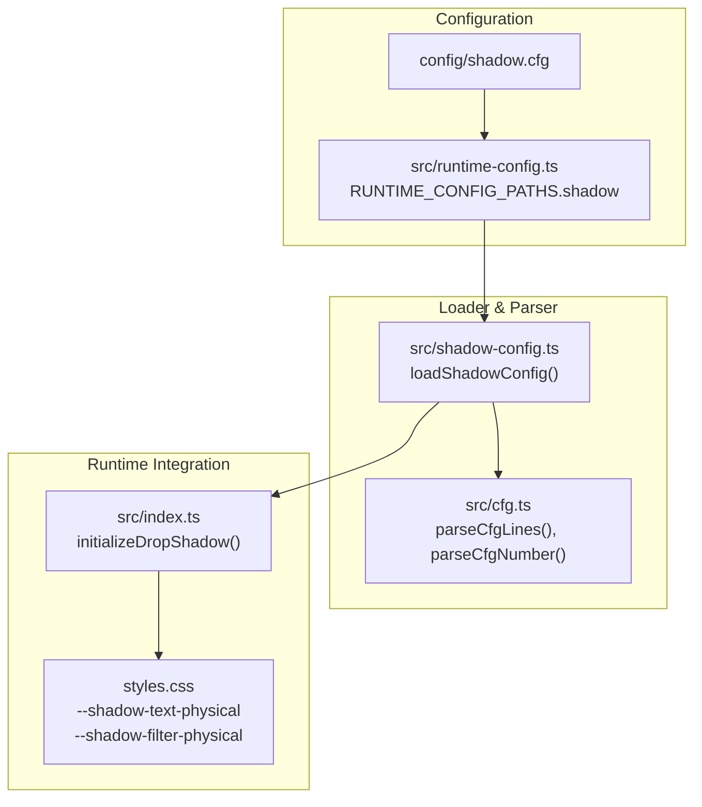
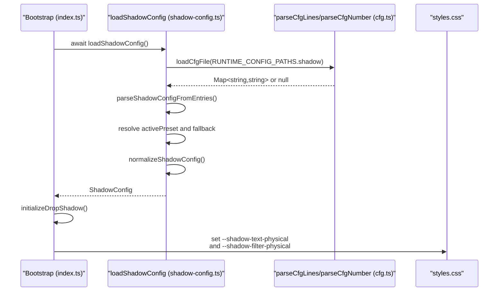
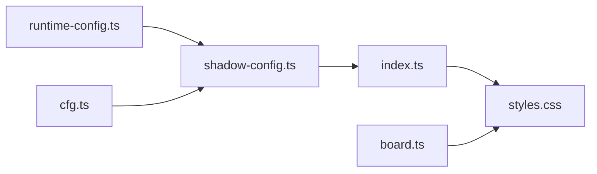

# Shadow Configuration

<cite>
**Referenced Files in This Document**
- [shadow-config.ts](file://src/shadow-config.ts)
- [shadow.cfg](file://config/shadow.cfg)
- [cfg.ts](file://src/cfg.ts)
- [runtime-config.ts](file://src/runtime-config.ts)
- [index.ts](file://src/index.ts)
- [styles.css](file://styles.css)
- [board.ts](file://src/board.ts)
- [shadow-config.test.ts](file://tests/shadow-config.test.ts)
</cite>

## Table of Contents
1. [Introduction](#introduction)
2. [Project Structure](#project-structure)
3. [Core Components](#core-components)
4. [Architecture Overview](#architecture-overview)
5. [Detailed Component Analysis](#detailed-component-analysis)
6. [Dependency Analysis](#dependency-analysis)
7. [Performance Considerations](#performance-considerations)
8. [Troubleshooting Guide](#troubleshooting-guide)
9. [Conclusion](#conclusion)

## Introduction
This document explains the shadow configuration system that controls drop shadow effects, lighting parameters, and visual depth across the application. It covers how shadow presets are defined, loaded, normalized, and applied to UI elements such as tiles and interactive components. It also documents configuration options (offset, blur radius, opacity), preset selection, fallback behavior, and how the system integrates with CSS rendering for performance and accessibility.

## Project Structure
The shadow configuration system is composed of:
- A configuration file that defines presets and an active preset
- A loader that fetches and parses the configuration
- A normalization pipeline that validates and clamps values
- A runtime integration that applies the computed shadow values to CSS custom properties
- CSS that consumes these custom properties for text and filter-based shadows

**Diagram sources**
- [shadow.cfg:1-23](file://config/shadow.cfg#L1-L23)
- [runtime-config.ts:92-97](file://src/runtime-config.ts#L92-L97)
- [shadow-config.ts:139-183](file://src/shadow-config.ts#L139-L183)
- [cfg.ts:1-97](file://src/cfg.ts#L1-L97)
- [index.ts:321-332](file://src/index.ts#L321-L332)
- [styles.css:83-84](file://styles.css#L83-L84)

**Section sources**
- [shadow.cfg:1-23](file://config/shadow.cfg#L1-L23)
- [runtime-config.ts:92-97](file://src/runtime-config.ts#L92-L97)
- [shadow-config.ts:139-183](file://src/shadow-config.ts#L139-L183)
- [cfg.ts:1-97](file://src/cfg.ts#L1-L97)
- [index.ts:321-332](file://src/index.ts#L321-L332)
- [styles.css:83-84](file://styles.css#L83-L84)

## Core Components
- ShadowConfig interface: Defines the three shadow parameters used for drop shadows.
- DEFAULT_SHADOW_CONFIG: Built-in fallback values.
- Preset system: Named presets with keys for offset, blur, and opacity.
- Loader and parser: Fetches the configuration file, parses entries, and resolves the active preset.
- Normalization: Clamps values to safe ranges and merges missing fields from defaults.
- Application: Computes composite shadow values and writes CSS custom properties.

Key configuration options:
- leftOffsetPx: Horizontal offset for the primary drop shadow
- leftBlurPx: Blur radius for the primary drop shadow
- leftOpacity: Opacity for the primary drop shadow

Preset names included in the default configuration:
- crisp
- balanced
- soft

**Section sources**
- [shadow-config.ts:5-15](file://src/shadow-config.ts#L5-L15)
- [shadow-config.ts:23-24](file://src/shadow-config.ts#L23-L24)
- [shadow-config.ts:26-30](file://src/shadow-config.ts#L26-L30)
- [shadow.cfg:4-6](file://config/shadow.cfg#L4-L6)
- [shadow.cfg:10-22](file://config/shadow.cfg#L10-L22)

## Architecture Overview
The shadow configuration is loaded once during application bootstrap, normalized, and then translated into CSS custom properties consumed by text and filter-based shadows.

**Diagram sources**
- [index.ts:321-332](file://src/index.ts#L321-L332)
- [shadow-config.ts:139-183](file://src/shadow-config.ts#L139-L183)
- [cfg.ts:54-78](file://src/cfg.ts#L54-L78)
- [runtime-config.ts:92-97](file://src/runtime-config.ts#L92-L97)
- [styles.css:83-84](file://styles.css#L83-L84)

## Detailed Component Analysis

### ShadowConfig Interface and Defaults
- ShadowConfig specifies leftOffsetPx, leftBlurPx, and leftOpacity.
- DEFAULT_SHADOW_CONFIG provides conservative defaults suitable for broad compatibility.
- MAX_OFFSET_PX and MAX_BLUR_PX act as upper bounds to prevent layout issues or invisible shadows.

Practical implications:
- Values outside [0, MAX_*] are clamped to safe ranges.
- Missing keys are filled from defaults during normalization.

**Section sources**
- [shadow-config.ts:5-15](file://src/shadow-config.ts#L5-L15)
- [shadow-config.ts:23-24](file://src/shadow-config.ts#L23-L24)
- [shadow-config.ts:121-131](file://src/shadow-config.ts#L121-L131)

### Preset Parsing and Resolution
- Keys under preset.<name>.<setting> are parsed into named presets.
- activePreset selects which preset to use; if missing or unavailable, a fallback preset is used.
- Unknown keys are ignored with a warning; malformed numeric values are skipped.

Behavioral guarantees:
- If both requested and fallback presets are missing, defaults are used.
- If only fallback is missing, defaults are used.
- If only requested is missing, fallback is used.

**Section sources**
- [shadow-config.ts:55-86](file://src/shadow-config.ts#L55-L86)
- [shadow-config.ts:88-105](file://src/shadow-config.ts#L88-L105)
- [shadow-config.ts:139-183](file://src/shadow-config.ts#L139-L183)
- [shadow.cfg:8-8](file://config/shadow.cfg#L8-L8)
- [shadow-config.test.ts:115-162](file://tests/shadow-config.test.ts#L115-L162)

### Normalization and Safety Ranges
Normalization ensures:
- leftOffsetPx ∈ [0, MAX_OFFSET_PX]
- leftBlurPx ∈ [0, MAX_BLUR_PX]
- leftOpacity ∈ [0, 1]
- Missing fields are filled from DEFAULT_SHADOW_CONFIG

This prevents visually broken configurations and maintains consistent behavior across devices.

**Section sources**
- [shadow-config.ts:121-131](file://src/shadow-config.ts#L121-L131)

### Runtime Application to CSS
During initialization:
- loadShadowConfig() returns a normalized ShadowConfig
- initializeDropShadow() computes:
  - A primary drop shadow using the configured offset, blur, and opacity
  - A secondary ambient-like shadow with adjusted blur and opacity
- CSS custom properties are set for text shadows and filter-based shadows

CSS consumption:
- Text elements use --shadow-text-physical
- SVG and certain UI elements use --shadow-filter-physical

This separation allows precise control over where shadows appear and how they are rendered.

**Section sources**
- [index.ts:318-332](file://src/index.ts#L318-L332)
- [styles.css:83-84](file://styles.css#L83-L84)
- [styles.css:107-124](file://styles.css#L107-L124)

### Tile Shadows and Board Effects
- Tiles use layered box-shadows for a pseudo-3D extrusion effect.
- The shadow configuration influences the "physical" appearance applied to tile faces and related UI elements.
- The tile layout and board rendering are separate from the shadow configuration but benefit from consistent visual depth.

Practical note:
- The tile system defines its own shadow tokens (--shadow-tile, --shadow-tile-front) for intrinsic tile depth.
- The shadow configuration augments text and filter-based shadows for additional depth cues.

**Section sources**
- [styles.css:75-83](file://styles.css#L75-L83)
- [styles.css:1247-1270](file://styles.css#L1247-L1270)
- [board.ts:44-57](file://src/board.ts#L44-L57)

### Example Presets and Their Effects
- crisp: small offset and blur with high opacity for sharp depth perception
- balanced: moderate offset and blur with medium opacity for general use
- soft: disables shadows by setting offset and blur to zero and opacity to zero

These presets allow quick switching between styles without manual tuning.

**Section sources**
- [shadow.cfg:10-22](file://config/shadow.cfg#L10-L22)

### Creating Different Shadow Styles
- Adjust leftOffsetPx to increase or decrease the perceived lift
- Increase leftBlurPx for softer, more diffused shadows
- Modify leftOpacity to control contrast and readability
- Combine with tile-layered shadows for cohesive depth across the UI

Fallback behavior ensures a consistent baseline when presets are missing.

**Section sources**
- [shadow-config.ts:139-183](file://src/shadow-config.ts#L139-L183)
- [shadow.cfg:10-22](file://config/shadow.cfg#L10-L22)

### Accessibility and Visual Consistency
- Prefer balanced presets for general audiences; crisp for clarity, soft for minimalism
- Respect reduced motion preferences by keeping animations reasonable; the shadow system itself is static
- Maintain sufficient contrast between shadowed text and backgrounds
- Keep blur and opacity values within recommended ranges to avoid readability issues

**Section sources**
- [shadow-config.ts:19-24](file://src/shadow-config.ts#L19-L24)
- [shadow-config.ts:121-131](file://src/shadow-config.ts#L121-L131)

## Dependency Analysis
The shadow configuration system depends on:
- Runtime configuration paths for locating the shadow config file
- Generic config parsers for robust file parsing
- CSS custom properties for rendering

**Diagram sources**
- [runtime-config.ts:92-97](file://src/runtime-config.ts#L92-L97)
- [shadow-config.ts:1-3](file://src/shadow-config.ts#L1-L3)
- [cfg.ts:1-97](file://src/cfg.ts#L1-L97)
- [index.ts:321-332](file://src/index.ts#L321-L332)
- [styles.css:83-84](file://styles.css#L83-L84)
- [board.ts:44-57](file://src/board.ts#L44-L57)

**Section sources**
- [runtime-config.ts:92-97](file://src/runtime-config.ts#L92-L97)
- [shadow-config.ts:1-3](file://src/shadow-config.ts#L1-L3)
- [cfg.ts:1-97](file://src/cfg.ts#L1-L97)
- [index.ts:321-332](file://src/index.ts#L321-L332)
- [styles.css:83-84](file://styles.css#L83-L84)
- [board.ts:44-57](file://src/board.ts#L44-L57)

## Performance Considerations
- CSS text-shadow and filter drop-shadow are generally efficient but can be costly on large numbers of elements or frequent updates.
- Keep blur radii modest and avoid excessive shadow layers.
- Mobile devices may struggle with heavy filters; soft presets help maintain performance.
- The shadow configuration is loaded once and cached; avoid reloading unless necessary.

[No sources needed since this section provides general guidance]

## Troubleshooting Guide
Common issues and resolutions:
- Missing or invalid activePreset: Falls back to the balanced preset; if both requested and fallback are missing, defaults are used.
- Malformed numeric values in presets: Skipped with no error; verify configuration syntax.
- Unknown keys: Ignored with a warning; ensure keys match supported settings.
- Network failures loading config: Uses defaults and logs warnings.

Validation and tests confirm:
- Unknown keys are ignored
- Numeric parsing handles invalid inputs gracefully
- Fallback behavior is predictable

**Section sources**
- [shadow-config.ts:160-172](file://src/shadow-config.ts#L160-L172)
- [shadow-config.ts:176-183](file://src/shadow-config.ts#L176-L183)
- [shadow-config.test.ts:115-162](file://tests/shadow-config.test.ts#L115-L162)
- [shadow-config.test.ts:18-37](file://tests/shadow-config.test.ts#L18-L37)
- [shadow-config.test.ts:56-68](file://tests/shadow-config.test.ts#L56-L68)

## Conclusion
The shadow configuration system provides a flexible, safe, and performant way to control visual depth across the application. By defining presets, normalizing values, and applying them through CSS custom properties, it enables consistent styling, easy customization, and graceful fallbacks. Integrating with tile and UI components ensures cohesive depth cues, while safety bounds and tests protect against misconfiguration.