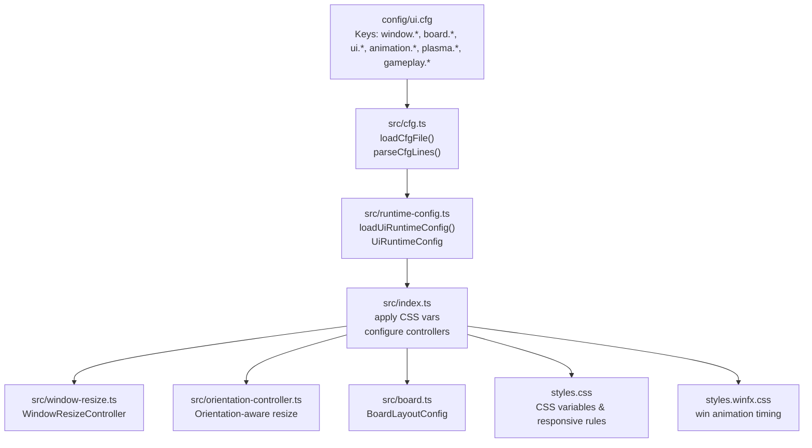
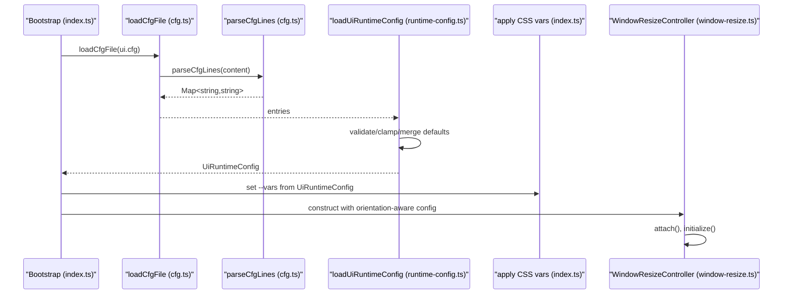
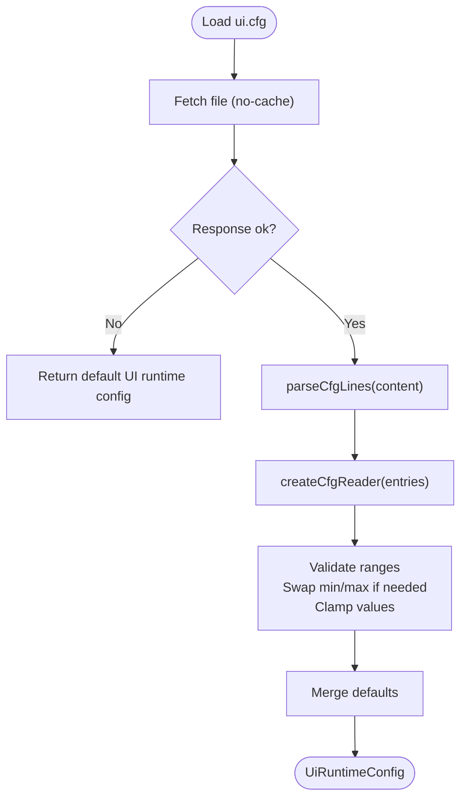
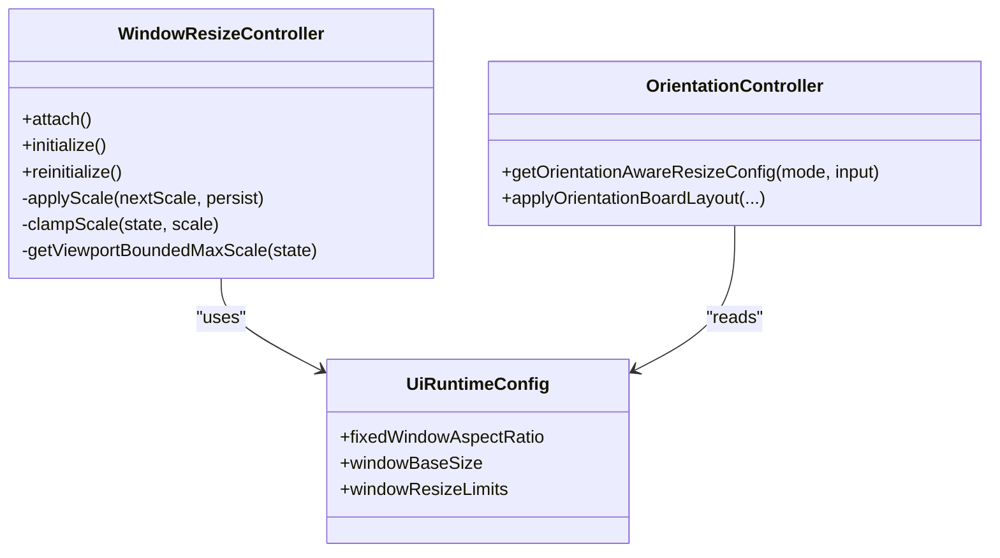
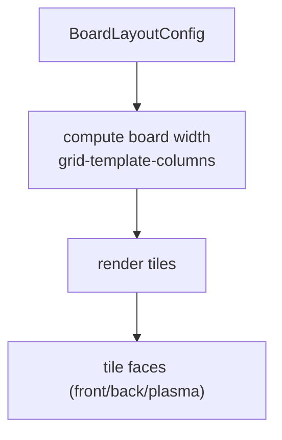
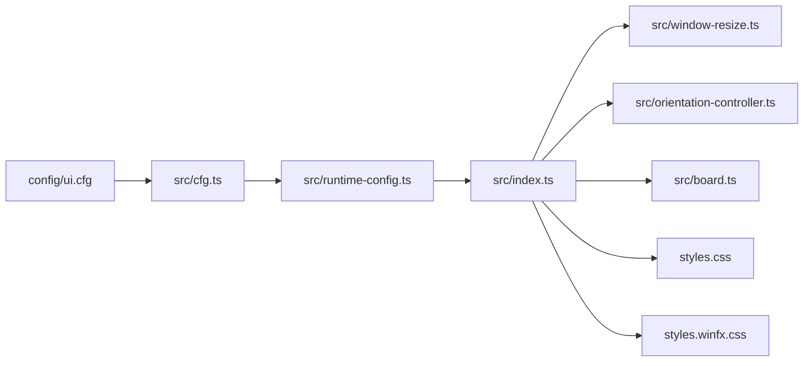

# UI Configuration

<cite>
**Referenced Files in This Document**
- [ui.cfg](file://config/ui.cfg)
- [runtime-config.ts](file://src/runtime-config.ts)
- [cfg.ts](file://src/cfg.ts)
- [window-resize.ts](file://src/window-resize.ts)
- [board.ts](file://src/board.ts)
- [orientation-controller.ts](file://src/orientation-controller.ts)
- [settings-controller.ts](file://src/settings-controller.ts)
- [index.ts](file://src/index.ts)
- [styles.css](file://styles.css)
- [styles.winfx.css](file://styles.winfx.css)
- [index.html](file://index.html)
- [runtime-config.md](file://docs/runtime-config.md)
</cite>

## Table of Contents
1. [Introduction](#introduction)
2. [Project Structure](#project-structure)
3. [Core Components](#core-components)
4. [Architecture Overview](#architecture-overview)
5. [Detailed Component Analysis](#detailed-component-analysis)
6. [Dependency Analysis](#dependency-analysis)
7. [Performance Considerations](#performance-considerations)
8. [Troubleshooting Guide](#troubleshooting-guide)
9. [Conclusion](#conclusion)

## Introduction
This document explains the UI configuration system that governs window sizing, layout parameters, visual appearance, and responsive behavior. It covers how configuration values are loaded from disk, validated, and applied to runtime state and CSS variables. It also documents the relationship between UI configuration and CSS variables, responsive behavior, and accessibility considerations, along with practical examples and troubleshooting guidance.

## Project Structure
The UI configuration system spans configuration files, a loader, runtime state, controllers, and stylesheets:
- Configuration files define keys for window sizing, board layout, opacity, animation timing, and visual effects.
- A loader parses configuration files and exposes typed accessors.
- Runtime configuration consolidates validated values into strongly typed structures.
- Controllers apply configuration to the DOM and CSS custom properties.
- Stylesheets consume CSS variables for responsive sizing, layout, and animation timing.

**Diagram sources**
- [ui.cfg](file://config/ui.cfg)
- [cfg.ts](file://src/cfg.ts)
- [runtime-config.ts](file://src/runtime-config.ts)
- [index.ts](file://src/index.ts)
- [window-resize.ts](file://src/window-resize.ts)
- [orientation-controller.ts](file://src/orientation-controller.ts)
- [board.ts](file://src/board.ts)
- [styles.css](file://styles.css)
- [styles.winfx.css](file://styles.winfx.css)

**Section sources**
- [ui.cfg](file://config/ui.cfg)
- [runtime-config.ts](file://src/runtime-config.ts)
- [cfg.ts](file://src/cfg.ts)
- [index.ts](file://src/index.ts)
- [styles.css](file://styles.css)

## Core Components
- Configuration file: Defines keys for window constraints, board layout, opacity, animation speed limits, visual effects timing, and gameplay timing.
- Loader: Reads and parses configuration files, with robust error handling for network and parsing failures.
- Runtime configuration: Validates and normalizes values, clamps ranges, and merges defaults.
- Controllers: Apply configuration to CSS variables, DOM attributes, and runtime behavior.
- Stylesheets: Consume CSS variables for responsive sizing, layout, and animation timing.

Key configuration categories:
- Window sizing and scaling: fixed aspect ratio, base size, min/max scale, viewport padding, resize handle behavior.
- Board layout: min/target tile size, gaps, padding, margins.
- Opacity settings: global, front/back tile opacity.
- Animation timing: default/min/max speed, tile flip duration, gameplay timing, visual effects durations.
- Visual effects: plasma background drift, hue cycle, tile drift, glow sweep, flares shift, opacities.
- Gameplay timing: mismatch delay, matched disappear pause/duration, win canvas fade, auto-match delays, UI timer interval.

**Section sources**
- [ui.cfg](file://config/ui.cfg)
- [runtime-config.ts](file://src/runtime-config.ts)
- [cfg.ts](file://src/cfg.ts)
- [board.ts](file://src/board.ts)
- [window-resize.ts](file://src/window-resize.ts)
- [styles.css](file://styles.css)

## Architecture Overview
The UI configuration pipeline:
1. Load configuration file via fetch.
2. Parse key-value pairs into a map.
3. Build a typed reader for numbers, integers, booleans.
4. Validate and clamp values, swap min/max when needed, merge defaults.
5. Apply CSS variables and controller configurations.
6. React to resize and orientation changes.

**Diagram sources**
- [index.ts](file://src/index.ts)
- [cfg.ts](file://src/cfg.ts)
- [runtime-config.ts](file://src/runtime-config.ts)
- [window-resize.ts](file://src/window-resize.ts)

## Detailed Component Analysis

### Configuration Loading and Validation
- Loads configuration via fetch with no-cache and handles network and parsing errors.
- Provides typed readers for numbers, integers, booleans with fallback defaults.
- Validates ranges and swaps min/max when invalid.
- Merges defaults for missing keys and clamps values to safe ranges.

**Diagram sources**
- [cfg.ts](file://src/cfg.ts)
- [runtime-config.ts](file://src/runtime-config.ts)

**Section sources**
- [cfg.ts](file://src/cfg.ts)
- [runtime-config.ts](file://src/runtime-config.ts)

### CSS Variables and Responsive Behavior
- CSS variables are set from runtime configuration:
  - Animation speed defaults and overrides
  - Tile opacity globals and per-face values
  - App max width
  - Tile flip duration and matched disappear durations
  - Plasma animation durations and opacities
- Stylesheets consume these variables for responsive sizing and animation timing.
- Reduced-motion media query adapts win animations to shorter durations.

Practical examples:
- Adjust tile appearance: change global/front/back opacity to alter perceived depth and readability.
- Customize animation speeds: adjust default/min/max speed sliders and observe CSS variable propagation.
- Control board sizing: tune min/target tile size, gaps, and padding to fit different screens.

**Section sources**
- [index.ts](file://src/index.ts)
- [styles.css](file://styles.css)
- [styles.winfx.css](file://styles.winfx.css)
- [index.html](file://index.html)

### Window Sizing and Scaling
- Fixed aspect ratio and base window size drive initial layout.
- Min/max scale and viewport padding constrain resizing.
- Resize handle supports pointer dragging with persisted scale.
- Orientation mode flips aspect ratio and swaps base dimensions.

**Diagram sources**
- [window-resize.ts](file://src/window-resize.ts)
- [orientation-controller.ts](file://src/orientation-controller.ts)
- [runtime-config.ts](file://src/runtime-config.ts)

**Section sources**
- [window-resize.ts](file://src/window-resize.ts)
- [orientation-controller.ts](file://src/orientation-controller.ts)
- [runtime-config.ts](file://src/runtime-config.ts)

### Board Layout Parameters
- Board layout is defined by min/target tile size, tile gap, horizontal padding, chrome, and top margin.
- Applied to board rendering to compute grid template columns and board width.
- Orientation controller can transpose layout for portrait mode.

**Diagram sources**
- [board.ts](file://src/board.ts)

**Section sources**
- [board.ts](file://src/board.ts)
- [runtime-config.ts](file://src/runtime-config.ts)

### Animation Timing and Visual Effects
- Animation speed is controlled by a CSS variable that scales multiple animations.
- Gameplay timing keys influence mismatch resolution, matched disappear pauses and durations, win canvas fade, auto-match delays, and UI timer intervals.
- Visual effects keys control plasma background drift, hue cycle, tile drift, glow sweep, flares shift, and opacities.

Practical examples:
- Slow down gameplay: increase matched disappear duration and mismatch delay.
- Reduce motion: rely on reduced-motion media query to shorten win animations.
- Tune plasma: adjust drift and hue cycle durations for desired ambient feel.

**Section sources**
- [runtime-config.ts](file://src/runtime-config.ts)
- [index.ts](file://src/index.ts)
- [styles.winfx.css](file://styles.winfx.css)

### Settings and Accessibility
- Settings controller manages emoji pack selection, tile multiplier, and animation speed with two-phase commit.
- Persisted selections are read on startup and applied to UI and controllers.
- Accessibility: orientation toggle updates aria-labels and icons; reduced-motion media query reduces intensive animations.

**Section sources**
- [settings-controller.ts](file://src/settings-controller.ts)
- [index.html](file://index.html)
- [styles.winfx.css](file://styles.winfx.css)

## Dependency Analysis
- Configuration loading depends on fetch and parser utilities.
- Runtime configuration depends on defaults and clamping utilities.
- Controllers depend on runtime configuration and DOM APIs.
- Stylesheets depend on CSS variables set by the application.

**Diagram sources**
- [ui.cfg](file://config/ui.cfg)
- [cfg.ts](file://src/cfg.ts)
- [runtime-config.ts](file://src/runtime-config.ts)
- [index.ts](file://src/index.ts)
- [window-resize.ts](file://src/window-resize.ts)
- [orientation-controller.ts](file://src/orientation-controller.ts)
- [board.ts](file://src/board.ts)
- [styles.css](file://styles.css)
- [styles.winfx.css](file://styles.winfx.css)

**Section sources**
- [runtime-config.ts](file://src/runtime-config.ts)
- [index.ts](file://src/index.ts)

## Performance Considerations
- Keep animation speed ranges reasonable to avoid excessive scaling of durations.
- Limit max scale to prevent oversized layouts; viewport bounds are enforced.
- Use reduced-motion media query to optimize for accessibility and performance.
- Persisted scale reduces repeated calculations after reloads.

[No sources needed since this section provides general guidance]

## Troubleshooting Guide
Common issues and resolutions:
- Configuration file not found or invalid:
  - The loader logs warnings for fetch and parse failures and falls back to defaults.
  - Verify the file path and syntax; ensure keys match documented categories.
- Min/max scale or speed inverted:
  - The loader detects and warns when min exceeds max; values are swapped internally.
  - Correct the configuration to maintain min ≤ max.
- Odd number of icon packs causing layout issues:
  - The system can warn or error depending on ui.emojiPackParityMode.
  - Keep an even number of packs to preserve the 2-column settings grid.
- Excessive window size on large screens:
  - Increase appMaxWidthPx to allow larger widths; max scale caps resize slider.
- Animations feel too fast/slow:
  - Adjust animation.defaultSpeed, minSpeed, and maxSpeed; CSS variable --animation-speed applies globally.
- Board misalignment or overflow:
  - Tune board.minTileSizePx, board.targetTileSizePx, board.tileGapPx, and boardHorizontalPaddingPx.
- Reduced-motion behavior unexpected:
  - Confirm reduced-motion media query support and verify CSS rules override animations appropriately.

**Section sources**
- [cfg.ts](file://src/cfg.ts)
- [runtime-config.ts](file://src/runtime-config.ts)
- [index.ts](file://src/index.ts)
- [runtime-config.md](file://docs/runtime-config.md)

## Conclusion
The UI configuration system provides a robust, extensible mechanism to control window sizing, board layout, opacity, animation timing, and visual effects. By separating concerns—configuration loading, validation, runtime state, and CSS application—the system remains maintainable and adaptable. Use the provided categories and examples to tailor the UI to different screen sizes, performance budgets, and accessibility needs.