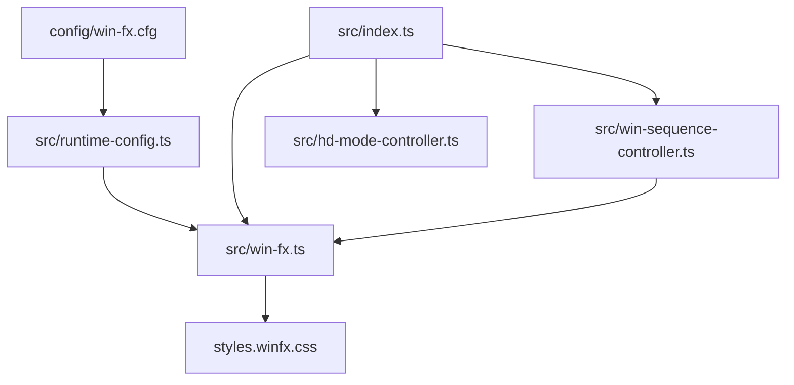
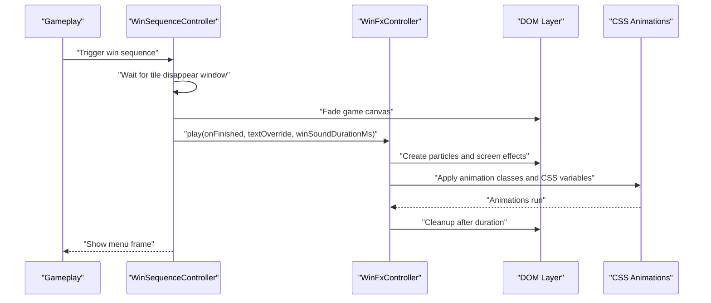
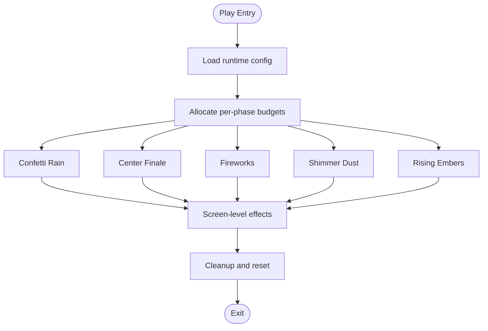
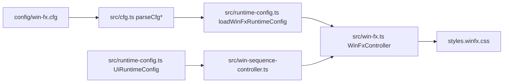

# Visual Effects Configuration

<cite>
**Referenced Files in This Document**
- [config/win-fx.cfg](file://config/win-fx.cfg)
- [src/win-fx.ts](file://src/win-fx.ts)
- [src/win-sequence-controller.ts](file://src/win-sequence-controller.ts)
- [src/runtime-config.ts](file://src/runtime-config.ts)
- [src/cfg.ts](file://src/cfg.ts)
- [src/index.ts](file://src/index.ts)
- [src/hd-mode-controller.ts](file://src/hd-mode-controller.ts)
- [styles.winfx.css](file://styles.winfx.css)
- [docs/win-animation-sequence.md](file://docs/win-animation-sequence.md)
- [e2e/mobile-layout.spec.ts](file://e2e/mobile-layout.spec.ts)
- [tests/win-fx.test.ts](file://tests/win-fx.test.ts)
</cite>

## Table of Contents
1. [Introduction](#introduction)
2. [Project Structure](#project-structure)
3. [Core Components](#core-components)
4. [Architecture Overview](#architecture-overview)
5. [Detailed Component Analysis](#detailed-component-analysis)
6. [Dependency Analysis](#dependency-analysis)
7. [Performance Considerations](#performance-considerations)
8. [Troubleshooting Guide](#troubleshooting-guide)
9. [Conclusion](#conclusion)
10. [Appendices](#appendices)

## Introduction
This document explains the visual effects configuration system for win celebrations, including particle effects, animation settings, and background effects. It covers how configuration drives the runtime behavior, how particle budgets are managed, and how performance is balanced across devices. It also documents the relationship between configuration and CSS animations, and how mobile device considerations are integrated.

## Project Structure
The visual effects system spans configuration, runtime controllers, and CSS animations:
- Configuration is loaded from a dedicated file and merged into runtime configuration.
- The win sequence orchestrates the transition from gameplay to celebration.
- The win effects controller creates and animates DOM particles and applies screen-level effects.
- CSS defines the animations and visual styles for all effects.
- Tests validate behavior and performance characteristics.

**Diagram sources**
- [config/win-fx.cfg:1-30](file://config/win-fx.cfg#L1-L30)
- [src/runtime-config.ts:365-398](file://src/runtime-config.ts#L365-L398)
- [src/win-sequence-controller.ts:21-51](file://src/win-sequence-controller.ts#L21-L51)
- [src/win-fx.ts:41-178](file://src/win-fx.ts#L41-L178)
- [styles.winfx.css:1-80](file://styles.winfx.css#L1-L80)
- [src/index.ts:828-835](file://src/index.ts#L828-L835)
- [src/hd-mode-controller.ts:68-73](file://src/hd-mode-controller.ts#L68-L73)

**Section sources**
- [config/win-fx.cfg:1-30](file://config/win-fx.cfg#L1-L30)
- [src/runtime-config.ts:365-398](file://src/runtime-config.ts#L365-L398)
- [src/win-sequence-controller.ts:21-51](file://src/win-sequence-controller.ts#L21-L51)
- [src/win-fx.ts:41-178](file://src/win-fx.ts#L41-L178)
- [styles.winfx.css:1-80](file://styles.winfx.css#L1-L80)
- [src/index.ts:828-835](file://src/index.ts#L828-L835)
- [src/hd-mode-controller.ts:68-73](file://src/hd-mode-controller.ts#L68-L73)

## Core Components
- WinFx runtime configuration: Defines particle counts, timing parameters, color palettes, and limits.
- WinFx controller: Creates and animates particles, coordinates screen-level effects, and enforces global particle budget.
- Win sequence controller: Orchestrates the transition from gameplay to celebration and triggers the win effects.
- CSS animations: Provides the visual animations for all effects, including particle movement, screen flashes, and background effects.
- HD mode: Controls whether high-detail effects are enabled, affecting particle budgets and performance.

**Section sources**
- [src/runtime-config.ts:68-88](file://src/runtime-config.ts#L68-L88)
- [src/win-fx.ts:41-178](file://src/win-fx.ts#L41-L178)
- [src/win-sequence-controller.ts:21-51](file://src/win-sequence-controller.ts#L21-L51)
- [styles.winfx.css:174-553](file://styles.winfx.css#L174-L553)
- [src/hd-mode-controller.ts:68-73](file://src/hd-mode-controller.ts#L68-L73)

## Architecture Overview
The win celebration pipeline:
1. The win sequence controller waits for gameplay animations to finish, then fades the game canvas.
2. It starts the win sound and triggers the win effects controller.
3. The win effects controller creates particles and screen-level effects according to configuration.
4. CSS animations drive the visual transitions and effects.
5. A cleanup phase removes DOM nodes and resets classes.

**Diagram sources**
- [src/win-sequence-controller.ts:66-118](file://src/win-sequence-controller.ts#L66-L118)
- [src/win-fx.ts:236-562](file://src/win-fx.ts#L236-L562)
- [styles.winfx.css:174-553](file://styles.winfx.css#L174-L553)

## Detailed Component Analysis

### WinFx Runtime Configuration
- Keys in the configuration file define:
  - Text display duration before fireworks.
  - Global particle caps for HD and low-performance modes.
  - Timing and spread parameters for confetti rain.
  - Center finale waves, count, and delays.
  - Firework burst count and per-burst composition.
  - Color palettes for general particles and confetti rain.
  - Win text options.
- The runtime loader parses lists and validates hex colors, falling back to defaults when invalid.

**Section sources**
- [config/win-fx.cfg:1-30](file://config/win-fx.cfg#L1-L30)
- [src/runtime-config.ts:365-398](file://src/runtime-config.ts#L365-L398)
- [src/cfg.ts:54-96](file://src/cfg.ts#L54-L96)

### WinFx Controller
Responsibilities:
- Manage particle creation and lifecycle across five phases:
  - Confetti rain: falls from above with physics-based sizing and opacity.
  - Center finale: dense bursts from the center with alternating sparks and symbols.
  - Fireworks: post-text bursts with outer sparks and central cores.
  - Shimmer dust: ambient twinkling particles during fireworks.
  - Rising embers: warm particles rising from the lower board area.
- Enforce a global particle budget split across phases.
- Apply screen-level effects: screen flash, vignette, app shake, chroma aberration, and particles pulse.
- Scale durations by animation speed and handle cleanup.

Key implementation patterns:
- Lazy creation via timeouts to avoid layout spikes.
- Randomized shapes, symbols, colors, and delays for variety.
- CSS variables for dynamic sizing, positioning, and timing.
- Budget allocation prevents starvation of later phases.

**Diagram sources**
- [src/win-fx.ts:236-562](file://src/win-fx.ts#L236-L562)

**Section sources**
- [src/win-fx.ts:41-178](file://src/win-fx.ts#L41-L178)
- [src/win-fx.ts:236-562](file://src/win-fx.ts#L236-L562)
- [src/win-fx.ts:658-828](file://src/win-fx.ts#L658-L828)

### Win Sequence Controller
- Coordinates the transition from gameplay to celebration.
- Computes timing windows from UI runtime configuration and scales by animation speed.
- Triggers the win sound and delegates to the win effects controller.
- Handles reduced motion preferences and aborts if the active game changes.

**Section sources**
- [src/win-sequence-controller.ts:21-141](file://src/win-sequence-controller.ts#L21-L141)

### CSS Animations and Screen Effects
- Text display and glow pulse animations.
- Particle blast, confetti fall, firework burst, shimmer drift, and ember rise animations.
- Screen-level effects via CSS classes: flash, vignette, shake, chroma, and pulse.
- Reduced motion support disables intensive animations while preserving essential text.

**Section sources**
- [styles.winfx.css:174-553](file://styles.winfx.css#L174-L553)

### HD Mode and Mobile Device Considerations
- HD mode toggles high-detail versus low-performance settings.
- On mobile, HD mode defaults to off and the toggle reflects “Enable HD mode”.
- The win effects controller respects HD mode to select particle caps.

**Section sources**
- [src/hd-mode-controller.ts:43-73](file://src/hd-mode-controller.ts#L43-L73)
- [src/index.ts:828-835](file://src/index.ts#L828-L835)
- [e2e/mobile-layout.spec.ts:114-124](file://e2e/mobile-layout.spec.ts#L114-L124)

## Dependency Analysis
- Configuration loading depends on a simple parser that ignores comments and blank lines.
- WinFx runtime configuration is injected into the win effects controller.
- The win sequence controller depends on UI runtime configuration for timing and animation scaling.
- CSS animations depend on CSS variables set by the win effects controller.

**Diagram sources**
- [src/cfg.ts:54-96](file://src/cfg.ts#L54-L96)
- [src/runtime-config.ts:365-398](file://src/runtime-config.ts#L365-L398)
- [src/win-fx.ts:41-178](file://src/win-fx.ts#L41-L178)
- [src/win-sequence-controller.ts:21-51](file://src/win-sequence-controller.ts#L21-L51)
- [styles.winfx.css:1-80](file://styles.winfx.css#L1-L80)

**Section sources**
- [src/cfg.ts:54-96](file://src/cfg.ts#L54-L96)
- [src/runtime-config.ts:365-398](file://src/runtime-config.ts#L365-L398)
- [src/win-fx.ts:41-178](file://src/win-fx.ts#L41-L178)
- [src/win-sequence-controller.ts:21-51](file://src/win-sequence-controller.ts#L21-L51)
- [styles.winfx.css:1-80](file://styles.winfx.css#L1-L80)

## Performance Considerations
- Global particle budget: The controller computes per-phase budgets up front and enforces a hard cap based on HD mode. If the requested total exceeds the cap, confetti may be reduced to preserve earlier phases.
- Lazy creation: Phases schedule particle creation via timeouts to avoid layout spikes.
- Animation speed scaling: Durations are divided by the current animation speed, reducing CPU/GPU work.
- Reduced motion: Intensive animations are disabled or simplified when reduced motion is preferred.
- CSS-driven animations: Using CSS animations minimizes JavaScript overhead and leverages GPU acceleration.
- HD mode: Low-performance mode reduces particle caps for mobile and constrained devices.

Practical tips:
- Lower maxParticles and maxParticlesLow for mobile devices.
- Reduce confettiRainCount and fireworkBursts for older GPUs.
- Disable or simplify screen-level effects on low-end devices.
- Prefer fewer waves and smaller counts for center finale.
- Use lighter color palettes and avoid excessive shimmer dust.

**Section sources**
- [src/win-fx.ts:266-301](file://src/win-fx.ts#L266-L301)
- [src/win-fx.ts:826-828](file://src/win-fx.ts#L826-L828)
- [styles.winfx.css:556-587](file://styles.winfx.css#L556-L587)
- [config/win-fx.cfg:7-13](file://config/win-fx.cfg#L7-L13)
- [docs/win-animation-sequence.md:214-233](file://docs/win-animation-sequence.md#L214-L233)

## Troubleshooting Guide
Common issues and resolutions:
- Too many particles causing lag:
  - Reduce maxParticles or maxParticlesLow in the configuration.
  - Decrease confettiRainCount, fireworkBursts, or center finale waves.
- Effects not appearing on mobile:
  - Ensure HD mode is enabled if desired; otherwise, confirm low-performance fallback is acceptable.
  - Verify CSS animations are not blocked by reduced motion settings.
- Cleanup not happening:
  - Confirm the win sound duration is passed to the controller so cleanup aligns with audio.
  - Check that the animation speed bounds are reasonable to avoid extremely long durations.
- Visual artifacts or missing effects:
  - Validate color palettes are valid hex values.
  - Ensure CSS variables for particle styles are set before animations start.

**Section sources**
- [src/win-fx.ts:180-206](file://src/win-fx.ts#L180-L206)
- [src/win-fx.ts:528-562](file://src/win-fx.ts#L528-L562)
- [src/runtime-config.ts:365-398](file://src/runtime-config.ts#L365-L398)
- [tests/win-fx.test.ts:731-765](file://tests/win-fx.test.ts#L731-L765)

## Conclusion
The visual effects system balances rich, layered celebrations with performance across devices. Configuration controls particle counts, timing, and color palettes, while the win effects controller enforces budgets and schedules animations. CSS animations deliver smooth visuals, and HD mode and reduced motion preferences ensure accessibility and responsiveness. Tuning these parameters allows teams to optimize for different hardware capabilities while maintaining visual appeal.

## Appendices

### Configuration Reference
- Runtime-configurable values (from the configuration file):
  - textDisplayDurationMs: Duration the win text is visible before fireworks.
  - maxParticles: Global particle cap in HD mode.
  - maxParticlesLow: Global particle cap in low-performance mode.
  - particleDelayJitterMs: Random delay jitter per particle.
  - centerFinaleDelayMs: Delay before center finale starts.
  - centerFinaleWaves: Number of center finale waves.
  - centerFinaleWaveDelayMs: Delay between center finale waves.
  - centerFinaleCount: Particles per center finale wave.
  - confettiRainDelayMs: Delay before confetti rain starts.
  - confettiRainCount: Number of confetti rain pieces.
  - confettiRainSpreadMs: Time window over which rain pieces are spread.
  - fireworkBursts: Number of post-text firework bursts.
  - colors: General particle color palette (comma-separated hex).
  - textOptions: Win text variations (comma-separated).
  - rainColors: Confetti rain color palette (comma-separated hex).

- Hardcoded constants in the win effects controller:
  - Firework burst composition and spread parameters.
  - Screen-level effect timings and durations.
  - Shimmer dust and ember counts and behaviors.

**Section sources**
- [config/win-fx.cfg:237-284](file://config/win-fx.cfg#L237-L284)
- [src/win-fx.ts:53-116](file://src/win-fx.ts#L53-L116)
- [src/win-fx.ts:118-140](file://src/win-fx.ts#L118-L140)
- [src/win-fx.ts:118-140](file://src/win-fx.ts#L118-L140)

### Practical Customization Examples
- Increase visual intensity:
  - Raise confettiRainCount and fireworkBursts.
  - Add more center finale waves and increase centerFinaleCount.
  - Expand the color palettes for richer hues.
- Create themed color palettes:
  - Define a custom colors palette for general particles.
  - Provide a separate rainColors palette for confetti rain.
  - Use seasonal or event-specific themes by swapping palettes.
- Optimize for mobile:
  - Lower maxParticlesLow and confettiRainCount.
  - Reduce fireworkBursts and center finale waves.
  - Disable shimmer dust and embers if needed.
- Balance performance and appeal:
  - Start with conservative defaults and incrementally raise counts.
  - Test on representative devices and adjust budgets accordingly.
  - Use reduced motion mode to simplify effects for accessibility.

**Section sources**
- [config/win-fx.cfg:24-29](file://config/win-fx.cfg#L24-L29)
- [src/runtime-config.ts:158-201](file://src/runtime-config.ts#L158-L201)
- [docs/win-animation-sequence.md:214-233](file://docs/win-animation-sequence.md#L214-L233)