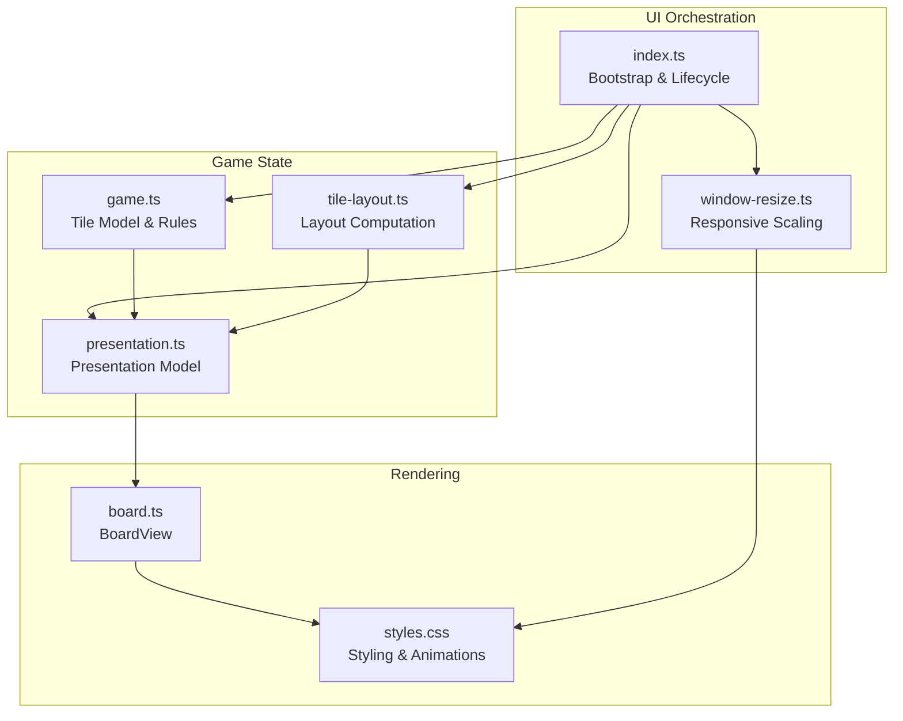
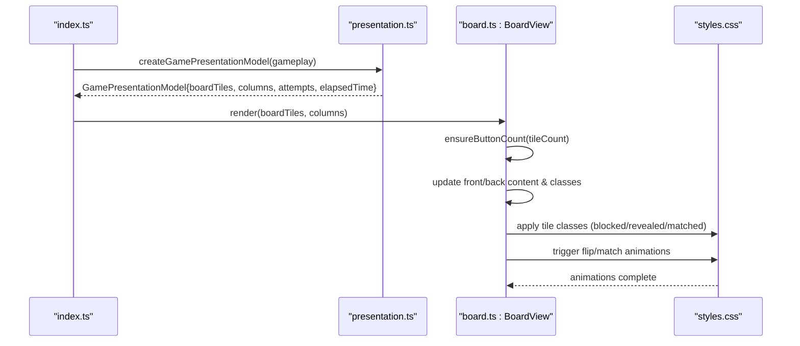
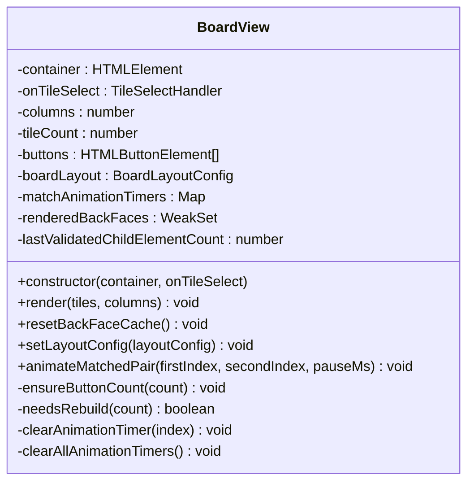
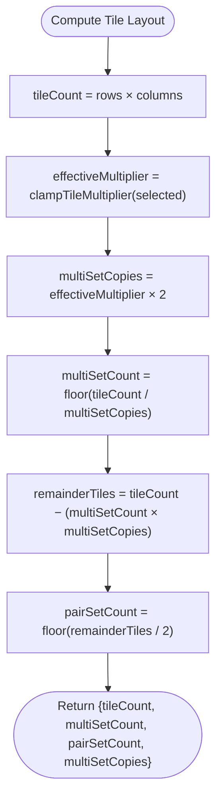
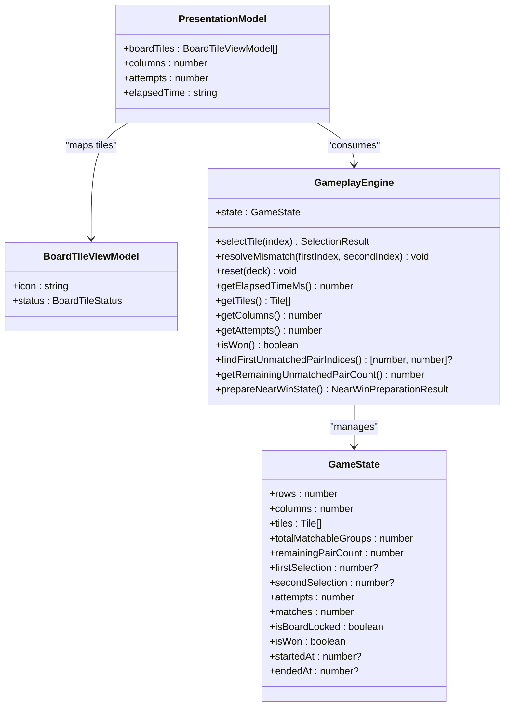
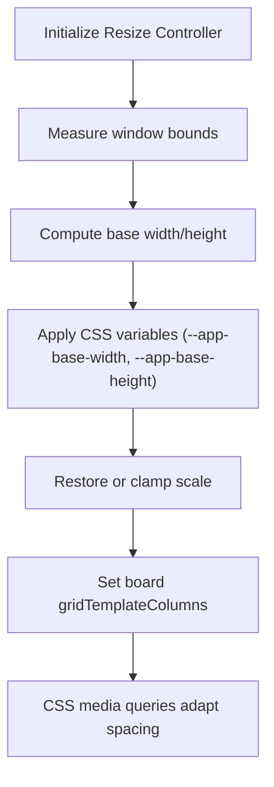
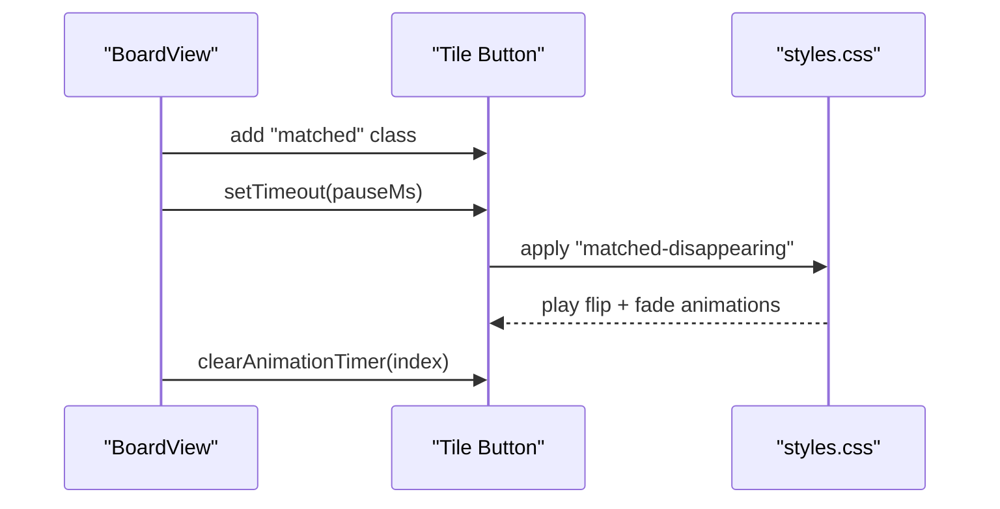
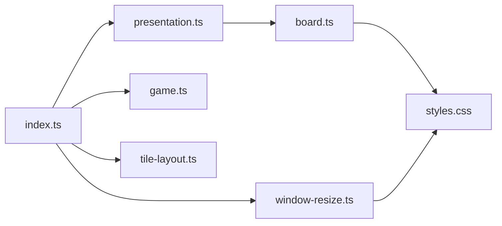

# Board Rendering System

<cite>
**Referenced Files in This Document**
- [board.ts](file://src/board.ts)
- [tile-layout.ts](file://src/tile-layout.ts)
- [game.ts](file://src/game.ts)
- [gameplay.ts](file://src/gameplay.ts)
- [presentation.ts](file://src/presentation.ts)
- [styles.css](file://styles.css)
- [window-resize.ts](file://src/window-resize.ts)
- [index.ts](file://src/index.ts)
- [board.test.ts](file://tests/board.test.ts)
</cite>

## Table of Contents
1. [Introduction](#introduction)
2. [Project Structure](#project-structure)
3. [Core Components](#core-components)
4. [Architecture Overview](#architecture-overview)
5. [Detailed Component Analysis](#detailed-component-analysis)
6. [Dependency Analysis](#dependency-analysis)
7. [Performance Considerations](#performance-considerations)
8. [Troubleshooting Guide](#troubleshooting-guide)
9. [Conclusion](#conclusion)

## Introduction
This document explains the board rendering system responsible for displaying and animating tiles in the MEMORYBLOX game. It covers the board component architecture, tile layout generation, responsive design, status-based styling, animation triggers, and performance optimizations for large boards. It also provides examples of board initialization, tile state updates, and layout adaptation across screen sizes.

## Project Structure
The board rendering system spans several modules:
- Board rendering and DOM management: [board.ts](file://src/board.ts)
- Tile layout computation: [tile-layout.ts](file://src/tile-layout.ts)
- Game state and tile model: [game.ts](file://src/game.ts)
- Presentation model bridging: [presentation.ts](file://src/presentation.ts)
- UI orchestration and lifecycle: [index.ts](file://src/index.ts)
- Responsive scaling and window sizing: [window-resize.ts](file://src/window-resize.ts)
- Visual styling and animations: [styles.css](file://styles.css)
- Tests validating behavior: [board.test.ts](file://tests/board.test.ts)

**Diagram sources**
- [index.ts:1-200](file://src/index.ts#L1-L200)
- [board.ts:121-523](file://src/board.ts#L121-L523)
- [tile-layout.ts:1-54](file://src/tile-layout.ts#L1-L54)
- [game.ts:1-419](file://src/game.ts#L1-L419)
- [presentation.ts:1-25](file://src/presentation.ts#L1-L25)
- [styles.css:1191-1593](file://styles.css#L1191-L1593)
- [window-resize.ts:1-298](file://src/window-resize.ts#L1-L298)

**Section sources**
- [board.ts:121-523](file://src/board.ts#L121-L523)
- [tile-layout.ts:1-54](file://src/tile-layout.ts#L1-L54)
- [game.ts:1-419](file://src/game.ts#L1-L419)
- [presentation.ts:1-25](file://src/presentation.ts#L1-L25)
- [styles.css:1191-1593](file://styles.css#L1191-L1593)
- [window-resize.ts:1-298](file://src/window-resize.ts#L1-L298)
- [index.ts:1-200](file://src/index.ts#L1-L200)

## Core Components
- BoardView: Manages tile DOM creation, layout, status updates, and animations. Handles click and keyboard navigation, and lazy back-face rendering.
- Tile layout computation: Computes tile counts, multi-set vs pair sets, and distribution based on difficulty and multiplier.
- Game state: Defines tile model, selection rules, and win conditions.
- Presentation model: Bridges game state to UI with a simplified view model for tiles.
- Styles and animations: Provides responsive grid layout, tile styling, flip and match animations, and reduced-motion support.

Key responsibilities:
- BoardView.render: Applies columns, calculates board width, ensures button count, updates tile front/back content, toggles CSS classes, and manages animation timers.
- Lazy back-face rendering: Back-face icons are rendered only when a tile becomes revealed or matched, avoiding unnecessary work for hidden tiles.
- Animation lifecycle: Matched tiles trigger a flip and fade animation; timers are tracked and cleared appropriately.

**Section sources**
- [board.ts:227-306](file://src/board.ts#L227-L306)
- [board.ts:385-435](file://src/board.ts#L385-L435)
- [board.ts:506-521](file://src/board.ts#L506-L521)
- [tile-layout.ts:36-53](file://src/tile-layout.ts#L36-L53)
- [game.ts:1-419](file://src/game.ts#L1-L419)
- [presentation.ts:12-24](file://src/presentation.ts#L12-L24)

## Architecture Overview
The board rendering pipeline connects UI orchestration, game state, layout computation, and presentation model to BoardView, which updates the DOM and triggers animations.

**Diagram sources**
- [index.ts:1-200](file://src/index.ts#L1-L200)
- [presentation.ts:12-24](file://src/presentation.ts#L12-L24)
- [board.ts:227-306](file://src/board.ts#L227-L306)
- [styles.css:1389-1433](file://styles.css#L1389-L1433)

## Detailed Component Analysis

### BoardView: Tile Rendering and Animation
BoardView orchestrates tile creation, updates, and animations:
- Layout calculation: Computes board width from columns and layout config, and sets CSS grid template columns.
- Button management: Ensures the correct number of tile buttons, validates DOM integrity, and rebuilds when needed.
- Status-based styling: Updates front/back content, toggles CSS classes for blocked/revealed/matched states, and disables buttons accordingly.
- Lazy back-face rendering: Renders back-face icons only when tiles become revealed or matched, caching rendered faces to avoid rework.
- Animation control: Adds/removes matched-disappearing class and manages animation timers to coordinate pair matching.

**Diagram sources**
- [board.ts:121-523](file://src/board.ts#L121-L523)

**Section sources**
- [board.ts:121-523](file://src/board.ts#L121-L523)
- [board.test.ts:1-75](file://tests/board.test.ts#L1-L75)

### Tile Layout Generation
Tile layout computation determines how many tiles are generated and distributed:
- Tile count: rows × columns from difficulty.
- Multiplier clamping: Rounds and clamps the selected multiplier to a valid range based on tile count.
- Distribution: Computes multi-set count, pair-set count, and copies per icon to satisfy the layout.

**Diagram sources**
- [tile-layout.ts:19-53](file://src/tile-layout.ts#L19-L53)

**Section sources**
- [tile-layout.ts:1-54](file://src/tile-layout.ts#L1-L54)

### Game State and Presentation Model
Game state defines tile model, selection rules, and win conditions. Presentation model bridges game state to BoardView by exposing a simplified BoardTileViewModel array and columns.

**Diagram sources**
- [game.ts:12-42](file://src/game.ts#L12-L42)
- [game.ts:159-243](file://src/game.ts#L159-L243)
- [gameplay.ts:28-93](file://src/gameplay.ts#L28-L93)
- [presentation.ts:5-24](file://src/presentation.ts#L5-L24)

**Section sources**
- [game.ts:1-419](file://src/game.ts#L1-L419)
- [gameplay.ts:1-107](file://src/gameplay.ts#L1-L107)
- [presentation.ts:1-25](file://src/presentation.ts#L1-L25)

### Responsive Design and Layout Adaptation
Responsive behavior combines CSS grid layout with runtime layout configuration and window resizing:
- CSS grid: Board uses a responsive grid with repeat columns and minmax constraints for tile sizes.
- Layout config: BoardView supports runtime overrides for min tile size, target tile size, gaps, and padding.
- Window resize: Controller computes base dimensions, applies scale, and persists user preferences. CSS variables drive scaling and layout.

**Diagram sources**
- [window-resize.ts:108-151](file://src/window-resize.ts#L108-L151)
- [board.ts:227-235](file://src/board.ts#L227-L235)
- [styles.css:1191-1206](file://styles.css#L1191-L1206)
- [styles.css:1504-1593](file://styles.css#L1504-L1593)

**Section sources**
- [board.ts:227-235](file://src/board.ts#L227-L235)
- [board.ts:320-329](file://src/board.ts#L320-L329)
- [window-resize.ts:1-298](file://src/window-resize.ts#L1-L298)
- [styles.css:1191-1593](file://styles.css#L1191-L1593)

### Animation Triggers and Visual Feedback
Animations are coordinated through CSS classes and BoardView timers:
- Flip animation: Tiles flip to reveal back faces when revealed or matched.
- Match disappearance: Matched pairs enter a disappearing animation sequence.
- Reduced motion: Media query reduces animation duration when user prefers reduced motion.

**Diagram sources**
- [board.ts:331-354](file://src/board.ts#L331-L354)
- [board.ts:506-521](file://src/board.ts#L506-L521)
- [styles.css:1389-1433](file://styles.css#L1389-L1433)
- [styles.css:1443-1467](file://styles.css#L1443-L1467)
- [styles.css:1481-1502](file://styles.css#L1481-L1502)

**Section sources**
- [board.ts:294-302](file://src/board.ts#L294-L302)
- [board.ts:331-354](file://src/board.ts#L331-L354)
- [styles.css:1389-1433](file://styles.css#L1389-L1433)

## Dependency Analysis
The board rendering system exhibits clean separation of concerns:
- index.ts wires up presentation, game state, layout computation, and BoardView.
- BoardView depends on styles.css for visuals and animations.
- tile-layout.ts and game.ts are pure computations/utilities consumed by index.ts and presentation.ts.
- window-resize.ts is decoupled and injects configuration into the resize controller.

**Diagram sources**
- [index.ts:1-200](file://src/index.ts#L1-L200)
- [board.ts:121-523](file://src/board.ts#L121-L523)
- [tile-layout.ts:1-54](file://src/tile-layout.ts#L1-L54)
- [game.ts:1-419](file://src/game.ts#L1-L419)
- [presentation.ts:1-25](file://src/presentation.ts#L1-L25)
- [styles.css:1191-1593](file://styles.css#L1191-L1593)
- [window-resize.ts:1-298](file://src/window-resize.ts#L1-L298)

**Section sources**
- [index.ts:1-200](file://src/index.ts#L1-L200)
- [board.ts:121-523](file://src/board.ts#L121-L523)
- [tile-layout.ts:1-54](file://src/tile-layout.ts#L1-L54)
- [game.ts:1-419](file://src/game.ts#L1-L419)
- [presentation.ts:1-25](file://src/presentation.ts#L1-L25)
- [styles.css:1191-1593](file://styles.css#L1191-L1593)
- [window-resize.ts:1-298](file://src/window-resize.ts#L1-L298)

## Performance Considerations
- Lazy back-face rendering: Back-face icons are rendered only when tiles become revealed or matched, avoiding unnecessary DOM work and image fetches for hidden tiles. The cache is reset at the start of each game to prevent stale icons.
- DOM validation and rebuild guard: BoardView tracks the last validated child count and element types to skip expensive loops when the DOM is unchanged, minimizing per-render overhead.
- Animation timer management: Timers are tracked and cleared to prevent memory leaks and redundant animations.
- CSS-driven animations: Animations are performed via CSS classes and transforms, leveraging GPU acceleration and reduced JS overhead.
- Responsive scaling: CSS variables and media queries adapt layout without recalculating DOM positions.

**Section sources**
- [board.ts:259-273](file://src/board.ts#L259-L273)
- [board.ts:316-318](file://src/board.ts#L316-L318)
- [board.ts:458-482](file://src/board.ts#L458-L482)
- [board.ts:506-521](file://src/board.ts#L506-L521)
- [styles.css:1239-1244](file://styles.css#L1239-L1244)
- [styles.css:1481-1502](file://styles.css#L1481-L1502)

## Troubleshooting Guide
Common issues and remedies:
- Unexpected board width or column sizing: Verify layout config overrides and grid template columns. Tests demonstrate expected widths for different column counts and overridden min tile sizes.
- Tiles not rebuilding after external DOM changes: ensure needsRebuild detects cleared containers and rebuilds tile buttons.
- Stale back-face icons after restart: call resetBackFaceCache to clear the lazy-render cache before rendering.
- Animation glitches on rapid tile interactions: ensure animation timers are cleared and matched-disappearing class is removed when tiles revert to hidden.

**Section sources**
- [board.test.ts:19-72](file://tests/board.test.ts#L19-L72)
- [board.ts:385-435](file://src/board.ts#L385-L435)
- [board.ts:316-318](file://src/board.ts#L316-L318)
- [board.ts:506-521](file://src/board.ts#L506-L521)

## Conclusion
The board rendering system integrates a robust BoardView with responsive layout, efficient DOM management, and rich visual feedback. By separating concerns across presentation, game state, layout computation, and styling, it achieves maintainability and performance. The combination of lazy rendering, DOM validation, and CSS-driven animations ensures smooth gameplay across devices and screen sizes.