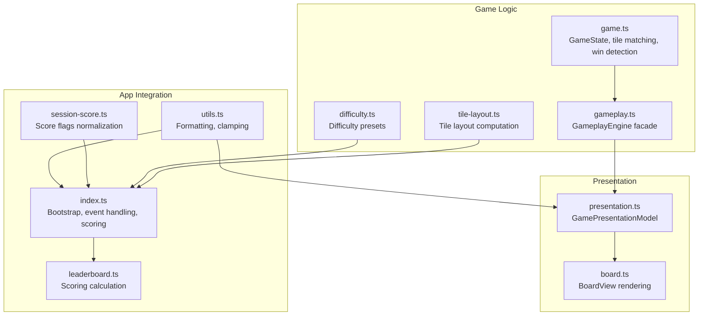
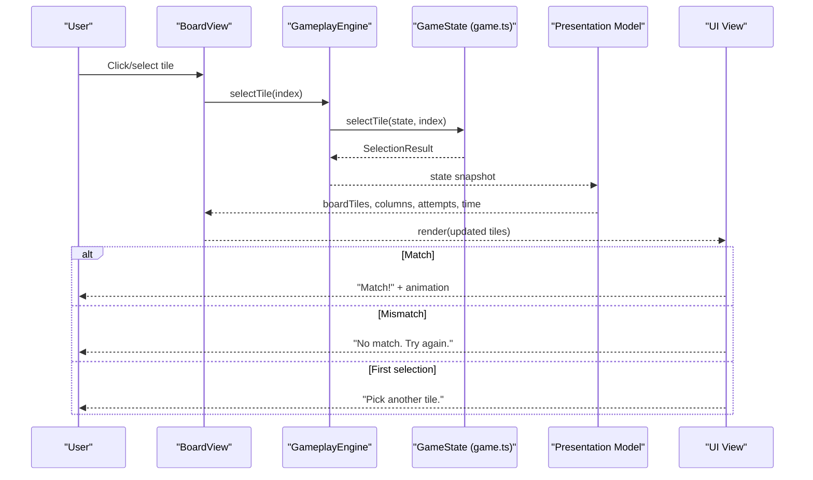
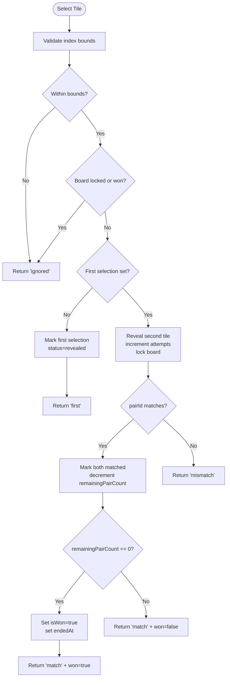
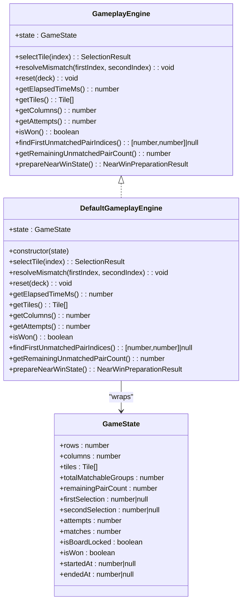
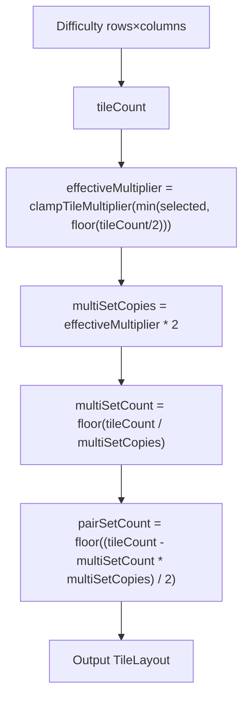
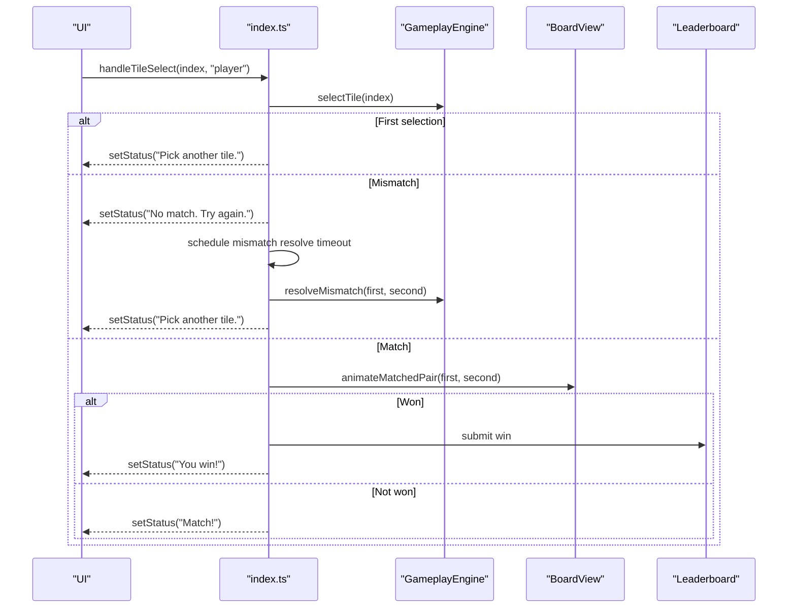
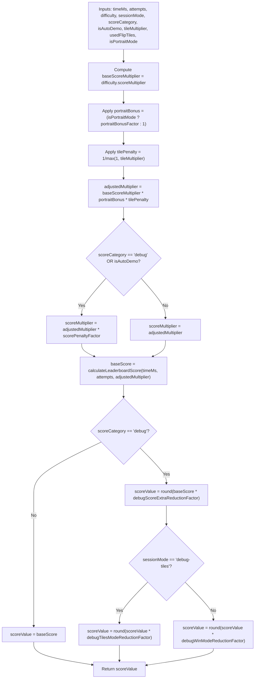
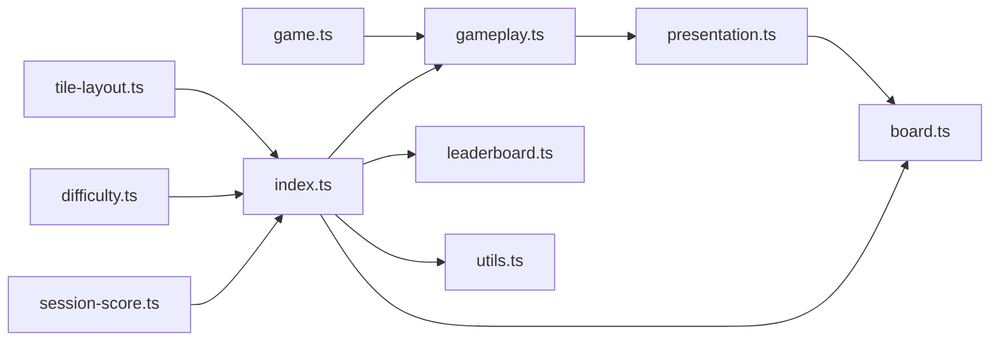

# Core Gameplay System

<cite>
**Referenced Files in This Document**
- [game.ts](file://src/game.ts)
- [gameplay.ts](file://src/gameplay.ts)
- [board.ts](file://src/board.ts)
- [tile-layout.ts](file://src/tile-layout.ts)
- [difficulty.ts](file://src/difficulty.ts)
- [index.ts](file://src/index.ts)
- [presentation.ts](file://src/presentation.ts)
- [utils.ts](file://src/utils.ts)
- [leaderboard.ts](file://src/leaderboard.ts)
- [session-score.ts](file://src/session-score.ts)
- [game.test.ts](file://tests/game.test.ts)
- [gameplay.test.ts](file://tests/gameplay.test.ts)
- [tile-layout.test.ts](file://tests/tile-layout.test.ts)
</cite>

## Table of Contents
1. [Introduction](#introduction)
2. [Project Structure](#project-structure)
3. [Core Components](#core-components)
4. [Architecture Overview](#architecture-overview)
5. [Detailed Component Analysis](#detailed-component-analysis)
6. [Dependency Analysis](#dependency-analysis)
7. [Performance Considerations](#performance-considerations)
8. [Troubleshooting Guide](#troubleshooting-guide)
9. [Conclusion](#conclusion)
10. [Appendices](#appendices)

## Introduction
This document explains the core gameplay system that powers the memory card matching experience. It covers the game engine implementation, tile matching algorithms, win condition detection, state transitions, and the gameplay facade pattern. It also documents tile layout generation with multiplier settings, difficulty configurations, turn management, game flow control, and the relationship between game logic and presentation layers. Practical examples include move validation, scoring calculations, and integration with the broader system architecture.

## Project Structure
The core gameplay logic resides in a small set of focused modules:
- Game engine and state: game.ts
- Facade abstraction: gameplay.ts
- Presentation model: presentation.ts
- Board rendering and UX: board.ts
- Tile layout and difficulty: tile-layout.ts, difficulty.ts
- Application bootstrap and integration: index.ts
- Utilities: utils.ts
- Scoring and leaderboards: leaderboard.ts, session-score.ts
- Tests validating behavior: game.test.ts, gameplay.test.ts, tile-layout.test.ts

**Diagram sources**
- [game.ts:1-419](file://src/game.ts#L1-L419)
- [gameplay.ts:1-107](file://src/gameplay.ts#L1-L107)
- [tile-layout.ts:1-54](file://src/tile-layout.ts#L1-L54)
- [difficulty.ts:1-40](file://src/difficulty.ts#L1-L40)
- [presentation.ts:1-25](file://src/presentation.ts#L1-L25)
- [board.ts:1-523](file://src/board.ts#L1-L523)
- [index.ts:1-1100](file://src/index.ts#L1-L1100)
- [utils.ts:1-145](file://src/utils.ts#L1-L145)
- [leaderboard.ts:1-541](file://src/leaderboard.ts#L1-L541)
- [session-score.ts:1-24](file://src/session-score.ts#L1-L24)

**Section sources**
- [game.ts:1-419](file://src/game.ts#L1-L419)
- [gameplay.ts:1-107](file://src/gameplay.ts#L1-L107)
- [tile-layout.ts:1-54](file://src/tile-layout.ts#L1-L54)
- [difficulty.ts:1-40](file://src/difficulty.ts#L1-L40)
- [presentation.ts:1-25](file://src/presentation.ts#L1-L25)
- [board.ts:1-523](file://src/board.ts#L1-L523)
- [index.ts:1-1100](file://src/index.ts#L1-L1100)
- [utils.ts:1-145](file://src/utils.ts#L1-L145)
- [leaderboard.ts:1-541](file://src/leaderboard.ts#L1-L541)
- [session-score.ts:1-24](file://src/session-score.ts#L1-L24)

## Core Components
- GameState and tile matching: Defines tile states, selection semantics, mismatch resolution, win detection, and elapsed time tracking.
- GameplayEngine facade: Encapsulates GameState behind a typed interface, enabling testability and controlled access.
- Presentation model: Translates game state into a view model suitable for rendering.
- BoardView: Renders tiles, handles user interactions, and animates outcomes.
- Tile layout and difficulty: Computes tile counts, multipliers, and distribution across difficulties.
- Scoring pipeline: Computes score from time, attempts, difficulty, and session flags.

**Section sources**
- [game.ts:1-419](file://src/game.ts#L1-L419)
- [gameplay.ts:1-107](file://src/gameplay.ts#L1-L107)
- [presentation.ts:1-25](file://src/presentation.ts#L1-L25)
- [board.ts:1-523](file://src/board.ts#L1-L523)
- [tile-layout.ts:1-54](file://src/tile-layout.ts#L1-L54)
- [difficulty.ts:1-40](file://src/difficulty.ts#L1-L40)
- [leaderboard.ts:457-526](file://src/leaderboard.ts#L457-L526)
- [session-score.ts:1-24](file://src/session-score.ts#L1-L24)

## Architecture Overview
The system follows a clean separation of concerns:
- Logic layer: game.ts and gameplay.ts define the core rules and state transitions.
- Presentation layer: board.ts renders tiles and reacts to user input; presentation.ts bridges logic to UI.
- Integration layer: index.ts orchestrates lifecycle, event handling, scoring, and UI updates.
- Configuration: difficulty.ts and tile-layout.ts define board geometry and tile distribution.

**Diagram sources**
- [index.ts:639-779](file://src/index.ts#L639-L779)
- [board.ts:155-175](file://src/board.ts#L155-L175)
- [gameplay.ts:43-93](file://src/gameplay.ts#L43-L93)
- [game.ts:159-243](file://src/game.ts#L159-L243)
- [presentation.ts:12-24](file://src/presentation.ts#L12-L24)

## Detailed Component Analysis

### Game Engine and Tile Matching
The game engine manages tile states, selection flow, and win conditions:
- TileStatus: hidden, revealed, matched, blocked.
- SelectionResult: ignored, first, match, mismatch.
- selectTile: validates indices, auto-resolves mismatches, tracks attempts and matches, decrements remainingPairCount, and detects wins.
- resolveMismatch: hides previously revealed tiles and unlocks the board.
- Remaining pair counting: O(1) win-check via cached remainingPairCount.
- Near-win preparation: prepareNearWinState pre-marks orphan tiles to ensure a solvable final pair.

**Diagram sources**
- [game.ts:159-243](file://src/game.ts#L159-L243)
- [game.ts:245-264](file://src/game.ts#L245-L264)

**Section sources**
- [game.ts:1-419](file://src/game.ts#L1-L419)
- [game.test.ts:76-176](file://tests/game.test.ts#L76-L176)

### Gameplay Facade Pattern
The GameplayEngine facade encapsulates GameState and exposes a controlled API:
- Exposes getters for tiles, columns, attempts, elapsed time, remaining pairs, and win state.
- Delegates all mutations to game.ts functions, ensuring testability and preventing external mutation.
- Provides findFirstUnmatchedPairIndices and prepareNearWinState for advanced scenarios.

**Diagram sources**
- [gameplay.ts:28-93](file://src/gameplay.ts#L28-L93)
- [game.ts:12-42](file://src/game.ts#L12-L42)

**Section sources**
- [gameplay.ts:1-107](file://src/gameplay.ts#L1-L107)
- [gameplay.test.ts:13-149](file://tests/gameplay.test.ts#L13-L149)

### Tile Layout Generation and Multiplier Settings
Tile layout computation determines how many tiles are generated and how icons are distributed:
- clampTileMultiplier: rounds and clamps multiplier to [1,3].
- resolveTileMultiplierForTileCount: caps multiplier by half the tile count.
- computeTileLayout: computes tileCount, multiSetCopies, multiSetCount, pairSetCount from difficulty and selected multiplier.

**Diagram sources**
- [tile-layout.ts:19-53](file://src/tile-layout.ts#L19-L53)
- [difficulty.ts:9-21](file://src/difficulty.ts#L9-L21)

**Section sources**
- [tile-layout.ts:1-54](file://src/tile-layout.ts#L1-L54)
- [tile-layout.test.ts:1-128](file://tests/tile-layout.test.ts#L1-L128)

### Difficulty Level Configurations
Difficulty presets define board size and score multipliers:
- Easy: 5×6 board, scoreMultiplier 1.2
- Normal: 5×8 board, scoreMultiplier 1.8
- Hard: 5×10 board, scoreMultiplier 2.4
- Default difficulty ID is "normal".
- getDifficultyById: finds difficulty by id with null fallback.

**Section sources**
- [difficulty.ts:1-40](file://src/difficulty.ts#L1-L40)

### Turn Management and Game Flow Control
Turn management is handled in the integration layer:
- handleTileSelect: processes player or demo selections, cancels auto-demo on player action, normalizes score flags, and triggers mismatch resolution timeouts.
- Mismatch auto-resolve: after a delay scaled by animation speed, previously mismatched tiles are hidden and the board is unlocked.
- Win flow: on last match, animate pair disappearance, compute score, prompt player name, submit to leaderboard, and play win sequence.

**Diagram sources**
- [index.ts:639-779](file://src/index.ts#L639-L779)
- [board.ts:331-354](file://src/board.ts#L331-L354)
- [leaderboard.ts:432-454](file://src/leaderboard.ts#L432-L454)

**Section sources**
- [index.ts:639-779](file://src/index.ts#L639-L779)
- [board.ts:331-354](file://src/board.ts#L331-L354)
- [leaderboard.ts:432-454](file://src/leaderboard.ts#L432-L454)

### Presentation Layer and Rendering
The presentation layer transforms GameState into BoardTileViewModel and updates UI:
- createGamePresentationModel: maps tiles to BoardTileViewModel, exposes columns, attempts, and formatted elapsed time.
- BoardView: renders tiles, handles click/keyboard events, lazily renders back faces, and animates matched pairs.
- render: updates tile status, disabled state, and accessibility attributes; supports debug flip-all-tiles override.

**Section sources**
- [presentation.ts:1-25](file://src/presentation.ts#L1-L25)
- [board.ts:227-306](file://src/board.ts#L227-L306)
- [board.ts:331-354](file://src/board.ts#L331-L354)
- [index.ts:781-807](file://src/index.ts#L781-L807)

### Scoring Calculations and Game State Serialization
Scoring combines time, attempts, difficulty, and session flags:
- computeGameScoreResult: adjusts base score by difficulty multiplier, portrait bonus, tile penalty factor, and penalties for debug/auto-demo modes; optionally zeroed if flip-tiles was used.
- normalizeScoreFlagsForPlayerSelection: ensures player actions reset demo flags and adjust score category appropriately.
- formatElapsedTime: safely formats elapsed time in MM:SS.

**Diagram sources**
- [leaderboard.ts:476-526](file://src/leaderboard.ts#L476-L526)
- [session-score.ts:11-23](file://src/session-score.ts#L11-L23)
- [utils.ts:44-58](file://src/utils.ts#L44-L58)

**Section sources**
- [leaderboard.ts:457-526](file://src/leaderboard.ts#L457-L526)
- [session-score.ts:1-24](file://src/session-score.ts#L1-L24)
- [utils.ts:26-58](file://src/utils.ts#L26-L58)

## Dependency Analysis
The following diagram shows key dependencies among core modules:

**Diagram sources**
- [game.ts:1-419](file://src/game.ts#L1-L419)
- [gameplay.ts:1-107](file://src/gameplay.ts#L1-L107)
- [presentation.ts:1-25](file://src/presentation.ts#L1-L25)
- [board.ts:1-523](file://src/board.ts#L1-L523)
- [tile-layout.ts:1-54](file://src/tile-layout.ts#L1-L54)
- [difficulty.ts:1-40](file://src/difficulty.ts#L1-L40)
- [index.ts:1-1100](file://src/index.ts#L1-L1100)
- [utils.ts:1-145](file://src/utils.ts#L1-L145)
- [leaderboard.ts:1-541](file://src/leaderboard.ts#L1-L541)
- [session-score.ts:1-24](file://src/session-score.ts#L1-L24)

**Section sources**
- [index.ts:1-1100](file://src/index.ts#L1-L1100)
- [game.ts:1-419](file://src/game.ts#L1-L419)
- [gameplay.ts:1-107](file://src/gameplay.ts#L1-L107)

## Performance Considerations
- O(1) win detection: remainingPairCount is decremented on each match and checked in constant time.
- Lazy back-face rendering: BoardView caches rendered back faces to avoid repeated image fetches.
- Animation timers: Matched pairs are animated with per-tile timers; timers are cleared when tiles revert to hidden.
- Elapsed time: Uses performance.now() for accurate timing; formatted with safe clamping to avoid negative values.

[No sources needed since this section provides general guidance]

## Troubleshooting Guide
Common issues and diagnostics:
- Out-of-bounds selection: selectTile throws RangeError for invalid indices.
- State corruption: selectTile throws when attempting to match a pair when remainingPairCount is zero.
- Mismatch auto-resolve: If a new selection occurs while the board is locked, mismatches are resolved immediately before processing the new selection.
- Deck size mismatch: createGame throws when deck length does not match rows×columns.
- Odd matchable tile count: createGame throws when the number of non-blocked tiles is odd.

**Section sources**
- [game.ts:159-243](file://src/game.ts#L159-L243)
- [game.ts:61-138](file://src/game.ts#L61-L138)
- [game.test.ts:88-133](file://tests/game.test.ts#L88-L133)

## Conclusion
The core gameplay system cleanly separates logic, presentation, and integration concerns. The facade pattern enables testability and controlled access to state, while tile layout and difficulty modules provide flexible board construction. The scoring pipeline integrates seamlessly with the UI and leaderboard subsystems. Together, these components deliver a robust, extensible foundation for the memory matching experience.

[No sources needed since this section summarizes without analyzing specific files]

## Appendices

### Practical Examples

- Move validation
  - Example path: [game.ts:159-243](file://src/game.ts#L159-L243)
  - Validates index bounds, board lock state, and tile status before processing selections.

- Win condition detection
  - Example path: [game.ts:208-235](file://src/game.ts#L208-L235)
  - Win is detected when remainingPairCount reaches zero after a successful match.

- Turn management and mismatch resolution
  - Example path: [index.ts:677-701](file://src/index.ts#L677-L701)
  - Schedules and executes mismatch resolution after a delay, then resumes play.

- Scoring calculation
  - Example path: [leaderboard.ts:476-526](file://src/leaderboard.ts#L476-L526)
  - Computes score from time, attempts, difficulty, portrait mode, tile multiplier, and session flags.

- Game state serialization
  - Example path: [presentation.ts:12-24](file://src/presentation.ts#L12-L24)
  - Converts GameState into a presentation-friendly model for rendering.

- Tile layout generation
  - Example path: [tile-layout.ts:36-53](file://src/tile-layout.ts#L36-L53)
  - Computes tile distribution based on difficulty and selected multiplier.

- Event handling and UI updates
  - Example path: [board.ts:155-175](file://src/board.ts#L155-L175)
  - Listens to tile clicks and keyboard navigation to trigger selections.

[No sources needed since this section aggregates references already cited above]