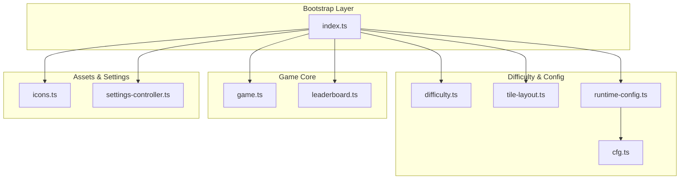
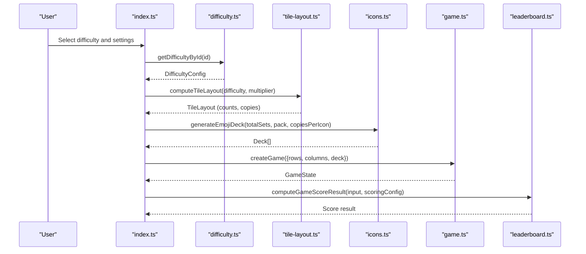
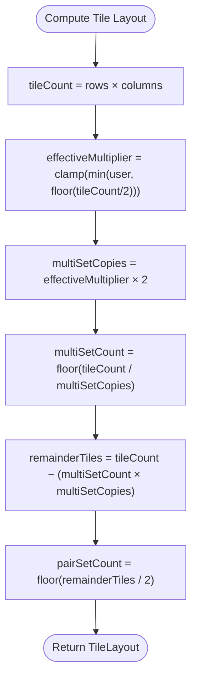
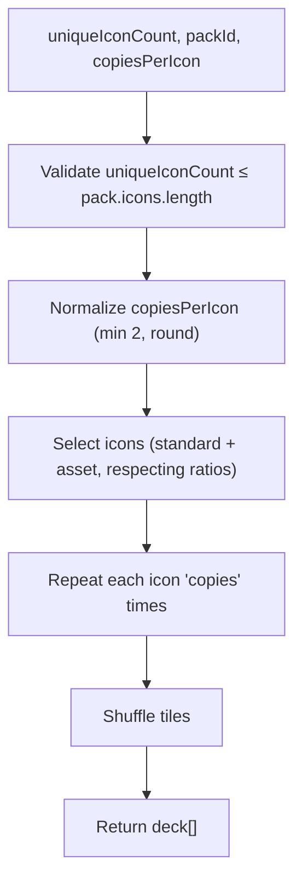
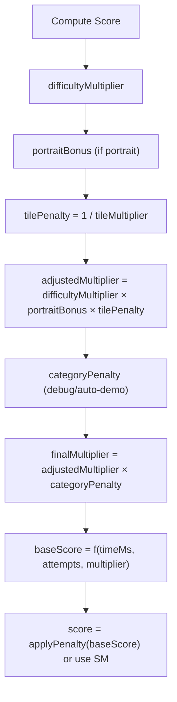
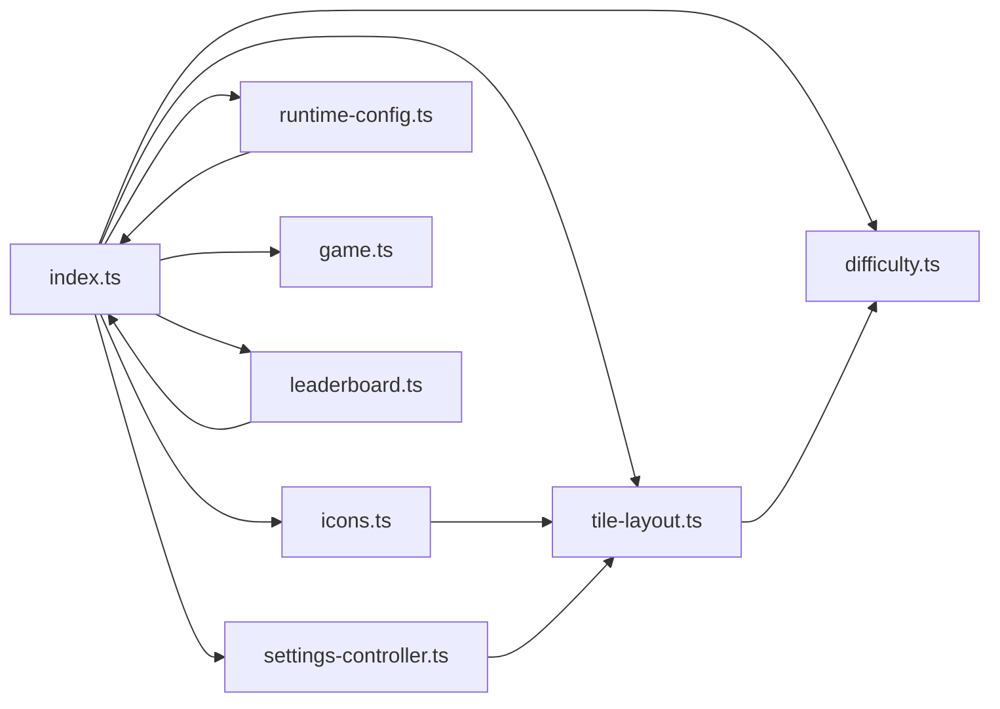

# Difficulty and Configuration System

<cite>
**Referenced Files in This Document**
- [difficulty.ts](file://src/difficulty.ts)
- [index.ts](file://src/index.ts)
- [tile-layout.ts](file://src/tile-layout.ts)
- [icons.ts](file://src/icons.ts)
- [leaderboard.ts](file://src/leaderboard.ts)
- [settings-controller.ts](file://src/settings-controller.ts)
- [runtime-config.ts](file://src/runtime-config.ts)
- [cfg.ts](file://src/cfg.ts)
- [game.ts](file://src/game.ts)
- [difficulty.test.ts](file://tests/difficulty.test.ts)
</cite>

## Table of Contents
1. [Introduction](#introduction)
2. [Project Structure](#project-structure)
3. [Core Components](#core-components)
4. [Architecture Overview](#architecture-overview)
5. [Detailed Component Analysis](#detailed-component-analysis)
6. [Dependency Analysis](#dependency-analysis)
7. [Performance Considerations](#performance-considerations)
8. [Troubleshooting Guide](#troubleshooting-guide)
9. [Conclusion](#conclusion)

## Introduction
This document explains the difficulty and configuration system that governs game parameters and level settings in the application. It covers difficulty level definitions (Easy, Normal, Hard), the tile multiplier system for increased challenge, board size variations, deck composition strategies, configuration validation, parameter constraints, and how difficulty settings affect game balance. It also includes examples of difficulty initialization, parameter calculation, and adaptive gameplay adjustments based on skill level.

## Project Structure
The difficulty and configuration system spans several modules:
- Difficulty presets and lookup utilities
- Tile layout computation for multipliers and set distributions
- Deck generation with icon packs and multi-copy strategies
- Scoring and leaderboard integration with difficulty multipliers
- Settings controller for user-selected tile multiplier and animation speed
- Runtime configuration loading for UI and gameplay parameters
- Game state validation and constraints

**Diagram sources**
- [index.ts](file://src/index.ts)
- [difficulty.ts](file://src/difficulty.ts)
- [tile-layout.ts](file://src/tile-layout.ts)
- [icons.ts](file://src/icons.ts)
- [settings-controller.ts](file://src/settings-controller.ts)
- [runtime-config.ts](file://src/runtime-config.ts)
- [cfg.ts](file://src/cfg.ts)
- [game.ts](file://src/game.ts)
- [leaderboard.ts](file://src/leaderboard.ts)

**Section sources**
- [index.ts](file://src/index.ts)
- [difficulty.ts](file://src/difficulty.ts)
- [tile-layout.ts](file://src/tile-layout.ts)
- [icons.ts](file://src/icons.ts)
- [settings-controller.ts](file://src/settings-controller.ts)
- [runtime-config.ts](file://src/runtime-config.ts)
- [cfg.ts](file://src/cfg.ts)
- [game.ts](file://src/game.ts)
- [leaderboard.ts](file://src/leaderboard.ts)

## Core Components
- Difficulty presets define board dimensions and score multipliers for Easy, Normal, and Hard.
- Tile layout computes how many sets and copies to generate based on difficulty and user-selected multiplier.
- Deck generation selects icons from packs and duplicates them per set to meet board requirements.
- Scoring integrates difficulty multipliers, tile multiplier penalties, portrait mode bonuses, and debug penalties.
- Settings controller stores and validates user preferences for tile multiplier and animation speed.
- Runtime configuration loads UI and gameplay parameters from config files with strict validation.

**Section sources**
- [difficulty.ts](file://src/difficulty.ts)
- [tile-layout.ts](file://src/tile-layout.ts)
- [icons.ts](file://src/icons.ts)
- [leaderboard.ts](file://src/leaderboard.ts)
- [settings-controller.ts](file://src/settings-controller.ts)
- [runtime-config.ts](file://src/runtime-config.ts)
- [cfg.ts](file://src/cfg.ts)

## Architecture Overview
The difficulty and configuration system orchestrates how players’ choices influence game parameters and scoring. The bootstrap layer initializes difficulty presets, computes tile layout, generates decks, and wires UI and scoring.

**Diagram sources**
- [index.ts](file://src/index.ts)
- [difficulty.ts](file://src/difficulty.ts)
- [tile-layout.ts](file://src/tile-layout.ts)
- [icons.ts](file://src/icons.ts)
- [game.ts](file://src/game.ts)
- [leaderboard.ts](file://src/leaderboard.ts)

## Detailed Component Analysis

### Difficulty Level Definitions
- Easy: 5 rows × 6 columns, score multiplier 1.2
- Normal: 5 rows × 8 columns, score multiplier 1.8 (default)
- Hard: 5 rows × 10 columns, score multiplier 2.4
- Default difficulty ID is Normal
- Debug tiles preset is available for development with minimal board and zero score multiplier

Validation ensures:
- All parameters are positive
- Multipliers increase monotonically across difficulty tiers
- Arrays are frozen to prevent mutation

**Section sources**
- [difficulty.ts](file://src/difficulty.ts)
- [difficulty.test.ts](file://tests/difficulty.test.ts)

### Tile Multiplier System and Board Size Variations
- Tile multiplier clamps to integers in [1, 3]
- Effective multiplier is computed based on available tile count and user preference
- For a given difficulty, tile count = rows × columns
- Effective multiplier = min(user multiplier, floor(tileCount / 2))
- multiSetCopies = effectiveMultiplier × 2
- multiSetCount = floor(tileCount / multiSetCopies)
- pairSetCount = floor(remainderTiles / 2), where remainderTiles = tileCount − (multiSetCount × multiSetCopies)
- Board sizes are fixed by difficulty presets; orientation mode may adjust layout but not dimensions

**Diagram sources**
- [tile-layout.ts](file://src/tile-layout.ts)

**Section sources**
- [tile-layout.ts](file://src/tile-layout.ts)
- [index.ts](file://src/index.ts)

### Deck Composition Strategies
- Icon packs provide at least 50 unique icons per pack
- Deck generation selects unique icons and duplicates them according to copiesPerIcon
- Mixed decks allow some icons to have 2 copies (pairs) and others to have more copies (multi-set)
- Asset tokens are balanced with standard icons respecting a minimum ratio
- Deck size must match rows × columns; odd matchable counts are rejected

**Diagram sources**
- [icons.ts](file://src/icons.ts)

**Section sources**
- [icons.ts](file://src/icons.ts)
- [game.ts](file://src/game.ts)

### Configuration Validation and Parameter Constraints
- Runtime configuration loading parses and validates numeric ranges and booleans
- Window resize limits enforce min/max scale ordering
- Animation speed limits enforce min/max ordering and clamp default speed
- UI opacity values are clamped to [0, 1]
- Leaderboard scoring configuration enforces factor ranges [0, 1] and positive scales
- Config parsing isolates network vs. parsing errors

**Section sources**
- [runtime-config.ts](file://src/runtime-config.ts)
- [cfg.ts](file://src/cfg.ts)

### Scoring Integration and Game Balance
- Difficulty score multipliers are applied to base score calculations
- Portrait mode bonus increases score multiplier
- Tile multiplier penalty reduces score multiplier by 1/tileMultiplier
- Debug modes and auto-demo scores apply additional penalties
- Flip tiles mode sets score to zero
- Attempts contribute linear penalties to score duration

**Diagram sources**
- [leaderboard.ts](file://src/leaderboard.ts)

**Section sources**
- [leaderboard.ts](file://src/leaderboard.ts)

### Adaptive Gameplay Adjustments Based on Skill Level
- Higher difficulty increases board size and score multiplier
- Tile multiplier increases challenge by adding more copies per icon group
- Portrait mode adds a bonus to encourage device orientation adaptation
- Settings controller persists user preferences and clamps values to safe ranges
- Runtime configuration enables tuning of UI timing, animations, and visual effects

**Section sources**
- [index.ts](file://src/index.ts)
- [settings-controller.ts](file://src/settings-controller.ts)
- [runtime-config.ts](file://src/runtime-config.ts)

## Dependency Analysis
The system exhibits clear separation of concerns:
- Bootstrap layer depends on difficulty, tile layout, icons, settings, runtime config, game, and leaderboard
- Tile layout depends on difficulty and settings controller’s multiplier
- Deck generation depends on icon packs and tile layout
- Scoring depends on difficulty, settings, runtime config, and game state

**Diagram sources**
- [index.ts](file://src/index.ts)
- [difficulty.ts](file://src/difficulty.ts)
- [tile-layout.ts](file://src/tile-layout.ts)
- [icons.ts](file://src/icons.ts)
- [settings-controller.ts](file://src/settings-controller.ts)
- [runtime-config.ts](file://src/runtime-config.ts)
- [game.ts](file://src/game.ts)
- [leaderboard.ts](file://src/leaderboard.ts)

**Section sources**
- [index.ts](file://src/index.ts)
- [difficulty.ts](file://src/difficulty.ts)
- [tile-layout.ts](file://src/tile-layout.ts)
- [icons.ts](file://src/icons.ts)
- [settings-controller.ts](file://src/settings-controller.ts)
- [runtime-config.ts](file://src/runtime-config.ts)
- [game.ts](file://src/game.ts)
- [leaderboard.ts](file://src/leaderboard.ts)

## Performance Considerations
- Frozen difficulty arrays prevent accidental mutations and improve predictability
- Clamping multipliers and parameters avoids excessive computation or UI overflow
- Deck generation shuffles once per session and uses efficient map/reduce patterns
- Game state caches remaining pair count for O(1) win condition checks
- Runtime config parsing separates network and parsing errors to minimize retries

[No sources needed since this section provides general guidance]

## Troubleshooting Guide
Common issues and resolutions:
- Deck size mismatch: Ensure deck length equals rows × columns; the game rejects mismatched sizes
- Odd matchable tile count: Deck must yield an even number of non-blocked tiles
- Insufficient icons in pack: Each pack must provide at least 50 unique icons
- Invalid config values: Runtime config enforces ranges and swaps invalid min/max pairs
- Debug tiles mode: Zero score multiplier applies; flip tiles mode sets score to zero

**Section sources**
- [game.ts](file://src/game.ts)
- [icons.ts](file://src/icons.ts)
- [runtime-config.ts](file://src/runtime-config.ts)
- [leaderboard.ts](file://src/leaderboard.ts)

## Conclusion
The difficulty and configuration system balances challenge and fairness by combining fixed difficulty presets, adjustable tile multipliers, and robust scoring penalties. Users can tailor the experience through settings, while runtime configuration and validation ensure consistent behavior across environments. The modular design keeps complexity manageable and enables future enhancements without disrupting core mechanics.