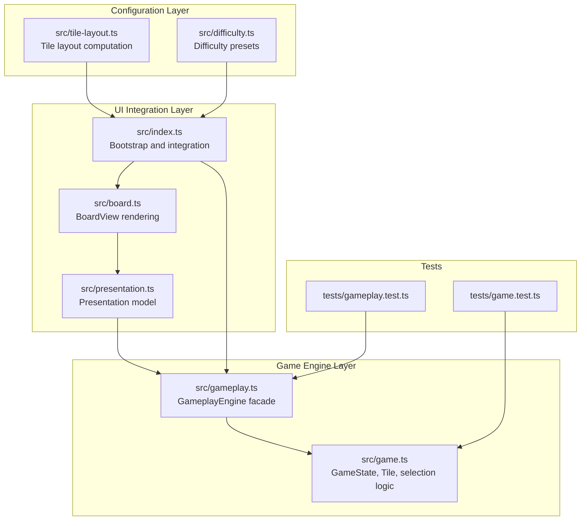
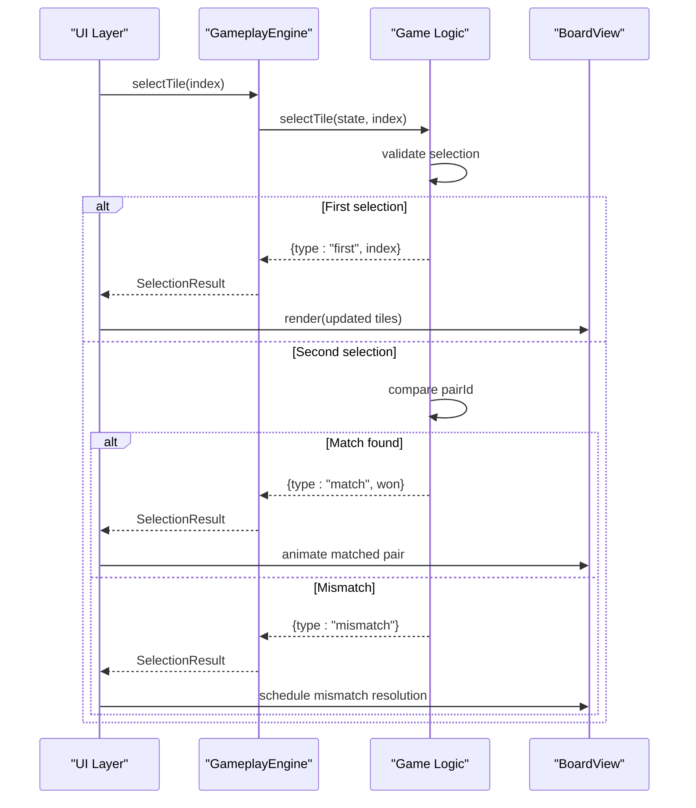
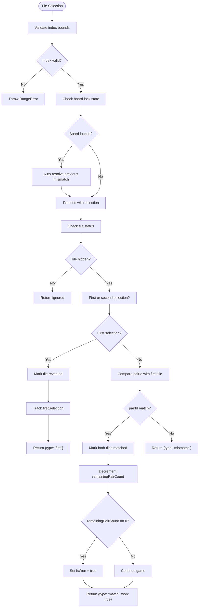
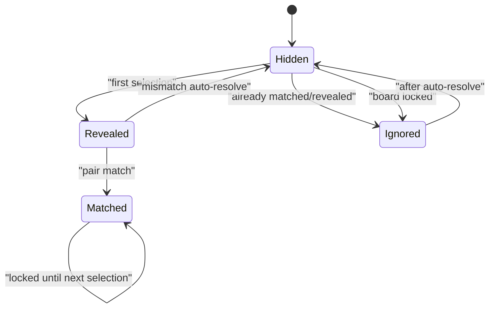
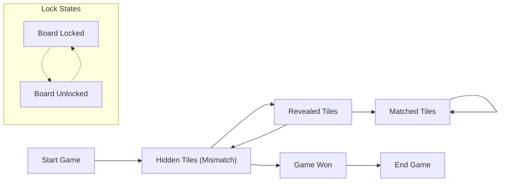
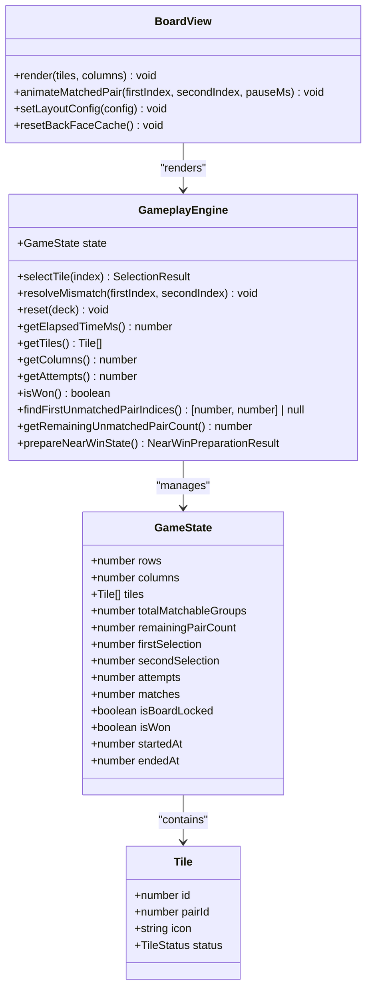

# Game Logic Implementation

<cite>
**Referenced Files in This Document**
- [game.ts](file://src/game.ts)
- [gameplay.ts](file://src/gameplay.ts)
- [board.ts](file://src/board.ts)
- [tile-layout.ts](file://src/tile-layout.ts)
- [index.ts](file://src/index.ts)
- [presentation.ts](file://src/presentation.ts)
- [game.test.ts](file://tests/game.test.ts)
- [gameplay.test.ts](file://tests/gameplay.test.ts)
- [difficulty.ts](file://src/difficulty.ts)
</cite>

## Table of Contents
1. [Introduction](#introduction)
2. [Project Structure](#project-structure)
3. [Core Components](#core-components)
4. [Architecture Overview](#architecture-overview)
5. [Detailed Component Analysis](#detailed-component-analysis)
6. [Dependency Analysis](#dependency-analysis)
7. [Performance Considerations](#performance-considerations)
8. [Troubleshooting Guide](#troubleshooting-guide)
9. [Conclusion](#conclusion)

## Introduction
This document provides comprehensive technical documentation for the game logic implementation in the memory card matching game. It focuses on the core game engine mechanics, specifically the GameState interface and Tile structure, the tile matching algorithm, selection flow, state transitions, win condition detection, and error handling patterns. The content is designed to be accessible to developers with varying levels of familiarity with the codebase while maintaining precision for advanced users.

## Project Structure
The game logic is implemented primarily in the src/game.ts module, with supporting modules for UI integration, difficulty configuration, and presentation. The key files and their roles are:

- src/game.ts: Core game engine with GameState interface, Tile structure, selection logic, and state management
- src/gameplay.ts: Facade interface (GameplayEngine) that wraps game state operations
- src/board.ts: UI rendering layer for tiles and board layout
- src/tile-layout.ts: Tile distribution and multiplier computation logic
- src/index.ts: Application bootstrap and integration between UI and game logic
- src/presentation.ts: Transformation of game state to UI presentation model
- tests/game.test.ts and tests/gameplay.test.ts: Unit tests validating game logic behavior

**Diagram sources**
- [game.ts:12-42](file://src/game.ts#L12-L42)
- [gameplay.ts:28-41](file://src/gameplay.ts#L28-L41)
- [board.ts:121-523](file://src/board.ts#L121-L523)
- [presentation.ts:12-24](file://src/presentation.ts#L12-L24)
- [index.ts:815-816](file://src/index.ts#L815-L816)
- [tile-layout.ts:36-53](file://src/tile-layout.ts#L36-L53)
- [difficulty.ts:9-40](file://src/difficulty.ts#L9-L40)

**Section sources**
- [game.ts:12-42](file://src/game.ts#L12-L42)
- [gameplay.ts:28-41](file://src/gameplay.ts#L28-L41)
- [board.ts:121-523](file://src/board.ts#L121-L523)
- [presentation.ts:12-24](file://src/presentation.ts#L12-L24)
- [index.ts:815-816](file://src/index.ts#L815-L816)
- [tile-layout.ts:36-53](file://src/tile-layout.ts#L36-L53)
- [difficulty.ts:9-40](file://src/difficulty.ts#L9-L40)

## Core Components
This section documents the fundamental data structures and their properties and behaviors.

### GameState Interface
The GameState interface defines the complete state of a game session, including board dimensions, tile collection, and game metadata.

Key properties:
- rows: Number of board rows
- columns: Number of board columns  
- tiles: Array of Tile objects representing the board state
- totalMatchableGroups: Count of distinct icon groups (not total pairs)
- remainingPairCount: Cached count of remaining matchable pairs (O(1) win-check)
- firstSelection: Index of first selected tile or null
- secondSelection: Index of second selected tile or null
- attempts: Total number of selection attempts
- matches: Number of matched pairs
- isBoardLocked: Whether the board is temporarily locked during mismatch resolution
- isWon: Whether the game has been won
- startedAt: Timestamp when the first tile was selected
- endedAt: Timestamp when the game ended

Behavior characteristics:
- Immutable after creation except for in-place mutations during selection
- Maintains invariants through validation and error handling
- Supports efficient win condition checking via cached pair count

**Section sources**
- [game.ts:12-42](file://src/game.ts#L12-L42)

### Tile Structure
The Tile interface represents individual board tiles with the following properties:

Properties:
- id: Unique identifier within the tiles array
- pairId: Identifier linking equivalent tiles (matching pairs)
- icon: Unicode character or emoji token
- status: Current tile state (hidden, revealed, matched, blocked)

Status management:
- hidden: Tile is face-down, not yet selected
- revealed: Tile is face-up, currently participating in a selection attempt
- matched: Tile is successfully paired and remains face-up
- blocked: Tile is disabled and cannot be selected

Additional constants:
- BLOCKED_TILE_TOKEN: Special token identifying blocked tiles

**Section sources**
- [game.ts:1-10](file://src/game.ts#L1-L10)
- [game.ts:3](file://src/game.ts#L3)

### SelectionResult Type
Defines the outcome of tile selection operations:

Types:
- ignored: Selection had no effect (locked board, already revealed/matched, or game won)
- first: First tile in a pair attempt
- match: Matching pair found, includes won flag
- mismatch: Non-matching pair selected

**Section sources**
- [game.ts:44-48](file://src/game.ts#L44-L48)

## Architecture Overview
The game follows a layered architecture with clear separation between game logic, UI integration, and presentation concerns.

**Diagram sources**
- [index.ts:639-779](file://src/index.ts#L639-L779)
- [gameplay.ts:50-52](file://src/gameplay.ts#L50-L52)
- [game.ts:159-243](file://src/game.ts#L159-L243)
- [board.ts:227-306](file://src/board.ts#L227-L306)

The architecture ensures:
- Clean separation between game logic and UI rendering
- Single source of truth for game state
- Event-driven integration between components
- Extensible design for future enhancements

## Detailed Component Analysis

### Tile Matching Algorithm
The tile matching algorithm implements the core memory card game mechanics with robust state management and validation.

#### Pair Validation Process
The algorithm validates potential matches through pairId comparison:

**Diagram sources**
- [game.ts:159-243](file://src/game.ts#L159-L243)
- [game.ts:245-264](file://src/game.ts#L245-L264)

#### Status Management States
The algorithm manages four distinct tile states with specific behaviors:

**Diagram sources**
- [game.ts:12](file://src/game.ts#L12)
- [game.ts:159-243](file://src/game.ts#L159-L243)

#### Auto-Resolve Functionality
The auto-resolve mechanism handles overlapping selections when users click before mismatch animations complete:

Key behaviors:
- Detects locked board state with both selections set
- Automatically hides previously revealed tiles
- Resets selection tracking and board lock
- Ensures smooth user experience without state corruption

**Section sources**
- [game.ts:140-177](file://src/game.ts#L140-L177)
- [game.ts:245-264](file://src/game.ts#L245-L264)

### Selection Flow Processing
The selection flow encompasses the complete lifecycle from user interaction to state updates and UI feedback.

#### Initial Click Processing
When a user selects a tile, the system performs validation and state updates:

1. **Index Validation**: Ensures the selected index is within bounds
2. **Board Lock Check**: Handles auto-resolution if needed
3. **Status Verification**: Prevents selections on already matched tiles
4. **First Selection Tracking**: Records the first tile in a pair attempt

#### Match/Mismatch Resolution
The resolution process handles both successful and unsuccessful pair attempts:

**Match Resolution**:
- Marks both tiles as matched
- Increments match counter
- Decrements remaining pair count
- Checks win condition
- Updates timestamps

**Mismatch Resolution**:
- Schedules automatic tile hiding
- Prepares board for next selection
- Provides user feedback

#### Selection Result Handling
The system returns structured results to inform UI behavior:

- **ignored**: No action taken (prevent spam clicking)
- **first**: First tile revealed, awaiting second selection
- **match**: Successful pair with win status
- **mismatch**: Unsuccessful pair with auto-resolve scheduling

**Section sources**
- [game.ts:159-243](file://src/game.ts#L159-L243)
- [index.ts:639-779](file://src/index.ts#L639-L779)

### Game State Transitions
The game maintains strict state transitions to ensure logical consistency and prevent invalid operations.

#### Transition Matrix

#### Win Condition Detection
The win condition uses a cached pair count for O(1) performance:

- **Initialization**: Remaining pair count computed from tile distribution
- **During Play**: Count decremented on each successful match
- **Detection**: Game won when remaining pair count reaches zero
- **Validation**: Prevents duplicate matches through state corruption checks

**Section sources**
- [game.ts:25-32](file://src/game.ts#L25-L32)
- [game.ts:208-228](file://src/game.ts#L208-L228)
- [game.ts:324-332](file://src/game.ts#L324-L332)

### Error Handling and State Corruption Prevention
The system implements comprehensive error handling to maintain state integrity:

#### Validation Mechanisms
- **Index Bounds Checking**: Prevents out-of-range selections
- **Missing Tile Detection**: Validates tile existence in array
- **State Corruption Checks**: Detects impossible game states
- **Deck Size Validation**: Ensures proper board configuration

#### Error Scenarios
Common error conditions and their handling:

1. **Invalid Index**: Throws RangeError with descriptive message
2. **Corrupted State**: Detects duplicate matches and throws error
3. **Deck Mismatch**: Validates deck size equals board area
4. **Odd Tile Count**: Ensures even number of matchable tiles

**Section sources**
- [game.ts:160-170](file://src/game.ts#L160-L170)
- [game.ts:213-217](file://src/game.ts#L213-L217)
- [game.ts:64-66](file://src/game.ts#L64-L66)
- [game.ts:99-101](file://src/game.ts#L99-L101)

## Dependency Analysis
The game logic exhibits clean dependency relationships with minimal coupling between modules.

**Diagram sources**
- [game.ts:12-42](file://src/game.ts#L12-L42)
- [game.ts:55-59](file://src/game.ts#L55-L59)
- [gameplay.ts:28-41](file://src/gameplay.ts#L28-L41)
- [board.ts:121-523](file://src/board.ts#L121-L523)

### Integration Points
The primary integration points between components:

1. **Bootstrap Integration** (index.ts): Creates GameplayEngine instances and wires UI events
2. **Presentation Layer** (presentation.ts): Transforms game state to UI-ready data
3. **Board Rendering** (board.ts): Consumes presentation model for visual updates
4. **Configuration Layer** (difficulty.ts, tile-layout.ts): Provides game setup parameters

**Section sources**
- [index.ts:600-622](file://src/index.ts#L600-L622)
- [presentation.ts:12-24](file://src/presentation.ts#L12-L24)
- [board.ts:227-306](file://src/board.ts#L227-L306)
- [difficulty.ts:9-40](file://src/difficulty.ts#L9-L40)
- [tile-layout.ts:36-53](file://src/tile-layout.ts#L36-L53)

## Performance Considerations
The game implementation prioritizes performance through several optimization strategies:

### O(1) Win Condition Checking
The remainingPairCount field enables constant-time win detection by decrementing on each successful match rather than scanning the entire board.

### Lazy Tile Back-Face Rendering
The BoardView caches rendered back-face elements to avoid repeated DOM operations and image fetches for tiles that remain hidden.

### Efficient State Updates
In-place mutations minimize garbage collection pressure and maintain responsive UI interactions.

### Memory Layout Optimization
Consecutive tile arrays enable efficient iteration and reduce memory fragmentation.

## Troubleshooting Guide

### Common Issues and Solutions

#### Game Not Responding to Selections
**Symptoms**: Tiles don't flip when clicked
**Causes**: 
- Board locked state due to auto-resolve
- Game already won
- Invalid tile index

**Solutions**:
- Wait for auto-resolve to complete
- Check if game has reached win state
- Verify tile index validity

#### Tiles Disappearing Unexpectedly
**Symptoms**: Previously revealed tiles become hidden
**Causes**: 
- Mismatch auto-resolve timing
- Manual resolveMismatch() calls
- Game reset operations

**Solutions**:
- Allow mismatch resolution delay to complete
- Avoid manual state manipulation
- Use provided reset methods

#### Win Condition Not Detected
**Symptoms**: Game continues despite all pairs matched
**Causes**:
- State corruption
- Incorrect remainingPairCount calculation
- Duplicate match operations

**Solutions**:
- Check for state corruption errors
- Verify remainingPairCount consistency
- Review match logic implementation

### Debugging Patterns
Recommended approaches for diagnosing game logic issues:

1. **State Inspection**: Log GameState properties before and after operations
2. **Boundary Testing**: Validate edge cases for tile indices and board sizes
3. **Sequence Testing**: Trace selection flow through the algorithm
4. **Integration Testing**: Verify UI-to-logic synchronization

**Section sources**
- [game.test.ts:122-133](file://tests/game.test.ts#L122-L133)
- [game.test.ts:178-219](file://tests/game.test.ts#L178-L219)
- [gameplay.test.ts:42-63](file://tests/gameplay.test.ts#L42-L63)

## Conclusion
The game logic implementation demonstrates robust engineering practices with clear separation of concerns, comprehensive error handling, and performance optimizations. The GameState interface and Tile structure provide a solid foundation for memory card matching mechanics, while the selection algorithm ensures smooth user experience through auto-resolve functionality and state validation. The layered architecture facilitates maintainability and extensibility, making it straightforward to add new features or modify existing behavior while preserving game integrity.

The implementation successfully balances simplicity with functionality, providing a reliable foundation for the complete game experience. The extensive test coverage validates core assumptions and edge cases, ensuring predictable behavior across various scenarios and configurations.