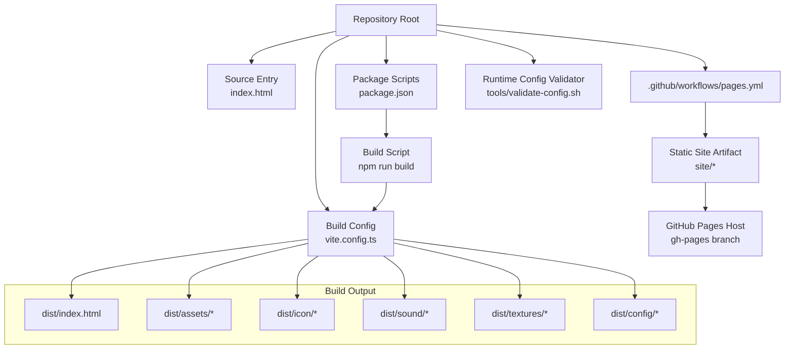
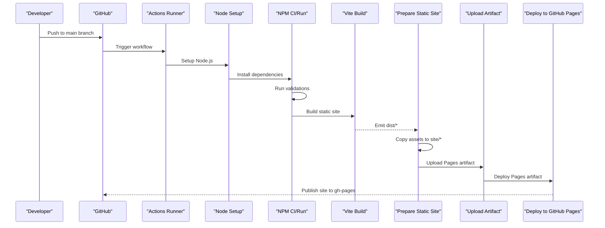
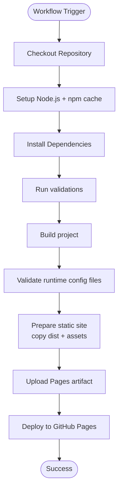
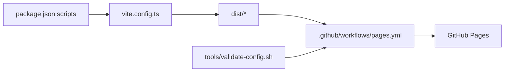

# Deployment and Production

<cite>
**Referenced Files in This Document**
- [package.json](file://package.json)
- [vite.config.ts](file://vite.config.ts)
- [.github/workflows/pages.yml](file://.github/workflows/pages.yml)
- [index.html](file://index.html)
- [dist/index.html](file://dist/index.html)
- [tools/validate-config.sh](file://tools/validate-config.sh)
- [.http-serverignore](file://.http-serverignore)
- [README.md](file://README.md)
- [tests/pages-workflow.test.ts](file://tests/pages-workflow.test.ts)
</cite>

## Table of Contents
1. [Introduction](#introduction)
2. [Project Structure](#project-structure)
3. [Core Components](#core-components)
4. [Architecture Overview](#architecture-overview)
5. [Detailed Component Analysis](#detailed-component-analysis)
6. [Dependency Analysis](#dependency-analysis)
7. [Performance Considerations](#performance-considerations)
8. [Troubleshooting Guide](#troubleshooting-guide)
9. [Conclusion](#conclusion)
10. [Appendices](#appendices)

## Introduction
This document provides production-focused guidance for deploying and operating the project on GitHub Pages. It explains the automated GitHub Actions workflow, build configuration, asset bundling, and production hosting considerations. It also covers differences between development and production builds, performance and security optimizations, static site generation, caching strategies, custom domain configuration, deployment health monitoring, bundle analysis, and troubleshooting common issues.

## Project Structure
The repository is a static single-page application built with TypeScript and Vite. The production build emits a static site under the configured base path, and GitHub Pages hosts it from a dedicated subpath. Assets include icons, sounds, textures, and configuration files that are packaged into the static site artifact.

**Diagram sources**
- [vite.config.ts:65-70](file://vite.config.ts#L65-L70)
- [.github/workflows/pages.yml:42-55](file://.github/workflows/pages.yml#L42-L55)
- [package.json:1-1](file://package.json#L1-L1)

**Section sources**
- [README.md:45-46](file://README.md#L45-L46)
- [vite.config.ts:65-70](file://vite.config.ts#L65-L70)
- [.github/workflows/pages.yml:42-55](file://.github/workflows/pages.yml#L42-L55)

## Core Components
- Static site generator and bundler: Vite produces a fully static site with hashed assets and a configured base path.
- GitHub Actions pipeline: Automates checkout, setup, validation, build, packaging, and deployment to GitHub Pages.
- Asset packaging: Icons, sounds, textures, and configuration are copied into the static site artifact for hosting.
- Runtime configuration validation: Ensures required keys and syntax are present before publishing.
- Development vs production: Development scripts and servers must not be used as production hosting.

Key production build and hosting characteristics:
- Base path: The application is hosted under a subpath to avoid conflicts with the user’s GitHub Pages domain.
- Asset hashing: JavaScript and CSS filenames include hashes for long-term caching.
- Source maps: Enabled in the build configuration for diagnostics while keeping production bundles optimized.

**Section sources**
- [vite.config.ts:65-70](file://vite.config.ts#L65-L70)
- [.github/workflows/pages.yml:42-55](file://.github/workflows/pages.yml#L42-L55)
- [tools/validate-config.sh:16-21](file://tools/validate-config.sh#L16-L21)
- [README.md:75-88](file://README.md#L75-L88)

## Architecture Overview
The production deployment pipeline transforms the source into a static site and publishes it to GitHub Pages. The workflow validates configuration, builds the site, packages assets, and deploys to the Pages artifact.

**Diagram sources**
- [.github/workflows/pages.yml:17-66](file://.github/workflows/pages.yml#L17-L66)
- [package.json:1-1](file://package.json#L1-L1)
- [tools/validate-config.sh:1-129](file://tools/validate-config.sh#L1-L129)

## Detailed Component Analysis

### GitHub Actions Workflow for Automated Deployment
The workflow orchestrates:
- Checkout repository
- Setup Node.js with npm caching
- Install dependencies
- Run validation tasks
- Build the project
- Validate runtime configuration files
- Prepare the static site artifact by copying dist and assets
- Upload the artifact for deployment
- Deploy to GitHub Pages

**Diagram sources**
- [.github/workflows/pages.yml:17-66](file://.github/workflows/pages.yml#L17-L66)

**Section sources**
- [.github/workflows/pages.yml:1-66](file://.github/workflows/pages.yml#L1-L66)
- [tests/pages-workflow.test.ts:6-12](file://tests/pages-workflow.test.ts#L6-L12)

### Build Configuration and Asset Bundling
Production build specifics:
- Base path: The application is served from a subpath to prevent conflicts with the root domain.
- Output directory: Emits to a dedicated directory for packaging.
- Source maps: Enabled for diagnostics.
- Icon assets plugin: Copies icon assets into the dist folder during the build lifecycle.
- Server middleware: Provides a development-time route for serving icons locally; does not affect production.

Asset packaging for production:
- The workflow copies dist/index.html and dist/assets/* into the Pages artifact.
- Additional directories (config, textures, icon, sound) are included to support runtime resources.

**Section sources**
- [vite.config.ts:65-70](file://vite.config.ts#L65-L70)
- [vite.config.ts:41-61](file://vite.config.ts#L41-L61)
- [.github/workflows/pages.yml:42-55](file://.github/workflows/pages.yml#L42-L55)

### Static Site Generation and Hosting
Static site generation:
- The build emits a self-contained index.html with hashed script and stylesheet links.
- Assets are emitted under a hashed path to enable long-lived caching.

Hosting considerations:
- The site is published under a subpath to avoid conflicts with the user’s GitHub Pages domain.
- The Pages artifact includes all necessary assets and configuration files.

**Section sources**
- [dist/index.html:11-12](file://dist/index.html#L11-L12)
- [.github/workflows/pages.yml:42-55](file://.github/workflows/pages.yml#L42-L55)
- [README.md:45](file://README.md#L45)

### Runtime Configuration Validation
The validator ensures:
- Required files exist
- Line syntax conforms to key=value
- Required keys are present per file
- Deprecated keys are absent

This prevents misconfiguration from reaching production.

**Section sources**
- [tools/validate-config.sh:16-21](file://tools/validate-config.sh#L16-L21)
- [tools/validate-config.sh:47-52](file://tools/validate-config.sh#L47-L52)
- [tools/validate-config.sh:72-98](file://tools/validate-config.sh#L72-L98)
- [tools/validate-config.sh:105-120](file://tools/validate-config.sh#L105-L120)

### Development vs Production Builds
- Development commands are intended for local iteration and must not be used as a production hosting setup.
- Local development servers expose the repository root and may inadvertently serve sensitive files; a dedicated static server with appropriate restrictions is recommended for production.
- The http-serverignore file restricts exposure of SQLite database files during development.

**Section sources**
- [README.md:75-88](file://README.md#L75-L88)
- [.http-serverignore:1-4](file://.http-serverignore#L1-L4)

## Dependency Analysis
The deployment pipeline depends on:
- Node.js runtime and npm for building and validating
- Vite for bundling and emitting the static site
- GitHub Actions for automation and deployment
- Runtime configuration files for correctness

**Diagram sources**
- [package.json:1-1](file://package.json#L1-L1)
- [vite.config.ts:65-70](file://vite.config.ts#L65-L70)
- [.github/workflows/pages.yml:17-66](file://.github/workflows/pages.yml#L17-L66)
- [tools/validate-config.sh:1-129](file://tools/validate-config.sh#L1-L129)

**Section sources**
- [package.json:1-1](file://package.json#L1-L1)
- [.github/workflows/pages.yml:17-66](file://.github/workflows/pages.yml#L17-L66)

## Performance Considerations
- Long-term caching: Hashed asset filenames enable indefinite caching; ensure cache headers are respected by the hosting provider.
- Asset delivery: Serve assets from the configured base path to avoid unnecessary redirects.
- Bundle size: Monitor bundle sizes and analyze via Vite’s built-in reporting to keep load times low.
- Fonts and external resources: Preconnect to external font providers to improve render performance.
- Minimize third-party dependencies: Keep the dependency tree lean to reduce payload size.

[No sources needed since this section provides general guidance]

## Troubleshooting Guide
Common deployment issues and remedies:
- Missing required configuration files: The validator enforces presence of required files and keys. Fix any reported missing or deprecated keys.
- Incorrect base path: Ensure the base path matches the Pages subpath configuration.
- Asset not found errors: Verify that icon, sound, textures, and config directories are copied into the artifact.
- Development server exposure: Do not use development-only servers for production; use a proper static server with appropriate access controls.
- Health checks: Use the provided quality gates and tests to catch regressions before deployment.

**Section sources**
- [tools/validate-config.sh:16-21](file://tools/validate-config.sh#L16-L21)
- [tools/validate-config.sh:72-98](file://tools/validate-config.sh#L72-L98)
- [README.md:75-88](file://README.md#L75-L88)

## Conclusion
The project’s deployment to GitHub Pages is automated and robust. The workflow validates configuration, builds a static site with hashed assets, packages all necessary resources, and deploys to a subpath. Production readiness hinges on correct configuration validation, appropriate caching strategies, and avoiding the use of development-only servers for production hosting.

[No sources needed since this section summarizes without analyzing specific files]

## Appendices

### A. Production-Ready Build Process
- Run validations before building to catch configuration errors early.
- Build the project to emit a static site with hashed assets.
- Package the artifact by copying dist and resource directories.
- Deploy the artifact to GitHub Pages.

**Section sources**
- [.github/workflows/pages.yml:33-40](file://.github/workflows/pages.yml#L33-L40)
- [.github/workflows/pages.yml:36-37](file://.github/workflows/pages.yml#L36-L37)
- [.github/workflows/pages.yml:42-55](file://.github/workflows/pages.yml#L42-L55)

### B. Bundle Analysis
- Use Vite’s built-in reporting capabilities to inspect bundle composition and identify large dependencies.
- Focus on reducing third-party dependencies and splitting chunks where beneficial.

[No sources needed since this section provides general guidance]

### C. Security Considerations for Public Deployments
- Do not expose development-only servers to the public; they may serve sensitive files.
- Restrict access to sensitive directories and files using appropriate server configurations.
- Validate runtime configuration files to prevent misconfiguration leading to insecure defaults.

**Section sources**
- [README.md:86-93](file://README.md#L86-L93)
- [tools/validate-config.sh:16-21](file://tools/validate-config.sh#L16-L21)

### D. Maintenance Procedures for Production Environments
- Periodically review and update dependencies to address security vulnerabilities.
- Monitor deployment health using the provided quality gates and tests.
- Audit configuration files regularly to ensure compliance with required keys and absence of deprecated keys.

**Section sources**
- [README.md:123-142](file://README.md#L123-L142)
- [tools/validate-config.sh:105-120](file://tools/validate-config.sh#L105-L120)

### E. Practical Examples

#### Deploying to GitHub Pages
- Push to the main branch to trigger the workflow.
- The workflow installs dependencies, validates, builds, packages, and deploys to GitHub Pages.

**Section sources**
- [.github/workflows/pages.yml:3-6](file://.github/workflows/pages.yml#L3-L6)
- [.github/workflows/pages.yml:30-37](file://.github/workflows/pages.yml#L30-L37)
- [.github/workflows/pages.yml:52-66](file://.github/workflows/pages.yml#L52-L66)

#### Configuring a Custom Domain
- Configure a custom domain in GitHub Pages settings. The application’s base path ensures compatibility with subpath hosting.

**Section sources**
- [README.md:45](file://README.md#L45)

#### Monitoring Deployment Health
- Use the provided quality gates and tests to monitor health before and after deployments.

**Section sources**
- [README.md:123-142](file://README.md#L123-L142)