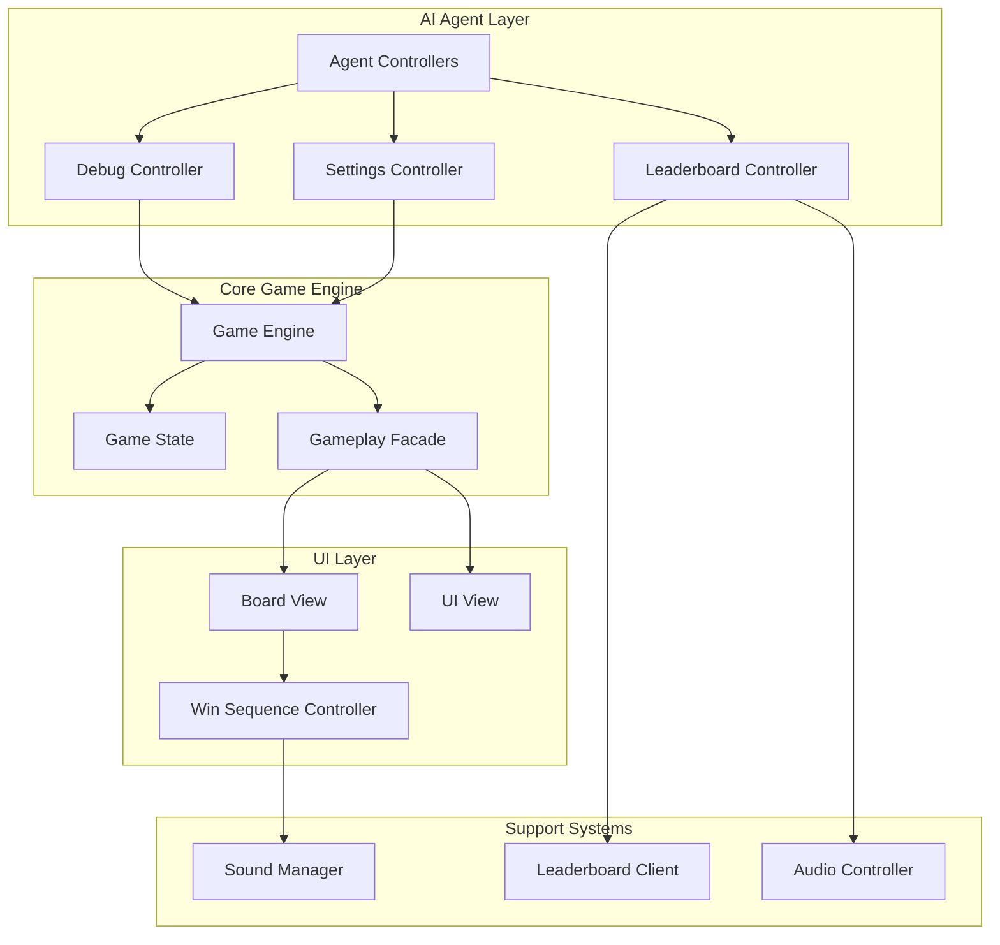
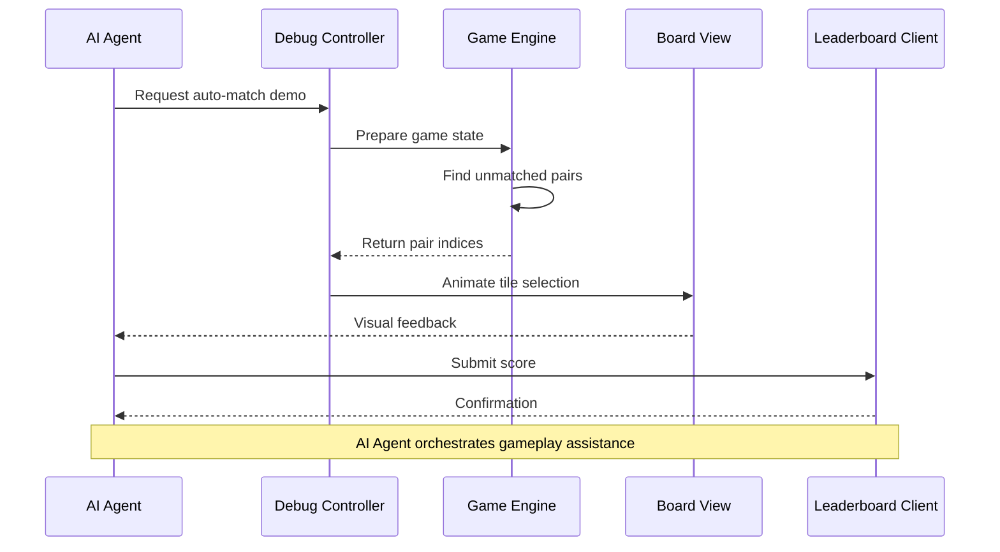
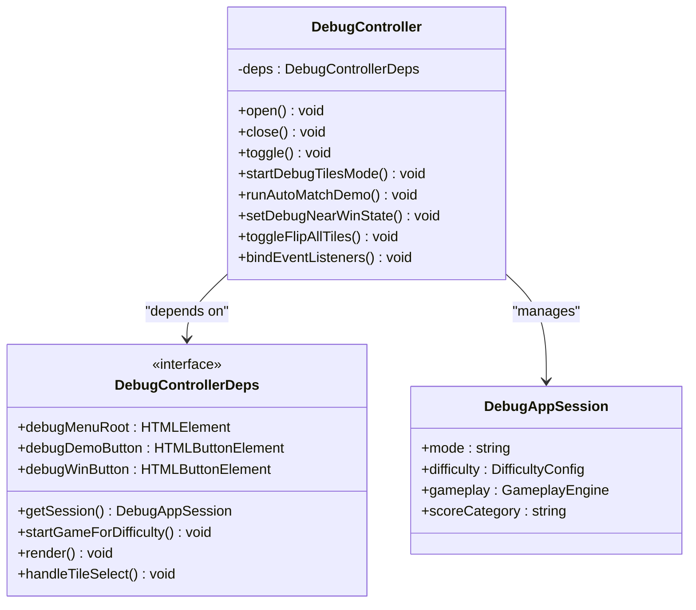
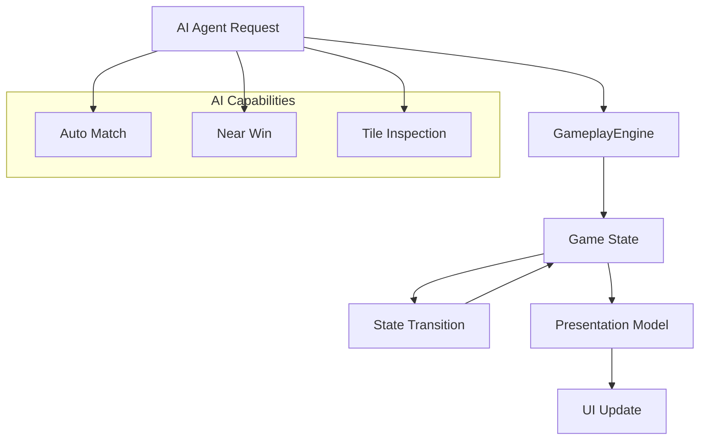
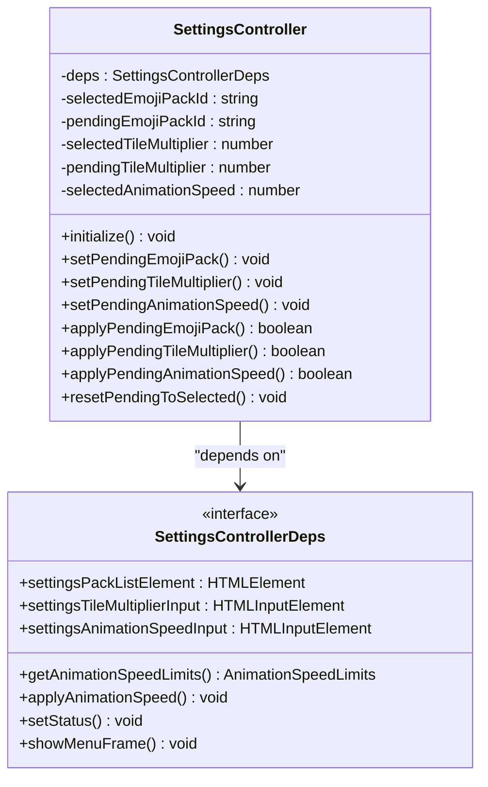
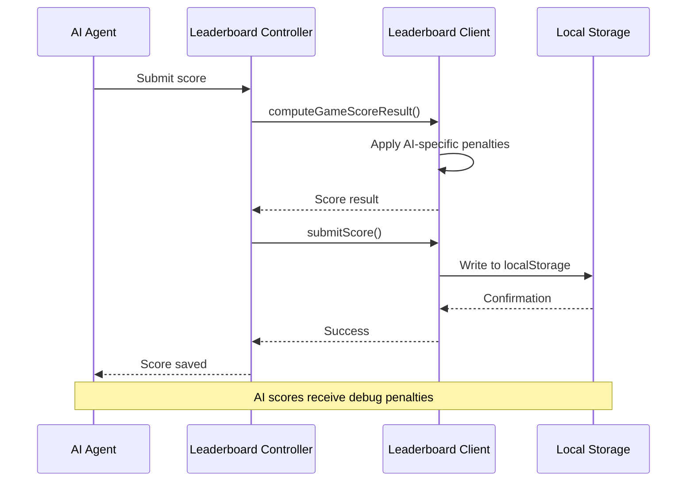
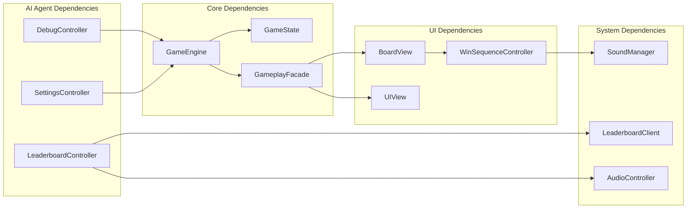

# AI Agents Documentation

<cite>
**Referenced Files in This Document**
- [AGENTS.md](file://AGENTS.md)
- [CLAUDE.md](file://CLAUDE.md)
- [README.md](file://README.md)
- [src/index.ts](file://src/index.ts)
- [src/game.ts](file://src/game.ts)
- [src/gameplay.ts](file://src/gameplay.ts)
- [src/board.ts](file://src/board.ts)
- [src/ui.ts](file://src/ui.ts)
- [src/settings-controller.ts](file://src/settings-controller.ts)
- [src/debug-controller.ts](file://src/debug-controller.ts)
- [src/leaderboard-ui.ts](file://src/leaderboard-ui.ts)
- [src/win-sequence-controller.ts](file://src/win-sequence-controller.ts)
- [src/audio-ui-controller.ts](file://src/audio-ui-controller.ts)
- [src/icons.ts](file://src/icons.ts)
- [src/tile-layout.ts](file://src/tile-layout.ts)
- [src/presentation.ts](file://src/presentation.ts)
- [src/session-score.ts](file://src/session-score.ts)
- [src/leaderboard.ts](file://src/leaderboard.ts)
</cite>

## Table of Contents
1. [Introduction](#introduction)
2. [Project Structure](#project-structure)
3. [Core Components](#core-components)
4. [Architecture Overview](#architecture-overview)
5. [Detailed Component Analysis](#detailed-component-analysis)
6. [Dependency Analysis](#dependency-analysis)
7. [Performance Considerations](#performance-considerations)
8. [Troubleshooting Guide](#troubleshooting-guide)
9. [Conclusion](#conclusion)

## Introduction

This document provides comprehensive documentation for the AI Agents implementation in the MEMORYBLOX project. MEMORYBLOX is a browser-based HTML/CSS/TypeScript remake of the classic Windows 9x game "Memory Blocks" with modern web technologies and AI agent capabilities.

The project follows strict architectural guidelines for AI agents, emphasizing clean separation of concerns, testability, and maintainability. The AI agents work seamlessly with the existing codebase through well-defined interfaces and controllers.

## Project Structure

The MEMORYBLOX project is organized around a clear MVC (Model-View-Controller) architecture with specialized controllers handling different aspects of the game:

**Diagram sources**
- [src/index.ts:107-125](file://src/index.ts#L107-L125)
- [src/game.ts:12-42](file://src/game.ts#L12-L42)
- [src/gameplay.ts:28-41](file://src/gameplay.ts#L28-L41)

**Section sources**
- [AGENTS.md:109-142](file://AGENTS.md#L109-L142)
- [README.md:162-206](file://README.md#L162-L206)

## Core Components

The AI Agents implementation consists of several specialized controllers that work together to provide intelligent gameplay assistance:

### Game State Management
The core game logic is encapsulated in the `Game` module with immutable state management and pure functions for state transitions.

### AI Agent Controllers
- **Debug Controller**: Provides AI-powered debugging tools including auto-match demos and tile inspection modes
- **Settings Controller**: Manages AI agent preferences and configurations
- **Leaderboard Controller**: Handles AI agent score tracking and persistence

### Presentation Layer
The presentation layer converts game state into UI-ready models for rendering, ensuring optimal performance and accessibility.

**Section sources**
- [src/game.ts:159-243](file://src/game.ts#L159-L243)
- [src/gameplay.ts:43-93](file://src/gameplay.ts#L43-L93)
- [src/presentation.ts:12-24](file://src/presentation.ts#L12-L24)

## Architecture Overview

The AI Agents architecture follows a layered approach with clear separation between AI logic and game mechanics:

**Diagram sources**
- [src/debug-controller.ts:238-263](file://src/debug-controller.ts#L238-L263)
- [src/game.ts:301-322](file://src/game.ts#L301-L322)
- [src/board.ts:331-354](file://src/board.ts#L331-L354)

The architecture ensures that AI agents can operate independently while maintaining full compatibility with the existing game mechanics and user interface.

**Section sources**
- [src/index.ts:639-779](file://src/index.ts#L639-L779)
- [src/debug-controller.ts:87-114](file://src/debug-controller.ts#L87-L114)

## Detailed Component Analysis

### Debug Controller Analysis

The Debug Controller serves as the primary AI agent interface, providing sophisticated debugging capabilities:

**Diagram sources**
- [src/debug-controller.ts:87-114](file://src/debug-controller.ts#L87-L114)
- [src/debug-controller.ts:17-59](file://src/debug-controller.ts#L17-L59)
- [src/debug-controller.ts:61-72](file://src/debug-controller.ts#L61-L72)

The Debug Controller implements a comprehensive AI assistance system that includes:

- **Auto-match demonstration**: Automated gameplay showing optimal moves
- **Near-win state preparation**: Debug mode for testing win conditions
- **Tile inspection**: Visual debugging of tile arrangements
- **Flip-all-tiles mode**: Debug feature for board analysis

**Section sources**
- [src/debug-controller.ts:118-144](file://src/debug-controller.ts#L118-L144)
- [src/debug-controller.ts:238-263](file://src/debug-controller.ts#L238-L263)
- [src/debug-controller.ts:277-298](file://src/debug-controller.ts#L277-L298)

### Game Engine Integration

The AI agents integrate deeply with the game engine through the GameplayEngine facade:

**Diagram sources**
- [src/gameplay.ts:28-41](file://src/gameplay.ts#L28-L41)
- [src/game.ts:159-243](file://src/game.ts#L159-L243)
- [src/presentation.ts:12-24](file://src/presentation.ts#L12-L24)

**Section sources**
- [src/gameplay.ts:101-107](file://src/gameplay.ts#L101-L107)
- [src/game.ts:334-419](file://src/game.ts#L334-L419)

### Settings Controller for AI Agents

The Settings Controller manages AI agent configurations and preferences:

**Diagram sources**
- [src/settings-controller.ts:33-49](file://src/settings-controller.ts#L33-L49)
- [src/settings-controller.ts:14-23](file://src/settings-controller.ts#L14-L23)

**Section sources**
- [src/settings-controller.ts:250-294](file://src/settings-controller.ts#L250-L294)
- [src/settings-controller.ts:133-138](file://src/settings-controller.ts#L133-L138)

### Leaderboard Integration for AI Agents

AI agents can participate in the leaderboard system with appropriate scoring adjustments:

**Diagram sources**
- [src/leaderboard-ui.ts:119-172](file://src/leaderboard-ui.ts#L119-L172)
- [src/leaderboard.ts:476-526](file://src/leaderboard.ts#L476-L526)

**Section sources**
- [src/leaderboard-ui.ts:119-172](file://src/leaderboard-ui.ts#L119-L172)
- [src/leaderboard.ts:493-518](file://src/leaderboard.ts#L493-L518)

## Dependency Analysis

The AI Agents implementation maintains clean dependency relationships through well-defined interfaces:

**Diagram sources**
- [src/index.ts:269-280](file://src/index.ts#L269-L280)
- [src/debug-controller.ts:17-59](file://src/debug-controller.ts#L17-L59)
- [src/settings-controller.ts:14-23](file://src/settings-controller.ts#L14-L23)

**Section sources**
- [src/index.ts:1-50](file://src/index.ts#L1-L50)
- [src/debug-controller.ts:1-20](file://src/debug-controller.ts#L1-L20)

## Performance Considerations

The AI Agents implementation prioritizes performance through several optimization strategies:

### Memory Management
- **WeakSet caches**: Used for tile back-face rendering optimization
- **AbortController pattern**: Ensures proper cleanup of async operations
- **Lazy initialization**: Deferred creation of expensive resources

### Rendering Optimization
- **DOM reuse**: Efficient tile button rebuilding with validation
- **CSS custom properties**: Dynamic animation scaling without recalculations
- **Selective updates**: Only updated changed elements in render loops

### AI Operation Efficiency
- **Pure function computations**: Deterministic AI calculations without side effects
- **Cached results**: Avoid repeated expensive operations
- **Graceful degradation**: Fallback behavior when AI features are unavailable

**Section sources**
- [src/board.ts:147-153](file://src/board.ts#L147-L153)
- [src/index.ts:214-222](file://src/index.ts#L214-L222)
- [src/debug-controller.ts:384-426](file://src/debug-controller.ts#L384-L426)

## Troubleshooting Guide

Common issues and their resolutions when working with AI Agents:

### Debug Mode Issues
- **Auto-match demo not working**: Verify game state has unmatched pairs using `findFirstUnmatchedPairIndices()`
- **Debug menu not appearing**: Check `debugMenuPanel.hidden` property and accessibility attributes
- **Tile flip functionality broken**: Ensure `resetForNewGame()` is called before debug sessions

### Performance Problems
- **Slow rendering**: Check `needsRebuild()` logic and DOM validation loops
- **Memory leaks**: Verify `AbortController` cleanup in all async operations
- **Animation stuttering**: Review animation scaling calculations and CSS transitions

### Integration Issues
- **AI agent not responding**: Confirm proper dependency injection in controller constructors
- **Score submission failures**: Check leaderboard client configuration and localStorage quotas
- **Settings not persisting**: Verify localStorage keys and value serialization

**Section sources**
- [src/debug-controller.ts:96-114](file://src/debug-controller.ts#L96-L114)
- [src/index.ts:357-370](file://src/index.ts#L357-L370)
- [src/leaderboard.ts:374-422](file://src/leaderboard.ts#L374-L422)

## Conclusion

The AI Agents implementation in MEMORYBLOX demonstrates a sophisticated approach to integrating artificial intelligence capabilities into a traditional game framework. Through careful architectural design, the system maintains clean separation of concerns while providing powerful AI assistance features.

Key strengths of the implementation include:

- **Modular design**: Clear separation between AI logic and game mechanics
- **Testability**: Well-defined interfaces facilitate comprehensive testing
- **Performance optimization**: Efficient memory management and rendering strategies
- **Extensibility**: Easy addition of new AI features and capabilities
- **Maintainability**: Clean code organization and consistent patterns

The AI Agents work seamlessly with the existing game infrastructure, providing valuable debugging tools and gameplay assistance without compromising the core game experience. This implementation serves as an excellent foundation for future AI enhancements and demonstrates best practices for AI integration in web applications.