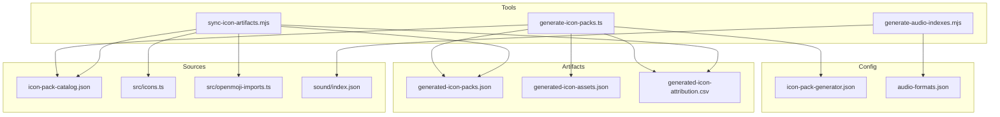
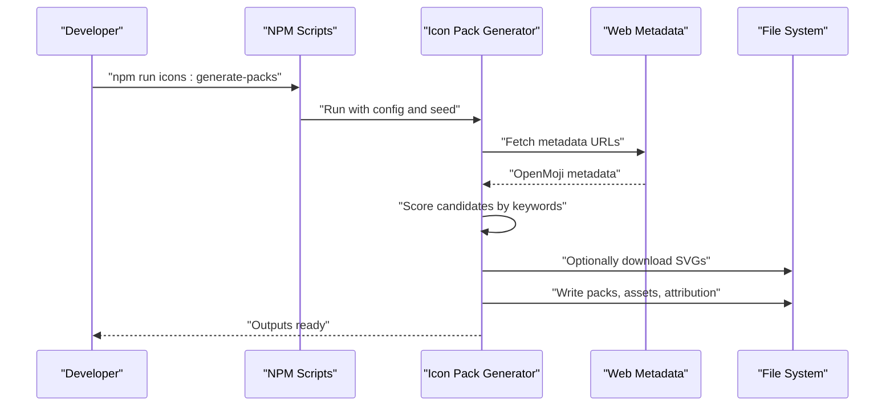
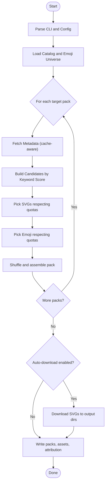
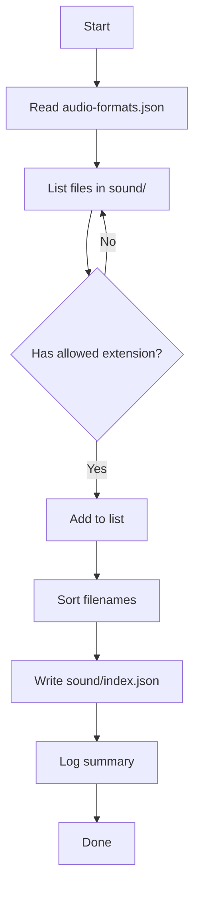
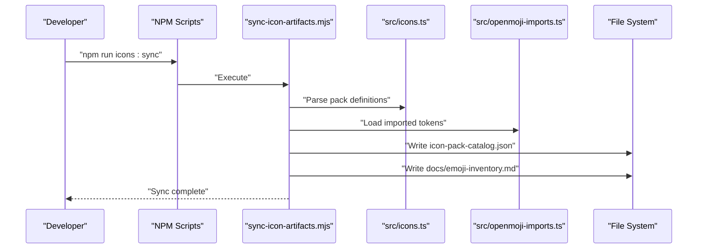
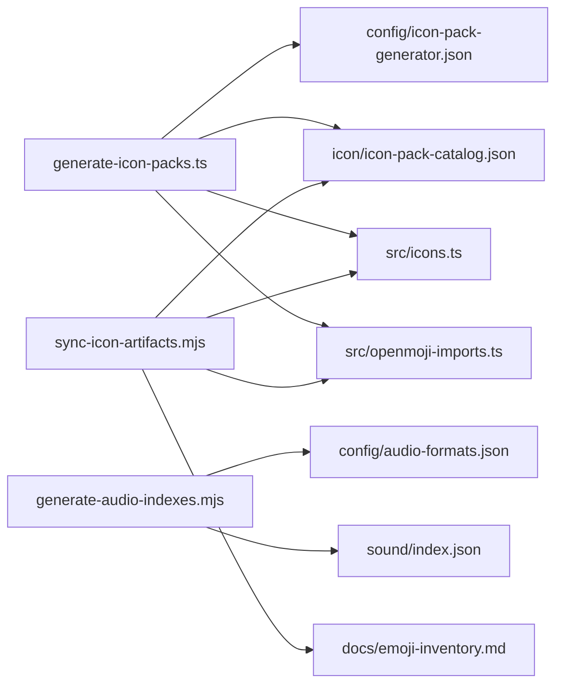

# Asset Generation Tools

<cite>
**Referenced Files in This Document**
- [generate-icon-packs.ts](file://tools/generate-icon-packs.ts)
- [generate-audio-indexes.mjs](file://tools/generate-audio-indexes.mjs)
- [sync-icon-artifacts.mjs](file://tools/sync-icon-artifacts.mjs)
- [icon-pack-generator.json](file://config/icon-pack-generator.json)
- [audio-formats.json](file://config/audio-formats.json)
- [icon-pack-catalog.json](file://icon/icon-pack-catalog.json)
- [icons.ts](file://src/icons.ts)
- [openmoji-imports.ts](file://src/openmoji-imports.ts)
- [icon-pack-generator.md](file://docs/icon-pack-generator.md)
- [emoji-inventory.md](file://docs/emoji-inventory.md)
- [index.json](file://sound/index.json)
- [package.json](file://package.json)
- [README.md](file://README.md)
</cite>

## Table of Contents
1. [Introduction](#introduction)
2. [Project Structure](#project-structure)
3. [Core Components](#core-components)
4. [Architecture Overview](#architecture-overview)
5. [Detailed Component Analysis](#detailed-component-analysis)
6. [Dependency Analysis](#dependency-analysis)
7. [Performance Considerations](#performance-considerations)
8. [Troubleshooting Guide](#troubleshooting-guide)
9. [Conclusion](#conclusion)
10. [Appendices](#appendices)

## Introduction
This document explains the asset generation tools that automate content creation and synchronization for the project. It covers:
- The TypeScript-based icon pack generator that proposes emoji theme variants and downloads SVG assets from curated sources.
- The audio index generator that scans sound directories and writes discovery indexes.
- The icon artifact synchronization script that keeps the canonical catalog and documentation in sync with the source-of-truth pack definitions.
It also documents the implementation details of asset pipeline processing, file format conversions, and batch operations; provides practical examples for running scripts and customizing parameters; and offers troubleshooting guidance and performance optimization tips integrated with the build system.

## Project Structure
The asset generation tools live under the tools/ directory and are orchestrated by NPM scripts. Configuration is centralized in config/, while generated artifacts are written to artifacts/ and consumed by the application under icon/ and sound/.

**Diagram sources**
- [generate-icon-packs.ts:1-474](file://tools/generate-icon-packs.ts#L1-L474)
- [generate-audio-indexes.mjs:1-58](file://tools/generate-audio-indexes.mjs#L1-L58)
- [sync-icon-artifacts.mjs:1-142](file://tools/sync-icon-artifacts.mjs#L1-L142)
- [icon-pack-generator.json:1-67](file://config/icon-pack-generator.json#L1-L67)
- [audio-formats.json:1-4](file://config/audio-formats.json#L1-L4)
- [icon-pack-catalog.json:1-474](file://icon/icon-pack-catalog.json#L1-L474)
- [icons.ts:1-726](file://src/icons.ts#L1-L726)
- [openmoji-imports.ts:1-199](file://src/openmoji-imports.ts#L1-L199)
- [index.json:1-17](file://sound/index.json#L1-L17)

**Section sources**
- [package.json:1-1](file://package.json#L1-L1)
- [README.md:162-206](file://README.md#L162-L206)

## Core Components
- Icon Pack Generator (TypeScript): Fetches metadata from web sources, selects candidates by keyword relevance, applies configurable ratios, optionally downloads SVGs, and emits pack catalogs, asset registries, and attribution CSVs.
- Audio Index Generator (MJS): Scans configured directories for audio files matching allowed extensions and writes an index.json for discovery.
- Icon Artifact Synchronization (MJS): Reads the canonical pack definitions from source, writes the catalog JSON, and regenerates the icon inventory documentation.

**Section sources**
- [generate-icon-packs.ts:1-474](file://tools/generate-icon-packs.ts#L1-L474)
- [generate-audio-indexes.mjs:1-58](file://tools/generate-audio-indexes.mjs#L1-L58)
- [sync-icon-artifacts.mjs:1-142](file://tools/sync-icon-artifacts.mjs#L1-L142)

## Architecture Overview
The asset generation pipeline integrates configuration-driven selection, deterministic shuffling, and file system outputs. The icon pack generator orchestrates metadata fetching, candidate scoring, and optional downloads. The audio indexer performs a simple directory walk and writes a stable index. The icon artifact sync maintains parity between source-of-truth definitions and derived artifacts.

**Diagram sources**
- [generate-icon-packs.ts:351-474](file://tools/generate-icon-packs.ts#L351-L474)
- [icon-pack-generator.json:1-67](file://config/icon-pack-generator.json#L1-L67)

## Detailed Component Analysis

### Icon Pack Generator (TypeScript)
Purpose:
- Build emoji/SVG hybrid icon packs with configurable ratios and keywords.
- Optionally download SVGs from curated sources and produce attribution and asset registry outputs.

Key behaviors:
- Parses CLI options (--config, --seed) and reads configuration.
- Validates ratios and counts.
- Loads a catalog of emoji packs and computes the universe of available emoji.
- For each target pack, fetches metadata from configured sources, builds candidates, and selects by keyword score and source priority.
- Applies seeded shuffling to ensure reproducible outputs.
- Writes:
  - A generated pack catalog with emoji/SVG counts.
  - An asset registry mapping tokens to source paths and labels.
  - An attribution CSV for licensing compliance.

Implementation highlights:
- Deterministic seeding via linear congruential generator.
- Metadata caching per endpoint to avoid redundant network requests.
- Candidate scoring based on normalized keyword matches.
- Priority-based fallback across multiple sources.
- Optional auto-download of SVGs to output directories.

**Diagram sources**
- [generate-icon-packs.ts:351-474](file://tools/generate-icon-packs.ts#L351-L474)

Practical usage:
- Run with defaults: see the documentation page for the recommended invocation.
- Customize configuration: adjust ratios, counts, sources, and keywords in the generator config.
- Reproduce builds: pass a fixed seed to ensure deterministic outputs.

Integration:
- Outputs are proposals intended for manual review before promotion.
- Downloads go to icon/openmoji/svg by default.
- Attribution CSV is emitted for easy merge into the project’s attribution tracking.

**Section sources**
- [generate-icon-packs.ts:80-107](file://tools/generate-icon-packs.ts#L80-L107)
- [generate-icon-packs.ts:138-150](file://tools/generate-icon-packs.ts#L138-L150)
- [generate-icon-packs.ts:201-242](file://tools/generate-icon-packs.ts#L201-L242)
- [generate-icon-packs.ts:244-285](file://tools/generate-icon-packs.ts#L244-L285)
- [generate-icon-packs.ts:312-326](file://tools/generate-icon-packs.ts#L312-L326)
- [generate-icon-packs.ts:426-459](file://tools/generate-icon-packs.ts#L426-L459)
- [icon-pack-generator.json:1-67](file://config/icon-pack-generator.json#L1-L67)
- [icon-pack-generator.md:1-43](file://docs/icon-pack-generator.md#L1-L43)

### Audio Index Generator (MJS)
Purpose:
- Scan the sound directory for supported audio files and write an index.json for runtime discovery.

Key behaviors:
- Reads audio formats configuration to filter file extensions.
- Lists files in the sound directory, filters by extension, sorts case-insensitively.
- Writes index.json with the sorted filenames.

**Diagram sources**
- [generate-audio-indexes.mjs:1-58](file://tools/generate-audio-indexes.mjs#L1-L58)
- [audio-formats.json:1-4](file://config/audio-formats.json#L1-L4)
- [index.json:1-17](file://sound/index.json#L1-L17)

Practical usage:
- Run via NPM script: npm run audio:index.
- Ensure audio-formats.json is present and contains the allowed extensions.
- Verify sound/index.json reflects the discovered files.

**Section sources**
- [generate-audio-indexes.mjs:1-58](file://tools/generate-audio-indexes.mjs#L1-L58)
- [audio-formats.json:1-4](file://config/audio-formats.json#L1-L4)
- [index.json:1-17](file://sound/index.json#L1-L17)

### Icon Artifact Synchronization (MJS)
Purpose:
- Keep the canonical icon catalog and documentation in sync with the source-of-truth pack definitions.

Key behaviors:
- Extracts the canonical pack definitions from src/icons.ts.
- Reads imported OpenMoji tokens from the generated list.
- Writes icon-pack-catalog.json and emoji-inventory.md.
- Emits a human-friendly inventory with active/inactive imported tokens.

**Diagram sources**
- [sync-icon-artifacts.mjs:126-142](file://tools/sync-icon-artifacts.mjs#L126-L142)
- [icons.ts:56-528](file://src/icons.ts#L56-L528)
- [openmoji-imports.ts:1-199](file://src/openmoji-imports.ts#L1-L199)
- [icon-pack-catalog.json:1-474](file://icon/icon-pack-catalog.json#L1-L474)
- [emoji-inventory.md:1-166](file://docs/emoji-inventory.md#L1-L166)

Practical usage:
- Run via NPM script: npm run icons:sync.
- After editing pack definitions in src/icons.ts, re-run to regenerate catalog and inventory.

**Section sources**
- [sync-icon-artifacts.mjs:1-142](file://tools/sync-icon-artifacts.mjs#L1-L142)
- [icons.ts:56-528](file://src/icons.ts#L56-L528)
- [openmoji-imports.ts:1-199](file://src/openmoji-imports.ts#L1-L199)
- [icon-pack-catalog.json:1-474](file://icon/icon-pack-catalog.json#L1-L474)
- [emoji-inventory.md:1-166](file://docs/emoji-inventory.md#L1-L166)

## Dependency Analysis
- The icon pack generator depends on:
  - Configuration (icon-pack-generator.json)
  - Catalog (icon-pack-catalog.json)
  - Source-of-truth emoji definitions (src/icons.ts)
  - Generated imported tokens (src/openmoji-imports.ts)
  - Optional network access for metadata and SVG downloads
- The audio index generator depends on:
  - Configuration (audio-formats.json)
  - The sound directory structure
- The icon artifact synchronization depends on:
  - Canonical pack definitions (src/icons.ts)
  - Generated imported tokens (src/openmoji-imports.ts)
  - Output artifacts (icon/icon-pack-catalog.json, docs/emoji-inventory.md)

**Diagram sources**
- [generate-icon-packs.ts:1-474](file://tools/generate-icon-packs.ts#L1-L474)
- [generate-audio-indexes.mjs:1-58](file://tools/generate-audio-indexes.mjs#L1-L58)
- [sync-icon-artifacts.mjs:1-142](file://tools/sync-icon-artifacts.mjs#L1-L142)
- [icon-pack-generator.json:1-67](file://config/icon-pack-generator.json#L1-L67)
- [audio-formats.json:1-4](file://config/audio-formats.json#L1-L4)
- [icon-pack-catalog.json:1-474](file://icon/icon-pack-catalog.json#L1-L474)
- [icons.ts:1-726](file://src/icons.ts#L1-L726)
- [openmoji-imports.ts:1-199](file://src/openmoji-imports.ts#L1-L199)
- [emoji-inventory.md:1-166](file://docs/emoji-inventory.md#L1-L166)
- [index.json:1-17](file://sound/index.json#L1-L17)

**Section sources**
- [generate-icon-packs.ts:351-474](file://tools/generate-icon-packs.ts#L351-L474)
- [generate-audio-indexes.mjs:1-58](file://tools/generate-audio-indexes.mjs#L1-L58)
- [sync-icon-artifacts.mjs:126-142](file://tools/sync-icon-artifacts.mjs#L126-L142)

## Performance Considerations
- Network efficiency:
  - Metadata is cached per endpoint to avoid repeated fetches during a single run.
- Deterministic randomness:
  - Seeded shuffling ensures reproducible outputs without sacrificing diversity.
- I/O batching:
  - SVG downloads are performed sequentially to prevent rate limiting and ensure atomic writes.
- Index generation:
  - Directory scanning and sorting are linear-time relative to the number of entries; keep the sound directory organized to minimize churn.

[No sources needed since this section provides general guidance]

## Troubleshooting Guide
Common issues and resolutions:
- Icon pack generator errors:
  - Emoji/SVG ratio validation: ensure emojiRatio + svgRatio equals 1.
  - Non-positive icon count: ensure iconsPerPack > 0.
  - Unknown pack or source IDs: verify entries in the catalog and sources lists.
  - Metadata fetch failures: check network connectivity and endpoint URLs.
  - SVG download failures: confirm source URLs and output directories are writable.
- Audio index generator:
  - Missing or invalid audio-formats.json: ensure the file exists and contains a valid JSON object with an "extensions" array.
  - Empty index.json: verify the sound directory contains files with allowed extensions.
- Icon artifact synchronization:
  - Missing or malformed pack definitions: ensure src/icons.ts exports the canonical EMOJI_PACKS array in the expected shape.
  - Generated inventory inconsistencies: re-run the sync script after updating pack definitions.

Operational tips:
- Use deterministic seeds for reproducible icon pack proposals.
- Review generated outputs before promoting to production.
- Keep the sound directory clean and consistent with audio-formats.json.

**Section sources**
- [generate-icon-packs.ts:138-150](file://tools/generate-icon-packs.ts#L138-L150)
- [generate-icon-packs.ts:383-387](file://tools/generate-icon-packs.ts#L383-L387)
- [generate-icon-packs.ts:395-397](file://tools/generate-icon-packs.ts#L395-L397)
- [generate-icon-packs.ts:177-199](file://tools/generate-icon-packs.ts#L177-L199)
- [generate-icon-packs.ts:312-326](file://tools/generate-icon-packs.ts#L312-L326)
- [generate-audio-indexes.mjs:11-20](file://tools/generate-audio-indexes.mjs#L11-L20)
- [generate-audio-indexes.mjs:34-39](file://tools/generate-audio-indexes.mjs#L34-L39)
- [sync-icon-artifacts.mjs:17-35](file://tools/sync-icon-artifacts.mjs#L17-L35)
- [sync-icon-artifacts.mjs:23-25](file://tools/sync-icon-artifacts.mjs#L23-L25)

## Conclusion
The asset generation tools provide a robust, configurable pipeline for creating and synchronizing icon and audio assets. By combining deterministic selection, metadata-driven candidate scoring, and simple file system operations, they enable efficient content curation and discovery. Integrating these tools into the build process ensures that generated artifacts remain consistent with source-of-truth definitions and runtime requirements.

[No sources needed since this section summarizes without analyzing specific files]

## Appendices

### Practical Examples
- Running the icon pack generator:
  - Use the documented NPM script for default behavior.
  - Pass a fixed seed for reproducible outputs.
- Customizing asset parameters:
  - Adjust ratios, counts, and keywords in the generator configuration.
  - Add or reorder sources and tune priorities.
- Extending the toolchain:
  - Add new asset types by modeling after the audio index generator pattern: define a config for allowed formats/extensions and a writer that scans and persists an index.
  - For new catalogs, mirror the icon artifact synchronization approach: extract definitions from source, compute derived artifacts, and write them to the appropriate locations.

**Section sources**
- [icon-pack-generator.md:1-43](file://docs/icon-pack-generator.md#L1-L43)
- [icon-pack-generator.json:1-67](file://config/icon-pack-generator.json#L1-L67)
- [generate-audio-indexes.mjs:1-58](file://tools/generate-audio-indexes.mjs#L1-L58)
- [audio-formats.json:1-4](file://config/audio-formats.json#L1-L4)
- [sync-icon-artifacts.mjs:126-142](file://tools/sync-icon-artifacts.mjs#L126-L142)

### Integration with the Build System
- NPM scripts orchestrate asset generation:
  - audio:index: runs the audio index generator.
  - icons:sync: runs the icon artifact synchronization.
  - artifacts: runs both tasks in sequence.
  - build: runs artifacts then builds the application.
- The README documents how generated assets are served in deployment contexts.

**Section sources**
- [package.json:1-1](file://package.json#L1-L1)
- [README.md:17-20](file://README.md#L17-L20)