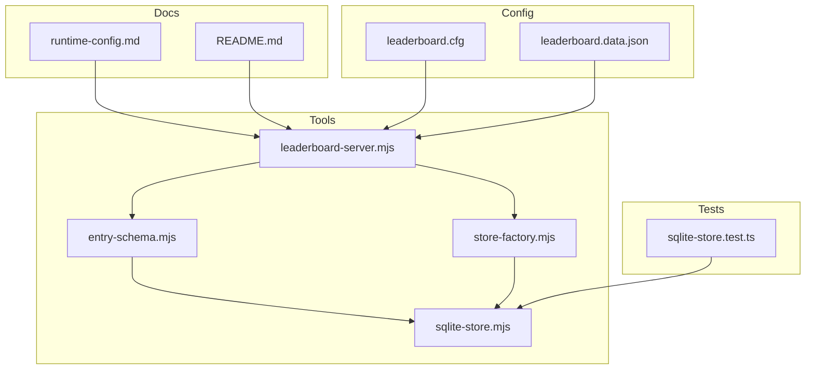
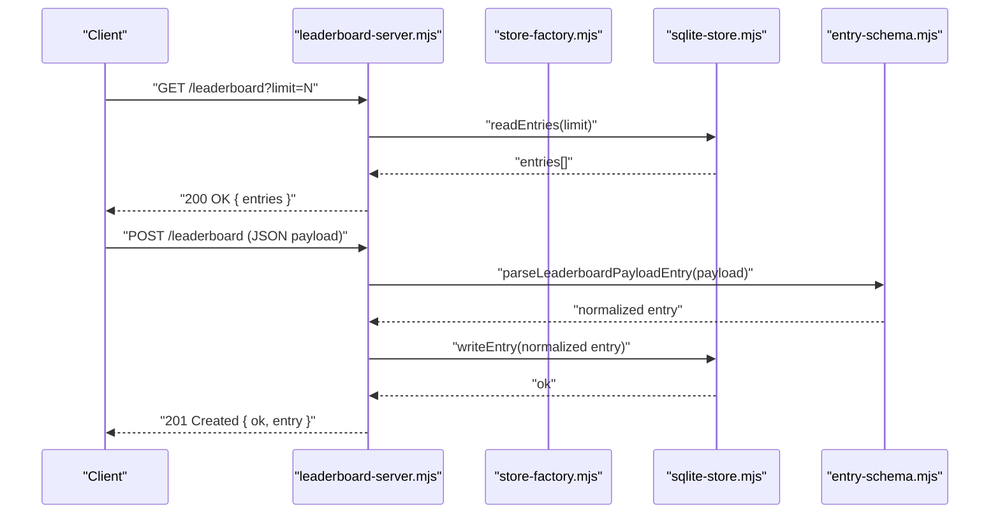
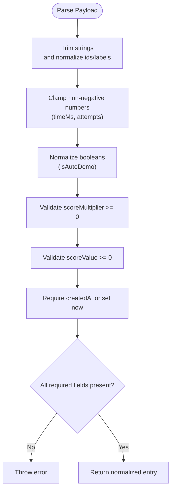
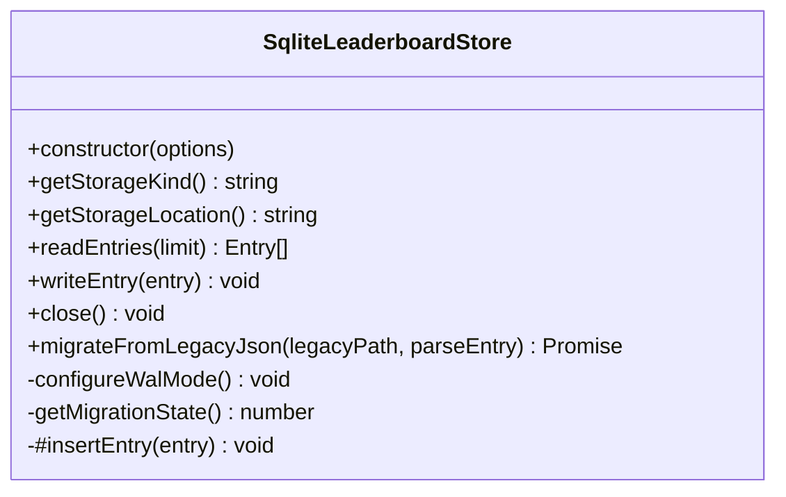
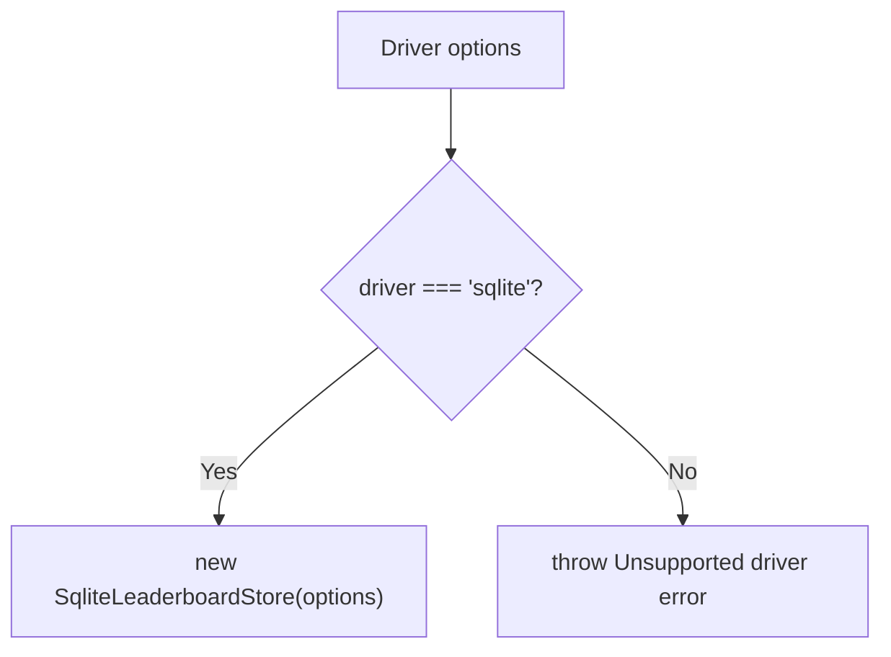
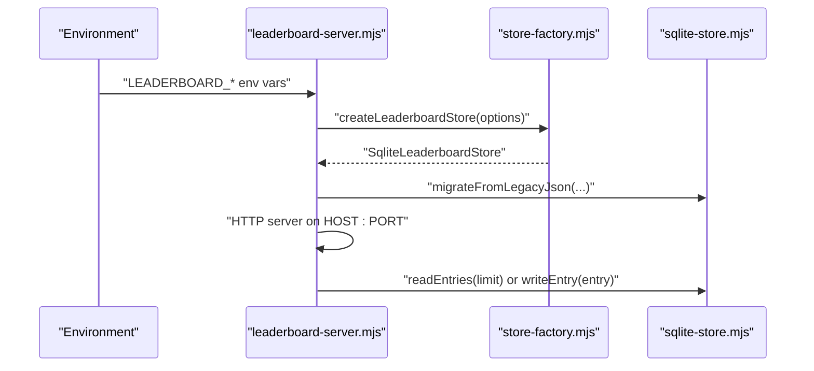
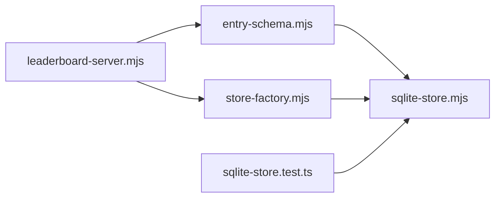

# Database Management Tools

<cite>
**Referenced Files in This Document**
- [entry-schema.mjs](file://tools/leaderboard/entry-schema.mjs)
- [sqlite-store.mjs](file://tools/leaderboard/sqlite-store.mjs)
- [store-factory.mjs](file://tools/leaderboard/store-factory.mjs)
- [leaderboard-server.mjs](file://tools/leaderboard-server.mjs)
- [sqlite-store.test.ts](file://tests/sqlite-store.test.ts)
- [runtime-config.md](file://docs/runtime-config.md)
- [README.md](file://README.md)
- [leaderboard.cfg](file://config/leaderboard.cfg)
- [leaderboard.data.json](file://config/leaderboard.data.json)
</cite>

## Table of Contents
1. [Introduction](#introduction)
2. [Project Structure](#project-structure)
3. [Core Components](#core-components)
4. [Architecture Overview](#architecture-overview)
5. [Detailed Component Analysis](#detailed-component-analysis)
6. [Dependency Analysis](#dependency-analysis)
7. [Performance Considerations](#performance-considerations)
8. [Troubleshooting Guide](#troubleshooting-guide)
9. [Conclusion](#conclusion)
10. [Appendices](#appendices)

## Introduction
This document explains the leaderboard database management tools built around SQLite. It covers the entry schema definition for score records, the SQLite store implementation for CRUD operations, the store factory pattern for database connections, and the leaderboard server script for local development and testing. It also documents database migrations, query optimization, data integrity validation, practical operation examples, maintenance procedures, backup strategies, and performance tuning for high-score persistence.

## Project Structure
The leaderboard toolchain is organized into:
- Entry schema normalization and validation
- SQLite store with schema, indexes, and migration support
- Store factory for pluggable storage drivers
- Leaderboard server for local development and testing
- Tests validating migration and store behavior
- Runtime configuration and documentation

**Diagram sources**
- [entry-schema.mjs:1-91](file://tools/leaderboard/entry-schema.mjs#L1-L91)
- [sqlite-store.mjs:1-531](file://tools/leaderboard/sqlite-store.mjs#L1-L531)
- [store-factory.mjs:1-25](file://tools/leaderboard/store-factory.mjs#L1-L25)
- [leaderboard-server.mjs:1-161](file://tools/leaderboard-server.mjs#L1-L161)
- [sqlite-store.test.ts:1-269](file://tests/sqlite-store.test.ts#L1-L269)
- [runtime-config.md:150-275](file://docs/runtime-config.md#L150-L275)
- [README.md:90-110](file://README.md#L90-L110)
- [leaderboard.cfg:1-17](file://config/leaderboard.cfg#L1-L17)
- [leaderboard.data.json:1-3](file://config/leaderboard.data.json#L1-L3)

**Section sources**
- [README.md:90-110](file://README.md#L90-L110)
- [runtime-config.md:150-275](file://docs/runtime-config.md#L150-L275)

## Core Components
- Entry schema: Normalizes and validates incoming score payloads into a canonical shape with strict field validation and sanitization.
- SQLite store: Implements schema creation, indexes, CRUD operations, retention trimming, WAL mode configuration, and a one-time legacy migration.
- Store factory: Provides a driver-based factory to instantiate the SQLite store.
- Leaderboard server: Exposes a simple HTTP API for GET and POST leaderboard entries, integrates migration, and applies runtime configuration.

**Section sources**
- [entry-schema.mjs:18-90](file://tools/leaderboard/entry-schema.mjs#L18-L90)
- [sqlite-store.mjs:48-75](file://tools/leaderboard/sqlite-store.mjs#L48-L75)
- [sqlite-store.mjs:150-301](file://tools/leaderboard/sqlite-store.mjs#L150-L301)
- [store-factory.mjs:16-24](file://tools/leaderboard/store-factory.mjs#L16-L24)
- [leaderboard-server.mjs:67-115](file://tools/leaderboard-server.mjs#L67-L115)

## Architecture Overview
The leaderboard server composes a store factory to create a SQLite-backed store, then exposes HTTP endpoints to read top entries and write new entries. On startup, it migrates legacy JSON data into SQLite if present and not yet migrated.

**Diagram sources**
- [leaderboard-server.mjs:117-153](file://tools/leaderboard-server.mjs#L117-L153)
- [store-factory.mjs:16-24](file://tools/leaderboard/store-factory.mjs#L16-L24)
- [sqlite-store.mjs:391-399](file://tools/leaderboard/sqlite-store.mjs#L391-L399)
- [entry-schema.mjs:18-90](file://tools/leaderboard/entry-schema.mjs#L18-L90)

## Detailed Component Analysis

### Entry Schema Definition
The entry schema defines the canonical shape for score records and validates required fields. It trims strings, clamps non-negative numeric fields, ensures multi-field consistency, and generates a standardized creation timestamp when not provided.

Key behaviors:
- Trims and validates required identifiers (player name, difficulty id/label, emoji set id/label).
- Validates numeric fields (timeMs, attempts) and score fields (multiplier, value).
- Enforces presence of createdAt when allowed; otherwise uses current timestamp.
- Throws on invalid payloads to prevent insertion of malformed data.

**Diagram sources**
- [entry-schema.mjs:18-90](file://tools/leaderboard/entry-schema.mjs#L18-L90)

**Section sources**
- [entry-schema.mjs:18-90](file://tools/leaderboard/entry-schema.mjs#L18-L90)

### SQLite Store Implementation
The SQLite store encapsulates:
- Schema and indexes: Creates the scores table and a descending index on created_at and id for efficient retrieval.
- Prepared statements: Caches statements for read, insert, trim, and migration state operations to minimize overhead.
- WAL mode: Attempts to enable Write-Ahead Logging for improved concurrency and durability.
- Retention trimming: Uses a windowing CTE to delete older entries beyond the configured limit.
- Migration: Reads legacy JSON, normalizes entries, deduplicates by identity, inserts in a transaction, trims, and sets migration state.

**Diagram sources**
- [sqlite-store.mjs:150-301](file://tools/leaderboard/sqlite-store.mjs#L150-L301)

**Section sources**
- [sqlite-store.mjs:48-75](file://tools/leaderboard/sqlite-store.mjs#L48-L75)
- [sqlite-store.mjs:186-284](file://tools/leaderboard/sqlite-store.mjs#L186-L284)
- [sqlite-store.mjs:303-337](file://tools/leaderboard/sqlite-store.mjs#L303-L337)
- [sqlite-store.mjs:260-273](file://tools/leaderboard/sqlite-store.mjs#L260-L273)
- [sqlite-store.mjs:442-529](file://tools/leaderboard/sqlite-store.mjs#L442-L529)

### Store Factory Pattern
The factory creates a store instance based on the driver configuration. Currently supports “sqlite” and throws for unsupported drivers.

**Diagram sources**
- [store-factory.mjs:16-24](file://tools/leaderboard/store-factory.mjs#L16-L24)

**Section sources**
- [store-factory.mjs:16-24](file://tools/leaderboard/store-factory.mjs#L16-L24)

### Leaderboard Server Script
The server:
- Parses environment variables for port, host, driver, and retention.
- Creates a store via the factory.
- Performs a one-time migration from legacy JSON if applicable.
- Serves GET /leaderboard with optional limit and POST /leaderboard with JSON payload.
- Applies CORS headers and enforces request body size limits.

**Diagram sources**
- [leaderboard-server.mjs:67-115](file://tools/leaderboard-server.mjs#L67-L115)
- [store-factory.mjs:16-24](file://tools/leaderboard/store-factory.mjs#L16-L24)
- [sqlite-store.mjs:442-529](file://tools/leaderboard/sqlite-store.mjs#L442-L529)

**Section sources**
- [leaderboard-server.mjs:11-25](file://tools/leaderboard-server.mjs#L11-L25)
- [leaderboard-server.mjs:51-54](file://tools/leaderboard-server.mjs#L51-L54)
- [leaderboard-server.mjs:117-153](file://tools/leaderboard-server.mjs#L117-L153)

## Dependency Analysis
- entry-schema.mjs depends on the server to validate payloads before writing.
- sqlite-store.mjs depends on better-sqlite3 and uses prepared statements and transactions.
- store-factory.mjs depends on sqlite-store.mjs and exposes a driver abstraction.
- leaderboard-server.mjs depends on both entry-schema.mjs and store-factory.mjs.
- Tests depend on sqlite-store.mjs to validate migration and store behavior.

**Diagram sources**
- [entry-schema.mjs:18-90](file://tools/leaderboard/entry-schema.mjs#L18-L90)
- [sqlite-store.mjs:150-301](file://tools/leaderboard/sqlite-store.mjs#L150-L301)
- [store-factory.mjs:16-24](file://tools/leaderboard/store-factory.mjs#L16-L24)
- [leaderboard-server.mjs:67-115](file://tools/leaderboard-server.mjs#L67-L115)
- [sqlite-store.test.ts:10-10](file://tests/sqlite-store.test.ts#L10-L10)

**Section sources**
- [sqlite-store.test.ts:10-10](file://tests/sqlite-store.test.ts#L10-L10)

## Performance Considerations
- Indexing: The descending index on created_at and id optimizes retrieval of recent entries.
- WAL mode: Enabled via pragma to improve write concurrency and crash safety; logs a warning if unavailable.
- Statement preparation: Prepared statements reduce parsing overhead and improve throughput.
- Retention trimming: Uses a windowing CTE to efficiently delete older rows beyond the configured limit.
- Memory estimates: Migration warns when retention thresholds exceed a memory warning threshold to inform operators.

Practical tips:
- Prefer smaller retention limits for environments with constrained memory.
- Ensure the database file resides on a filesystem that supports WAL mode.
- Monitor WAL-related warnings and adjust storage/media accordingly.

**Section sources**
- [sqlite-store.mjs:65-68](file://tools/leaderboard/sqlite-store.mjs#L65-L68)
- [sqlite-store.mjs:303-337](file://tools/leaderboard/sqlite-store.mjs#L303-L337)
- [sqlite-store.mjs:260-273](file://tools/leaderboard/sqlite-store.mjs#L260-L273)
- [sqlite-store.mjs:474-484](file://tools/leaderboard/sqlite-store.mjs#L474-L484)

## Troubleshooting Guide
Common issues and resolutions:
- Database open failures: The store constructor throws when the database cannot be opened; verify directory existence, permissions, and filesystem capabilities.
- WAL mode warnings: If WAL cannot be enabled, the server continues but writes may be slower; check permissions, filesystem support, and SQLite/better-sqlite3 build.
- Migration errors: Migration wraps transaction errors and logs a warning; inspect logs for details and retry after fixing the underlying issue.
- Request body too large: The server enforces a maximum request body size; ensure payloads are compact.
- Legacy migration idempotency: Migration state is persisted; subsequent runs skip migration unless explicitly reset.

Operational checks:
- Confirm the database file exists and is writable.
- Review server logs for WAL warnings and migration messages.
- Validate environment variables for port, host, driver, and retention.

**Section sources**
- [sqlite-store.mjs:167-177](file://tools/leaderboard/sqlite-store.mjs#L167-L177)
- [sqlite-store.mjs:313-336](file://tools/leaderboard/sqlite-store.mjs#L313-L336)
- [sqlite-store.mjs:517-523](file://tools/leaderboard/sqlite-store.mjs#L517-L523)
- [leaderboard-server.mjs:80-85](file://tools/leaderboard-server.mjs#L80-L85)
- [runtime-config.md:170-184](file://docs/runtime-config.md#L170-L184)

## Conclusion
The leaderboard tools provide a robust, SQLite-backed persistence layer with strong validation, efficient indexing, and a safe one-time migration from legacy JSON. The server offers a straightforward API for local development and testing, while the factory pattern enables future driver swaps. Following the operational guidance and performance recommendations ensures reliable, high-performance leaderboard persistence.

## Appendices

### Practical Examples

- Start the leaderboard server locally:
  - Set environment variables for port, host, driver, and retention.
  - Run the server; it will create the SQLite database file and perform a one-time migration if needed.

- Submit a score entry:
  - Send a POST request to the leaderboard endpoint with a JSON payload containing the required fields.

- Retrieve top entries:
  - Send a GET request to the leaderboard endpoint with an optional limit query parameter.

- Reset global scores:
  - Stop the server, delete the SQLite database file, and restart the server.

- Backup strategies:
  - Back up the SQLite database file regularly; WAL files are managed by SQLite and can be included in backups.

- Schema modifications:
  - Add new fields to the entry schema and update the store’s table creation and mapping functions consistently.

- Query optimization:
  - Use the descending index on created_at and id for recent-entry queries.
  - Keep retention limits reasonable to avoid excessive trimming overhead.

**Section sources**
- [README.md:95-122](file://README.md#L95-L122)
- [runtime-config.md:154-211](file://docs/runtime-config.md#L154-L211)
- [leaderboard-server.mjs:117-153](file://tools/leaderboard-server.mjs#L117-L153)