# Development Tools and Utilities

<cite>
**Referenced Files in This Document**
- [generate-icon-packs.ts](file://tools/generate-icon-packs.ts)
- [generate-audio-indexes.mjs](file://tools/generate-audio-indexes.mjs)
- [sync-icon-artifacts.mjs](file://tools/sync-icon-artifacts.mjs)
- [validate-config.sh](file://tools/validate-config.sh)
- [leaderboard-server.mjs](file://tools/leaderboard-server.mjs)
- [entry-schema.mjs](file://tools/leaderboard/entry-schema.mjs)
- [sqlite-store.mjs](file://tools/leaderboard/sqlite-store.mjs)
- [store-factory.mjs](file://tools/leaderboard/store-factory.mjs)
- [_experiment.mjs](file://_experiment.mjs)
- [_flip.mjs](file://_flip.mjs)
- [_probe.mjs](file://_probe.mjs)
- [_probe2.mjs](file://_probe2.mjs)
- [_shot.mjs](file://_shot.mjs)
- [icon-pack-generator.json](file://config/icon-pack-generator.json)
- [audio-formats.json](file://config/audio-formats.json)
- [package.json](file://package.json)
- [vite.config.ts](file://vite.config.ts)
- [vitest.config.ts](file://vitest.config.ts)
- [eslint.config.mjs](file://eslint.config.mjs)
- [playwright.config.ts](file://playwright.config.ts)
- [testing-strategy.md](file://docs/testing-strategy.md)
</cite>

## Update Summary
**Changes Made**
- Added comprehensive documentation for new automated testing and visual verification scripts
- Integrated new utility scripts (_experiment.mjs, _flip.mjs, _probe.mjs, _probe2.mjs, _shot.mjs) into the development toolchain
- Enhanced testing strategy documentation with visual verification capabilities
- Updated architecture overview to include automated visual testing workflow

## Table of Contents
1. [Introduction](#introduction)
2. [Project Structure](#project-structure)
3. [Core Components](#core-components)
4. [Architecture Overview](#architecture-overview)
5. [Detailed Component Analysis](#detailed-component-analysis)
6. [Automated Visual Testing Suite](#automated-visual-testing-suite)
7. [Dependency Analysis](#dependency-analysis)
8. [Performance Considerations](#performance-considerations)
9. [Troubleshooting Guide](#troubleshooting-guide)
10. [Conclusion](#conclusion)
11. [Appendices](#appendices)

## Introduction
This document explains the development tools and utilities that power build automation, asset generation, and maintenance tasks for the project. It covers:
- A TypeScript-based icon pack generator that selects and downloads SVG assets, builds catalogs, and generates attribution records.
- An audio asset indexing script that scans audio directories and produces index files.
- A configuration validator shell script that enforces file presence, syntax, required keys, and absence of deprecated keys.
- A leaderboard utility stack including a lightweight HTTP server, schema validation, and a SQLite-backed store with migration support.
- A comprehensive automated visual testing suite for variant testing, animation capture, computed style debugging, and screenshot workflows.
- The asset synchronization pipeline that keeps documentation and catalogs in sync with the canonical icon definitions.
- Automated testing utilities and deployment preparation scripts integrated with the build pipeline.
- Practical usage examples, extension guidance, and troubleshooting tips for tooling.

## Project Structure
The development toolchain is organized under the tools/ directory with supporting configuration files in config/. Scripts are wired into the project's npm scripts for easy invocation, and the new visual testing utilities are integrated as standalone scripts for rapid prototyping and debugging.

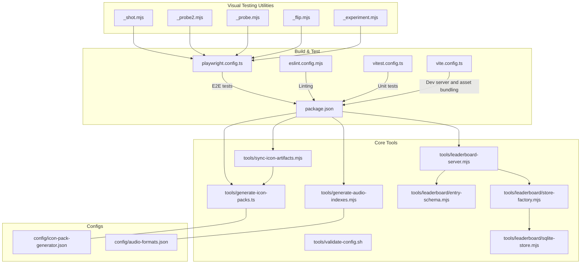

**Diagram sources**
- [generate-icon-packs.ts:1-474](file://tools/generate-icon-packs.ts#L1-L474)
- [generate-audio-indexes.mjs:1-58](file://tools/generate-audio-indexes.mjs#L1-L58)
- [sync-icon-artifacts.mjs:1-142](file://tools/sync-icon-artifacts.mjs#L1-L142)
- [validate-config.sh:1-129](file://tools/validate-config.sh#L1-L129)
- [leaderboard-server.mjs:1-161](file://tools/leaderboard-server.mjs#L1-L161)
- [entry-schema.mjs:1-91](file://tools/leaderboard/entry-schema.mjs#L1-L91)
- [sqlite-store.mjs:1-531](file://tools/leaderboard/sqlite-store.mjs#L1-L531)
- [store-factory.mjs:1-25](file://tools/leaderboard/store-factory.mjs#L1-L25)
- [_experiment.mjs:1-23](file://_experiment.mjs#L1-L23)
- [_flip.mjs:1-17](file://_flip.mjs#L1-L17)
- [_probe.mjs:1-29](file://_probe.mjs#L1-L29)
- [_probe2.mjs:1-19](file://_probe2.mjs#L1-L19)
- [_shot.mjs:1-29](file://_shot.mjs#L1-L29)
- [icon-pack-generator.json:1-67](file://config/icon-pack-generator.json#L1-L67)
- [audio-formats.json:1-4](file://config/audio-formats.json#L1-L4)
- [package.json:1-1](file://package.json#L1-L1)
- [vite.config.ts:1-80](file://vite.config.ts#L1-L80)
- [vitest.config.ts:1-31](file://vitest.config.ts#L1-L31)
- [eslint.config.mjs:1-49](file://eslint.config.mjs#L1-L49)
- [playwright.config.ts:1-51](file://playwright.config.ts#L1-L51)

**Section sources**
- [package.json:1-1](file://package.json#L1-L1)
- [vite.config.ts:1-80](file://vite.config.ts#L1-L80)
- [eslint.config.mjs:1-49](file://eslint.config.mjs#L1-L49)
- [vitest.config.ts:1-31](file://vitest.config.ts#L1-L31)
- [playwright.config.ts:1-51](file://playwright.config.ts#L1-L51)

## Core Components
- Icon Pack Generator (TypeScript): Selects emoji and SVG assets based on keyword matching, applies configurable ratios, optionally downloads SVGs, and emits generated packs, attribution CSV, and asset registry.
- Audio Index Generator (Node.js): Scans audio directories and writes index.json files based on a configured set of extensions.
- Icon Artifacts Sync (Node.js): Reads the canonical icon definitions, writes a catalog JSON, and generates an inventory Markdown for documentation.
- Config Validator (Shell): Enforces presence of required files, key-value syntax, required keys per file, and absence of deprecated keys.
- Leaderboard Server (HTTP + SQLite): Provides GET/POST endpoints for leaderboard entries, validates payloads, persists to SQLite with retention trimming, and supports legacy JSON migration.
- **Automated Visual Testing Suite**: Comprehensive set of utility scripts for variant testing, animation capture, computed style debugging, and screenshot workflows using Playwright.
- Build/Test Tooling: Vite dev server and asset bundling, ESLint for TypeScript and tools, Vitest for unit tests, and Playwright for E2E mobile tests.

**Section sources**
- [generate-icon-packs.ts:1-474](file://tools/generate-icon-packs.ts#L1-L474)
- [generate-audio-indexes.mjs:1-58](file://tools/generate-audio-indexes.mjs#L1-L58)
- [sync-icon-artifacts.mjs:1-142](file://tools/sync-icon-artifacts.mjs#L1-L142)
- [validate-config.sh:1-129](file://tools/validate-config.sh#L1-L129)
- [leaderboard-server.mjs:1-161](file://tools/leaderboard-server.mjs#L1-L161)
- [sqlite-store.mjs:1-531](file://tools/leaderboard/sqlite-store.mjs#L1-L531)
- [_experiment.mjs:1-23](file://_experiment.mjs#L1-L23)
- [_flip.mjs:1-17](file://_flip.mjs#L1-L17)
- [_probe.mjs:1-29](file://_probe.mjs#L1-L29)
- [_probe2.mjs:1-19](file://_probe2.mjs#L1-L19)
- [_shot.mjs:1-29](file://_shot.mjs#L1-L29)
- [vite.config.ts:1-80](file://vite.config.ts#L1-L80)
- [eslint.config.mjs:1-49](file://eslint.config.mjs#L1-L49)
- [vitest.config.ts:1-31](file://vitest.config.ts#L1-L31)
- [playwright.config.ts:1-51](file://playwright.config.ts#L1-L51)

## Architecture Overview
The toolchain integrates with the main application via:
- Vite dev server middleware serving SVG assets from the icon/ directory.
- Build pipeline invoking artifact generation scripts before bundling.
- Testing utilities that exclude tools from coverage and focus on application code.
- **Automated visual testing utilities that leverage Playwright for rapid UI verification and debugging workflows.**

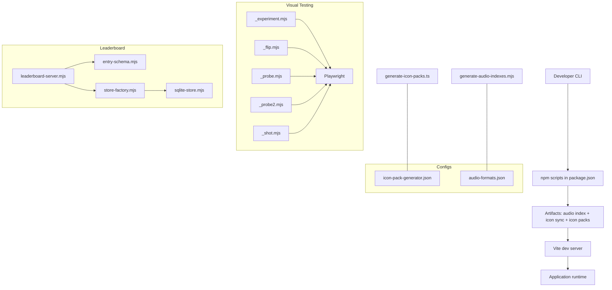

**Diagram sources**
- [package.json:1-1](file://package.json#L1-L1)
- [generate-icon-packs.ts:1-474](file://tools/generate-icon-packs.ts#L1-L474)
- [generate-audio-indexes.mjs:1-58](file://tools/generate-audio-indexes.mjs#L1-L58)
- [vite.config.ts:1-80](file://vite.config.ts#L1-L80)
- [_experiment.mjs:1-23](file://_experiment.mjs#L1-L23)
- [_flip.mjs:1-17](file://_flip.mjs#L1-L17)
- [_probe.mjs:1-29](file://_probe.mjs#L1-L29)
- [_probe2.mjs:1-19](file://_probe2.mjs#L1-L19)
- [_shot.mjs:1-29](file://_shot.mjs#L1-L29)
- [playwright.config.ts:1-51](file://playwright.config.ts#L1-L51)
- [leaderboard-server.mjs:1-161](file://tools/leaderboard-server.mjs#L1-L161)
- [entry-schema.mjs:1-91](file://tools/leaderboard/entry-schema.mjs#L1-L91)
- [store-factory.mjs:1-25](file://tools/leaderboard/store-factory.mjs#L1-L25)
- [sqlite-store.mjs:1-531](file://tools/leaderboard/sqlite-store.mjs#L1-L531)
- [icon-pack-generator.json:1-67](file://config/icon-pack-generator.json#L1-L67)
- [audio-formats.json:1-4](file://config/audio-formats.json#L1-L4)

## Detailed Component Analysis

### Icon Pack Generator (TypeScript)
Responsibilities:
- Parse CLI options (--config, --seed).
- Load generator configuration and validate ratios and counts.
- Fetch metadata from remote sources and build candidate lists weighted by keyword matches and source priority.
- Randomly select emoji and SVG assets respecting quotas and uniqueness.
- Optionally download SVGs, generate attribution CSV, and write pack catalog and asset registry.

Key behaviors:
- Deterministic seeding for reproducible runs.
- Metadata caching per URL to avoid redundant network requests.
- Source priority fallback: prefer higher-priority sources first, then fill with lower-priority candidates.
- Emits three outputs: generated packs JSON, attribution CSV, and asset registry mapping tokens to source paths.

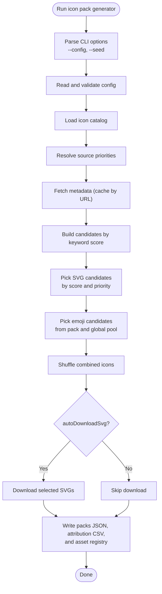

**Diagram sources**
- [generate-icon-packs.ts:80-474](file://tools/generate-icon-packs.ts#L80-L474)

**Section sources**
- [generate-icon-packs.ts:1-474](file://tools/generate-icon-packs.ts#L1-L474)
- [icon-pack-generator.json:1-67](file://config/icon-pack-generator.json#L1-L67)

### Audio Asset Index Generator (Node.js)
Responsibilities:
- Read audio formats configuration.
- Scan directories for audio files matching configured extensions.
- Sort filenames and write index.json files.

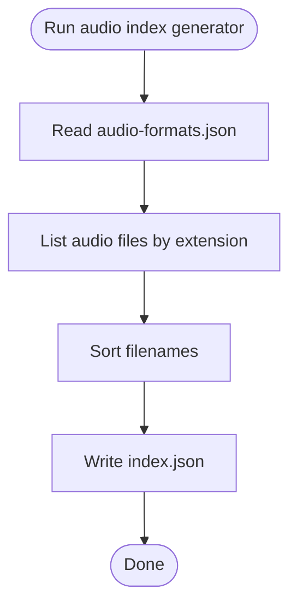

**Diagram sources**
- [generate-audio-indexes.mjs:1-58](file://tools/generate-audio-indexes.mjs#L1-L58)
- [audio-formats.json:1-4](file://config/audio-formats.json#L1-L4)

**Section sources**
- [generate-audio-indexes.mjs:1-58](file://tools/generate-audio-indexes.mjs#L1-L58)
- [audio-formats.json:1-4](file://config/audio-formats.json#L1-L4)

### Icon Artifacts Synchronization (Node.js)
Responsibilities:
- Extract emoji pack definitions from the canonical source file.
- Write icon-pack-catalog.json for downstream consumers.
- Generate emoji-inventory.md with active/inactive imported tokens and usage notes.

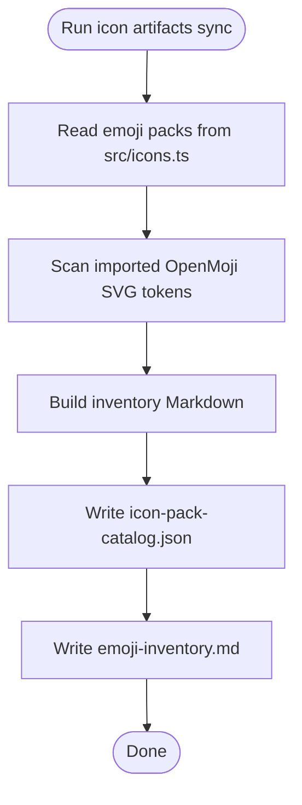

**Diagram sources**
- [sync-icon-artifacts.mjs:1-142](file://tools/sync-icon-artifacts.mjs#L1-L142)

**Section sources**
- [sync-icon-artifacts.mjs:1-142](file://tools/sync-icon-artifacts.mjs#L1-L142)

### Configuration Validation (Shell)
Responsibilities:
- Ensure required files exist.
- Validate line syntax (key=value) excluding comments and blanks.
- Check required keys per file.
- Detect and reject deprecated keys.

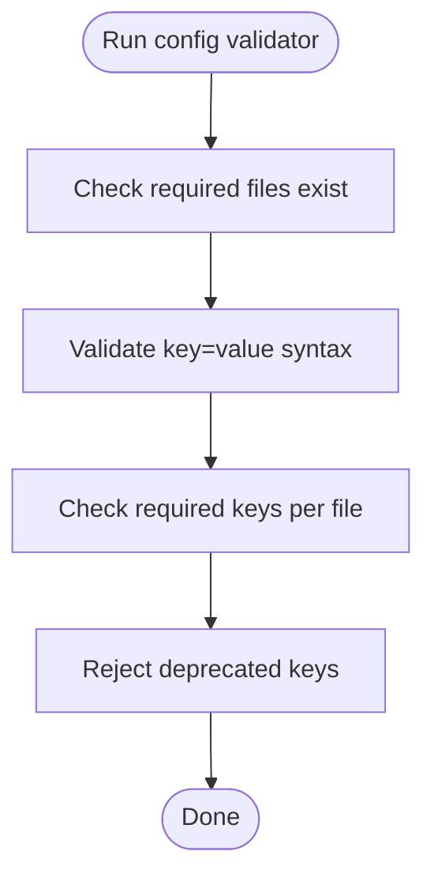

**Diagram sources**
- [validate-config.sh:1-129](file://tools/validate-config.sh#L1-L129)

**Section sources**
- [validate-config.sh:1-129](file://tools/validate-config.sh#L1-L129)

### Leaderboard Utility Stack
Components:
- HTTP server: Exposes GET /leaderboard (with limit query) and POST /leaderboard endpoints, with CORS headers and request body limits.
- Schema validation: Parses and validates leaderboard payloads, normalizing fields and enforcing required values.
- Store factory: Creates a SQLite-backed store instance.
- SQLite store: Manages schema creation, WAL mode configuration, insertion with retention trimming, and one-time migration from legacy JSON.

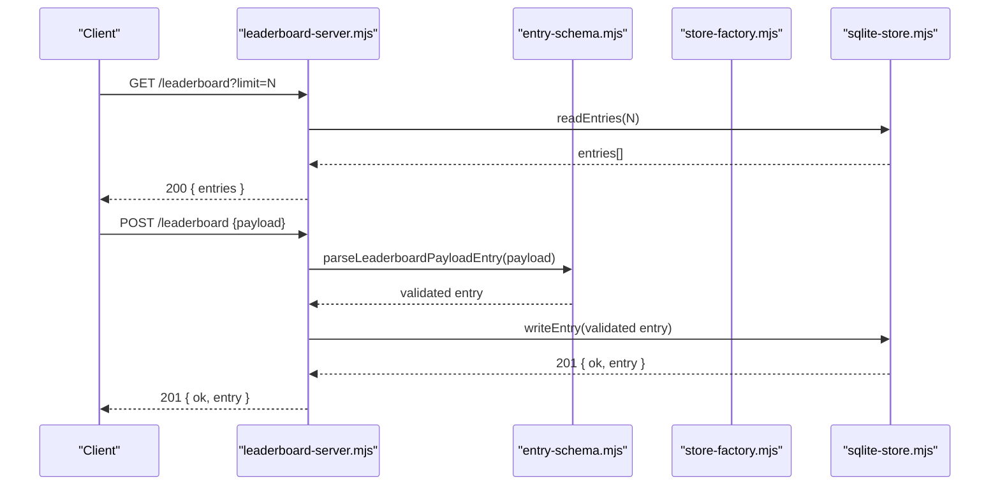

**Diagram sources**
- [leaderboard-server.mjs:117-153](file://tools/leaderboard-server.mjs#L117-L153)
- [entry-schema.mjs:18-90](file://tools/leaderboard/entry-schema.mjs#L18-L90)
- [store-factory.mjs:16-24](file://tools/leaderboard/store-factory.mjs#L16-L24)
- [sqlite-store.mjs:391-399](file://tools/leaderboard/sqlite-store.mjs#L391-L399)

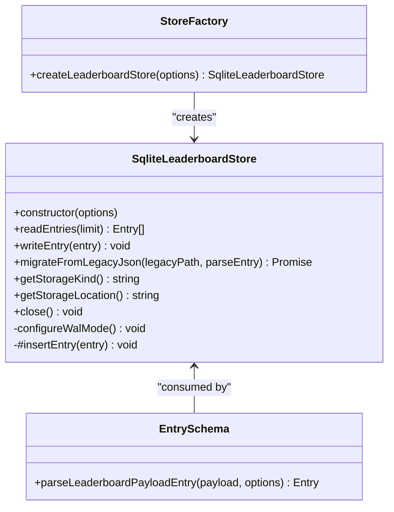

**Diagram sources**
- [sqlite-store.mjs:150-531](file://tools/leaderboard/sqlite-store.mjs#L150-L531)
- [store-factory.mjs:1-25](file://tools/leaderboard/store-factory.mjs#L1-L25)
- [entry-schema.mjs:1-91](file://tools/leaderboard/entry-schema.mjs#L1-L91)

**Section sources**
- [leaderboard-server.mjs:1-161](file://tools/leaderboard-server.mjs#L1-L161)
- [entry-schema.mjs:1-91](file://tools/leaderboard/entry-schema.mjs#L1-L91)
- [sqlite-store.mjs:1-531](file://tools/leaderboard/sqlite-store.mjs#L1-L531)
- [store-factory.mjs:1-25](file://tools/leaderboard/store-factory.mjs#L1-L25)

## Automated Visual Testing Suite

### Overview
The project includes a comprehensive suite of automated visual testing utilities designed for rapid prototyping, debugging, and quality assurance. These scripts leverage Playwright to automate browser interactions and capture visual evidence of UI behavior.

### Variant Testing Script (_experiment.mjs)
Purpose: Test different visual variants and CSS transformations to validate rendering across different perspectives and styling approaches.

Key Features:
- Launches Chromium browser with specific viewport and device scale factor
- Navigates to the application and starts an Easy game
- Applies multiple CSS variants including tilt, isometric, and shadow stack effects
- Captures screenshots for each variant and removes temporary styles

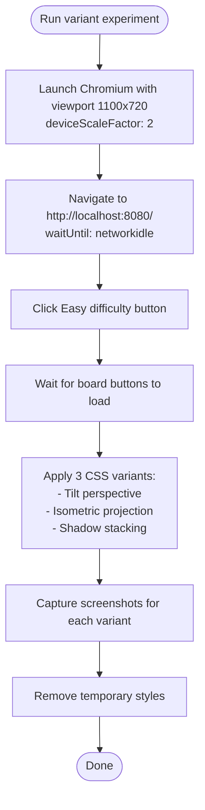

**Diagram sources**
- [_experiment.mjs:1-23](file://_experiment.mjs#L1-L23)

**Section sources**
- [_experiment.mjs:1-23](file://_experiment.mjs#L1-L23)

### Animation Capture Script (_flip.mjs)
Purpose: Capture intermediate states of tile flip animations to verify timing and visual transitions.

Key Features:
- Launches browser and navigates to the application
- Starts a game and clicks the first tile to trigger flip animation
- Waits for mid-flip state (230ms) and captures screenshot
- Waits for settled state (600ms) and captures final screenshot

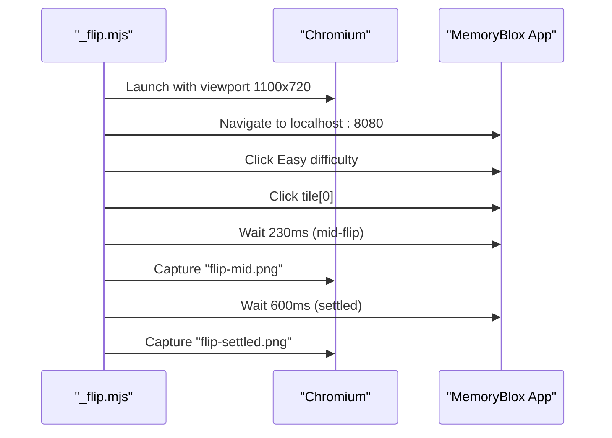

**Diagram sources**
- [_flip.mjs:1-17](file://_flip.mjs#L1-L17)

**Section sources**
- [_flip.mjs:1-17](file://_flip.mjs#L1-L17)

### Computed Style Debugging Scripts

#### Probe Script (_probe.mjs)
Purpose: Inspect computed styles of tile elements to debug CSS transforms and positioning.

Key Features:
- Retrieves and logs computed styles for board, tiles, and face elements
- Captures transform properties, display states, dimensions, and background properties
- Exports detailed style information for debugging layout issues

#### Probe2 Script (_probe2.mjs)
Purpose: Analyze background positioning and sizing for multiple tile positions.

Key Features:
- Samples background properties across multiple tile positions (0, 1, 2, 7, 15, 29)
- Captures background-position and background-size for front faces
- Extracts tile-index property for validation

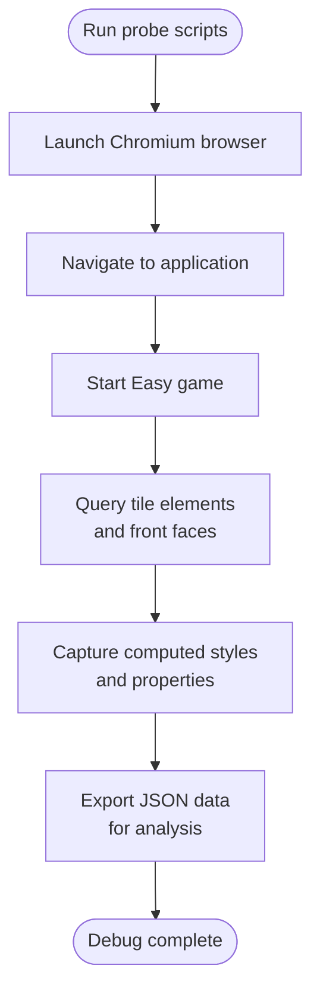

**Diagram sources**
- [_probe.mjs:1-29](file://_probe.mjs#L1-L29)
- [_probe2.mjs:1-19](file://_probe2.mjs#L1-L19)

**Section sources**
- [_probe.mjs:1-29](file://_probe.mjs#L1-L29)
- [_probe2.mjs:1-19](file://_probe2.mjs#L1-L19)

### Comprehensive Screenshot Workflow (_shot.mjs)
Purpose: Create a complete visual documentation workflow capturing different game states.

Key Features:
- Launches browser and navigates to the application
- Starts an Easy game and waits for board initialization
- Captures rest state, flipped state, and cropped board views
- Supports custom output filename via command-line argument

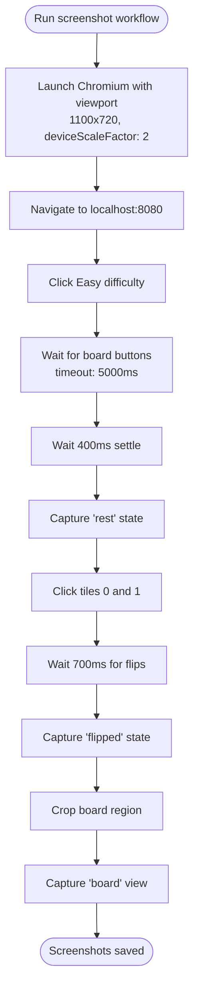

**Diagram sources**
- [_shot.mjs:1-29](file://_shot.mjs#L1-L29)

**Section sources**
- [_shot.mjs:1-29](file://_shot.mjs#L1-L29)

## Dependency Analysis
Tooling dependencies and relationships:
- npm scripts orchestrate artifact generation and testing.
- Vite dev server serves SVG assets and copies icon assets to dist/.
- ESLint targets tools/**/*.mjs and tools/**/*.ts with Node globals.
- Vitest excludes tools/ from coverage and focuses on src/ and tests/.
- Playwright runs E2E tests against the Vite preview server.
- **New visual testing utilities depend on Playwright for browser automation and screenshot capture.**

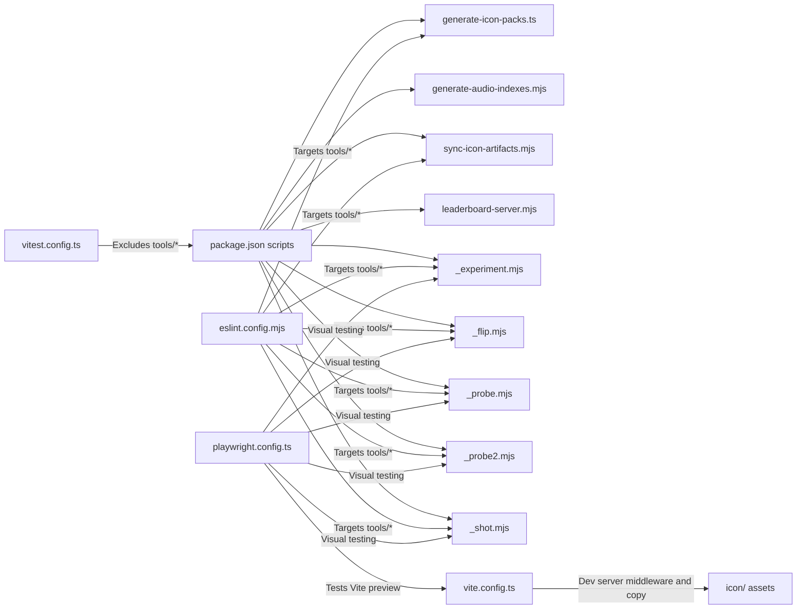

**Diagram sources**
- [package.json:1-1](file://package.json#L1-L1)
- [vite.config.ts:11-61](file://vite.config.ts#L11-L61)
- [eslint.config.mjs:33-47](file://eslint.config.mjs#L33-L47)
- [vitest.config.ts:16-28](file://vitest.config.ts#L16-L28)
- [playwright.config.ts:45-49](file://playwright.config.ts#L45-L49)
- [_experiment.mjs:1-23](file://_experiment.mjs#L1-L23)
- [_flip.mjs:1-17](file://_flip.mjs#L1-L17)
- [_probe.mjs:1-29](file://_probe.mjs#L1-L29)
- [_probe2.mjs:1-19](file://_probe2.mjs#L1-L19)
- [_shot.mjs:1-29](file://_shot.mjs#L1-L29)

**Section sources**
- [package.json:1-1](file://package.json#L1-L1)
- [vite.config.ts:1-80](file://vite.config.ts#L1-L80)
- [eslint.config.mjs:1-49](file://eslint.config.mjs#L1-L49)
- [vitest.config.ts:1-31](file://vitest.config.ts#L1-L31)
- [playwright.config.ts:1-51](file://playwright.config.ts#L1-L51)

## Performance Considerations
- Icon pack generator:
  - Metadata caching avoids repeated network fetches.
  - Seeded randomization ensures reproducibility without impacting performance.
  - Sorting and shuffling are bounded by pack sizes and configured quotas.
- Audio index generator:
  - Single-pass directory scanning and sorting; minimal memory overhead.
- Leaderboard SQLite store:
  - WAL mode is configured via pragmas; warnings are logged if unsupported.
  - Retention trimming uses a windowed ranking to efficiently prune older entries.
  - One-time legacy migration builds an identity set to deduplicate entries; memory estimates are logged for large retention limits.
- **Visual testing utilities**:
  - Browser launch and navigation overhead is amortized across multiple test runs.
  - Screenshot capture is optimized with deviceScaleFactor for crisp visuals.
  - Timing delays are carefully tuned to capture meaningful animation states.

## Troubleshooting Guide
Common issues and resolutions:
- Icon pack generator errors:
  - Ratio validation failures indicate emojiRatio + svgRatio != 1 or iconsPerPack <= 0.
  - Unknown source IDs or missing packs in catalog cause immediate errors.
  - Network failures when fetching metadata or downloading SVGs will abort the run.
- Audio index generator:
  - Missing or invalid audio-formats.json will cause parsing errors; ensure extensions array is valid.
- Icon artifacts sync:
  - If EMOJI_PACKS cannot be located in src/icons.ts, the script throws an error indicating manual inspection is required.
- Config validator:
  - Missing required files or invalid key=value lines will fail fast with specific messages.
  - Deprecated keys in win-fx.cfg will cause failures; remove them before re-running.
- Leaderboard server:
  - Request body too large triggers a 400 error; keep payloads compact.
  - Empty request bodies are rejected; ensure JSON payloads are provided.
  - Migration warnings indicate potential memory usage during large retention migrations; adjust retention limits if needed.
  - WAL mode warnings suggest filesystem or SQLite build limitations; verify permissions and filesystem capabilities.
- **Visual testing utilities**:
  - Playwright installation issues: ensure `@playwright/test` is installed and browsers are available.
  - Application not running: verify Vite dev server is running on port 8080 before executing scripts.
  - Screenshot path permissions: ensure write permissions to the specified output directory.
  - Timing issues: adjust waitForTimeout values if animation states are not captured correctly.
  - CSS selector failures: verify DOM structure hasn't changed; update selectors in test scripts accordingly.

**Section sources**
- [generate-icon-packs.ts:141-149](file://tools/generate-icon-packs.ts#L141-L149)
- [generate-icon-packs.ts:384-396](file://tools/generate-icon-packs.ts#L384-L396)
- [generate-audio-indexes.mjs:11-20](file://tools/generate-audio-indexes.mjs#L11-L20)
- [sync-icon-artifacts.mjs:23-32](file://tools/sync-icon-artifacts.mjs#L23-L32)
- [validate-config.sh:24-30](file://tools/validate-config.sh#L24-L30)
- [validate-config.sh:48-52](file://tools/validate-config.sh#L48-L52)
- [leaderboard-server.mjs:80-96](file://tools/leaderboard-server.mjs#L80-L96)
- [sqlite-store.mjs:303-337](file://tools/leaderboard/sqlite-store.mjs#L303-L337)
- [sqlite-store.mjs:474-484](file://tools/leaderboard/sqlite-store.mjs#L474-L484)
- [_experiment.mjs:1-23](file://_experiment.mjs#L1-L23)
- [_flip.mjs:1-17](file://_flip.mjs#L1-L17)
- [_probe.mjs:1-29](file://_probe.mjs#L1-L29)
- [_probe2.mjs:1-19](file://_probe2.mjs#L1-L19)
- [_shot.mjs:1-29](file://_shot.mjs#L1-L29)

## Conclusion
The development toolchain provides robust automation for asset generation, configuration validation, and leaderboard persistence. The addition of comprehensive visual testing utilities significantly enhances the development workflow by enabling rapid prototyping, debugging, and quality assurance through automated browser interaction and screenshot capture. These tools integrate seamlessly with the existing build and test pipeline, enabling repeatable development workflows and maintainable asset catalogs. Extending the tooling involves adding new scripts, updating npm scripts, and ensuring proper linting and coverage policies.

## Appendices

### Practical Usage Examples
- Generate icon packs:
  - Run the TypeScript generator with a custom config path and seed for reproducibility.
  - Example invocation path: [tools/generate-icon-packs.ts:351-474](file://tools/generate-icon-packs.ts#L351-L474)
- Update audio indices:
  - Execute the audio index generator to refresh index.json files.
  - Example invocation path: [tools/generate-audio-indexes.mjs:51-58](file://tools/generate-audio-indexes.mjs#L51-L58)
- Sync icon artifacts:
  - Regenerate catalog and inventory documentation from the canonical source.
  - Example invocation path: [tools/sync-icon-artifacts.mjs:126-142](file://tools/sync-icon-artifacts.mjs#L126-L142)
- Validate runtime configs:
  - Run the shell validator to check required files, syntax, required keys, and deprecations.
  - Example invocation path: [tools/validate-config.sh:24-30](file://tools/validate-config.sh#L24-L30)
- Start leaderboard server:
  - Launch the HTTP server with optional environment overrides for port, host, driver, and retention.
  - Example invocation path: [tools/leaderboard-server.mjs:117-153](file://tools/leaderboard-server.mjs#L117-L153)
- **Run visual testing utilities**:
  - Execute variant experiments: `node _experiment.mjs`
  - Capture flip animations: `node _flip.mjs`
  - Debug computed styles: `node _probe.mjs` and `node _probe2.mjs`
  - Generate comprehensive screenshots: `node _shot.mjs board.png`
  - All scripts require the Vite dev server to be running on port 8080.

### Extending Tool Functionality
- Add a new tool:
  - Place the script under tools/ with appropriate file extension (.mjs for Node modules, .ts for TypeScript).
  - Configure ESLint language options for tools/*. See [eslint.config.mjs:33-47](file://eslint.config.mjs#L33-L47).
  - Add an npm script alias in [package.json:1-1](file://package.json#L1-L1) to integrate with the pipeline.
- **Add visual testing utilities**:
  - Create new scripts in the project root directory (e.g., `_new-test.mjs`) for rapid prototyping.
  - Import Playwright and use the same browser configuration patterns as existing scripts.
  - Leverage existing Playwright configuration for consistent testing environments.
- Modify asset generation:
  - Update [config/icon-pack-generator.json:1-67](file://config/icon-pack-generator.json#L1-L67) to change ratios, sources, or packs.
  - Re-run the icon pack generator and rebuild the app to consume new assets.
- Extend leaderboard features:
  - Add new fields to the schema in [entry-schema.mjs:18-90](file://tools/leaderboard/entry-schema.mjs#L18-L90).
  - Update [sqlite-store.mjs:48-75](file://tools/leaderboard/sqlite-store.mjs#L48-L75) with new table columns and indexes.
  - Update [store-factory.mjs:16-24](file://tools/leaderboard/store-factory.mjs#L16-L24) and server handlers accordingly.

### Maintaining the Build Pipeline
- Linting:
  - Run ESLint across the project; tools are linted with Node globals.
  - See [eslint.config.mjs:33-47](file://eslint.config.mjs#L33-L47).
- Unit tests:
  - Exclude tools from coverage; focus on application and test code.
  - See [vitest.config.ts:16-28](file://vitest.config.ts#L16-L28).
- E2E tests:
  - Configure Playwright to test mobile-browser scenarios against the Vite preview server.
  - See [playwright.config.ts:45-49](file://playwright.config.ts#L45-L49).
- Asset bundling:
  - Vite copies icon assets to dist/ and serves them via middleware during development.
  - See [vite.config.ts:41-61](file://vite.config.ts#L41-L61).
- **Visual testing integration**:
  - Visual testing utilities leverage the existing Playwright configuration for consistent browser automation.
  - Scripts can be executed independently of the main test suite for rapid debugging cycles.
  - Screenshot outputs are written to local temp directories for quick iteration and review.

### Visual Testing Best Practices
- **Timing and State Management**: Use appropriate waitForTimeout values to capture meaningful animation states.
- **CSS Debugging**: Utilize probe scripts to inspect computed styles and verify CSS property values.
- **Screenshot Strategy**: Combine rest, mid-animation, and final states to comprehensively document UI behavior.
- **Cross-Platform Validation**: Test variants across different viewport sizes and device scale factors.
- **Automation Integration**: Incorporate visual tests into the quality gate alongside unit and E2E tests.

**Section sources**
- [testing-strategy.md:1-117](file://docs/testing-strategy.md#L1-L117)
- [_experiment.mjs:1-23](file://_experiment.mjs#L1-L23)
- [_flip.mjs:1-17](file://_flip.mjs#L1-L17)
- [_probe.mjs:1-29](file://_probe.mjs#L1-L29)
- [_probe2.mjs:1-19](file://_probe2.mjs#L1-L19)
- [_shot.mjs:1-29](file://_shot.mjs#L1-L29)