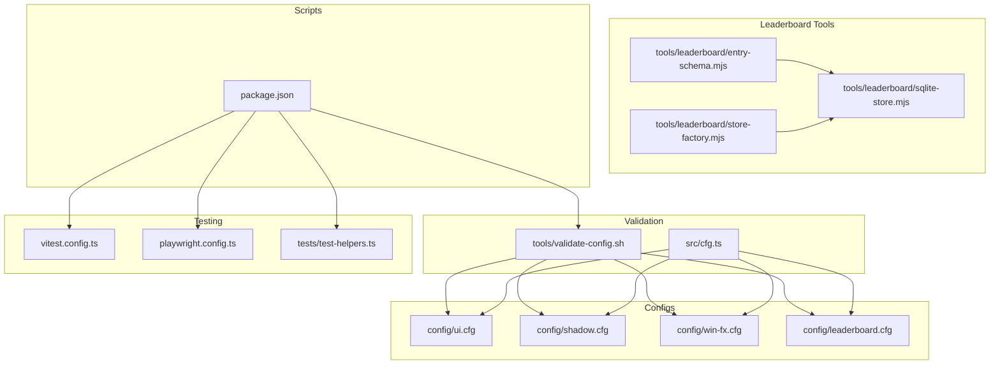
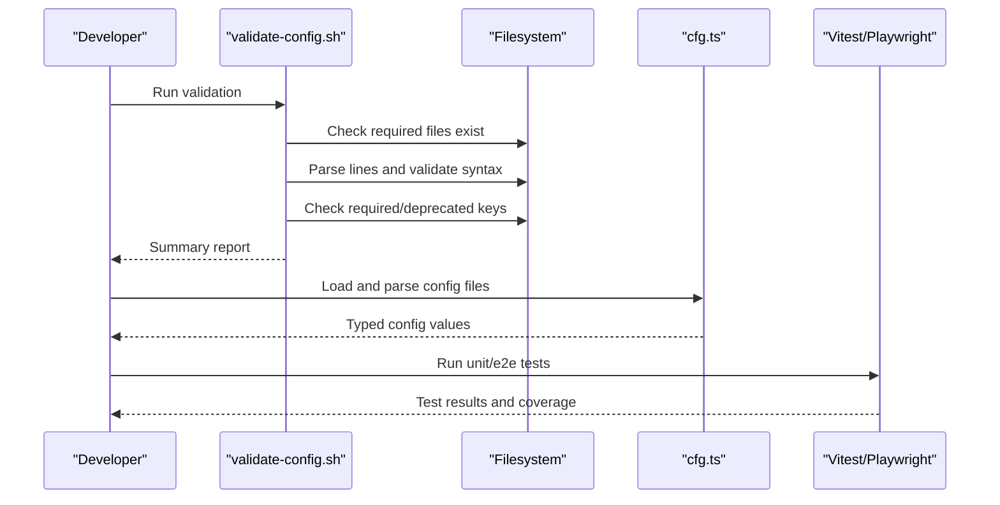
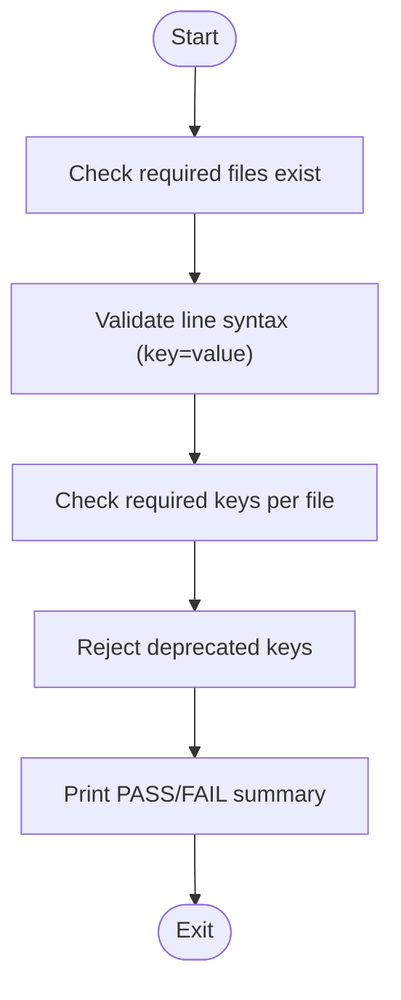
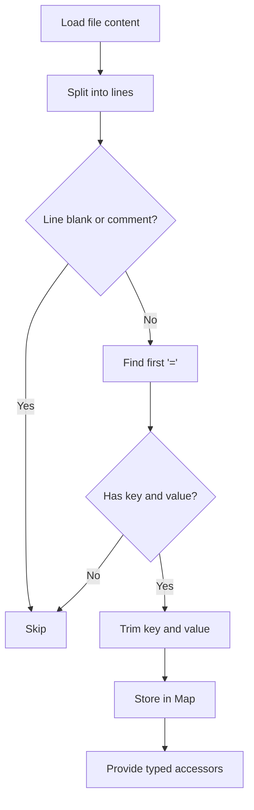
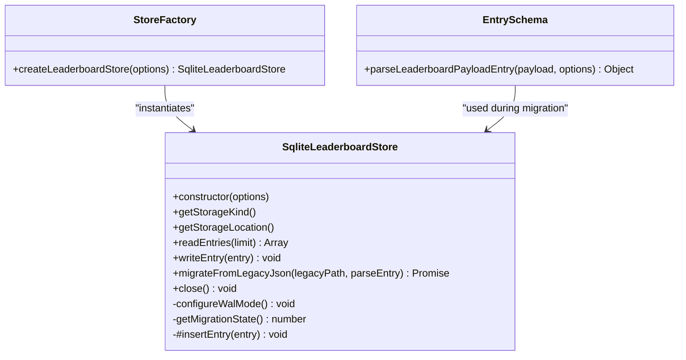
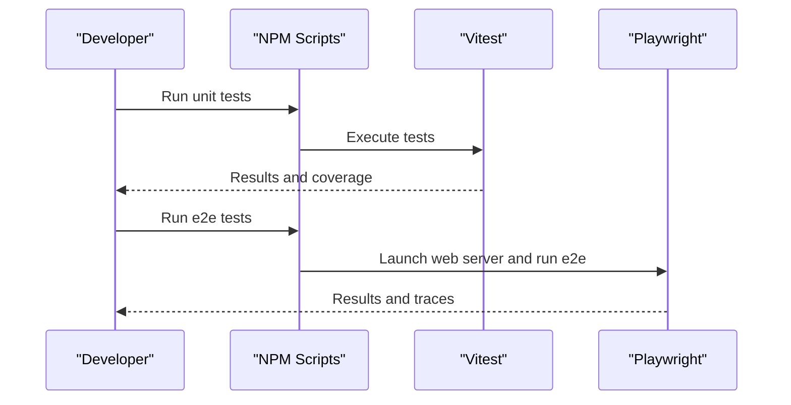
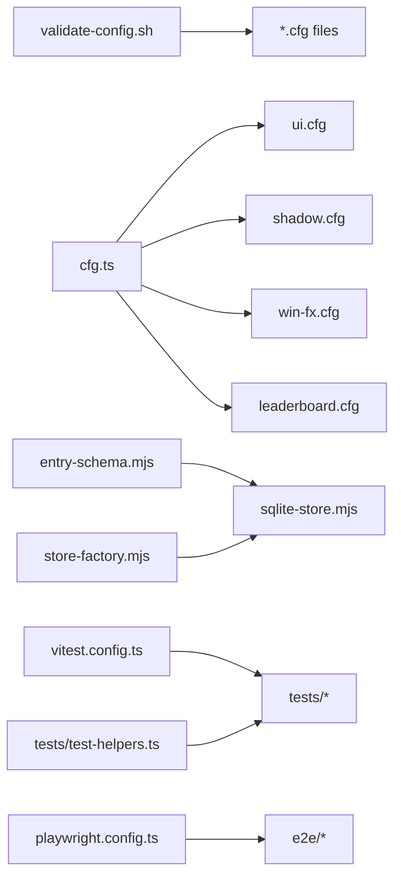

# Validation and Testing Tools

<cite>
**Referenced Files in This Document**
- [validate-config.sh](file://tools/validate-config.sh)
- [cfg.ts](file://src/cfg.ts)
- [entry-schema.mjs](file://tools/leaderboard/entry-schema.mjs)
- [sqlite-store.mjs](file://tools/leaderboard/sqlite-store.mjs)
- [store-factory.mjs](file://tools/leaderboard/store-factory.mjs)
- [ui.cfg](file://config/ui.cfg)
- [shadow.cfg](file://config/shadow.cfg)
- [win-fx.cfg](file://config/win-fx.cfg)
- [leaderboard.cfg](file://config/leaderboard.cfg)
- [test-helpers.ts](file://tests/test-helpers.ts)
- [vitest.config.ts](file://vitest.config.ts)
- [playwright.config.ts](file://playwright.config.ts)
- [package.json](file://package.json)
</cite>

## Table of Contents
1. [Introduction](#introduction)
2. [Project Structure](#project-structure)
3. [Core Components](#core-components)
4. [Architecture Overview](#architecture-overview)
5. [Detailed Component Analysis](#detailed-component-analysis)
6. [Dependency Analysis](#dependency-analysis)
7. [Performance Considerations](#performance-considerations)
8. [Troubleshooting Guide](#troubleshooting-guide)
9. [Conclusion](#conclusion)
10. [Appendices](#appendices)

## Introduction
This document explains the validation and testing tools used to verify configuration correctness and maintain quality assurance across the project. It covers:
- A shell script that validates configuration files for existence, syntax, required keys, and deprecated keys.
- Runtime configuration parsing utilities that load and interpret key-value pairs.
- Automated testing utilities for unit and end-to-end testing, including helpers for deterministic randomness.
- Continuous integration readiness via npm scripts that orchestrate linting, type-checking, markdown linting, unit tests, and e2e tests.
- Practical examples for running validations, interpreting results, and integrating checks into CI/CD pipelines.
- Troubleshooting guidance for configuration errors, validation failures, and testing environment setup.

## Project Structure
The validation and testing ecosystem spans several areas:
- Shell-based configuration validation in tools/validate-config.sh.
- Runtime configuration parsing in src/cfg.ts.
- Leaderboard data validation and persistence in tools/leaderboard/*.
- Unit and e2e testing infrastructure in tests/, vitest.config.ts, and playwright.config.ts.
- NPM scripts in package.json that wire everything together.

**Diagram sources**
- [validate-config.sh](file://tools/validate-config.sh)
- [cfg.ts](file://src/cfg.ts)
- [ui.cfg](file://config/ui.cfg)
- [shadow.cfg](file://config/shadow.cfg)
- [win-fx.cfg](file://config/win-fx.cfg)
- [leaderboard.cfg](file://config/leaderboard.cfg)
- [entry-schema.mjs](file://tools/leaderboard/entry-schema.mjs)
- [sqlite-store.mjs](file://tools/leaderboard/sqlite-store.mjs)
- [store-factory.mjs](file://tools/leaderboard/store-factory.mjs)
- [vitest.config.ts](file://vitest.config.ts)
- [playwright.config.ts](file://playwright.config.ts)
- [test-helpers.ts](file://tests/test-helpers.ts)
- [package.json](file://package.json)

**Section sources**
- [validate-config.sh](file://tools/validate-config.sh)
- [cfg.ts](file://src/cfg.ts)
- [ui.cfg](file://config/ui.cfg)
- [shadow.cfg](file://config/shadow.cfg)
- [win-fx.cfg](file://config/win-fx.cfg)
- [leaderboard.cfg](file://config/leaderboard.cfg)
- [entry-schema.mjs](file://tools/leaderboard/entry-schema.mjs)
- [sqlite-store.mjs](file://tools/leaderboard/sqlite-store.mjs)
- [store-factory.mjs](file://tools/leaderboard/store-factory.mjs)
- [vitest.config.ts](file://vitest.config.ts)
- [playwright.config.ts](file://playwright.config.ts)
- [test-helpers.ts](file://tests/test-helpers.ts)
- [package.json](file://package.json)

## Core Components
- Configuration validation script: Ensures required files exist, enforces key=value syntax, verifies required keys per file, and rejects deprecated keys.
- Runtime configuration parser: Loads and parses key-value pairs from text files, with typed accessors and fallbacks.
- Leaderboard data validation: Normalizes and validates leaderboard entries, with warnings for negative values and strict field validation.
- SQLite-backed leaderboard store: Provides robust persistence, WAL mode configuration, migration from legacy JSON, and trimming to configured limits.
- Test harness: Unit tests via Vitest and e2e tests via Playwright, with deterministic randomness helpers.
- CI-ready scripts: NPM scripts to run linting, type-checking, markdown linting, unit tests, e2e tests, and combined quality checks.

**Section sources**
- [validate-config.sh](file://tools/validate-config.sh)
- [cfg.ts](file://src/cfg.ts)
- [entry-schema.mjs](file://tools/leaderboard/entry-schema.mjs)
- [sqlite-store.mjs](file://tools/leaderboard/sqlite-store.mjs)
- [store-factory.mjs](file://tools/leaderboard/store-factory.mjs)
- [vitest.config.ts](file://vitest.config.ts)
- [playwright.config.ts](file://playwright.config.ts)
- [test-helpers.ts](file://tests/test-helpers.ts)
- [package.json](file://package.json)

## Architecture Overview
The validation pipeline integrates shell-based checks with runtime parsing and automated tests. The leaderboard tools encapsulate data validation and persistence, while the testing framework ensures behavioral correctness.

**Diagram sources**
- [validate-config.sh](file://tools/validate-config.sh)
- [cfg.ts](file://src/cfg.ts)
- [vitest.config.ts](file://vitest.config.ts)
- [playwright.config.ts](file://playwright.config.ts)

## Detailed Component Analysis

### Shell Configuration Validator
The validator performs four checks:
- Existence: Confirms required files are present.
- Syntax: Enforces key=value format with support for comments and blank lines.
- Required keys: Verifies presence of mandatory keys per file.
- Deprecated keys: Rejects obsolete keys that must be removed.

**Diagram sources**
- [validate-config.sh](file://tools/validate-config.sh)

Practical usage:
- Run the script from the repository root to validate all required configuration files.
- Interpret results: The script prints per-check outcomes and exits with failure if any check fails.

Key configuration files validated:
- [ui.cfg](file://config/ui.cfg)
- [shadow.cfg](file://config/shadow.cfg)
- [win-fx.cfg](file://config/win-fx.cfg)
- [leaderboard.cfg](file://config/leaderboard.cfg)

**Section sources**
- [validate-config.sh](file://tools/validate-config.sh)
- [ui.cfg](file://config/ui.cfg)
- [shadow.cfg](file://config/shadow.cfg)
- [win-fx.cfg](file://config/win-fx.cfg)
- [leaderboard.cfg](file://config/leaderboard.cfg)

### Runtime Configuration Parser
The parser loads key-value pairs from text content, trims whitespace, ignores comments and blank lines, and splits on the first equals sign. It exposes typed accessors for numbers, integers, and booleans with fallback defaults.

**Diagram sources**
- [cfg.ts](file://src/cfg.ts)

Usage highlights:
- Fetch and parse configuration files at runtime.
- Use typed readers to safely extract numbers, integers, and booleans with fallbacks.

**Section sources**
- [cfg.ts](file://src/cfg.ts)

### Leaderboard Data Validation and Persistence
The leaderboard tools provide:
- Entry normalization and validation with warnings for negative values and strict field checks.
- SQLite-backed storage with WAL mode configuration, migration from legacy JSON, and trimming to configured limits.
- Factory to instantiate the store with driver selection.

**Diagram sources**
- [sqlite-store.mjs](file://tools/leaderboard/sqlite-store.mjs)
- [store-factory.mjs](file://tools/leaderboard/store-factory.mjs)
- [entry-schema.mjs](file://tools/leaderboard/entry-schema.mjs)

Operational notes:
- WAL mode is configured via SQLite pragmas; warnings guide operator actions if WAL cannot be enabled.
- Migration from legacy JSON is performed in a single transaction, deduplicates entries, trims to configured limits, and updates migration state.
- The factory supports future driver expansion while currently instantiating the SQLite store.

**Section sources**
- [entry-schema.mjs](file://tools/leaderboard/entry-schema.mjs)
- [sqlite-store.mjs](file://tools/leaderboard/sqlite-store.mjs)
- [store-factory.mjs](file://tools/leaderboard/store-factory.mjs)

### Automated Testing Utilities
Unit and e2e testing are orchestrated via NPM scripts:
- Unit tests: Vitest with coverage provider istanbul and targeted exclusions.
- End-to-end tests: Playwright configured for mobile-device profiles with extended timeouts and screenshots on failure.
- Deterministic randomness helpers: Utilities to mock Math.random for reproducible test outcomes.

**Diagram sources**
- [vitest.config.ts](file://vitest.config.ts)
- [playwright.config.ts](file://playwright.config.ts)
- [test-helpers.ts](file://tests/test-helpers.ts)
- [package.json](file://package.json)

**Section sources**
- [vitest.config.ts](file://vitest.config.ts)
- [playwright.config.ts](file://playwright.config.ts)
- [test-helpers.ts](file://tests/test-helpers.ts)
- [package.json](file://package.json)

## Dependency Analysis
The validation and testing tools depend on:
- Shell script depends on filesystem availability and grep for key checks.
- Runtime parser depends on browser-side fetch and text processing.
- Leaderboard store depends on better-sqlite3 and SQLite pragmas; migration depends on file existence and JSON parsing.
- Tests depend on Vitest and Playwright configurations; deterministic randomness depends on mocking APIs.

**Diagram sources**
- [validate-config.sh](file://tools/validate-config.sh)
- [cfg.ts](file://src/cfg.ts)
- [ui.cfg](file://config/ui.cfg)
- [shadow.cfg](file://config/shadow.cfg)
- [win-fx.cfg](file://config/win-fx.cfg)
- [leaderboard.cfg](file://config/leaderboard.cfg)
- [entry-schema.mjs](file://tools/leaderboard/entry-schema.mjs)
- [sqlite-store.mjs](file://tools/leaderboard/sqlite-store.mjs)
- [store-factory.mjs](file://tools/leaderboard/store-factory.mjs)
- [vitest.config.ts](file://vitest.config.ts)
- [playwright.config.ts](file://playwright.config.ts)
- [test-helpers.ts](file://tests/test-helpers.ts)

**Section sources**
- [validate-config.sh](file://tools/validate-config.sh)
- [cfg.ts](file://src/cfg.ts)
- [entry-schema.mjs](file://tools/leaderboard/entry-schema.mjs)
- [sqlite-store.mjs](file://tools/leaderboard/sqlite-store.mjs)
- [store-factory.mjs](file://tools/leaderboard/store-factory.mjs)
- [vitest.config.ts](file://vitest.config.ts)
- [playwright.config.ts](file://playwright.config.ts)
- [test-helpers.ts](file://tests/test-helpers.ts)

## Performance Considerations
- Configuration validation is lightweight and linear in the number of lines checked.
- Runtime parsing avoids heavy computation; typed accessors provide O(1) lookups.
- Leaderboard store uses prepared statements and indexes to optimize reads and writes.
- WAL mode improves concurrency and write performance; fallback behavior is safe but may reduce throughput.
- Migration memory usage scales with configured retention limits; warnings guide operators to adjust limits or allocate more memory.

[No sources needed since this section provides general guidance]

## Troubleshooting Guide
Common issues and resolutions:
- Configuration file missing: Ensure required files exist in config/. The validator reports missing files explicitly.
- Syntax errors: Confirm each non-blank, non-comment line matches key=value format. The validator flags invalid lines with file and line number.
- Missing required keys: Add the listed required keys for each file. The validator enumerates missing keys per file.
- Deprecated keys present: Remove deprecated keys flagged by the validator to prevent failures.
- Runtime fetch/parsing failures: Network or parsing errors are logged; verify file accessibility and content validity.
- SQLite WAL mode warnings: Check database file permissions, filesystem support, and SQLite/better-sqlite3 build capabilities.
- Migration failures: Inspect logs for transaction rollback messages; ensure sufficient memory and correct legacy JSON structure.
- Test flakiness: Use deterministic randomness helpers to stabilize tests; review timeouts and device profiles in Playwright configuration.
- CI failures: Run the quality scripts locally to reproduce issues; verify Node.js version and dependency installation.

**Section sources**
- [validate-config.sh](file://tools/validate-config.sh)
- [cfg.ts](file://src/cfg.ts)
- [sqlite-store.mjs](file://tools/leaderboard/sqlite-store.mjs)
- [playwright.config.ts](file://playwright.config.ts)
- [test-helpers.ts](file://tests/test-helpers.ts)

## Conclusion
The project’s validation and testing tools provide a robust foundation for configuration verification and quality assurance. The shell validator ensures configuration integrity, the runtime parser enables safe typed access, the leaderboard tools enforce data correctness and persistence, and the testing framework guarantees behavioral reliability. Integrating these tools into CI/CD pipelines increases confidence in releases and reduces regressions.

[No sources needed since this section summarizes without analyzing specific files]

## Appendices

### Running Validation and Tests
- Run configuration validation: Execute the shell script from the repository root to validate required files, syntax, required keys, and deprecated keys.
- Run unit tests: Use the configured test runner to execute unit tests and collect coverage.
- Run e2e tests: Launch e2e tests against mobile device profiles with appropriate timeouts and tracing.
- Quality checks: Use the provided NPM scripts to run linting, type-checking, markdown linting, unit tests, and e2e tests in sequence.

**Section sources**
- [validate-config.sh](file://tools/validate-config.sh)
- [vitest.config.ts](file://vitest.config.ts)
- [playwright.config.ts](file://playwright.config.ts)
- [package.json](file://package.json)