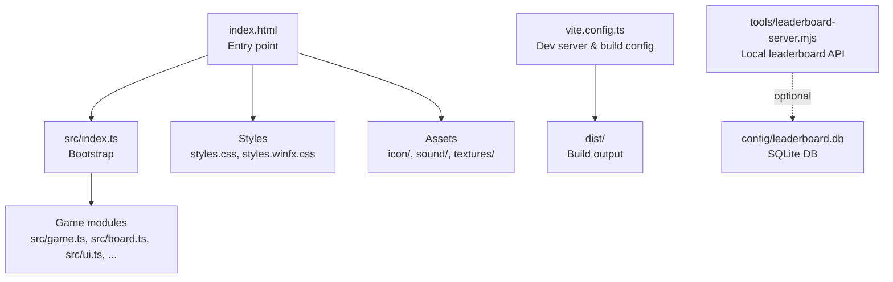
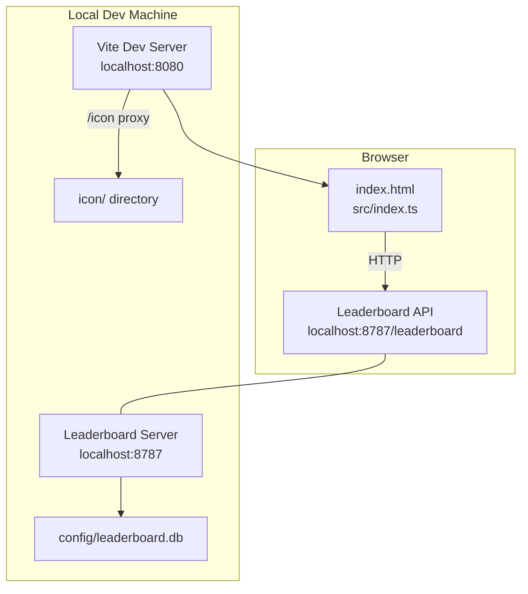
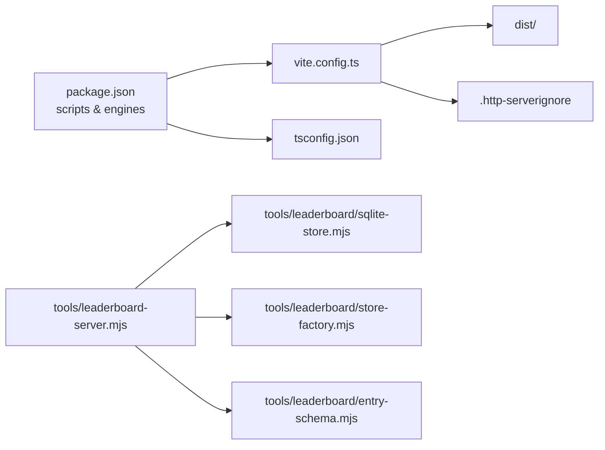

# Getting Started

<cite>
**Referenced Files in This Document**
- [README.md](file://README.md)
- [package.json](file://package.json)
- [vite.config.ts](file://vite.config.ts)
- [index.html](file://index.html)
- [tools/leaderboard-server.mjs](file://tools/leaderboard-server.mjs)
- [tools/leaderboard/sqlite-store.mjs](file://tools/leaderboard/sqlite-store.mjs)
- [tools/leaderboard/store-factory.mjs](file://tools/leaderboard/store-factory.mjs)
- [tools/leaderboard/entry-schema.mjs](file://tools/leaderboard/entry-schema.mjs)
- [tools/validate-config.sh](file://tools/validate-config.sh)
- [.http-serverignore](file://.http-serverignore)
- [.github/workflows/pages.yml](file://.github/workflows/pages.yml)
- [tsconfig.json](file://tsconfig.json)
</cite>

## Table of Contents
1. [Introduction](#introduction)
2. [Project Structure](#project-structure)
3. [Core Components](#core-components)
4. [Architecture Overview](#architecture-overview)
5. [Detailed Component Analysis](#detailed-component-analysis)
6. [Dependency Analysis](#dependency-analysis)
7. [Performance Considerations](#performance-considerations)
8. [Troubleshooting Guide](#troubleshooting-guide)
9. [Conclusion](#conclusion)
10. [Appendices](#appendices)

## Introduction
This guide helps you quickly install, build, and run MemoryBlox locally, including setting up the development server, building the project, and optionally running a local leaderboard server for persistent high scores. It also covers deployment to GitHub Pages and provides troubleshooting tips.

## Project Structure
MemoryBlox is a browser-based game built with TypeScript, HTML, and CSS. The repository includes:
- Source code under src/
- Assets under icon/, sound/, textures/
- Tooling under tools/ (including the leaderboard server)
- Configuration under config/
- Build and dev tooling via Vite and npm scripts

**Diagram sources**
- [index.html:193](file://index.html#L193)
- [vite.config.ts:64-80](file://vite.config.ts#L64-L80)
- [tools/leaderboard-server.mjs:155-161](file://tools/leaderboard-server.mjs#L155-L161)

**Section sources**
- [README.md:162-206](file://README.md#L162-L206)
- [index.html:1-196](file://index.html#L1-L196)
- [vite.config.ts:1-80](file://vite.config.ts#L1-L80)

## Core Components
- Application entry and bootstrapping: index.html loads src/index.ts as a module.
- Build and dev server: Vite handles development server, hot reload, and bundling.
- Leaderboard service: A standalone Node.js HTTP server that persists scores to SQLite.
- Configuration: Runtime configuration files under config/ validated by a shell script.

Key references:
- [index.html:193](file://index.html#L193)
- [vite.config.ts:7-80](file://vite.config.ts#L7-L80)
- [tools/leaderboard-server.mjs:1-161](file://tools/leaderboard-server.mjs#L1-L161)
- [tools/validate-config.sh:1-129](file://tools/validate-config.sh#L1-L129)

**Section sources**
- [index.html:193](file://index.html#L193)
- [vite.config.ts:7-80](file://vite.config.ts#L7-L80)
- [tools/leaderboard-server.mjs:1-161](file://tools/leaderboard-server.mjs#L1-L161)
- [tools/validate-config.sh:1-129](file://tools/validate-config.sh#L1-L129)

## Architecture Overview
The app runs in the browser and optionally communicates with a local leaderboard API. The development server serves the app and exposes an /icon proxy route for SVG assets. The leaderboard server persists entries to a SQLite database.

**Diagram sources**
- [index.html:193](file://index.html#L193)
- [vite.config.ts:18-40](file://vite.config.ts#L18-L40)
- [tools/leaderboard-server.mjs:117-153](file://tools/leaderboard-server.mjs#L117-L153)

**Section sources**
- [index.html:193](file://index.html#L193)
- [vite.config.ts:18-40](file://vite.config.ts#L18-L40)
- [tools/leaderboard-server.mjs:117-153](file://tools/leaderboard-server.mjs#L117-L153)

## Detailed Component Analysis

### Installation Prerequisites
- Node.js: The project declares a minimum Node.js version requirement. Ensure your environment meets this requirement before installing dependencies.
- OS: The project is developed and tested on Unix-like environments; Windows users should use a compatible shell or WSL for scripts.

References:
- [package.json:1-1](file://package.json#L1)
- [tsconfig.json:3-17](file://tsconfig.json#L3-L17)

**Section sources**
- [package.json:1-1](file://package.json#L1)
- [tsconfig.json:3-17](file://tsconfig.json#L3-L17)

### Step-by-Step Installation
1. Install dependencies
   - Run the standard install command to fetch all required packages.
   - Reference: [README.md:55-58](file://README.md#L55-L58)

2. Build the project
   - Build compiles TypeScript and bundles assets into dist/.
   - Reference: [README.md:55-58](file://README.md#L55-L58)

3. Optional: Generate artifacts
   - The project includes scripts to generate audio indexes and synchronize icon artifacts. These are included in the build pipeline.
   - References:
     - [package.json:1-1](file://package.json#L1)
     - [README.md:125-131](file://README.md#L125-L131)

Verification:
- After installation, confirm that dist/ exists post-build and that the app opens locally.

**Section sources**
- [README.md:55-58](file://README.md#L55-L58)
- [README.md:125-131](file://README.md#L125-L131)
- [package.json:1-1](file://package.json#L1)

### Build Process
- Build output directory: dist/
- Base path for GitHub Pages deployment: /mb/
- Dev server and preview ports: 8080
- Asset handling: Vite copies icon assets into dist/ and provides an /icon proxy for development.

References:
- [vite.config.ts:66-79](file://vite.config.ts#L66-L79)
- [vite.config.ts:41-62](file://vite.config.ts#L41-L62)
- [index.html:193](file://index.html#L193)

**Section sources**
- [vite.config.ts:66-79](file://vite.config.ts#L66-L79)
- [vite.config.ts:41-62](file://vite.config.ts#L41-L62)
- [index.html:193](file://index.html#L193)

### Development Server Setup
- Standard development mode
  - Starts the Vite dev server and the local leaderboard server concurrently.
  - Access the app at the dev server’s address.
  - References:
    - [README.md:79-84](file://README.md#L79-L84)
    - [package.json:1-1](file://package.json#L1)

- Full development mode
  - Alias of standard development mode.
  - Reference: [README.md:80-80](file://README.md#L80-L80)

- Preview mode
  - Serves the built app locally with caching disabled for development.
  - Reference: [README.md:82-84](file://README.md#L82-L84)

- Development-only warnings
  - These commands must not be used as a production hosting setup.
  - References:
    - [README.md:75-89](file://README.md#L75-L89)
    - [.http-serverignore:1-4](file://.http-serverignore#L1-L4)

**Section sources**
- [README.md:75-89](file://README.md#L75-L89)
- [README.md:79-84](file://README.md#L79-L84)
- [README.md:82-84](file://README.md#L82-L84)
- [README.md:86-89](file://README.md#L86-L89)
- [package.json:1-1](file://package.json#L1)
- [.http-serverignore:1-4](file://.http-serverignore#L1-L4)

### Local Leaderboard Server
Purpose:
- Provides a local HTTP API for retrieving and submitting leaderboard entries.
- Persists entries to a SQLite database file.

How it works:
- Endpoint: GET/POST /leaderboard
- Persistence: SQLite database at config/leaderboard.db (created on first run)
- Storage abstraction: A factory creates a SQLite-backed store.
- Request validation: Payloads are parsed and validated; oversized requests are rejected.
- CORS: Enabled for development.

Environment variables:
- LEADERBOARD_PORT: TCP port for the server (default 8787)
- LEADERBOARD_HOST: Bind host (default 0.0.0.0)
- LEADERBOARD_DB_DRIVER: Storage driver (default sqlite)
- LEADERBOARD_RETENTION: Maximum entries to keep (default 100)

References:
- [tools/leaderboard-server.mjs:8-54](file://tools/leaderboard-server.mjs#L8-L54)
- [tools/leaderboard-server.mjs:117-153](file://tools/leaderboard-server.mjs#L117-L153)
- [tools/leaderboard/store-factory.mjs:16-24](file://tools/leaderboard/store-factory.mjs#L16-L24)
- [tools/leaderboard/sqlite-store.mjs:150-285](file://tools/leaderboard/sqlite-store.mjs#L150-L285)
- [tools/leaderboard/entry-schema.mjs:18-90](file://tools/leaderboard/entry-schema.mjs#L18-L90)

**Section sources**
- [tools/leaderboard-server.mjs:8-54](file://tools/leaderboard-server.mjs#L8-L54)
- [tools/leaderboard-server.mjs:117-153](file://tools/leaderboard-server.mjs#L117-L153)
- [tools/leaderboard/store-factory.mjs:16-24](file://tools/leaderboard/store-factory.mjs#L16-L24)
- [tools/leaderboard/sqlite-store.mjs:150-285](file://tools/leaderboard/sqlite-store.mjs#L150-L285)
- [tools/leaderboard/entry-schema.mjs:18-90](file://tools/leaderboard/entry-schema.mjs#L18-L90)

### Accessing the Game Locally
- After building, open index.html in a browser.
- During development, the Vite dev server serves the app at the configured port.
- The leaderboard server runs separately on its own port.

References:
- [README.md:60-61](file://README.md#L60-L61)
- [vite.config.ts:71-78](file://vite.config.ts#L71-L78)

**Section sources**
- [README.md:60-61](file://README.md#L60-L61)
- [vite.config.ts:71-78](file://vite.config.ts#L71-L78)

### Deployment Options
- GitHub Pages
  - The workflow builds the app, validates configuration, and uploads the site artifact.
  - The build sets a base path appropriate for GitHub Pages.
  - References:
    - [.github/workflows/pages.yml:1-66](file://.github/workflows/pages.yml#L1-L66)
    - [vite.config.ts:65-65](file://vite.config.ts#L65-L65)

**Section sources**
- [.github/workflows/pages.yml:1-66](file://.github/workflows/pages.yml#L1-L66)
- [vite.config.ts:65-65](file://vite.config.ts#L65-L65)

## Dependency Analysis
The app relies on Vite for development and build, TypeScript for type checking, and a small set of dev tools. The leaderboard server is a separate Node.js process using better-sqlite3 for persistence.

**Diagram sources**
- [package.json:1-1](file://package.json#L1)
- [vite.config.ts:1-80](file://vite.config.ts#L1-L80)
- [tsconfig.json:1-21](file://tsconfig.json#L1-L21)
- [tools/leaderboard-server.mjs:1-161](file://tools/leaderboard-server.mjs#L1-L161)
- [tools/leaderboard/sqlite-store.mjs:1-531](file://tools/leaderboard/sqlite-store.mjs#L1-L531)
- [tools/leaderboard/store-factory.mjs:1-25](file://tools/leaderboard/store-factory.mjs#L1-L25)
- [tools/leaderboard/entry-schema.mjs:1-91](file://tools/leaderboard/entry-schema.mjs#L1-L91)
- [.http-serverignore:1-4](file://.http-serverignore#L1-L4)

**Section sources**
- [package.json:1-1](file://package.json#L1)
- [vite.config.ts:1-80](file://vite.config.ts#L1-L80)
- [tsconfig.json:1-21](file://tsconfig.json#L1-L21)
- [tools/leaderboard-server.mjs:1-161](file://tools/leaderboard-server.mjs#L1-L161)
- [tools/leaderboard/sqlite-store.mjs:1-531](file://tools/leaderboard/sqlite-store.mjs#L1-L531)
- [tools/leaderboard/store-factory.mjs:1-25](file://tools/leaderboard/store-factory.mjs#L1-L25)
- [tools/leaderboard/entry-schema.mjs:1-91](file://tools/leaderboard/entry-schema.mjs#L1-L91)
- [.http-serverignore:1-4](file://.http-serverignore#L1-L4)

## Performance Considerations
- SQLite WAL mode: The server attempts to enable WAL mode for improved concurrency and write performance. If unsupported, it falls back to default journal mode with potential slower writes.
- Request size limits: The leaderboard server enforces a maximum request body size to prevent excessive memory usage.
- Asset delivery: Vite’s /icon proxy avoids exposing the repository root in development; production deployments should use the built site artifact.

References:
- [tools/leaderboard/sqlite-store.mjs:303-337](file://tools/leaderboard/sqlite-store.mjs#L303-L337)
- [tools/leaderboard-server.mjs:35-35](file://tools/leaderboard-server.mjs#L35-L35)
- [vite.config.ts:18-40](file://vite.config.ts#L18-L40)

**Section sources**
- [tools/leaderboard/sqlite-store.mjs:303-337](file://tools/leaderboard/sqlite-store.mjs#L303-L337)
- [tools/leaderboard-server.mjs:35-35](file://tools/leaderboard-server.mjs#L35-L35)
- [vite.config.ts:18-40](file://vite.config.ts#L18-L40)

## Troubleshooting Guide
Common setup issues and resolutions:

- Node.js version mismatch
  - Symptom: Install or build fails due to engine requirements.
  - Action: Upgrade Node.js to meet the declared minimum version.
  - Reference: [package.json:1-1](file://package.json#L1)

- Missing configuration files
  - Symptom: Validation errors when preparing the site for deployment.
  - Action: Ensure required config files exist and contain the expected keys.
  - Reference: [tools/validate-config.sh:16-21](file://tools/validate-config.sh#L16-L21)

- Leaderboard server startup failures
  - Symptom: Cannot open database or permission denied.
  - Action: Verify the database path and directory permissions; ensure the process has read/write access.
  - Reference: [tools/leaderboard/sqlite-store.mjs:167-177](file://tools/leaderboard/sqlite-store.mjs#L167-L177)

- Excessive request bodies to leaderboard API
  - Symptom: Requests rejected due to size limits.
  - Action: Reduce payload size to a compact JSON object.
  - Reference: [tools/leaderboard-server.mjs:80-88](file://tools/leaderboard-server.mjs#L80-L88)

- Accidentally exposing sensitive files in development
  - Symptom: Unexpected access to config/ or source files.
  - Action: Use the provided development server; do not serve the repository root directly.
  - Reference: [README.md:86-89](file://README.md#L86-L89)

- Development-only commands misused as production hosting
  - Symptom: Misconfiguration leading to insecure or unstable hosting.
  - Action: Use the built artifact and deploy via the provided GitHub Pages workflow.
  - Reference: [README.md:75-89](file://README.md#L75-L89)

**Section sources**
- [package.json:1-1](file://package.json#L1)
- [tools/validate-config.sh:16-21](file://tools/validate-config.sh#L16-L21)
- [tools/leaderboard/sqlite-store.mjs:167-177](file://tools/leaderboard/sqlite-store.mjs#L167-L177)
- [tools/leaderboard-server.mjs:80-88](file://tools/leaderboard-server.mjs#L80-L88)
- [README.md:86-89](file://README.md#L86-L89)
- [README.md:75-89](file://README.md#L75-L89)

## Conclusion
You can get MemoryBlox running locally by installing dependencies, building the project, and launching the development server. For persistent leaderboards, run the local leaderboard server and configure the client accordingly. For production deployment, use the provided GitHub Pages workflow to build and upload the site artifact.

## Appendices

### Verification Checklist
- Dependencies installed and Node.js meets requirements
- Build completes without errors
- dist/ exists and contains expected assets
- App opens in a browser
- Leaderboard server starts and logs endpoint info
- Config files validated (for deployment preparation)

References:
- [README.md:55-58](file://README.md#L55-L58)
- [README.md:125-131](file://README.md#L125-L131)
- [tools/validate-config.sh:1-129](file://tools/validate-config.sh#L1-L129)
- [tools/leaderboard-server.mjs:155-161](file://tools/leaderboard-server.mjs#L155-L161)

**Section sources**
- [README.md:55-58](file://README.md#L55-L58)
- [README.md:125-131](file://README.md#L125-L131)
- [tools/validate-config.sh:1-129](file://tools/validate-config.sh#L1-L129)
- [tools/leaderboard-server.mjs:155-161](file://tools/leaderboard-server.mjs#L155-L161)