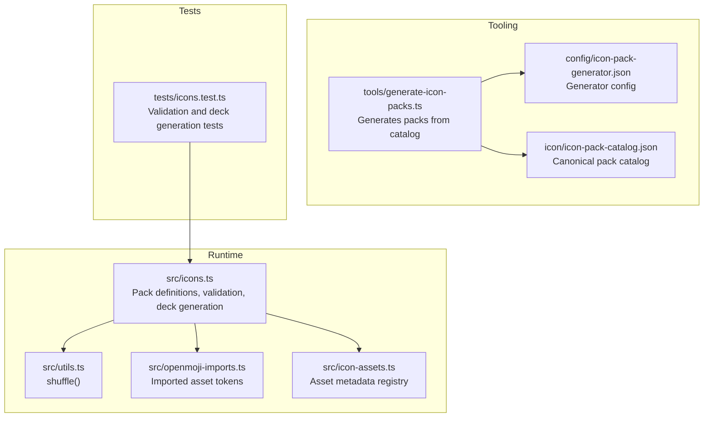
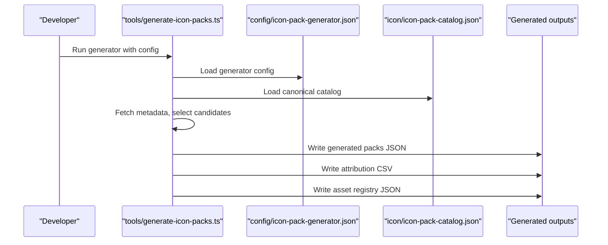
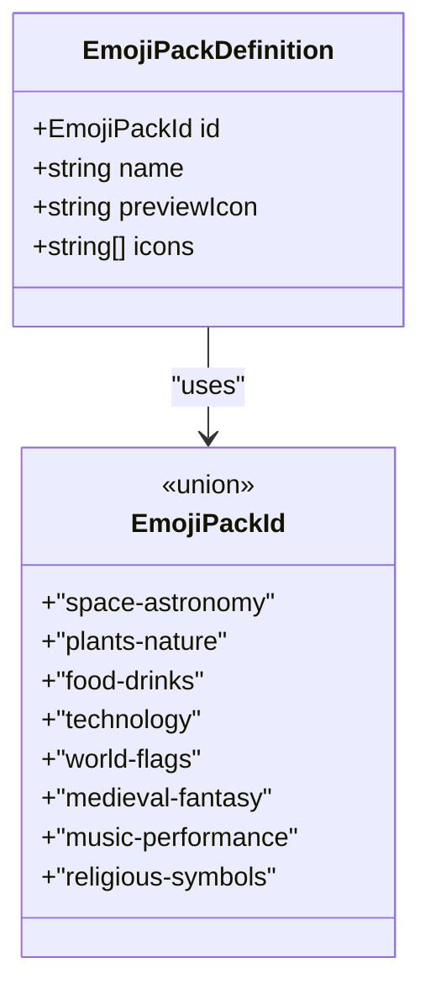
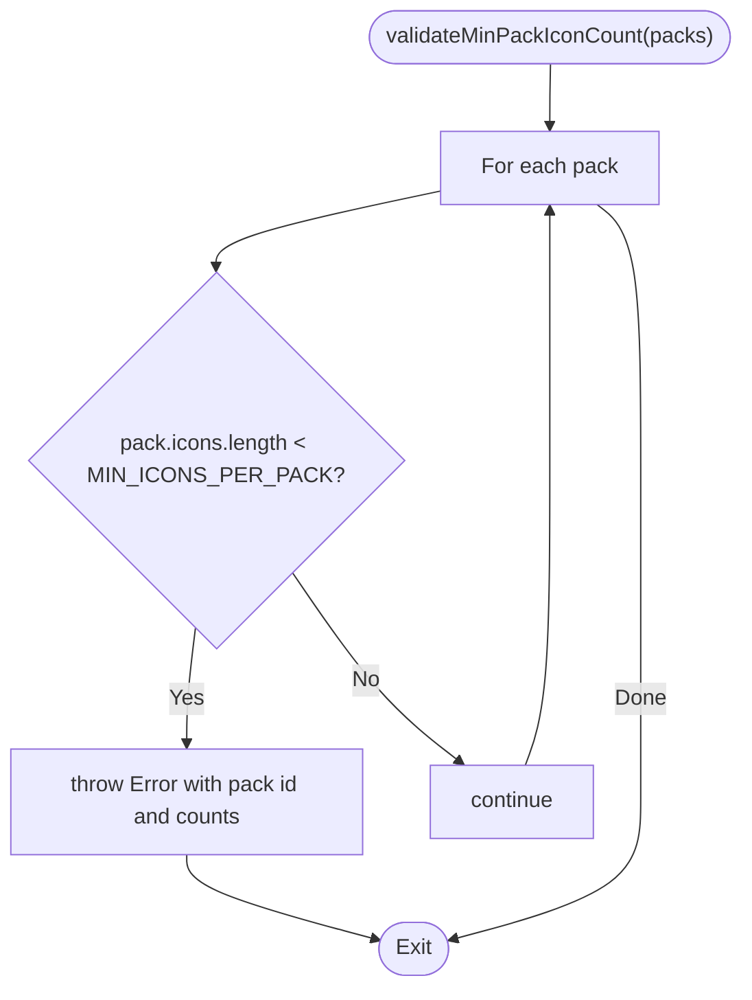
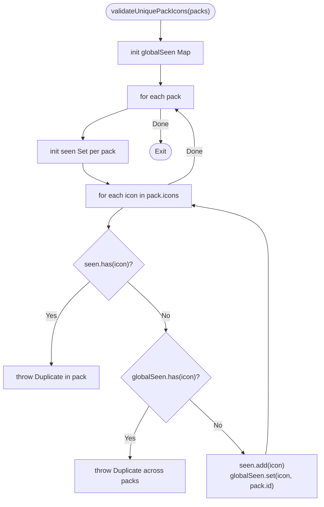
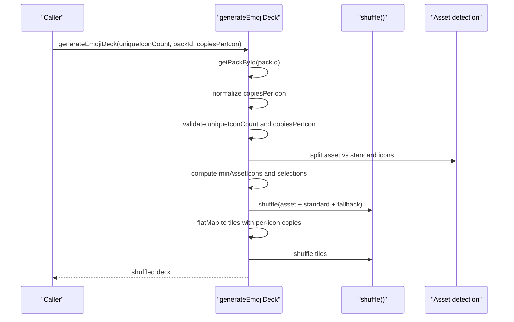
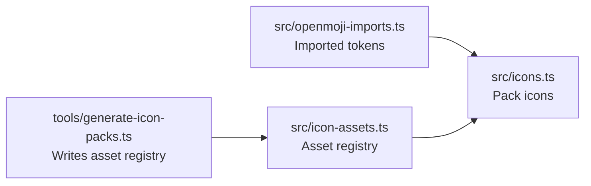
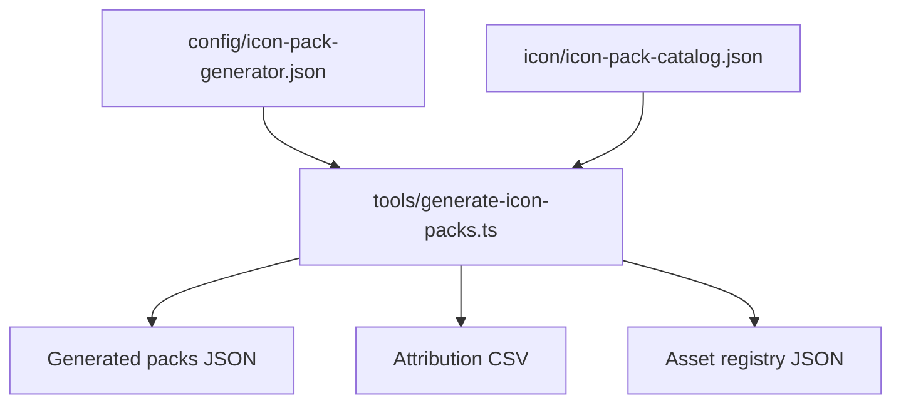
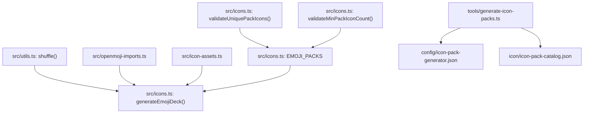

# Emoji Pack Management

<cite>
**Referenced Files in This Document**
- [src/icons.ts](file://src/icons.ts)
- [src/utils.ts](file://src/utils.ts)
- [src/openmoji-imports.ts](file://src/openmoji-imports.ts)
- [src/icon-assets.ts](file://src/icon-assets.ts)
- [config/icon-pack-generator.json](file://config/icon-pack-generator.json)
- [icon/icon-pack-catalog.json](file://icon/icon-pack-catalog.json)
- [tools/generate-icon-packs.ts](file://tools/generate-icon-packs.ts)
- [docs/icon-pack-generator.md](file://docs/icon-pack-generator.md)
- [tests/icons.test.ts](file://tests/icons.test.ts)
</cite>

## Table of Contents
1. [Introduction](#introduction)
2. [Project Structure](#project-structure)
3. [Core Components](#core-components)
4. [Architecture Overview](#architecture-overview)
5. [Detailed Component Analysis](#detailed-component-analysis)
6. [Dependency Analysis](#dependency-analysis)
7. [Performance Considerations](#performance-considerations)
8. [Troubleshooting Guide](#troubleshooting-guide)
9. [Conclusion](#conclusion)
10. [Appendices](#appendices)

## Introduction
This document explains the emoji pack management system used to define, validate, and generate themed icon decks for the game. It covers the EmojiPackDefinition interface, the MIN_ICONS_PER_PACK validation, the eight predefined icon packs, validation functions, and the deck generation algorithm. Practical examples demonstrate creating custom packs, implementing validation checks, and optimizing deck generation for different game modes. Performance considerations and memory management strategies are included for large icon sets.

## Project Structure
The emoji pack system spans several modules:
- Runtime pack definitions and generation logic live in src/icons.ts.
- Utility shuffling is provided by src/utils.ts.
- Imported OpenMoji assets are declared in src/openmoji-imports.ts and mapped in src/icon-assets.ts.
- Tooling for generating packs resides in tools/generate-icon-packs.ts with configuration in config/icon-pack-generator.json.
- The canonical catalog of packs is stored in icon/icon-pack-catalog.json.
- Tests in tests/icons.test.ts validate behavior and constraints.

**Diagram sources**
- [src/icons.ts:1-726](file://src/icons.ts#L1-L726)
- [src/utils.ts:1-145](file://src/utils.ts#L1-L145)
- [src/openmoji-imports.ts:1-199](file://src/openmoji-imports.ts#L1-L199)
- [src/icon-assets.ts:1-189](file://src/icon-assets.ts#L1-L189)
- [tools/generate-icon-packs.ts:1-474](file://tools/generate-icon-packs.ts#L1-L474)
- [config/icon-pack-generator.json:1-67](file://config/icon-pack-generator.json#L1-L67)
- [icon/icon-pack-catalog.json:1-474](file://icon/icon-pack-catalog.json#L1-L474)
- [tests/icons.test.ts:1-398](file://tests/icons.test.ts#L1-L398)

**Section sources**
- [src/icons.ts:1-726](file://src/icons.ts#L1-L726)
- [src/utils.ts:1-145](file://src/utils.ts#L1-L145)
- [src/openmoji-imports.ts:1-199](file://src/openmoji-imports.ts#L1-L199)
- [src/icon-assets.ts:1-189](file://src/icon-assets.ts#L1-L189)
- [tools/generate-icon-packs.ts:1-474](file://tools/generate-icon-packs.ts#L1-L474)
- [config/icon-pack-generator.json:1-67](file://config/icon-pack-generator.json#L1-L67)
- [icon/icon-pack-catalog.json:1-474](file://icon/icon-pack-catalog.json#L1-L474)
- [tests/icons.test.ts:1-398](file://tests/icons.test.ts#L1-L398)

## Core Components
- EmojiPackDefinition: Defines a thematic icon pack with id, name, preview icon, and immutable icon list.
- MIN_ICONS_PER_PACK: Enforces a minimum icon count per pack to support all difficulties.
- EMOJI_PACKS: The set of eight predefined packs, each with curated icons and asset tokens.
- Validation functions:
  - validateUniquePackIcons(): Ensures uniqueness within and across packs.
  - validateMinPackIconCount(): Enforces the minimum icon count per pack.
- Deck generation:
  - generateEmojiDeck(): Builds a shuffled deck from a selected pack with configurable copies per icon and asset coverage guarantees.

**Section sources**
- [src/icons.ts:17-528](file://src/icons.ts#L17-L528)
- [src/icons.ts:541-580](file://src/icons.ts#L541-L580)
- [src/icons.ts:652-725](file://src/icons.ts#L652-L725)

## Architecture Overview
The system separates concerns between:
- Pack definition and validation (runtime).
- Asset tokenization and metadata (runtime and tooling).
- Pack generation from catalogs (tooling).
- Deck composition and distribution (runtime).

**Diagram sources**
- [tools/generate-icon-packs.ts:351-467](file://tools/generate-icon-packs.ts#L351-L467)
- [config/icon-pack-generator.json:1-67](file://config/icon-pack-generator.json#L1-L67)
- [icon/icon-pack-catalog.json:1-474](file://icon/icon-pack-catalog.json#L1-L474)

## Detailed Component Analysis

### EmojiPackDefinition and Predefined Packs
- EmojiPackDefinition enforces immutability of icon lists and requires a stable id/type-safe identifier.
- Eight predefined packs are defined with curated themes:
  - Space & Astronomy
  - Biosphere
  - Food & Drinks
  - Technology
  - World Flags
  - Medieval Fantasy
  - Arts & Crafts
  - Religious Symbols
- Each pack includes emoji and/or asset tokens. Asset tokens are prefixed and resolved to SVG assets.

**Diagram sources**
- [src/icons.ts:17-22](file://src/icons.ts#L17-L22)
- [src/icons.ts:7-15](file://src/icons.ts#L7-L15)

**Section sources**
- [src/icons.ts:17-528](file://src/icons.ts#L17-L528)
- [icon/icon-pack-catalog.json:1-474](file://icon/icon-pack-catalog.json#L1-L474)

### MIN_ICONS_PER_PACK Validation
- MIN_ICONS_PER_PACK establishes a hard minimum to support the highest difficulty’s uniqueness policy.
- validateMinPackIconCount() iterates packs and throws on the first pack below the threshold, including pack id and counts in the error message.

**Diagram sources**
- [src/icons.ts:570-580](file://src/icons.ts#L570-L580)

**Section sources**
- [src/icons.ts:41](file://src/icons.ts#L41)
- [src/icons.ts:570-580](file://src/icons.ts#L570-L580)

### Unique Icon Validation
- validateUniquePackIcons() ensures:
  - No duplicates within a pack.
  - No duplicates across packs.
- It tracks seen icons globally and per pack, throwing descriptive errors with pack ids and the offending icon.

**Diagram sources**
- [src/icons.ts:541-568](file://src/icons.ts#L541-L568)

**Section sources**
- [src/icons.ts:541-568](file://src/icons.ts#L541-L568)

### Deck Generation Algorithm
- generateEmojiDeck(uniqueIconCount, packId, copiesPerIcon):
  - Selects a pack by id or falls back to the default pack.
  - Normalizes copiesPerIcon to a minimum of 2 per icon (pairs) and rounds fractional values.
  - Validates array length when a per-icon array is supplied.
  - Checks availability of icons in the pack; logs and throws if insufficient.
  - Separates asset tokens from standard emoji, selects a minimum proportion of asset tokens, and mixes them with standard icons.
  - Produces a flat list of tiles by repeating each selected icon the specified number of times.
  - Shuffles the resulting tiles before returning.

**Diagram sources**
- [src/icons.ts:652-725](file://src/icons.ts#L652-L725)
- [src/utils.ts:13-24](file://src/utils.ts#L13-L24)

**Section sources**
- [src/icons.ts:652-725](file://src/icons.ts#L652-L725)
- [src/utils.ts:13-24](file://src/utils.ts#L13-L24)

### Asset Tokenization and Registry
- Imported OpenMoji tokens are declared in src/openmoji-imports.ts and used within packs.
- Asset metadata is provided by src/icon-assets.ts, enabling resolution of asset paths and labels.
- The generator writes an asset registry mapping tokens to asset metadata.

**Diagram sources**
- [src/openmoji-imports.ts:1-199](file://src/openmoji-imports.ts#L1-L199)
- [src/icon-assets.ts:1-189](file://src/icon-assets.ts#L1-L189)
- [tools/generate-icon-packs.ts:426-431](file://tools/generate-icon-packs.ts#L426-L431)

**Section sources**
- [src/openmoji-imports.ts:1-199](file://src/openmoji-imports.ts#L1-L199)
- [src/icon-assets.ts:1-189](file://src/icon-assets.ts#L1-L189)
- [tools/generate-icon-packs.ts:426-431](file://tools/generate-icon-packs.ts#L426-L431)

### Generator Tooling and Catalog
- tools/generate-icon-packs.ts reads config/icon-pack-generator.json and icon/icon-pack-catalog.json.
- It selects emoji and SVG candidates based on keywords, ratios, and priorities, then writes generated packs and attribution.
- docs/icon-pack-generator.md describes how to run the generator locally.

**Diagram sources**
- [tools/generate-icon-packs.ts:351-467](file://tools/generate-icon-packs.ts#L351-L467)
- [config/icon-pack-generator.json:1-67](file://config/icon-pack-generator.json#L1-L67)
- [icon/icon-pack-catalog.json:1-474](file://icon/icon-pack-catalog.json#L1-L474)
- [docs/icon-pack-generator.md:1-43](file://docs/icon-pack-generator.md#L1-L43)

**Section sources**
- [tools/generate-icon-packs.ts:351-467](file://tools/generate-icon-packs.ts#L351-L467)
- [config/icon-pack-generator.json:1-67](file://config/icon-pack-generator.json#L1-L67)
- [icon/icon-pack-catalog.json:1-474](file://icon/icon-pack-catalog.json#L1-L474)
- [docs/icon-pack-generator.md:1-43](file://docs/icon-pack-generator.md#L1-L43)

## Dependency Analysis
- Runtime deck generation depends on:
  - Shuffle utility for randomness.
  - Asset token detection to balance asset and emoji icons.
  - Pack selection by id with fallback to the default pack.
- Validation functions depend on:
  - The canonical pack list and constants for thresholds.
- Generator depends on:
  - Config and catalog for pack definitions and keywords.
  - Metadata fetching and prioritization for SVG candidates.

**Diagram sources**
- [src/utils.ts:13-24](file://src/utils.ts#L13-L24)
- [src/icons.ts:652-725](file://src/icons.ts#L652-L725)
- [src/openmoji-imports.ts:1-199](file://src/openmoji-imports.ts#L1-L199)
- [src/icon-assets.ts:1-189](file://src/icon-assets.ts#L1-L189)
- [src/icons.ts:541-580](file://src/icons.ts#L541-L580)
- [tools/generate-icon-packs.ts:351-467](file://tools/generate-icon-packs.ts#L351-L467)
- [config/icon-pack-generator.json:1-67](file://config/icon-pack-generator.json#L1-L67)
- [icon/icon-pack-catalog.json:1-474](file://icon/icon-pack-catalog.json#L1-L474)

**Section sources**
- [src/icons.ts:652-725](file://src/icons.ts#L652-L725)
- [src/icons.ts:541-580](file://src/icons.ts#L541-L580)
- [src/utils.ts:13-24](file://src/utils.ts#L13-L24)
- [src/openmoji-imports.ts:1-199](file://src/openmoji-imports.ts#L1-L199)
- [src/icon-assets.ts:1-189](file://src/icon-assets.ts#L1-L189)
- [tools/generate-icon-packs.ts:351-467](file://tools/generate-icon-packs.ts#L351-L467)
- [config/icon-pack-generator.json:1-67](file://config/icon-pack-generator.json#L1-L67)
- [icon/icon-pack-catalog.json:1-474](file://icon/icon-pack-catalog.json#L1-L474)

## Performance Considerations
- Deck generation:
  - Uses a single pass to split asset and standard icons, then shuffles a combined selection. This minimizes allocations while maintaining diversity.
  - Rounds and clamps per-icon copies to integers to avoid repeated conversions during deck assembly.
  - Validates array lengths early to fail fast and reduce wasted computation.
- Memory management:
  - Operates on arrays and sets; avoid retaining large intermediate arrays longer than necessary.
  - For very large packs, consider precomputing asset vs standard splits and caching token membership checks.
- Asset coverage:
  - The algorithm guarantees a minimum proportion of asset tokens when present, balancing visual fidelity and performance.
- Shuffling cost:
  - The Fisher–Yates shuffle is linear-time and suitable for typical deck sizes. For extremely large decks, consider streaming shuffling or chunked processing if memory becomes a constraint.

[No sources needed since this section provides general guidance]

## Troubleshooting Guide
Common issues and resolutions:
- Not enough unique icons in a pack:
  - Symptom: Error indicating insufficient icons for the requested uniqueIconCount.
  - Resolution: Increase the pack’s icon count or reduce uniqueIconCount.
- Duplicate icons within or across packs:
  - Symptom: Error mentioning duplicate icon in pack or across packs.
  - Resolution: Remove duplicates or ensure each icon appears in only one pack.
- Copies array length mismatch:
  - Symptom: Error stating expected copy counts length differs from uniqueIconCount.
  - Resolution: Ensure the copiesPerIcon array length equals uniqueIconCount.
- Unrecognized pack id:
  - Behavior: Falls back to the default pack id.
  - Resolution: Verify the pack id exists in the canonical list.

**Section sources**
- [src/icons.ts:670-693](file://src/icons.ts#L670-L693)
- [src/icons.ts:541-568](file://src/icons.ts#L541-L568)
- [src/icons.ts:617-633](file://src/icons.ts#L617-L633)

## Conclusion
The emoji pack management system provides a robust, validated, and efficient mechanism for defining themed icon sets, enforcing quality constraints, and generating balanced decks. The separation between runtime logic and tooling enables iterative pack curation and asset integration while maintaining strong invariants for gameplay fairness and performance.

[No sources needed since this section summarizes without analyzing specific files]

## Appendices

### Practical Examples

- Creating a custom icon pack:
  - Define a new EmojiPackDefinition with a unique id, name, preview icon, and icons array.
  - Ensure icons are unique within and across packs.
  - Validate with validateUniquePackIcons() and validateMinPackIconCount().
  - Integrate asset tokens using the “asset:” prefix and ensure entries exist in the asset registry.

- Implementing validation checks:
  - Call validateUniquePackIcons() before exposing packs to the game.
  - Call validateMinPackIconCount() to enforce the minimum icon requirement.

- Optimizing deck generation for different game modes:
  - Adjust uniqueIconCount to control deck size.
  - Use a per-icon copies array to vary difficulty (e.g., some icons as pairs, others as triplets).
  - For large decks, consider precomputing asset selections and shuffling only the final tiles.

**Section sources**
- [src/icons.ts:541-580](file://src/icons.ts#L541-L580)
- [src/icons.ts:652-725](file://src/icons.ts#L652-L725)